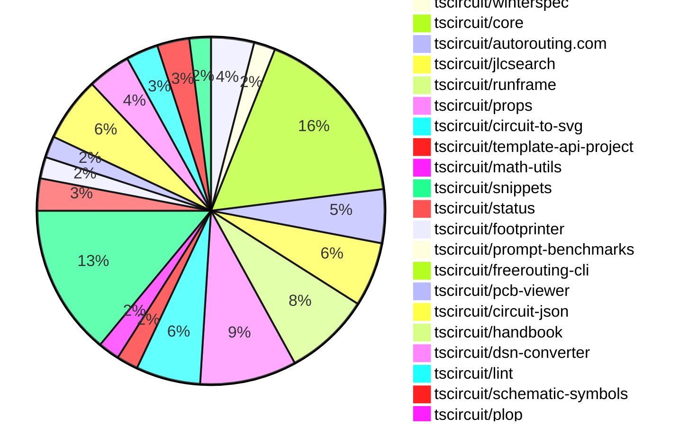

# Contribution Overview 2024-12-18

## PRs by Repository

## Contributor Overview

| Contributor | 🐳 Major | 🐙 Minor | 🐌 Tiny | ⭐ | Issues Created |
|-------------|---------|---------|---------|-----|----------------|
| [seveibar](#seveibar) | 8 | 21 | 1 | 👑👑 | 94 |
| [imrishabh18](#imrishabh18) | 0 | 14 | 1 | ⭐⭐⭐ | 20 |
| [ShiboSoftwareDev](#ShiboSoftwareDev) | 3 | 5 | 0 | ⭐⭐⭐ | 13 |
| [Abse2001](#Abse2001) | 0 | 10 | 0 | ⭐⭐ | 6 |
| [Anshgrover23](#Anshgrover23) | 2 | 9 | 0 | ⭐⭐ | 3 |
| [devin-ai-integration[bot]](#devin-ai-integration[bot]) | 2 | 8 | 1 | ⭐⭐ | 0 |
| [techmannih](#techmannih) | 2 | 8 | 0 | ⭐⭐ | 2 |
| [AnasSarkiz](#AnasSarkiz) | 1 | 3 | 0 | ⭐⭐ | 2 |
| [rohittcodes](#rohittcodes) | 0 | 3 | 0 | ⭐ | 3 |

## Review Table

[reviews-received-hover]: ## "Number of reviews received for PRs for this contributor"
[approvals-received-hover]: ## "Number of approvals received for PRs this contributor authored"
[rejections-received-hover]: ## "Number of rejections received for PRs this contributor authored"
[prs-opened-hover]: ## "Number of PRs opened by this contributor"
[issues-created-hover]: ## "Number of issues created by this contributor"
[bountied-issues-hover]: ## "Number of issues this contributor created with a bounty"
[bountied-issue-$-hover]: ## "Total bounty amount placed on issues authored by this contributor"

| Contributor | Reviews Received | Approvals Received | Rejections Received | PRs Opened | PRs Merged | Issues Created | Bountied Issues | Bountied Issue $ |
|---|---|---|---|---|---|---|---|---|
| [seveibar](#seveibar) | 1 | 1 | 0 | 32 | 31 | 94 | 36 | 807 |
| [AnasSarkiz](#AnasSarkiz) | 9 | 5 | 0 | 5 | 4 | 2 | 1 | 10 |
| [ShiboSoftwareDev](#ShiboSoftwareDev) | 17 | 9 | 1 | 9 | 8 | 13 | 5 | 210 |
| [Abse2001](#Abse2001) | 30 | 11 | 1 | 12 | 10 | 6 | 5 | 52 |
| [techmannih](#techmannih) | 39 | 13 | 12 | 17 | 10 | 2 | 0 | 0 |
| [Anshgrover23](#Anshgrover23) | 78 | 12 | 20 | 18 | 11 | 3 | 0 | 0 |
| [devin-ai-integration[bot]](#devin-ai-integration[bot]) | 13 | 9 | 3 | 22 | 12 | 0 | 0 | 0 |
| [rohittcodes](#rohittcodes) | 6 | 4 | 0 | 4 | 3 | 3 | 2 | 20 |
| [imrishabh18](#imrishabh18) | 13 | 7 | 0 | 17 | 15 | 20 | 7 | 100 |
| [karthik-nair-20](#karthik-nair-20) | 0 | 0 | 0 | 1 | 0 | 0 | 0 | 0 |
| [Niharika0104](#Niharika0104) | 2 | 0 | 1 | 1 | 0 | 1 | 0 | 0 |
| [DrSensor](#DrSensor) | 0 | 0 | 0 | 1 | 0 | 0 | 0 | 0 |

## Changes by Repository

### [tscircuit/schematic-viewer](https://github.com/tscircuit/schematic-viewer)

| PR # | Impact | Contributor | Description |
|------|--------|-------------|-------------|
| [#73](https://github.com/tscircuit/schematic-viewer/pull/73) | 🐳 Major | seveibar | Adds support for drag and drop editing of circuit components. |
| [#76](https://github.com/tscircuit/schematic-viewer/pull/76) | 🐙 Minor | seveibar | This pull request adds debug statements and ensures that the circuit JSON is up to date when computing the original center for the edit event. |
| [#75](https://github.com/tscircuit/schematic-viewer/pull/75) | 🐙 Minor | seveibar | Change tscircuit dependencies to peer deps to avoid dupes |
| [#74](https://github.com/tscircuit/schematic-viewer/pull/74) | 🐙 Minor | AnasSarkiz | Updated core and circuit-to-svg dependencies to fix the reference designator placement within the schematic component group. |

### [tscircuit/winterspec](https://github.com/tscircuit/winterspec)

| PR # | Impact | Contributor | Description |
|------|--------|-------------|-------------|
| [#25](https://github.com/tscircuit/winterspec/pull/25) | 🐳 Major | seveibar | Ports the CLI to Commander, adds lots of debug, and avoids bundleRequire when running in Bun. |
| [#24](https://github.com/tscircuit/winterspec/pull/24) | 🐙 Minor | seveibar | Adds middleware exports to the `src/middleware/index.ts` file. |

### [tscircuit/core](https://github.com/tscircuit/core)

| PR # | Impact | Contributor | Description |
|------|--------|-------------|-------------|
| [#456](https://github.com/tscircuit/core/pull/456) | 🐳 Major | seveibar | Renames the `Circuit` class to `RootCircuit` |
| [#455](https://github.com/tscircuit/core/pull/455) | 🐳 Major | seveibar | Adds support for schematic manual placements |
| [#459](https://github.com/tscircuit/core/pull/459) | 🐳 Major | Anshgrover23 | Adds a new transistor component to the circuit library. |
| [#457](https://github.com/tscircuit/core/pull/457) | 🐙 Minor | seveibar | Adds support for sending the display name to the autorouting server and minor improvements to the async expects. |
| [#448](https://github.com/tscircuit/core/pull/448) | 🐙 Minor | seveibar | Adds a new file "RENDERING_RULES_AND_GUIDELINES.md" that documents the rules and guidelines for rendering in the project. |
| [#447](https://github.com/tscircuit/core/pull/447) | 🐙 Minor | seveibar | Fixes the schematic component position for group offsets (for symbols) |
| [#439](https://github.com/tscircuit/core/pull/439) | 🐙 Minor | seveibar | Adds a function `applyEditEventsToManualEditsFile` to update the locations of schematic components in a manual edits file. |
| [#436](https://github.com/tscircuit/core/pull/436) | 🐙 Minor | seveibar | Rename the "eval_error" event to "external:evalError" |
| [#443](https://github.com/tscircuit/core/pull/443) | 🐙 Minor | AnasSarkiz | Changed the value of `schematic_component_id` of `component_name_text` to fix issue #152. |
| [#452](https://github.com/tscircuit/core/pull/452) | 🐙 Minor | ShiboSoftwareDev | Updates the versions of "schematic-symbols" and "circuit-to-svg" dependencies. |
| [#444](https://github.com/tscircuit/core/pull/444) | 🐙 Minor | Abse2001 | Adds ccw_rotation property to SilkscreenText component |
| [#424](https://github.com/tscircuit/core/pull/424) | 🐙 Minor | techmannih | Set up continuous branch release with pkg-pr-new |
| [#428](https://github.com/tscircuit/core/pull/428) | 🐙 Minor | techmannih | Adds a new component called SilkscreenLine to the library, which allows for the creation of silkscreen lines on a PCB. |
| [#449](https://github.com/tscircuit/core/pull/449) | 🐙 Minor | imrishabh18 | The pull request adds a new test case to check the transform for a connected resistor and capacitor inside a group. |
| [#437](https://github.com/tscircuit/core/pull/437) | 🐙 Minor | imrishabh18 | Updates the lockfile to fix a publish issue. |
| [#430](https://github.com/tscircuit/core/pull/430) | 🐙 Minor | imrishabh18 | Adds a new event type "eval_error" to the Circuit class. |
| [#458](https://github.com/tscircuit/core/pull/458) | 🐌 Tiny | seveibar | Add an export for `Circuit` for backwards compatibility |

### [tscircuit/autorouting.com](https://github.com/tscircuit/autorouting.com)

| PR # | Impact | Contributor | Description |
|------|--------|-------------|-------------|
| [#4](https://github.com/tscircuit/autorouting.com/pull/4) | 🐳 Major | seveibar |  |
| [#2](https://github.com/tscircuit/autorouting.com/pull/2) | 🟣 | seveibar | Overhaul in preparation for API, Datasets and Autorouters Tab |
| [#12](https://github.com/tscircuit/autorouting.com/pull/12) | 🐙 Minor | ShiboSoftwareDev | Removed the "force-dynamic" setting from various pages, as dynamic routes cannot be prerendered. |
| [#10](https://github.com/tscircuit/autorouting.com/pull/10) | 🐙 Minor | Anshgrover23 | Automatically retries sample uploads up to 3 times on failure |
| [#9](https://github.com/tscircuit/autorouting.com/pull/9) | 🐙 Minor | Anshgrover23 | Adds a regular progress bar to the ContributeProcessingStep component |

### [tscircuit/jlcsearch](https://github.com/tscircuit/jlcsearch)

| PR # | Impact | Contributor | Description |
|------|--------|-------------|-------------|
| [#5](https://github.com/tscircuit/jlcsearch/pull/5) | 🐳 Major | seveibar | Adds a new LED driver table and API endpoint to the application. |
| [#3](https://github.com/tscircuit/jlcsearch/pull/3) | 🐳 Major | seveibar | Adds new GitHub Actions workflows for format checking, type checking, and testing with caching setup for test database |
| [#12](https://github.com/tscircuit/jlcsearch/pull/12) | 🐳 Major | Anshgrover23 | Adds a new derived table for MOSFET components, including various attributes like package, drain-source voltage, continuous drain current, gate threshold voltage, power dissipation, operating temperature range, and mounting style. |
| [#11](https://github.com/tscircuit/jlcsearch/pull/11) | 🐙 Minor | devin-ai-integration[bot] | Adds a search functionality to the components/list route, allowing users to search for components by description, manufacturer, or LCSC code. |
| [#6](https://github.com/tscircuit/jlcsearch/pull/6) | 🟣 | devin-ai-integration[bot] |  |
| [#4](https://github.com/tscircuit/jlcsearch/pull/4) | 🐳 Major | devin-ai-integration[bot] |  |

### [tscircuit/runframe](https://github.com/tscircuit/runframe)

| PR # | Impact | Contributor | Description |
|------|--------|-------------|-------------|
| [#52](https://github.com/tscircuit/runframe/pull/52) | 🐳 Major | seveibar | Adds support for schematic drag'n'drop with filesystem syncing via the @tscircuit/file-server. |
| [#60](https://github.com/tscircuit/runframe/pull/60) | 🐙 Minor | seveibar | Fix an issue with the `fsMap` prop in the `RunFrame` component. |
| [#48](https://github.com/tscircuit/runframe/pull/48) | 🐙 Minor | seveibar | Add a left-side header content prop to the `CircuitJsonPreview` and `RunFrame` components, allowing users to place custom content such as a save button, run button, or title. |
| [#46](https://github.com/tscircuit/runframe/pull/46) | 🐙 Minor | imrishabh18 | Reverts changes that were causing issues with the Tailwind CSS configuration and restores the CDN script for Tailwind in the HTML file. |
| [#43](https://github.com/tscircuit/runframe/pull/43) | 🐙 Minor | imrishabh18 | Fixes the Tailwind CSS dark mode issue by removing the CDN, updating the Tailwind configuration, and generating the CSS through the build script. |
| [#45](https://github.com/tscircuit/runframe/pull/45) | 🐙 Minor | imrishabh18 | Workflow update to add the generated style CSS in Git |
| [#44](https://github.com/tscircuit/runframe/pull/44) | 🐙 Minor | imrishabh18 | Updates the version of the package from 0.0.1 to 0.0.12. |
| [#19](https://github.com/tscircuit/runframe/pull/19) | 🐙 Minor | imrishabh18 | Add error handling to the RunFrame component to show the error message in the tab. |

### [tscircuit/props](https://github.com/tscircuit/props)

| PR # | Impact | Contributor | Description |
|------|--------|-------------|-------------|
| [#133](https://github.com/tscircuit/props/pull/133) | 🐳 Major | devin-ai-integration[bot] | Adds a new MOSFET component with a channelType prop and comprehensive test suite. |
| [#129](https://github.com/tscircuit/props/pull/129) | 🐙 Minor | seveibar | Update the type of `manualEdits` property in `SubcircuitGroupProps` to use `ManualEditsFileInput` instead of `ManualEditFile`. |
| [#121](https://github.com/tscircuit/props/pull/121) | 🐙 Minor | seveibar | Fixes exports to include manual edit events and improves the consistency of edit event type property for PCB trace hints. |
| [#119](https://github.com/tscircuit/props/pull/119) | 🐙 Minor | techmannih | Add resonator component props with type definitions and validation. |
| [#125](https://github.com/tscircuit/props/pull/125) | 🐙 Minor | Anshgrover23 | Adds a new component `transistor` with associated props and type definitions. |
| [#131](https://github.com/tscircuit/props/pull/131) | 🐙 Minor | Anshgrover23 | Fixes the `pinVariant` property of the `ResonatorProps` interface, allowing for more than just the "3pin" variant and adding support for "no_ground", "ground_pin", and "two_ground_pins" variants. |
| [#135](https://github.com/tscircuit/props/pull/135) | 🐙 Minor | devin-ai-integration[bot] | This pull request adds an automated script to generate documentation for manual edit events and files. |
| [#124](https://github.com/tscircuit/props/pull/124) | 🐙 Minor | devin-ai-integration[bot] | Rename the `manual_edit_file` module to `manual_edits_file` for consistency with the interface name `ManualEditsFile`. |
| [#122](https://github.com/tscircuit/props/pull/122) | 🐙 Minor | devin-ai-integration[bot] | Adds TypeScript interface definition for ManualEditsFile to match existing Zod schema |

### [tscircuit/circuit-to-svg](https://github.com/tscircuit/circuit-to-svg)

| PR # | Impact | Contributor | Description |
|------|--------|-------------|-------------|
| [#151](https://github.com/tscircuit/circuit-to-svg/pull/151) | 🐙 Minor | seveibar | The pull request adds support for computing the schematic transform and placing it on the SVG as a `data-real-to-screen-transform` attribute. |
| [#150](https://github.com/tscircuit/circuit-to-svg/pull/150) | 🐙 Minor | seveibar | Add data-circuit-json-type and data-schematic-trace-id properties to the SVG object representing a schematic trace. |
| [#153](https://github.com/tscircuit/circuit-to-svg/pull/153) | 🐙 Minor | AnasSarkiz | Added `sch_componet_name` and `MPN` to the `createSvgObjectsFromSchematicComponentWithBox` function. |
| [#156](https://github.com/tscircuit/circuit-to-svg/pull/156) | 🐙 Minor | ShiboSoftwareDev | Update the "@tscircuit/core" dependency to version "^0.0.239" |
| [#155](https://github.com/tscircuit/circuit-to-svg/pull/155) | 🐙 Minor | ShiboSoftwareDev | Fixed the symbol text position to adjust for large schematic symbols. |
| [#158](https://github.com/tscircuit/circuit-to-svg/pull/158) | 🐙 Minor | Abse2001 | Fixes the position of the ground label symbol text. |

### [tscircuit/template-api-project](https://github.com/tscircuit/template-api-project)

| PR # | Impact | Contributor | Description |
|------|--------|-------------|-------------|
| [#3](https://github.com/tscircuit/template-api-project/pull/3) | 🐙 Minor | seveibar | Adds GitHub Actions workflows for format checking and type checking using Bun. |
| [#2](https://github.com/tscircuit/template-api-project/pull/2) | 🐙 Minor | seveibar | Adds the `@electric-sql/pglite` and `kysely-pglite` dependencies, and modifies the `get-test-database.ts` and `start-server.ts` files to use the `pglite` library for database management. |

### [tscircuit/math-utils](https://github.com/tscircuit/math-utils)

| PR # | Impact | Contributor | Description |
|------|--------|-------------|-------------|
| [#3](https://github.com/tscircuit/math-utils/pull/3) | 🐙 Minor | seveibar | The pull request adds new grid capabilities, including the ability to center the grid and adjust the Y-direction of the coordinate system. |
| [#2](https://github.com/tscircuit/math-utils/pull/2) | 🐙 Minor | seveibar | Add support for grid function |

### [tscircuit/snippets](https://github.com/tscircuit/snippets)

| PR # | Impact | Contributor | Description |
|------|--------|-------------|-------------|
| [#423](https://github.com/tscircuit/snippets/pull/423) | 🐳 Major | ShiboSoftwareDev | Imports snippets from the registry to the development server. |
| [#343](https://github.com/tscircuit/snippets/pull/343) | 🐳 Major | techmannih | Add a new template for a blinking LED board. |
| [#430](https://github.com/tscircuit/snippets/pull/430) | 🐙 Minor | seveibar | Add circuit name for better logs on autorouting server |
| [#416](https://github.com/tscircuit/snippets/pull/416) | 🐙 Minor | seveibar | Reverts a previous change that caused a bug where an error was shown on every snippet. |
| [#419](https://github.com/tscircuit/snippets/pull/419) | 🐙 Minor | Abse2001 | Added a new snippet example for the Arduino Nano Servo Breakout Board. |
| [#407](https://github.com/tscircuit/snippets/pull/407) | 🐙 Minor | techmannih | Update the blinking LED circuit template with changes to the board size and component pin connections. |
| [#431](https://github.com/tscircuit/snippets/pull/431) | 🐙 Minor | Anshgrover23 | Fix for the `playwright-tests` suite, which was failing due to various issues with element selectors and timeouts. |
| [#422](https://github.com/tscircuit/snippets/pull/422) | 🐙 Minor | Anshgrover23 | Adds `waitForLoadState` to `view-snippet.spec.ts` test to ensure proper loading of the page and elements before taking screenshots. |
| [#406](https://github.com/tscircuit/snippets/pull/406) | 🐙 Minor | rohittcodes | Adds a feature to edit the description of a snippet. |
| [#386](https://github.com/tscircuit/snippets/pull/386) | 🐙 Minor | rohittcodes | Adds an error button and dialog to handle the case when manual edits are not imported in the `index.tsx` file. |
| [#398](https://github.com/tscircuit/snippets/pull/398) | 🐙 Minor | devin-ai-integration[bot] | Adds a new template for creating a USB-C powered LED flashlight circuit with a push button control. |
| [#417](https://github.com/tscircuit/snippets/pull/417) | 🐙 Minor | imrishabh18 | Fix importing empty file for manual-edits |
| [#413](https://github.com/tscircuit/snippets/pull/413) | 🐙 Minor | imrishabh18 | Fix the issue where the manual edit template was not getting imported, causing an error in the Eval import due to an empty string. |
| [#393](https://github.com/tscircuit/snippets/pull/393) | 🐌 Tiny | imrishabh18 | Update the `@tscircuit/pcb-viewer` dependency to version `1.10.22`. |

### [tscircuit/status](https://github.com/tscircuit/status)

| PR # | Impact | Contributor | Description |
|------|--------|-------------|-------------|
| [#6](https://github.com/tscircuit/status/pull/6) | 🐙 Minor | seveibar | Filter outages shorter than 15 minutes to prevent flaky health checks from listing. |
| [#8](https://github.com/tscircuit/status/pull/8) | 🐙 Minor | devin-ai-integration[bot] | Improve the display of outage durations to make them more human-readable. |
| [#5](https://github.com/tscircuit/status/pull/5) | 🐙 Minor | devin-ai-integration[bot] | Improve timestamp sorting and add detailed timestamps to tooltips for status bars |

### [tscircuit/footprinter](https://github.com/tscircuit/footprinter)

| PR # | Impact | Contributor | Description |
|------|--------|-------------|-------------|
| [#98](https://github.com/tscircuit/footprinter/pull/98) | 🐳 Major | AnasSarkiz | Introduced a new footprint type called `breakoutheaders` |
| [#100](https://github.com/tscircuit/footprinter/pull/100) | 🐙 Minor | devin-ai-integration[bot] | Fix inner/outer diameter ratio in DIP footprint to match recommended 1.5mm outer diameter. |

### [tscircuit/prompt-benchmarks](https://github.com/tscircuit/prompt-benchmarks)

| PR # | Impact | Contributor | Description |
|------|--------|-------------|-------------|
| [#12](https://github.com/tscircuit/prompt-benchmarks/pull/12) | 🐳 Major | ShiboSoftwareDev | Refactored the `evalite` benchmark to use a new architecture suggested by Matt. |

### [tscircuit/freerouting-cli](https://github.com/tscircuit/freerouting-cli)

| PR # | Impact | Contributor | Description |
|------|--------|-------------|-------------|
| [#5](https://github.com/tscircuit/freerouting-cli/pull/5) | 🐳 Major | ShiboSoftwareDev | Introduces a Docker-based test suite for the freerouting CLI, including tests for creating sessions, jobs, and handling system status and configuration. |

### [tscircuit/pcb-viewer](https://github.com/tscircuit/pcb-viewer)

| PR # | Impact | Contributor | Description |
|------|--------|-------------|-------------|
| [#100](https://github.com/tscircuit/pcb-viewer/pull/100) | 🐙 Minor | ShiboSoftwareDev | The pull request adds the ability to display lines between the closest ports in the "rat's nest" overlay, with dashed lines for ports that are part of a net. |
| [#99](https://github.com/tscircuit/pcb-viewer/pull/99) | 🐙 Minor | Abse2001 | Implemented silkscreen text rotation and added a Storybook test. |

### [tscircuit/circuit-json](https://github.com/tscircuit/circuit-json)

| PR # | Impact | Contributor | Description |
|------|--------|-------------|-------------|
| [#101](https://github.com/tscircuit/circuit-json/pull/101) | 🐙 Minor | Abse2001 | Added a new optional property `ccw_rotation` to the `PcbSilkscreenText` type. |
| [#105](https://github.com/tscircuit/circuit-json/pull/105) | 🐙 Minor | techmannih | Add a new type of PCB plated hole, "PcbHoleCircularWithRectPad", which represents a plated hole with a circular shape and a rectangular pad. |
| [#103](https://github.com/tscircuit/circuit-json/pull/103) | 🐙 Minor | Anshgrover23 | Adds a new simple transistor component to the circuit element library. |
| [#108](https://github.com/tscircuit/circuit-json/pull/108) | 🐙 Minor | Anshgrover23 | Add a linting script to the CI that checks for Zod linting issues. |
| [#102](https://github.com/tscircuit/circuit-json/pull/102) | 🐙 Minor | Anshgrover23 | Implemented a new circuit element called "source_simple_resonator". |
| [#100](https://github.com/tscircuit/circuit-json/pull/100) | 🐙 Minor | rohittcodes | Adds parsing support for "KΩ" and "KV" SI unit suffixes. |

### [tscircuit/handbook](https://github.com/tscircuit/handbook)

| PR # | Impact | Contributor | Description |
|------|--------|-------------|-------------|
| [#4](https://github.com/tscircuit/handbook/pull/4) | 🐙 Minor | Abse2001 | Added a tutorial for using `yalc` for local development. |

### [tscircuit/dsn-converter](https://github.com/tscircuit/dsn-converter)

| PR # | Impact | Contributor | Description |
|------|--------|-------------|-------------|
| [#72](https://github.com/tscircuit/dsn-converter/pull/72) | 🐙 Minor | Abse2001 | Added support for the format used by the Smoothie Board in the DSN parser. |
| [#71](https://github.com/tscircuit/dsn-converter/pull/71) | 🐙 Minor | Abse2001 | The pull request changes the behavior of the `processPin` and `processVis` functions to handle cases where the input nodes do not parse correctly. Instead of throwing errors, the functions now log a warning to the console and return null. |
| [#74](https://github.com/tscircuit/dsn-converter/pull/74) | 🐙 Minor | imrishabh18 | Fix to prevent duplicate plated holes with the same pin number |
| [#73](https://github.com/tscircuit/dsn-converter/pull/73) | 🐙 Minor | imrishabh18 | Ensures proper linkage between `source_trace` and `pcb_traces` in the DSN session converter |

### [tscircuit/lint](https://github.com/tscircuit/lint)

| PR # | Impact | Contributor | Description |
|------|--------|-------------|-------------|
| [#7](https://github.com/tscircuit/lint/pull/7) | 🐙 Minor | Abse2001 | Added a new rule to enforce the context-passing pattern for functions with two parameters. |
| [#1](https://github.com/tscircuit/lint/pull/1) | 🐙 Minor | Abse2001 | The pull request introduces a new ESLint plugin for the TSCircuit project, including two custom rules: "banned-words" to prevent the use of generic variable names, and "two-params" to enforce a maximum of two parameters in functions. |
| [#5](https://github.com/tscircuit/lint/pull/5) | 🐙 Minor | techmannih | Adds a new linter tool `tscircuit-lint` to the project, which can be executed via the `tscircuit-lint` command. |

### [tscircuit/schematic-symbols](https://github.com/tscircuit/schematic-symbols)

| PR # | Impact | Contributor | Description |
|------|--------|-------------|-------------|
| [#229](https://github.com/tscircuit/schematic-symbols/pull/229) | 🐳 Major | techmannih | Adds a new DPDT (Double-Pole Double-Throw) switch symbol to the project. |
| [#227](https://github.com/tscircuit/schematic-symbols/pull/227) | 🐙 Minor | techmannih | Fixes the text anchor positions for the reference and value labels on the capacitor-right symbol. |
| [#228](https://github.com/tscircuit/schematic-symbols/pull/228) | 🐙 Minor | techmannih | Fix anchors on resonator |

### [tscircuit/plop](https://github.com/tscircuit/plop)

| PR # | Impact | Contributor | Description |
|------|--------|-------------|-------------|
| [#6](https://github.com/tscircuit/plop/pull/6) | 🐌 Tiny | devin-ai-integration[bot] | Disables the `noArrayIndexKey` lint rule in the biome.json configuration. |

### [tscircuit/eval-webworker](https://github.com/tscircuit/eval-webworker)

| PR # | Impact | Contributor | Description |
|------|--------|-------------|-------------|
| [#42](https://github.com/tscircuit/eval-webworker/pull/42) | 🐙 Minor | imrishabh18 | Reverts the change to remove the `emitError` function from the `webWorkerApi` object. |
| [#33](https://github.com/tscircuit/eval-webworker/pull/33) | 🐙 Minor | imrishabh18 | Adds an `emitError` function to the `InternalWebWorkerApi` interface and the `webWorkerApi` object to emit errors during code evaluation. |

## Changes by Contributor

### [seveibar](https://github.com/seveibar)

| PR # | Impact | Description |
|------|--------|-------------|
| [#73](https://github.com/tscircuit/schematic-viewer/pull/73) | 🐳 Major | Adds support for drag and drop editing of circuit components. |
| [#25](https://github.com/tscircuit/winterspec/pull/25) | 🐳 Major | Ports the CLI to Commander, adds lots of debug, and avoids bundleRequire when running in Bun. |
| [#456](https://github.com/tscircuit/core/pull/456) | 🐳 Major | Renames the `Circuit` class to `RootCircuit` |
| [#455](https://github.com/tscircuit/core/pull/455) | 🐳 Major | Adds support for schematic manual placements |
| [#4](https://github.com/tscircuit/autorouting.com/pull/4) | 🐳 Major |  |
| [#5](https://github.com/tscircuit/jlcsearch/pull/5) | 🐳 Major | Adds a new LED driver table and API endpoint to the application. |
| [#3](https://github.com/tscircuit/jlcsearch/pull/3) | 🐳 Major | Adds new GitHub Actions workflows for format checking, type checking, and testing with caching setup for test database |
| [#52](https://github.com/tscircuit/runframe/pull/52) | 🐳 Major | Adds support for schematic drag'n'drop with filesystem syncing via the @tscircuit/file-server. |
| [#76](https://github.com/tscircuit/schematic-viewer/pull/76) | 🐙 Minor | This pull request adds debug statements and ensures that the circuit JSON is up to date when computing the original center for the edit event. |
| [#75](https://github.com/tscircuit/schematic-viewer/pull/75) | 🐙 Minor | Change tscircuit dependencies to peer deps to avoid dupes |
| [#129](https://github.com/tscircuit/props/pull/129) | 🐙 Minor | Update the type of `manualEdits` property in `SubcircuitGroupProps` to use `ManualEditsFileInput` instead of `ManualEditFile`. |
| [#121](https://github.com/tscircuit/props/pull/121) | 🐙 Minor | Fixes exports to include manual edit events and improves the consistency of edit event type property for PCB trace hints. |
| [#24](https://github.com/tscircuit/winterspec/pull/24) | 🐙 Minor | Adds middleware exports to the `src/middleware/index.ts` file. |
| [#457](https://github.com/tscircuit/core/pull/457) | 🐙 Minor | Adds support for sending the display name to the autorouting server and minor improvements to the async expects. |
| [#448](https://github.com/tscircuit/core/pull/448) | 🐙 Minor | Adds a new file "RENDERING_RULES_AND_GUIDELINES.md" that documents the rules and guidelines for rendering in the project. |
| [#447](https://github.com/tscircuit/core/pull/447) | 🐙 Minor | Fixes the schematic component position for group offsets (for symbols) |
| [#439](https://github.com/tscircuit/core/pull/439) | 🐙 Minor | Adds a function `applyEditEventsToManualEditsFile` to update the locations of schematic components in a manual edits file. |
| [#436](https://github.com/tscircuit/core/pull/436) | 🐙 Minor | Rename the "eval_error" event to "external:evalError" |
| [#151](https://github.com/tscircuit/circuit-to-svg/pull/151) | 🐙 Minor | The pull request adds support for computing the schematic transform and placing it on the SVG as a `data-real-to-screen-transform` attribute. |
| [#150](https://github.com/tscircuit/circuit-to-svg/pull/150) | 🐙 Minor | Add data-circuit-json-type and data-schematic-trace-id properties to the SVG object representing a schematic trace. |
| [#458](https://github.com/tscircuit/core/pull/458) | 🐌 Tiny | Add an export for `Circuit` for backwards compatibility |
| [#2](https://github.com/tscircuit/autorouting.com/pull/2) | 🟣 | Overhaul in preparation for API, Datasets and Autorouters Tab |
| [#3](https://github.com/tscircuit/template-api-project/pull/3) | 🐙 Minor | Adds GitHub Actions workflows for format checking and type checking using Bun. |
| [#2](https://github.com/tscircuit/template-api-project/pull/2) | 🐙 Minor | Adds the `@electric-sql/pglite` and `kysely-pglite` dependencies, and modifies the `get-test-database.ts` and `start-server.ts` files to use the `pglite` library for database management. |
| [#3](https://github.com/tscircuit/math-utils/pull/3) | 🐙 Minor | The pull request adds new grid capabilities, including the ability to center the grid and adjust the Y-direction of the coordinate system. |
| [#2](https://github.com/tscircuit/math-utils/pull/2) | 🐙 Minor | Add support for grid function |
| [#430](https://github.com/tscircuit/snippets/pull/430) | 🐙 Minor | Add circuit name for better logs on autorouting server |
| [#416](https://github.com/tscircuit/snippets/pull/416) | 🐙 Minor | Reverts a previous change that caused a bug where an error was shown on every snippet. |
| [#6](https://github.com/tscircuit/status/pull/6) | 🐙 Minor | Filter outages shorter than 15 minutes to prevent flaky health checks from listing. |
| [#60](https://github.com/tscircuit/runframe/pull/60) | 🐙 Minor | Fix an issue with the `fsMap` prop in the `RunFrame` component. |
| [#48](https://github.com/tscircuit/runframe/pull/48) | 🐙 Minor | Add a left-side header content prop to the `CircuitJsonPreview` and `RunFrame` components, allowing users to place custom content such as a save button, run button, or title. |

### [AnasSarkiz](https://github.com/AnasSarkiz)

| PR # | Impact | Description |
|------|--------|-------------|
| [#98](https://github.com/tscircuit/footprinter/pull/98) | 🐳 Major | Introduced a new footprint type called `breakoutheaders` |
| [#74](https://github.com/tscircuit/schematic-viewer/pull/74) | 🐙 Minor | Updated core and circuit-to-svg dependencies to fix the reference designator placement within the schematic component group. |
| [#443](https://github.com/tscircuit/core/pull/443) | 🐙 Minor | Changed the value of `schematic_component_id` of `component_name_text` to fix issue #152. |
| [#153](https://github.com/tscircuit/circuit-to-svg/pull/153) | 🐙 Minor | Added `sch_componet_name` and `MPN` to the `createSvgObjectsFromSchematicComponentWithBox` function. |

### [ShiboSoftwareDev](https://github.com/ShiboSoftwareDev)

| PR # | Impact | Description |
|------|--------|-------------|
| [#423](https://github.com/tscircuit/snippets/pull/423) | 🐳 Major | Imports snippets from the registry to the development server. |
| [#12](https://github.com/tscircuit/prompt-benchmarks/pull/12) | 🐳 Major | Refactored the `evalite` benchmark to use a new architecture suggested by Matt. |
| [#5](https://github.com/tscircuit/freerouting-cli/pull/5) | 🐳 Major | Introduces a Docker-based test suite for the freerouting CLI, including tests for creating sessions, jobs, and handling system status and configuration. |
| [#100](https://github.com/tscircuit/pcb-viewer/pull/100) | 🐙 Minor | The pull request adds the ability to display lines between the closest ports in the "rat's nest" overlay, with dashed lines for ports that are part of a net. |
| [#452](https://github.com/tscircuit/core/pull/452) | 🐙 Minor | Updates the versions of "schematic-symbols" and "circuit-to-svg" dependencies. |
| [#156](https://github.com/tscircuit/circuit-to-svg/pull/156) | 🐙 Minor | Update the "@tscircuit/core" dependency to version "^0.0.239" |
| [#155](https://github.com/tscircuit/circuit-to-svg/pull/155) | 🐙 Minor | Fixed the symbol text position to adjust for large schematic symbols. |
| [#12](https://github.com/tscircuit/autorouting.com/pull/12) | 🐙 Minor | Removed the "force-dynamic" setting from various pages, as dynamic routes cannot be prerendered. |

### [Abse2001](https://github.com/Abse2001)

| PR # | Impact | Description |
|------|--------|-------------|
| [#99](https://github.com/tscircuit/pcb-viewer/pull/99) | 🐙 Minor | Implemented silkscreen text rotation and added a Storybook test. |
| [#101](https://github.com/tscircuit/circuit-json/pull/101) | 🐙 Minor | Added a new optional property `ccw_rotation` to the `PcbSilkscreenText` type. |
| [#444](https://github.com/tscircuit/core/pull/444) | 🐙 Minor | Adds ccw_rotation property to SilkscreenText component |
| [#158](https://github.com/tscircuit/circuit-to-svg/pull/158) | 🐙 Minor | Fixes the position of the ground label symbol text. |
| [#4](https://github.com/tscircuit/handbook/pull/4) | 🐙 Minor | Added a tutorial for using `yalc` for local development. |
| [#72](https://github.com/tscircuit/dsn-converter/pull/72) | 🐙 Minor | Added support for the format used by the Smoothie Board in the DSN parser. |
| [#71](https://github.com/tscircuit/dsn-converter/pull/71) | 🐙 Minor | The pull request changes the behavior of the `processPin` and `processVis` functions to handle cases where the input nodes do not parse correctly. Instead of throwing errors, the functions now log a warning to the console and return null. |
| [#419](https://github.com/tscircuit/snippets/pull/419) | 🐙 Minor | Added a new snippet example for the Arduino Nano Servo Breakout Board. |
| [#7](https://github.com/tscircuit/lint/pull/7) | 🐙 Minor | Added a new rule to enforce the context-passing pattern for functions with two parameters. |
| [#1](https://github.com/tscircuit/lint/pull/1) | 🐙 Minor | The pull request introduces a new ESLint plugin for the TSCircuit project, including two custom rules: "banned-words" to prevent the use of generic variable names, and "two-params" to enforce a maximum of two parameters in functions. |

### [techmannih](https://github.com/techmannih)

| PR # | Impact | Description |
|------|--------|-------------|
| [#229](https://github.com/tscircuit/schematic-symbols/pull/229) | 🐳 Major | Adds a new DPDT (Double-Pole Double-Throw) switch symbol to the project. |
| [#343](https://github.com/tscircuit/snippets/pull/343) | 🐳 Major | Add a new template for a blinking LED board. |
| [#105](https://github.com/tscircuit/circuit-json/pull/105) | 🐙 Minor | Add a new type of PCB plated hole, "PcbHoleCircularWithRectPad", which represents a plated hole with a circular shape and a rectangular pad. |
| [#119](https://github.com/tscircuit/props/pull/119) | 🐙 Minor | Add resonator component props with type definitions and validation. |
| [#424](https://github.com/tscircuit/core/pull/424) | 🐙 Minor | Set up continuous branch release with pkg-pr-new |
| [#428](https://github.com/tscircuit/core/pull/428) | 🐙 Minor | Adds a new component called SilkscreenLine to the library, which allows for the creation of silkscreen lines on a PCB. |
| [#227](https://github.com/tscircuit/schematic-symbols/pull/227) | 🐙 Minor | Fixes the text anchor positions for the reference and value labels on the capacitor-right symbol. |
| [#228](https://github.com/tscircuit/schematic-symbols/pull/228) | 🐙 Minor | Fix anchors on resonator |
| [#407](https://github.com/tscircuit/snippets/pull/407) | 🐙 Minor | Update the blinking LED circuit template with changes to the board size and component pin connections. |
| [#5](https://github.com/tscircuit/lint/pull/5) | 🐙 Minor | Adds a new linter tool `tscircuit-lint` to the project, which can be executed via the `tscircuit-lint` command. |

### [Anshgrover23](https://github.com/Anshgrover23)

| PR # | Impact | Description |
|------|--------|-------------|
| [#459](https://github.com/tscircuit/core/pull/459) | 🐳 Major | Adds a new transistor component to the circuit library. |
| [#12](https://github.com/tscircuit/jlcsearch/pull/12) | 🐳 Major | Adds a new derived table for MOSFET components, including various attributes like package, drain-source voltage, continuous drain current, gate threshold voltage, power dissipation, operating temperature range, and mounting style. |
| [#103](https://github.com/tscircuit/circuit-json/pull/103) | 🐙 Minor | Adds a new simple transistor component to the circuit element library. |
| [#108](https://github.com/tscircuit/circuit-json/pull/108) | 🐙 Minor | Add a linting script to the CI that checks for Zod linting issues. |
| [#102](https://github.com/tscircuit/circuit-json/pull/102) | 🐙 Minor | Implemented a new circuit element called "source_simple_resonator". |
| [#125](https://github.com/tscircuit/props/pull/125) | 🐙 Minor | Adds a new component `transistor` with associated props and type definitions. |
| [#131](https://github.com/tscircuit/props/pull/131) | 🐙 Minor | Fixes the `pinVariant` property of the `ResonatorProps` interface, allowing for more than just the "3pin" variant and adding support for "no_ground", "ground_pin", and "two_ground_pins" variants. |
| [#10](https://github.com/tscircuit/autorouting.com/pull/10) | 🐙 Minor | Automatically retries sample uploads up to 3 times on failure |
| [#9](https://github.com/tscircuit/autorouting.com/pull/9) | 🐙 Minor | Adds a regular progress bar to the ContributeProcessingStep component |
| [#431](https://github.com/tscircuit/snippets/pull/431) | 🐙 Minor | Fix for the `playwright-tests` suite, which was failing due to various issues with element selectors and timeouts. |
| [#422](https://github.com/tscircuit/snippets/pull/422) | 🐙 Minor | Adds `waitForLoadState` to `view-snippet.spec.ts` test to ensure proper loading of the page and elements before taking screenshots. |

### [rohittcodes](https://github.com/rohittcodes)

| PR # | Impact | Description |
|------|--------|-------------|
| [#100](https://github.com/tscircuit/circuit-json/pull/100) | 🐙 Minor | Adds parsing support for "KΩ" and "KV" SI unit suffixes. |
| [#406](https://github.com/tscircuit/snippets/pull/406) | 🐙 Minor | Adds a feature to edit the description of a snippet. |
| [#386](https://github.com/tscircuit/snippets/pull/386) | 🐙 Minor | Adds an error button and dialog to handle the case when manual edits are not imported in the `index.tsx` file. |

### [devin-ai-integration[bot]](https://github.com/devin-ai-integration[bot])

| PR # | Impact | Description |
|------|--------|-------------|
| [#133](https://github.com/tscircuit/props/pull/133) | 🐳 Major | Adds a new MOSFET component with a channelType prop and comprehensive test suite. |
| [#135](https://github.com/tscircuit/props/pull/135) | 🐙 Minor | This pull request adds an automated script to generate documentation for manual edit events and files. |
| [#124](https://github.com/tscircuit/props/pull/124) | 🐙 Minor | Rename the `manual_edit_file` module to `manual_edits_file` for consistency with the interface name `ManualEditsFile`. |
| [#122](https://github.com/tscircuit/props/pull/122) | 🐙 Minor | Adds TypeScript interface definition for ManualEditsFile to match existing Zod schema |
| [#100](https://github.com/tscircuit/footprinter/pull/100) | 🐙 Minor | Fix inner/outer diameter ratio in DIP footprint to match recommended 1.5mm outer diameter. |
| [#398](https://github.com/tscircuit/snippets/pull/398) | 🐙 Minor | Adds a new template for creating a USB-C powered LED flashlight circuit with a push button control. |
| [#11](https://github.com/tscircuit/jlcsearch/pull/11) | 🐙 Minor | Adds a search functionality to the components/list route, allowing users to search for components by description, manufacturer, or LCSC code. |
| [#6](https://github.com/tscircuit/plop/pull/6) | 🐌 Tiny | Disables the `noArrayIndexKey` lint rule in the biome.json configuration. |
| [#6](https://github.com/tscircuit/jlcsearch/pull/6) | 🟣 |  |
| [#4](https://github.com/tscircuit/jlcsearch/pull/4) | 🐳 Major |  |
| [#8](https://github.com/tscircuit/status/pull/8) | 🐙 Minor | Improve the display of outage durations to make them more human-readable. |
| [#5](https://github.com/tscircuit/status/pull/5) | 🐙 Minor | Improve timestamp sorting and add detailed timestamps to tooltips for status bars |

### [imrishabh18](https://github.com/imrishabh18)

| PR # | Impact | Description |
|------|--------|-------------|
| [#449](https://github.com/tscircuit/core/pull/449) | 🐙 Minor | The pull request adds a new test case to check the transform for a connected resistor and capacitor inside a group. |
| [#437](https://github.com/tscircuit/core/pull/437) | 🐙 Minor | Updates the lockfile to fix a publish issue. |
| [#430](https://github.com/tscircuit/core/pull/430) | 🐙 Minor | Adds a new event type "eval_error" to the Circuit class. |
| [#74](https://github.com/tscircuit/dsn-converter/pull/74) | 🐙 Minor | Fix to prevent duplicate plated holes with the same pin number |
| [#73](https://github.com/tscircuit/dsn-converter/pull/73) | 🐙 Minor | Ensures proper linkage between `source_trace` and `pcb_traces` in the DSN session converter |
| [#417](https://github.com/tscircuit/snippets/pull/417) | 🐙 Minor | Fix importing empty file for manual-edits |
| [#413](https://github.com/tscircuit/snippets/pull/413) | 🐙 Minor | Fix the issue where the manual edit template was not getting imported, causing an error in the Eval import due to an empty string. |
| [#42](https://github.com/tscircuit/eval-webworker/pull/42) | 🐙 Minor | Reverts the change to remove the `emitError` function from the `webWorkerApi` object. |
| [#33](https://github.com/tscircuit/eval-webworker/pull/33) | 🐙 Minor | Adds an `emitError` function to the `InternalWebWorkerApi` interface and the `webWorkerApi` object to emit errors during code evaluation. |
| [#46](https://github.com/tscircuit/runframe/pull/46) | 🐙 Minor | Reverts changes that were causing issues with the Tailwind CSS configuration and restores the CDN script for Tailwind in the HTML file. |
| [#43](https://github.com/tscircuit/runframe/pull/43) | 🐙 Minor | Fixes the Tailwind CSS dark mode issue by removing the CDN, updating the Tailwind configuration, and generating the CSS through the build script. |
| [#45](https://github.com/tscircuit/runframe/pull/45) | 🐙 Minor | Workflow update to add the generated style CSS in Git |
| [#44](https://github.com/tscircuit/runframe/pull/44) | 🐙 Minor | Updates the version of the package from 0.0.1 to 0.0.12. |
| [#19](https://github.com/tscircuit/runframe/pull/19) | 🐙 Minor | Add error handling to the RunFrame component to show the error message in the tab. |
| [#393](https://github.com/tscircuit/snippets/pull/393) | 🐌 Tiny | Update the `@tscircuit/pcb-viewer` dependency to version `1.10.22`. |

