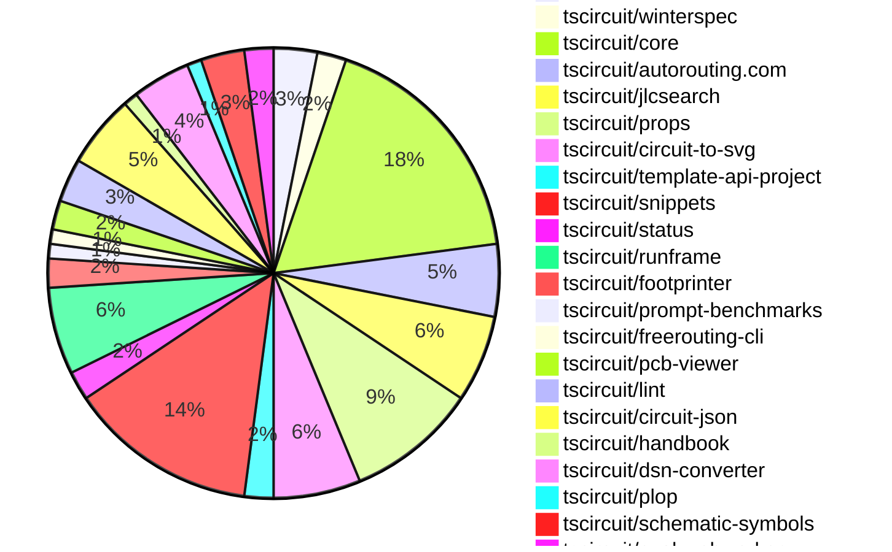

# Contribution Overview 2024-12-18

## PRs by Repository

## Contributor Overview

| Contributor | 🐳 Major | 🐙 Minor | 🐌 Tiny | ⭐ | Issues Created |
|-------------|---------|---------|---------|-----|----------------|
| [seveibar](#seveibar) | 9 | 16 | 1 | 👑👑 | 86 |
| [imrishabh18](#imrishabh18) | 0 | 15 | 0 | ⭐⭐⭐ | 19 |
| [ShiboSoftwareDev](#ShiboSoftwareDev) | 3 | 5 | 0 | ⭐⭐⭐ | 11 |
| [Abse2001](#Abse2001) | 2 | 8 | 0 | ⭐⭐⭐ | 6 |
| [devin-ai-integration[bot]](#devin-ai-integration[bot]) | 2 | 9 | 0 | ⭐⭐ | 0 |
| [Anshgrover23](#Anshgrover23) | 1 | 9 | 0 | ⭐⭐ | 3 |
| [techmannih](#techmannih) | 0 | 9 | 0 | ⭐⭐ | 2 |
| [AnasSarkiz](#AnasSarkiz) | 1 | 3 | 0 | ⭐ | 0 |
| [rohittcodes](#rohittcodes) | 0 | 3 | 0 | ⭐ | 3 |

## Review Table

[reviews-received-hover]: ## "Number of reviews received for PRs for this contributor"
[approvals-received-hover]: ## "Number of approvals received for PRs this contributor authored"
[rejections-received-hover]: ## "Number of rejections received for PRs this contributor authored"
[prs-opened-hover]: ## "Number of PRs opened by this contributor"
[issues-created-hover]: ## "Number of issues created by this contributor"
[bountied-issues-hover]: ## "Number of issues this contributor created with a bounty"
[bountied-issue-$-hover]: ## "Total bounty amount placed on issues authored by this contributor"

| Contributor | Reviews Received | Approvals Received | Rejections Received | PRs Opened | PRs Merged | Issues Created | Bountied Issues | Bountied Issue $ |
|---|---|---|---|---|---|---|---|---|
| [seveibar](#seveibar) | 1 | 1 | 0 | 28 | 26 | 86 | 34 | 797 |
| [AnasSarkiz](#AnasSarkiz) | 8 | 4 | 0 | 4 | 4 | 0 | 0 | 0 |
| [ShiboSoftwareDev](#ShiboSoftwareDev) | 17 | 9 | 1 | 9 | 8 | 11 | 5 | 210 |
| [Abse2001](#Abse2001) | 30 | 11 | 1 | 12 | 10 | 6 | 5 | 52 |
| [techmannih](#techmannih) | 31 | 12 | 11 | 16 | 9 | 2 | 0 | 0 |
| [Anshgrover23](#Anshgrover23) | 67 | 10 | 16 | 17 | 10 | 3 | 0 | 0 |
| [devin-ai-integration[bot]](#devin-ai-integration[bot]) | 12 | 8 | 3 | 20 | 11 | 0 | 0 | 0 |
| [rohittcodes](#rohittcodes) | 6 | 4 | 0 | 4 | 3 | 3 | 2 | 20 |
| [imrishabh18](#imrishabh18) | 13 | 7 | 0 | 17 | 15 | 19 | 7 | 100 |
| [karthik-nair-20](#karthik-nair-20) | 0 | 0 | 0 | 1 | 0 | 0 | 0 | 0 |
| [Niharika0104](#Niharika0104) | 2 | 0 | 1 | 1 | 0 | 1 | 0 | 0 |
| [DrSensor](#DrSensor) | 0 | 0 | 0 | 1 | 0 | 0 | 0 | 0 |

## Changes by Repository

### [tscircuit/schematic-viewer](https://github.com/tscircuit/schematic-viewer)

| PR # | Impact | Contributor | Description |
|------|--------|-------------|-------------|
| [#73](https://github.com/tscircuit/schematic-viewer/pull/73) | 🐳 Major | seveibar | Adds drag'n'drop editing functionality to the application. |
| [#75](https://github.com/tscircuit/schematic-viewer/pull/75) | 🐙 Minor | seveibar | Change tscircuit dependencies to peer deps to avoid dupes |
| [#74](https://github.com/tscircuit/schematic-viewer/pull/74) | 🐙 Minor | AnasSarkiz | Updated core and circuit-to-svg dependencies to fix the position of the reference designator inside the schematic component group. |

### [tscircuit/winterspec](https://github.com/tscircuit/winterspec)

| PR # | Impact | Contributor | Description |
|------|--------|-------------|-------------|
| [#25](https://github.com/tscircuit/winterspec/pull/25) | 🐳 Major | seveibar | Port CLI to Commander, add lots of debug, when in Bun, avoid bundleRequire |
| [#24](https://github.com/tscircuit/winterspec/pull/24) | 🐙 Minor | seveibar | Add middleware exports to the `middleware/index.ts` file |

### [tscircuit/core](https://github.com/tscircuit/core)

| PR # | Impact | Contributor | Description |
|------|--------|-------------|-------------|
| [#456](https://github.com/tscircuit/core/pull/456) | 🐳 Major | seveibar | Rename `Circuit` class to `RootCircuit` class. |
| [#455](https://github.com/tscircuit/core/pull/455) | 🐳 Major | seveibar | Add support for schematic manual placements |
| [#439](https://github.com/tscircuit/core/pull/439) | 🐳 Major | seveibar | Adds the `applyEditEventsToManualEditsFile` function to handle updates to schematic component locations in the manual edits file. |
| [#457](https://github.com/tscircuit/core/pull/457) | 🐙 Minor | seveibar |  |
| [#448](https://github.com/tscircuit/core/pull/448) | 🐙 Minor | seveibar | Create a new markdown file `RENDERING_RULES_AND_GUIDELINES.md` containing guidelines for rendering and mutating the database. |
| [#447](https://github.com/tscircuit/core/pull/447) | 🐙 Minor | seveibar | Fix the schematic component position when there is a group offset. |
| [#436](https://github.com/tscircuit/core/pull/436) | 🐙 Minor | seveibar | Rename "eval_error" to "external:evalError" in the Circuit class. |
| [#443](https://github.com/tscircuit/core/pull/443) | 🐙 Minor | AnasSarkiz | Changed the `schematic_component_id` of the `component_name_text` to match the `schematic_component_id` of the `schematic_component`. |
| [#452](https://github.com/tscircuit/core/pull/452) | 🐙 Minor | ShiboSoftwareDev | Update the versions of the "schematic-symbols" and "circuit-to-svg" dependencies in the project's "package.json" file. |
| [#444](https://github.com/tscircuit/core/pull/444) | 🐙 Minor | Abse2001 | Adds `ccw_rotation` property to `SilkscreenText` component |
| [#459](https://github.com/tscircuit/core/pull/459) | 🐙 Minor | Anshgrover23 | Add a new transistor component to the library |
| [#424](https://github.com/tscircuit/core/pull/424) | 🐙 Minor | techmannih | Set up continuous branch release with pkg-pr-new |
| [#428](https://github.com/tscircuit/core/pull/428) | 🐙 Minor | techmannih | Adds a new component called `SilkscreenLine` to the library, which allows drawing a silkscreen line on the PCB. |
| [#449](https://github.com/tscircuit/core/pull/449) | 🐙 Minor | imrishabh18 | The pull request adds a new test case to check the transform for connected resistor and capacitor inside a group. |
| [#437](https://github.com/tscircuit/core/pull/437) | 🐙 Minor | imrishabh18 | Updates the lockfile to fix an issue with publishing. |
| [#430](https://github.com/tscircuit/core/pull/430) | 🐙 Minor | imrishabh18 | Add a new event type "eval_error" for webworker |
| [#458](https://github.com/tscircuit/core/pull/458) | 🐌 Tiny | seveibar | Add a new `Circuit` export for backwards compatibility with the existing `RootCircuit` export. |

### [tscircuit/autorouting.com](https://github.com/tscircuit/autorouting.com)

| PR # | Impact | Contributor | Description |
|------|--------|-------------|-------------|
| [#4](https://github.com/tscircuit/autorouting.com/pull/4) | 🐳 Major | seveibar |  |
| [#2](https://github.com/tscircuit/autorouting.com/pull/2) | 🐳 Major | seveibar | Overhaul the codebase, including initialization of the shadcn library, upgrade of dependencies, and fixing a CSS syntax error. |
| [#12](https://github.com/tscircuit/autorouting.com/pull/12) | 🐙 Minor | ShiboSoftwareDev | Removed the `force-dynamic` configuration from various pages, as dynamic routes cannot be prerendered. |
| [#10](https://github.com/tscircuit/autorouting.com/pull/10) | 🐙 Minor | Anshgrover23 | Automatically retry sample uploads up to 3 times if an error occurs |
| [#9](https://github.com/tscircuit/autorouting.com/pull/9) | 🐙 Minor | Anshgrover23 | Add a regular progress bar to the ContributeProcessingStep component |

### [tscircuit/jlcsearch](https://github.com/tscircuit/jlcsearch)

| PR # | Impact | Contributor | Description |
|------|--------|-------------|-------------|
| [#5](https://github.com/tscircuit/jlcsearch/pull/5) | 🐳 Major | seveibar | Add LED drivers table and API endpoint |
| [#3](https://github.com/tscircuit/jlcsearch/pull/3) | 🐳 Major | seveibar | Add workflows for testing, format checking, and type checking, and update the memory configuration for the Fly deployment. |
| [#12](https://github.com/tscircuit/jlcsearch/pull/12) | 🐳 Major | Anshgrover23 | Adds a new "Mosfet" derived table to the database schema with various attributes related to MOSFET components. |
| [#4](https://github.com/tscircuit/jlcsearch/pull/4) | 🐳 Major | devin-ai-integration[bot] |  |
| [#11](https://github.com/tscircuit/jlcsearch/pull/11) | 🐙 Minor | devin-ai-integration[bot] | Implements a search functionality for the components/list route, allowing users to search for components by description, manufacturer, and LCSC part number. |
| [#6](https://github.com/tscircuit/jlcsearch/pull/6) | 🐙 Minor | devin-ai-integration[bot] |  |

### [tscircuit/props](https://github.com/tscircuit/props)

| PR # | Impact | Contributor | Description |
|------|--------|-------------|-------------|
| [#133](https://github.com/tscircuit/props/pull/133) | 🐳 Major | devin-ai-integration[bot] | Adds a new MOSFET component with props and a comprehensive test suite. |
| [#129](https://github.com/tscircuit/props/pull/129) | 🐙 Minor | seveibar | Use manual edits file in subcircuits |
| [#121](https://github.com/tscircuit/props/pull/121) | 🐙 Minor | seveibar | Fixes exports to include manual edit events and adds more consistent edit event type property for PCB trace hint. |
| [#125](https://github.com/tscircuit/props/pull/125) | 🐙 Minor | Anshgrover23 | Adds a new component called `transistor` with a `transistorType` property that can be either "npn" or "pnp". |
| [#131](https://github.com/tscircuit/props/pull/131) | 🐙 Minor | Anshgrover23 | Fixes the `pinVariant` property in the `ResonatorProps` interface and the corresponding validation in the `resonatorProps` schema. |
| [#135](https://github.com/tscircuit/props/pull/135) | 🐙 Minor | devin-ai-integration[bot] | This PR adds an automated script to generate documentation for manual edit events and files. |
| [#124](https://github.com/tscircuit/props/pull/124) | 🐙 Minor | devin-ai-integration[bot] | Rename `manual_edit_file` to `manual_edits_file` for consistency with the interface name `ManualEditsFile`. |
| [#122](https://github.com/tscircuit/props/pull/122) | 🐙 Minor | devin-ai-integration[bot] | Add TypeScript interface definition for `ManualEditsFile` to match existing Zod schema. |
| [#119](https://github.com/tscircuit/props/pull/119) | 🐙 Minor | techmannih | Add resonator component with props for frequency, load capacitance, and pin variant. |

### [tscircuit/circuit-to-svg](https://github.com/tscircuit/circuit-to-svg)

| PR # | Impact | Contributor | Description |
|------|--------|-------------|-------------|
| [#151](https://github.com/tscircuit/circuit-to-svg/pull/151) | 🐙 Minor | seveibar | Adds support for computing and placing the schematic transform as a data attribute on the generated SVG. |
| [#150](https://github.com/tscircuit/circuit-to-svg/pull/150) | 🐙 Minor | seveibar | Add schematic trace ID properties to SVG objects |
| [#153](https://github.com/tscircuit/circuit-to-svg/pull/153) | 🐙 Minor | AnasSarkiz | Added `sch_componet_name` and `MPN` to `createSvgObjectsFromSchematicComponentWithBox` function. |
| [#156](https://github.com/tscircuit/circuit-to-svg/pull/156) | 🐙 Minor | ShiboSoftwareDev | Update the `@tscircuit/core` dependency from a specific commit to a version number. |
| [#155](https://github.com/tscircuit/circuit-to-svg/pull/155) | 🐙 Minor | ShiboSoftwareDev | Fixes the symbol text position to adjust for large schematic symbols. |
| [#158](https://github.com/tscircuit/circuit-to-svg/pull/158) | 🐙 Minor | Abse2001 | Temporary fix for the ground label symbol text position. |

### [tscircuit/template-api-project](https://github.com/tscircuit/template-api-project)

| PR # | Impact | Contributor | Description |
|------|--------|-------------|-------------|
| [#3](https://github.com/tscircuit/template-api-project/pull/3) | 🐙 Minor | seveibar | Adds GitHub Actions workflows for running format checks and type checks, as well as a Dockerfile for building a production-ready Docker image. |
| [#2](https://github.com/tscircuit/template-api-project/pull/2) | 🐙 Minor | seveibar | Adds the `@electric-sql/pglite` and `kysely-pglite` dependencies for development, updates the `pgstrap` dependency, and removes the `winterspec` dependency. |

### [tscircuit/snippets](https://github.com/tscircuit/snippets)

| PR # | Impact | Contributor | Description |
|------|--------|-------------|-------------|
| [#423](https://github.com/tscircuit/snippets/pull/423) | 🐳 Major | ShiboSoftwareDev | Adds functionality to automatically import snippets from a registry to the development server. |
| [#430](https://github.com/tscircuit/snippets/pull/430) | 🐙 Minor | seveibar | Add circuit name for better logs on autorouting server |
| [#416](https://github.com/tscircuit/snippets/pull/416) | 🐙 Minor | seveibar | Reverts a previous fix that caused an error to be shown on every snippet. |
| [#419](https://github.com/tscircuit/snippets/pull/419) | 🐙 Minor | Abse2001 | Added a new example snippet for an Arduino Nano Servo Breakout Board. |
| [#422](https://github.com/tscircuit/snippets/pull/422) | 🐙 Minor | Anshgrover23 | Add `waitforLoadState` to the `view-snippet.spec.ts` test to ensure the page is fully loaded before interacting with elements. |
| [#406](https://github.com/tscircuit/snippets/pull/406) | 🐙 Minor | rohittcodes | Adds a new feature to edit the description of a code snippet. |
| [#386](https://github.com/tscircuit/snippets/pull/386) | 🐙 Minor | rohittcodes | Adds an error button and a function to handle the import of manual edits in the CodeEditorHeader component. |
| [#398](https://github.com/tscircuit/snippets/pull/398) | 🐙 Minor | devin-ai-integration[bot] | Add a new template for creating a USB-C powered LED flashlight circuit with a push button control. |
| [#407](https://github.com/tscircuit/snippets/pull/407) | 🐙 Minor | techmannih | Update the blinking LED circuit template to modify the board dimensions and pin assignments of the 555 timer. |
| [#343](https://github.com/tscircuit/snippets/pull/343) | 🐙 Minor | techmannih | The pull request adds a new template for a blinking LED board. |
| [#417](https://github.com/tscircuit/snippets/pull/417) | 🐙 Minor | imrishabh18 | Fix importing empty file for manual-edits |
| [#413](https://github.com/tscircuit/snippets/pull/413) | 🐙 Minor | imrishabh18 | Use the manual edit template at initialization to avoid errors caused by an empty string. |
| [#393](https://github.com/tscircuit/snippets/pull/393) | 🐙 Minor | imrishabh18 | Update the version of the @tscircuit/pcb-viewer package from 1.10.16 to 1.10.22. |

### [tscircuit/status](https://github.com/tscircuit/status)

| PR # | Impact | Contributor | Description |
|------|--------|-------------|-------------|
| [#6](https://github.com/tscircuit/status/pull/6) | 🐙 Minor | seveibar | Filter outages shorter than 15 minutes from the OutageTable component. |
| [#5](https://github.com/tscircuit/status/pull/5) | 🐙 Minor | devin-ai-integration[bot] | Improve timestamp sorting and add detailed timestamps to tooltips in status bar |

### [tscircuit/runframe](https://github.com/tscircuit/runframe)

| PR # | Impact | Contributor | Description |
|------|--------|-------------|-------------|
| [#48](https://github.com/tscircuit/runframe/pull/48) | 🐙 Minor | seveibar | Adds support for a left-side header content in the CircuitJsonPreview component and the RunFrame component. |
| [#46](https://github.com/tscircuit/runframe/pull/46) | 🐙 Minor | imrishabh18 | Adding the Tailwind CSS CDN back and removing the base from style generation |
| [#43](https://github.com/tscircuit/runframe/pull/43) | 🐙 Minor | imrishabh18 | Fix the issue with Tailwind's dark mode by removing the CDN, updating the Tailwind config, and generating the CSS through the build script. |
| [#45](https://github.com/tscircuit/runframe/pull/45) | 🐙 Minor | imrishabh18 | Update the GitHub Actions workflow to automatically commit the generated CSS files. |
| [#44](https://github.com/tscircuit/runframe/pull/44) | 🐙 Minor | imrishabh18 | Update the version of the package from 0.0.1 to 0.0.12. |
| [#19](https://github.com/tscircuit/runframe/pull/19) | 🐙 Minor | imrishabh18 | Adds the ability to display error messages in the tab when an error occurs during circuit execution. |

### [tscircuit/footprinter](https://github.com/tscircuit/footprinter)

| PR # | Impact | Contributor | Description |
|------|--------|-------------|-------------|
| [#98](https://github.com/tscircuit/footprinter/pull/98) | 🐳 Major | AnasSarkiz | Introduced a new footprint type called `breakoutheaders` |
| [#100](https://github.com/tscircuit/footprinter/pull/100) | 🐙 Minor | devin-ai-integration[bot] | Fix the inner/outer diameter ratio in the DIP footprint to match the recommended 1.5mm outer diameter. |

### [tscircuit/prompt-benchmarks](https://github.com/tscircuit/prompt-benchmarks)

| PR # | Impact | Contributor | Description |
|------|--------|-------------|-------------|
| [#12](https://github.com/tscircuit/prompt-benchmarks/pull/12) | 🐳 Major | ShiboSoftwareDev | Refactored the `evalite` benchmark to use a different architecture as suggested by Matt. |

### [tscircuit/freerouting-cli](https://github.com/tscircuit/freerouting-cli)

| PR # | Impact | Contributor | Description |
|------|--------|-------------|-------------|
| [#5](https://github.com/tscircuit/freerouting-cli/pull/5) | 🐳 Major | ShiboSoftwareDev | Adds a test suite for the freerouting CLI and routing functionality, including integration with a Docker container. |

### [tscircuit/pcb-viewer](https://github.com/tscircuit/pcb-viewer)

| PR # | Impact | Contributor | Description |
|------|--------|-------------|-------------|
| [#99](https://github.com/tscircuit/pcb-viewer/pull/99) | 🐳 Major | Abse2001 | Implemented silkscreen text rotation and added a Storybook test for it. |
| [#100](https://github.com/tscircuit/pcb-viewer/pull/100) | 🐙 Minor | ShiboSoftwareDev | The pull request now shows lines between the closest ports in the rat's nest overlay. |

### [tscircuit/lint](https://github.com/tscircuit/lint)

| PR # | Impact | Contributor | Description |
|------|--------|-------------|-------------|
| [#1](https://github.com/tscircuit/lint/pull/1) | 🐳 Major | Abse2001 | Introduces an ESLint plugin with two custom rules: "banned-words" and "two-params" to enforce code quality standards in TSCircuit projects. |
| [#7](https://github.com/tscircuit/lint/pull/7) | 🐙 Minor | Abse2001 | Adds a new ESLint rule to enforce the context-passing pattern for functions with two parameters, and a new rule to check TSCircuit dependencies in package.json. |
| [#5](https://github.com/tscircuit/lint/pull/5) | 🐙 Minor | techmannih | Enable tscircuit-lint by adding a bin script and configuring tsup. |

### [tscircuit/circuit-json](https://github.com/tscircuit/circuit-json)

| PR # | Impact | Contributor | Description |
|------|--------|-------------|-------------|
| [#101](https://github.com/tscircuit/circuit-json/pull/101) | 🐙 Minor | Abse2001 | Added an optional `ccw_rotation` property to the `pcb_silkscreen_text` type. |
| [#103](https://github.com/tscircuit/circuit-json/pull/103) | 🐙 Minor | Anshgrover23 | Add a new circuit element called "simple transistor" to the project. |
| [#108](https://github.com/tscircuit/circuit-json/pull/108) | 🐙 Minor | Anshgrover23 | Add a linting script to the CI that checks for Zod-related linting issues. |
| [#102](https://github.com/tscircuit/circuit-json/pull/102) | 🐙 Minor | Anshgrover23 | Implemented a new circuit element called "source_simple_resonator". |
| [#100](https://github.com/tscircuit/circuit-json/pull/100) | 🐙 Minor | rohittcodes | Adds support for parsing "KΩ" and "KV" SI unit suffixes. |

### [tscircuit/handbook](https://github.com/tscircuit/handbook)

| PR # | Impact | Contributor | Description |
|------|--------|-------------|-------------|
| [#4](https://github.com/tscircuit/handbook/pull/4) | 🐙 Minor | Abse2001 | Added a tutorial for using the `yalc` tool for local development. |

### [tscircuit/dsn-converter](https://github.com/tscircuit/dsn-converter)

| PR # | Impact | Contributor | Description |
|------|--------|-------------|-------------|
| [#72](https://github.com/tscircuit/dsn-converter/pull/72) | 🐙 Minor | Abse2001 | Adds support for the Via and Pin DSN formats used by the Smoothie Board. |
| [#71](https://github.com/tscircuit/dsn-converter/pull/71) | 🐙 Minor | Abse2001 | Handles errors in `processPin` and `processVis` more gracefully by throwing a warning in the console instead of an error when a node fails to parse correctly. |
| [#74](https://github.com/tscircuit/dsn-converter/pull/74) | 🐙 Minor | imrishabh18 | Fix a bug that caused duplicate plated holes with the same pin number to be added to the image. |
| [#73](https://github.com/tscircuit/dsn-converter/pull/73) | 🐙 Minor | imrishabh18 | The pull request fixes the issue of properly linking the `source_trace` with the extracted `pcb_traces` from the generated conversion in the Dsn session converter. |

### [tscircuit/plop](https://github.com/tscircuit/plop)

| PR # | Impact | Contributor | Description |
|------|--------|-------------|-------------|
| [#6](https://github.com/tscircuit/plop/pull/6) | 🐙 Minor | devin-ai-integration[bot] | Disable the 'noArrayIndexKey' lint rule in the biome.json configuration. |

### [tscircuit/schematic-symbols](https://github.com/tscircuit/schematic-symbols)

| PR # | Impact | Contributor | Description |
|------|--------|-------------|-------------|
| [#227](https://github.com/tscircuit/schematic-symbols/pull/227) | 🐙 Minor | techmannih | Fixed the text anchor positions for the capacitor-right symbol. |
| [#229](https://github.com/tscircuit/schematic-symbols/pull/229) | 🐙 Minor | techmannih | Add a new DPDT (Double Pole Double Throw) switch symbol. |
| [#228](https://github.com/tscircuit/schematic-symbols/pull/228) | 🐙 Minor | techmannih | Fix anchors on resonator |

### [tscircuit/eval-webworker](https://github.com/tscircuit/eval-webworker)

| PR # | Impact | Contributor | Description |
|------|--------|-------------|-------------|
| [#42](https://github.com/tscircuit/eval-webworker/pull/42) | 🐙 Minor | imrishabh18 | Reverts the previous change that introduced the `emitError` function. |
| [#33](https://github.com/tscircuit/eval-webworker/pull/33) | 🐙 Minor | imrishabh18 | Adds an `emitError` function to the `InternalWebWorkerApi` interface to emit errors during code execution in the web worker. |

## Changes by Contributor

### [seveibar](https://github.com/seveibar)

| PR # | Impact | Description |
|------|--------|-------------|
| [#73](https://github.com/tscircuit/schematic-viewer/pull/73) | 🐳 Major | Adds drag'n'drop editing functionality to the application. |
| [#25](https://github.com/tscircuit/winterspec/pull/25) | 🐳 Major | Port CLI to Commander, add lots of debug, when in Bun, avoid bundleRequire |
| [#456](https://github.com/tscircuit/core/pull/456) | 🐳 Major | Rename `Circuit` class to `RootCircuit` class. |
| [#455](https://github.com/tscircuit/core/pull/455) | 🐳 Major | Add support for schematic manual placements |
| [#439](https://github.com/tscircuit/core/pull/439) | 🐳 Major | Adds the `applyEditEventsToManualEditsFile` function to handle updates to schematic component locations in the manual edits file. |
| [#4](https://github.com/tscircuit/autorouting.com/pull/4) | 🐳 Major |  |
| [#2](https://github.com/tscircuit/autorouting.com/pull/2) | 🐳 Major | Overhaul the codebase, including initialization of the shadcn library, upgrade of dependencies, and fixing a CSS syntax error. |
| [#5](https://github.com/tscircuit/jlcsearch/pull/5) | 🐳 Major | Add LED drivers table and API endpoint |
| [#3](https://github.com/tscircuit/jlcsearch/pull/3) | 🐳 Major | Add workflows for testing, format checking, and type checking, and update the memory configuration for the Fly deployment. |
| [#75](https://github.com/tscircuit/schematic-viewer/pull/75) | 🐙 Minor | Change tscircuit dependencies to peer deps to avoid dupes |
| [#129](https://github.com/tscircuit/props/pull/129) | 🐙 Minor | Use manual edits file in subcircuits |
| [#121](https://github.com/tscircuit/props/pull/121) | 🐙 Minor | Fixes exports to include manual edit events and adds more consistent edit event type property for PCB trace hint. |
| [#24](https://github.com/tscircuit/winterspec/pull/24) | 🐙 Minor | Add middleware exports to the `middleware/index.ts` file |
| [#457](https://github.com/tscircuit/core/pull/457) | 🐙 Minor |  |
| [#448](https://github.com/tscircuit/core/pull/448) | 🐙 Minor | Create a new markdown file `RENDERING_RULES_AND_GUIDELINES.md` containing guidelines for rendering and mutating the database. |
| [#447](https://github.com/tscircuit/core/pull/447) | 🐙 Minor | Fix the schematic component position when there is a group offset. |
| [#436](https://github.com/tscircuit/core/pull/436) | 🐙 Minor | Rename "eval_error" to "external:evalError" in the Circuit class. |
| [#151](https://github.com/tscircuit/circuit-to-svg/pull/151) | 🐙 Minor | Adds support for computing and placing the schematic transform as a data attribute on the generated SVG. |
| [#150](https://github.com/tscircuit/circuit-to-svg/pull/150) | 🐙 Minor | Add schematic trace ID properties to SVG objects |
| [#3](https://github.com/tscircuit/template-api-project/pull/3) | 🐙 Minor | Adds GitHub Actions workflows for running format checks and type checks, as well as a Dockerfile for building a production-ready Docker image. |
| [#2](https://github.com/tscircuit/template-api-project/pull/2) | 🐙 Minor | Adds the `@electric-sql/pglite` and `kysely-pglite` dependencies for development, updates the `pgstrap` dependency, and removes the `winterspec` dependency. |
| [#430](https://github.com/tscircuit/snippets/pull/430) | 🐙 Minor | Add circuit name for better logs on autorouting server |
| [#416](https://github.com/tscircuit/snippets/pull/416) | 🐙 Minor | Reverts a previous fix that caused an error to be shown on every snippet. |
| [#6](https://github.com/tscircuit/status/pull/6) | 🐙 Minor | Filter outages shorter than 15 minutes from the OutageTable component. |
| [#48](https://github.com/tscircuit/runframe/pull/48) | 🐙 Minor | Adds support for a left-side header content in the CircuitJsonPreview component and the RunFrame component. |
| [#458](https://github.com/tscircuit/core/pull/458) | 🐌 Tiny | Add a new `Circuit` export for backwards compatibility with the existing `RootCircuit` export. |

### [AnasSarkiz](https://github.com/AnasSarkiz)

| PR # | Impact | Description |
|------|--------|-------------|
| [#98](https://github.com/tscircuit/footprinter/pull/98) | 🐳 Major | Introduced a new footprint type called `breakoutheaders` |
| [#74](https://github.com/tscircuit/schematic-viewer/pull/74) | 🐙 Minor | Updated core and circuit-to-svg dependencies to fix the position of the reference designator inside the schematic component group. |
| [#443](https://github.com/tscircuit/core/pull/443) | 🐙 Minor | Changed the `schematic_component_id` of the `component_name_text` to match the `schematic_component_id` of the `schematic_component`. |
| [#153](https://github.com/tscircuit/circuit-to-svg/pull/153) | 🐙 Minor | Added `sch_componet_name` and `MPN` to `createSvgObjectsFromSchematicComponentWithBox` function. |

### [ShiboSoftwareDev](https://github.com/ShiboSoftwareDev)

| PR # | Impact | Description |
|------|--------|-------------|
| [#423](https://github.com/tscircuit/snippets/pull/423) | 🐳 Major | Adds functionality to automatically import snippets from a registry to the development server. |
| [#12](https://github.com/tscircuit/prompt-benchmarks/pull/12) | 🐳 Major | Refactored the `evalite` benchmark to use a different architecture as suggested by Matt. |
| [#5](https://github.com/tscircuit/freerouting-cli/pull/5) | 🐳 Major | Adds a test suite for the freerouting CLI and routing functionality, including integration with a Docker container. |
| [#100](https://github.com/tscircuit/pcb-viewer/pull/100) | 🐙 Minor | The pull request now shows lines between the closest ports in the rat's nest overlay. |
| [#452](https://github.com/tscircuit/core/pull/452) | 🐙 Minor | Update the versions of the "schematic-symbols" and "circuit-to-svg" dependencies in the project's "package.json" file. |
| [#156](https://github.com/tscircuit/circuit-to-svg/pull/156) | 🐙 Minor | Update the `@tscircuit/core` dependency from a specific commit to a version number. |
| [#155](https://github.com/tscircuit/circuit-to-svg/pull/155) | 🐙 Minor | Fixes the symbol text position to adjust for large schematic symbols. |
| [#12](https://github.com/tscircuit/autorouting.com/pull/12) | 🐙 Minor | Removed the `force-dynamic` configuration from various pages, as dynamic routes cannot be prerendered. |

### [Abse2001](https://github.com/Abse2001)

| PR # | Impact | Description |
|------|--------|-------------|
| [#99](https://github.com/tscircuit/pcb-viewer/pull/99) | 🐳 Major | Implemented silkscreen text rotation and added a Storybook test for it. |
| [#1](https://github.com/tscircuit/lint/pull/1) | 🐳 Major | Introduces an ESLint plugin with two custom rules: "banned-words" and "two-params" to enforce code quality standards in TSCircuit projects. |
| [#101](https://github.com/tscircuit/circuit-json/pull/101) | 🐙 Minor | Added an optional `ccw_rotation` property to the `pcb_silkscreen_text` type. |
| [#444](https://github.com/tscircuit/core/pull/444) | 🐙 Minor | Adds `ccw_rotation` property to `SilkscreenText` component |
| [#158](https://github.com/tscircuit/circuit-to-svg/pull/158) | 🐙 Minor | Temporary fix for the ground label symbol text position. |
| [#4](https://github.com/tscircuit/handbook/pull/4) | 🐙 Minor | Added a tutorial for using the `yalc` tool for local development. |
| [#72](https://github.com/tscircuit/dsn-converter/pull/72) | 🐙 Minor | Adds support for the Via and Pin DSN formats used by the Smoothie Board. |
| [#71](https://github.com/tscircuit/dsn-converter/pull/71) | 🐙 Minor | Handles errors in `processPin` and `processVis` more gracefully by throwing a warning in the console instead of an error when a node fails to parse correctly. |
| [#419](https://github.com/tscircuit/snippets/pull/419) | 🐙 Minor | Added a new example snippet for an Arduino Nano Servo Breakout Board. |
| [#7](https://github.com/tscircuit/lint/pull/7) | 🐙 Minor | Adds a new ESLint rule to enforce the context-passing pattern for functions with two parameters, and a new rule to check TSCircuit dependencies in package.json. |

### [Anshgrover23](https://github.com/Anshgrover23)

| PR # | Impact | Description |
|------|--------|-------------|
| [#12](https://github.com/tscircuit/jlcsearch/pull/12) | 🐳 Major | Adds a new "Mosfet" derived table to the database schema with various attributes related to MOSFET components. |
| [#103](https://github.com/tscircuit/circuit-json/pull/103) | 🐙 Minor | Add a new circuit element called "simple transistor" to the project. |
| [#108](https://github.com/tscircuit/circuit-json/pull/108) | 🐙 Minor | Add a linting script to the CI that checks for Zod-related linting issues. |
| [#102](https://github.com/tscircuit/circuit-json/pull/102) | 🐙 Minor | Implemented a new circuit element called "source_simple_resonator". |
| [#125](https://github.com/tscircuit/props/pull/125) | 🐙 Minor | Adds a new component called `transistor` with a `transistorType` property that can be either "npn" or "pnp". |
| [#131](https://github.com/tscircuit/props/pull/131) | 🐙 Minor | Fixes the `pinVariant` property in the `ResonatorProps` interface and the corresponding validation in the `resonatorProps` schema. |
| [#459](https://github.com/tscircuit/core/pull/459) | 🐙 Minor | Add a new transistor component to the library |
| [#10](https://github.com/tscircuit/autorouting.com/pull/10) | 🐙 Minor | Automatically retry sample uploads up to 3 times if an error occurs |
| [#9](https://github.com/tscircuit/autorouting.com/pull/9) | 🐙 Minor | Add a regular progress bar to the ContributeProcessingStep component |
| [#422](https://github.com/tscircuit/snippets/pull/422) | 🐙 Minor | Add `waitforLoadState` to the `view-snippet.spec.ts` test to ensure the page is fully loaded before interacting with elements. |

### [rohittcodes](https://github.com/rohittcodes)

| PR # | Impact | Description |
|------|--------|-------------|
| [#100](https://github.com/tscircuit/circuit-json/pull/100) | 🐙 Minor | Adds support for parsing "KΩ" and "KV" SI unit suffixes. |
| [#406](https://github.com/tscircuit/snippets/pull/406) | 🐙 Minor | Adds a new feature to edit the description of a code snippet. |
| [#386](https://github.com/tscircuit/snippets/pull/386) | 🐙 Minor | Adds an error button and a function to handle the import of manual edits in the CodeEditorHeader component. |

### [devin-ai-integration[bot]](https://github.com/devin-ai-integration[bot])

| PR # | Impact | Description |
|------|--------|-------------|
| [#133](https://github.com/tscircuit/props/pull/133) | 🐳 Major | Adds a new MOSFET component with props and a comprehensive test suite. |
| [#4](https://github.com/tscircuit/jlcsearch/pull/4) | 🐳 Major |  |
| [#135](https://github.com/tscircuit/props/pull/135) | 🐙 Minor | This PR adds an automated script to generate documentation for manual edit events and files. |
| [#124](https://github.com/tscircuit/props/pull/124) | 🐙 Minor | Rename `manual_edit_file` to `manual_edits_file` for consistency with the interface name `ManualEditsFile`. |
| [#122](https://github.com/tscircuit/props/pull/122) | 🐙 Minor | Add TypeScript interface definition for `ManualEditsFile` to match existing Zod schema. |
| [#100](https://github.com/tscircuit/footprinter/pull/100) | 🐙 Minor | Fix the inner/outer diameter ratio in the DIP footprint to match the recommended 1.5mm outer diameter. |
| [#6](https://github.com/tscircuit/plop/pull/6) | 🐙 Minor | Disable the 'noArrayIndexKey' lint rule in the biome.json configuration. |
| [#398](https://github.com/tscircuit/snippets/pull/398) | 🐙 Minor | Add a new template for creating a USB-C powered LED flashlight circuit with a push button control. |
| [#11](https://github.com/tscircuit/jlcsearch/pull/11) | 🐙 Minor | Implements a search functionality for the components/list route, allowing users to search for components by description, manufacturer, and LCSC part number. |
| [#6](https://github.com/tscircuit/jlcsearch/pull/6) | 🐙 Minor |  |
| [#5](https://github.com/tscircuit/status/pull/5) | 🐙 Minor | Improve timestamp sorting and add detailed timestamps to tooltips in status bar |

### [techmannih](https://github.com/techmannih)

| PR # | Impact | Description |
|------|--------|-------------|
| [#119](https://github.com/tscircuit/props/pull/119) | 🐙 Minor | Add resonator component with props for frequency, load capacitance, and pin variant. |
| [#424](https://github.com/tscircuit/core/pull/424) | 🐙 Minor | Set up continuous branch release with pkg-pr-new |
| [#428](https://github.com/tscircuit/core/pull/428) | 🐙 Minor | Adds a new component called `SilkscreenLine` to the library, which allows drawing a silkscreen line on the PCB. |
| [#227](https://github.com/tscircuit/schematic-symbols/pull/227) | 🐙 Minor | Fixed the text anchor positions for the capacitor-right symbol. |
| [#229](https://github.com/tscircuit/schematic-symbols/pull/229) | 🐙 Minor | Add a new DPDT (Double Pole Double Throw) switch symbol. |
| [#228](https://github.com/tscircuit/schematic-symbols/pull/228) | 🐙 Minor | Fix anchors on resonator |
| [#407](https://github.com/tscircuit/snippets/pull/407) | 🐙 Minor | Update the blinking LED circuit template to modify the board dimensions and pin assignments of the 555 timer. |
| [#343](https://github.com/tscircuit/snippets/pull/343) | 🐙 Minor | The pull request adds a new template for a blinking LED board. |
| [#5](https://github.com/tscircuit/lint/pull/5) | 🐙 Minor | Enable tscircuit-lint by adding a bin script and configuring tsup. |

### [imrishabh18](https://github.com/imrishabh18)

| PR # | Impact | Description |
|------|--------|-------------|
| [#449](https://github.com/tscircuit/core/pull/449) | 🐙 Minor | The pull request adds a new test case to check the transform for connected resistor and capacitor inside a group. |
| [#437](https://github.com/tscircuit/core/pull/437) | 🐙 Minor | Updates the lockfile to fix an issue with publishing. |
| [#430](https://github.com/tscircuit/core/pull/430) | 🐙 Minor | Add a new event type "eval_error" for webworker |
| [#74](https://github.com/tscircuit/dsn-converter/pull/74) | 🐙 Minor | Fix a bug that caused duplicate plated holes with the same pin number to be added to the image. |
| [#73](https://github.com/tscircuit/dsn-converter/pull/73) | 🐙 Minor | The pull request fixes the issue of properly linking the `source_trace` with the extracted `pcb_traces` from the generated conversion in the Dsn session converter. |
| [#417](https://github.com/tscircuit/snippets/pull/417) | 🐙 Minor | Fix importing empty file for manual-edits |
| [#413](https://github.com/tscircuit/snippets/pull/413) | 🐙 Minor | Use the manual edit template at initialization to avoid errors caused by an empty string. |
| [#393](https://github.com/tscircuit/snippets/pull/393) | 🐙 Minor | Update the version of the @tscircuit/pcb-viewer package from 1.10.16 to 1.10.22. |
| [#42](https://github.com/tscircuit/eval-webworker/pull/42) | 🐙 Minor | Reverts the previous change that introduced the `emitError` function. |
| [#33](https://github.com/tscircuit/eval-webworker/pull/33) | 🐙 Minor | Adds an `emitError` function to the `InternalWebWorkerApi` interface to emit errors during code execution in the web worker. |
| [#46](https://github.com/tscircuit/runframe/pull/46) | 🐙 Minor | Adding the Tailwind CSS CDN back and removing the base from style generation |
| [#43](https://github.com/tscircuit/runframe/pull/43) | 🐙 Minor | Fix the issue with Tailwind's dark mode by removing the CDN, updating the Tailwind config, and generating the CSS through the build script. |
| [#45](https://github.com/tscircuit/runframe/pull/45) | 🐙 Minor | Update the GitHub Actions workflow to automatically commit the generated CSS files. |
| [#44](https://github.com/tscircuit/runframe/pull/44) | 🐙 Minor | Update the version of the package from 0.0.1 to 0.0.12. |
| [#19](https://github.com/tscircuit/runframe/pull/19) | 🐙 Minor | Adds the ability to display error messages in the tab when an error occurs during circuit execution. |

