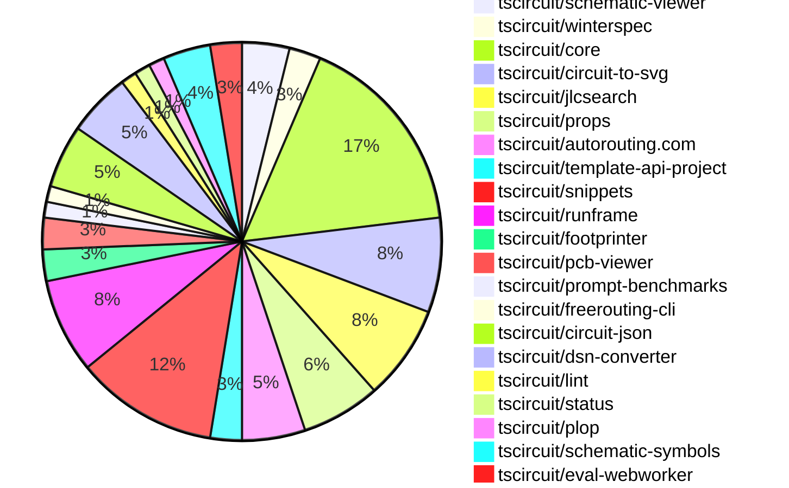

# Contribution Overview 2024-12-18

## PRs by Repository

## Contributor Overview

| Contributor | 🐳 Major | 🐙 Minor | 🐌 Tiny | ⭐ | Issues Created |
|-------------|---------|---------|---------|-----|----------------|
| [seveibar](#seveibar) | 7 | 13 | 0 | 👑 | 73 |
| [imrishabh18](#imrishabh18) | 0 | 13 | 1 | ⭐⭐⭐ | 16 |
| [ShiboSoftwareDev](#ShiboSoftwareDev) | 3 | 4 | 0 | ⭐⭐⭐ | 9 |
| [Abse2001](#Abse2001) | 0 | 8 | 0 | ⭐⭐ | 5 |
| [devin-ai-integration[bot]](#devin-ai-integration[bot]) | 1 | 7 | 1 | ⭐⭐ | 0 |
| [techmannih](#techmannih) | 0 | 8 | 0 | ⭐⭐ | 0 |
| [Anshgrover23](#Anshgrover23) | 2 | 2 | 0 | ⭐⭐ | 3 |
| [AnasSarkiz](#AnasSarkiz) | 1 | 3 | 0 | ⭐ | 0 |
| [rohittcodes](#rohittcodes) | 0 | 3 | 0 | ⭐ | 3 |

## Review Table

[reviews-received-hover]: ## "Number of reviews received for PRs for this contributor"
[approvals-received-hover]: ## "Number of approvals received for PRs this contributor authored"
[rejections-received-hover]: ## "Number of rejections received for PRs this contributor authored"
[prs-opened-hover]: ## "Number of PRs opened by this contributor"
[issues-created-hover]: ## "Number of issues created by this contributor"
[bountied-issues-hover]: ## "Number of issues this contributor created with a bounty"
[bountied-issue-$-hover]: ## "Total bounty amount placed on issues authored by this contributor"

| Contributor | Reviews Received | Approvals Received | Rejections Received | PRs Opened | PRs Merged | Issues Created | Bountied Issues | Bountied Issue $ |
|---|---|---|---|---|---|---|---|---|
| [seveibar](#seveibar) | 1 | 1 | 0 | 23 | 21 | 73 | 32 | 757 |
| [AnasSarkiz](#AnasSarkiz) | 8 | 4 | 0 | 4 | 4 | 0 | 0 | 0 |
| [ShiboSoftwareDev](#ShiboSoftwareDev) | 13 | 8 | 1 | 9 | 7 | 9 | 4 | 195 |
| [Abse2001](#Abse2001) | 28 | 9 | 1 | 10 | 8 | 5 | 3 | 30 |
| [techmannih](#techmannih) | 29 | 11 | 11 | 15 | 8 | 0 | 0 | 0 |
| [devin-ai-integration[bot]](#devin-ai-integration[bot]) | 10 | 6 | 3 | 17 | 9 | 0 | 0 | 0 |
| [Anshgrover23](#Anshgrover23) | 45 | 4 | 13 | 10 | 4 | 3 | 0 | 0 |
| [rohittcodes](#rohittcodes) | 6 | 4 | 0 | 4 | 3 | 3 | 2 | 20 |
| [imrishabh18](#imrishabh18) | 13 | 7 | 0 | 17 | 14 | 16 | 6 | 95 |
| [karthik-nair-20](#karthik-nair-20) | 0 | 0 | 0 | 1 | 0 | 0 | 0 | 0 |
| [Niharika0104](#Niharika0104) | 2 | 0 | 1 | 1 | 0 | 1 | 0 | 0 |
| [DrSensor](#DrSensor) | 0 | 0 | 0 | 1 | 0 | 0 | 0 | 0 |

## Changes by Repository

### [tscircuit/schematic-viewer](https://github.com/tscircuit/schematic-viewer)

| PR # | Impact | Contributor | Description |
|------|--------|-------------|-------------|
| [#73](https://github.com/tscircuit/schematic-viewer/pull/73) | 🐳 Major | seveibar | Adds drag and drop editing functionality to the application. |
| [#75](https://github.com/tscircuit/schematic-viewer/pull/75) | 🐙 Minor | seveibar | Change the dependencies of the `tscircuit` package to be peer dependencies to avoid duplicate versions. |
| [#74](https://github.com/tscircuit/schematic-viewer/pull/74) | 🐙 Minor | AnasSarkiz | Updated core and circuit-to-svg packages to fix the reference designator to be inside the schematic component group |

### [tscircuit/winterspec](https://github.com/tscircuit/winterspec)

| PR # | Impact | Contributor | Description |
|------|--------|-------------|-------------|
| [#25](https://github.com/tscircuit/winterspec/pull/25) | 🐳 Major | seveibar | Ports the CLI to use the Commander library, adds lots of debug logging, and avoids bundleRequire when running in Bun. |
| [#24](https://github.com/tscircuit/winterspec/pull/24) | 🐙 Minor | seveibar | Adds middleware exports for `with-ctx-error.js` and `with-request-logging.js` |

### [tscircuit/core](https://github.com/tscircuit/core)

| PR # | Impact | Contributor | Description |
|------|--------|-------------|-------------|
| [#455](https://github.com/tscircuit/core/pull/455) | 🐳 Major | seveibar | This pull request adds support for schematic manual placements, allowing users to manually position components in the schematic view. |
| [#448](https://github.com/tscircuit/core/pull/448) | 🐙 Minor | seveibar | Creates a new document "RENDERING_RULES_AND_GUIDELINES.md" that outlines the rules and guidelines for rendering in the project. |
| [#447](https://github.com/tscircuit/core/pull/447) | 🐙 Minor | seveibar | Fixes the position of schematic components when the group is offset. |
| [#439](https://github.com/tscircuit/core/pull/439) | 🐙 Minor | seveibar | Adds the `applyEditEventsToManualEditsFile` function to apply edit events to the manual edits file, specifically for updating schematic component locations. |
| [#436](https://github.com/tscircuit/core/pull/436) | 🐙 Minor | seveibar | Rename "eval_error" event to "external:evalError" |
| [#443](https://github.com/tscircuit/core/pull/443) | 🐙 Minor | AnasSarkiz | Changed the value of `schematic_component_id` of `component_name_text` to match the correct component ID. |
| [#452](https://github.com/tscircuit/core/pull/452) | 🐙 Minor | ShiboSoftwareDev | Updates the versions of the "schematic-symbols" and "circuit-to-svg" dependencies. |
| [#444](https://github.com/tscircuit/core/pull/444) | 🐙 Minor | Abse2001 | Add `ccw_rotation` property to `SilkscreenText` component |
| [#424](https://github.com/tscircuit/core/pull/424) | 🐙 Minor | techmannih | Set up continuous branch release with pkg-pr-new |
| [#428](https://github.com/tscircuit/core/pull/428) | 🐙 Minor | techmannih | Adds a new `SilkscreenLine` component to the library, which allows for the creation of silkscreen lines on a PCB. |
| [#449](https://github.com/tscircuit/core/pull/449) | 🐙 Minor | imrishabh18 | The pull request adds a new test case to check the transform for a connected resistor and capacitor inside a group. |
| [#437](https://github.com/tscircuit/core/pull/437) | 🐙 Minor | imrishabh18 | Updates the lockfile to fix the publish process. |
| [#430](https://github.com/tscircuit/core/pull/430) | 🐙 Minor | imrishabh18 | Add a new event type "eval_error" for webworker |

### [tscircuit/circuit-to-svg](https://github.com/tscircuit/circuit-to-svg)

| PR # | Impact | Contributor | Description |
|------|--------|-------------|-------------|
| [#151](https://github.com/tscircuit/circuit-to-svg/pull/151) | 🐳 Major | seveibar | Adds support for computing schematic transform and placing it on the SVG as a data attribute. |
| [#150](https://github.com/tscircuit/circuit-to-svg/pull/150) | 🐙 Minor | seveibar | Add data-circuit-json-type and data-schematic-trace-id attributes to SVG objects representing schematic traces. |
| [#153](https://github.com/tscircuit/circuit-to-svg/pull/153) | 🐙 Minor | AnasSarkiz | Added `sch_componet_name` and `MPN` to `createSvgObjectsFromSchematicComponentWithBox` function. |
| [#156](https://github.com/tscircuit/circuit-to-svg/pull/156) | 🐙 Minor | ShiboSoftwareDev | Update the dependency `@tscircuit/core` to version `^0.0.239`. |
| [#155](https://github.com/tscircuit/circuit-to-svg/pull/155) | 🐙 Minor | ShiboSoftwareDev | Adjusts the vertical position of text in schematic symbols to account for large symbol sizes. |
| [#158](https://github.com/tscircuit/circuit-to-svg/pull/158) | 🐙 Minor | Abse2001 | Fixes the position of the ground label symbol text. |

### [tscircuit/jlcsearch](https://github.com/tscircuit/jlcsearch)

| PR # | Impact | Contributor | Description |
|------|--------|-------------|-------------|
| [#5](https://github.com/tscircuit/jlcsearch/pull/5) | 🐳 Major | seveibar | Add LED drivers table and API endpoint |
| [#3](https://github.com/tscircuit/jlcsearch/pull/3) | 🐳 Major | seveibar | Adds workflows for testing, format checking, and type checking, sets up cache for test setup, and changes the memory size for the Fly.io deployment. |
| [#12](https://github.com/tscircuit/jlcsearch/pull/12) | 🐳 Major | Anshgrover23 |  |
| [#4](https://github.com/tscircuit/jlcsearch/pull/4) | 🐳 Major | devin-ai-integration[bot] | Added JSON support to all remaining endpoints (voltage regulators, microcontrollers, categories, components, and analog multiplexers) with proper tests and formatting. |
| [#11](https://github.com/tscircuit/jlcsearch/pull/11) | 🐙 Minor | devin-ai-integration[bot] | Implements a search functionality for the components/list page, allowing users to search for components by description, manufacturer, or LCSC part number. |
| [#6](https://github.com/tscircuit/jlcsearch/pull/6) | 🐙 Minor | devin-ai-integration[bot] | The pull request adds JSON API endpoint support for the WiFi modules, allowing clients to retrieve module data in JSON format. |

### [tscircuit/props](https://github.com/tscircuit/props)

| PR # | Impact | Contributor | Description |
|------|--------|-------------|-------------|
| [#129](https://github.com/tscircuit/props/pull/129) | 🐙 Minor | seveibar | Use manual edits file in subcircuits |
| [#121](https://github.com/tscircuit/props/pull/121) | 🐙 Minor | seveibar | Fix exports to include manual edit events and make the edit event type property more consistent across different edit types. |
| [#124](https://github.com/tscircuit/props/pull/124) | 🐙 Minor | devin-ai-integration[bot] | Rename `manual_edit_file` to `manual_edits_file` for consistency with the interface name `ManualEditsFile`. |
| [#122](https://github.com/tscircuit/props/pull/122) | 🐙 Minor | devin-ai-integration[bot] | Add TypeScript interface definition for `ManualEditsFile` to match existing Zod schema. |
| [#119](https://github.com/tscircuit/props/pull/119) | 🐙 Minor | techmannih | Adds resonator component props with validation using Zod. |

### [tscircuit/autorouting.com](https://github.com/tscircuit/autorouting.com)

| PR # | Impact | Contributor | Description |
|------|--------|-------------|-------------|
| [#4](https://github.com/tscircuit/autorouting.com/pull/4) | 🟣 | seveibar |  |
| [#2](https://github.com/tscircuit/autorouting.com/pull/2) | 🐳 Major | seveibar | Introduces a major overhaul to the codebase, including the implementation of a database client using the `zustand` library, defines the database schema, and sets up middleware for a Winter Spec API. |
| [#12](https://github.com/tscircuit/autorouting.com/pull/12) | 🐙 Minor | ShiboSoftwareDev | Removed the `force-dynamic` property from various pages, as dynamic routes cannot be prerendered. |
| [#9](https://github.com/tscircuit/autorouting.com/pull/9) | 🐙 Minor | Anshgrover23 | Adds a regular progress bar to the ContributeProcessingStep component |

### [tscircuit/template-api-project](https://github.com/tscircuit/template-api-project)

| PR # | Impact | Contributor | Description |
|------|--------|-------------|-------------|
| [#3](https://github.com/tscircuit/template-api-project/pull/3) | 🐙 Minor | seveibar | Adds GitHub Actions workflows for format checking, type checking, and running tests using the Bun runtime. |
| [#2](https://github.com/tscircuit/template-api-project/pull/2) | 🐙 Minor | seveibar | Adds pglite for development and updates dependencies |

### [tscircuit/snippets](https://github.com/tscircuit/snippets)

| PR # | Impact | Contributor | Description |
|------|--------|-------------|-------------|
| [#416](https://github.com/tscircuit/snippets/pull/416) | 🐙 Minor | seveibar | Revert a previous fix that caused a bug where an error is shown on every snippet. |
| [#419](https://github.com/tscircuit/snippets/pull/419) | 🐙 Minor | Abse2001 | Added a new example snippet for using an Arduino Nano Servo Breakout Board. |
| [#406](https://github.com/tscircuit/snippets/pull/406) | 🐙 Minor | rohittcodes | Adds a new dialog component to update the description of a snippet. |
| [#386](https://github.com/tscircuit/snippets/pull/386) | 🐙 Minor | rohittcodes | Adds an error message and a function to handle the case where manual edits exist but haven't been imported in the code. |
| [#398](https://github.com/tscircuit/snippets/pull/398) | 🐙 Minor | devin-ai-integration[bot] | Add a new template for creating a USB-C powered LED flashlight circuit with a push button control. |
| [#407](https://github.com/tscircuit/snippets/pull/407) | 🐙 Minor | techmannih | Update the blinking LED circuit template by adjusting the board dimensions and pin connections for the A555Timer component. |
| [#343](https://github.com/tscircuit/snippets/pull/343) | 🐙 Minor | techmannih | Adds a new template for a blinking LED board circuit. |
| [#413](https://github.com/tscircuit/snippets/pull/413) | 🐙 Minor | imrishabh18 | Fix the issue where the manual edit template was not getting imported, causing an error due to an empty string. |
| [#393](https://github.com/tscircuit/snippets/pull/393) | 🐌 Tiny | imrishabh18 | Update the `@tscircuit/pcb-viewer` package version from `1.10.16` to `1.10.22` |

### [tscircuit/runframe](https://github.com/tscircuit/runframe)

| PR # | Impact | Contributor | Description |
|------|--------|-------------|-------------|
| [#48](https://github.com/tscircuit/runframe/pull/48) | 🐙 Minor | seveibar | Adds a new `leftHeaderContent` prop to the `CircuitJsonPreview` and `RunFrame` components, allowing for customization of the left-side header content. |
| [#46](https://github.com/tscircuit/runframe/pull/46) | 🐙 Minor | imrishabh18 | Adding the CDN back and removing the base from style generation |
| [#43](https://github.com/tscircuit/runframe/pull/43) | 🐙 Minor | imrishabh18 | Fixes the Tailwind dark mode issue by removing the CDN, updating the Tailwind config, and generating the CSS through the build script. |
| [#45](https://github.com/tscircuit/runframe/pull/45) | 🐙 Minor | imrishabh18 | Workflow update to automatically commit the generated style CSS files to the repository. |
| [#44](https://github.com/tscircuit/runframe/pull/44) | 🐙 Minor | imrishabh18 | Update the version of the `@tscircuit/runframe` package from `0.0.1` to `0.0.12`. |
| [#19](https://github.com/tscircuit/runframe/pull/19) | 🐙 Minor | imrishabh18 | Adds error handling in the `RunFrame` component to display the error message in the tab. |

### [tscircuit/footprinter](https://github.com/tscircuit/footprinter)

| PR # | Impact | Contributor | Description |
|------|--------|-------------|-------------|
| [#98](https://github.com/tscircuit/footprinter/pull/98) | 🐳 Major | AnasSarkiz | Introduced a new footprint type called `breakoutheaders` that generates PCB footprints for breakout headers. |
| [#100](https://github.com/tscircuit/footprinter/pull/100) | 🐙 Minor | devin-ai-integration[bot] | Update DIP footprint inner/outer diameter ratio to 1.5 |

### [tscircuit/pcb-viewer](https://github.com/tscircuit/pcb-viewer)

| PR # | Impact | Contributor | Description |
|------|--------|-------------|-------------|
| [#100](https://github.com/tscircuit/pcb-viewer/pull/100) | 🐳 Major | ShiboSoftwareDev | Adds lines between the closest ports in the rats nest overlay to show the connectivity between ports. |
| [#99](https://github.com/tscircuit/pcb-viewer/pull/99) | 🐙 Minor | Abse2001 | Implemented silkscreen text rotation and added a storybook test for it. |

### [tscircuit/prompt-benchmarks](https://github.com/tscircuit/prompt-benchmarks)

| PR # | Impact | Contributor | Description |
|------|--------|-------------|-------------|
| [#12](https://github.com/tscircuit/prompt-benchmarks/pull/12) | 🐳 Major | ShiboSoftwareDev | Refactored the `evalite` benchmark to use a new architecture suggested by Matt, including the addition of a `CircuitScorer` component. |

### [tscircuit/freerouting-cli](https://github.com/tscircuit/freerouting-cli)

| PR # | Impact | Contributor | Description |
|------|--------|-------------|-------------|
| [#5](https://github.com/tscircuit/freerouting-cli/pull/5) | 🐳 Major | ShiboSoftwareDev | The pull request adds integration tests for the freerouting CLI and routing functionality, including setting up a Docker container, running the CLI commands, and verifying the routing output. |

### [tscircuit/circuit-json](https://github.com/tscircuit/circuit-json)

| PR # | Impact | Contributor | Description |
|------|--------|-------------|-------------|
| [#102](https://github.com/tscircuit/circuit-json/pull/102) | 🐳 Major | Anshgrover23 | Implemented the `source_simple_resonator` feature. |
| [#101](https://github.com/tscircuit/circuit-json/pull/101) | 🐙 Minor | Abse2001 | Added an optional `ccw_rotation` property to the `pcb_silkscreen_text` type. |
| [#108](https://github.com/tscircuit/circuit-json/pull/108) | 🐙 Minor | Anshgrover23 | Add a linting script to the CI that checks for zod schema violations, including camelCase property names and non-snake_case enum values. |
| [#100](https://github.com/tscircuit/circuit-json/pull/100) | 🐙 Minor | rohittcodes | Adds support for parsing "KΩ" and "KV" SI unit symbols. |

### [tscircuit/dsn-converter](https://github.com/tscircuit/dsn-converter)

| PR # | Impact | Contributor | Description |
|------|--------|-------------|-------------|
| [#72](https://github.com/tscircuit/dsn-converter/pull/72) | 🐙 Minor | Abse2001 | Improved the support of Via and Pin DSN formats |
| [#71](https://github.com/tscircuit/dsn-converter/pull/71) | 🐙 Minor | Abse2001 | Changes the behavior of the `processPin` and `processVis` functions to handle cases where the input nodes do not parse correctly, by throwing a warning in the console instead of an error. |
| [#74](https://github.com/tscircuit/dsn-converter/pull/74) | 🐙 Minor | imrishabh18 | Fix to prevent duplicate plated holes with the same pin number |
| [#73](https://github.com/tscircuit/dsn-converter/pull/73) | 🐙 Minor | imrishabh18 | Ensures proper linkage between the `source_trace` and the extracted `pcb_traces` from the generated conversion. |

### [tscircuit/lint](https://github.com/tscircuit/lint)

| PR # | Impact | Contributor | Description |
|------|--------|-------------|-------------|
| [#1](https://github.com/tscircuit/lint/pull/1) | 🐙 Minor | Abse2001 | Introduces a new ESLint plugin for the TSCircuit project, including two rules - "banned-words" to prevent the use of generic variable names, and "two-params" to enforce a maximum of two parameters in functions. |

### [tscircuit/status](https://github.com/tscircuit/status)

| PR # | Impact | Contributor | Description |
|------|--------|-------------|-------------|
| [#5](https://github.com/tscircuit/status/pull/5) | 🐙 Minor | devin-ai-integration[bot] | Improve timestamp sorting and add detailed timestamps to tooltips in status bars |

### [tscircuit/plop](https://github.com/tscircuit/plop)

| PR # | Impact | Contributor | Description |
|------|--------|-------------|-------------|
| [#6](https://github.com/tscircuit/plop/pull/6) | 🐌 Tiny | devin-ai-integration[bot] | Disable the `noArrayIndexKey` lint rule in the biome.json configuration. |

### [tscircuit/schematic-symbols](https://github.com/tscircuit/schematic-symbols)

| PR # | Impact | Contributor | Description |
|------|--------|-------------|-------------|
| [#227](https://github.com/tscircuit/schematic-symbols/pull/227) | 🐙 Minor | techmannih | Fix the text anchor positions for the capacitor-right symbol. |
| [#229](https://github.com/tscircuit/schematic-symbols/pull/229) | 🐙 Minor | techmannih | Add a DPDT (Double-Pole Double-Throw) switch symbol |
| [#228](https://github.com/tscircuit/schematic-symbols/pull/228) | 🐙 Minor | techmannih | Fix anchors on resonator |

### [tscircuit/eval-webworker](https://github.com/tscircuit/eval-webworker)

| PR # | Impact | Contributor | Description |
|------|--------|-------------|-------------|
| [#42](https://github.com/tscircuit/eval-webworker/pull/42) | 🐙 Minor | imrishabh18 | Revert changes related to emitting error worker cleanup. |
| [#33](https://github.com/tscircuit/eval-webworker/pull/33) | 🐙 Minor | imrishabh18 | Adds an `emitError` function to the `CircuitWebWorker` interface and the `webWorkerApi` object to emit errors during code execution. |

## Changes by Contributor

### [seveibar](https://github.com/seveibar)

| PR # | Impact | Description |
|------|--------|-------------|
| [#73](https://github.com/tscircuit/schematic-viewer/pull/73) | 🐳 Major | Adds drag and drop editing functionality to the application. |
| [#25](https://github.com/tscircuit/winterspec/pull/25) | 🐳 Major | Ports the CLI to use the Commander library, adds lots of debug logging, and avoids bundleRequire when running in Bun. |
| [#455](https://github.com/tscircuit/core/pull/455) | 🐳 Major | This pull request adds support for schematic manual placements, allowing users to manually position components in the schematic view. |
| [#151](https://github.com/tscircuit/circuit-to-svg/pull/151) | 🐳 Major | Adds support for computing schematic transform and placing it on the SVG as a data attribute. |
| [#5](https://github.com/tscircuit/jlcsearch/pull/5) | 🐳 Major | Add LED drivers table and API endpoint |
| [#3](https://github.com/tscircuit/jlcsearch/pull/3) | 🐳 Major | Adds workflows for testing, format checking, and type checking, sets up cache for test setup, and changes the memory size for the Fly.io deployment. |
| [#75](https://github.com/tscircuit/schematic-viewer/pull/75) | 🐙 Minor | Change the dependencies of the `tscircuit` package to be peer dependencies to avoid duplicate versions. |
| [#129](https://github.com/tscircuit/props/pull/129) | 🐙 Minor | Use manual edits file in subcircuits |
| [#121](https://github.com/tscircuit/props/pull/121) | 🐙 Minor | Fix exports to include manual edit events and make the edit event type property more consistent across different edit types. |
| [#24](https://github.com/tscircuit/winterspec/pull/24) | 🐙 Minor | Adds middleware exports for `with-ctx-error.js` and `with-request-logging.js` |
| [#448](https://github.com/tscircuit/core/pull/448) | 🐙 Minor | Creates a new document "RENDERING_RULES_AND_GUIDELINES.md" that outlines the rules and guidelines for rendering in the project. |
| [#447](https://github.com/tscircuit/core/pull/447) | 🐙 Minor | Fixes the position of schematic components when the group is offset. |
| [#439](https://github.com/tscircuit/core/pull/439) | 🐙 Minor | Adds the `applyEditEventsToManualEditsFile` function to apply edit events to the manual edits file, specifically for updating schematic component locations. |
| [#436](https://github.com/tscircuit/core/pull/436) | 🐙 Minor | Rename "eval_error" event to "external:evalError" |
| [#150](https://github.com/tscircuit/circuit-to-svg/pull/150) | 🐙 Minor | Add data-circuit-json-type and data-schematic-trace-id attributes to SVG objects representing schematic traces. |
| [#4](https://github.com/tscircuit/autorouting.com/pull/4) | 🟣 |  |
| [#2](https://github.com/tscircuit/autorouting.com/pull/2) | 🐳 Major | Introduces a major overhaul to the codebase, including the implementation of a database client using the `zustand` library, defines the database schema, and sets up middleware for a Winter Spec API. |
| [#3](https://github.com/tscircuit/template-api-project/pull/3) | 🐙 Minor | Adds GitHub Actions workflows for format checking, type checking, and running tests using the Bun runtime. |
| [#2](https://github.com/tscircuit/template-api-project/pull/2) | 🐙 Minor | Adds pglite for development and updates dependencies |
| [#416](https://github.com/tscircuit/snippets/pull/416) | 🐙 Minor | Revert a previous fix that caused a bug where an error is shown on every snippet. |
| [#48](https://github.com/tscircuit/runframe/pull/48) | 🐙 Minor | Adds a new `leftHeaderContent` prop to the `CircuitJsonPreview` and `RunFrame` components, allowing for customization of the left-side header content. |

### [AnasSarkiz](https://github.com/AnasSarkiz)

| PR # | Impact | Description |
|------|--------|-------------|
| [#98](https://github.com/tscircuit/footprinter/pull/98) | 🐳 Major | Introduced a new footprint type called `breakoutheaders` that generates PCB footprints for breakout headers. |
| [#74](https://github.com/tscircuit/schematic-viewer/pull/74) | 🐙 Minor | Updated core and circuit-to-svg packages to fix the reference designator to be inside the schematic component group |
| [#443](https://github.com/tscircuit/core/pull/443) | 🐙 Minor | Changed the value of `schematic_component_id` of `component_name_text` to match the correct component ID. |
| [#153](https://github.com/tscircuit/circuit-to-svg/pull/153) | 🐙 Minor | Added `sch_componet_name` and `MPN` to `createSvgObjectsFromSchematicComponentWithBox` function. |

### [ShiboSoftwareDev](https://github.com/ShiboSoftwareDev)

| PR # | Impact | Description |
|------|--------|-------------|
| [#100](https://github.com/tscircuit/pcb-viewer/pull/100) | 🐳 Major | Adds lines between the closest ports in the rats nest overlay to show the connectivity between ports. |
| [#12](https://github.com/tscircuit/prompt-benchmarks/pull/12) | 🐳 Major | Refactored the `evalite` benchmark to use a new architecture suggested by Matt, including the addition of a `CircuitScorer` component. |
| [#5](https://github.com/tscircuit/freerouting-cli/pull/5) | 🐳 Major | The pull request adds integration tests for the freerouting CLI and routing functionality, including setting up a Docker container, running the CLI commands, and verifying the routing output. |
| [#452](https://github.com/tscircuit/core/pull/452) | 🐙 Minor | Updates the versions of the "schematic-symbols" and "circuit-to-svg" dependencies. |
| [#156](https://github.com/tscircuit/circuit-to-svg/pull/156) | 🐙 Minor | Update the dependency `@tscircuit/core` to version `^0.0.239`. |
| [#155](https://github.com/tscircuit/circuit-to-svg/pull/155) | 🐙 Minor | Adjusts the vertical position of text in schematic symbols to account for large symbol sizes. |
| [#12](https://github.com/tscircuit/autorouting.com/pull/12) | 🐙 Minor | Removed the `force-dynamic` property from various pages, as dynamic routes cannot be prerendered. |

### [Abse2001](https://github.com/Abse2001)

| PR # | Impact | Description |
|------|--------|-------------|
| [#99](https://github.com/tscircuit/pcb-viewer/pull/99) | 🐙 Minor | Implemented silkscreen text rotation and added a storybook test for it. |
| [#101](https://github.com/tscircuit/circuit-json/pull/101) | 🐙 Minor | Added an optional `ccw_rotation` property to the `pcb_silkscreen_text` type. |
| [#444](https://github.com/tscircuit/core/pull/444) | 🐙 Minor | Add `ccw_rotation` property to `SilkscreenText` component |
| [#158](https://github.com/tscircuit/circuit-to-svg/pull/158) | 🐙 Minor | Fixes the position of the ground label symbol text. |
| [#72](https://github.com/tscircuit/dsn-converter/pull/72) | 🐙 Minor | Improved the support of Via and Pin DSN formats |
| [#71](https://github.com/tscircuit/dsn-converter/pull/71) | 🐙 Minor | Changes the behavior of the `processPin` and `processVis` functions to handle cases where the input nodes do not parse correctly, by throwing a warning in the console instead of an error. |
| [#419](https://github.com/tscircuit/snippets/pull/419) | 🐙 Minor | Added a new example snippet for using an Arduino Nano Servo Breakout Board. |
| [#1](https://github.com/tscircuit/lint/pull/1) | 🐙 Minor | Introduces a new ESLint plugin for the TSCircuit project, including two rules - "banned-words" to prevent the use of generic variable names, and "two-params" to enforce a maximum of two parameters in functions. |

### [Anshgrover23](https://github.com/Anshgrover23)

| PR # | Impact | Description |
|------|--------|-------------|
| [#102](https://github.com/tscircuit/circuit-json/pull/102) | 🐳 Major | Implemented the `source_simple_resonator` feature. |
| [#12](https://github.com/tscircuit/jlcsearch/pull/12) | 🐳 Major |  |
| [#108](https://github.com/tscircuit/circuit-json/pull/108) | 🐙 Minor | Add a linting script to the CI that checks for zod schema violations, including camelCase property names and non-snake_case enum values. |
| [#9](https://github.com/tscircuit/autorouting.com/pull/9) | 🐙 Minor | Adds a regular progress bar to the ContributeProcessingStep component |

### [rohittcodes](https://github.com/rohittcodes)

| PR # | Impact | Description |
|------|--------|-------------|
| [#100](https://github.com/tscircuit/circuit-json/pull/100) | 🐙 Minor | Adds support for parsing "KΩ" and "KV" SI unit symbols. |
| [#406](https://github.com/tscircuit/snippets/pull/406) | 🐙 Minor | Adds a new dialog component to update the description of a snippet. |
| [#386](https://github.com/tscircuit/snippets/pull/386) | 🐙 Minor | Adds an error message and a function to handle the case where manual edits exist but haven't been imported in the code. |

### [devin-ai-integration[bot]](https://github.com/devin-ai-integration[bot])

| PR # | Impact | Description |
|------|--------|-------------|
| [#4](https://github.com/tscircuit/jlcsearch/pull/4) | 🐳 Major | Added JSON support to all remaining endpoints (voltage regulators, microcontrollers, categories, components, and analog multiplexers) with proper tests and formatting. |
| [#124](https://github.com/tscircuit/props/pull/124) | 🐙 Minor | Rename `manual_edit_file` to `manual_edits_file` for consistency with the interface name `ManualEditsFile`. |
| [#122](https://github.com/tscircuit/props/pull/122) | 🐙 Minor | Add TypeScript interface definition for `ManualEditsFile` to match existing Zod schema. |
| [#100](https://github.com/tscircuit/footprinter/pull/100) | 🐙 Minor | Update DIP footprint inner/outer diameter ratio to 1.5 |
| [#398](https://github.com/tscircuit/snippets/pull/398) | 🐙 Minor | Add a new template for creating a USB-C powered LED flashlight circuit with a push button control. |
| [#11](https://github.com/tscircuit/jlcsearch/pull/11) | 🐙 Minor | Implements a search functionality for the components/list page, allowing users to search for components by description, manufacturer, or LCSC part number. |
| [#6](https://github.com/tscircuit/jlcsearch/pull/6) | 🐙 Minor | The pull request adds JSON API endpoint support for the WiFi modules, allowing clients to retrieve module data in JSON format. |
| [#5](https://github.com/tscircuit/status/pull/5) | 🐙 Minor | Improve timestamp sorting and add detailed timestamps to tooltips in status bars |
| [#6](https://github.com/tscircuit/plop/pull/6) | 🐌 Tiny | Disable the `noArrayIndexKey` lint rule in the biome.json configuration. |

### [techmannih](https://github.com/techmannih)

| PR # | Impact | Description |
|------|--------|-------------|
| [#119](https://github.com/tscircuit/props/pull/119) | 🐙 Minor | Adds resonator component props with validation using Zod. |
| [#424](https://github.com/tscircuit/core/pull/424) | 🐙 Minor | Set up continuous branch release with pkg-pr-new |
| [#428](https://github.com/tscircuit/core/pull/428) | 🐙 Minor | Adds a new `SilkscreenLine` component to the library, which allows for the creation of silkscreen lines on a PCB. |
| [#227](https://github.com/tscircuit/schematic-symbols/pull/227) | 🐙 Minor | Fix the text anchor positions for the capacitor-right symbol. |
| [#229](https://github.com/tscircuit/schematic-symbols/pull/229) | 🐙 Minor | Add a DPDT (Double-Pole Double-Throw) switch symbol |
| [#228](https://github.com/tscircuit/schematic-symbols/pull/228) | 🐙 Minor | Fix anchors on resonator |
| [#407](https://github.com/tscircuit/snippets/pull/407) | 🐙 Minor | Update the blinking LED circuit template by adjusting the board dimensions and pin connections for the A555Timer component. |
| [#343](https://github.com/tscircuit/snippets/pull/343) | 🐙 Minor | Adds a new template for a blinking LED board circuit. |

### [imrishabh18](https://github.com/imrishabh18)

| PR # | Impact | Description |
|------|--------|-------------|
| [#449](https://github.com/tscircuit/core/pull/449) | 🐙 Minor | The pull request adds a new test case to check the transform for a connected resistor and capacitor inside a group. |
| [#437](https://github.com/tscircuit/core/pull/437) | 🐙 Minor | Updates the lockfile to fix the publish process. |
| [#430](https://github.com/tscircuit/core/pull/430) | 🐙 Minor | Add a new event type "eval_error" for webworker |
| [#74](https://github.com/tscircuit/dsn-converter/pull/74) | 🐙 Minor | Fix to prevent duplicate plated holes with the same pin number |
| [#73](https://github.com/tscircuit/dsn-converter/pull/73) | 🐙 Minor | Ensures proper linkage between the `source_trace` and the extracted `pcb_traces` from the generated conversion. |
| [#413](https://github.com/tscircuit/snippets/pull/413) | 🐙 Minor | Fix the issue where the manual edit template was not getting imported, causing an error due to an empty string. |
| [#42](https://github.com/tscircuit/eval-webworker/pull/42) | 🐙 Minor | Revert changes related to emitting error worker cleanup. |
| [#33](https://github.com/tscircuit/eval-webworker/pull/33) | 🐙 Minor | Adds an `emitError` function to the `CircuitWebWorker` interface and the `webWorkerApi` object to emit errors during code execution. |
| [#46](https://github.com/tscircuit/runframe/pull/46) | 🐙 Minor | Adding the CDN back and removing the base from style generation |
| [#43](https://github.com/tscircuit/runframe/pull/43) | 🐙 Minor | Fixes the Tailwind dark mode issue by removing the CDN, updating the Tailwind config, and generating the CSS through the build script. |
| [#45](https://github.com/tscircuit/runframe/pull/45) | 🐙 Minor | Workflow update to automatically commit the generated style CSS files to the repository. |
| [#44](https://github.com/tscircuit/runframe/pull/44) | 🐙 Minor | Update the version of the `@tscircuit/runframe` package from `0.0.1` to `0.0.12`. |
| [#19](https://github.com/tscircuit/runframe/pull/19) | 🐙 Minor | Adds error handling in the `RunFrame` component to display the error message in the tab. |
| [#393](https://github.com/tscircuit/snippets/pull/393) | 🐌 Tiny | Update the `@tscircuit/pcb-viewer` package version from `1.10.16` to `1.10.22` |

