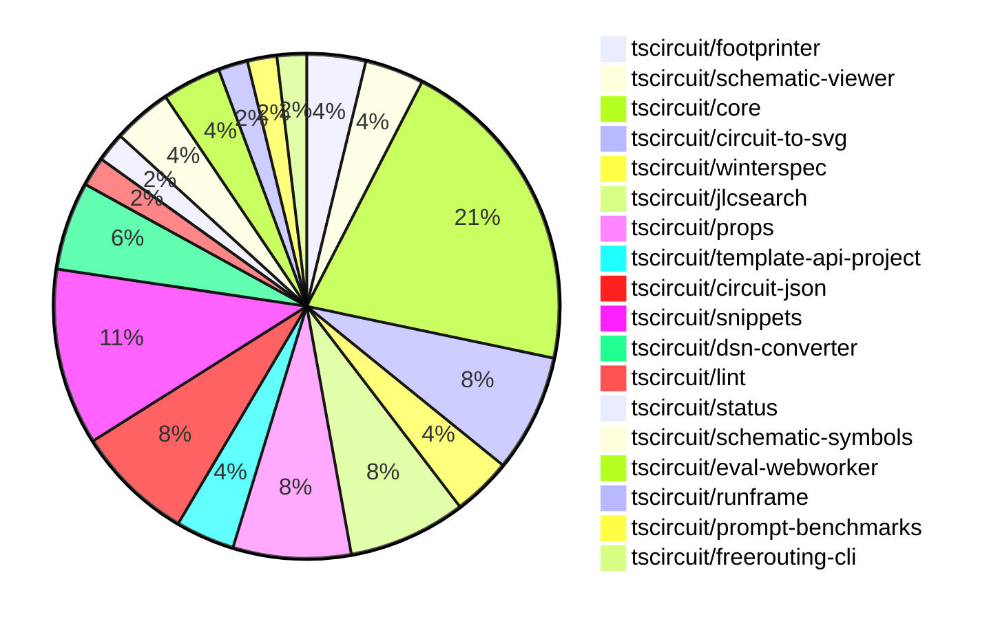

# Contribution Overview 2024-12-18

## PRs by Repository

## Contributor Overview

| Contributor | 🐳 Major | 🐙 Minor | 🐌 Tiny | ⭐ | Issues Created |
|-------------|---------|---------|---------|-----|----------------|
| [seveibar](#seveibar) | 3 | 11 | 0 | 👑 | 61 |
| [ShiboSoftwareDev](#ShiboSoftwareDev) | 2 | 1 | 0 | ⭐⭐ | 6 |
| [imrishabh18](#imrishabh18) | 0 | 7 | 1 | ⭐⭐ | 14 |
| [devin-ai-integration[bot]](#devin-ai-integration[bot]) | 1 | 6 | 0 | ⭐⭐ | 0 |
| [techmannih](#techmannih) | 0 | 7 | 0 | ⭐⭐ | 0 |
| [Abse2001](#Abse2001) | 0 | 5 | 0 | ⭐⭐ | 2 |
| [AnasSarkiz](#AnasSarkiz) | 1 | 3 | 0 | ⭐ | 0 |
| [rohittcodes](#rohittcodes) | 0 | 3 | 0 | ⭐ | 3 |
| [Anshgrover23](#Anshgrover23) | 0 | 2 | 0 | ⭐ | 2 |

## Review Table

[reviews-received-hover]: ## "Number of reviews received for PRs for this contributor"
[approvals-received-hover]: ## "Number of approvals received for PRs this contributor authored"
[rejections-received-hover]: ## "Number of rejections received for PRs this contributor authored"
[prs-opened-hover]: ## "Number of PRs opened by this contributor"
[issues-created-hover]: ## "Number of issues created by this contributor"
[bountied-issues-hover]: ## "Number of issues this contributor created with a bounty"
[bountied-issue-$-hover]: ## "Total bounty amount placed on issues authored by this contributor"

| Contributor | Reviews Received | Approvals Received | Rejections Received | PRs Opened | PRs Merged | Issues Created | Bountied Issues | Bountied Issue $ |
|---|---|---|---|---|---|---|---|---|
| [AnasSarkiz](#AnasSarkiz) | 8 | 4 | 0 | 4 | 4 | 0 | 0 | 0 |
| [seveibar](#seveibar) | 1 | 1 | 0 | 15 | 14 | 61 | 21 | 512 |
| [Abse2001](#Abse2001) | 20 | 6 | 1 | 7 | 5 | 2 | 1 | 10 |
| [Anshgrover23](#Anshgrover23) | 37 | 2 | 8 | 5 | 2 | 2 | 0 | 0 |
| [devin-ai-integration[bot]](#devin-ai-integration[bot]) | 10 | 6 | 3 | 12 | 7 | 0 | 0 | 0 |
| [techmannih](#techmannih) | 26 | 11 | 9 | 13 | 7 | 0 | 0 | 0 |
| [rohittcodes](#rohittcodes) | 6 | 4 | 0 | 4 | 3 | 3 | 2 | 20 |
| [ShiboSoftwareDev](#ShiboSoftwareDev) | 8 | 4 | 1 | 5 | 3 | 6 | 4 | 195 |
| [imrishabh18](#imrishabh18) | 9 | 4 | 0 | 9 | 8 | 14 | 4 | 40 |
| [Niharika0104](#Niharika0104) | 2 | 0 | 1 | 1 | 0 | 1 | 0 | 0 |
| [DrSensor](#DrSensor) | 0 | 0 | 0 | 1 | 0 | 0 | 0 | 0 |

## Changes by Repository

### [tscircuit/footprinter](https://github.com/tscircuit/footprinter)

| PR # | Impact | Contributor | Description |
|------|--------|-------------|-------------|
| [#98](https://github.com/tscircuit/footprinter/pull/98) | 🐳 Major | AnasSarkiz | Introduced a new footprint type called `breakoutheaders` |
| [#100](https://github.com/tscircuit/footprinter/pull/100) | 🐙 Minor | devin-ai-integration[bot] | Fix inner/outer diameter ratio in DIP footprint to match recommended 1.5mm outer diameter. |

### [tscircuit/schematic-viewer](https://github.com/tscircuit/schematic-viewer)

| PR # | Impact | Contributor | Description |
|------|--------|-------------|-------------|
| [#73](https://github.com/tscircuit/schematic-viewer/pull/73) | 🐳 Major | seveibar | Adds drag'n'drop editing functionality to the application. |
| [#74](https://github.com/tscircuit/schematic-viewer/pull/74) | 🐙 Minor | AnasSarkiz | Updated core and circuit-to-svg packages to fix reference designator to be inside the schematic component group |

### [tscircuit/core](https://github.com/tscircuit/core)

| PR # | Impact | Contributor | Description |
|------|--------|-------------|-------------|
| [#443](https://github.com/tscircuit/core/pull/443) | 🐙 Minor | AnasSarkiz | Changed the value of `schematic_component_id` of `component_name_text` to fix issue #152. |
| [#448](https://github.com/tscircuit/core/pull/448) | 🐙 Minor | seveibar | Adds a new document "RENDERING_RULES_AND_GUIDELINES.md" that describes the rules and guidelines for rendering in the project. |
| [#447](https://github.com/tscircuit/core/pull/447) | 🐙 Minor | seveibar | Fixes the schematic component position by using the global schematic position before layout. |
| [#439](https://github.com/tscircuit/core/pull/439) | 🐙 Minor | seveibar | Adds a function `applyEditEventsToManualEditsFile` to apply edit events to a manual edits file, updating the schematic placements. |
| [#436](https://github.com/tscircuit/core/pull/436) | 🐙 Minor | seveibar | Rename "eval_error" event to "external:evalError" |
| [#444](https://github.com/tscircuit/core/pull/444) | 🐙 Minor | Abse2001 | Adds a `ccw_rotation` property to the `SilkscreenText` component. |
| [#424](https://github.com/tscircuit/core/pull/424) | 🐙 Minor | techmannih | Set up continuous branch release with pkg-pr-new |
| [#428](https://github.com/tscircuit/core/pull/428) | 🐙 Minor | techmannih | Adds a new `SilkscreenLine` component to the `lib/components/index.ts` and implements its logic in the `lib/components/primitive-components/SilkscreenLine.ts` file. |
| [#449](https://github.com/tscircuit/core/pull/449) | 🐙 Minor | imrishabh18 | Adds a new test to check the transform for a connected resistor and capacitor inside a group. |
| [#430](https://github.com/tscircuit/core/pull/430) | 🐙 Minor | imrishabh18 | Added a new event type "eval_error" for web worker errors. |
| [#437](https://github.com/tscircuit/core/pull/437) | 🐌 Tiny | imrishabh18 | Updates the lockfile to reflect the latest dependency versions. |

### [tscircuit/circuit-to-svg](https://github.com/tscircuit/circuit-to-svg)

| PR # | Impact | Contributor | Description |
|------|--------|-------------|-------------|
| [#153](https://github.com/tscircuit/circuit-to-svg/pull/153) | 🐙 Minor | AnasSarkiz | Added component name and MPN to the `createSvgObjectsFromSchematicComponentWithBox` function. |
| [#151](https://github.com/tscircuit/circuit-to-svg/pull/151) | 🐙 Minor | seveibar | Add support for computing schematic transform and placing it on the SVG as a data attribute. |
| [#150](https://github.com/tscircuit/circuit-to-svg/pull/150) | 🐙 Minor | seveibar | Add schematic trace ID properties to SVG objects |
| [#155](https://github.com/tscircuit/circuit-to-svg/pull/155) | 🐙 Minor | ShiboSoftwareDev | Adjusts the position of the symbol text in the schematic to account for large schematic symbols. |

### [tscircuit/winterspec](https://github.com/tscircuit/winterspec)

| PR # | Impact | Contributor | Description |
|------|--------|-------------|-------------|
| [#25](https://github.com/tscircuit/winterspec/pull/25) | 🐳 Major | seveibar | Ports the CLI to use the Commander library, adds lots of debug logging, and avoids bundleRequire when running in Bun. |
| [#24](https://github.com/tscircuit/winterspec/pull/24) | 🐙 Minor | seveibar | Add middleware exports |

### [tscircuit/jlcsearch](https://github.com/tscircuit/jlcsearch)

| PR # | Impact | Contributor | Description |
|------|--------|-------------|-------------|
| [#5](https://github.com/tscircuit/jlcsearch/pull/5) | 🐳 Major | seveibar | Add LED driver table and API endpoint |
| [#4](https://github.com/tscircuit/jlcsearch/pull/4) | 🐳 Major | devin-ai-integration[bot] | Added JSON support to all remaining endpoints (voltage regulators, microcontrollers, categories, components, and analog multiplexers) with proper tests and formatting. |
| [#3](https://github.com/tscircuit/jlcsearch/pull/3) | 🐙 Minor | seveibar | Adds workflows for format checking, type checking, and testing, with cache setup across tests. |
| [#6](https://github.com/tscircuit/jlcsearch/pull/6) | 🐙 Minor | devin-ai-integration[bot] |  |

### [tscircuit/props](https://github.com/tscircuit/props)

| PR # | Impact | Contributor | Description |
|------|--------|-------------|-------------|
| [#121](https://github.com/tscircuit/props/pull/121) | 🐙 Minor | seveibar | Fix exports to include manual edit events and improve consistency of edit event type property naming. |
| [#124](https://github.com/tscircuit/props/pull/124) | 🐙 Minor | devin-ai-integration[bot] | Rename `manual_edit_file` to `manual_edits_file` for consistency with the interface name `ManualEditsFile`. |
| [#122](https://github.com/tscircuit/props/pull/122) | 🐙 Minor | devin-ai-integration[bot] | Add TypeScript interface definition for ManualEditsFile to match existing Zod schema |
| [#119](https://github.com/tscircuit/props/pull/119) | 🐙 Minor | techmannih | Adds resonator component with frequency, load capacitance, and pin variant properties. |

### [tscircuit/template-api-project](https://github.com/tscircuit/template-api-project)

| PR # | Impact | Contributor | Description |
|------|--------|-------------|-------------|
| [#3](https://github.com/tscircuit/template-api-project/pull/3) | 🐙 Minor | seveibar | Adds Bun format check, test, and typecheck workflows to the GitHub Actions |
| [#2](https://github.com/tscircuit/template-api-project/pull/2) | 🐙 Minor | seveibar | Adds the `@electric-sql/pglite` and `kysely-pglite` dependencies for development, and updates the `pgstrap` dependency to a newer version. |

### [tscircuit/circuit-json](https://github.com/tscircuit/circuit-json)

| PR # | Impact | Contributor | Description |
|------|--------|-------------|-------------|
| [#108](https://github.com/tscircuit/circuit-json/pull/108) | 🐙 Minor | Anshgrover23 | Add a linting script to the CI that checks for camelCase property names in Zod schemas and non-snake_case enum values. |
| [#102](https://github.com/tscircuit/circuit-json/pull/102) | 🐙 Minor | Anshgrover23 | Implemented a new circuit element called `source_simple_resonator`. |
| [#100](https://github.com/tscircuit/circuit-json/pull/100) | 🐙 Minor | rohittcodes | Adds support for parsing the "KΩ" and "KV" SI unit symbols. |
| [#101](https://github.com/tscircuit/circuit-json/pull/101) | 🐙 Minor | Abse2001 | Added an optional `ccw_rotation` property to the `pcb_silkscreen_text` type. |

### [tscircuit/snippets](https://github.com/tscircuit/snippets)

| PR # | Impact | Contributor | Description |
|------|--------|-------------|-------------|
| [#406](https://github.com/tscircuit/snippets/pull/406) | 🐙 Minor | rohittcodes | Adds a new dialog component for editing the description of a code snippet. |
| [#386](https://github.com/tscircuit/snippets/pull/386) | 🐙 Minor | rohittcodes | Adds an error button that notifies the user when manual edits exist but have not been imported, and provides a way to import them. |
| [#398](https://github.com/tscircuit/snippets/pull/398) | 🐙 Minor | devin-ai-integration[bot] | Add a new USB-C LED Flashlight template |
| [#407](https://github.com/tscircuit/snippets/pull/407) | 🐙 Minor | techmannih | Update the blinking LED circuit template with a larger board size and minor changes to the component connections. |
| [#343](https://github.com/tscircuit/snippets/pull/343) | 🐙 Minor | techmannih | Add a new blinking LED board template to the `get-snippet-template.ts` file. |
| [#393](https://github.com/tscircuit/snippets/pull/393) | 🐙 Minor | imrishabh18 | Update the `@tscircuit/pcb-viewer` dependency to version `^1.10.22`. |

### [tscircuit/dsn-converter](https://github.com/tscircuit/dsn-converter)

| PR # | Impact | Contributor | Description |
|------|--------|-------------|-------------|
| [#72](https://github.com/tscircuit/dsn-converter/pull/72) | 🐙 Minor | Abse2001 | Adds support for the Smoothie Board DSN format |
| [#71](https://github.com/tscircuit/dsn-converter/pull/71) | 🐙 Minor | Abse2001 | Handles errors in `processPin` and `processVis` functions more gracefully by throwing warnings instead of errors. |
| [#73](https://github.com/tscircuit/dsn-converter/pull/73) | 🐙 Minor | imrishabh18 | Fix the linkage between `source_trace` and `pcb_traces` in the DSN session converter. |

### [tscircuit/lint](https://github.com/tscircuit/lint)

| PR # | Impact | Contributor | Description |
|------|--------|-------------|-------------|
| [#1](https://github.com/tscircuit/lint/pull/1) | 🐙 Minor | Abse2001 | This pull request introduces a custom ESLint plugin for TSCircuit projects, including two rules: "banned-words" to prevent the use of generic variable names, and "two-params" to enforce a maximum of two parameters in functions. |

### [tscircuit/status](https://github.com/tscircuit/status)

| PR # | Impact | Contributor | Description |
|------|--------|-------------|-------------|
| [#5](https://github.com/tscircuit/status/pull/5) | 🐙 Minor | devin-ai-integration[bot] | Improve timestamp sorting and add detailed timestamps to tooltips in status bars |

### [tscircuit/schematic-symbols](https://github.com/tscircuit/schematic-symbols)

| PR # | Impact | Contributor | Description |
|------|--------|-------------|-------------|
| [#229](https://github.com/tscircuit/schematic-symbols/pull/229) | 🐙 Minor | techmannih | Add a new double-pole double-throw (DPDT) switch symbol. |
| [#228](https://github.com/tscircuit/schematic-symbols/pull/228) | 🐙 Minor | techmannih | Fixes the coordinates of the anchors on the resonator in the JSON file. |

### [tscircuit/eval-webworker](https://github.com/tscircuit/eval-webworker)

| PR # | Impact | Contributor | Description |
|------|--------|-------------|-------------|
| [#42](https://github.com/tscircuit/eval-webworker/pull/42) | 🐙 Minor | imrishabh18 | Revert the previous change to remove the `emitError` function from the `InternalWebWorkerApi` type and the corresponding implementation in the `evalCompiledJs` and `execute` functions. |
| [#33](https://github.com/tscircuit/eval-webworker/pull/33) | 🐙 Minor | imrishabh18 | Adds an `emitError` function to the `webWorkerApi` object to emit errors during code evaluation. |

### [tscircuit/runframe](https://github.com/tscircuit/runframe)

| PR # | Impact | Contributor | Description |
|------|--------|-------------|-------------|
| [#19](https://github.com/tscircuit/runframe/pull/19) | 🐙 Minor | imrishabh18 | Adds error handling to the RunFrame component, displaying the error message in the tab. |

### [tscircuit/prompt-benchmarks](https://github.com/tscircuit/prompt-benchmarks)

| PR # | Impact | Contributor | Description |
|------|--------|-------------|-------------|
| [#12](https://github.com/tscircuit/prompt-benchmarks/pull/12) | 🐳 Major | ShiboSoftwareDev | Refactored the evalite benchmark to use a new architecture suggested by Matt, including a new CircuitScorer. |

### [tscircuit/freerouting-cli](https://github.com/tscircuit/freerouting-cli)

| PR # | Impact | Contributor | Description |
|------|--------|-------------|-------------|
| [#5](https://github.com/tscircuit/freerouting-cli/pull/5) | 🐳 Major | ShiboSoftwareDev | Adds Docker-based end-to-end testing for the freerouting CLI. |

## Changes by Contributor

### [AnasSarkiz](https://github.com/AnasSarkiz)

| PR # | Impact | Description |
|------|--------|-------------|
| [#98](https://github.com/tscircuit/footprinter/pull/98) | 🐳 Major | Introduced a new footprint type called `breakoutheaders` |
| [#74](https://github.com/tscircuit/schematic-viewer/pull/74) | 🐙 Minor | Updated core and circuit-to-svg packages to fix reference designator to be inside the schematic component group |
| [#443](https://github.com/tscircuit/core/pull/443) | 🐙 Minor | Changed the value of `schematic_component_id` of `component_name_text` to fix issue #152. |
| [#153](https://github.com/tscircuit/circuit-to-svg/pull/153) | 🐙 Minor | Added component name and MPN to the `createSvgObjectsFromSchematicComponentWithBox` function. |

### [seveibar](https://github.com/seveibar)

| PR # | Impact | Description |
|------|--------|-------------|
| [#73](https://github.com/tscircuit/schematic-viewer/pull/73) | 🐳 Major | Adds drag'n'drop editing functionality to the application. |
| [#25](https://github.com/tscircuit/winterspec/pull/25) | 🐳 Major | Ports the CLI to use the Commander library, adds lots of debug logging, and avoids bundleRequire when running in Bun. |
| [#5](https://github.com/tscircuit/jlcsearch/pull/5) | 🐳 Major | Add LED driver table and API endpoint |
| [#121](https://github.com/tscircuit/props/pull/121) | 🐙 Minor | Fix exports to include manual edit events and improve consistency of edit event type property naming. |
| [#24](https://github.com/tscircuit/winterspec/pull/24) | 🐙 Minor | Add middleware exports |
| [#448](https://github.com/tscircuit/core/pull/448) | 🐙 Minor | Adds a new document "RENDERING_RULES_AND_GUIDELINES.md" that describes the rules and guidelines for rendering in the project. |
| [#447](https://github.com/tscircuit/core/pull/447) | 🐙 Minor | Fixes the schematic component position by using the global schematic position before layout. |
| [#439](https://github.com/tscircuit/core/pull/439) | 🐙 Minor | Adds a function `applyEditEventsToManualEditsFile` to apply edit events to a manual edits file, updating the schematic placements. |
| [#436](https://github.com/tscircuit/core/pull/436) | 🐙 Minor | Rename "eval_error" event to "external:evalError" |
| [#151](https://github.com/tscircuit/circuit-to-svg/pull/151) | 🐙 Minor | Add support for computing schematic transform and placing it on the SVG as a data attribute. |
| [#150](https://github.com/tscircuit/circuit-to-svg/pull/150) | 🐙 Minor | Add schematic trace ID properties to SVG objects |
| [#3](https://github.com/tscircuit/template-api-project/pull/3) | 🐙 Minor | Adds Bun format check, test, and typecheck workflows to the GitHub Actions |
| [#2](https://github.com/tscircuit/template-api-project/pull/2) | 🐙 Minor | Adds the `@electric-sql/pglite` and `kysely-pglite` dependencies for development, and updates the `pgstrap` dependency to a newer version. |
| [#3](https://github.com/tscircuit/jlcsearch/pull/3) | 🐙 Minor | Adds workflows for format checking, type checking, and testing, with cache setup across tests. |

### [Anshgrover23](https://github.com/Anshgrover23)

| PR # | Impact | Description |
|------|--------|-------------|
| [#108](https://github.com/tscircuit/circuit-json/pull/108) | 🐙 Minor | Add a linting script to the CI that checks for camelCase property names in Zod schemas and non-snake_case enum values. |
| [#102](https://github.com/tscircuit/circuit-json/pull/102) | 🐙 Minor | Implemented a new circuit element called `source_simple_resonator`. |

### [rohittcodes](https://github.com/rohittcodes)

| PR # | Impact | Description |
|------|--------|-------------|
| [#100](https://github.com/tscircuit/circuit-json/pull/100) | 🐙 Minor | Adds support for parsing the "KΩ" and "KV" SI unit symbols. |
| [#406](https://github.com/tscircuit/snippets/pull/406) | 🐙 Minor | Adds a new dialog component for editing the description of a code snippet. |
| [#386](https://github.com/tscircuit/snippets/pull/386) | 🐙 Minor | Adds an error button that notifies the user when manual edits exist but have not been imported, and provides a way to import them. |

### [Abse2001](https://github.com/Abse2001)

| PR # | Impact | Description |
|------|--------|-------------|
| [#101](https://github.com/tscircuit/circuit-json/pull/101) | 🐙 Minor | Added an optional `ccw_rotation` property to the `pcb_silkscreen_text` type. |
| [#444](https://github.com/tscircuit/core/pull/444) | 🐙 Minor | Adds a `ccw_rotation` property to the `SilkscreenText` component. |
| [#72](https://github.com/tscircuit/dsn-converter/pull/72) | 🐙 Minor | Adds support for the Smoothie Board DSN format |
| [#71](https://github.com/tscircuit/dsn-converter/pull/71) | 🐙 Minor | Handles errors in `processPin` and `processVis` functions more gracefully by throwing warnings instead of errors. |
| [#1](https://github.com/tscircuit/lint/pull/1) | 🐙 Minor | This pull request introduces a custom ESLint plugin for TSCircuit projects, including two rules: "banned-words" to prevent the use of generic variable names, and "two-params" to enforce a maximum of two parameters in functions. |

### [devin-ai-integration[bot]](https://github.com/devin-ai-integration[bot])

| PR # | Impact | Description |
|------|--------|-------------|
| [#4](https://github.com/tscircuit/jlcsearch/pull/4) | 🐳 Major | Added JSON support to all remaining endpoints (voltage regulators, microcontrollers, categories, components, and analog multiplexers) with proper tests and formatting. |
| [#124](https://github.com/tscircuit/props/pull/124) | 🐙 Minor | Rename `manual_edit_file` to `manual_edits_file` for consistency with the interface name `ManualEditsFile`. |
| [#122](https://github.com/tscircuit/props/pull/122) | 🐙 Minor | Add TypeScript interface definition for ManualEditsFile to match existing Zod schema |
| [#100](https://github.com/tscircuit/footprinter/pull/100) | 🐙 Minor | Fix inner/outer diameter ratio in DIP footprint to match recommended 1.5mm outer diameter. |
| [#398](https://github.com/tscircuit/snippets/pull/398) | 🐙 Minor | Add a new USB-C LED Flashlight template |
| [#6](https://github.com/tscircuit/jlcsearch/pull/6) | 🐙 Minor |  |
| [#5](https://github.com/tscircuit/status/pull/5) | 🐙 Minor | Improve timestamp sorting and add detailed timestamps to tooltips in status bars |

### [techmannih](https://github.com/techmannih)

| PR # | Impact | Description |
|------|--------|-------------|
| [#119](https://github.com/tscircuit/props/pull/119) | 🐙 Minor | Adds resonator component with frequency, load capacitance, and pin variant properties. |
| [#424](https://github.com/tscircuit/core/pull/424) | 🐙 Minor | Set up continuous branch release with pkg-pr-new |
| [#428](https://github.com/tscircuit/core/pull/428) | 🐙 Minor | Adds a new `SilkscreenLine` component to the `lib/components/index.ts` and implements its logic in the `lib/components/primitive-components/SilkscreenLine.ts` file. |
| [#229](https://github.com/tscircuit/schematic-symbols/pull/229) | 🐙 Minor | Add a new double-pole double-throw (DPDT) switch symbol. |
| [#228](https://github.com/tscircuit/schematic-symbols/pull/228) | 🐙 Minor | Fixes the coordinates of the anchors on the resonator in the JSON file. |
| [#407](https://github.com/tscircuit/snippets/pull/407) | 🐙 Minor | Update the blinking LED circuit template with a larger board size and minor changes to the component connections. |
| [#343](https://github.com/tscircuit/snippets/pull/343) | 🐙 Minor | Add a new blinking LED board template to the `get-snippet-template.ts` file. |

### [imrishabh18](https://github.com/imrishabh18)

| PR # | Impact | Description |
|------|--------|-------------|
| [#449](https://github.com/tscircuit/core/pull/449) | 🐙 Minor | Adds a new test to check the transform for a connected resistor and capacitor inside a group. |
| [#430](https://github.com/tscircuit/core/pull/430) | 🐙 Minor | Added a new event type "eval_error" for web worker errors. |
| [#73](https://github.com/tscircuit/dsn-converter/pull/73) | 🐙 Minor | Fix the linkage between `source_trace` and `pcb_traces` in the DSN session converter. |
| [#393](https://github.com/tscircuit/snippets/pull/393) | 🐙 Minor | Update the `@tscircuit/pcb-viewer` dependency to version `^1.10.22`. |
| [#42](https://github.com/tscircuit/eval-webworker/pull/42) | 🐙 Minor | Revert the previous change to remove the `emitError` function from the `InternalWebWorkerApi` type and the corresponding implementation in the `evalCompiledJs` and `execute` functions. |
| [#33](https://github.com/tscircuit/eval-webworker/pull/33) | 🐙 Minor | Adds an `emitError` function to the `webWorkerApi` object to emit errors during code evaluation. |
| [#19](https://github.com/tscircuit/runframe/pull/19) | 🐙 Minor | Adds error handling to the RunFrame component, displaying the error message in the tab. |
| [#437](https://github.com/tscircuit/core/pull/437) | 🐌 Tiny | Updates the lockfile to reflect the latest dependency versions. |

### [ShiboSoftwareDev](https://github.com/ShiboSoftwareDev)

| PR # | Impact | Description |
|------|--------|-------------|
| [#12](https://github.com/tscircuit/prompt-benchmarks/pull/12) | 🐳 Major | Refactored the evalite benchmark to use a new architecture suggested by Matt, including a new CircuitScorer. |
| [#5](https://github.com/tscircuit/freerouting-cli/pull/5) | 🐳 Major | Adds Docker-based end-to-end testing for the freerouting CLI. |
| [#155](https://github.com/tscircuit/circuit-to-svg/pull/155) | 🐙 Minor | Adjusts the position of the symbol text in the schematic to account for large schematic symbols. |

