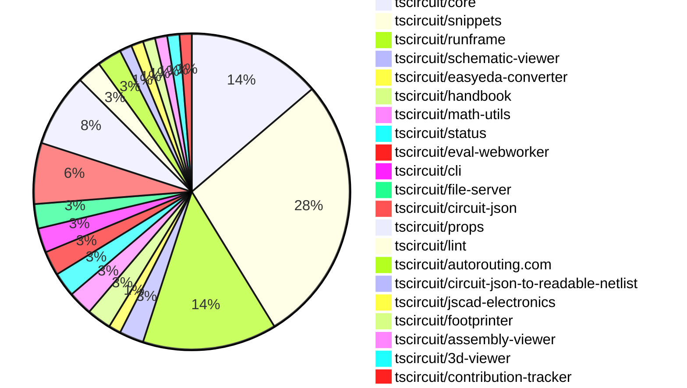

# Contribution Overview 2024-12-25

## PRs by Repository

## Contributor Overview

| Contributor | 🐳 Major | 🐙 Minor | 🐌 Tiny | ⭐ | Issues Created |
|-------------|---------|---------|---------|-----|----------------|
| [seveibar](#seveibar) | 8 | 29 | 0 | 👑👑👑 | 69 |
| [Anshgrover23](#Anshgrover23) | 2 | 15 | 1 | ⭐⭐⭐ | 13 |
| [ShiboSoftwareDev](#ShiboSoftwareDev) | 1 | 2 | 0 | ⭐⭐⭐ | 14 |
| [Abse2001](#Abse2001) | 0 | 6 | 0 | ⭐⭐ | 3 |
| [AnasSarkiz](#AnasSarkiz) | 1 | 2 | 0 | ⭐⭐ | 4 |
| [devin-ai-integration[bot]](#devin-ai-integration[bot]) | 1 | 3 | 0 | ⭐ | 0 |
| [techmannih](#techmannih) | 0 | 4 | 0 | ⭐ | 3 |
| [imrishabh18](#imrishabh18) | 0 | 1 | 0 | ⭐ | 8 |
| [DrSensor](#DrSensor) | 0 | 1 | 0 |  | 0 |
| [krushnarout](#krushnarout) | 0 | 1 | 0 |  | 0 |
| [karthik-nair-20](#karthik-nair-20) | 0 | 1 | 0 |  | 0 |

## Review Table

[reviews-received-hover]: ## "Number of reviews received for PRs for this contributor"
[approvals-received-hover]: ## "Number of approvals received for PRs this contributor authored"
[rejections-received-hover]: ## "Number of rejections received for PRs this contributor authored"
[prs-opened-hover]: ## "Number of PRs opened by this contributor"
[issues-created-hover]: ## "Number of issues created by this contributor"
[bountied-issues-hover]: ## "Number of issues this contributor created with a bounty"
[bountied-issue-$-hover]: ## "Total bounty amount placed on issues authored by this contributor"

| Contributor | Reviews Received | Approvals Received | Rejections Received | Approvals | Rejections | PRs Opened | PRs Merged | Issues Created | Bountied Issues | Bountied Issue $ |
|---|---|---|---|---|---|---|---|---|---|---|
| [seveibar](#seveibar) | 1 | 0 | 0 | 42 | 20 | 41 | 38 | 69 | 39 | 729 |
| [Abse2001](#Abse2001) | 14 | 6 | 0 | 2 | 0 | 7 | 6 | 3 | 3 | 32 |
| [DrSensor](#DrSensor) | 1 | 1 | 0 | 0 | 0 | 1 | 1 | 0 | 0 | 0 |
| [devin-ai-integration[bot]](#devin-ai-integration[bot]) | 8 | 3 | 1 | 0 | 0 | 12 | 4 | 0 | 0 | 0 |
| [Anshgrover23](#Anshgrover23) | 75 | 20 | 16 | 0 | 4 | 28 | 18 | 13 | 1 | 4 |
| [techmannih](#techmannih) | 25 | 5 | 11 | 0 | 0 | 12 | 4 | 3 | 0 | 0 |
| [imrishabh18](#imrishabh18) | 2 | 1 | 0 | 0 | 2 | 2 | 1 | 8 | 3 | 20 |
| [ShiboSoftwareDev](#ShiboSoftwareDev) | 9 | 4 | 0 | 1 | 3 | 5 | 3 | 14 | 6 | 102 |
| [AnasSarkiz](#AnasSarkiz) | 4 | 4 | 0 | 0 | 0 | 3 | 3 | 4 | 2 | 20 |
| [vishwamartur](#vishwamartur) | 1 | 0 | 1 | 0 | 0 | 1 | 0 | 0 | 0 | 0 |
| [abhijitxy](#abhijitxy) | 0 | 0 | 0 | 1 | 0 | 0 | 0 | 0 | 0 | 0 |
| [krushnarout](#krushnarout) | 1 | 1 | 0 | 0 | 0 | 2 | 1 | 0 | 0 | 0 |
| [karthik-nair-20](#karthik-nair-20) | 1 | 1 | 0 | 0 | 0 | 2 | 1 | 0 | 0 | 0 |

## Changes by Repository

### [tscircuit/core](https://github.com/tscircuit/core)

| PR # | Impact | Contributor | Description |
|------|--------|-------------|-------------|
| [#455](https://github.com/tscircuit/core/pull/455) | 🐳 Major | seveibar | Add support for schematic manual placements |
| [#442](https://github.com/tscircuit/core/pull/442) | 🐳 Major | Anshgrover23 | Adds a new component called "resonator" with a default schematic and a schematic without ground. |
| [#459](https://github.com/tscircuit/core/pull/459) | 🐳 Major | Anshgrover23 | Adds a new transistor component to the library. |
| [#475](https://github.com/tscircuit/core/pull/475) | 🐙 Minor | seveibar | Allow non-numeric pin labels for schPinStyle |
| [#470](https://github.com/tscircuit/core/pull/470) | 🐙 Minor | seveibar | Improves the positioning of schematic components and text by using the global schematic position instead of the individual component's position. |
| [#468](https://github.com/tscircuit/core/pull/468) | 🐙 Minor | seveibar | Improve the error messages in the RootCircuit class to provide more meaningful information. |
| [#458](https://github.com/tscircuit/core/pull/458) | 🐙 Minor | seveibar | Add a new export `Circuit` that is currently just an alias for `RootCircuit` for backwards compatibility. |
| [#457](https://github.com/tscircuit/core/pull/457) | 🐙 Minor | seveibar | Adds support for sending the display name to the autorouting server and adds a new field `pcbRoutingDisabled` to the `RootCircuit` class. |
| [#456](https://github.com/tscircuit/core/pull/456) | 🐙 Minor | seveibar | Rename `Circuit` class to `RootCircuit` class. |
| [#472](https://github.com/tscircuit/core/pull/472) | 🐙 Minor | Abse2001 | Adds a new feature to trace components, allowing them to have a maximum length constraint based on connected capacitors. |
| [#466](https://github.com/tscircuit/core/pull/466) | 🐙 Minor | Anshgrover23 | Add the `display_value` property for capacitor and resistor components to display the values in the schematic. |

### [tscircuit/snippets](https://github.com/tscircuit/snippets)

| PR # | Impact | Contributor | Description |
|------|--------|-------------|-------------|
| [#446](https://github.com/tscircuit/snippets/pull/446) | 🐳 Major | seveibar | Adds a new landing page with HTML, metadata, and images |
| [#423](https://github.com/tscircuit/snippets/pull/423) | 🐳 Major | ShiboSoftwareDev | Import snippets from registry to development server |
| [#468](https://github.com/tscircuit/snippets/pull/468) | 🐙 Minor | seveibar | Improves the layout of the landing page bullet points on mobile devices by adding a grid layout and hiding the "Open Web Standards" bullet point on smaller screens. |
| [#463](https://github.com/tscircuit/snippets/pull/463) | 🐙 Minor | seveibar | Fixes a bug where unsaved changes never went away and adds analytics tracking. |
| [#454](https://github.com/tscircuit/snippets/pull/454) | 🐙 Minor | seveibar | Introduces a slower animation for the trending snippets carousel and adds a PCB view in the carousel items. |
| [#451](https://github.com/tscircuit/snippets/pull/451) | 🐙 Minor | seveibar | Adds a search feature to the landing page and improves the FAQ section with more questions and answers. |
| [#442](https://github.com/tscircuit/snippets/pull/442) | 🐙 Minor | seveibar | Improve SEO by adding new title, meta tags, and canonical link to the index.html file. |
| [#438](https://github.com/tscircuit/snippets/pull/438) | 🐙 Minor | seveibar | Add download for readable netlist |
| [#430](https://github.com/tscircuit/snippets/pull/430) | 🐙 Minor | seveibar | Add circuit name for better logs on autorouting server |
| [#460](https://github.com/tscircuit/snippets/pull/460) | 🐙 Minor | Anshgrover23 | Fix the search component to add a max-height and overflow-y-auto to the search results container. |
| [#472](https://github.com/tscircuit/snippets/pull/472) | 🐙 Minor | Anshgrover23 | Add Algora bounty badge to the README.md |
| [#458](https://github.com/tscircuit/snippets/pull/458) | 🐙 Minor | Anshgrover23 | Fixes issues with Playwright tests |
| [#452](https://github.com/tscircuit/snippets/pull/452) | 🐙 Minor | Anshgrover23 | Adds the display of the number of stars for each snippet on the user profile page. |
| [#434](https://github.com/tscircuit/snippets/pull/434) | 🐙 Minor | Anshgrover23 | Changes the save button to a fork button if the current user does not own the snippet. |
| [#431](https://github.com/tscircuit/snippets/pull/431) | 🐙 Minor | Anshgrover23 | Fixes the playwright tests that were failing |
| [#422](https://github.com/tscircuit/snippets/pull/422) | 🐙 Minor | Anshgrover23 | Add `waitForLoadState` to ensure tests wait for network requests and animations to complete before taking screenshots. |
| [#475](https://github.com/tscircuit/snippets/pull/475) | 🐙 Minor | techmannih | Add a download button for the Assembly SVG file |
| [#439](https://github.com/tscircuit/snippets/pull/439) | 🐙 Minor | devin-ai-integration[bot] | Switch the chat icon in the header to the Discord logo |
| [#465](https://github.com/tscircuit/snippets/pull/465) | 🐙 Minor | krushnarout | Adds a new button to the landing page to show a header dropdown when the user is logged in. |
| [#425](https://github.com/tscircuit/snippets/pull/425) | 🐙 Minor | karthik-nair-20 | Align the EditorNav component to the right side on responsive devices. |
| [#417](https://github.com/tscircuit/snippets/pull/417) | 🐙 Minor | imrishabh18 | Fix importing manual edits when the file is empty |
| [#448](https://github.com/tscircuit/snippets/pull/448) | 🐌 Tiny | Anshgrover23 | Update snapshots of homePage test |

### [tscircuit/runframe](https://github.com/tscircuit/runframe)

| PR # | Impact | Contributor | Description |
|------|--------|-------------|-------------|
| [#79](https://github.com/tscircuit/runframe/pull/79) | 🐳 Major | seveibar | Fixes issues with re-rendering on entrypoint change and the order of promises for evaluation and rendering. |
| [#77](https://github.com/tscircuit/runframe/pull/77) | 🐳 Major | seveibar | Use run frame for CLI as default static build target, load initial files via list, and add logging for selected entrypoint. |
| [#73](https://github.com/tscircuit/runframe/pull/73) | 🐳 Major | seveibar | Adds a "save snippet" button, formalizes events for syncing between the client and server. |
| [#52](https://github.com/tscircuit/runframe/pull/52) | 🐳 Major | seveibar | Adds schematic drag'n'drop support with filesystem syncing via @tscircuit/file-server |
| [#84](https://github.com/tscircuit/runframe/pull/84) | 🐙 Minor | seveibar | Update the versions of the `@tscircuit/core` and `@tscircuit/eval-webworker` packages. |
| [#78](https://github.com/tscircuit/runframe/pull/78) | 🐙 Minor | seveibar | Fix an issue where the `entrypoint` prop was not triggering a re-render in the `RunFrame` component. |
| [#76](https://github.com/tscircuit/runframe/pull/76) | 🐙 Minor | seveibar | Use the `RunFrameForCli` component as the default static build target and load initial files via a list. |
| [#75](https://github.com/tscircuit/runframe/pull/75) | 🐙 Minor | seveibar | Changes the default static build target from `RunFrameWithApi` to `RunFrameForCli`. |
| [#60](https://github.com/tscircuit/runframe/pull/60) | 🐙 Minor | seveibar | Fix for handling `fsMap` prop in `RunFrame` component. |
| [#48](https://github.com/tscircuit/runframe/pull/48) | 🐙 Minor | seveibar | Adds a new `leftHeaderContent` prop to the `CircuitJsonPreview` and `RunFrame` components, allowing for custom content on the left side of the header. |
| [#65](https://github.com/tscircuit/runframe/pull/65) | 🐙 Minor | techmannih | Add an assembly view to the circuit visualization tool. |

### [tscircuit/schematic-viewer](https://github.com/tscircuit/schematic-viewer)

| PR # | Impact | Contributor | Description |
|------|--------|-------------|-------------|
| [#76](https://github.com/tscircuit/schematic-viewer/pull/76) | 🐙 Minor | seveibar | Fix circuit JSON updates by adding debug statements and ensuring the circuit JSON is up to date when computing the original center for the edit event. |
| [#75](https://github.com/tscircuit/schematic-viewer/pull/75) | 🐙 Minor | seveibar | Change tscircuit dependencies to peer deps to avoid duplicates |

### [tscircuit/easyeda-converter](https://github.com/tscircuit/easyeda-converter)

| PR # | Impact | Contributor | Description |
|------|--------|-------------|-------------|
| [#141](https://github.com/tscircuit/easyeda-converter/pull/141) | 🐙 Minor | seveibar | Adds instructions for adding new part tests to the README.md file. |

### [tscircuit/handbook](https://github.com/tscircuit/handbook)

| PR # | Impact | Contributor | Description |
|------|--------|-------------|-------------|
| [#6](https://github.com/tscircuit/handbook/pull/6) | 🐙 Minor | seveibar | Adds a new markdown file "learn-git.md" that provides guidance on learning Git and resolving `bun.lockb` conflicts. |
| [#4](https://github.com/tscircuit/handbook/pull/4) | 🐙 Minor | Abse2001 | Added a tutorial for using yalc for local development. |

### [tscircuit/math-utils](https://github.com/tscircuit/math-utils)

| PR # | Impact | Contributor | Description |
|------|--------|-------------|-------------|
| [#3](https://github.com/tscircuit/math-utils/pull/3) | 🐙 Minor | seveibar | Adds support for centering the grid and improves the calculation of cell dimensions and positions. |
| [#2](https://github.com/tscircuit/math-utils/pull/2) | 🐙 Minor | seveibar | Add support for a grid function |

### [tscircuit/status](https://github.com/tscircuit/status)

| PR # | Impact | Contributor | Description |
|------|--------|-------------|-------------|
| [#6](https://github.com/tscircuit/status/pull/6) | 🐙 Minor | seveibar | Filter outages shorter than 15 minutes from the OutageTable component. |
| [#8](https://github.com/tscircuit/status/pull/8) | 🐙 Minor | devin-ai-integration[bot] | Improve the display of outage durations by showing them in a more human-readable format. |

### [tscircuit/eval-webworker](https://github.com/tscircuit/eval-webworker)

| PR # | Impact | Contributor | Description |
|------|--------|-------------|-------------|
| [#55](https://github.com/tscircuit/eval-webworker/pull/55) | 🐙 Minor | seveibar | Update core, fix types, and add support for naming the circuit. |
| [#54](https://github.com/tscircuit/eval-webworker/pull/54) | 🐙 Minor | seveibar | Adds exports for `CircuitWebWorker` and `WebWorkerConfiguration` types. |

### [tscircuit/cli](https://github.com/tscircuit/cli)

| PR # | Impact | Contributor | Description |
|------|--------|-------------|-------------|
| [#11](https://github.com/tscircuit/cli/pull/11) | 🟣 | seveibar | Fix Module Import issue in cli build |
| [#10](https://github.com/tscircuit/cli/pull/10) | 🐳 Major | seveibar | Adds drag and drop support, dynamic loading of runframe, and event watcher on CLI. |

### [tscircuit/file-server](https://github.com/tscircuit/file-server)

| PR # | Impact | Contributor | Description |
|------|--------|-------------|-------------|
| [#3](https://github.com/tscircuit/file-server/pull/3) | 🐳 Major | seveibar | Introduces a new admin page for managing events and files, and adds a new route for listing events. |
| [#2](https://github.com/tscircuit/file-server/pull/2) | 🐙 Minor | seveibar | Add a new `/events/reset` route to reset the events in the database. |

### [tscircuit/circuit-json](https://github.com/tscircuit/circuit-json)

| PR # | Impact | Contributor | Description |
|------|--------|-------------|-------------|
| [#114](https://github.com/tscircuit/circuit-json/pull/114) | 🐙 Minor | Abse2001 | Added a new optional property `max_decoupling_trace_length` to the `source_simple_capacitor` type. |
| [#113](https://github.com/tscircuit/circuit-json/pull/113) | 🐙 Minor | Abse2001 | Added `trace_length` property to `pcb_trace` and `max_length` property to `source_trace`. |
| [#111](https://github.com/tscircuit/circuit-json/pull/111) | 🐙 Minor | Anshgrover23 | Add `display_resistance` and `display_capacitance` to the Zod schema for `SourceSimpleResistor` and `SourceSimpleCapacitor` types. |
| [#103](https://github.com/tscircuit/circuit-json/pull/103) | 🐙 Minor | Anshgrover23 | Adds a new circuit element called "simple_transistor" to the project. |
| [#105](https://github.com/tscircuit/circuit-json/pull/105) | 🐙 Minor | techmannih | Adds a new type of plated hole in the PCB component specification, which is a circular hole with a rectangular pad. |

### [tscircuit/props](https://github.com/tscircuit/props)

| PR # | Impact | Contributor | Description |
|------|--------|-------------|-------------|
| [#133](https://github.com/tscircuit/props/pull/133) | 🐳 Major | devin-ai-integration[bot] | Adds a new MOSFET component with props and comprehensive test suite. |
| [#139](https://github.com/tscircuit/props/pull/139) | 🐙 Minor | Abse2001 | Added `maxDecouplingTraceLength` prop to `CapacitorProps` and `maxLength` prop to `TraceProps`. |
| [#141](https://github.com/tscircuit/props/pull/141) | 🐙 Minor | Anshgrover23 | Adds a new `noSchematicRepresentation` property to the `chipProps` type, allowing users to disable the schematic representation of a chip. |
| [#125](https://github.com/tscircuit/props/pull/125) | 🐙 Minor | Anshgrover23 | Add transistorProps, a new set of component properties for transistors. |
| [#131](https://github.com/tscircuit/props/pull/131) | 🐙 Minor | Anshgrover23 | Fixes the resonator pin variant property by updating the allowed values and making it optional. |
| [#135](https://github.com/tscircuit/props/pull/135) | 🐙 Minor | devin-ai-integration[bot] | This pull request adds an automated script to generate documentation for the manual edit events and files in the project. |

### [tscircuit/lint](https://github.com/tscircuit/lint)

| PR # | Impact | Contributor | Description |
|------|--------|-------------|-------------|
| [#7](https://github.com/tscircuit/lint/pull/7) | 🐙 Minor | Abse2001 | Adds a new ESLint rule to enforce the context-passing pattern for functions with two parameters. |
| [#5](https://github.com/tscircuit/lint/pull/5) | 🐙 Minor | techmannih | Enable `tscircuit-lint` command in the project by modifying the `package.json` and adding a `tsup` configuration file. |

### [tscircuit/autorouting.com](https://github.com/tscircuit/autorouting.com)

| PR # | Impact | Contributor | Description |
|------|--------|-------------|-------------|
| [#10](https://github.com/tscircuit/autorouting.com/pull/10) | 🐙 Minor | Anshgrover23 | Automatically retry sample uploads up to 3 times |
| [#12](https://github.com/tscircuit/autorouting.com/pull/12) | 🐙 Minor | ShiboSoftwareDev | Removed the "force-dynamic" configuration for various pages, which allows Next.js to statically prerender the pages. |

### [tscircuit/circuit-json-to-readable-netlist](https://github.com/tscircuit/circuit-json-to-readable-netlist)

| PR # | Impact | Contributor | Description |
|------|--------|-------------|-------------|
| [#3](https://github.com/tscircuit/circuit-json-to-readable-netlist/pull/3) | 🐙 Minor | Anshgrover23 | Add a new "COMPONENTS" section to the readable netlist, providing a description for each component in the circuit. |

### [tscircuit/jscad-electronics](https://github.com/tscircuit/jscad-electronics)

| PR # | Impact | Contributor | Description |
|------|--------|-------------|-------------|
| [#84](https://github.com/tscircuit/jscad-electronics/pull/84) | 🐳 Major | AnasSarkiz | Added 3D components for missing imperial passive footprints (01005, 0201, 1206, 1210, 2010, 2512) and a footprint example for cap1206. |

### [tscircuit/footprinter](https://github.com/tscircuit/footprinter)

| PR # | Impact | Contributor | Description |
|------|--------|-------------|-------------|
| [#103](https://github.com/tscircuit/footprinter/pull/103) | 🐙 Minor | AnasSarkiz | Fixed the imperial footprints of passive components. |

### [tscircuit/assembly-viewer](https://github.com/tscircuit/assembly-viewer)

| PR # | Impact | Contributor | Description |
|------|--------|-------------|-------------|
| [#4](https://github.com/tscircuit/assembly-viewer/pull/4) | 🐙 Minor | AnasSarkiz | Added footprint prop to capacitors and resistors in example circuit |

### [tscircuit/3d-viewer](https://github.com/tscircuit/3d-viewer)

| PR # | Impact | Contributor | Description |
|------|--------|-------------|-------------|
| [#96](https://github.com/tscircuit/3d-viewer/pull/96) | 🐙 Minor | DrSensor | Adds hooks for exporting CAD data to GLTF format |

### [tscircuit/contribution-tracker](https://github.com/tscircuit/contribution-tracker)

| PR # | Impact | Contributor | Description |
|------|--------|-------------|-------------|
| [#27](https://github.com/tscircuit/contribution-tracker/pull/27) | 🐙 Minor | ShiboSoftwareDev | This pull request introduces a feature to count approvals and rejections as tiny contribution points, with a maximum of 20 points across approvals and rejections. |

## Changes by Contributor

### [seveibar](https://github.com/seveibar)

| PR # | Impact | Description |
|------|--------|-------------|
| [#455](https://github.com/tscircuit/core/pull/455) | 🐳 Major | Add support for schematic manual placements |
| [#446](https://github.com/tscircuit/snippets/pull/446) | 🐳 Major | Adds a new landing page with HTML, metadata, and images |
| [#79](https://github.com/tscircuit/runframe/pull/79) | 🐳 Major | Fixes issues with re-rendering on entrypoint change and the order of promises for evaluation and rendering. |
| [#77](https://github.com/tscircuit/runframe/pull/77) | 🐳 Major | Use run frame for CLI as default static build target, load initial files via list, and add logging for selected entrypoint. |
| [#73](https://github.com/tscircuit/runframe/pull/73) | 🐳 Major | Adds a "save snippet" button, formalizes events for syncing between the client and server. |
| [#52](https://github.com/tscircuit/runframe/pull/52) | 🐳 Major | Adds schematic drag'n'drop support with filesystem syncing via @tscircuit/file-server |
| [#76](https://github.com/tscircuit/schematic-viewer/pull/76) | 🐙 Minor | Fix circuit JSON updates by adding debug statements and ensuring the circuit JSON is up to date when computing the original center for the edit event. |
| [#75](https://github.com/tscircuit/schematic-viewer/pull/75) | 🐙 Minor | Change tscircuit dependencies to peer deps to avoid duplicates |
| [#141](https://github.com/tscircuit/easyeda-converter/pull/141) | 🐙 Minor | Adds instructions for adding new part tests to the README.md file. |
| [#475](https://github.com/tscircuit/core/pull/475) | 🐙 Minor | Allow non-numeric pin labels for schPinStyle |
| [#470](https://github.com/tscircuit/core/pull/470) | 🐙 Minor | Improves the positioning of schematic components and text by using the global schematic position instead of the individual component's position. |
| [#468](https://github.com/tscircuit/core/pull/468) | 🐙 Minor | Improve the error messages in the RootCircuit class to provide more meaningful information. |
| [#458](https://github.com/tscircuit/core/pull/458) | 🐙 Minor | Add a new export `Circuit` that is currently just an alias for `RootCircuit` for backwards compatibility. |
| [#457](https://github.com/tscircuit/core/pull/457) | 🐙 Minor | Adds support for sending the display name to the autorouting server and adds a new field `pcbRoutingDisabled` to the `RootCircuit` class. |
| [#456](https://github.com/tscircuit/core/pull/456) | 🐙 Minor | Rename `Circuit` class to `RootCircuit` class. |
| [#6](https://github.com/tscircuit/handbook/pull/6) | 🐙 Minor | Adds a new markdown file "learn-git.md" that provides guidance on learning Git and resolving `bun.lockb` conflicts. |
| [#3](https://github.com/tscircuit/math-utils/pull/3) | 🐙 Minor | Adds support for centering the grid and improves the calculation of cell dimensions and positions. |
| [#2](https://github.com/tscircuit/math-utils/pull/2) | 🐙 Minor | Add support for a grid function |
| [#468](https://github.com/tscircuit/snippets/pull/468) | 🐙 Minor | Improves the layout of the landing page bullet points on mobile devices by adding a grid layout and hiding the "Open Web Standards" bullet point on smaller screens. |
| [#463](https://github.com/tscircuit/snippets/pull/463) | 🐙 Minor | Fixes a bug where unsaved changes never went away and adds analytics tracking. |
| [#454](https://github.com/tscircuit/snippets/pull/454) | 🐙 Minor | Introduces a slower animation for the trending snippets carousel and adds a PCB view in the carousel items. |
| [#451](https://github.com/tscircuit/snippets/pull/451) | 🐙 Minor | Adds a search feature to the landing page and improves the FAQ section with more questions and answers. |
| [#442](https://github.com/tscircuit/snippets/pull/442) | 🐙 Minor | Improve SEO by adding new title, meta tags, and canonical link to the index.html file. |
| [#438](https://github.com/tscircuit/snippets/pull/438) | 🐙 Minor | Add download for readable netlist |
| [#430](https://github.com/tscircuit/snippets/pull/430) | 🐙 Minor | Add circuit name for better logs on autorouting server |
| [#6](https://github.com/tscircuit/status/pull/6) | 🐙 Minor | Filter outages shorter than 15 minutes from the OutageTable component. |
| [#55](https://github.com/tscircuit/eval-webworker/pull/55) | 🐙 Minor | Update core, fix types, and add support for naming the circuit. |
| [#54](https://github.com/tscircuit/eval-webworker/pull/54) | 🐙 Minor | Adds exports for `CircuitWebWorker` and `WebWorkerConfiguration` types. |
| [#84](https://github.com/tscircuit/runframe/pull/84) | 🐙 Minor | Update the versions of the `@tscircuit/core` and `@tscircuit/eval-webworker` packages. |
| [#78](https://github.com/tscircuit/runframe/pull/78) | 🐙 Minor | Fix an issue where the `entrypoint` prop was not triggering a re-render in the `RunFrame` component. |
| [#76](https://github.com/tscircuit/runframe/pull/76) | 🐙 Minor | Use the `RunFrameForCli` component as the default static build target and load initial files via a list. |
| [#75](https://github.com/tscircuit/runframe/pull/75) | 🐙 Minor | Changes the default static build target from `RunFrameWithApi` to `RunFrameForCli`. |
| [#60](https://github.com/tscircuit/runframe/pull/60) | 🐙 Minor | Fix for handling `fsMap` prop in `RunFrame` component. |
| [#48](https://github.com/tscircuit/runframe/pull/48) | 🐙 Minor | Adds a new `leftHeaderContent` prop to the `CircuitJsonPreview` and `RunFrame` components, allowing for custom content on the left side of the header. |
| [#11](https://github.com/tscircuit/cli/pull/11) | 🟣 | Fix Module Import issue in cli build |
| [#10](https://github.com/tscircuit/cli/pull/10) | 🐳 Major | Adds drag and drop support, dynamic loading of runframe, and event watcher on CLI. |
| [#3](https://github.com/tscircuit/file-server/pull/3) | 🐳 Major | Introduces a new admin page for managing events and files, and adds a new route for listing events. |
| [#2](https://github.com/tscircuit/file-server/pull/2) | 🐙 Minor | Add a new `/events/reset` route to reset the events in the database. |

### [Abse2001](https://github.com/Abse2001)

| PR # | Impact | Description |
|------|--------|-------------|
| [#114](https://github.com/tscircuit/circuit-json/pull/114) | 🐙 Minor | Added a new optional property `max_decoupling_trace_length` to the `source_simple_capacitor` type. |
| [#113](https://github.com/tscircuit/circuit-json/pull/113) | 🐙 Minor | Added `trace_length` property to `pcb_trace` and `max_length` property to `source_trace`. |
| [#139](https://github.com/tscircuit/props/pull/139) | 🐙 Minor | Added `maxDecouplingTraceLength` prop to `CapacitorProps` and `maxLength` prop to `TraceProps`. |
| [#472](https://github.com/tscircuit/core/pull/472) | 🐙 Minor | Adds a new feature to trace components, allowing them to have a maximum length constraint based on connected capacitors. |
| [#4](https://github.com/tscircuit/handbook/pull/4) | 🐙 Minor | Added a tutorial for using yalc for local development. |
| [#7](https://github.com/tscircuit/lint/pull/7) | 🐙 Minor | Adds a new ESLint rule to enforce the context-passing pattern for functions with two parameters. |

### [Anshgrover23](https://github.com/Anshgrover23)

| PR # | Impact | Description |
|------|--------|-------------|
| [#442](https://github.com/tscircuit/core/pull/442) | 🐳 Major | Adds a new component called "resonator" with a default schematic and a schematic without ground. |
| [#459](https://github.com/tscircuit/core/pull/459) | 🐳 Major | Adds a new transistor component to the library. |
| [#111](https://github.com/tscircuit/circuit-json/pull/111) | 🐙 Minor | Add `display_resistance` and `display_capacitance` to the Zod schema for `SourceSimpleResistor` and `SourceSimpleCapacitor` types. |
| [#103](https://github.com/tscircuit/circuit-json/pull/103) | 🐙 Minor | Adds a new circuit element called "simple_transistor" to the project. |
| [#141](https://github.com/tscircuit/props/pull/141) | 🐙 Minor | Adds a new `noSchematicRepresentation` property to the `chipProps` type, allowing users to disable the schematic representation of a chip. |
| [#125](https://github.com/tscircuit/props/pull/125) | 🐙 Minor | Add transistorProps, a new set of component properties for transistors. |
| [#131](https://github.com/tscircuit/props/pull/131) | 🐙 Minor | Fixes the resonator pin variant property by updating the allowed values and making it optional. |
| [#466](https://github.com/tscircuit/core/pull/466) | 🐙 Minor | Add the `display_value` property for capacitor and resistor components to display the values in the schematic. |
| [#10](https://github.com/tscircuit/autorouting.com/pull/10) | 🐙 Minor | Automatically retry sample uploads up to 3 times |
| [#460](https://github.com/tscircuit/snippets/pull/460) | 🐙 Minor | Fix the search component to add a max-height and overflow-y-auto to the search results container. |
| [#472](https://github.com/tscircuit/snippets/pull/472) | 🐙 Minor | Add Algora bounty badge to the README.md |
| [#458](https://github.com/tscircuit/snippets/pull/458) | 🐙 Minor | Fixes issues with Playwright tests |
| [#452](https://github.com/tscircuit/snippets/pull/452) | 🐙 Minor | Adds the display of the number of stars for each snippet on the user profile page. |
| [#434](https://github.com/tscircuit/snippets/pull/434) | 🐙 Minor | Changes the save button to a fork button if the current user does not own the snippet. |
| [#431](https://github.com/tscircuit/snippets/pull/431) | 🐙 Minor | Fixes the playwright tests that were failing |
| [#422](https://github.com/tscircuit/snippets/pull/422) | 🐙 Minor | Add `waitForLoadState` to ensure tests wait for network requests and animations to complete before taking screenshots. |
| [#3](https://github.com/tscircuit/circuit-json-to-readable-netlist/pull/3) | 🐙 Minor | Add a new "COMPONENTS" section to the readable netlist, providing a description for each component in the circuit. |
| [#448](https://github.com/tscircuit/snippets/pull/448) | 🐌 Tiny | Update snapshots of homePage test |

### [techmannih](https://github.com/techmannih)

| PR # | Impact | Description |
|------|--------|-------------|
| [#105](https://github.com/tscircuit/circuit-json/pull/105) | 🐙 Minor | Adds a new type of plated hole in the PCB component specification, which is a circular hole with a rectangular pad. |
| [#475](https://github.com/tscircuit/snippets/pull/475) | 🐙 Minor | Add a download button for the Assembly SVG file |
| [#65](https://github.com/tscircuit/runframe/pull/65) | 🐙 Minor | Add an assembly view to the circuit visualization tool. |
| [#5](https://github.com/tscircuit/lint/pull/5) | 🐙 Minor | Enable `tscircuit-lint` command in the project by modifying the `package.json` and adding a `tsup` configuration file. |

### [devin-ai-integration[bot]](https://github.com/devin-ai-integration[bot])

| PR # | Impact | Description |
|------|--------|-------------|
| [#133](https://github.com/tscircuit/props/pull/133) | 🐳 Major | Adds a new MOSFET component with props and comprehensive test suite. |
| [#135](https://github.com/tscircuit/props/pull/135) | 🐙 Minor | This pull request adds an automated script to generate documentation for the manual edit events and files in the project. |
| [#439](https://github.com/tscircuit/snippets/pull/439) | 🐙 Minor | Switch the chat icon in the header to the Discord logo |
| [#8](https://github.com/tscircuit/status/pull/8) | 🐙 Minor | Improve the display of outage durations by showing them in a more human-readable format. |

### [AnasSarkiz](https://github.com/AnasSarkiz)

| PR # | Impact | Description |
|------|--------|-------------|
| [#84](https://github.com/tscircuit/jscad-electronics/pull/84) | 🐳 Major | Added 3D components for missing imperial passive footprints (01005, 0201, 1206, 1210, 2010, 2512) and a footprint example for cap1206. |
| [#103](https://github.com/tscircuit/footprinter/pull/103) | 🐙 Minor | Fixed the imperial footprints of passive components. |
| [#4](https://github.com/tscircuit/assembly-viewer/pull/4) | 🐙 Minor | Added footprint prop to capacitors and resistors in example circuit |

### [DrSensor](https://github.com/DrSensor)

| PR # | Impact | Description |
|------|--------|-------------|
| [#96](https://github.com/tscircuit/3d-viewer/pull/96) | 🐙 Minor | Adds hooks for exporting CAD data to GLTF format |

### [ShiboSoftwareDev](https://github.com/ShiboSoftwareDev)

| PR # | Impact | Description |
|------|--------|-------------|
| [#423](https://github.com/tscircuit/snippets/pull/423) | 🐳 Major | Import snippets from registry to development server |
| [#27](https://github.com/tscircuit/contribution-tracker/pull/27) | 🐙 Minor | This pull request introduces a feature to count approvals and rejections as tiny contribution points, with a maximum of 20 points across approvals and rejections. |
| [#12](https://github.com/tscircuit/autorouting.com/pull/12) | 🐙 Minor | Removed the "force-dynamic" configuration for various pages, which allows Next.js to statically prerender the pages. |

### [krushnarout](https://github.com/krushnarout)

| PR # | Impact | Description |
|------|--------|-------------|
| [#465](https://github.com/tscircuit/snippets/pull/465) | 🐙 Minor | Adds a new button to the landing page to show a header dropdown when the user is logged in. |

### [karthik-nair-20](https://github.com/karthik-nair-20)

| PR # | Impact | Description |
|------|--------|-------------|
| [#425](https://github.com/tscircuit/snippets/pull/425) | 🐙 Minor | Align the EditorNav component to the right side on responsive devices. |

### [imrishabh18](https://github.com/imrishabh18)

| PR # | Impact | Description |
|------|--------|-------------|
| [#417](https://github.com/tscircuit/snippets/pull/417) | 🐙 Minor | Fix importing manual edits when the file is empty |

