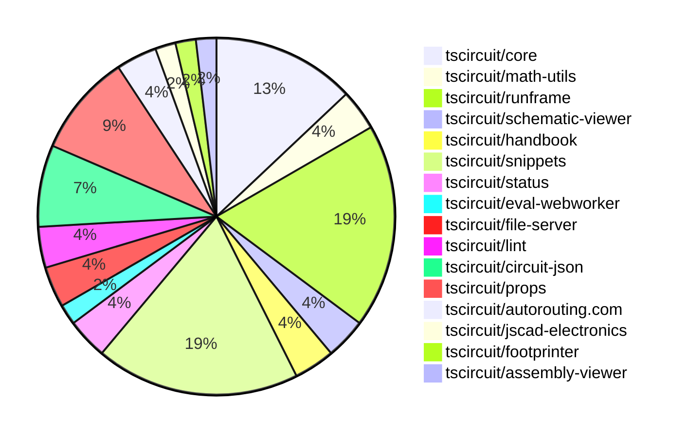

# Contribution Overview 2024-12-25

## PRs by Repository

## Contributor Overview

| Contributor | 🐳 Major | 🐙 Minor | 🐌 Tiny | ⭐ | Issues Created |
|-------------|---------|---------|---------|-----|----------------|
| [seveibar](#seveibar) | 4 | 20 | 1 | 👑👑 | 56 |
| [Anshgrover23](#Anshgrover23) | 2 | 9 | 0 | ⭐⭐ | 5 |
| [ShiboSoftwareDev](#ShiboSoftwareDev) | 1 | 1 | 0 | ⭐⭐ | 11 |
| [Abse2001](#Abse2001) | 1 | 3 | 0 | ⭐⭐ | 3 |
| [devin-ai-integration[bot]](#devin-ai-integration[bot]) | 1 | 3 | 0 | ⭐ | 0 |
| [AnasSarkiz](#AnasSarkiz) | 1 | 2 | 0 | ⭐ | 3 |
| [techmannih](#techmannih) | 0 | 3 | 0 | ⭐ | 2 |
| [karthik-nair-20](#karthik-nair-20) | 0 | 1 | 0 |  | 0 |
| [imrishabh18](#imrishabh18) | 0 | 1 | 0 |  | 2 |

## Review Table

[reviews-received-hover]: ## "Number of reviews received for PRs for this contributor"
[approvals-received-hover]: ## "Number of approvals received for PRs this contributor authored"
[rejections-received-hover]: ## "Number of rejections received for PRs this contributor authored"
[prs-opened-hover]: ## "Number of PRs opened by this contributor"
[issues-created-hover]: ## "Number of issues created by this contributor"
[bountied-issues-hover]: ## "Number of issues this contributor created with a bounty"
[bountied-issue-$-hover]: ## "Total bounty amount placed on issues authored by this contributor"

| Contributor | Reviews Received | Approvals Received | Rejections Received | PRs Opened | PRs Merged | Issues Created | Bountied Issues | Bountied Issue $ |
|---|---|---|---|---|---|---|---|---|
| [seveibar](#seveibar) | 0 | 0 | 0 | 26 | 25 | 56 | 23 | 532 |
| [Abse2001](#Abse2001) | 4 | 4 | 0 | 4 | 4 | 3 | 3 | 32 |
| [Anshgrover23](#Anshgrover23) | 61 | 13 | 15 | 16 | 11 | 5 | 0 | 0 |
| [devin-ai-integration[bot]](#devin-ai-integration[bot]) | 6 | 3 | 0 | 11 | 4 | 0 | 0 | 0 |
| [techmannih](#techmannih) | 16 | 4 | 7 | 9 | 3 | 2 | 0 | 0 |
| [ShiboSoftwareDev](#ShiboSoftwareDev) | 8 | 3 | 0 | 3 | 2 | 11 | 5 | 97 |
| [AnasSarkiz](#AnasSarkiz) | 4 | 4 | 0 | 3 | 3 | 3 | 1 | 10 |
| [vishwamartur](#vishwamartur) | 0 | 0 | 0 | 1 | 0 | 0 | 0 | 0 |
| [karthik-nair-20](#karthik-nair-20) | 1 | 1 | 0 | 2 | 1 | 0 | 0 | 0 |
| [imrishabh18](#imrishabh18) | 2 | 1 | 0 | 2 | 1 | 2 | 1 | 5 |

## Changes by Repository

### [tscircuit/core](https://github.com/tscircuit/core)

| PR # | Impact | Contributor | Description |
|------|--------|-------------|-------------|
| [#455](https://github.com/tscircuit/core/pull/455) | 🐳 Major | seveibar | Add support for schematic manual placements |
| [#442](https://github.com/tscircuit/core/pull/442) | 🐳 Major | Anshgrover23 | Adds a new resonator component to the circuit |
| [#459](https://github.com/tscircuit/core/pull/459) | 🐳 Major | Anshgrover23 | Adds a new transistor component to the library |
| [#457](https://github.com/tscircuit/core/pull/457) | 🐙 Minor | seveibar | Add support for sending display name to the autorouting server and minor improvements to async expects. |
| [#456](https://github.com/tscircuit/core/pull/456) | 🐙 Minor | seveibar | Renames the `Circuit` class to `RootCircuit` across the codebase. |
| [#466](https://github.com/tscircuit/core/pull/466) | 🐙 Minor | Anshgrover23 | Add `source_component.display_value` for resistor and capacitor components |
| [#458](https://github.com/tscircuit/core/pull/458) | 🐌 Tiny | seveibar | Add a new `Circuit` export for backwards compatibility |

### [tscircuit/math-utils](https://github.com/tscircuit/math-utils)

| PR # | Impact | Contributor | Description |
|------|--------|-------------|-------------|
| [#3](https://github.com/tscircuit/math-utils/pull/3) | 🐳 Major | seveibar | Adds new features to the grid module, including the ability to center the grid and adjust the Y-axis direction. |
| [#2](https://github.com/tscircuit/math-utils/pull/2) | 🐙 Minor | seveibar | Add support for a grid function. |

### [tscircuit/runframe](https://github.com/tscircuit/runframe)

| PR # | Impact | Contributor | Description |
|------|--------|-------------|-------------|
| [#79](https://github.com/tscircuit/runframe/pull/79) | 🐳 Major | seveibar | Fixes a bug where the entrypoint change did not trigger a re-render, and also fixes the order of execution between the evaluation and rendering promises. |
| [#52](https://github.com/tscircuit/runframe/pull/52) | 🐳 Major | seveibar | Adds schematic drag'n'drop support with filesystem syncing via @tscircuit/file-server. |
| [#78](https://github.com/tscircuit/runframe/pull/78) | 🐙 Minor | seveibar | Fix an issue where the entry point change doesn't trigger a re-render in the `RunFrame` component. |
| [#77](https://github.com/tscircuit/runframe/pull/77) | 🐙 Minor | seveibar | Introduces logging for the selected entrypoint and loads initial files via a list. |
| [#76](https://github.com/tscircuit/runframe/pull/76) | 🐙 Minor | seveibar | Adds the ability to list files prior to starting the run frame, making it easier to manage the initial files. |
| [#75](https://github.com/tscircuit/runframe/pull/75) | 🐙 Minor | seveibar | Change the default static build target for the CLI from `RunFrameWithApi` to `RunFrameForCli`. |
| [#73](https://github.com/tscircuit/runframe/pull/73) | 🐙 Minor | seveibar | Add a save snippet button, formalize events for syncing |
| [#60](https://github.com/tscircuit/runframe/pull/60) | 🐙 Minor | seveibar | Fix for `fsMap` handling in `RunFrame` component |
| [#48](https://github.com/tscircuit/runframe/pull/48) | 🐙 Minor | seveibar | Adds a new prop, `leftHeaderContent`, to the `CircuitJsonPreview` and `RunFrame` components, allowing for custom content to be displayed on the left side of the header. |
| [#65](https://github.com/tscircuit/runframe/pull/65) | 🐙 Minor | techmannih | Adds an assembly view to the circuit visualization tool. |

### [tscircuit/schematic-viewer](https://github.com/tscircuit/schematic-viewer)

| PR # | Impact | Contributor | Description |
|------|--------|-------------|-------------|
| [#76](https://github.com/tscircuit/schematic-viewer/pull/76) | 🐙 Minor | seveibar | Adds debug statements and ensures that the circuit JSON is up to date when computing the original center for the edit event. |
| [#75](https://github.com/tscircuit/schematic-viewer/pull/75) | 🐙 Minor | seveibar | Change tscircuit dependencies to peer deps to avoid dupes |

### [tscircuit/handbook](https://github.com/tscircuit/handbook)

| PR # | Impact | Contributor | Description |
|------|--------|-------------|-------------|
| [#6](https://github.com/tscircuit/handbook/pull/6) | 🐙 Minor | seveibar | Create a new guide on learning Git, including instructions for resolving `bun.lockb` conflicts. |
| [#4](https://github.com/tscircuit/handbook/pull/4) | 🐙 Minor | Abse2001 | Added a tutorial for using yalc, a tool for local package development. |

### [tscircuit/snippets](https://github.com/tscircuit/snippets)

| PR # | Impact | Contributor | Description |
|------|--------|-------------|-------------|
| [#423](https://github.com/tscircuit/snippets/pull/423) | 🐳 Major | ShiboSoftwareDev | Import snippets from registry to development server |
| [#442](https://github.com/tscircuit/snippets/pull/442) | 🐙 Minor | seveibar | Improve the search engine optimization (SEO) of the website by adding more relevant keywords and metadata. |
| [#438](https://github.com/tscircuit/snippets/pull/438) | 🐙 Minor | seveibar | Adds a new download option for a readable netlist in the application. |
| [#430](https://github.com/tscircuit/snippets/pull/430) | 🐙 Minor | seveibar | Add circuit name for better logs on autorouting server |
| [#434](https://github.com/tscircuit/snippets/pull/434) | 🐙 Minor | Anshgrover23 | Changes the save button to a fork button if the current user is not the owner of the snippet. |
| [#431](https://github.com/tscircuit/snippets/pull/431) | 🐙 Minor | Anshgrover23 | Fix for playwright-tests failing |
| [#422](https://github.com/tscircuit/snippets/pull/422) | 🐙 Minor | Anshgrover23 | Add `waitForLoadState` to the `view-snippet.spec.ts` test to ensure the page and UI elements are fully loaded before interacting with them. |
| [#439](https://github.com/tscircuit/snippets/pull/439) | 🐙 Minor | devin-ai-integration[bot] | Switch the chat icon in the header to a Discord icon. |
| [#425](https://github.com/tscircuit/snippets/pull/425) | 🐙 Minor | karthik-nair-20 | Responsive alignment of the EditorNav component to the right side. |
| [#417](https://github.com/tscircuit/snippets/pull/417) | 🐙 Minor | imrishabh18 | Fixes an issue with importing an empty file for "manual-edits" in the `use-run-tsx` hook. |

### [tscircuit/status](https://github.com/tscircuit/status)

| PR # | Impact | Contributor | Description |
|------|--------|-------------|-------------|
| [#6](https://github.com/tscircuit/status/pull/6) | 🐙 Minor | seveibar | Filter out outages shorter than 15 minutes to prevent flaky health checks from listing. |
| [#8](https://github.com/tscircuit/status/pull/8) | 🐙 Minor | devin-ai-integration[bot] | Improve the display of outage durations by showing them in a more human-readable format. |

### [tscircuit/eval-webworker](https://github.com/tscircuit/eval-webworker)

| PR # | Impact | Contributor | Description |
|------|--------|-------------|-------------|
| [#54](https://github.com/tscircuit/eval-webworker/pull/54) | 🐙 Minor | seveibar | Exports additional types from the library, including `CircuitWebWorker` and `WebWorkerConfiguration`. |

### [tscircuit/file-server](https://github.com/tscircuit/file-server)

| PR # | Impact | Contributor | Description |
|------|--------|-------------|-------------|
| [#3](https://github.com/tscircuit/file-server/pull/3) | 🐙 Minor | seveibar | Adds an admin index page with links to file and event management pages. |
| [#2](https://github.com/tscircuit/file-server/pull/2) | 🐙 Minor | seveibar | Add a new /events/reset route to reset the event list. |

### [tscircuit/lint](https://github.com/tscircuit/lint)

| PR # | Impact | Contributor | Description |
|------|--------|-------------|-------------|
| [#7](https://github.com/tscircuit/lint/pull/7) | 🐳 Major | Abse2001 | Added two new ESLint rules: 'tscircuit-deps' to enforce TSCircuit dependency rules in package.json, and 'context-pattern' to enforce the context-passing pattern for functions with two parameters. |
| [#5](https://github.com/tscircuit/lint/pull/5) | 🐙 Minor | techmannih | Enables the `tscircuit-lint` command by adding a `bin` script to the `package.json` file and configuring the `tsup` bundler. |

### [tscircuit/circuit-json](https://github.com/tscircuit/circuit-json)

| PR # | Impact | Contributor | Description |
|------|--------|-------------|-------------|
| [#113](https://github.com/tscircuit/circuit-json/pull/113) | 🐙 Minor | Abse2001 | Added `trace_length` property to `pcb_trace` and `max_length` property to `source_trace`. |
| [#111](https://github.com/tscircuit/circuit-json/pull/111) | 🐙 Minor | Anshgrover23 | Add `display_resistance` and `display_capacitance` to the Zod schema for `source_simple_resistor` and `source_simple_capacitor`. |
| [#103](https://github.com/tscircuit/circuit-json/pull/103) | 🐙 Minor | Anshgrover23 | Add a new simple transistor component to the circuit element library. |
| [#105](https://github.com/tscircuit/circuit-json/pull/105) | 🐙 Minor | techmannih | Add support for a new type of PCB plated hole with a circular hole and rectangular pad. |

### [tscircuit/props](https://github.com/tscircuit/props)

| PR # | Impact | Contributor | Description |
|------|--------|-------------|-------------|
| [#133](https://github.com/tscircuit/props/pull/133) | 🐳 Major | devin-ai-integration[bot] | Adds a new MOSFET component with channel type (nmos/pmos) and a comprehensive test suite. |
| [#139](https://github.com/tscircuit/props/pull/139) | 🐙 Minor | Abse2001 | Added new props `maxDecouplingTraceLength` to the `CapacitorProps` interface and `maxLength` to the `TraceProps` interface. |
| [#125](https://github.com/tscircuit/props/pull/125) | 🐙 Minor | Anshgrover23 | Add transistorProps to the project |
| [#131](https://github.com/tscircuit/props/pull/131) | 🐙 Minor | Anshgrover23 | Fixes the `pinVariant` property of the `ResonatorProps` interface to allow more variants beyond just "3pin". |
| [#135](https://github.com/tscircuit/props/pull/135) | 🐙 Minor | devin-ai-integration[bot] | This pull request adds an automated script to generate documentation for manual edit events and files. |

### [tscircuit/autorouting.com](https://github.com/tscircuit/autorouting.com)

| PR # | Impact | Contributor | Description |
|------|--------|-------------|-------------|
| [#10](https://github.com/tscircuit/autorouting.com/pull/10) | 🐙 Minor | Anshgrover23 | Automatically retry sample uploads up to 3 times. |
| [#12](https://github.com/tscircuit/autorouting.com/pull/12) | 🐙 Minor | ShiboSoftwareDev | Removed the "force-dynamic" configuration from various pages, allowing them to be prerendered. |

### [tscircuit/jscad-electronics](https://github.com/tscircuit/jscad-electronics)

| PR # | Impact | Contributor | Description |
|------|--------|-------------|-------------|
| [#84](https://github.com/tscircuit/jscad-electronics/pull/84) | 🐳 Major | AnasSarkiz | Added 3D components for missing imperial passive footprints (A01005, A0201, A1206, A1210, A2010, A2512). |

### [tscircuit/footprinter](https://github.com/tscircuit/footprinter)

| PR # | Impact | Contributor | Description |
|------|--------|-------------|-------------|
| [#103](https://github.com/tscircuit/footprinter/pull/103) | 🐙 Minor | AnasSarkiz | Fixed the imperial footprints of passive components |

### [tscircuit/assembly-viewer](https://github.com/tscircuit/assembly-viewer)

| PR # | Impact | Contributor | Description |
|------|--------|-------------|-------------|
| [#4](https://github.com/tscircuit/assembly-viewer/pull/4) | 🐙 Minor | AnasSarkiz | Added `footprint` prop to capacitors |

## Changes by Contributor

### [seveibar](https://github.com/seveibar)

| PR # | Impact | Description |
|------|--------|-------------|
| [#455](https://github.com/tscircuit/core/pull/455) | 🐳 Major | Add support for schematic manual placements |
| [#3](https://github.com/tscircuit/math-utils/pull/3) | 🐳 Major | Adds new features to the grid module, including the ability to center the grid and adjust the Y-axis direction. |
| [#79](https://github.com/tscircuit/runframe/pull/79) | 🐳 Major | Fixes a bug where the entrypoint change did not trigger a re-render, and also fixes the order of execution between the evaluation and rendering promises. |
| [#52](https://github.com/tscircuit/runframe/pull/52) | 🐳 Major | Adds schematic drag'n'drop support with filesystem syncing via @tscircuit/file-server. |
| [#76](https://github.com/tscircuit/schematic-viewer/pull/76) | 🐙 Minor | Adds debug statements and ensures that the circuit JSON is up to date when computing the original center for the edit event. |
| [#75](https://github.com/tscircuit/schematic-viewer/pull/75) | 🐙 Minor | Change tscircuit dependencies to peer deps to avoid dupes |
| [#457](https://github.com/tscircuit/core/pull/457) | 🐙 Minor | Add support for sending display name to the autorouting server and minor improvements to async expects. |
| [#456](https://github.com/tscircuit/core/pull/456) | 🐙 Minor | Renames the `Circuit` class to `RootCircuit` across the codebase. |
| [#6](https://github.com/tscircuit/handbook/pull/6) | 🐙 Minor | Create a new guide on learning Git, including instructions for resolving `bun.lockb` conflicts. |
| [#2](https://github.com/tscircuit/math-utils/pull/2) | 🐙 Minor | Add support for a grid function. |
| [#442](https://github.com/tscircuit/snippets/pull/442) | 🐙 Minor | Improve the search engine optimization (SEO) of the website by adding more relevant keywords and metadata. |
| [#438](https://github.com/tscircuit/snippets/pull/438) | 🐙 Minor | Adds a new download option for a readable netlist in the application. |
| [#430](https://github.com/tscircuit/snippets/pull/430) | 🐙 Minor | Add circuit name for better logs on autorouting server |
| [#6](https://github.com/tscircuit/status/pull/6) | 🐙 Minor | Filter out outages shorter than 15 minutes to prevent flaky health checks from listing. |
| [#54](https://github.com/tscircuit/eval-webworker/pull/54) | 🐙 Minor | Exports additional types from the library, including `CircuitWebWorker` and `WebWorkerConfiguration`. |
| [#78](https://github.com/tscircuit/runframe/pull/78) | 🐙 Minor | Fix an issue where the entry point change doesn't trigger a re-render in the `RunFrame` component. |
| [#77](https://github.com/tscircuit/runframe/pull/77) | 🐙 Minor | Introduces logging for the selected entrypoint and loads initial files via a list. |
| [#76](https://github.com/tscircuit/runframe/pull/76) | 🐙 Minor | Adds the ability to list files prior to starting the run frame, making it easier to manage the initial files. |
| [#75](https://github.com/tscircuit/runframe/pull/75) | 🐙 Minor | Change the default static build target for the CLI from `RunFrameWithApi` to `RunFrameForCli`. |
| [#73](https://github.com/tscircuit/runframe/pull/73) | 🐙 Minor | Add a save snippet button, formalize events for syncing |
| [#60](https://github.com/tscircuit/runframe/pull/60) | 🐙 Minor | Fix for `fsMap` handling in `RunFrame` component |
| [#48](https://github.com/tscircuit/runframe/pull/48) | 🐙 Minor | Adds a new prop, `leftHeaderContent`, to the `CircuitJsonPreview` and `RunFrame` components, allowing for custom content to be displayed on the left side of the header. |
| [#3](https://github.com/tscircuit/file-server/pull/3) | 🐙 Minor | Adds an admin index page with links to file and event management pages. |
| [#2](https://github.com/tscircuit/file-server/pull/2) | 🐙 Minor | Add a new /events/reset route to reset the event list. |
| [#458](https://github.com/tscircuit/core/pull/458) | 🐌 Tiny | Add a new `Circuit` export for backwards compatibility |

### [Abse2001](https://github.com/Abse2001)

| PR # | Impact | Description |
|------|--------|-------------|
| [#7](https://github.com/tscircuit/lint/pull/7) | 🐳 Major | Added two new ESLint rules: 'tscircuit-deps' to enforce TSCircuit dependency rules in package.json, and 'context-pattern' to enforce the context-passing pattern for functions with two parameters. |
| [#113](https://github.com/tscircuit/circuit-json/pull/113) | 🐙 Minor | Added `trace_length` property to `pcb_trace` and `max_length` property to `source_trace`. |
| [#139](https://github.com/tscircuit/props/pull/139) | 🐙 Minor | Added new props `maxDecouplingTraceLength` to the `CapacitorProps` interface and `maxLength` to the `TraceProps` interface. |
| [#4](https://github.com/tscircuit/handbook/pull/4) | 🐙 Minor | Added a tutorial for using yalc, a tool for local package development. |

### [Anshgrover23](https://github.com/Anshgrover23)

| PR # | Impact | Description |
|------|--------|-------------|
| [#442](https://github.com/tscircuit/core/pull/442) | 🐳 Major | Adds a new resonator component to the circuit |
| [#459](https://github.com/tscircuit/core/pull/459) | 🐳 Major | Adds a new transistor component to the library |
| [#111](https://github.com/tscircuit/circuit-json/pull/111) | 🐙 Minor | Add `display_resistance` and `display_capacitance` to the Zod schema for `source_simple_resistor` and `source_simple_capacitor`. |
| [#103](https://github.com/tscircuit/circuit-json/pull/103) | 🐙 Minor | Add a new simple transistor component to the circuit element library. |
| [#125](https://github.com/tscircuit/props/pull/125) | 🐙 Minor | Add transistorProps to the project |
| [#131](https://github.com/tscircuit/props/pull/131) | 🐙 Minor | Fixes the `pinVariant` property of the `ResonatorProps` interface to allow more variants beyond just "3pin". |
| [#466](https://github.com/tscircuit/core/pull/466) | 🐙 Minor | Add `source_component.display_value` for resistor and capacitor components |
| [#10](https://github.com/tscircuit/autorouting.com/pull/10) | 🐙 Minor | Automatically retry sample uploads up to 3 times. |
| [#434](https://github.com/tscircuit/snippets/pull/434) | 🐙 Minor | Changes the save button to a fork button if the current user is not the owner of the snippet. |
| [#431](https://github.com/tscircuit/snippets/pull/431) | 🐙 Minor | Fix for playwright-tests failing |
| [#422](https://github.com/tscircuit/snippets/pull/422) | 🐙 Minor | Add `waitForLoadState` to the `view-snippet.spec.ts` test to ensure the page and UI elements are fully loaded before interacting with them. |

### [techmannih](https://github.com/techmannih)

| PR # | Impact | Description |
|------|--------|-------------|
| [#105](https://github.com/tscircuit/circuit-json/pull/105) | 🐙 Minor | Add support for a new type of PCB plated hole with a circular hole and rectangular pad. |
| [#65](https://github.com/tscircuit/runframe/pull/65) | 🐙 Minor | Adds an assembly view to the circuit visualization tool. |
| [#5](https://github.com/tscircuit/lint/pull/5) | 🐙 Minor | Enables the `tscircuit-lint` command by adding a `bin` script to the `package.json` file and configuring the `tsup` bundler. |

### [devin-ai-integration[bot]](https://github.com/devin-ai-integration[bot])

| PR # | Impact | Description |
|------|--------|-------------|
| [#133](https://github.com/tscircuit/props/pull/133) | 🐳 Major | Adds a new MOSFET component with channel type (nmos/pmos) and a comprehensive test suite. |
| [#135](https://github.com/tscircuit/props/pull/135) | 🐙 Minor | This pull request adds an automated script to generate documentation for manual edit events and files. |
| [#439](https://github.com/tscircuit/snippets/pull/439) | 🐙 Minor | Switch the chat icon in the header to a Discord icon. |
| [#8](https://github.com/tscircuit/status/pull/8) | 🐙 Minor | Improve the display of outage durations by showing them in a more human-readable format. |

### [AnasSarkiz](https://github.com/AnasSarkiz)

| PR # | Impact | Description |
|------|--------|-------------|
| [#84](https://github.com/tscircuit/jscad-electronics/pull/84) | 🐳 Major | Added 3D components for missing imperial passive footprints (A01005, A0201, A1206, A1210, A2010, A2512). |
| [#103](https://github.com/tscircuit/footprinter/pull/103) | 🐙 Minor | Fixed the imperial footprints of passive components |
| [#4](https://github.com/tscircuit/assembly-viewer/pull/4) | 🐙 Minor | Added `footprint` prop to capacitors |

### [ShiboSoftwareDev](https://github.com/ShiboSoftwareDev)

| PR # | Impact | Description |
|------|--------|-------------|
| [#423](https://github.com/tscircuit/snippets/pull/423) | 🐳 Major | Import snippets from registry to development server |
| [#12](https://github.com/tscircuit/autorouting.com/pull/12) | 🐙 Minor | Removed the "force-dynamic" configuration from various pages, allowing them to be prerendered. |

### [karthik-nair-20](https://github.com/karthik-nair-20)

| PR # | Impact | Description |
|------|--------|-------------|
| [#425](https://github.com/tscircuit/snippets/pull/425) | 🐙 Minor | Responsive alignment of the EditorNav component to the right side. |

### [imrishabh18](https://github.com/imrishabh18)

| PR # | Impact | Description |
|------|--------|-------------|
| [#417](https://github.com/tscircuit/snippets/pull/417) | 🐙 Minor | Fixes an issue with importing an empty file for "manual-edits" in the `use-run-tsx` hook. |

