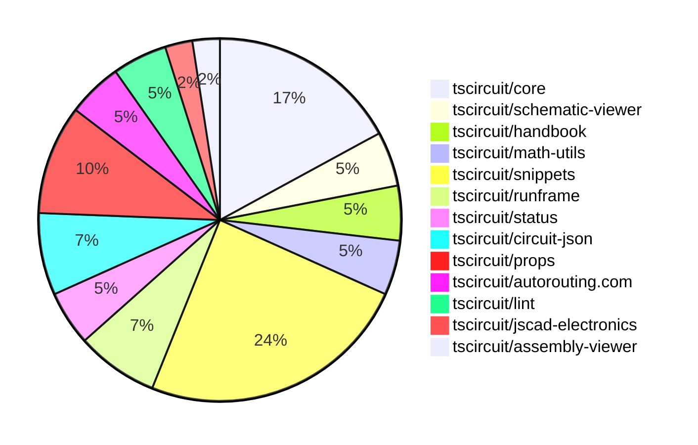

# Contribution Overview 2024-12-25

## PRs by Repository

## Contributor Overview

| Contributor | 🐳 Major | 🐙 Minor | 🐌 Tiny | ⭐ | Issues Created |
|-------------|---------|---------|---------|-----|----------------|
| [seveibar](#seveibar) | 2 | 13 | 0 | 👑 | 55 |
| [Anshgrover23](#Anshgrover23) | 2 | 9 | 0 | ⭐⭐ | 4 |
| [ShiboSoftwareDev](#ShiboSoftwareDev) | 1 | 1 | 0 | ⭐⭐ | 10 |
| [devin-ai-integration[bot]](#devin-ai-integration[bot]) | 0 | 4 | 0 | ⭐ | 0 |
| [AnasSarkiz](#AnasSarkiz) | 1 | 1 | 0 | ⭐ | 2 |
| [Abse2001](#Abse2001) | 0 | 2 | 0 | ⭐ | 1 |
| [techmannih](#techmannih) | 0 | 2 | 0 | ⭐ | 2 |
| [karthik-nair-20](#karthik-nair-20) | 0 | 1 | 0 |  | 0 |
| [imrishabh18](#imrishabh18) | 0 | 1 | 0 |  | 1 |

## Review Table

[reviews-received-hover]: ## "Number of reviews received for PRs for this contributor"
[approvals-received-hover]: ## "Number of approvals received for PRs this contributor authored"
[rejections-received-hover]: ## "Number of rejections received for PRs this contributor authored"
[prs-opened-hover]: ## "Number of PRs opened by this contributor"
[issues-created-hover]: ## "Number of issues created by this contributor"
[bountied-issues-hover]: ## "Number of issues this contributor created with a bounty"
[bountied-issue-$-hover]: ## "Total bounty amount placed on issues authored by this contributor"

| Contributor | Reviews Received | Approvals Received | Rejections Received | PRs Opened | PRs Merged | Issues Created | Bountied Issues | Bountied Issue $ |
|---|---|---|---|---|---|---|---|---|
| [seveibar](#seveibar) | 0 | 0 | 0 | 16 | 16 | 55 | 22 | 482 |
| [Anshgrover23](#Anshgrover23) | 58 | 13 | 13 | 16 | 11 | 4 | 0 | 0 |
| [devin-ai-integration[bot]](#devin-ai-integration[bot]) | 3 | 3 | 0 | 11 | 4 | 0 | 0 | 0 |
| [techmannih](#techmannih) | 13 | 2 | 6 | 8 | 2 | 2 | 0 | 0 |
| [ShiboSoftwareDev](#ShiboSoftwareDev) | 6 | 2 | 0 | 3 | 2 | 10 | 4 | 87 |
| [vishwamartur](#vishwamartur) | 0 | 0 | 0 | 1 | 0 | 0 | 0 | 0 |
| [AnasSarkiz](#AnasSarkiz) | 3 | 3 | 0 | 2 | 2 | 2 | 1 | 10 |
| [Abse2001](#Abse2001) | 2 | 2 | 0 | 2 | 2 | 1 | 1 | 10 |
| [karthik-nair-20](#karthik-nair-20) | 1 | 1 | 0 | 1 | 1 | 0 | 0 | 0 |
| [imrishabh18](#imrishabh18) | 2 | 1 | 0 | 1 | 1 | 1 | 1 | 5 |

## Changes by Repository

### [tscircuit/core](https://github.com/tscircuit/core)

| PR # | Impact | Contributor | Description |
|------|--------|-------------|-------------|
| [#455](https://github.com/tscircuit/core/pull/455) | 🐳 Major | seveibar | Adds support for schematic manual placements, allowing users to specify manual placement locations for components in the schematic view. |
| [#442](https://github.com/tscircuit/core/pull/442) | 🐳 Major | Anshgrover23 | Adds a new component called "resonator" to the circuit. |
| [#459](https://github.com/tscircuit/core/pull/459) | 🐳 Major | Anshgrover23 | Adds a new component called "Transistor" to the project. |
| [#458](https://github.com/tscircuit/core/pull/458) | 🐙 Minor | seveibar | Adds a new `Circuit` export for backwards compatibility with the `RootCircuit` type. |
| [#457](https://github.com/tscircuit/core/pull/457) | 🐙 Minor | seveibar | Adds support for sending the display name to the autorouting server and handles the case where the display name is required. |
| [#456](https://github.com/tscircuit/core/pull/456) | 🐙 Minor | seveibar | Renames the `Circuit` class to `RootCircuit` and updates the references throughout the codebase. |
| [#466](https://github.com/tscircuit/core/pull/466) | 🐙 Minor | Anshgrover23 | Add `source_component.display_value` for resistor and capacitor components |

### [tscircuit/schematic-viewer](https://github.com/tscircuit/schematic-viewer)

| PR # | Impact | Contributor | Description |
|------|--------|-------------|-------------|
| [#76](https://github.com/tscircuit/schematic-viewer/pull/76) | 🐙 Minor | seveibar | The pull request adds debug statements and ensures that the circuit JSON is up to date when computing the original center for the edit event. |
| [#75](https://github.com/tscircuit/schematic-viewer/pull/75) | 🐙 Minor | seveibar | Change tscircuit dependencies to peer deps to avoid dupes |

### [tscircuit/handbook](https://github.com/tscircuit/handbook)

| PR # | Impact | Contributor | Description |
|------|--------|-------------|-------------|
| [#6](https://github.com/tscircuit/handbook/pull/6) | 🐙 Minor | seveibar | Adds a new guide for learning Git, including instructions for resolving `bun.lockb` conflicts. |
| [#4](https://github.com/tscircuit/handbook/pull/4) | 🐙 Minor | Abse2001 | Added a tutorial on using the "yalc" tool for local development of the project. |

### [tscircuit/math-utils](https://github.com/tscircuit/math-utils)

| PR # | Impact | Contributor | Description |
|------|--------|-------------|-------------|
| [#3](https://github.com/tscircuit/math-utils/pull/3) | 🐙 Minor | seveibar | Adds new capabilities to the grid function, including centering the grid and support for up-is-negative coordinate system. |
| [#2](https://github.com/tscircuit/math-utils/pull/2) | 🐙 Minor | seveibar | Add support for grid function |

### [tscircuit/snippets](https://github.com/tscircuit/snippets)

| PR # | Impact | Contributor | Description |
|------|--------|-------------|-------------|
| [#423](https://github.com/tscircuit/snippets/pull/423) | 🐳 Major | ShiboSoftwareDev | Import snippets from registry to development server |
| [#442](https://github.com/tscircuit/snippets/pull/442) | 🐙 Minor | seveibar | Improve SEO by adding more meta tags and keywords to the index.html file. |
| [#438](https://github.com/tscircuit/snippets/pull/438) | 🐙 Minor | seveibar | Add a new download option for a readable netlist to the DownloadButtonAndMenu component. |
| [#430](https://github.com/tscircuit/snippets/pull/430) | 🟣 | seveibar | Add circuit name for better logs on autorouting server |
| [#434](https://github.com/tscircuit/snippets/pull/434) | 🐙 Minor | Anshgrover23 | Changes the save button to a fork button if the user does not own the snippet. |
| [#431](https://github.com/tscircuit/snippets/pull/431) | 🐙 Minor | Anshgrover23 | Fixes issues with the playwright tests, including waiting for network requests, handling manual edits, and disabling animations. |
| [#422](https://github.com/tscircuit/snippets/pull/422) | 🐙 Minor | Anshgrover23 | Add waitforLoadState to view-snippet.spec.ts test to ensure the page is fully loaded before taking screenshots. |
| [#439](https://github.com/tscircuit/snippets/pull/439) | 🐙 Minor | devin-ai-integration[bot] | Switch chat icon to Discord icon in the header |
| [#425](https://github.com/tscircuit/snippets/pull/425) | 🐙 Minor | karthik-nair-20 | Align the EditorNav component to the right side for responsive devices. |
| [#417](https://github.com/tscircuit/snippets/pull/417) | 🐙 Minor | imrishabh18 | Fixes the issue of throwing an error when importing an empty "manual-edits.json" file, as the project is moving towards "pure snippets". |

### [tscircuit/runframe](https://github.com/tscircuit/runframe)

| PR # | Impact | Contributor | Description |
|------|--------|-------------|-------------|
| [#52](https://github.com/tscircuit/runframe/pull/52) | 🐳 Major | seveibar | Incorporates edit events and moves explicit edit event handling to the API level. |
| [#60](https://github.com/tscircuit/runframe/pull/60) | 🐙 Minor | seveibar | Fix the `fsMap` handling in the `RunFrame` component |
| [#48](https://github.com/tscircuit/runframe/pull/48) | 🐙 Minor | seveibar | Adds a new prop `leftHeaderContent` to the `CircuitJsonPreview` and `RunFrame` components to allow customizing the left side header content. |

### [tscircuit/status](https://github.com/tscircuit/status)

| PR # | Impact | Contributor | Description |
|------|--------|-------------|-------------|
| [#6](https://github.com/tscircuit/status/pull/6) | 🐙 Minor | seveibar | Filter outages shorter than 15 minutes to prevent flaky health checks from being listed. |
| [#8](https://github.com/tscircuit/status/pull/8) | 🐙 Minor | devin-ai-integration[bot] | Improve the display of outage durations by showing them in a more human-readable format. |

### [tscircuit/circuit-json](https://github.com/tscircuit/circuit-json)

| PR # | Impact | Contributor | Description |
|------|--------|-------------|-------------|
| [#111](https://github.com/tscircuit/circuit-json/pull/111) | 🐙 Minor | Anshgrover23 | Add `display_resistance` and `display_capacitance` to the Zod schema for `SourceSimpleResistor` and `SourceSimpleCapacitor` components. |
| [#103](https://github.com/tscircuit/circuit-json/pull/103) | 🐙 Minor | Anshgrover23 | Adds a simple transistor circuit element to the any_circuit_element and any_source_component unions. |
| [#105](https://github.com/tscircuit/circuit-json/pull/105) | 🐙 Minor | techmannih | Add a new type of plated hole with circular hole and rectangular pad |

### [tscircuit/props](https://github.com/tscircuit/props)

| PR # | Impact | Contributor | Description |
|------|--------|-------------|-------------|
| [#125](https://github.com/tscircuit/props/pull/125) | 🐙 Minor | Anshgrover23 | Add `transistorProps` to the codebase, including a new `TransistorProps` type and associated validation. |
| [#131](https://github.com/tscircuit/props/pull/131) | 🐙 Minor | Anshgrover23 | Changes the `pinVariant` property of the `ResonatorProps` interface to accept a more specific set of variants instead of just "3pin". |
| [#135](https://github.com/tscircuit/props/pull/135) | 🐙 Minor | devin-ai-integration[bot] | This pull request adds an automated script to generate documentation for manual edit events and files. |
| [#133](https://github.com/tscircuit/props/pull/133) | 🐙 Minor | devin-ai-integration[bot] | Adds a new MOSFET component with channel type (nmos/pmos) and comprehensive test suite. |

### [tscircuit/autorouting.com](https://github.com/tscircuit/autorouting.com)

| PR # | Impact | Contributor | Description |
|------|--------|-------------|-------------|
| [#10](https://github.com/tscircuit/autorouting.com/pull/10) | 🐙 Minor | Anshgrover23 | Automatically retry sample uploads up to 3 times if there is an error. |
| [#12](https://github.com/tscircuit/autorouting.com/pull/12) | 🐙 Minor | ShiboSoftwareDev | Removes the `force-dynamic` flag from various pages, allowing them to be prerendered. |

### [tscircuit/lint](https://github.com/tscircuit/lint)

| PR # | Impact | Contributor | Description |
|------|--------|-------------|-------------|
| [#5](https://github.com/tscircuit/lint/pull/5) | 🐙 Minor | techmannih | Enables the use of the `tscircuit-lint` command by adding a new `bin` field in the `package.json` file and configuring the `tsup` build tool. |
| [#7](https://github.com/tscircuit/lint/pull/7) | 🐙 Minor | Abse2001 | Added tscircuit dependency rule and context pattern rule with tests |

### [tscircuit/jscad-electronics](https://github.com/tscircuit/jscad-electronics)

| PR # | Impact | Contributor | Description |
|------|--------|-------------|-------------|
| [#84](https://github.com/tscircuit/jscad-electronics/pull/84) | 🐳 Major | AnasSarkiz | Added 3D components for various imperial passive footprints (A01005, A0201, A1206, A1210, A2010, A2512, and cap1206). |

### [tscircuit/assembly-viewer](https://github.com/tscircuit/assembly-viewer)

| PR # | Impact | Contributor | Description |
|------|--------|-------------|-------------|
| [#4](https://github.com/tscircuit/assembly-viewer/pull/4) | 🐙 Minor | AnasSarkiz | Added a new `footprint` prop to `capacitor` components. |

## Changes by Contributor

### [seveibar](https://github.com/seveibar)

| PR # | Impact | Description |
|------|--------|-------------|
| [#455](https://github.com/tscircuit/core/pull/455) | 🐳 Major | Adds support for schematic manual placements, allowing users to specify manual placement locations for components in the schematic view. |
| [#76](https://github.com/tscircuit/schematic-viewer/pull/76) | 🐙 Minor | The pull request adds debug statements and ensures that the circuit JSON is up to date when computing the original center for the edit event. |
| [#75](https://github.com/tscircuit/schematic-viewer/pull/75) | 🐙 Minor | Change tscircuit dependencies to peer deps to avoid dupes |
| [#458](https://github.com/tscircuit/core/pull/458) | 🐙 Minor | Adds a new `Circuit` export for backwards compatibility with the `RootCircuit` type. |
| [#457](https://github.com/tscircuit/core/pull/457) | 🐙 Minor | Adds support for sending the display name to the autorouting server and handles the case where the display name is required. |
| [#456](https://github.com/tscircuit/core/pull/456) | 🐙 Minor | Renames the `Circuit` class to `RootCircuit` and updates the references throughout the codebase. |
| [#6](https://github.com/tscircuit/handbook/pull/6) | 🐙 Minor | Adds a new guide for learning Git, including instructions for resolving `bun.lockb` conflicts. |
| [#3](https://github.com/tscircuit/math-utils/pull/3) | 🐙 Minor | Adds new capabilities to the grid function, including centering the grid and support for up-is-negative coordinate system. |
| [#2](https://github.com/tscircuit/math-utils/pull/2) | 🐙 Minor | Add support for grid function |
| [#442](https://github.com/tscircuit/snippets/pull/442) | 🐙 Minor | Improve SEO by adding more meta tags and keywords to the index.html file. |
| [#438](https://github.com/tscircuit/snippets/pull/438) | 🐙 Minor | Add a new download option for a readable netlist to the DownloadButtonAndMenu component. |
| [#430](https://github.com/tscircuit/snippets/pull/430) | 🟣 | Add circuit name for better logs on autorouting server |
| [#52](https://github.com/tscircuit/runframe/pull/52) | 🐳 Major | Incorporates edit events and moves explicit edit event handling to the API level. |
| [#6](https://github.com/tscircuit/status/pull/6) | 🐙 Minor | Filter outages shorter than 15 minutes to prevent flaky health checks from being listed. |
| [#60](https://github.com/tscircuit/runframe/pull/60) | 🐙 Minor | Fix the `fsMap` handling in the `RunFrame` component |
| [#48](https://github.com/tscircuit/runframe/pull/48) | 🐙 Minor | Adds a new prop `leftHeaderContent` to the `CircuitJsonPreview` and `RunFrame` components to allow customizing the left side header content. |

### [Anshgrover23](https://github.com/Anshgrover23)

| PR # | Impact | Description |
|------|--------|-------------|
| [#442](https://github.com/tscircuit/core/pull/442) | 🐳 Major | Adds a new component called "resonator" to the circuit. |
| [#459](https://github.com/tscircuit/core/pull/459) | 🐳 Major | Adds a new component called "Transistor" to the project. |
| [#111](https://github.com/tscircuit/circuit-json/pull/111) | 🐙 Minor | Add `display_resistance` and `display_capacitance` to the Zod schema for `SourceSimpleResistor` and `SourceSimpleCapacitor` components. |
| [#103](https://github.com/tscircuit/circuit-json/pull/103) | 🐙 Minor | Adds a simple transistor circuit element to the any_circuit_element and any_source_component unions. |
| [#125](https://github.com/tscircuit/props/pull/125) | 🐙 Minor | Add `transistorProps` to the codebase, including a new `TransistorProps` type and associated validation. |
| [#131](https://github.com/tscircuit/props/pull/131) | 🐙 Minor | Changes the `pinVariant` property of the `ResonatorProps` interface to accept a more specific set of variants instead of just "3pin". |
| [#466](https://github.com/tscircuit/core/pull/466) | 🐙 Minor | Add `source_component.display_value` for resistor and capacitor components |
| [#10](https://github.com/tscircuit/autorouting.com/pull/10) | 🐙 Minor | Automatically retry sample uploads up to 3 times if there is an error. |
| [#434](https://github.com/tscircuit/snippets/pull/434) | 🐙 Minor | Changes the save button to a fork button if the user does not own the snippet. |
| [#431](https://github.com/tscircuit/snippets/pull/431) | 🐙 Minor | Fixes issues with the playwright tests, including waiting for network requests, handling manual edits, and disabling animations. |
| [#422](https://github.com/tscircuit/snippets/pull/422) | 🐙 Minor | Add waitforLoadState to view-snippet.spec.ts test to ensure the page is fully loaded before taking screenshots. |

### [techmannih](https://github.com/techmannih)

| PR # | Impact | Description |
|------|--------|-------------|
| [#105](https://github.com/tscircuit/circuit-json/pull/105) | 🐙 Minor | Add a new type of plated hole with circular hole and rectangular pad |
| [#5](https://github.com/tscircuit/lint/pull/5) | 🐙 Minor | Enables the use of the `tscircuit-lint` command by adding a new `bin` field in the `package.json` file and configuring the `tsup` build tool. |

### [devin-ai-integration[bot]](https://github.com/devin-ai-integration[bot])

| PR # | Impact | Description |
|------|--------|-------------|
| [#135](https://github.com/tscircuit/props/pull/135) | 🐙 Minor | This pull request adds an automated script to generate documentation for manual edit events and files. |
| [#133](https://github.com/tscircuit/props/pull/133) | 🐙 Minor | Adds a new MOSFET component with channel type (nmos/pmos) and comprehensive test suite. |
| [#439](https://github.com/tscircuit/snippets/pull/439) | 🐙 Minor | Switch chat icon to Discord icon in the header |
| [#8](https://github.com/tscircuit/status/pull/8) | 🐙 Minor | Improve the display of outage durations by showing them in a more human-readable format. |

### [AnasSarkiz](https://github.com/AnasSarkiz)

| PR # | Impact | Description |
|------|--------|-------------|
| [#84](https://github.com/tscircuit/jscad-electronics/pull/84) | 🐳 Major | Added 3D components for various imperial passive footprints (A01005, A0201, A1206, A1210, A2010, A2512, and cap1206). |
| [#4](https://github.com/tscircuit/assembly-viewer/pull/4) | 🐙 Minor | Added a new `footprint` prop to `capacitor` components. |

### [ShiboSoftwareDev](https://github.com/ShiboSoftwareDev)

| PR # | Impact | Description |
|------|--------|-------------|
| [#423](https://github.com/tscircuit/snippets/pull/423) | 🐳 Major | Import snippets from registry to development server |
| [#12](https://github.com/tscircuit/autorouting.com/pull/12) | 🐙 Minor | Removes the `force-dynamic` flag from various pages, allowing them to be prerendered. |

### [Abse2001](https://github.com/Abse2001)

| PR # | Impact | Description |
|------|--------|-------------|
| [#4](https://github.com/tscircuit/handbook/pull/4) | 🐙 Minor | Added a tutorial on using the "yalc" tool for local development of the project. |
| [#7](https://github.com/tscircuit/lint/pull/7) | 🐙 Minor | Added tscircuit dependency rule and context pattern rule with tests |

### [karthik-nair-20](https://github.com/karthik-nair-20)

| PR # | Impact | Description |
|------|--------|-------------|
| [#425](https://github.com/tscircuit/snippets/pull/425) | 🐙 Minor | Align the EditorNav component to the right side for responsive devices. |

### [imrishabh18](https://github.com/imrishabh18)

| PR # | Impact | Description |
|------|--------|-------------|
| [#417](https://github.com/tscircuit/snippets/pull/417) | 🐙 Minor | Fixes the issue of throwing an error when importing an empty "manual-edits.json" file, as the project is moving towards "pure snippets". |

