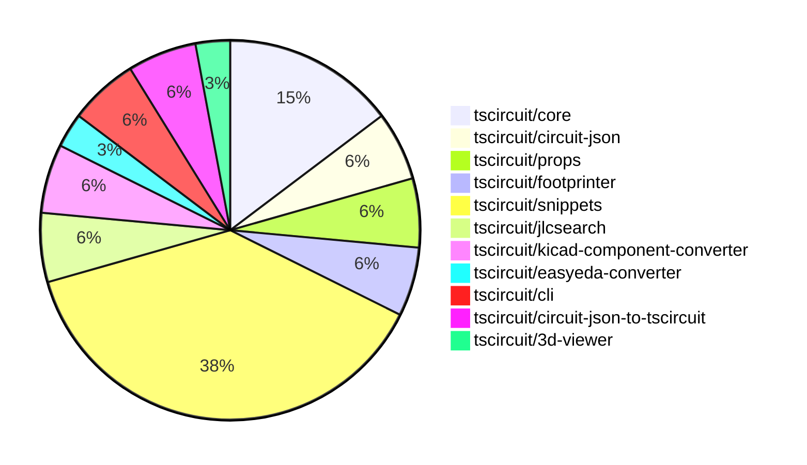

# Contribution Overview 2025-01-01

## PRs by Repository

## Contributor Overview

| Contributor | 🐳 Major | 🐙 Minor | 🐌 Tiny | ⭐ | Issues Created |
|-------------|---------|---------|---------|-----|----------------|
| [seveibar](#seveibar) | 4 | 9 | 1 | 👑 | 26 |
| [ShiboSoftwareDev](#ShiboSoftwareDev) | 1 | 4 | 0 | ⭐⭐ | 5 |
| [Anshgrover23](#Anshgrover23) | 1 | 6 | 0 | ⭐⭐ | 8 |
| [Abse2001](#Abse2001) | 1 | 2 | 0 | ⭐ | 0 |
| [DrSensor](#DrSensor) | 1 | 0 | 0 | ⭐ | 0 |
| [techmannih](#techmannih) | 0 | 2 | 0 | ⭐ | 1 |
| [krushnarout](#krushnarout) | 0 | 1 | 0 |  | 0 |

## Review Table

[reviews-received-hover]: ## "Number of reviews received for PRs for this contributor"
[approvals-received-hover]: ## "Number of approvals received for PRs this contributor authored"
[rejections-received-hover]: ## "Number of rejections received for PRs this contributor authored"
[prs-opened-hover]: ## "Number of PRs opened by this contributor"
[issues-created-hover]: ## "Number of issues created by this contributor"
[bountied-issues-hover]: ## "Number of issues this contributor created with a bounty"
[bountied-issue-$-hover]: ## "Total bounty amount placed on issues authored by this contributor"

| Contributor | Reviews Received | Approvals Received | Rejections Received | Approvals | Rejections | PRs Opened | PRs Merged | Issues Created | Bountied Issues | Bountied Issue $ |
|---|---|---|---|---|---|---|---|---|---|---|
| [Abse2001](#Abse2001) | 22 | 3 | 0 | 0 | 0 | 4 | 3 | 0 | 0 | 0 |
| [seveibar](#seveibar) | 1 | 0 | 0 | 20 | 6 | 17 | 15 | 26 | 17 | 278 |
| [DrSensor](#DrSensor) | 1 | 1 | 0 | 0 | 0 | 1 | 1 | 0 | 0 | 0 |
| [ShiboSoftwareDev](#ShiboSoftwareDev) | 7 | 6 | 0 | 0 | 0 | 6 | 5 | 5 | 3 | 45 |
| [Anshgrover23](#Anshgrover23) | 27 | 7 | 6 | 0 | 2 | 12 | 7 | 8 | 1 | 4 |
| [devin-ai-integration[bot]](#devin-ai-integration[bot]) | 2 | 0 | 2 | 0 | 0 | 2 | 0 | 0 | 0 | 0 |
| [techmannih](#techmannih) | 2 | 2 | 0 | 0 | 0 | 4 | 2 | 1 | 0 | 0 |
| [krushnarout](#krushnarout) | 1 | 1 | 0 | 0 | 0 | 2 | 1 | 0 | 0 | 0 |

## Changes by Repository

### [tscircuit/core](https://github.com/tscircuit/core)

| PR # | Impact | Contributor | Description |
|------|--------|-------------|-------------|
| [#481](https://github.com/tscircuit/core/pull/481) | 🐳 Major | ShiboSoftwareDev | Implement the MOSFET component |
| [#480](https://github.com/tscircuit/core/pull/480) | 🐳 Major | seveibar | Allows duplicate port hints for overlapping PCB primitive elements and fixes some KiCAD conversion issues. |
| [#479](https://github.com/tscircuit/core/pull/479) | 🐙 Minor | Abse2001 | Added a `display_name` property to the `source_trace` object and implemented a function to generate the display name based on the connected ports and nets. |
| [#478](https://github.com/tscircuit/core/pull/478) | 🐙 Minor | Anshgrover23 | Added a new `noSchematicRepresentation` option to the `Chip` component, which allows skipping the schematic rendering of the component. |
| [#475](https://github.com/tscircuit/core/pull/475) | 🐙 Minor | seveibar | Adds support for non-numeric pin labels in schPinStyle and adds a function to get the numeric schPinStyle. |

### [tscircuit/circuit-json](https://github.com/tscircuit/circuit-json)

| PR # | Impact | Contributor | Description |
|------|--------|-------------|-------------|
| [#116](https://github.com/tscircuit/circuit-json/pull/116) | 🐙 Minor | ShiboSoftwareDev | Added a new circuit element called "simple_mosfet" to the project. |
| [#115](https://github.com/tscircuit/circuit-json/pull/115) | 🐙 Minor | Abse2001 | Added a new optional field `display_name` to the `SourceTrace` type. |

### [tscircuit/props](https://github.com/tscircuit/props)

| PR # | Impact | Contributor | Description |
|------|--------|-------------|-------------|
| [#138](https://github.com/tscircuit/props/pull/138) | 🐙 Minor | ShiboSoftwareDev | Refines the `MosfetProps` interface by updating the `channelType` property to use more generic values ("n" and "p") and adding a new `mosfetMode` property to distinguish between enhancement and depletion mode. |
| [#141](https://github.com/tscircuit/props/pull/141) | 🐙 Minor | Anshgrover23 | Adds a new property `noSchematicRepresentation` to the `chipProps` type. |

### [tscircuit/footprinter](https://github.com/tscircuit/footprinter)

| PR # | Impact | Contributor | Description |
|------|--------|-------------|-------------|
| [#105](https://github.com/tscircuit/footprinter/pull/105) | 🐙 Minor | ShiboSoftwareDev | Changes the parameter types of `pushbutton` from `number` to `length` in the `pushbutton.ts` file. |
| [#104](https://github.com/tscircuit/footprinter/pull/104) | 🐙 Minor | ShiboSoftwareDev | Removed the `num_pins` literal type from the `axial` component and replaced it with a `number` type. |

### [tscircuit/snippets](https://github.com/tscircuit/snippets)

| PR # | Impact | Contributor | Description |
|------|--------|-------------|-------------|
| [#484](https://github.com/tscircuit/snippets/pull/484) | 🐳 Major | Abse2001 | Introduces a new feature that adds AI-driven auto-completion to the CodeEditor component using the Codeium library. |
| [#482](https://github.com/tscircuit/snippets/pull/482) | 🐙 Minor | Anshgrover23 | Adds a new option to download the KiCAD PCB files for the circuit. |
| [#460](https://github.com/tscircuit/snippets/pull/460) | 🐙 Minor | Anshgrover23 | Fix the search component to display search results with a maximum height and scrollable content. |
| [#472](https://github.com/tscircuit/snippets/pull/472) | 🐙 Minor | Anshgrover23 | Add Algora bounty badges to the README.md file. |
| [#458](https://github.com/tscircuit/snippets/pull/458) | 🐙 Minor | Anshgrover23 | Fixes issues with playwright tests, including wait time and locator improvements. |
| [#487](https://github.com/tscircuit/snippets/pull/487) | 🐙 Minor | seveibar | Reverts a previous fix for card misalignment. |
| [#488](https://github.com/tscircuit/snippets/pull/488) | 🐙 Minor | seveibar | Fixes the determination of the snippet type when the `templateFromUrl` is `null`. |
| [#468](https://github.com/tscircuit/snippets/pull/468) | 🐙 Minor | seveibar | Improves the layout of the bullet points on the mobile version of the landing page |
| [#463](https://github.com/tscircuit/snippets/pull/463) | 🐙 Minor | seveibar | Adds analytics tracking using Vercel Analytics and PostHog, and introduces a cookie consent banner. |
| [#478](https://github.com/tscircuit/snippets/pull/478) | 🐙 Minor | techmannih | Fixes a card misalignment issue by adding a hover effect and adjusting the height to be full. |
| [#475](https://github.com/tscircuit/snippets/pull/475) | 🐙 Minor | techmannih | Add a button to download the assembly SVG of the circuit |
| [#465](https://github.com/tscircuit/snippets/pull/465) | 🐙 Minor | krushnarout | Adds a new button on the landing page for logged-in users. |
| [#483](https://github.com/tscircuit/snippets/pull/483) | 🐌 Tiny | seveibar | Update the Discord link in the Header2 component. |

### [tscircuit/jlcsearch](https://github.com/tscircuit/jlcsearch)

| PR # | Impact | Contributor | Description |
|------|--------|-------------|-------------|
| [#14](https://github.com/tscircuit/jlcsearch/pull/14) | 🐳 Major | Anshgrover23 |  |
| [#16](https://github.com/tscircuit/jlcsearch/pull/16) | 🐙 Minor | seveibar | Adds the PostHog analytics script to the application. |

### [tscircuit/kicad-component-converter](https://github.com/tscircuit/kicad-component-converter)

| PR # | Impact | Contributor | Description |
|------|--------|-------------|-------------|
| [#110](https://github.com/tscircuit/kicad-component-converter/pull/110) | 🐳 Major | seveibar | Convert KiCad .kicad_mod files into Circuit JSON format on the website. |
| [#112](https://github.com/tscircuit/kicad-component-converter/pull/112) | 🐙 Minor | seveibar | Adds a button to open the generated TSCircuit code in an online code snippet tool. |

### [tscircuit/easyeda-converter](https://github.com/tscircuit/easyeda-converter)

| PR # | Impact | Contributor | Description |
|------|--------|-------------|-------------|
| [#141](https://github.com/tscircuit/easyeda-converter/pull/141) | 🐙 Minor | seveibar | Add instructions to the README for adding new part tests |

### [tscircuit/cli](https://github.com/tscircuit/cli)

| PR # | Impact | Contributor | Description |
|------|--------|-------------|-------------|
| [#11](https://github.com/tscircuit/cli/pull/11) | 🟣 | seveibar | Fix Module Import issue in cli build |
| [#10](https://github.com/tscircuit/cli/pull/10) | 🐳 Major | seveibar | Adds support for schematic drag and drop, dynamic loading of the runframe library, and an events watcher on the CLI. |

### [tscircuit/circuit-json-to-tscircuit](https://github.com/tscircuit/circuit-json-to-tscircuit)

| PR # | Impact | Contributor | Description |
|------|--------|-------------|-------------|
| [#2](https://github.com/tscircuit/circuit-json-to-tscircuit/pull/2) | 🐳 Major | seveibar | Add initial GitHub Actions workflows for format check, publishing to npm, testing, and type checking. |
| [#3](https://github.com/tscircuit/circuit-json-to-tscircuit/pull/3) | 🐙 Minor | seveibar | Adds more README information and removes empty lines from output |

### [tscircuit/3d-viewer](https://github.com/tscircuit/3d-viewer)

| PR # | Impact | Contributor | Description |
|------|--------|-------------|-------------|
| [#96](https://github.com/tscircuit/3d-viewer/pull/96) | 🐳 Major | DrSensor | Adds new hooks for exporting 3D models to GLTF format. |

## Changes by Contributor

### [ShiboSoftwareDev](https://github.com/ShiboSoftwareDev)

| PR # | Impact | Description |
|------|--------|-------------|
| [#481](https://github.com/tscircuit/core/pull/481) | 🐳 Major | Implement the MOSFET component |
| [#116](https://github.com/tscircuit/circuit-json/pull/116) | 🐙 Minor | Added a new circuit element called "simple_mosfet" to the project. |
| [#138](https://github.com/tscircuit/props/pull/138) | 🐙 Minor | Refines the `MosfetProps` interface by updating the `channelType` property to use more generic values ("n" and "p") and adding a new `mosfetMode` property to distinguish between enhancement and depletion mode. |
| [#105](https://github.com/tscircuit/footprinter/pull/105) | 🐙 Minor | Changes the parameter types of `pushbutton` from `number` to `length` in the `pushbutton.ts` file. |
| [#104](https://github.com/tscircuit/footprinter/pull/104) | 🐙 Minor | Removed the `num_pins` literal type from the `axial` component and replaced it with a `number` type. |

### [Abse2001](https://github.com/Abse2001)

| PR # | Impact | Description |
|------|--------|-------------|
| [#484](https://github.com/tscircuit/snippets/pull/484) | 🐳 Major | Introduces a new feature that adds AI-driven auto-completion to the CodeEditor component using the Codeium library. |
| [#115](https://github.com/tscircuit/circuit-json/pull/115) | 🐙 Minor | Added a new optional field `display_name` to the `SourceTrace` type. |
| [#479](https://github.com/tscircuit/core/pull/479) | 🐙 Minor | Added a `display_name` property to the `source_trace` object and implemented a function to generate the display name based on the connected ports and nets. |

### [Anshgrover23](https://github.com/Anshgrover23)

| PR # | Impact | Description |
|------|--------|-------------|
| [#14](https://github.com/tscircuit/jlcsearch/pull/14) | 🐳 Major |  |
| [#141](https://github.com/tscircuit/props/pull/141) | 🐙 Minor | Adds a new property `noSchematicRepresentation` to the `chipProps` type. |
| [#478](https://github.com/tscircuit/core/pull/478) | 🐙 Minor | Added a new `noSchematicRepresentation` option to the `Chip` component, which allows skipping the schematic rendering of the component. |
| [#482](https://github.com/tscircuit/snippets/pull/482) | 🐙 Minor | Adds a new option to download the KiCAD PCB files for the circuit. |
| [#460](https://github.com/tscircuit/snippets/pull/460) | 🐙 Minor | Fix the search component to display search results with a maximum height and scrollable content. |
| [#472](https://github.com/tscircuit/snippets/pull/472) | 🐙 Minor | Add Algora bounty badges to the README.md file. |
| [#458](https://github.com/tscircuit/snippets/pull/458) | 🐙 Minor | Fixes issues with playwright tests, including wait time and locator improvements. |

### [seveibar](https://github.com/seveibar)

| PR # | Impact | Description |
|------|--------|-------------|
| [#110](https://github.com/tscircuit/kicad-component-converter/pull/110) | 🐳 Major | Convert KiCad .kicad_mod files into Circuit JSON format on the website. |
| [#480](https://github.com/tscircuit/core/pull/480) | 🐳 Major | Allows duplicate port hints for overlapping PCB primitive elements and fixes some KiCAD conversion issues. |
| [#112](https://github.com/tscircuit/kicad-component-converter/pull/112) | 🐙 Minor | Adds a button to open the generated TSCircuit code in an online code snippet tool. |
| [#141](https://github.com/tscircuit/easyeda-converter/pull/141) | 🐙 Minor | Add instructions to the README for adding new part tests |
| [#475](https://github.com/tscircuit/core/pull/475) | 🐙 Minor | Adds support for non-numeric pin labels in schPinStyle and adds a function to get the numeric schPinStyle. |
| [#487](https://github.com/tscircuit/snippets/pull/487) | 🐙 Minor | Reverts a previous fix for card misalignment. |
| [#488](https://github.com/tscircuit/snippets/pull/488) | 🐙 Minor | Fixes the determination of the snippet type when the `templateFromUrl` is `null`. |
| [#468](https://github.com/tscircuit/snippets/pull/468) | 🐙 Minor | Improves the layout of the bullet points on the mobile version of the landing page |
| [#463](https://github.com/tscircuit/snippets/pull/463) | 🐙 Minor | Adds analytics tracking using Vercel Analytics and PostHog, and introduces a cookie consent banner. |
| [#16](https://github.com/tscircuit/jlcsearch/pull/16) | 🐙 Minor | Adds the PostHog analytics script to the application. |
| [#483](https://github.com/tscircuit/snippets/pull/483) | 🐌 Tiny | Update the Discord link in the Header2 component. |
| [#11](https://github.com/tscircuit/cli/pull/11) | 🟣 | Fix Module Import issue in cli build |
| [#10](https://github.com/tscircuit/cli/pull/10) | 🐳 Major | Adds support for schematic drag and drop, dynamic loading of the runframe library, and an events watcher on the CLI. |
| [#2](https://github.com/tscircuit/circuit-json-to-tscircuit/pull/2) | 🐳 Major | Add initial GitHub Actions workflows for format check, publishing to npm, testing, and type checking. |
| [#3](https://github.com/tscircuit/circuit-json-to-tscircuit/pull/3) | 🐙 Minor | Adds more README information and removes empty lines from output |

### [DrSensor](https://github.com/DrSensor)

| PR # | Impact | Description |
|------|--------|-------------|
| [#96](https://github.com/tscircuit/3d-viewer/pull/96) | 🐳 Major | Adds new hooks for exporting 3D models to GLTF format. |

### [techmannih](https://github.com/techmannih)

| PR # | Impact | Description |
|------|--------|-------------|
| [#478](https://github.com/tscircuit/snippets/pull/478) | 🐙 Minor | Fixes a card misalignment issue by adding a hover effect and adjusting the height to be full. |
| [#475](https://github.com/tscircuit/snippets/pull/475) | 🐙 Minor | Add a button to download the assembly SVG of the circuit |

### [krushnarout](https://github.com/krushnarout)

| PR # | Impact | Description |
|------|--------|-------------|
| [#465](https://github.com/tscircuit/snippets/pull/465) | 🐙 Minor | Adds a new button on the landing page for logged-in users. |

