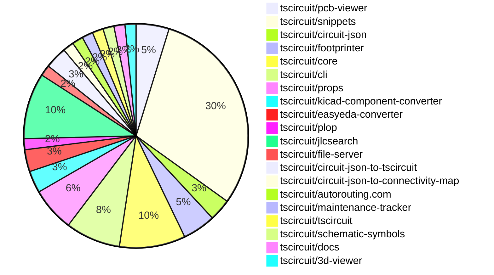

# Contribution Overview 2025-01-01

## PRs by Repository

## Contributor Overview

| Contributor | 🐳 Major | 🐙 Minor | 🐌 Tiny | ⭐ | Issues Created |
|-------------|---------|---------|---------|-----|----------------|
| [seveibar](#seveibar) | 6 | 17 | 2 | 👑👑 | 54 |
| [Anshgrover23](#Anshgrover23) | 5 | 9 | 2 | ⭐⭐⭐ | 9 |
| [ShiboSoftwareDev](#ShiboSoftwareDev) | 1 | 5 | 0 | ⭐⭐ | 8 |
| [Abse2001](#Abse2001) | 2 | 5 | 0 | ⭐⭐ | 2 |
| [techmannih](#techmannih) | 1 | 3 | 1 | ⭐⭐ | 2 |
| [devin-ai-integration[bot]](#devin-ai-integration[bot]) | 0 | 1 | 0 |  | 0 |
| [DrSensor](#DrSensor) | 0 | 1 | 0 |  | 0 |
| [krushnarout](#krushnarout) | 0 | 1 | 0 |  | 0 |
| [oldbear26](#oldbear26) | 0 | 0 | 1 |  | 0 |

## Review Table

[reviews-received-hover]: ## "Number of reviews received for PRs for this contributor"
[approvals-received-hover]: ## "Number of approvals received for PRs this contributor authored"
[rejections-received-hover]: ## "Number of rejections received for PRs this contributor authored"
[prs-opened-hover]: ## "Number of PRs opened by this contributor"
[issues-created-hover]: ## "Number of issues created by this contributor"
[bountied-issues-hover]: ## "Number of issues this contributor created with a bounty"
[bountied-issue-$-hover]: ## "Total bounty amount placed on issues authored by this contributor"

| Contributor | Reviews Received | Approvals Received | Rejections Received | Approvals | Rejections | PRs Opened | PRs Merged | Issues Created | Bountied Issues | Bountied Issue $ |
|---|---|---|---|---|---|---|---|---|---|---|
| [Abse2001](#Abse2001) | 34 | 7 | 0 | 1 | 2 | 9 | 7 | 2 | 0 | 0 |
| [seveibar](#seveibar) | 1 | 0 | 0 | 38 | 12 | 28 | 25 | 54 | 32 | 486 |
| [DrSensor](#DrSensor) | 1 | 1 | 0 | 0 | 0 | 1 | 1 | 0 | 0 | 0 |
| [Anshgrover23](#Anshgrover23) | 46 | 15 | 12 | 0 | 6 | 22 | 16 | 9 | 1 | 4 |
| [techmannih](#techmannih) | 14 | 6 | 5 | 0 | 0 | 9 | 5 | 2 | 0 | 0 |
| [ShiboSoftwareDev](#ShiboSoftwareDev) | 9 | 7 | 1 | 0 | 2 | 7 | 6 | 8 | 6 | 67 |
| [devin-ai-integration[bot]](#devin-ai-integration[bot]) | 3 | 1 | 2 | 0 | 0 | 3 | 1 | 0 | 0 | 0 |
| [oldbear26](#oldbear26) | 4 | 1 | 1 | 0 | 0 | 2 | 1 | 0 | 0 | 0 |
| [krushnarout](#krushnarout) | 2 | 1 | 1 | 0 | 0 | 2 | 1 | 0 | 0 | 0 |

## Changes by Repository

### [tscircuit/pcb-viewer](https://github.com/tscircuit/pcb-viewer)

| PR # | Impact | Contributor | Description |
|------|--------|-------------|-------------|
| [#101](https://github.com/tscircuit/pcb-viewer/pull/101) | 🐳 Major | Abse2001 | Added trace length tooltip and handled when length goes over Max length, and hover over multiple traces. |
| [#107](https://github.com/tscircuit/pcb-viewer/pull/107) | 🐳 Major | seveibar | Switch the project to use ESM (ECMAScript Modules) instead of CommonJS. |
| [#110](https://github.com/tscircuit/pcb-viewer/pull/110) | 🐙 Minor | Abse2001 | Adds a "View" dropdown to the toolbar overlay to control the display of multiple traces, and enhances the trace filtering algorithm to display only traces with the maximum length by default. |

### [tscircuit/snippets](https://github.com/tscircuit/snippets)

| PR # | Impact | Contributor | Description |
|------|--------|-------------|-------------|
| [#484](https://github.com/tscircuit/snippets/pull/484) | 🐳 Major | Abse2001 | Adds an AI-driven auto completion feature to the CodeEditor component. |
| [#498](https://github.com/tscircuit/snippets/pull/498) | 🐳 Major | ShiboSoftwareDev | Enhances the footprint dialog by improving the user experience, including not displaying passive components as options, adding mobile scrolling, handling readonly parameters, and improving handling for BGA footprints. |
| [#493](https://github.com/tscircuit/snippets/pull/493) | 🐙 Minor | seveibar | The pull request improves the search component by adding a new `LinkWithNewTabHandling` component, updating the search results display, and modifying the user profile page to sort the displayed snippets by updated date. |
| [#487](https://github.com/tscircuit/snippets/pull/487) | 🐙 Minor | seveibar | Revert the "fix card misalignment" change |
| [#488](https://github.com/tscircuit/snippets/pull/488) | 🐙 Minor | seveibar | Fix the snippet type to handle cases where the `templateFromUrl` is null or doesn't have a `type` property. |
| [#468](https://github.com/tscircuit/snippets/pull/468) | 🐙 Minor | seveibar | Improve the layout of the landing page bullet points on mobile devices by adding a grid layout and an extra bullet point for "Open Web Standards". |
| [#463](https://github.com/tscircuit/snippets/pull/463) | 🐙 Minor | seveibar | Adds analytics tracking using Vercel Analytics and Posthog, and a cookie consent banner. |
| [#492](https://github.com/tscircuit/snippets/pull/492) | 🐙 Minor | Anshgrover23 | Fixes the selector used to click the "Ellipsis Vertical" button in the "Update Description" test. |
| [#490](https://github.com/tscircuit/snippets/pull/490) | 🐙 Minor | Anshgrover23 | Fixes the tests and skips manual edits for now |
| [#482](https://github.com/tscircuit/snippets/pull/482) | 🐙 Minor | Anshgrover23 | Adds a new feature to download a KiCAD PCB file from the circuit design. |
| [#460](https://github.com/tscircuit/snippets/pull/460) | 🐙 Minor | Anshgrover23 | Fixes the UI of the search component by adding `max-h-screen` and `overflow-y-auto` to the search results container. |
| [#458](https://github.com/tscircuit/snippets/pull/458) | 🐙 Minor | Anshgrover23 | Fixes issues with playwright tests, including improved wait for page loading and some minor UI-related fixes. |
| [#489](https://github.com/tscircuit/snippets/pull/489) | 🐙 Minor | techmannih | Fix landing page card alignment |
| [#478](https://github.com/tscircuit/snippets/pull/478) | 🐙 Minor | techmannih | Fixes card misalignment by adding a hover effect and height property to the card component. |
| [#475](https://github.com/tscircuit/snippets/pull/475) | 🐙 Minor | techmannih | Adds a new button to download the assembly SVG of the circuit |
| [#465](https://github.com/tscircuit/snippets/pull/465) | 🐙 Minor | krushnarout | Adds a new "HeaderDropdown" component to the Header2 component when the user is logged in. |
| [#483](https://github.com/tscircuit/snippets/pull/483) | 🐌 Tiny | seveibar | Fix the Discord link in the header component. |
| [#472](https://github.com/tscircuit/snippets/pull/472) | 🐌 Tiny | Anshgrover23 | Adds Algora bounty badges to the README |
| [#500](https://github.com/tscircuit/snippets/pull/500) | 🐌 Tiny | oldbear26 | Add type declaration for manual-edits.json in ATA |

### [tscircuit/circuit-json](https://github.com/tscircuit/circuit-json)

| PR # | Impact | Contributor | Description |
|------|--------|-------------|-------------|
| [#115](https://github.com/tscircuit/circuit-json/pull/115) | 🐙 Minor | Abse2001 | Added `display_name` property to `source_trace` type definition. |
| [#116](https://github.com/tscircuit/circuit-json/pull/116) | 🐙 Minor | ShiboSoftwareDev | Added a new `source_simple_mosfet` component to the circuit element library. |

### [tscircuit/footprinter](https://github.com/tscircuit/footprinter)

| PR # | Impact | Contributor | Description |
|------|--------|-------------|-------------|
| [#108](https://github.com/tscircuit/footprinter/pull/108) | 🐙 Minor | Abse2001 | Set the default value of `legsoutside` parameter to `false` in the `quad` function |
| [#105](https://github.com/tscircuit/footprinter/pull/105) | 🐙 Minor | ShiboSoftwareDev | Change the parameter types for `pushbutton` from `number` to `length`. |
| [#104](https://github.com/tscircuit/footprinter/pull/104) | 🐙 Minor | ShiboSoftwareDev | Removed the literal types from the component definitions and replaced them with more flexible number and boolean types. |

### [tscircuit/core](https://github.com/tscircuit/core)

| PR # | Impact | Contributor | Description |
|------|--------|-------------|-------------|
| [#480](https://github.com/tscircuit/core/pull/480) | 🐳 Major | seveibar | Allows duplicate port hints for overlapping PCB primitive elements, which fixes some KiCAD conversion issues. |
| [#475](https://github.com/tscircuit/core/pull/475) | 🐳 Major | seveibar | Adds support for non-numeric pin labels in schPinStyle and introduces the getNumericSchPinStyle function to handle the conversion. |
| [#487](https://github.com/tscircuit/core/pull/487) | 🐙 Minor | Abse2001 | Implemented `<board />` outlineOffsetX and outlineOffsetY |
| [#479](https://github.com/tscircuit/core/pull/479) | 🐙 Minor | Abse2001 | Added a new function `getTraceDisplayName` to generate a display name for a trace based on the connected ports and nets. |
| [#478](https://github.com/tscircuit/core/pull/478) | 🐙 Minor | Anshgrover23 | The pull request adds a new function `doInitialSchematicComponentRender()` that checks if `noSchematicRepresentation` is true and early returns if so, otherwise it calls the parent's `doInitialSchematicComponentRender()` function. |
| [#481](https://github.com/tscircuit/core/pull/481) | 🐙 Minor | ShiboSoftwareDev | Add a new MOSFET component to the library |

### [tscircuit/cli](https://github.com/tscircuit/cli)

| PR # | Impact | Contributor | Description |
|------|--------|-------------|-------------|
| [#15](https://github.com/tscircuit/cli/pull/15) | 🐳 Major | seveibar | Refactor for DevServer class state management, add basic test for DevServer initialization, and define File Server API Types. |
| [#12](https://github.com/tscircuit/cli/pull/12) | 🐳 Major | seveibar | Establish CLI patterns, implement authentication to prepare for snippets sync |
| [#10](https://github.com/tscircuit/cli/pull/10) | 🐳 Major | seveibar | Introduces schematic drag and drop support, dynamic loading of runframe, and file update event handling. |
| [#13](https://github.com/tscircuit/cli/pull/13) | 🐙 Minor | seveibar | Add a new command to clone a snippet from the registry. |
| [#11](https://github.com/tscircuit/cli/pull/11) | 🐙 Minor | seveibar | Fix module import issue in cli build |

### [tscircuit/props](https://github.com/tscircuit/props)

| PR # | Impact | Contributor | Description |
|------|--------|-------------|-------------|
| [#144](https://github.com/tscircuit/props/pull/144) | 🐙 Minor | seveibar | Rename `pcbOffsetX` and `pcbOffsetY` to `outlineOffsetX` and `outlineOffsetY` respectively. |
| [#141](https://github.com/tscircuit/props/pull/141) | 🐙 Minor | Anshgrover23 | Adds a new `noSchematicRepresentation` prop to the `chip` component. |
| [#138](https://github.com/tscircuit/props/pull/138) | 🐙 Minor | ShiboSoftwareDev | Modifies the `MosfetProps` interface to use more concise channel type and mode names, and adds a `mosfetPins` array. |
| [#143](https://github.com/tscircuit/props/pull/143) | 🐙 Minor | devin-ai-integration[bot] | Adds two new optional properties, `pcbOffsetX` and `pcbOffsetY`, to the `board` component to allow offsetting the board's PCB position. |

### [tscircuit/kicad-component-converter](https://github.com/tscircuit/kicad-component-converter)

| PR # | Impact | Contributor | Description |
|------|--------|-------------|-------------|
| [#112](https://github.com/tscircuit/kicad-component-converter/pull/112) | 🐙 Minor | seveibar | Adds a button to open the generated TSCircuit code in a snippet viewer. |
| [#110](https://github.com/tscircuit/kicad-component-converter/pull/110) | 🐙 Minor | seveibar | Convert Kicad Mod into Circuit JSON on website |

### [tscircuit/easyeda-converter](https://github.com/tscircuit/easyeda-converter)

| PR # | Impact | Contributor | Description |
|------|--------|-------------|-------------|
| [#146](https://github.com/tscircuit/easyeda-converter/pull/146) | 🐙 Minor | seveibar | Add support for parsing silkscreen text in the EasyEDA to TSCircuit Soup JSON conversion process. |
| [#141](https://github.com/tscircuit/easyeda-converter/pull/141) | 🐙 Minor | seveibar | Adds instructions to the readme for adding new part tests. |

### [tscircuit/plop](https://github.com/tscircuit/plop)

| PR # | Impact | Contributor | Description |
|------|--------|-------------|-------------|
| [#7](https://github.com/tscircuit/plop/pull/7) | 🐙 Minor | seveibar | Allow bot token for bypassing branch protection on version commit |

### [tscircuit/jlcsearch](https://github.com/tscircuit/jlcsearch)

| PR # | Impact | Contributor | Description |
|------|--------|-------------|-------------|
| [#25](https://github.com/tscircuit/jlcsearch/pull/25) | 🐳 Major | Anshgrover23 | Adds a new derived table called "lcd_display" to store and display LCD display modules, including features like display size, resolution, and type. |
| [#23](https://github.com/tscircuit/jlcsearch/pull/23) | 🐳 Major | Anshgrover23 | Adds a new table for LED Dot Matrix Display Modules and a corresponding route to list them. |
| [#22](https://github.com/tscircuit/jlcsearch/pull/22) | 🐳 Major | Anshgrover23 | Adds new OLED Display modules feature, including a new derived table, API endpoint, and user interface. |
| [#24](https://github.com/tscircuit/jlcsearch/pull/24) | 🐳 Major | Anshgrover23 | Adds a new derived table for LED Segment Display modules, including columns for package, positions, type, size, and color. |
| [#14](https://github.com/tscircuit/jlcsearch/pull/14) | 🐳 Major | Anshgrover23 |  |
| [#16](https://github.com/tscircuit/jlcsearch/pull/16) | 🐙 Minor | seveibar | Adds the Posthog analytics script to the application. |

### [tscircuit/file-server](https://github.com/tscircuit/file-server)

| PR # | Impact | Contributor | Description |
|------|--------|-------------|-------------|
| [#4](https://github.com/tscircuit/file-server/pull/4) | 🐙 Minor | seveibar | Refactored the "Event" type to "FileServerEvent" and added support for an "initiator" field in the upsert file operation. |

### [tscircuit/circuit-json-to-tscircuit](https://github.com/tscircuit/circuit-json-to-tscircuit)

| PR # | Impact | Contributor | Description |
|------|--------|-------------|-------------|
| [#3](https://github.com/tscircuit/circuit-json-to-tscircuit/pull/3) | 🐙 Minor | seveibar | Update the README with more information and remove empty lines from the output. |
| [#2](https://github.com/tscircuit/circuit-json-to-tscircuit/pull/2) | 🐙 Minor | seveibar | Adds initial GitHub Actions workflows for format checking, publishing to npm, testing, and type checking. |

### [tscircuit/circuit-json-to-connectivity-map](https://github.com/tscircuit/circuit-json-to-connectivity-map)

| PR # | Impact | Contributor | Description |
|------|--------|-------------|-------------|
| [#7](https://github.com/tscircuit/circuit-json-to-connectivity-map/pull/7) | 🐌 Tiny | seveibar | Update the version of the `@tscircuit/math-utils` dependency from `0.0.4` to `0.0.9`. |

### [tscircuit/autorouting.com](https://github.com/tscircuit/autorouting.com)

| PR # | Impact | Contributor | Description |
|------|--------|-------------|-------------|
| [#13](https://github.com/tscircuit/autorouting.com/pull/13) | 🐙 Minor | Anshgrover23 | Add a main logo animation to the webpage. |

### [tscircuit/maintenance-tracker](https://github.com/tscircuit/maintenance-tracker)

| PR # | Impact | Contributor | Description |
|------|--------|-------------|-------------|
| [#4](https://github.com/tscircuit/maintenance-tracker/pull/4) | 🐙 Minor | Anshgrover23 | Treat skipped checks as successful checks. |

### [tscircuit/tscircuit](https://github.com/tscircuit/tscircuit)

| PR # | Impact | Contributor | Description |
|------|--------|-------------|-------------|
| [#493](https://github.com/tscircuit/tscircuit/pull/493) | 🐌 Tiny | Anshgrover23 | Added Algora badges to the README.md file. |

### [tscircuit/schematic-symbols](https://github.com/tscircuit/schematic-symbols)

| PR # | Impact | Contributor | Description |
|------|--------|-------------|-------------|
| [#231](https://github.com/tscircuit/schematic-symbols/pull/231) | 🐳 Major | techmannih | Adds an op-amp symbol with and without power connections. |

### [tscircuit/docs](https://github.com/tscircuit/docs)

| PR # | Impact | Contributor | Description |
|------|--------|-------------|-------------|
| [#46](https://github.com/tscircuit/docs/pull/46) | 🐌 Tiny | techmannih | Fixes a typo and clarifies the terminology in the trace description. |

### [tscircuit/3d-viewer](https://github.com/tscircuit/3d-viewer)

| PR # | Impact | Contributor | Description |
|------|--------|-------------|-------------|
| [#96](https://github.com/tscircuit/3d-viewer/pull/96) | 🐙 Minor | DrSensor | Add hooks for exporting to gltf |

## Changes by Contributor

### [Abse2001](https://github.com/Abse2001)

| PR # | Impact | Description |
|------|--------|-------------|
| [#101](https://github.com/tscircuit/pcb-viewer/pull/101) | 🐳 Major | Added trace length tooltip and handled when length goes over Max length, and hover over multiple traces. |
| [#484](https://github.com/tscircuit/snippets/pull/484) | 🐳 Major | Adds an AI-driven auto completion feature to the CodeEditor component. |
| [#110](https://github.com/tscircuit/pcb-viewer/pull/110) | 🐙 Minor | Adds a "View" dropdown to the toolbar overlay to control the display of multiple traces, and enhances the trace filtering algorithm to display only traces with the maximum length by default. |
| [#115](https://github.com/tscircuit/circuit-json/pull/115) | 🐙 Minor | Added `display_name` property to `source_trace` type definition. |
| [#108](https://github.com/tscircuit/footprinter/pull/108) | 🐙 Minor | Set the default value of `legsoutside` parameter to `false` in the `quad` function |
| [#487](https://github.com/tscircuit/core/pull/487) | 🐙 Minor | Implemented `<board />` outlineOffsetX and outlineOffsetY |
| [#479](https://github.com/tscircuit/core/pull/479) | 🐙 Minor | Added a new function `getTraceDisplayName` to generate a display name for a trace based on the connected ports and nets. |

### [seveibar](https://github.com/seveibar)

| PR # | Impact | Description |
|------|--------|-------------|
| [#107](https://github.com/tscircuit/pcb-viewer/pull/107) | 🐳 Major | Switch the project to use ESM (ECMAScript Modules) instead of CommonJS. |
| [#480](https://github.com/tscircuit/core/pull/480) | 🐳 Major | Allows duplicate port hints for overlapping PCB primitive elements, which fixes some KiCAD conversion issues. |
| [#475](https://github.com/tscircuit/core/pull/475) | 🐳 Major | Adds support for non-numeric pin labels in schPinStyle and introduces the getNumericSchPinStyle function to handle the conversion. |
| [#15](https://github.com/tscircuit/cli/pull/15) | 🐳 Major | Refactor for DevServer class state management, add basic test for DevServer initialization, and define File Server API Types. |
| [#12](https://github.com/tscircuit/cli/pull/12) | 🐳 Major | Establish CLI patterns, implement authentication to prepare for snippets sync |
| [#10](https://github.com/tscircuit/cli/pull/10) | 🐳 Major | Introduces schematic drag and drop support, dynamic loading of runframe, and file update event handling. |
| [#144](https://github.com/tscircuit/props/pull/144) | 🐙 Minor | Rename `pcbOffsetX` and `pcbOffsetY` to `outlineOffsetX` and `outlineOffsetY` respectively. |
| [#112](https://github.com/tscircuit/kicad-component-converter/pull/112) | 🐙 Minor | Adds a button to open the generated TSCircuit code in a snippet viewer. |
| [#110](https://github.com/tscircuit/kicad-component-converter/pull/110) | 🐙 Minor | Convert Kicad Mod into Circuit JSON on website |
| [#146](https://github.com/tscircuit/easyeda-converter/pull/146) | 🐙 Minor | Add support for parsing silkscreen text in the EasyEDA to TSCircuit Soup JSON conversion process. |
| [#141](https://github.com/tscircuit/easyeda-converter/pull/141) | 🐙 Minor | Adds instructions to the readme for adding new part tests. |
| [#7](https://github.com/tscircuit/plop/pull/7) | 🐙 Minor | Allow bot token for bypassing branch protection on version commit |
| [#493](https://github.com/tscircuit/snippets/pull/493) | 🐙 Minor | The pull request improves the search component by adding a new `LinkWithNewTabHandling` component, updating the search results display, and modifying the user profile page to sort the displayed snippets by updated date. |
| [#487](https://github.com/tscircuit/snippets/pull/487) | 🐙 Minor | Revert the "fix card misalignment" change |
| [#488](https://github.com/tscircuit/snippets/pull/488) | 🐙 Minor | Fix the snippet type to handle cases where the `templateFromUrl` is null or doesn't have a `type` property. |
| [#468](https://github.com/tscircuit/snippets/pull/468) | 🐙 Minor | Improve the layout of the landing page bullet points on mobile devices by adding a grid layout and an extra bullet point for "Open Web Standards". |
| [#463](https://github.com/tscircuit/snippets/pull/463) | 🐙 Minor | Adds analytics tracking using Vercel Analytics and Posthog, and a cookie consent banner. |
| [#16](https://github.com/tscircuit/jlcsearch/pull/16) | 🐙 Minor | Adds the Posthog analytics script to the application. |
| [#13](https://github.com/tscircuit/cli/pull/13) | 🐙 Minor | Add a new command to clone a snippet from the registry. |
| [#11](https://github.com/tscircuit/cli/pull/11) | 🐙 Minor | Fix module import issue in cli build |
| [#4](https://github.com/tscircuit/file-server/pull/4) | 🐙 Minor | Refactored the "Event" type to "FileServerEvent" and added support for an "initiator" field in the upsert file operation. |
| [#3](https://github.com/tscircuit/circuit-json-to-tscircuit/pull/3) | 🐙 Minor | Update the README with more information and remove empty lines from the output. |
| [#2](https://github.com/tscircuit/circuit-json-to-tscircuit/pull/2) | 🐙 Minor | Adds initial GitHub Actions workflows for format checking, publishing to npm, testing, and type checking. |
| [#7](https://github.com/tscircuit/circuit-json-to-connectivity-map/pull/7) | 🐌 Tiny | Update the version of the `@tscircuit/math-utils` dependency from `0.0.4` to `0.0.9`. |
| [#483](https://github.com/tscircuit/snippets/pull/483) | 🐌 Tiny | Fix the Discord link in the header component. |

### [Anshgrover23](https://github.com/Anshgrover23)

| PR # | Impact | Description |
|------|--------|-------------|
| [#25](https://github.com/tscircuit/jlcsearch/pull/25) | 🐳 Major | Adds a new derived table called "lcd_display" to store and display LCD display modules, including features like display size, resolution, and type. |
| [#23](https://github.com/tscircuit/jlcsearch/pull/23) | 🐳 Major | Adds a new table for LED Dot Matrix Display Modules and a corresponding route to list them. |
| [#22](https://github.com/tscircuit/jlcsearch/pull/22) | 🐳 Major | Adds new OLED Display modules feature, including a new derived table, API endpoint, and user interface. |
| [#24](https://github.com/tscircuit/jlcsearch/pull/24) | 🐳 Major | Adds a new derived table for LED Segment Display modules, including columns for package, positions, type, size, and color. |
| [#14](https://github.com/tscircuit/jlcsearch/pull/14) | 🐳 Major |  |
| [#141](https://github.com/tscircuit/props/pull/141) | 🐙 Minor | Adds a new `noSchematicRepresentation` prop to the `chip` component. |
| [#478](https://github.com/tscircuit/core/pull/478) | 🐙 Minor | The pull request adds a new function `doInitialSchematicComponentRender()` that checks if `noSchematicRepresentation` is true and early returns if so, otherwise it calls the parent's `doInitialSchematicComponentRender()` function. |
| [#13](https://github.com/tscircuit/autorouting.com/pull/13) | 🐙 Minor | Add a main logo animation to the webpage. |
| [#492](https://github.com/tscircuit/snippets/pull/492) | 🐙 Minor | Fixes the selector used to click the "Ellipsis Vertical" button in the "Update Description" test. |
| [#490](https://github.com/tscircuit/snippets/pull/490) | 🐙 Minor | Fixes the tests and skips manual edits for now |
| [#482](https://github.com/tscircuit/snippets/pull/482) | 🐙 Minor | Adds a new feature to download a KiCAD PCB file from the circuit design. |
| [#460](https://github.com/tscircuit/snippets/pull/460) | 🐙 Minor | Fixes the UI of the search component by adding `max-h-screen` and `overflow-y-auto` to the search results container. |
| [#458](https://github.com/tscircuit/snippets/pull/458) | 🐙 Minor | Fixes issues with playwright tests, including improved wait for page loading and some minor UI-related fixes. |
| [#4](https://github.com/tscircuit/maintenance-tracker/pull/4) | 🐙 Minor | Treat skipped checks as successful checks. |
| [#493](https://github.com/tscircuit/tscircuit/pull/493) | 🐌 Tiny | Added Algora badges to the README.md file. |
| [#472](https://github.com/tscircuit/snippets/pull/472) | 🐌 Tiny | Adds Algora bounty badges to the README |

### [ShiboSoftwareDev](https://github.com/ShiboSoftwareDev)

| PR # | Impact | Description |
|------|--------|-------------|
| [#498](https://github.com/tscircuit/snippets/pull/498) | 🐳 Major | Enhances the footprint dialog by improving the user experience, including not displaying passive components as options, adding mobile scrolling, handling readonly parameters, and improving handling for BGA footprints. |
| [#116](https://github.com/tscircuit/circuit-json/pull/116) | 🐙 Minor | Added a new `source_simple_mosfet` component to the circuit element library. |
| [#138](https://github.com/tscircuit/props/pull/138) | 🐙 Minor | Modifies the `MosfetProps` interface to use more concise channel type and mode names, and adds a `mosfetPins` array. |
| [#105](https://github.com/tscircuit/footprinter/pull/105) | 🐙 Minor | Change the parameter types for `pushbutton` from `number` to `length`. |
| [#104](https://github.com/tscircuit/footprinter/pull/104) | 🐙 Minor | Removed the literal types from the component definitions and replaced them with more flexible number and boolean types. |
| [#481](https://github.com/tscircuit/core/pull/481) | 🐙 Minor | Add a new MOSFET component to the library |

### [techmannih](https://github.com/techmannih)

| PR # | Impact | Description |
|------|--------|-------------|
| [#231](https://github.com/tscircuit/schematic-symbols/pull/231) | 🐳 Major | Adds an op-amp symbol with and without power connections. |
| [#489](https://github.com/tscircuit/snippets/pull/489) | 🐙 Minor | Fix landing page card alignment |
| [#478](https://github.com/tscircuit/snippets/pull/478) | 🐙 Minor | Fixes card misalignment by adding a hover effect and height property to the card component. |
| [#475](https://github.com/tscircuit/snippets/pull/475) | 🐙 Minor | Adds a new button to download the assembly SVG of the circuit |
| [#46](https://github.com/tscircuit/docs/pull/46) | 🐌 Tiny | Fixes a typo and clarifies the terminology in the trace description. |

### [devin-ai-integration[bot]](https://github.com/devin-ai-integration[bot])

| PR # | Impact | Description |
|------|--------|-------------|
| [#143](https://github.com/tscircuit/props/pull/143) | 🐙 Minor | Adds two new optional properties, `pcbOffsetX` and `pcbOffsetY`, to the `board` component to allow offsetting the board's PCB position. |

### [DrSensor](https://github.com/DrSensor)

| PR # | Impact | Description |
|------|--------|-------------|
| [#96](https://github.com/tscircuit/3d-viewer/pull/96) | 🐙 Minor | Add hooks for exporting to gltf |

### [oldbear26](https://github.com/oldbear26)

| PR # | Impact | Description |
|------|--------|-------------|
| [#500](https://github.com/tscircuit/snippets/pull/500) | 🐌 Tiny | Add type declaration for manual-edits.json in ATA |

### [krushnarout](https://github.com/krushnarout)

| PR # | Impact | Description |
|------|--------|-------------|
| [#465](https://github.com/tscircuit/snippets/pull/465) | 🐙 Minor | Adds a new "HeaderDropdown" component to the Header2 component when the user is logged in. |

