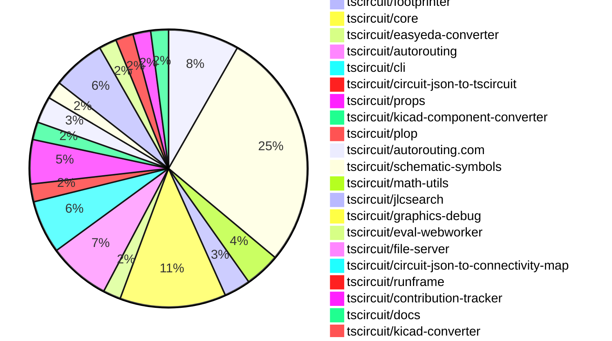

# Contribution Overview 2025-01-01

## PRs by Repository

## Contributor Overview

| Contributor | 🐳 Major | 🐙 Minor | 🐌 Tiny | ⭐ | Issues Created |
|-------------|---------|---------|---------|-----|----------------|
| [seveibar](#seveibar) | 14 | 39 | 3 | 👑👑👑 | 77 |
| [Anshgrover23](#Anshgrover23) | 6 | 17 | 1 | 👑 | 13 |
| [ShiboSoftwareDev](#ShiboSoftwareDev) | 2 | 4 | 0 | ⭐⭐⭐ | 18 |
| [Abse2001](#Abse2001) | 3 | 5 | 0 | ⭐⭐⭐ | 5 |
| [techmannih](#techmannih) | 0 | 6 | 1 | ⭐⭐ | 4 |
| [devin-ai-integration[bot]](#devin-ai-integration[bot]) | 0 | 1 | 0 |  | 0 |
| [DrSensor](#DrSensor) | 0 | 1 | 0 |  | 0 |
| [oldbear26](#oldbear26) | 0 | 1 | 0 |  | 0 |
| [krushnarout](#krushnarout) | 0 | 1 | 0 |  | 0 |

## Review Table

[reviews-received-hover]: ## "Number of reviews received for PRs for this contributor"
[approvals-received-hover]: ## "Number of approvals received for PRs this contributor authored"
[rejections-received-hover]: ## "Number of rejections received for PRs this contributor authored"
[prs-opened-hover]: ## "Number of PRs opened by this contributor"
[issues-created-hover]: ## "Number of issues created by this contributor"
[bountied-issues-hover]: ## "Number of issues this contributor created with a bounty"
[bountied-issue-$-hover]: ## "Total bounty amount placed on issues authored by this contributor"

| Contributor | Reviews Received | Approvals Received | Rejections Received | Approvals | Rejections | PRs Opened | PRs Merged | Issues Created | Bountied Issues | Bountied Issue $ |
|---|---|---|---|---|---|---|---|---|---|---|
| [Abse2001](#Abse2001) | 35 | 7 | 0 | 5 | 5 | 11 | 8 | 5 | 0 | 0 |
| [seveibar](#seveibar) | 1 | 0 | 0 | 48 | 16 | 62 | 57 | 77 | 45 | 575 |
| [DrSensor](#DrSensor) | 1 | 1 | 0 | 0 | 0 | 1 | 1 | 0 | 0 | 0 |
| [Anshgrover23](#Anshgrover23) | 67 | 24 | 17 | 0 | 8 | 29 | 24 | 13 | 1 | 4 |
| [techmannih](#techmannih) | 23 | 12 | 8 | 0 | 0 | 13 | 7 | 4 | 0 | 0 |
| [ShiboSoftwareDev](#ShiboSoftwareDev) | 10 | 7 | 1 | 1 | 2 | 9 | 6 | 18 | 9 | 122 |
| [devin-ai-integration[bot]](#devin-ai-integration[bot]) | 3 | 1 | 2 | 0 | 0 | 3 | 1 | 0 | 0 | 0 |
| [chaadiic](#chaadiic) | 1 | 0 | 1 | 0 | 0 | 1 | 0 | 0 | 0 | 0 |
| [oldbear26](#oldbear26) | 4 | 1 | 1 | 0 | 0 | 2 | 1 | 0 | 0 | 0 |
| [krushnarout](#krushnarout) | 2 | 1 | 1 | 0 | 0 | 2 | 1 | 0 | 0 | 0 |

## Changes by Repository

### [tscircuit/pcb-viewer](https://github.com/tscircuit/pcb-viewer)

| PR # | Impact | Contributor | Description |
|------|--------|-------------|-------------|
| [#114](https://github.com/tscircuit/pcb-viewer/pull/114) | 🐳 Major | Abse2001 | Adds a performance test for the contribution-board feature. |
| [#110](https://github.com/tscircuit/pcb-viewer/pull/110) | 🐳 Major | Abse2001 | Introduces a "View" dropdown in the toolbar overlay to control the display of multiple traces, and enhances the trace filtering algorithm to show only traces with the maximum length by default. |
| [#115](https://github.com/tscircuit/pcb-viewer/pull/115) | 🐳 Major | seveibar | Adds a large LED matrix circuit JSON file and fixes memoization in the PCB viewer component. |
| [#107](https://github.com/tscircuit/pcb-viewer/pull/107) | 🐳 Major | seveibar | Switch to ESM module format, dropping CommonJS support |
| [#101](https://github.com/tscircuit/pcb-viewer/pull/101) | 🐙 Minor | Abse2001 | Added a tooltip to display the trace length and handled cases when the length goes over the maximum length. |
| [#122](https://github.com/tscircuit/pcb-viewer/pull/122) | 🐙 Minor | seveibar | Update the dependency `use-mouse-matrix-transform` to a newer version (1.3.0) to improve ESM compatibility. |
| [#121](https://github.com/tscircuit/pcb-viewer/pull/121) | 🐙 Minor | seveibar | Changes the build script to use `--platform browser` for `tsup` to build for the browser instead of importing `webcrypto`. |
| [#105](https://github.com/tscircuit/pcb-viewer/pull/105) | 🐙 Minor | seveibar | Add Renovate to automatically update dependencies, and update the version of the "circuit-json-to-connectivity-map" dependency. |

### [tscircuit/snippets](https://github.com/tscircuit/snippets)

| PR # | Impact | Contributor | Description |
|------|--------|-------------|-------------|
| [#484](https://github.com/tscircuit/snippets/pull/484) | 🐳 Major | Abse2001 | Introduces a new AI-driven auto-completion feature for the CodeEditor component. |
| [#498](https://github.com/tscircuit/snippets/pull/498) | 🐳 Major | ShiboSoftwareDev | Enhances the footprint dialog with various improvements, including hiding passive components, adding scroll support on mobile, handling read-only parameters, and special handling for BGA footprints. |
| [#515](https://github.com/tscircuit/snippets/pull/515) | 🐙 Minor | seveibar | Add math utils as a presupplied import |
| [#512](https://github.com/tscircuit/snippets/pull/512) | 🐙 Minor | seveibar | Fix the order of the AUTOLOAD_SNIPPETS environment variable in the dev command in package.json. |
| [#506](https://github.com/tscircuit/snippets/pull/506) | 🐙 Minor | seveibar | Update the @tscircuit/pcb-viewer package and the use-mouse-matrix-transform dependency, and add special CORS handling for the alternate registry URL when the payload is too large. |
| [#505](https://github.com/tscircuit/snippets/pull/505) | 🐙 Minor | seveibar | Fixes a retry with an alternate registry server when the initial request fails with a 413 status code. |
| [#503](https://github.com/tscircuit/snippets/pull/503) | 🐙 Minor | seveibar | Adds a fallback URL for updating snippets when the request payload is too large for the primary URL. |
| [#502](https://github.com/tscircuit/snippets/pull/502) | 🐙 Minor | seveibar | Adds support for downloading 3D models in GLTF format. |
| [#493](https://github.com/tscircuit/snippets/pull/493) | 🐙 Minor | seveibar | Improve the search component to display image previews, allow opening in new tab, and sort snippets by updated date. |
| [#487](https://github.com/tscircuit/snippets/pull/487) | 🐙 Minor | seveibar | Reverts a previous fix for card misalignment. |
| [#488](https://github.com/tscircuit/snippets/pull/488) | 🐙 Minor | seveibar | Fix the code to handle the case where `templateFromUrl` is `null`. |
| [#468](https://github.com/tscircuit/snippets/pull/468) | 🐙 Minor | seveibar | Improves the layout and display of bullet points on the landing page for mobile devices. |
| [#463](https://github.com/tscircuit/snippets/pull/463) | 🐙 Minor | seveibar | Adds analytics tracking to the application using Vercel Analytics and Posthog. |
| [#514](https://github.com/tscircuit/snippets/pull/514) | 🐙 Minor | Anshgrover23 | Update the `kicad-converter` dependency and add the generation of a `.kicad_pro` file to the `download-kicad-files` function. |
| [#492](https://github.com/tscircuit/snippets/pull/492) | 🐙 Minor | Anshgrover23 | Fixes the selector used to click on the ellipsis menu item. |
| [#490](https://github.com/tscircuit/snippets/pull/490) | 🐙 Minor | Anshgrover23 | Skips the "Manual edits test" and increases the timeout for various tests. |
| [#482](https://github.com/tscircuit/snippets/pull/482) | 🐙 Minor | Anshgrover23 | Add a new option to download the circuit design as a KiCad project file. |
| [#460](https://github.com/tscircuit/snippets/pull/460) | 🐙 Minor | Anshgrover23 | Fix the search component to make the search results scrollable. |
| [#472](https://github.com/tscircuit/snippets/pull/472) | 🐙 Minor | Anshgrover23 | Add Algora bounty badges to the README.md file. |
| [#458](https://github.com/tscircuit/snippets/pull/458) | 🐙 Minor | Anshgrover23 | Fixes Playwright tests to address issues with the files dialog, footprint dialog, and manual edits tests. |
| [#518](https://github.com/tscircuit/snippets/pull/518) | 🐙 Minor | techmannih | Fixes the star button functionality in the ViewSnippetHeader component. |
| [#489](https://github.com/tscircuit/snippets/pull/489) | 🐙 Minor | techmannih | Fix the landing page card alignment. |
| [#478](https://github.com/tscircuit/snippets/pull/478) | 🐙 Minor | techmannih | Fixes the misalignment of cards by adding a hover effect and transition for the shadow. |
| [#475](https://github.com/tscircuit/snippets/pull/475) | 🐙 Minor | techmannih | Add a button to download the assembly SVG of the circuit. |
| [#500](https://github.com/tscircuit/snippets/pull/500) | 🐙 Minor | oldbear26 | Add type declaration for manual-edits.json in ATA |
| [#465](https://github.com/tscircuit/snippets/pull/465) | 🐙 Minor | krushnarout | Add a new button on the landing page to show a header dropdown component. |
| [#483](https://github.com/tscircuit/snippets/pull/483) | 🐌 Tiny | seveibar | Update the Discord link in the Header2 component |

### [tscircuit/circuit-json](https://github.com/tscircuit/circuit-json)

| PR # | Impact | Contributor | Description |
|------|--------|-------------|-------------|
| [#115](https://github.com/tscircuit/circuit-json/pull/115) | 🐙 Minor | Abse2001 | Added an optional `display_name` field to the `SourceTrace` type. |
| [#119](https://github.com/tscircuit/circuit-json/pull/119) | 🐙 Minor | Anshgrover23 | Ensure accurate rounding for capacitance values in the units module. |
| [#120](https://github.com/tscircuit/circuit-json/pull/120) | 🐙 Minor | techmannih | Introduces a new pill-shaped SMT pad type for PCB. |
| [#116](https://github.com/tscircuit/circuit-json/pull/116) | 🐙 Minor | ShiboSoftwareDev | Added a new circuit element called "simple_mosfet" to the project. |

### [tscircuit/footprinter](https://github.com/tscircuit/footprinter)

| PR # | Impact | Contributor | Description |
|------|--------|-------------|-------------|
| [#108](https://github.com/tscircuit/footprinter/pull/108) | 🐙 Minor | Abse2001 | Debugged the footprints legoutside and added quad legoutside default `false` |
| [#105](https://github.com/tscircuit/footprinter/pull/105) | 🐙 Minor | ShiboSoftwareDev | Changes the parameter types for the `pushbutton` function from `number` to `length` type. |
| [#104](https://github.com/tscircuit/footprinter/pull/104) | 🐙 Minor | ShiboSoftwareDev | Removed the `num_pins` literal type from the `axial` definition and replaced literal types with generic types in other definitions. |

### [tscircuit/core](https://github.com/tscircuit/core)

| PR # | Impact | Contributor | Description |
|------|--------|-------------|-------------|
| [#499](https://github.com/tscircuit/core/pull/499) | 🐳 Major | seveibar | Introduce schematic trace shortcuts and optimize margins |
| [#488](https://github.com/tscircuit/core/pull/488) | 🐳 Major | seveibar | Renames `asyncEffectComplete` to `asyncEffect:end`, adds `asyncEffect:start`, and refactors the emit functions for clarity. |
| [#480](https://github.com/tscircuit/core/pull/480) | 🐳 Major | seveibar | Allows duplicate port hints for overlapping PCB primitive elements to fix some KiCAD conversion issues. |
| [#475](https://github.com/tscircuit/core/pull/475) | 🐳 Major | seveibar | The pull request adds support for non-numeric pin labels in the `schPinStyle` property, and introduces a new function `getNumericSchPinStyle` to handle the conversion of pin styles with labels to a format with only numeric pin numbers. |
| [#481](https://github.com/tscircuit/core/pull/481) | 🐳 Major | ShiboSoftwareDev | Implement the Mosfet component and add it to the component index. |
| [#487](https://github.com/tscircuit/core/pull/487) | 🐙 Minor | Abse2001 | Implemented `<board />` `outlineOffsetX` and `outlineOffsetY` properties |
| [#479](https://github.com/tscircuit/core/pull/479) | 🐙 Minor | Abse2001 | Added the `display_name` property to the `source_trace` object in the `Trace` component. |
| [#503](https://github.com/tscircuit/core/pull/503) | 🐙 Minor | seveibar | Adds support for multiple netlabels on the same pin by appending the new netlabel to the existing one. |
| [#501](https://github.com/tscircuit/core/pull/501) | 🐙 Minor | seveibar | Attempts to catch an infinite loop case that is crashing some circuits by throwing an error after 2,000 iterations. |
| [#492](https://github.com/tscircuit/core/pull/492) | 🐙 Minor | seveibar | Refactors the code that generates schematic obstacles for traces, moving it to a separate function. |
| [#489](https://github.com/tscircuit/core/pull/489) | 🐙 Minor | seveibar | Skip PcbRouteNetIslands when routing is disabled, and export types from Renderable. |
| [#478](https://github.com/tscircuit/core/pull/478) | 🐙 Minor | Anshgrover23 | Added a check for the `noSchematicRepresentation` property in the `Chip` component and early return if it is true to skip the normal schematic rendering. |

### [tscircuit/easyeda-converter](https://github.com/tscircuit/easyeda-converter)

| PR # | Impact | Contributor | Description |
|------|--------|-------------|-------------|
| [#146](https://github.com/tscircuit/easyeda-converter/pull/146) | 🐳 Major | seveibar | Adds support for parsing silkscreen text in the EasyEDA to TSCircuit Soup JSON converter. |
| [#141](https://github.com/tscircuit/easyeda-converter/pull/141) | 🐙 Minor | seveibar | Adds instructions to the README for adding a new part test |

### [tscircuit/autorouting](https://github.com/tscircuit/autorouting)

| PR # | Impact | Contributor | Description |
|------|--------|-------------|-------------|
| [#108](https://github.com/tscircuit/autorouting/pull/108) | 🐳 Major | seveibar | Rewrite `shortenPathWithShortcuts` function for clarity around without `T` projection, fix edge cases where wrong shortcut is selected. |
| [#105](https://github.com/tscircuit/autorouting/pull/105) | 🐳 Major | seveibar | This pull request fixes an issue with the multilayer autorouter not handling collisions properly when shortening paths. |
| [#107](https://github.com/tscircuit/autorouting/pull/107) | 🐙 Minor | seveibar | The pull request improves the debugging of paths and fixes an issue with shortcuts not working. |
| [#106](https://github.com/tscircuit/autorouting/pull/106) | 🐙 Minor | seveibar | Adds several SVG rectangles to the image, likely for visualizing the path-simplification algorithm. |
| [#104](https://github.com/tscircuit/autorouting/pull/104) | 🐙 Minor | seveibar | Fixes a bug with path collisions for simplifying paths |
| [#103](https://github.com/tscircuit/autorouting/pull/103) | 🐙 Minor | seveibar | Add support for Shorten Path with Shortcuts |
| [#109](https://github.com/tscircuit/autorouting/pull/109) | 🐌 Tiny | seveibar | Adds a fallback value for the `MAX_ITERATIONS` option in the `MultilayerIjump` class. |

### [tscircuit/cli](https://github.com/tscircuit/cli)

| PR # | Impact | Contributor | Description |
|------|--------|-------------|-------------|
| [#16](https://github.com/tscircuit/cli/pull/16) | 🐳 Major | seveibar | Adds a new command to the CLI to export the circuit to various formats, including JSON, SVG, and more. |
| [#15](https://github.com/tscircuit/cli/pull/15) | 🐳 Major | seveibar | Refactor for DevServer class state management, add basic test for DevServer initialization, and introduce FileServerRoutes API types. |
| [#12](https://github.com/tscircuit/cli/pull/12) | 🐳 Major | seveibar | Introduces a command-line interface (CLI) for authentication, configuration, and development of tscircuit snippets. |
| [#10](https://github.com/tscircuit/cli/pull/10) | 🐳 Major | seveibar | Adds drag and drop support, dynamic loading of runframe, and events watcher on the CLI. |
| [#13](https://github.com/tscircuit/cli/pull/13) | 🐙 Minor | seveibar | Adds a new "clone" command to the CLI, allowing users to quickly download code snippets from the tscircuit registry. |
| [#11](https://github.com/tscircuit/cli/pull/11) | 🐙 Minor | seveibar | Fix Module Import issue in cli build |

### [tscircuit/circuit-json-to-tscircuit](https://github.com/tscircuit/circuit-json-to-tscircuit)

| PR # | Impact | Contributor | Description |
|------|--------|-------------|-------------|
| [#2](https://github.com/tscircuit/circuit-json-to-tscircuit/pull/2) | 🐳 Major | seveibar | Add initial GitHub Actions workflows for the project, including format checking, type checking, and publishing to npm. |
| [#3](https://github.com/tscircuit/circuit-json-to-tscircuit/pull/3) | 🐙 Minor | seveibar | Adds more information to the README, and removes empty lines from the output. |

### [tscircuit/props](https://github.com/tscircuit/props)

| PR # | Impact | Contributor | Description |
|------|--------|-------------|-------------|
| [#145](https://github.com/tscircuit/props/pull/145) | 🐙 Minor | seveibar | Add a new option `schTraceAutoLabelEnabled` to control whether net labels are automatically created for complex traces. |
| [#144](https://github.com/tscircuit/props/pull/144) | 🐙 Minor | seveibar | Rename board properties `pcbOffsetX` and `pcbOffsetY` to `outlineOffsetX` and `outlineOffsetY`. |
| [#141](https://github.com/tscircuit/props/pull/141) | 🐙 Minor | Anshgrover23 | Add a new property `noSchematicRepresentation` to the `chipProps` interface and update the tests accordingly. |
| [#138](https://github.com/tscircuit/props/pull/138) | 🐙 Minor | ShiboSoftwareDev | Changes the `channelType` property of the `MosfetProps` interface from "nmos" and "pmos" to "n" and "p", and adds a new `mosfetMode` property to distinguish between "enhancement" and "depletion" modes. |
| [#143](https://github.com/tscircuit/props/pull/143) | 🐙 Minor | devin-ai-integration[bot] | Add pcbOffsetX and pcbOffsetY to board component to allow offsetting the board's PCB position on the X and Y axis. |

### [tscircuit/kicad-component-converter](https://github.com/tscircuit/kicad-component-converter)

| PR # | Impact | Contributor | Description |
|------|--------|-------------|-------------|
| [#112](https://github.com/tscircuit/kicad-component-converter/pull/112) | 🐙 Minor | seveibar | Adds a feature to allow opening the generated TSCircuit code in a code snippet website. |
| [#110](https://github.com/tscircuit/kicad-component-converter/pull/110) | 🐙 Minor | seveibar | Adds a GitHub Actions workflow to check the format of the code using Bun |

### [tscircuit/plop](https://github.com/tscircuit/plop)

| PR # | Impact | Contributor | Description |
|------|--------|-------------|-------------|
| [#7](https://github.com/tscircuit/plop/pull/7) | 🐙 Minor | seveibar | Allow bot token for bypassing branch protection on version commit |

### [tscircuit/autorouting.com](https://github.com/tscircuit/autorouting.com)

| PR # | Impact | Contributor | Description |
|------|--------|-------------|-------------|
| [#14](https://github.com/tscircuit/autorouting.com/pull/14) | 🐙 Minor | seveibar | Reverts the addition of the main logo animation. |
| [#16](https://github.com/tscircuit/autorouting.com/pull/16) | 🐙 Minor | Anshgrover23 | Adds an autorouting animation on the main page |
| [#13](https://github.com/tscircuit/autorouting.com/pull/13) | 🐙 Minor | Anshgrover23 | Add main logo animation to the webpage |

### [tscircuit/schematic-symbols](https://github.com/tscircuit/schematic-symbols)

| PR # | Impact | Contributor | Description |
|------|--------|-------------|-------------|
| [#232](https://github.com/tscircuit/schematic-symbols/pull/232) | 🐙 Minor | seveibar | The pull request automatically computes the size of resistor and capacitor symbols based on their primitives. |
| [#231](https://github.com/tscircuit/schematic-symbols/pull/231) | 🐙 Minor | techmannih | Adds an op-amp symbol to the project. |

### [tscircuit/math-utils](https://github.com/tscircuit/math-utils)

| PR # | Impact | Contributor | Description |
|------|--------|-------------|-------------|
| [#4](https://github.com/tscircuit/math-utils/pull/4) | 🐙 Minor | seveibar | Add row and column to the GridCellPositions type |

### [tscircuit/jlcsearch](https://github.com/tscircuit/jlcsearch)

| PR # | Impact | Contributor | Description |
|------|--------|-------------|-------------|
| [#25](https://github.com/tscircuit/jlcsearch/pull/25) | 🐳 Major | Anshgrover23 | Adds a new derived table for LCD display modules, including functionality to extract relevant data from component descriptions and attributes. |
| [#23](https://github.com/tscircuit/jlcsearch/pull/23) | 🐳 Major | Anshgrover23 | Adds a new page for displaying LED Dot Matrix Display Modules |
| [#22](https://github.com/tscircuit/jlcsearch/pull/22) | 🐳 Major | Anshgrover23 | The pull request adds a new derived table for OLED display modules, including columns for package, protocol, display width, and pixel resolution. It also adds a new route and page for listing OLED display modules with filtering options. |
| [#24](https://github.com/tscircuit/jlcsearch/pull/24) | 🐳 Major | Anshgrover23 | Adds a new derived table for LED segment display modules, including columns for package, positions, type, size, and color. |
| [#14](https://github.com/tscircuit/jlcsearch/pull/14) | 🐳 Major | Anshgrover23 |  |
| [#16](https://github.com/tscircuit/jlcsearch/pull/16) | 🐙 Minor | seveibar | Adds a PostHog analytics script to the application. |

### [tscircuit/graphics-debug](https://github.com/tscircuit/graphics-debug)

| PR # | Impact | Contributor | Description |
|------|--------|-------------|-------------|
| [#12](https://github.com/tscircuit/graphics-debug/pull/12) | 🐙 Minor | seveibar | Fixes a bug in the coordinate system handling for rectangles in the `getSvgFromGraphicsObject` function. |

### [tscircuit/eval-webworker](https://github.com/tscircuit/eval-webworker)

| PR # | Impact | Contributor | Description |
|------|--------|-------------|-------------|
| [#62](https://github.com/tscircuit/eval-webworker/pull/62) | 🐙 Minor | seveibar | Adds support for rebinding event listeners to the `on` method of the `CircuitWebWorker` API. |
| [#71](https://github.com/tscircuit/eval-webworker/pull/71) | 🐙 Minor | Anshgrover23 | Adds a `clearEventListeners()` function to the `CircuitWebWorker` API to remove all event listeners from the active circuit. |

### [tscircuit/file-server](https://github.com/tscircuit/file-server)

| PR # | Impact | Contributor | Description |
|------|--------|-------------|-------------|
| [#4](https://github.com/tscircuit/file-server/pull/4) | 🐙 Minor | seveibar | Refactor Event name, start lib exports, add initiator support |

### [tscircuit/circuit-json-to-connectivity-map](https://github.com/tscircuit/circuit-json-to-connectivity-map)

| PR # | Impact | Contributor | Description |
|------|--------|-------------|-------------|
| [#7](https://github.com/tscircuit/circuit-json-to-connectivity-map/pull/7) | 🐌 Tiny | seveibar | Update the version of the `@tscircuit/math-utils` dependency to `^0.0.9`. |

### [tscircuit/runframe](https://github.com/tscircuit/runframe)

| PR # | Impact | Contributor | Description |
|------|--------|-------------|-------------|
| [#111](https://github.com/tscircuit/runframe/pull/111) | 🟣 | seveibar |  |
| [#108](https://github.com/tscircuit/runframe/pull/108) | 🐙 Minor | seveibar | Add a new "Render Log" tab to the CircuitJsonPreview component. |

### [tscircuit/contribution-tracker](https://github.com/tscircuit/contribution-tracker)

| PR # | Impact | Contributor | Description |
|------|--------|-------------|-------------|
| [#28](https://github.com/tscircuit/contribution-tracker/pull/28) | 🐳 Major | Anshgrover23 | Implement caching for GitHub API calls to improve performance |
| [#30](https://github.com/tscircuit/contribution-tracker/pull/30) | 🐙 Minor | Anshgrover23 | Adds a cache to the Claude-Anthropic integration to improve performance and reduce API calls. |

### [tscircuit/docs](https://github.com/tscircuit/docs)

| PR # | Impact | Contributor | Description |
|------|--------|-------------|-------------|
| [#53](https://github.com/tscircuit/docs/pull/53) | 🐙 Minor | Anshgrover23 | Adds documentation for new components (transistor, inductor, LED, and power source) and updates the trace documentation. |
| [#46](https://github.com/tscircuit/docs/pull/46) | 🐌 Tiny | techmannih | Fixes a typo and clarifies the terminology in the trace description. |

### [tscircuit/kicad-converter](https://github.com/tscircuit/kicad-converter)

| PR # | Impact | Contributor | Description |
|------|--------|-------------|-------------|
| [#12](https://github.com/tscircuit/kicad-converter/pull/12) | 🐙 Minor | Anshgrover23 | Add kicad-pro to the index file for importing related functionality |

### [tscircuit/maintenance-tracker](https://github.com/tscircuit/maintenance-tracker)

| PR # | Impact | Contributor | Description |
|------|--------|-------------|-------------|
| [#4](https://github.com/tscircuit/maintenance-tracker/pull/4) | 🐙 Minor | Anshgrover23 | Treat skipped checks as successful checks in the Playwright test health check. |

### [tscircuit/tscircuit](https://github.com/tscircuit/tscircuit)

| PR # | Impact | Contributor | Description |
|------|--------|-------------|-------------|
| [#493](https://github.com/tscircuit/tscircuit/pull/493) | 🐌 Tiny | Anshgrover23 | Added Algora badges to the README.md file. |

### [tscircuit/3d-viewer](https://github.com/tscircuit/3d-viewer)

| PR # | Impact | Contributor | Description |
|------|--------|-------------|-------------|
| [#96](https://github.com/tscircuit/3d-viewer/pull/96) | 🐙 Minor | DrSensor | Adds hooks for exporting to GLTF format |

## Changes by Contributor

### [Abse2001](https://github.com/Abse2001)

| PR # | Impact | Description |
|------|--------|-------------|
| [#114](https://github.com/tscircuit/pcb-viewer/pull/114) | 🐳 Major | Adds a performance test for the contribution-board feature. |
| [#110](https://github.com/tscircuit/pcb-viewer/pull/110) | 🐳 Major | Introduces a "View" dropdown in the toolbar overlay to control the display of multiple traces, and enhances the trace filtering algorithm to show only traces with the maximum length by default. |
| [#484](https://github.com/tscircuit/snippets/pull/484) | 🐳 Major | Introduces a new AI-driven auto-completion feature for the CodeEditor component. |
| [#101](https://github.com/tscircuit/pcb-viewer/pull/101) | 🐙 Minor | Added a tooltip to display the trace length and handled cases when the length goes over the maximum length. |
| [#115](https://github.com/tscircuit/circuit-json/pull/115) | 🐙 Minor | Added an optional `display_name` field to the `SourceTrace` type. |
| [#108](https://github.com/tscircuit/footprinter/pull/108) | 🐙 Minor | Debugged the footprints legoutside and added quad legoutside default `false` |
| [#487](https://github.com/tscircuit/core/pull/487) | 🐙 Minor | Implemented `<board />` `outlineOffsetX` and `outlineOffsetY` properties |
| [#479](https://github.com/tscircuit/core/pull/479) | 🐙 Minor | Added the `display_name` property to the `source_trace` object in the `Trace` component. |

### [seveibar](https://github.com/seveibar)

| PR # | Impact | Description |
|------|--------|-------------|
| [#115](https://github.com/tscircuit/pcb-viewer/pull/115) | 🐳 Major | Adds a large LED matrix circuit JSON file and fixes memoization in the PCB viewer component. |
| [#107](https://github.com/tscircuit/pcb-viewer/pull/107) | 🐳 Major | Switch to ESM module format, dropping CommonJS support |
| [#146](https://github.com/tscircuit/easyeda-converter/pull/146) | 🐳 Major | Adds support for parsing silkscreen text in the EasyEDA to TSCircuit Soup JSON converter. |
| [#499](https://github.com/tscircuit/core/pull/499) | 🐳 Major | Introduce schematic trace shortcuts and optimize margins |
| [#488](https://github.com/tscircuit/core/pull/488) | 🐳 Major | Renames `asyncEffectComplete` to `asyncEffect:end`, adds `asyncEffect:start`, and refactors the emit functions for clarity. |
| [#480](https://github.com/tscircuit/core/pull/480) | 🐳 Major | Allows duplicate port hints for overlapping PCB primitive elements to fix some KiCAD conversion issues. |
| [#475](https://github.com/tscircuit/core/pull/475) | 🐳 Major | The pull request adds support for non-numeric pin labels in the `schPinStyle` property, and introduces a new function `getNumericSchPinStyle` to handle the conversion of pin styles with labels to a format with only numeric pin numbers. |
| [#108](https://github.com/tscircuit/autorouting/pull/108) | 🐳 Major | Rewrite `shortenPathWithShortcuts` function for clarity around without `T` projection, fix edge cases where wrong shortcut is selected. |
| [#105](https://github.com/tscircuit/autorouting/pull/105) | 🐳 Major | This pull request fixes an issue with the multilayer autorouter not handling collisions properly when shortening paths. |
| [#16](https://github.com/tscircuit/cli/pull/16) | 🐳 Major | Adds a new command to the CLI to export the circuit to various formats, including JSON, SVG, and more. |
| [#15](https://github.com/tscircuit/cli/pull/15) | 🐳 Major | Refactor for DevServer class state management, add basic test for DevServer initialization, and introduce FileServerRoutes API types. |
| [#12](https://github.com/tscircuit/cli/pull/12) | 🐳 Major | Introduces a command-line interface (CLI) for authentication, configuration, and development of tscircuit snippets. |
| [#10](https://github.com/tscircuit/cli/pull/10) | 🐳 Major | Adds drag and drop support, dynamic loading of runframe, and events watcher on the CLI. |
| [#2](https://github.com/tscircuit/circuit-json-to-tscircuit/pull/2) | 🐳 Major | Add initial GitHub Actions workflows for the project, including format checking, type checking, and publishing to npm. |
| [#122](https://github.com/tscircuit/pcb-viewer/pull/122) | 🐙 Minor | Update the dependency `use-mouse-matrix-transform` to a newer version (1.3.0) to improve ESM compatibility. |
| [#121](https://github.com/tscircuit/pcb-viewer/pull/121) | 🐙 Minor | Changes the build script to use `--platform browser` for `tsup` to build for the browser instead of importing `webcrypto`. |
| [#105](https://github.com/tscircuit/pcb-viewer/pull/105) | 🐙 Minor | Add Renovate to automatically update dependencies, and update the version of the "circuit-json-to-connectivity-map" dependency. |
| [#145](https://github.com/tscircuit/props/pull/145) | 🐙 Minor | Add a new option `schTraceAutoLabelEnabled` to control whether net labels are automatically created for complex traces. |
| [#144](https://github.com/tscircuit/props/pull/144) | 🐙 Minor | Rename board properties `pcbOffsetX` and `pcbOffsetY` to `outlineOffsetX` and `outlineOffsetY`. |
| [#112](https://github.com/tscircuit/kicad-component-converter/pull/112) | 🐙 Minor | Adds a feature to allow opening the generated TSCircuit code in a code snippet website. |
| [#110](https://github.com/tscircuit/kicad-component-converter/pull/110) | 🐙 Minor | Adds a GitHub Actions workflow to check the format of the code using Bun |
| [#141](https://github.com/tscircuit/easyeda-converter/pull/141) | 🐙 Minor | Adds instructions to the README for adding a new part test |
| [#503](https://github.com/tscircuit/core/pull/503) | 🐙 Minor | Adds support for multiple netlabels on the same pin by appending the new netlabel to the existing one. |
| [#501](https://github.com/tscircuit/core/pull/501) | 🐙 Minor | Attempts to catch an infinite loop case that is crashing some circuits by throwing an error after 2,000 iterations. |
| [#492](https://github.com/tscircuit/core/pull/492) | 🐙 Minor | Refactors the code that generates schematic obstacles for traces, moving it to a separate function. |
| [#489](https://github.com/tscircuit/core/pull/489) | 🐙 Minor | Skip PcbRouteNetIslands when routing is disabled, and export types from Renderable. |
| [#7](https://github.com/tscircuit/plop/pull/7) | 🐙 Minor | Allow bot token for bypassing branch protection on version commit |
| [#107](https://github.com/tscircuit/autorouting/pull/107) | 🐙 Minor | The pull request improves the debugging of paths and fixes an issue with shortcuts not working. |
| [#106](https://github.com/tscircuit/autorouting/pull/106) | 🐙 Minor | Adds several SVG rectangles to the image, likely for visualizing the path-simplification algorithm. |
| [#104](https://github.com/tscircuit/autorouting/pull/104) | 🐙 Minor | Fixes a bug with path collisions for simplifying paths |
| [#103](https://github.com/tscircuit/autorouting/pull/103) | 🐙 Minor | Add support for Shorten Path with Shortcuts |
| [#14](https://github.com/tscircuit/autorouting.com/pull/14) | 🐙 Minor | Reverts the addition of the main logo animation. |
| [#232](https://github.com/tscircuit/schematic-symbols/pull/232) | 🐙 Minor | The pull request automatically computes the size of resistor and capacitor symbols based on their primitives. |
| [#4](https://github.com/tscircuit/math-utils/pull/4) | 🐙 Minor | Add row and column to the GridCellPositions type |
| [#515](https://github.com/tscircuit/snippets/pull/515) | 🐙 Minor | Add math utils as a presupplied import |
| [#512](https://github.com/tscircuit/snippets/pull/512) | 🐙 Minor | Fix the order of the AUTOLOAD_SNIPPETS environment variable in the dev command in package.json. |
| [#506](https://github.com/tscircuit/snippets/pull/506) | 🐙 Minor | Update the @tscircuit/pcb-viewer package and the use-mouse-matrix-transform dependency, and add special CORS handling for the alternate registry URL when the payload is too large. |
| [#505](https://github.com/tscircuit/snippets/pull/505) | 🐙 Minor | Fixes a retry with an alternate registry server when the initial request fails with a 413 status code. |
| [#503](https://github.com/tscircuit/snippets/pull/503) | 🐙 Minor | Adds a fallback URL for updating snippets when the request payload is too large for the primary URL. |
| [#502](https://github.com/tscircuit/snippets/pull/502) | 🐙 Minor | Adds support for downloading 3D models in GLTF format. |
| [#493](https://github.com/tscircuit/snippets/pull/493) | 🐙 Minor | Improve the search component to display image previews, allow opening in new tab, and sort snippets by updated date. |
| [#487](https://github.com/tscircuit/snippets/pull/487) | 🐙 Minor | Reverts a previous fix for card misalignment. |
| [#488](https://github.com/tscircuit/snippets/pull/488) | 🐙 Minor | Fix the code to handle the case where `templateFromUrl` is `null`. |
| [#468](https://github.com/tscircuit/snippets/pull/468) | 🐙 Minor | Improves the layout and display of bullet points on the landing page for mobile devices. |
| [#463](https://github.com/tscircuit/snippets/pull/463) | 🐙 Minor | Adds analytics tracking to the application using Vercel Analytics and Posthog. |
| [#16](https://github.com/tscircuit/jlcsearch/pull/16) | 🐙 Minor | Adds a PostHog analytics script to the application. |
| [#12](https://github.com/tscircuit/graphics-debug/pull/12) | 🐙 Minor | Fixes a bug in the coordinate system handling for rectangles in the `getSvgFromGraphicsObject` function. |
| [#62](https://github.com/tscircuit/eval-webworker/pull/62) | 🐙 Minor | Adds support for rebinding event listeners to the `on` method of the `CircuitWebWorker` API. |
| [#13](https://github.com/tscircuit/cli/pull/13) | 🐙 Minor | Adds a new "clone" command to the CLI, allowing users to quickly download code snippets from the tscircuit registry. |
| [#11](https://github.com/tscircuit/cli/pull/11) | 🐙 Minor | Fix Module Import issue in cli build |
| [#4](https://github.com/tscircuit/file-server/pull/4) | 🐙 Minor | Refactor Event name, start lib exports, add initiator support |
| [#3](https://github.com/tscircuit/circuit-json-to-tscircuit/pull/3) | 🐙 Minor | Adds more information to the README, and removes empty lines from the output. |
| [#109](https://github.com/tscircuit/autorouting/pull/109) | 🐌 Tiny | Adds a fallback value for the `MAX_ITERATIONS` option in the `MultilayerIjump` class. |
| [#7](https://github.com/tscircuit/circuit-json-to-connectivity-map/pull/7) | 🐌 Tiny | Update the version of the `@tscircuit/math-utils` dependency to `^0.0.9`. |
| [#483](https://github.com/tscircuit/snippets/pull/483) | 🐌 Tiny | Update the Discord link in the Header2 component |
| [#111](https://github.com/tscircuit/runframe/pull/111) | 🟣 |  |
| [#108](https://github.com/tscircuit/runframe/pull/108) | 🐙 Minor | Add a new "Render Log" tab to the CircuitJsonPreview component. |

### [Anshgrover23](https://github.com/Anshgrover23)

| PR # | Impact | Description |
|------|--------|-------------|
| [#28](https://github.com/tscircuit/contribution-tracker/pull/28) | 🐳 Major | Implement caching for GitHub API calls to improve performance |
| [#25](https://github.com/tscircuit/jlcsearch/pull/25) | 🐳 Major | Adds a new derived table for LCD display modules, including functionality to extract relevant data from component descriptions and attributes. |
| [#23](https://github.com/tscircuit/jlcsearch/pull/23) | 🐳 Major | Adds a new page for displaying LED Dot Matrix Display Modules |
| [#22](https://github.com/tscircuit/jlcsearch/pull/22) | 🐳 Major | The pull request adds a new derived table for OLED display modules, including columns for package, protocol, display width, and pixel resolution. It also adds a new route and page for listing OLED display modules with filtering options. |
| [#24](https://github.com/tscircuit/jlcsearch/pull/24) | 🐳 Major | Adds a new derived table for LED segment display modules, including columns for package, positions, type, size, and color. |
| [#14](https://github.com/tscircuit/jlcsearch/pull/14) | 🐳 Major |  |
| [#119](https://github.com/tscircuit/circuit-json/pull/119) | 🐙 Minor | Ensure accurate rounding for capacitance values in the units module. |
| [#53](https://github.com/tscircuit/docs/pull/53) | 🐙 Minor | Adds documentation for new components (transistor, inductor, LED, and power source) and updates the trace documentation. |
| [#141](https://github.com/tscircuit/props/pull/141) | 🐙 Minor | Add a new property `noSchematicRepresentation` to the `chipProps` interface and update the tests accordingly. |
| [#478](https://github.com/tscircuit/core/pull/478) | 🐙 Minor | Added a check for the `noSchematicRepresentation` property in the `Chip` component and early return if it is true to skip the normal schematic rendering. |
| [#30](https://github.com/tscircuit/contribution-tracker/pull/30) | 🐙 Minor | Adds a cache to the Claude-Anthropic integration to improve performance and reduce API calls. |
| [#16](https://github.com/tscircuit/autorouting.com/pull/16) | 🐙 Minor | Adds an autorouting animation on the main page |
| [#13](https://github.com/tscircuit/autorouting.com/pull/13) | 🐙 Minor | Add main logo animation to the webpage |
| [#12](https://github.com/tscircuit/kicad-converter/pull/12) | 🐙 Minor | Add kicad-pro to the index file for importing related functionality |
| [#514](https://github.com/tscircuit/snippets/pull/514) | 🐙 Minor | Update the `kicad-converter` dependency and add the generation of a `.kicad_pro` file to the `download-kicad-files` function. |
| [#492](https://github.com/tscircuit/snippets/pull/492) | 🐙 Minor | Fixes the selector used to click on the ellipsis menu item. |
| [#490](https://github.com/tscircuit/snippets/pull/490) | 🐙 Minor | Skips the "Manual edits test" and increases the timeout for various tests. |
| [#482](https://github.com/tscircuit/snippets/pull/482) | 🐙 Minor | Add a new option to download the circuit design as a KiCad project file. |
| [#460](https://github.com/tscircuit/snippets/pull/460) | 🐙 Minor | Fix the search component to make the search results scrollable. |
| [#472](https://github.com/tscircuit/snippets/pull/472) | 🐙 Minor | Add Algora bounty badges to the README.md file. |
| [#458](https://github.com/tscircuit/snippets/pull/458) | 🐙 Minor | Fixes Playwright tests to address issues with the files dialog, footprint dialog, and manual edits tests. |
| [#71](https://github.com/tscircuit/eval-webworker/pull/71) | 🐙 Minor | Adds a `clearEventListeners()` function to the `CircuitWebWorker` API to remove all event listeners from the active circuit. |
| [#4](https://github.com/tscircuit/maintenance-tracker/pull/4) | 🐙 Minor | Treat skipped checks as successful checks in the Playwright test health check. |
| [#493](https://github.com/tscircuit/tscircuit/pull/493) | 🐌 Tiny | Added Algora badges to the README.md file. |

### [techmannih](https://github.com/techmannih)

| PR # | Impact | Description |
|------|--------|-------------|
| [#120](https://github.com/tscircuit/circuit-json/pull/120) | 🐙 Minor | Introduces a new pill-shaped SMT pad type for PCB. |
| [#231](https://github.com/tscircuit/schematic-symbols/pull/231) | 🐙 Minor | Adds an op-amp symbol to the project. |
| [#518](https://github.com/tscircuit/snippets/pull/518) | 🐙 Minor | Fixes the star button functionality in the ViewSnippetHeader component. |
| [#489](https://github.com/tscircuit/snippets/pull/489) | 🐙 Minor | Fix the landing page card alignment. |
| [#478](https://github.com/tscircuit/snippets/pull/478) | 🐙 Minor | Fixes the misalignment of cards by adding a hover effect and transition for the shadow. |
| [#475](https://github.com/tscircuit/snippets/pull/475) | 🐙 Minor | Add a button to download the assembly SVG of the circuit. |
| [#46](https://github.com/tscircuit/docs/pull/46) | 🐌 Tiny | Fixes a typo and clarifies the terminology in the trace description. |

### [ShiboSoftwareDev](https://github.com/ShiboSoftwareDev)

| PR # | Impact | Description |
|------|--------|-------------|
| [#481](https://github.com/tscircuit/core/pull/481) | 🐳 Major | Implement the Mosfet component and add it to the component index. |
| [#498](https://github.com/tscircuit/snippets/pull/498) | 🐳 Major | Enhances the footprint dialog with various improvements, including hiding passive components, adding scroll support on mobile, handling read-only parameters, and special handling for BGA footprints. |
| [#116](https://github.com/tscircuit/circuit-json/pull/116) | 🐙 Minor | Added a new circuit element called "simple_mosfet" to the project. |
| [#138](https://github.com/tscircuit/props/pull/138) | 🐙 Minor | Changes the `channelType` property of the `MosfetProps` interface from "nmos" and "pmos" to "n" and "p", and adds a new `mosfetMode` property to distinguish between "enhancement" and "depletion" modes. |
| [#105](https://github.com/tscircuit/footprinter/pull/105) | 🐙 Minor | Changes the parameter types for the `pushbutton` function from `number` to `length` type. |
| [#104](https://github.com/tscircuit/footprinter/pull/104) | 🐙 Minor | Removed the `num_pins` literal type from the `axial` definition and replaced literal types with generic types in other definitions. |

### [devin-ai-integration[bot]](https://github.com/devin-ai-integration[bot])

| PR # | Impact | Description |
|------|--------|-------------|
| [#143](https://github.com/tscircuit/props/pull/143) | 🐙 Minor | Add pcbOffsetX and pcbOffsetY to board component to allow offsetting the board's PCB position on the X and Y axis. |

### [DrSensor](https://github.com/DrSensor)

| PR # | Impact | Description |
|------|--------|-------------|
| [#96](https://github.com/tscircuit/3d-viewer/pull/96) | 🐙 Minor | Adds hooks for exporting to GLTF format |

### [oldbear26](https://github.com/oldbear26)

| PR # | Impact | Description |
|------|--------|-------------|
| [#500](https://github.com/tscircuit/snippets/pull/500) | 🐙 Minor | Add type declaration for manual-edits.json in ATA |

### [krushnarout](https://github.com/krushnarout)

| PR # | Impact | Description |
|------|--------|-------------|
| [#465](https://github.com/tscircuit/snippets/pull/465) | 🐙 Minor | Add a new button on the landing page to show a header dropdown component. |

