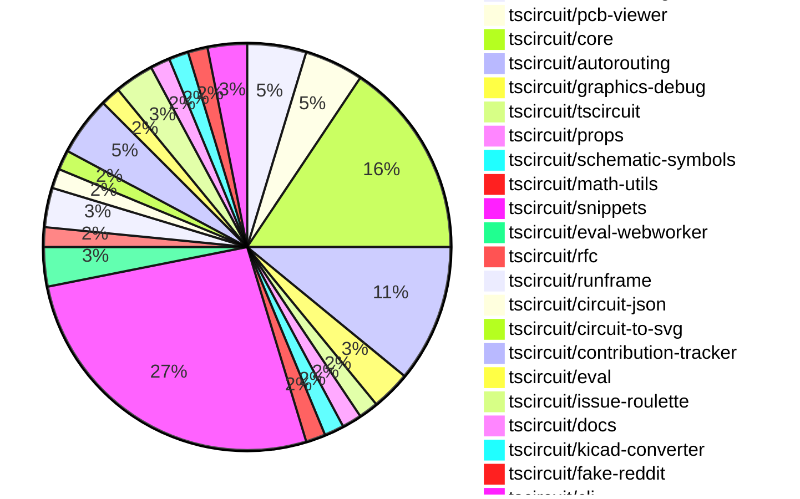

# Contribution Overview 2025-01-08

## PRs by Repository

## Contributor Overview

| Contributor | 🐳 Major | 🐙 Minor | 🐌 Tiny | ⭐ | Issues Created |
|-------------|---------|---------|---------|-----|----------------|
| [seveibar](#seveibar) | 7 | 21 | 2 | 👑👑👑 | 62 |
| [Anshgrover23](#Anshgrover23) | 3 | 13 | 0 | ⭐⭐⭐ | 9 |
| [ShiboSoftwareDev](#ShiboSoftwareDev) | 1 | 3 | 1 | ⭐⭐ | 11 |
| [Abse2001](#Abse2001) | 1 | 1 | 0 | ⭐⭐ | 4 |
| [techmannih](#techmannih) | 1 | 3 | 0 | ⭐ | 2 |
| [kom-senapati](#kom-senapati) | 1 | 2 | 0 | ⭐ | 2 |
| [imrishabh18](#imrishabh18) | 0 | 2 | 0 | ⭐ | 5 |
| [DevGajjar28](#DevGajjar28) | 0 | 1 | 0 |  | 1 |

## Review Table

[reviews-received-hover]: ## "Number of reviews received for PRs for this contributor"
[approvals-received-hover]: ## "Number of approvals received for PRs this contributor authored"
[rejections-received-hover]: ## "Number of rejections received for PRs this contributor authored"
[prs-opened-hover]: ## "Number of PRs opened by this contributor"
[issues-created-hover]: ## "Number of issues created by this contributor"
[bountied-issues-hover]: ## "Number of issues this contributor created with a bounty"
[bountied-issue-$-hover]: ## "Total bounty amount placed on issues authored by this contributor"

| Contributor | Reviews Received | Approvals Received | Rejections Received | Approvals | Rejections | PRs Opened | PRs Merged | Issues Created | Bountied Issues | Bountied Issue $ |
|---|---|---|---|---|---|---|---|---|---|---|
| [Abse2001](#Abse2001) | 12 | 2 | 0 | 4 | 5 | 4 | 2 | 4 | 1 | 10 |
| [seveibar](#seveibar) | 0 | 0 | 0 | 30 | 9 | 37 | 31 | 62 | 41 | 510 |
| [kom-senapati](#kom-senapati) | 5 | 2 | 2 | 0 | 0 | 7 | 3 | 2 | 1 | 2 |
| [techmannih](#techmannih) | 21 | 8 | 5 | 0 | 0 | 9 | 4 | 2 | 0 | 0 |
| [Anshgrover23](#Anshgrover23) | 54 | 17 | 9 | 0 | 4 | 19 | 16 | 9 | 1 | 2 |
| [chaadiic](#chaadiic) | 3 | 1 | 1 | 0 | 0 | 1 | 0 | 0 | 0 | 0 |
| [imrishabh18](#imrishabh18) | 2 | 0 | 1 | 1 | 2 | 3 | 2 | 5 | 0 | 0 |
| [ShiboSoftwareDev](#ShiboSoftwareDev) | 7 | 5 | 0 | 1 | 0 | 8 | 5 | 11 | 5 | 70 |
| [bhuvan-crypto](#bhuvan-crypto) | 2 | 0 | 2 | 0 | 0 | 1 | 0 | 0 | 0 | 0 |
| [devin-ai-integration[bot]](#devin-ai-integration[bot]) | 0 | 0 | 0 | 0 | 0 | 1 | 0 | 0 | 0 | 0 |
| [DevGajjar28](#DevGajjar28) | 1 | 1 | 0 | 0 | 0 | 1 | 1 | 1 | 0 | 0 |
| [abhishek818](#abhishek818) | 0 | 0 | 0 | 0 | 0 | 1 | 0 | 0 | 0 | 0 |

## Changes by Repository

### [tscircuit/autorouting.com](https://github.com/tscircuit/autorouting.com)

| PR # | Impact | Contributor | Description |
|------|--------|-------------|-------------|
| [#21](https://github.com/tscircuit/autorouting.com/pull/21) | 🐳 Major | Abse2001 | Adds a command-line interface (CLI) command to download a dataset from a remote source and save it to the local filesystem. |
| [#16](https://github.com/tscircuit/autorouting.com/pull/16) | 🐙 Minor | Anshgrover23 |  |
| [#14](https://github.com/tscircuit/autorouting.com/pull/14) | 🐌 Tiny | seveibar | Reverts the addition of the main logo animation |

### [tscircuit/pcb-viewer](https://github.com/tscircuit/pcb-viewer)

| PR # | Impact | Contributor | Description |
|------|--------|-------------|-------------|
| [#114](https://github.com/tscircuit/pcb-viewer/pull/114) | 🐙 Minor | Abse2001 | Adds a performance test for the contribution board component. |
| [#122](https://github.com/tscircuit/pcb-viewer/pull/122) | 🐙 Minor | seveibar | Update `use-mouse-matrix-transform` to version 1.3.0 for better ESM compatibility. |
| [#121](https://github.com/tscircuit/pcb-viewer/pull/121) | 🐙 Minor | seveibar | Changed the build script to use `--platform browser` to build for the browser, which removes the need to import `webcrypto`. |

### [tscircuit/core](https://github.com/tscircuit/core)

| PR # | Impact | Contributor | Description |
|------|--------|-------------|-------------|
| [#503](https://github.com/tscircuit/core/pull/503) | 🐳 Major | seveibar | Adds support for displaying multiple netlabels on the same pin. |
| [#499](https://github.com/tscircuit/core/pull/499) | 🐳 Major | seveibar | Introduce schematic trace shortcuts and optimize margins |
| [#509](https://github.com/tscircuit/core/pull/509) | 🐳 Major | techmannih | The pull request fixes a bug in the `createSchematicTraceJunctions` function to correctly handle the intersection of two traces. |
| [#506](https://github.com/tscircuit/core/pull/506) | 🐙 Minor | seveibar | Fix and repro for NaN in schematic trace, minor refactor |
| [#501](https://github.com/tscircuit/core/pull/501) | 🐙 Minor | seveibar | Adds a check to prevent an infinite loop in the `createSchematicTraceCrossingSegments` function. |
| [#492](https://github.com/tscircuit/core/pull/492) | 🐙 Minor | seveibar | Refactors the code to get the schematic obstacles for a trace by moving the logic to a separate function. |
| [#489](https://github.com/tscircuit/core/pull/489) | 🐙 Minor | seveibar | Avoid calculating PCB route net islands when routing is disabled and export types from Renderable |
| [#515](https://github.com/tscircuit/core/pull/515) | 🐙 Minor | Anshgrover23 | Fix a bug where capacitors don't render with a negative schematic rotation. |
| [#511](https://github.com/tscircuit/core/pull/511) | 🐙 Minor | Anshgrover23 | Adds the ability to use `React.createElement` directly without having to import `React`. |
| [#514](https://github.com/tscircuit/core/pull/514) | 🐙 Minor | imrishabh18 | Throw an error when the `schRotation` prop is not a multiple of 90 degrees for a `PrimitiveComponent`. |

### [tscircuit/autorouting](https://github.com/tscircuit/autorouting)

| PR # | Impact | Contributor | Description |
|------|--------|-------------|-------------|
| [#108](https://github.com/tscircuit/autorouting/pull/108) | 🐳 Major | seveibar | Rewrites the `shortenPathWithShortcuts` function for clarity around the `without T projection` case and fixes edge cases where the wrong shortcut was selected. |
| [#107](https://github.com/tscircuit/autorouting/pull/107) | 🐳 Major | seveibar | The pull request improves the debugging of paths and fixes an issue with shortcuts not working. |
| [#106](https://github.com/tscircuit/autorouting/pull/106) | 🐳 Major | seveibar | Adds more SVG rectangles to the snapshot file for the "shorten-path-with-shortcuts-6-normal" test. |
| [#103](https://github.com/tscircuit/autorouting/pull/103) | 🐳 Major | seveibar | Add support for Shorten Path with Shortcuts |
| [#109](https://github.com/tscircuit/autorouting/pull/109) | 🐙 Minor | seveibar | Adds a fallback value for the MAX_ITERATIONS option if it's not provided in the constructor. |
| [#105](https://github.com/tscircuit/autorouting/pull/105) | 🐙 Minor | seveibar | Fix a bug in the multilayer autorouter where it was not handling collisions properly when shortening paths. |
| [#104](https://github.com/tscircuit/autorouting/pull/104) | 🐙 Minor | seveibar | Fix bug with path collisions for simplifying paths |

### [tscircuit/graphics-debug](https://github.com/tscircuit/graphics-debug)

| PR # | Impact | Contributor | Description |
|------|--------|-------------|-------------|
| [#12](https://github.com/tscircuit/graphics-debug/pull/12) | 🐳 Major | seveibar | Fixes a bug in the cartesian coordinate system handling by correctly applying the y-axis flip. |
| [#14](https://github.com/tscircuit/graphics-debug/pull/14) | 🐙 Minor | Anshgrover23 | Adds support for line stroke color and width customization. |

### [tscircuit/tscircuit](https://github.com/tscircuit/tscircuit)

| PR # | Impact | Contributor | Description |
|------|--------|-------------|-------------|
| [#497](https://github.com/tscircuit/tscircuit/pull/497) | 🐙 Minor | seveibar | Updates the CLI and core to the latest versions, and switches to daily updates. |

### [tscircuit/props](https://github.com/tscircuit/props)

| PR # | Impact | Contributor | Description |
|------|--------|-------------|-------------|
| [#145](https://github.com/tscircuit/props/pull/145) | 🐙 Minor | seveibar | Add a new property `subcircuit.schTraceAutoLabelEnabled` to enable automatic net labeling for complex traces. |

### [tscircuit/schematic-symbols](https://github.com/tscircuit/schematic-symbols)

| PR # | Impact | Contributor | Description |
|------|--------|-------------|-------------|
| [#232](https://github.com/tscircuit/schematic-symbols/pull/232) | 🐙 Minor | seveibar | Automatically compute the size of resistor and capacitor symbols based on their primitives. |

### [tscircuit/math-utils](https://github.com/tscircuit/math-utils)

| PR # | Impact | Contributor | Description |
|------|--------|-------------|-------------|
| [#4](https://github.com/tscircuit/math-utils/pull/4) | 🐙 Minor | seveibar | Adds row and column properties to the GridCellPositions type |

### [tscircuit/snippets](https://github.com/tscircuit/snippets)

| PR # | Impact | Contributor | Description |
|------|--------|-------------|-------------|
| [#536](https://github.com/tscircuit/snippets/pull/536) | 🐳 Major | ShiboSoftwareDev | Introduces an image optimization feature that dynamically sizes and compresses images, prefetches links, and adds a loading blur animation before images load. |
| [#542](https://github.com/tscircuit/snippets/pull/542) | 🐙 Minor | seveibar | Fix the base URL and view snippets page |
| [#515](https://github.com/tscircuit/snippets/pull/515) | 🐙 Minor | seveibar | Add `@tscircuit/math-utils` as a pre-supplied import in the `use-run-tsx` hook. |
| [#512](https://github.com/tscircuit/snippets/pull/512) | 🐙 Minor | seveibar | Fixes the order of the AUTOLOAD_SNIPPETS environment variable in the "dev" script |
| [#506](https://github.com/tscircuit/snippets/pull/506) | 🐙 Minor | seveibar | Update the pcb-viewer and use-mouse-matrix-transform dependencies, and add special CORS handling for the alternate registry |
| [#505](https://github.com/tscircuit/snippets/pull/505) | 🐙 Minor | seveibar | Fix retry with alternate registry server |
| [#503](https://github.com/tscircuit/snippets/pull/503) | 🐙 Minor | seveibar | Adds a fallback to a non-Vercel URL when the payload is too large to be sent to the Vercel URL. |
| [#518](https://github.com/tscircuit/snippets/pull/518) | 🐙 Minor | techmannih | Fixes the star button functionality to correctly add and remove stars from a snippet. |
| [#545](https://github.com/tscircuit/snippets/pull/545) | 🐙 Minor | Anshgrover23 | Fixes timing issues in Playwright tests by increasing the wait time for network requests to complete. |
| [#528](https://github.com/tscircuit/snippets/pull/528) | 🐙 Minor | Anshgrover23 | Fixes an issue where the user's changes are lost when they hit the "fork" button after editing a snippet. |
| [#514](https://github.com/tscircuit/snippets/pull/514) | 🐙 Minor | Anshgrover23 | Add a new KiCAD Pro file to the KiCAD project |
| [#554](https://github.com/tscircuit/snippets/pull/554) | 🐙 Minor | ShiboSoftwareDev | Adds a new dependency `react-intersection-observer` and introduces a new component `PrefetchPageLink` to prefetch pages as their link appears in the viewport. |
| [#543](https://github.com/tscircuit/snippets/pull/543) | 🐙 Minor | ShiboSoftwareDev | Improve SEO by adding a robots.txt file and generating a sitemap for web crawlers. |
| [#531](https://github.com/tscircuit/snippets/pull/531) | 🐙 Minor | ShiboSoftwareDev | Improve site performance by lazily loading React components and adding error handling. |
| [#548](https://github.com/tscircuit/snippets/pull/548) | 🐙 Minor | kom-senapati | Fix home page images by setting width, height, and changing styles of OptimizedImage |
| [#538](https://github.com/tscircuit/snippets/pull/538) | 🐙 Minor | DevGajjar28 | Fix text that goes out of the box in the CreateNewSnippetWithAiHero component |
| [#553](https://github.com/tscircuit/snippets/pull/553) | 🐌 Tiny | ShiboSoftwareDev | Adds `public/sitemap.xml` file to the list of files to be ignored by Git. |

### [tscircuit/eval-webworker](https://github.com/tscircuit/eval-webworker)

| PR # | Impact | Contributor | Description |
|------|--------|-------------|-------------|
| [#72](https://github.com/tscircuit/eval-webworker/pull/72) | 🐙 Minor | seveibar | Update the core package to version 0.0.261, which includes a fix for the schematic NaN issue. |
| [#71](https://github.com/tscircuit/eval-webworker/pull/71) | 🐙 Minor | Anshgrover23 | Adds a `clearEventListeners()` function to the `CircuitWebWorker` interface and its implementation in the `webworker/index.ts` file. |

### [tscircuit/rfc](https://github.com/tscircuit/rfc)

| PR # | Impact | Contributor | Description |
|------|--------|-------------|-------------|
| [#3](https://github.com/tscircuit/rfc/pull/3) | 🐌 Tiny | seveibar | Add .gitignore files for the 2025-01-10-registry-bundling-and-transpilation directory and its contents. |

### [tscircuit/runframe](https://github.com/tscircuit/runframe)

| PR # | Impact | Contributor | Description |
|------|--------|-------------|-------------|
| [#111](https://github.com/tscircuit/runframe/pull/111) | 🟣 | seveibar |  |
| [#108](https://github.com/tscircuit/runframe/pull/108) | 🐙 Minor | seveibar | Adds a new "Render Log" tab to the CircuitJsonPreview component, which displays the render log information, including the duration of each render phase. |

### [tscircuit/circuit-json](https://github.com/tscircuit/circuit-json)

| PR # | Impact | Contributor | Description |
|------|--------|-------------|-------------|
| [#120](https://github.com/tscircuit/circuit-json/pull/120) | 🐙 Minor | techmannih | Adds a new "pill" shape for SMT pads in the PCB module. |

### [tscircuit/circuit-to-svg](https://github.com/tscircuit/circuit-to-svg)

| PR # | Impact | Contributor | Description |
|------|--------|-------------|-------------|
| [#163](https://github.com/tscircuit/circuit-to-svg/pull/163) | 🐙 Minor | techmannih | Add pill shape support for SMT pads |

### [tscircuit/contribution-tracker](https://github.com/tscircuit/contribution-tracker)

| PR # | Impact | Contributor | Description |
|------|--------|-------------|-------------|
| [#28](https://github.com/tscircuit/contribution-tracker/pull/28) | 🐳 Major | Anshgrover23 | Implement caching for GitHub API calls to improve performance when generating the markdown overview. |
| [#32](https://github.com/tscircuit/contribution-tracker/pull/32) | 🐙 Minor | Anshgrover23 | Fixes an issue with the contribution tracker not tracking data for more than a week. |
| [#30](https://github.com/tscircuit/contribution-tracker/pull/30) | 🐙 Minor | Anshgrover23 | Adds a cache to the Claude-Anthropic integration, which should improve performance by reducing the number of API calls to Anthropic. |

### [tscircuit/eval](https://github.com/tscircuit/eval)

| PR # | Impact | Contributor | Description |
|------|--------|-------------|-------------|
| [#3](https://github.com/tscircuit/eval/pull/3) | 🐳 Major | Anshgrover23 | Introduces a new `CircuitEvaluator` class to execute circuit code and match all tests with its new implementation. |

### [tscircuit/issue-roulette](https://github.com/tscircuit/issue-roulette)

| PR # | Impact | Contributor | Description |
|------|--------|-------------|-------------|
| [#2](https://github.com/tscircuit/issue-roulette/pull/2) | 🐳 Major | Anshgrover23 | Adds a new API route to fetch open unassigned issues from GitHub repositories and implement a simple issue roulette game. |
| [#4](https://github.com/tscircuit/issue-roulette/pull/4) | 🐙 Minor | Anshgrover23 | Introduces server-side generation (SSG) functionality and updates the GitHub issues API route. |

### [tscircuit/docs](https://github.com/tscircuit/docs)

| PR # | Impact | Contributor | Description |
|------|--------|-------------|-------------|
| [#53](https://github.com/tscircuit/docs/pull/53) | 🐙 Minor | Anshgrover23 | Add documentation for new components: transistor, inductor, LED, modified trace, and power source. |

### [tscircuit/kicad-converter](https://github.com/tscircuit/kicad-converter)

| PR # | Impact | Contributor | Description |
|------|--------|-------------|-------------|
| [#12](https://github.com/tscircuit/kicad-converter/pull/12) | 🐙 Minor | Anshgrover23 | Add kicad-pro to the index file |

### [tscircuit/fake-reddit](https://github.com/tscircuit/fake-reddit)

| PR # | Impact | Contributor | Description |
|------|--------|-------------|-------------|
| [#4](https://github.com/tscircuit/fake-reddit/pull/4) | 🐙 Minor | imrishabh18 | Add GitHub Actions workflows for building, testing, and type-checking the project using the Bun runtime. |

### [tscircuit/cli](https://github.com/tscircuit/cli)

| PR # | Impact | Contributor | Description |
|------|--------|-------------|-------------|
| [#21](https://github.com/tscircuit/cli/pull/21) | 🐳 Major | kom-senapati | Introduces the `tsci init` command to initialize a new TSCircuit project in the current directory. |
| [#19](https://github.com/tscircuit/cli/pull/19) | 🐙 Minor | kom-senapati | Add support for default entrypoint in dev command |

## Changes by Contributor

### [Abse2001](https://github.com/Abse2001)

| PR # | Impact | Description |
|------|--------|-------------|
| [#21](https://github.com/tscircuit/autorouting.com/pull/21) | 🐳 Major | Adds a command-line interface (CLI) command to download a dataset from a remote source and save it to the local filesystem. |
| [#114](https://github.com/tscircuit/pcb-viewer/pull/114) | 🐙 Minor | Adds a performance test for the contribution board component. |

### [seveibar](https://github.com/seveibar)

| PR # | Impact | Description |
|------|--------|-------------|
| [#503](https://github.com/tscircuit/core/pull/503) | 🐳 Major | Adds support for displaying multiple netlabels on the same pin. |
| [#499](https://github.com/tscircuit/core/pull/499) | 🐳 Major | Introduce schematic trace shortcuts and optimize margins |
| [#108](https://github.com/tscircuit/autorouting/pull/108) | 🐳 Major | Rewrites the `shortenPathWithShortcuts` function for clarity around the `without T projection` case and fixes edge cases where the wrong shortcut was selected. |
| [#107](https://github.com/tscircuit/autorouting/pull/107) | 🐳 Major | The pull request improves the debugging of paths and fixes an issue with shortcuts not working. |
| [#106](https://github.com/tscircuit/autorouting/pull/106) | 🐳 Major | Adds more SVG rectangles to the snapshot file for the "shorten-path-with-shortcuts-6-normal" test. |
| [#103](https://github.com/tscircuit/autorouting/pull/103) | 🐳 Major | Add support for Shorten Path with Shortcuts |
| [#12](https://github.com/tscircuit/graphics-debug/pull/12) | 🐳 Major | Fixes a bug in the cartesian coordinate system handling by correctly applying the y-axis flip. |
| [#122](https://github.com/tscircuit/pcb-viewer/pull/122) | 🐙 Minor | Update `use-mouse-matrix-transform` to version 1.3.0 for better ESM compatibility. |
| [#121](https://github.com/tscircuit/pcb-viewer/pull/121) | 🐙 Minor | Changed the build script to use `--platform browser` to build for the browser, which removes the need to import `webcrypto`. |
| [#497](https://github.com/tscircuit/tscircuit/pull/497) | 🐙 Minor | Updates the CLI and core to the latest versions, and switches to daily updates. |
| [#145](https://github.com/tscircuit/props/pull/145) | 🐙 Minor | Add a new property `subcircuit.schTraceAutoLabelEnabled` to enable automatic net labeling for complex traces. |
| [#506](https://github.com/tscircuit/core/pull/506) | 🐙 Minor | Fix and repro for NaN in schematic trace, minor refactor |
| [#501](https://github.com/tscircuit/core/pull/501) | 🐙 Minor | Adds a check to prevent an infinite loop in the `createSchematicTraceCrossingSegments` function. |
| [#492](https://github.com/tscircuit/core/pull/492) | 🐙 Minor | Refactors the code to get the schematic obstacles for a trace by moving the logic to a separate function. |
| [#489](https://github.com/tscircuit/core/pull/489) | 🐙 Minor | Avoid calculating PCB route net islands when routing is disabled and export types from Renderable |
| [#109](https://github.com/tscircuit/autorouting/pull/109) | 🐙 Minor | Adds a fallback value for the MAX_ITERATIONS option if it's not provided in the constructor. |
| [#105](https://github.com/tscircuit/autorouting/pull/105) | 🐙 Minor | Fix a bug in the multilayer autorouter where it was not handling collisions properly when shortening paths. |
| [#104](https://github.com/tscircuit/autorouting/pull/104) | 🐙 Minor | Fix bug with path collisions for simplifying paths |
| [#232](https://github.com/tscircuit/schematic-symbols/pull/232) | 🐙 Minor | Automatically compute the size of resistor and capacitor symbols based on their primitives. |
| [#4](https://github.com/tscircuit/math-utils/pull/4) | 🐙 Minor | Adds row and column properties to the GridCellPositions type |
| [#542](https://github.com/tscircuit/snippets/pull/542) | 🐙 Minor | Fix the base URL and view snippets page |
| [#515](https://github.com/tscircuit/snippets/pull/515) | 🐙 Minor | Add `@tscircuit/math-utils` as a pre-supplied import in the `use-run-tsx` hook. |
| [#512](https://github.com/tscircuit/snippets/pull/512) | 🐙 Minor | Fixes the order of the AUTOLOAD_SNIPPETS environment variable in the "dev" script |
| [#506](https://github.com/tscircuit/snippets/pull/506) | 🐙 Minor | Update the pcb-viewer and use-mouse-matrix-transform dependencies, and add special CORS handling for the alternate registry |
| [#505](https://github.com/tscircuit/snippets/pull/505) | 🐙 Minor | Fix retry with alternate registry server |
| [#503](https://github.com/tscircuit/snippets/pull/503) | 🐙 Minor | Adds a fallback to a non-Vercel URL when the payload is too large to be sent to the Vercel URL. |
| [#72](https://github.com/tscircuit/eval-webworker/pull/72) | 🐙 Minor | Update the core package to version 0.0.261, which includes a fix for the schematic NaN issue. |
| [#3](https://github.com/tscircuit/rfc/pull/3) | 🐌 Tiny | Add .gitignore files for the 2025-01-10-registry-bundling-and-transpilation directory and its contents. |
| [#14](https://github.com/tscircuit/autorouting.com/pull/14) | 🐌 Tiny | Reverts the addition of the main logo animation |
| [#111](https://github.com/tscircuit/runframe/pull/111) | 🟣 |  |
| [#108](https://github.com/tscircuit/runframe/pull/108) | 🐙 Minor | Adds a new "Render Log" tab to the CircuitJsonPreview component, which displays the render log information, including the duration of each render phase. |

### [techmannih](https://github.com/techmannih)

| PR # | Impact | Description |
|------|--------|-------------|
| [#509](https://github.com/tscircuit/core/pull/509) | 🐳 Major | The pull request fixes a bug in the `createSchematicTraceJunctions` function to correctly handle the intersection of two traces. |
| [#120](https://github.com/tscircuit/circuit-json/pull/120) | 🐙 Minor | Adds a new "pill" shape for SMT pads in the PCB module. |
| [#163](https://github.com/tscircuit/circuit-to-svg/pull/163) | 🐙 Minor | Add pill shape support for SMT pads |
| [#518](https://github.com/tscircuit/snippets/pull/518) | 🐙 Minor | Fixes the star button functionality to correctly add and remove stars from a snippet. |

### [Anshgrover23](https://github.com/Anshgrover23)

| PR # | Impact | Description |
|------|--------|-------------|
| [#28](https://github.com/tscircuit/contribution-tracker/pull/28) | 🐳 Major | Implement caching for GitHub API calls to improve performance when generating the markdown overview. |
| [#3](https://github.com/tscircuit/eval/pull/3) | 🐳 Major | Introduces a new `CircuitEvaluator` class to execute circuit code and match all tests with its new implementation. |
| [#2](https://github.com/tscircuit/issue-roulette/pull/2) | 🐳 Major | Adds a new API route to fetch open unassigned issues from GitHub repositories and implement a simple issue roulette game. |
| [#53](https://github.com/tscircuit/docs/pull/53) | 🐙 Minor | Add documentation for new components: transistor, inductor, LED, modified trace, and power source. |
| [#515](https://github.com/tscircuit/core/pull/515) | 🐙 Minor | Fix a bug where capacitors don't render with a negative schematic rotation. |
| [#511](https://github.com/tscircuit/core/pull/511) | 🐙 Minor | Adds the ability to use `React.createElement` directly without having to import `React`. |
| [#32](https://github.com/tscircuit/contribution-tracker/pull/32) | 🐙 Minor | Fixes an issue with the contribution tracker not tracking data for more than a week. |
| [#30](https://github.com/tscircuit/contribution-tracker/pull/30) | 🐙 Minor | Adds a cache to the Claude-Anthropic integration, which should improve performance by reducing the number of API calls to Anthropic. |
| [#16](https://github.com/tscircuit/autorouting.com/pull/16) | 🐙 Minor |  |
| [#12](https://github.com/tscircuit/kicad-converter/pull/12) | 🐙 Minor | Add kicad-pro to the index file |
| [#545](https://github.com/tscircuit/snippets/pull/545) | 🐙 Minor | Fixes timing issues in Playwright tests by increasing the wait time for network requests to complete. |
| [#528](https://github.com/tscircuit/snippets/pull/528) | 🐙 Minor | Fixes an issue where the user's changes are lost when they hit the "fork" button after editing a snippet. |
| [#514](https://github.com/tscircuit/snippets/pull/514) | 🐙 Minor | Add a new KiCAD Pro file to the KiCAD project |
| [#14](https://github.com/tscircuit/graphics-debug/pull/14) | 🐙 Minor | Adds support for line stroke color and width customization. |
| [#71](https://github.com/tscircuit/eval-webworker/pull/71) | 🐙 Minor | Adds a `clearEventListeners()` function to the `CircuitWebWorker` interface and its implementation in the `webworker/index.ts` file. |
| [#4](https://github.com/tscircuit/issue-roulette/pull/4) | 🐙 Minor | Introduces server-side generation (SSG) functionality and updates the GitHub issues API route. |

### [imrishabh18](https://github.com/imrishabh18)

| PR # | Impact | Description |
|------|--------|-------------|
| [#514](https://github.com/tscircuit/core/pull/514) | 🐙 Minor | Throw an error when the `schRotation` prop is not a multiple of 90 degrees for a `PrimitiveComponent`. |
| [#4](https://github.com/tscircuit/fake-reddit/pull/4) | 🐙 Minor | Add GitHub Actions workflows for building, testing, and type-checking the project using the Bun runtime. |

### [ShiboSoftwareDev](https://github.com/ShiboSoftwareDev)

| PR # | Impact | Description |
|------|--------|-------------|
| [#536](https://github.com/tscircuit/snippets/pull/536) | 🐳 Major | Introduces an image optimization feature that dynamically sizes and compresses images, prefetches links, and adds a loading blur animation before images load. |
| [#554](https://github.com/tscircuit/snippets/pull/554) | 🐙 Minor | Adds a new dependency `react-intersection-observer` and introduces a new component `PrefetchPageLink` to prefetch pages as their link appears in the viewport. |
| [#543](https://github.com/tscircuit/snippets/pull/543) | 🐙 Minor | Improve SEO by adding a robots.txt file and generating a sitemap for web crawlers. |
| [#531](https://github.com/tscircuit/snippets/pull/531) | 🐙 Minor | Improve site performance by lazily loading React components and adding error handling. |
| [#553](https://github.com/tscircuit/snippets/pull/553) | 🐌 Tiny | Adds `public/sitemap.xml` file to the list of files to be ignored by Git. |

### [kom-senapati](https://github.com/kom-senapati)

| PR # | Impact | Description |
|------|--------|-------------|
| [#21](https://github.com/tscircuit/cli/pull/21) | 🐳 Major | Introduces the `tsci init` command to initialize a new TSCircuit project in the current directory. |
| [#548](https://github.com/tscircuit/snippets/pull/548) | 🐙 Minor | Fix home page images by setting width, height, and changing styles of OptimizedImage |
| [#19](https://github.com/tscircuit/cli/pull/19) | 🐙 Minor | Add support for default entrypoint in dev command |

### [DevGajjar28](https://github.com/DevGajjar28)

| PR # | Impact | Description |
|------|--------|-------------|
| [#538](https://github.com/tscircuit/snippets/pull/538) | 🐙 Minor | Fix text that goes out of the box in the CreateNewSnippetWithAiHero component |

