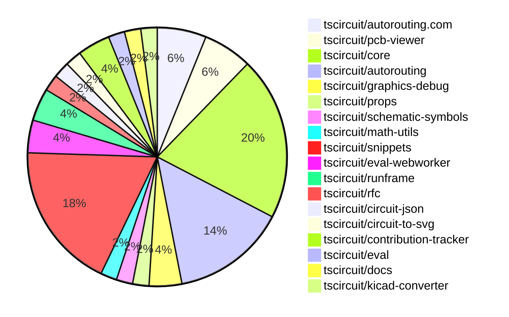

# Contribution Overview 2025-01-08

## PRs by Repository

## Contributor Overview

| Contributor | 🐳 Major | 🐙 Minor | 🐌 Tiny | ⭐ | Issues Created |
|-------------|---------|---------|---------|-----|----------------|
| [seveibar](#seveibar) | 5 | 21 | 3 | 👑👑👑 | 48 |
| [Anshgrover23](#Anshgrover23) | 2 | 10 | 0 | ⭐⭐⭐ | 7 |
| [Abse2001](#Abse2001) | 1 | 1 | 0 | ⭐⭐ | 4 |
| [ShiboSoftwareDev](#ShiboSoftwareDev) | 0 | 1 | 0 | ⭐⭐ | 11 |
| [techmannih](#techmannih) | 1 | 3 | 0 | ⭐ | 2 |
| [imrishabh18](#imrishabh18) | 0 | 1 | 0 |  | 5 |

## Review Table

[reviews-received-hover]: ## "Number of reviews received for PRs for this contributor"
[approvals-received-hover]: ## "Number of approvals received for PRs this contributor authored"
[rejections-received-hover]: ## "Number of rejections received for PRs this contributor authored"
[prs-opened-hover]: ## "Number of PRs opened by this contributor"
[issues-created-hover]: ## "Number of issues created by this contributor"
[bountied-issues-hover]: ## "Number of issues this contributor created with a bounty"
[bountied-issue-$-hover]: ## "Total bounty amount placed on issues authored by this contributor"

| Contributor | Reviews Received | Approvals Received | Rejections Received | Approvals | Rejections | PRs Opened | PRs Merged | Issues Created | Bountied Issues | Bountied Issue $ |
|---|---|---|---|---|---|---|---|---|---|---|
| [Abse2001](#Abse2001) | 10 | 2 | 0 | 4 | 5 | 3 | 2 | 4 | 1 | 10 |
| [seveibar](#seveibar) | 0 | 0 | 0 | 19 | 5 | 33 | 29 | 48 | 29 | 290 |
| [techmannih](#techmannih) | 17 | 7 | 4 | 0 | 0 | 8 | 4 | 2 | 0 | 0 |
| [Anshgrover23](#Anshgrover23) | 38 | 14 | 6 | 0 | 4 | 12 | 12 | 7 | 1 | 2 |
| [chaadiic](#chaadiic) | 1 | 0 | 1 | 0 | 0 | 1 | 0 | 0 | 0 | 0 |
| [kom-senapati](#kom-senapati) | 1 | 0 | 1 | 0 | 0 | 1 | 0 | 1 | 0 | 0 |
| [imrishabh18](#imrishabh18) | 0 | 0 | 0 | 1 | 0 | 1 | 1 | 5 | 0 | 0 |
| [ShiboSoftwareDev](#ShiboSoftwareDev) | 2 | 1 | 0 | 1 | 0 | 5 | 1 | 11 | 3 | 55 |
| [bhuvan-crypto](#bhuvan-crypto) | 2 | 0 | 2 | 0 | 0 | 1 | 0 | 0 | 0 | 0 |
| [devin-ai-integration[bot]](#devin-ai-integration[bot]) | 0 | 0 | 0 | 0 | 0 | 1 | 0 | 0 | 0 | 0 |
| [DevGajjar28](#DevGajjar28) | 1 | 1 | 0 | 0 | 0 | 1 | 0 | 0 | 0 | 0 |

## Changes by Repository

### [tscircuit/autorouting.com](https://github.com/tscircuit/autorouting.com)

| PR # | Impact | Contributor | Description |
|------|--------|-------------|-------------|
| [#21](https://github.com/tscircuit/autorouting.com/pull/21) | 🐳 Major | Abse2001 | Adds a command-line interface (CLI) feature to download a dataset from the platform to the local filesystem. |
| [#14](https://github.com/tscircuit/autorouting.com/pull/14) | 🐙 Minor | seveibar | Reverts the addition of the main logo animation. |
| [#16](https://github.com/tscircuit/autorouting.com/pull/16) | 🐙 Minor | Anshgrover23 | Adds an autorouting animation to the main page. |

### [tscircuit/pcb-viewer](https://github.com/tscircuit/pcb-viewer)

| PR # | Impact | Contributor | Description |
|------|--------|-------------|-------------|
| [#114](https://github.com/tscircuit/pcb-viewer/pull/114) | 🐙 Minor | Abse2001 | Adds a performance test for the contribution board feature. |
| [#122](https://github.com/tscircuit/pcb-viewer/pull/122) | 🐙 Minor | seveibar | Update the `use-mouse-matrix-transform` dependency to version 1.3.0 for better ESM compatibility. |
| [#121](https://github.com/tscircuit/pcb-viewer/pull/121) | 🐙 Minor | seveibar | Change the build script to target the browser platform, removing the import of the `webcrypto` module. |

### [tscircuit/core](https://github.com/tscircuit/core)

| PR # | Impact | Contributor | Description |
|------|--------|-------------|-------------|
| [#503](https://github.com/tscircuit/core/pull/503) | 🐳 Major | seveibar | Allows the same pin to have multiple net labels. |
| [#499](https://github.com/tscircuit/core/pull/499) | 🐳 Major | seveibar | Introduce schematic trace shortcuts and optimize margins |
| [#509](https://github.com/tscircuit/core/pull/509) | 🐳 Major | techmannih | Fixes a bug in the `createSchematicTraceJunctions` function to correctly calculate the intersection point for non-orthogonal edges. |
| [#506](https://github.com/tscircuit/core/pull/506) | 🐙 Minor | seveibar | Fix and repro for NaN in schematic trace, minor refactor |
| [#501](https://github.com/tscircuit/core/pull/501) | 🐙 Minor | seveibar | Attempt to catch an infinite loop case that is crashing some circuits by throwing an error after 2000 iterations in the `createSchematicTraceCrossingSegments` function. |
| [#492](https://github.com/tscircuit/core/pull/492) | 🐙 Minor | seveibar | Refactors the schematic autorouter obstacles handling for a trace, moving the logic into a separate function. |
| [#489](https://github.com/tscircuit/core/pull/489) | 🐙 Minor | seveibar | Don't do PcbRouteNetIslands when routingDisabled, and export types from Renderable |
| [#515](https://github.com/tscircuit/core/pull/515) | 🐙 Minor | Anshgrover23 | Fix a bug where capacitors don't render with a schematic rotation of negative angles. |
| [#511](https://github.com/tscircuit/core/pull/511) | 🐙 Minor | Anshgrover23 | Adds the ability to use `React.createElement` directly without importing `React` explicitly. |
| [#514](https://github.com/tscircuit/core/pull/514) | 🐙 Minor | imrishabh18 | Introduces a new error message for the `schRotation` prop when it is not a multiple of 90 degrees. |

### [tscircuit/autorouting](https://github.com/tscircuit/autorouting)

| PR # | Impact | Contributor | Description |
|------|--------|-------------|-------------|
| [#108](https://github.com/tscircuit/autorouting/pull/108) | 🐳 Major | seveibar | Rewrite the `shortenPathWithShortcuts` function for clarity around the handling of cases without `T` projection, and fix edge cases where the wrong shortcut was selected. |
| [#105](https://github.com/tscircuit/autorouting/pull/105) | 🐳 Major | seveibar | Fixes a bug in the multilayer autorouter where it was not handling collisions properly when shortening paths. |
| [#107](https://github.com/tscircuit/autorouting/pull/107) | 🐙 Minor | seveibar | Improves the debugging of paths and fixes an issue with shortcuts not working. |
| [#106](https://github.com/tscircuit/autorouting/pull/106) | 🐙 Minor | seveibar | Adds more rectangles to the SVG image, likely for debugging or visualization purposes. |
| [#104](https://github.com/tscircuit/autorouting/pull/104) | 🐙 Minor | seveibar | Fixes a bug with path collisions for simplifying paths. |
| [#103](https://github.com/tscircuit/autorouting/pull/103) | 🐙 Minor | seveibar | Add support for Shorten Path with Shortcuts |
| [#109](https://github.com/tscircuit/autorouting/pull/109) | 🐌 Tiny | seveibar | Adds fallback handling for the `MAX_ITERATIONS` option in the `MultilayerIjump` class, ensuring it has a default value. |

### [tscircuit/graphics-debug](https://github.com/tscircuit/graphics-debug)

| PR # | Impact | Contributor | Description |
|------|--------|-------------|-------------|
| [#12](https://github.com/tscircuit/graphics-debug/pull/12) | 🐳 Major | seveibar | Fix the cartesian coordinate system in the SVG rendering |
| [#14](https://github.com/tscircuit/graphics-debug/pull/14) | 🐙 Minor | Anshgrover23 | Adds support for specifying the stroke color and width of lines in the graphics object. |

### [tscircuit/props](https://github.com/tscircuit/props)

| PR # | Impact | Contributor | Description |
|------|--------|-------------|-------------|
| [#145](https://github.com/tscircuit/props/pull/145) | 🐙 Minor | seveibar | Add a new configuration option `subcircuit.schTraceAutoLabelEnabled` to enable/disable automatic net labeling for complex traces. |

### [tscircuit/schematic-symbols](https://github.com/tscircuit/schematic-symbols)

| PR # | Impact | Contributor | Description |
|------|--------|-------------|-------------|
| [#232](https://github.com/tscircuit/schematic-symbols/pull/232) | 🐙 Minor | seveibar | Automatically computes the size of resistor and capacitor symbols based on the bounds of their primitives. |

### [tscircuit/math-utils](https://github.com/tscircuit/math-utils)

| PR # | Impact | Contributor | Description |
|------|--------|-------------|-------------|
| [#4](https://github.com/tscircuit/math-utils/pull/4) | 🐙 Minor | seveibar | Adds row and column properties to the GridCellPositions type. |

### [tscircuit/snippets](https://github.com/tscircuit/snippets)

| PR # | Impact | Contributor | Description |
|------|--------|-------------|-------------|
| [#515](https://github.com/tscircuit/snippets/pull/515) | 🐙 Minor | seveibar | Add `@tscircuit/math-utils` as a pre-supplied import |
| [#506](https://github.com/tscircuit/snippets/pull/506) | 🐙 Minor | seveibar | Updates the pcb-viewer package version and fixes the handling of alternate registry when there is a CORS issue. |
| [#505](https://github.com/tscircuit/snippets/pull/505) | 🐙 Minor | seveibar | Adds retry functionality with an alternate registry server when the primary server returns a 413 error. |
| [#503](https://github.com/tscircuit/snippets/pull/503) | 🐙 Minor | seveibar | Adds a fallback to re-request to a non-Vercel URL for large payloads when the initial request fails due to payload size. |
| [#518](https://github.com/tscircuit/snippets/pull/518) | 🐙 Minor | techmannih | Fixes the star button functionality by handling both star and unstar actions and updating the UI accordingly. |
| [#528](https://github.com/tscircuit/snippets/pull/528) | 🐙 Minor | Anshgrover23 | Fixes an issue where a user's changes are dropped when they hit the "fork" button in the editor. |
| [#514](https://github.com/tscircuit/snippets/pull/514) | 🐙 Minor | Anshgrover23 | Add `kicad-pro` file to the KiCad project. |
| [#531](https://github.com/tscircuit/snippets/pull/531) | 🐙 Minor | ShiboSoftwareDev | Improve site performance by lazy-loading page components and adding error handling |
| [#512](https://github.com/tscircuit/snippets/pull/512) | 🐌 Tiny | seveibar | Reorder the AUTOLOAD_SNIPPETS environment variable in the "dev" script to be after the "build:fake-api" command. |

### [tscircuit/eval-webworker](https://github.com/tscircuit/eval-webworker)

| PR # | Impact | Contributor | Description |
|------|--------|-------------|-------------|
| [#72](https://github.com/tscircuit/eval-webworker/pull/72) | 🐙 Minor | seveibar | Update the `@tscircuit/core` dependency to version `0.0.261` to fix a NaN issue. |
| [#71](https://github.com/tscircuit/eval-webworker/pull/71) | 🐙 Minor | Anshgrover23 | Adds a `clearEventListeners()` function to the `CircuitWebWorker` interface and implementation to allow clearing all event listeners registered on the circuit. |

### [tscircuit/runframe](https://github.com/tscircuit/runframe)

| PR # | Impact | Contributor | Description |
|------|--------|-------------|-------------|
| [#111](https://github.com/tscircuit/runframe/pull/111) | 🐙 Minor | seveibar |  |
| [#108](https://github.com/tscircuit/runframe/pull/108) | 🐙 Minor | seveibar | Add a new "Render Log" tab to display performance information about the rendering process. |

### [tscircuit/rfc](https://github.com/tscircuit/rfc)

| PR # | Impact | Contributor | Description |
|------|--------|-------------|-------------|
| [#3](https://github.com/tscircuit/rfc/pull/3) | 🐌 Tiny | seveibar | Add a .gitignore file for the 2025-01-10-registry-bundling-and-transpilation directory. |

### [tscircuit/circuit-json](https://github.com/tscircuit/circuit-json)

| PR # | Impact | Contributor | Description |
|------|--------|-------------|-------------|
| [#120](https://github.com/tscircuit/circuit-json/pull/120) | 🐙 Minor | techmannih | Adds a new shape (pill) for SMT pads in the PCB module. |

### [tscircuit/circuit-to-svg](https://github.com/tscircuit/circuit-to-svg)

| PR # | Impact | Contributor | Description |
|------|--------|-------------|-------------|
| [#163](https://github.com/tscircuit/circuit-to-svg/pull/163) | 🐙 Minor | techmannih | Add support for pill-shaped SMT pads in the circuit JSON specification. |

### [tscircuit/contribution-tracker](https://github.com/tscircuit/contribution-tracker)

| PR # | Impact | Contributor | Description |
|------|--------|-------------|-------------|
| [#30](https://github.com/tscircuit/contribution-tracker/pull/30) | 🐳 Major | Anshgrover23 | Adds a cache to the Anthropic SDK and uses it in the `analyzePRWithClaude` function. |
| [#28](https://github.com/tscircuit/contribution-tracker/pull/28) | 🐙 Minor | Anshgrover23 | Implement caching for markdown generation to improve performance |

### [tscircuit/eval](https://github.com/tscircuit/eval)

| PR # | Impact | Contributor | Description |
|------|--------|-------------|-------------|
| [#3](https://github.com/tscircuit/eval/pull/3) | 🐳 Major | Anshgrover23 | Introduces a new CircuitEvaluator class and updates the GitHub Actions workflows to run tests and type checks using Bun. |

### [tscircuit/docs](https://github.com/tscircuit/docs)

| PR # | Impact | Contributor | Description |
|------|--------|-------------|-------------|
| [#53](https://github.com/tscircuit/docs/pull/53) | 🐙 Minor | Anshgrover23 | Add new components (transistor, inductor, LED, modified trace, and power source) and update the corresponding documentation. |

### [tscircuit/kicad-converter](https://github.com/tscircuit/kicad-converter)

| PR # | Impact | Contributor | Description |
|------|--------|-------------|-------------|
| [#12](https://github.com/tscircuit/kicad-converter/pull/12) | 🐙 Minor | Anshgrover23 | Add `kicad-pro` to the index file to enable the `kicad_project` download feature. |

## Changes by Contributor

### [Abse2001](https://github.com/Abse2001)

| PR # | Impact | Description |
|------|--------|-------------|
| [#21](https://github.com/tscircuit/autorouting.com/pull/21) | 🐳 Major | Adds a command-line interface (CLI) feature to download a dataset from the platform to the local filesystem. |
| [#114](https://github.com/tscircuit/pcb-viewer/pull/114) | 🐙 Minor | Adds a performance test for the contribution board feature. |

### [seveibar](https://github.com/seveibar)

| PR # | Impact | Description |
|------|--------|-------------|
| [#503](https://github.com/tscircuit/core/pull/503) | 🐳 Major | Allows the same pin to have multiple net labels. |
| [#499](https://github.com/tscircuit/core/pull/499) | 🐳 Major | Introduce schematic trace shortcuts and optimize margins |
| [#108](https://github.com/tscircuit/autorouting/pull/108) | 🐳 Major | Rewrite the `shortenPathWithShortcuts` function for clarity around the handling of cases without `T` projection, and fix edge cases where the wrong shortcut was selected. |
| [#105](https://github.com/tscircuit/autorouting/pull/105) | 🐳 Major | Fixes a bug in the multilayer autorouter where it was not handling collisions properly when shortening paths. |
| [#12](https://github.com/tscircuit/graphics-debug/pull/12) | 🐳 Major | Fix the cartesian coordinate system in the SVG rendering |
| [#122](https://github.com/tscircuit/pcb-viewer/pull/122) | 🐙 Minor | Update the `use-mouse-matrix-transform` dependency to version 1.3.0 for better ESM compatibility. |
| [#121](https://github.com/tscircuit/pcb-viewer/pull/121) | 🐙 Minor | Change the build script to target the browser platform, removing the import of the `webcrypto` module. |
| [#145](https://github.com/tscircuit/props/pull/145) | 🐙 Minor | Add a new configuration option `subcircuit.schTraceAutoLabelEnabled` to enable/disable automatic net labeling for complex traces. |
| [#506](https://github.com/tscircuit/core/pull/506) | 🐙 Minor | Fix and repro for NaN in schematic trace, minor refactor |
| [#501](https://github.com/tscircuit/core/pull/501) | 🐙 Minor | Attempt to catch an infinite loop case that is crashing some circuits by throwing an error after 2000 iterations in the `createSchematicTraceCrossingSegments` function. |
| [#492](https://github.com/tscircuit/core/pull/492) | 🐙 Minor | Refactors the schematic autorouter obstacles handling for a trace, moving the logic into a separate function. |
| [#489](https://github.com/tscircuit/core/pull/489) | 🐙 Minor | Don't do PcbRouteNetIslands when routingDisabled, and export types from Renderable |
| [#107](https://github.com/tscircuit/autorouting/pull/107) | 🐙 Minor | Improves the debugging of paths and fixes an issue with shortcuts not working. |
| [#106](https://github.com/tscircuit/autorouting/pull/106) | 🐙 Minor | Adds more rectangles to the SVG image, likely for debugging or visualization purposes. |
| [#104](https://github.com/tscircuit/autorouting/pull/104) | 🐙 Minor | Fixes a bug with path collisions for simplifying paths. |
| [#103](https://github.com/tscircuit/autorouting/pull/103) | 🐙 Minor | Add support for Shorten Path with Shortcuts |
| [#14](https://github.com/tscircuit/autorouting.com/pull/14) | 🐙 Minor | Reverts the addition of the main logo animation. |
| [#232](https://github.com/tscircuit/schematic-symbols/pull/232) | 🐙 Minor | Automatically computes the size of resistor and capacitor symbols based on the bounds of their primitives. |
| [#4](https://github.com/tscircuit/math-utils/pull/4) | 🐙 Minor | Adds row and column properties to the GridCellPositions type. |
| [#515](https://github.com/tscircuit/snippets/pull/515) | 🐙 Minor | Add `@tscircuit/math-utils` as a pre-supplied import |
| [#506](https://github.com/tscircuit/snippets/pull/506) | 🐙 Minor | Updates the pcb-viewer package version and fixes the handling of alternate registry when there is a CORS issue. |
| [#505](https://github.com/tscircuit/snippets/pull/505) | 🐙 Minor | Adds retry functionality with an alternate registry server when the primary server returns a 413 error. |
| [#503](https://github.com/tscircuit/snippets/pull/503) | 🐙 Minor | Adds a fallback to re-request to a non-Vercel URL for large payloads when the initial request fails due to payload size. |
| [#72](https://github.com/tscircuit/eval-webworker/pull/72) | 🐙 Minor | Update the `@tscircuit/core` dependency to version `0.0.261` to fix a NaN issue. |
| [#111](https://github.com/tscircuit/runframe/pull/111) | 🐙 Minor |  |
| [#108](https://github.com/tscircuit/runframe/pull/108) | 🐙 Minor | Add a new "Render Log" tab to display performance information about the rendering process. |
| [#3](https://github.com/tscircuit/rfc/pull/3) | 🐌 Tiny | Add a .gitignore file for the 2025-01-10-registry-bundling-and-transpilation directory. |
| [#109](https://github.com/tscircuit/autorouting/pull/109) | 🐌 Tiny | Adds fallback handling for the `MAX_ITERATIONS` option in the `MultilayerIjump` class, ensuring it has a default value. |
| [#512](https://github.com/tscircuit/snippets/pull/512) | 🐌 Tiny | Reorder the AUTOLOAD_SNIPPETS environment variable in the "dev" script to be after the "build:fake-api" command. |

### [techmannih](https://github.com/techmannih)

| PR # | Impact | Description |
|------|--------|-------------|
| [#509](https://github.com/tscircuit/core/pull/509) | 🐳 Major | Fixes a bug in the `createSchematicTraceJunctions` function to correctly calculate the intersection point for non-orthogonal edges. |
| [#120](https://github.com/tscircuit/circuit-json/pull/120) | 🐙 Minor | Adds a new shape (pill) for SMT pads in the PCB module. |
| [#163](https://github.com/tscircuit/circuit-to-svg/pull/163) | 🐙 Minor | Add support for pill-shaped SMT pads in the circuit JSON specification. |
| [#518](https://github.com/tscircuit/snippets/pull/518) | 🐙 Minor | Fixes the star button functionality by handling both star and unstar actions and updating the UI accordingly. |

### [Anshgrover23](https://github.com/Anshgrover23)

| PR # | Impact | Description |
|------|--------|-------------|
| [#30](https://github.com/tscircuit/contribution-tracker/pull/30) | 🐳 Major | Adds a cache to the Anthropic SDK and uses it in the `analyzePRWithClaude` function. |
| [#3](https://github.com/tscircuit/eval/pull/3) | 🐳 Major | Introduces a new CircuitEvaluator class and updates the GitHub Actions workflows to run tests and type checks using Bun. |
| [#53](https://github.com/tscircuit/docs/pull/53) | 🐙 Minor | Add new components (transistor, inductor, LED, modified trace, and power source) and update the corresponding documentation. |
| [#515](https://github.com/tscircuit/core/pull/515) | 🐙 Minor | Fix a bug where capacitors don't render with a schematic rotation of negative angles. |
| [#511](https://github.com/tscircuit/core/pull/511) | 🐙 Minor | Adds the ability to use `React.createElement` directly without importing `React` explicitly. |
| [#28](https://github.com/tscircuit/contribution-tracker/pull/28) | 🐙 Minor | Implement caching for markdown generation to improve performance |
| [#16](https://github.com/tscircuit/autorouting.com/pull/16) | 🐙 Minor | Adds an autorouting animation to the main page. |
| [#12](https://github.com/tscircuit/kicad-converter/pull/12) | 🐙 Minor | Add `kicad-pro` to the index file to enable the `kicad_project` download feature. |
| [#528](https://github.com/tscircuit/snippets/pull/528) | 🐙 Minor | Fixes an issue where a user's changes are dropped when they hit the "fork" button in the editor. |
| [#514](https://github.com/tscircuit/snippets/pull/514) | 🐙 Minor | Add `kicad-pro` file to the KiCad project. |
| [#14](https://github.com/tscircuit/graphics-debug/pull/14) | 🐙 Minor | Adds support for specifying the stroke color and width of lines in the graphics object. |
| [#71](https://github.com/tscircuit/eval-webworker/pull/71) | 🐙 Minor | Adds a `clearEventListeners()` function to the `CircuitWebWorker` interface and implementation to allow clearing all event listeners registered on the circuit. |

### [imrishabh18](https://github.com/imrishabh18)

| PR # | Impact | Description |
|------|--------|-------------|
| [#514](https://github.com/tscircuit/core/pull/514) | 🐙 Minor | Introduces a new error message for the `schRotation` prop when it is not a multiple of 90 degrees. |

### [ShiboSoftwareDev](https://github.com/ShiboSoftwareDev)

| PR # | Impact | Description |
|------|--------|-------------|
| [#531](https://github.com/tscircuit/snippets/pull/531) | 🐙 Minor | Improve site performance by lazy-loading page components and adding error handling |

