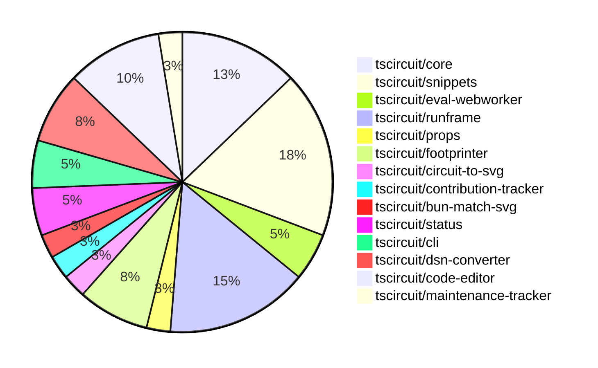

# Contribution Overview 2025-01-15

## PRs by Repository

## Contributor Overview

| Contributor | 🐳 Major | 🐙 Minor | 🐌 Tiny | ⭐ | Issues Created |
|-------------|---------|---------|---------|-----|----------------|
| [seveibar](#seveibar) | 5 | 7 | 1 | 👑 | 55 |
| [imrishabh18](#imrishabh18) | 6 | 2 | 0 | ⭐⭐⭐ | 1 |
| [Anshgrover23](#Anshgrover23) | 0 | 4 | 0 | ⭐⭐ | 1 |
| [ShiboSoftwareDev](#ShiboSoftwareDev) | 0 | 4 | 0 | ⭐⭐ | 2 |
| [techmannih](#techmannih) | 0 | 4 | 0 | ⭐ | 0 |
| [kom-senapati](#kom-senapati) | 0 | 4 | 0 | ⭐ | 1 |
| [ArnavK-09](#ArnavK-09) | 0 | 1 | 0 |  | 2 |
| [Ayushjhawar8](#Ayushjhawar8) | 0 | 0 | 1 |  | 0 |

## Review Table

[reviews-received-hover]: ## "Number of reviews received for PRs for this contributor"
[approvals-received-hover]: ## "Number of approvals received for PRs this contributor authored"
[rejections-received-hover]: ## "Number of rejections received for PRs this contributor authored"
[prs-opened-hover]: ## "Number of PRs opened by this contributor"
[issues-created-hover]: ## "Number of issues created by this contributor"
[bountied-issues-hover]: ## "Number of issues this contributor created with a bounty"
[bountied-issue-$-hover]: ## "Total bounty amount placed on issues authored by this contributor"

| Contributor | Reviews Received | Approvals Received | Rejections Received | Approvals | Rejections | PRs Opened | PRs Merged | Issues Created | Bountied Issues | Bountied Issue $ |
|---|---|---|---|---|---|---|---|---|---|---|
| [kom-senapati](#kom-senapati) | 7 | 4 | 2 | 0 | 0 | 5 | 4 | 1 | 0 | 0 |
| [seveibar](#seveibar) | 2 | 0 | 0 | 19 | 11 | 18 | 13 | 55 | 43 | 740 |
| [krushnarout](#krushnarout) | 8 | 0 | 1 | 0 | 0 | 1 | 0 | 0 | 0 | 0 |
| [imrishabh18](#imrishabh18) | 0 | 0 | 0 | 2 | 7 | 8 | 8 | 1 | 1 | 5 |
| [techmannih](#techmannih) | 20 | 6 | 8 | 0 | 0 | 6 | 4 | 0 | 0 | 0 |
| [ShiboSoftwareDev](#ShiboSoftwareDev) | 8 | 3 | 0 | 1 | 1 | 5 | 4 | 2 | 2 | 20 |
| [Ayushjhawar8](#Ayushjhawar8) | 4 | 1 | 2 | 0 | 0 | 2 | 1 | 0 | 0 | 0 |
| [Anshgrover23](#Anshgrover23) | 15 | 5 | 4 | 0 | 5 | 6 | 4 | 1 | 1 | 10 |
| [Abse2001](#Abse2001) | 2 | 1 | 0 | 0 | 1 | 1 | 0 | 3 | 3 | 20 |
| [Saurabhsing21](#Saurabhsing21) | 6 | 1 | 3 | 0 | 0 | 1 | 0 | 0 | 0 | 0 |
| [ArnavK-09](#ArnavK-09) | 1 | 1 | 0 | 0 | 0 | 2 | 1 | 2 | 0 | 0 |
| [B-Mustafa](#B-Mustafa) | 2 | 0 | 2 | 0 | 0 | 1 | 0 | 0 | 0 | 0 |
| [yashksaini-coder](#yashksaini-coder) | 9 | 0 | 3 | 0 | 0 | 1 | 0 | 0 | 0 | 0 |

## Changes by Repository

### [tscircuit/core](https://github.com/tscircuit/core)

| PR # | Impact | Contributor | Description |
|------|--------|-------------|-------------|
| [#533](https://github.com/tscircuit/core/pull/533) | 🐳 Major | seveibar | Adds support for React 18 by using a different reconciler implementation. |
| [#531](https://github.com/tscircuit/core/pull/531) | 🐳 Major | seveibar | Introduces a benchmarking server and a benchmark circuit for testing the performance of the @tscircuit/core library. |
| [#532](https://github.com/tscircuit/core/pull/532) | 🐳 Major | seveibar | Updates the project to use React 19. |
| [#523](https://github.com/tscircuit/core/pull/523) | 🐳 Major | seveibar | Fixes an infinite loop issue in the creation of schematic trace crossing segments. |
| [#527](https://github.com/tscircuit/core/pull/527) | 🐙 Minor | techmannih | Automatically add net labels when a chip-to-chip trace is detected |

### [tscircuit/snippets](https://github.com/tscircuit/snippets)

| PR # | Impact | Contributor | Description |
|------|--------|-------------|-------------|
| [#578](https://github.com/tscircuit/snippets/pull/578) | 🐳 Major | seveibar | Set up GitHub Actions workflow to publish the fake snippets API to npm |
| [#571](https://github.com/tscircuit/snippets/pull/571) | 🐳 Major | imrishabh18 | Revert the update of the `@tscircuit/3d-viewer` dependency to version `^0.0.95` because it broke the code editor page. |
| [#585](https://github.com/tscircuit/snippets/pull/585) | 🐙 Minor | ShiboSoftwareDev | Updated the footprint dialog component to use the `getFootprintNamesByType()` function to get the list of footprint names to display in the dropdown. |
| [#552](https://github.com/tscircuit/snippets/pull/552) | 🐙 Minor | techmannih | Fixes the issue where fork errors were not being shown to the user. |
| [#574](https://github.com/tscircuit/snippets/pull/574) | 🐙 Minor | techmannih | Improved error message for 3D model download when 3D viewer is not open |
| [#583](https://github.com/tscircuit/snippets/pull/583) | 🐙 Minor | ArnavK-09 | Adds support for generating assembly images for code snippets. |
| [#575](https://github.com/tscircuit/snippets/pull/575) | 🐙 Minor | Anshgrover23 | Fixes the GLTF downloader to download the file in the correct format (.glb or .gltf) based on the options. |

### [tscircuit/eval-webworker](https://github.com/tscircuit/eval-webworker)

| PR # | Impact | Contributor | Description |
|------|--------|-------------|-------------|
| [#78](https://github.com/tscircuit/eval-webworker/pull/78) | 🐙 Minor | seveibar | Update the code to use a CJS bundle registry instead of the previous snippets API. |
| [#81](https://github.com/tscircuit/eval-webworker/pull/81) | 🐙 Minor | Anshgrover23 | Adds a `.kill()` function to the web worker to immediately terminate the worker. |

### [tscircuit/runframe](https://github.com/tscircuit/runframe)

| PR # | Impact | Contributor | Description |
|------|--------|-------------|-------------|
| [#159](https://github.com/tscircuit/runframe/pull/159) | 🐙 Minor | seveibar | Adds an empty state for the render log viewer and updates the eval webworker to support math-utils, allowing progress to be shown even when the render logs tab isn't open. |
| [#157](https://github.com/tscircuit/runframe/pull/157) | 🐙 Minor | seveibar | Adds empty state for render log viewer and shows progress even if not on the render log page. |
| [#154](https://github.com/tscircuit/runframe/pull/154) | 🐙 Minor | seveibar | Fix PCB Viewer to update whenever circuit JSON changes, and fix re-running without run button |
| [#150](https://github.com/tscircuit/runframe/pull/150) | 🐙 Minor | seveibar | Add support for showing the run button in the example7-large-led-matrix.fixture.tsx file. |
| [#149](https://github.com/tscircuit/runframe/pull/149) | 🐙 Minor | seveibar | Add Tailwind prefix, improve build system in dev, fix minor spacing and circuit JSON viewer issues. |
| [#139](https://github.com/tscircuit/runframe/pull/139) | 🐙 Minor | seveibar | Adds a new component RenderTimingsBar to display a bar chart of render phase timings, and allows sorting the render log view by phase order or duration. |

### [tscircuit/props](https://github.com/tscircuit/props)

| PR # | Impact | Contributor | Description |
|------|--------|-------------|-------------|
| [#146](https://github.com/tscircuit/props/pull/146) | 🐌 Tiny | seveibar | Add `key` prop to the `GroupProps` interface and the `baseGroupProps` object. |

### [tscircuit/footprinter](https://github.com/tscircuit/footprinter)

| PR # | Impact | Contributor | Description |
|------|--------|-------------|-------------|
| [#113](https://github.com/tscircuit/footprinter/pull/113) | 🐙 Minor | ShiboSoftwareDev | Adds a new function `getFootprintSizes` that returns the supported footprint sizes. |
| [#112](https://github.com/tscircuit/footprinter/pull/112) | 🐙 Minor | ShiboSoftwareDev | Rename the property names in the `getFootprintNamesByType` function from `passiveFootprints` and `normalFootprints` to `passiveFootprintNames` and `normalFootprintNames` respectively. |
| [#111](https://github.com/tscircuit/footprinter/pull/111) | 🐙 Minor | ShiboSoftwareDev | Adds a new function `getFootprintNamesByType` that returns an object with two arrays: `passiveFootprints` and `normalFootprints`, which separate the footprint names based on their component type. |

### [tscircuit/circuit-to-svg](https://github.com/tscircuit/circuit-to-svg)

| PR # | Impact | Contributor | Description |
|------|--------|-------------|-------------|
| [#161](https://github.com/tscircuit/circuit-to-svg/pull/161) | 🐙 Minor | techmannih | Fixes an issue with the transparency of the label point in the schematic SVG rendering. |

### [tscircuit/contribution-tracker](https://github.com/tscircuit/contribution-tracker)

| PR # | Impact | Contributor | Description |
|------|--------|-------------|-------------|
| [#36](https://github.com/tscircuit/contribution-tracker/pull/36) | 🐌 Tiny | Ayushjhawar8 | Change "Approvals" to "Approval sent" in the README.md file. |

### [tscircuit/bun-match-svg](https://github.com/tscircuit/bun-match-svg)

| PR # | Impact | Contributor | Description |
|------|--------|-------------|-------------|
| [#7](https://github.com/tscircuit/bun-match-svg/pull/7) | 🐙 Minor | kom-senapati | Fixes an issue related to the `init` command by removing unnecessary imports and arguments. |

### [tscircuit/status](https://github.com/tscircuit/status)

| PR # | Impact | Contributor | Description |
|------|--------|-------------|-------------|
| [#12](https://github.com/tscircuit/status/pull/12) | 🐙 Minor | kom-senapati | Use the last check in the uptime graph component instead of the first check |
| [#10](https://github.com/tscircuit/status/pull/10) | 🐙 Minor | kom-senapati | Introduces a status check for the "registry and bundling" endpoints, ensuring the health of the ESM, CJS, and NPM services. |

### [tscircuit/cli](https://github.com/tscircuit/cli)

| PR # | Impact | Contributor | Description |
|------|--------|-------------|-------------|
| [#22](https://github.com/tscircuit/cli/pull/22) | 🐙 Minor | kom-senapati | Introduces a simple test fixture for CLI and tsci init test |
| [#25](https://github.com/tscircuit/cli/pull/25) | 🐙 Minor | Anshgrover23 | Add alias for `tsci auth login` -> `tsci login` |

### [tscircuit/dsn-converter](https://github.com/tscircuit/dsn-converter)

| PR # | Impact | Contributor | Description |
|------|--------|-------------|-------------|
| [#78](https://github.com/tscircuit/dsn-converter/pull/78) | 🐳 Major | imrishabh18 | Fixes an issue where subcircuits with the same component name (e.g. "R1", "C1") were not being properly identified and connected. |
| [#80](https://github.com/tscircuit/dsn-converter/pull/80) | 🐙 Minor | imrishabh18 | Fix the plated_hole naming |
| [#79](https://github.com/tscircuit/dsn-converter/pull/79) | 🐙 Minor | imrishabh18 | Fix trace linkage issue in DSN to CircuitJSON conversion. |

### [tscircuit/code-editor](https://github.com/tscircuit/code-editor)

| PR # | Impact | Contributor | Description |
|------|--------|-------------|-------------|
| [#8](https://github.com/tscircuit/code-editor/pull/8) | 🐳 Major | imrishabh18 | Adds support for TypeScript compiler initialization in the browser and a new `TsCodeEditorProps` interface. |
| [#7](https://github.com/tscircuit/code-editor/pull/7) | 🐳 Major | imrishabh18 | Introduces state management, formats the code using Prettier, and ports the UI from snippets. |
| [#6](https://github.com/tscircuit/code-editor/pull/6) | 🐳 Major | imrishabh18 | Introduces a basic code editor with Cosmos and Vite integrated, along with Twind for styling. |
| [#4](https://github.com/tscircuit/code-editor/pull/4) | 🐳 Major | imrishabh18 | This pull request sets up the basic project structure, including GitHub workflow configurations for building, testing, and type checking the project using the Bun runtime, as well as a .gitignore file and a Biome configuration for code formatting and linting. |

### [tscircuit/maintenance-tracker](https://github.com/tscircuit/maintenance-tracker)

| PR # | Impact | Contributor | Description |
|------|--------|-------------|-------------|
| [#6](https://github.com/tscircuit/maintenance-tracker/pull/6) | 🐙 Minor | Anshgrover23 |  |

## Changes by Contributor

### [seveibar](https://github.com/seveibar)

| PR # | Impact | Description |
|------|--------|-------------|
| [#533](https://github.com/tscircuit/core/pull/533) | 🐳 Major | Adds support for React 18 by using a different reconciler implementation. |
| [#531](https://github.com/tscircuit/core/pull/531) | 🐳 Major | Introduces a benchmarking server and a benchmark circuit for testing the performance of the @tscircuit/core library. |
| [#532](https://github.com/tscircuit/core/pull/532) | 🐳 Major | Updates the project to use React 19. |
| [#523](https://github.com/tscircuit/core/pull/523) | 🐳 Major | Fixes an infinite loop issue in the creation of schematic trace crossing segments. |
| [#578](https://github.com/tscircuit/snippets/pull/578) | 🐳 Major | Set up GitHub Actions workflow to publish the fake snippets API to npm |
| [#78](https://github.com/tscircuit/eval-webworker/pull/78) | 🐙 Minor | Update the code to use a CJS bundle registry instead of the previous snippets API. |
| [#159](https://github.com/tscircuit/runframe/pull/159) | 🐙 Minor | Adds an empty state for the render log viewer and updates the eval webworker to support math-utils, allowing progress to be shown even when the render logs tab isn't open. |
| [#157](https://github.com/tscircuit/runframe/pull/157) | 🐙 Minor | Adds empty state for render log viewer and shows progress even if not on the render log page. |
| [#154](https://github.com/tscircuit/runframe/pull/154) | 🐙 Minor | Fix PCB Viewer to update whenever circuit JSON changes, and fix re-running without run button |
| [#150](https://github.com/tscircuit/runframe/pull/150) | 🐙 Minor | Add support for showing the run button in the example7-large-led-matrix.fixture.tsx file. |
| [#149](https://github.com/tscircuit/runframe/pull/149) | 🐙 Minor | Add Tailwind prefix, improve build system in dev, fix minor spacing and circuit JSON viewer issues. |
| [#139](https://github.com/tscircuit/runframe/pull/139) | 🐙 Minor | Adds a new component RenderTimingsBar to display a bar chart of render phase timings, and allows sorting the render log view by phase order or duration. |
| [#146](https://github.com/tscircuit/props/pull/146) | 🐌 Tiny | Add `key` prop to the `GroupProps` interface and the `baseGroupProps` object. |

### [ShiboSoftwareDev](https://github.com/ShiboSoftwareDev)

| PR # | Impact | Description |
|------|--------|-------------|
| [#113](https://github.com/tscircuit/footprinter/pull/113) | 🐙 Minor | Adds a new function `getFootprintSizes` that returns the supported footprint sizes. |
| [#112](https://github.com/tscircuit/footprinter/pull/112) | 🐙 Minor | Rename the property names in the `getFootprintNamesByType` function from `passiveFootprints` and `normalFootprints` to `passiveFootprintNames` and `normalFootprintNames` respectively. |
| [#111](https://github.com/tscircuit/footprinter/pull/111) | 🐙 Minor | Adds a new function `getFootprintNamesByType` that returns an object with two arrays: `passiveFootprints` and `normalFootprints`, which separate the footprint names based on their component type. |
| [#585](https://github.com/tscircuit/snippets/pull/585) | 🐙 Minor | Updated the footprint dialog component to use the `getFootprintNamesByType()` function to get the list of footprint names to display in the dropdown. |

### [techmannih](https://github.com/techmannih)

| PR # | Impact | Description |
|------|--------|-------------|
| [#527](https://github.com/tscircuit/core/pull/527) | 🐙 Minor | Automatically add net labels when a chip-to-chip trace is detected |
| [#161](https://github.com/tscircuit/circuit-to-svg/pull/161) | 🐙 Minor | Fixes an issue with the transparency of the label point in the schematic SVG rendering. |
| [#552](https://github.com/tscircuit/snippets/pull/552) | 🐙 Minor | Fixes the issue where fork errors were not being shown to the user. |
| [#574](https://github.com/tscircuit/snippets/pull/574) | 🐙 Minor | Improved error message for 3D model download when 3D viewer is not open |

### [Ayushjhawar8](https://github.com/Ayushjhawar8)

| PR # | Impact | Description |
|------|--------|-------------|
| [#36](https://github.com/tscircuit/contribution-tracker/pull/36) | 🐌 Tiny | Change "Approvals" to "Approval sent" in the README.md file. |

### [kom-senapati](https://github.com/kom-senapati)

| PR # | Impact | Description |
|------|--------|-------------|
| [#7](https://github.com/tscircuit/bun-match-svg/pull/7) | 🐙 Minor | Fixes an issue related to the `init` command by removing unnecessary imports and arguments. |
| [#12](https://github.com/tscircuit/status/pull/12) | 🐙 Minor | Use the last check in the uptime graph component instead of the first check |
| [#10](https://github.com/tscircuit/status/pull/10) | 🐙 Minor | Introduces a status check for the "registry and bundling" endpoints, ensuring the health of the ESM, CJS, and NPM services. |
| [#22](https://github.com/tscircuit/cli/pull/22) | 🐙 Minor | Introduces a simple test fixture for CLI and tsci init test |

### [imrishabh18](https://github.com/imrishabh18)

| PR # | Impact | Description |
|------|--------|-------------|
| [#78](https://github.com/tscircuit/dsn-converter/pull/78) | 🐳 Major | Fixes an issue where subcircuits with the same component name (e.g. "R1", "C1") were not being properly identified and connected. |
| [#571](https://github.com/tscircuit/snippets/pull/571) | 🐳 Major | Revert the update of the `@tscircuit/3d-viewer` dependency to version `^0.0.95` because it broke the code editor page. |
| [#8](https://github.com/tscircuit/code-editor/pull/8) | 🐳 Major | Adds support for TypeScript compiler initialization in the browser and a new `TsCodeEditorProps` interface. |
| [#7](https://github.com/tscircuit/code-editor/pull/7) | 🐳 Major | Introduces state management, formats the code using Prettier, and ports the UI from snippets. |
| [#6](https://github.com/tscircuit/code-editor/pull/6) | 🐳 Major | Introduces a basic code editor with Cosmos and Vite integrated, along with Twind for styling. |
| [#4](https://github.com/tscircuit/code-editor/pull/4) | 🐳 Major | This pull request sets up the basic project structure, including GitHub workflow configurations for building, testing, and type checking the project using the Bun runtime, as well as a .gitignore file and a Biome configuration for code formatting and linting. |
| [#80](https://github.com/tscircuit/dsn-converter/pull/80) | 🐙 Minor | Fix the plated_hole naming |
| [#79](https://github.com/tscircuit/dsn-converter/pull/79) | 🐙 Minor | Fix trace linkage issue in DSN to CircuitJSON conversion. |

### [ArnavK-09](https://github.com/ArnavK-09)

| PR # | Impact | Description |
|------|--------|-------------|
| [#583](https://github.com/tscircuit/snippets/pull/583) | 🐙 Minor | Adds support for generating assembly images for code snippets. |

### [Anshgrover23](https://github.com/Anshgrover23)

| PR # | Impact | Description |
|------|--------|-------------|
| [#575](https://github.com/tscircuit/snippets/pull/575) | 🐙 Minor | Fixes the GLTF downloader to download the file in the correct format (.glb or .gltf) based on the options. |
| [#81](https://github.com/tscircuit/eval-webworker/pull/81) | 🐙 Minor | Adds a `.kill()` function to the web worker to immediately terminate the worker. |
| [#25](https://github.com/tscircuit/cli/pull/25) | 🐙 Minor | Add alias for `tsci auth login` -> `tsci login` |
| [#6](https://github.com/tscircuit/maintenance-tracker/pull/6) | 🐙 Minor |  |

