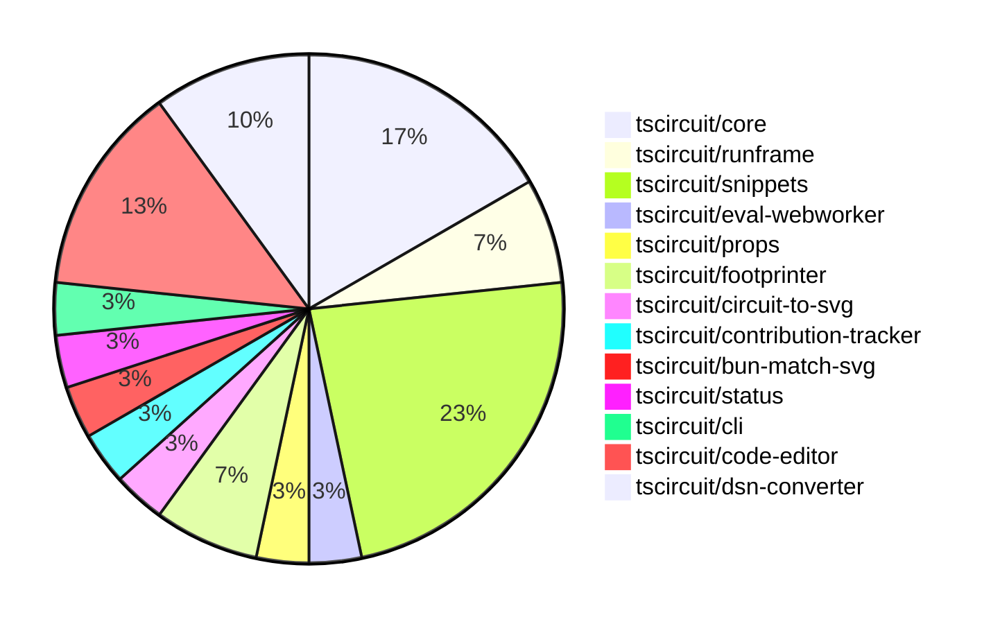

# Contribution Overview 2025-01-15

## PRs by Repository

## Contributor Overview

| Contributor | 🐳 Major | 🐙 Minor | 🐌 Tiny | ⭐ | Issues Created |
|-------------|---------|---------|---------|-----|----------------|
| [seveibar](#seveibar) | 5 | 3 | 1 | 👑 | 41 |
| [imrishabh18](#imrishabh18) | 3 | 5 | 0 | ⭐⭐ | 0 |
| [ShiboSoftwareDev](#ShiboSoftwareDev) | 0 | 3 | 0 | ⭐⭐ | 2 |
| [techmannih](#techmannih) | 0 | 4 | 0 | ⭐ | 0 |
| [Anshgrover23](#Anshgrover23) | 0 | 1 | 0 | ⭐ | 1 |
| [kom-senapati](#kom-senapati) | 0 | 3 | 0 | ⭐ | 1 |
| [ArnavK-09](#ArnavK-09) | 0 | 1 | 0 |  | 2 |
| [Ayushjhawar8](#Ayushjhawar8) | 0 | 0 | 1 |  | 0 |

## Review Table

[reviews-received-hover]: ## "Number of reviews received for PRs for this contributor"
[approvals-received-hover]: ## "Number of approvals received for PRs this contributor authored"
[rejections-received-hover]: ## "Number of rejections received for PRs this contributor authored"
[prs-opened-hover]: ## "Number of PRs opened by this contributor"
[issues-created-hover]: ## "Number of issues created by this contributor"
[bountied-issues-hover]: ## "Number of issues this contributor created with a bounty"
[bountied-issue-$-hover]: ## "Total bounty amount placed on issues authored by this contributor"

| Contributor | Reviews Received | Approvals Received | Rejections Received | Approvals | Rejections | PRs Opened | PRs Merged | Issues Created | Bountied Issues | Bountied Issue $ |
|---|---|---|---|---|---|---|---|---|---|---|
| [kom-senapati](#kom-senapati) | 5 | 3 | 1 | 0 | 0 | 5 | 3 | 1 | 0 | 0 |
| [techmannih](#techmannih) | 20 | 6 | 8 | 0 | 0 | 6 | 4 | 0 | 0 | 0 |
| [seveibar](#seveibar) | 2 | 0 | 0 | 13 | 9 | 13 | 9 | 41 | 32 | 565 |
| [ShiboSoftwareDev](#ShiboSoftwareDev) | 7 | 2 | 0 | 1 | 1 | 4 | 3 | 2 | 2 | 20 |
| [Ayushjhawar8](#Ayushjhawar8) | 4 | 1 | 2 | 0 | 0 | 2 | 1 | 0 | 0 | 0 |
| [imrishabh18](#imrishabh18) | 0 | 0 | 0 | 2 | 5 | 8 | 8 | 0 | 0 | 0 |
| [Anshgrover23](#Anshgrover23) | 7 | 2 | 3 | 0 | 4 | 5 | 1 | 1 | 1 | 10 |
| [Saurabhsing21](#Saurabhsing21) | 6 | 1 | 3 | 0 | 0 | 1 | 0 | 0 | 0 | 0 |
| [ArnavK-09](#ArnavK-09) | 1 | 1 | 0 | 0 | 0 | 2 | 1 | 2 | 0 | 0 |
| [Abse2001](#Abse2001) | 0 | 0 | 0 | 0 | 1 | 0 | 0 | 3 | 3 | 20 |
| [B-Mustafa](#B-Mustafa) | 1 | 0 | 1 | 0 | 0 | 1 | 0 | 0 | 0 | 0 |
| [yashksaini-coder](#yashksaini-coder) | 8 | 0 | 2 | 0 | 0 | 1 | 0 | 0 | 0 | 0 |

## Changes by Repository

### [tscircuit/core](https://github.com/tscircuit/core)

| PR # | Impact | Contributor | Description |
|------|--------|-------------|-------------|
| [#533](https://github.com/tscircuit/core/pull/533) | 🐳 Major | seveibar | Adds support for React 18 by utilizing a separate React Reconciler package for React 18 compatibility. |
| [#531](https://github.com/tscircuit/core/pull/531) | 🐳 Major | seveibar | Introduce a benchmarking server and a local benchmark with historical data |
| [#532](https://github.com/tscircuit/core/pull/532) | 🐳 Major | seveibar | Update the project to use React 19 |
| [#523](https://github.com/tscircuit/core/pull/523) | 🐳 Major | seveibar | Fixes a bug in the `createSchematicTraceCrossingSegments` function to handle non-orthogonal edges and prevent an infinite loop. |
| [#527](https://github.com/tscircuit/core/pull/527) | 🐙 Minor | techmannih | Automatically add net labels when a chip-to-chip trace is created. |

### [tscircuit/runframe](https://github.com/tscircuit/runframe)

| PR # | Impact | Contributor | Description |
|------|--------|-------------|-------------|
| [#139](https://github.com/tscircuit/runframe/pull/139) | 🐳 Major | seveibar | Adds a render timings bar to the render log view, which allows sorting the render phases by duration or chronological order. |
| [#149](https://github.com/tscircuit/runframe/pull/149) | 🐙 Minor | seveibar | Adds Tailwind prefix, improves build system in dev, and fixes minor issues with circuit JSON and BOM. |

### [tscircuit/snippets](https://github.com/tscircuit/snippets)

| PR # | Impact | Contributor | Description |
|------|--------|-------------|-------------|
| [#578](https://github.com/tscircuit/snippets/pull/578) | 🐙 Minor | seveibar | Set up GitHub Actions workflow for publishing a fake API to npm |
| [#585](https://github.com/tscircuit/snippets/pull/585) | 🐙 Minor | ShiboSoftwareDev | Updated the `getFootprintNamesByType()` function to get the list of normal footprint names for the footprint dialog component. |
| [#552](https://github.com/tscircuit/snippets/pull/552) | 🐙 Minor | techmannih | Fixes a bug where the error message is not displayed when a user tries to fork a snippet that already exists in their account. |
| [#574](https://github.com/tscircuit/snippets/pull/574) | 🐙 Minor | techmannih | Improve error message for 3D model download when 3D viewer is not open |
| [#571](https://github.com/tscircuit/snippets/pull/571) | 🐙 Minor | imrishabh18 | Reverts the update of the `@tscircuit/3d-viewer` dependency to version `^0.0.95` and restores it to version `^0.0.94`. |
| [#583](https://github.com/tscircuit/snippets/pull/583) | 🐙 Minor | ArnavK-09 | Adds support for generating assembly images for code snippets. |
| [#575](https://github.com/tscircuit/snippets/pull/575) | 🐙 Minor | Anshgrover23 | Fixes the GLTF downloader to use the correct file extension based on whether the download is binary or not. |

### [tscircuit/eval-webworker](https://github.com/tscircuit/eval-webworker)

| PR # | Impact | Contributor | Description |
|------|--------|-------------|-------------|
| [#78](https://github.com/tscircuit/eval-webworker/pull/78) | 🐙 Minor | seveibar | Adds a new configuration option `cjsRegistryUrl` to the `WebWorkerConfiguration` interface and updates the `import-snippet.ts` file to use the new URL for fetching the CJS bundle instead of the previous API. |

### [tscircuit/props](https://github.com/tscircuit/props)

| PR # | Impact | Contributor | Description |
|------|--------|-------------|-------------|
| [#146](https://github.com/tscircuit/props/pull/146) | 🐌 Tiny | seveibar | Add a `key` prop to the `BaseGroupProps` interface and the `baseGroupProps` object. |

### [tscircuit/footprinter](https://github.com/tscircuit/footprinter)

| PR # | Impact | Contributor | Description |
|------|--------|-------------|-------------|
| [#112](https://github.com/tscircuit/footprinter/pull/112) | 🐙 Minor | ShiboSoftwareDev | Changed the property names in the `getFootprintNamesByType` function from `passiveFootprints` and `normalFootprints` to `passiveFootprintNames` and `normalFootprintNames`, respectively. |
| [#111](https://github.com/tscircuit/footprinter/pull/111) | 🐙 Minor | ShiboSoftwareDev | Add a new function `getFootprintNamesByType` that returns an object with two properties: `passiveFootprints` and `normalFootprints`, which contain the footprint names of passive and normal components, respectively. |

### [tscircuit/circuit-to-svg](https://github.com/tscircuit/circuit-to-svg)

| PR # | Impact | Contributor | Description |
|------|--------|-------------|-------------|
| [#161](https://github.com/tscircuit/circuit-to-svg/pull/161) | 🐙 Minor | techmannih | Fixes the transparency of the label points in the schematic SVG. |

### [tscircuit/contribution-tracker](https://github.com/tscircuit/contribution-tracker)

| PR # | Impact | Contributor | Description |
|------|--------|-------------|-------------|
| [#36](https://github.com/tscircuit/contribution-tracker/pull/36) | 🐌 Tiny | Ayushjhawar8 | Change the terminology from "Approvals" to "Approval Sent" in the contributor statistics table. |

### [tscircuit/bun-match-svg](https://github.com/tscircuit/bun-match-svg)

| PR # | Impact | Contributor | Description |
|------|--------|-------------|-------------|
| [#7](https://github.com/tscircuit/bun-match-svg/pull/7) | 🐙 Minor | kom-senapati | Fix an issue with the init command by removing unnecessary imports and arguments. |

### [tscircuit/status](https://github.com/tscircuit/status)

| PR # | Impact | Contributor | Description |
|------|--------|-------------|-------------|
| [#10](https://github.com/tscircuit/status/pull/10) | 🐙 Minor | kom-senapati | This PR introduces a status check for the "registry and bundling" endpoints, ensuring the health of the esm, cjs, and npm services. |

### [tscircuit/cli](https://github.com/tscircuit/cli)

| PR # | Impact | Contributor | Description |
|------|--------|-------------|-------------|
| [#22](https://github.com/tscircuit/cli/pull/22) | 🐙 Minor | kom-senapati | Introduces a simple test fixture for CLI and TSCI init test |

### [tscircuit/code-editor](https://github.com/tscircuit/code-editor)

| PR # | Impact | Contributor | Description |
|------|--------|-------------|-------------|
| [#8](https://github.com/tscircuit/code-editor/pull/8) | 🐳 Major | imrishabh18 | Adds setup for TypeScript compiler in the browser and initializes the code editor with the ata (TypeScript Acquisition API) and vfs (Virtual File System) libraries. |
| [#7](https://github.com/tscircuit/code-editor/pull/7) | 🐳 Major | imrishabh18 | Introduces state management, formats the code using Prettier, and ports the UI from snippets. |
| [#6](https://github.com/tscircuit/code-editor/pull/6) | 🐳 Major | imrishabh18 | Introduces a basic code editor with Cosmos and Vite integration, along with Twind configuration. |
| [#4](https://github.com/tscircuit/code-editor/pull/4) | 🐙 Minor | imrishabh18 | This pull request adds basic setup files for a Bun-based build, test, and type-checking workflow using GitHub Actions. |

### [tscircuit/dsn-converter](https://github.com/tscircuit/dsn-converter)

| PR # | Impact | Contributor | Description |
|------|--------|-------------|-------------|
| [#80](https://github.com/tscircuit/dsn-converter/pull/80) | 🐙 Minor | imrishabh18 | Fix the plated_hole naming by appending the source_component_id to the component name. |
| [#79](https://github.com/tscircuit/dsn-converter/pull/79) | 🐙 Minor | imrishabh18 | Fixes a bug in the trace linkage logic. |
| [#78](https://github.com/tscircuit/dsn-converter/pull/78) | 🐙 Minor | imrishabh18 | Fix subcircuit with same name issue |

## Changes by Contributor

### [seveibar](https://github.com/seveibar)

| PR # | Impact | Description |
|------|--------|-------------|
| [#533](https://github.com/tscircuit/core/pull/533) | 🐳 Major | Adds support for React 18 by utilizing a separate React Reconciler package for React 18 compatibility. |
| [#531](https://github.com/tscircuit/core/pull/531) | 🐳 Major | Introduce a benchmarking server and a local benchmark with historical data |
| [#532](https://github.com/tscircuit/core/pull/532) | 🐳 Major | Update the project to use React 19 |
| [#523](https://github.com/tscircuit/core/pull/523) | 🐳 Major | Fixes a bug in the `createSchematicTraceCrossingSegments` function to handle non-orthogonal edges and prevent an infinite loop. |
| [#139](https://github.com/tscircuit/runframe/pull/139) | 🐳 Major | Adds a render timings bar to the render log view, which allows sorting the render phases by duration or chronological order. |
| [#578](https://github.com/tscircuit/snippets/pull/578) | 🐙 Minor | Set up GitHub Actions workflow for publishing a fake API to npm |
| [#78](https://github.com/tscircuit/eval-webworker/pull/78) | 🐙 Minor | Adds a new configuration option `cjsRegistryUrl` to the `WebWorkerConfiguration` interface and updates the `import-snippet.ts` file to use the new URL for fetching the CJS bundle instead of the previous API. |
| [#149](https://github.com/tscircuit/runframe/pull/149) | 🐙 Minor | Adds Tailwind prefix, improves build system in dev, and fixes minor issues with circuit JSON and BOM. |
| [#146](https://github.com/tscircuit/props/pull/146) | 🐌 Tiny | Add a `key` prop to the `BaseGroupProps` interface and the `baseGroupProps` object. |

### [ShiboSoftwareDev](https://github.com/ShiboSoftwareDev)

| PR # | Impact | Description |
|------|--------|-------------|
| [#112](https://github.com/tscircuit/footprinter/pull/112) | 🐙 Minor | Changed the property names in the `getFootprintNamesByType` function from `passiveFootprints` and `normalFootprints` to `passiveFootprintNames` and `normalFootprintNames`, respectively. |
| [#111](https://github.com/tscircuit/footprinter/pull/111) | 🐙 Minor | Add a new function `getFootprintNamesByType` that returns an object with two properties: `passiveFootprints` and `normalFootprints`, which contain the footprint names of passive and normal components, respectively. |
| [#585](https://github.com/tscircuit/snippets/pull/585) | 🐙 Minor | Updated the `getFootprintNamesByType()` function to get the list of normal footprint names for the footprint dialog component. |

### [techmannih](https://github.com/techmannih)

| PR # | Impact | Description |
|------|--------|-------------|
| [#527](https://github.com/tscircuit/core/pull/527) | 🐙 Minor | Automatically add net labels when a chip-to-chip trace is created. |
| [#161](https://github.com/tscircuit/circuit-to-svg/pull/161) | 🐙 Minor | Fixes the transparency of the label points in the schematic SVG. |
| [#552](https://github.com/tscircuit/snippets/pull/552) | 🐙 Minor | Fixes a bug where the error message is not displayed when a user tries to fork a snippet that already exists in their account. |
| [#574](https://github.com/tscircuit/snippets/pull/574) | 🐙 Minor | Improve error message for 3D model download when 3D viewer is not open |

### [Ayushjhawar8](https://github.com/Ayushjhawar8)

| PR # | Impact | Description |
|------|--------|-------------|
| [#36](https://github.com/tscircuit/contribution-tracker/pull/36) | 🐌 Tiny | Change the terminology from "Approvals" to "Approval Sent" in the contributor statistics table. |

### [kom-senapati](https://github.com/kom-senapati)

| PR # | Impact | Description |
|------|--------|-------------|
| [#7](https://github.com/tscircuit/bun-match-svg/pull/7) | 🐙 Minor | Fix an issue with the init command by removing unnecessary imports and arguments. |
| [#10](https://github.com/tscircuit/status/pull/10) | 🐙 Minor | This PR introduces a status check for the "registry and bundling" endpoints, ensuring the health of the esm, cjs, and npm services. |
| [#22](https://github.com/tscircuit/cli/pull/22) | 🐙 Minor | Introduces a simple test fixture for CLI and TSCI init test |

### [imrishabh18](https://github.com/imrishabh18)

| PR # | Impact | Description |
|------|--------|-------------|
| [#8](https://github.com/tscircuit/code-editor/pull/8) | 🐳 Major | Adds setup for TypeScript compiler in the browser and initializes the code editor with the ata (TypeScript Acquisition API) and vfs (Virtual File System) libraries. |
| [#7](https://github.com/tscircuit/code-editor/pull/7) | 🐳 Major | Introduces state management, formats the code using Prettier, and ports the UI from snippets. |
| [#6](https://github.com/tscircuit/code-editor/pull/6) | 🐳 Major | Introduces a basic code editor with Cosmos and Vite integration, along with Twind configuration. |
| [#80](https://github.com/tscircuit/dsn-converter/pull/80) | 🐙 Minor | Fix the plated_hole naming by appending the source_component_id to the component name. |
| [#79](https://github.com/tscircuit/dsn-converter/pull/79) | 🐙 Minor | Fixes a bug in the trace linkage logic. |
| [#78](https://github.com/tscircuit/dsn-converter/pull/78) | 🐙 Minor | Fix subcircuit with same name issue |
| [#571](https://github.com/tscircuit/snippets/pull/571) | 🐙 Minor | Reverts the update of the `@tscircuit/3d-viewer` dependency to version `^0.0.95` and restores it to version `^0.0.94`. |
| [#4](https://github.com/tscircuit/code-editor/pull/4) | 🐙 Minor | This pull request adds basic setup files for a Bun-based build, test, and type-checking workflow using GitHub Actions. |

### [ArnavK-09](https://github.com/ArnavK-09)

| PR # | Impact | Description |
|------|--------|-------------|
| [#583](https://github.com/tscircuit/snippets/pull/583) | 🐙 Minor | Adds support for generating assembly images for code snippets. |

### [Anshgrover23](https://github.com/Anshgrover23)

| PR # | Impact | Description |
|------|--------|-------------|
| [#575](https://github.com/tscircuit/snippets/pull/575) | 🐙 Minor | Fixes the GLTF downloader to use the correct file extension based on whether the download is binary or not. |

