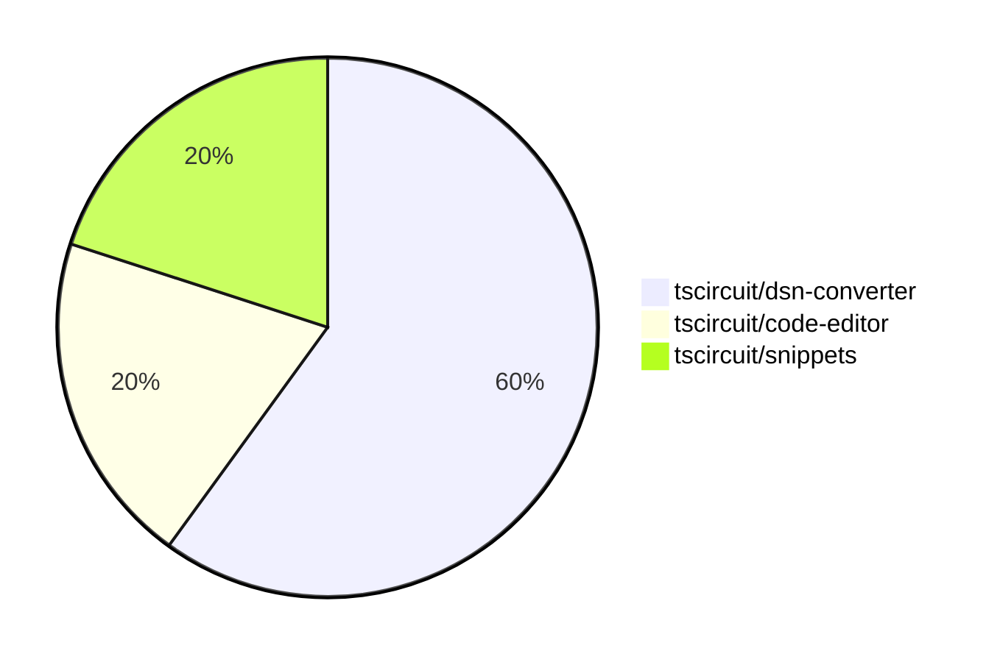

# Contribution Overview 2025-01-15

## PRs by Repository

## Contributor Overview

| Contributor | 🐳 Major | 🐙 Minor | 🐌 Tiny | ⭐ | Issues Created |
|-------------|---------|---------|---------|-----|----------------|
| [imrishabh18](#imrishabh18) | 2 | 3 | 0 | ⭐⭐ | 0 |

## Review Table

[reviews-received-hover]: ## "Number of reviews received for PRs for this contributor"
[approvals-received-hover]: ## "Number of approvals received for PRs this contributor authored"
[rejections-received-hover]: ## "Number of rejections received for PRs this contributor authored"
[prs-opened-hover]: ## "Number of PRs opened by this contributor"
[issues-created-hover]: ## "Number of issues created by this contributor"
[bountied-issues-hover]: ## "Number of issues this contributor created with a bounty"
[bountied-issue-$-hover]: ## "Total bounty amount placed on issues authored by this contributor"

| Contributor | Reviews Received | Approvals Received | Rejections Received | Approvals | Rejections | PRs Opened | PRs Merged | Issues Created | Bountied Issues | Bountied Issue $ |
|---|---|---|---|---|---|---|---|---|---|---|
| [kom-senapati](#kom-senapati) | 0 | 0 | 0 | 0 | 0 | 2 | 0 | 1 | 0 | 0 |
| [imrishabh18](#imrishabh18) | 0 | 0 | 0 | 0 | 0 | 5 | 5 | 0 | 0 | 0 |
| [techmannih](#techmannih) | 3 | 0 | 1 | 0 | 0 | 2 | 0 | 0 | 0 | 0 |
| [seveibar](#seveibar) | 0 | 0 | 0 | 0 | 1 | 0 | 0 | 7 | 4 | 49 |
| [Saurabhsing21](#Saurabhsing21) | 1 | 0 | 1 | 0 | 0 | 1 | 0 | 0 | 0 | 0 |
| [Anshgrover23](#Anshgrover23) | 1 | 0 | 0 | 0 | 0 | 1 | 0 | 0 | 0 | 0 |
| [Abse2001](#Abse2001) | 0 | 0 | 0 | 0 | 1 | 0 | 0 | 2 | 2 | 10 |

## Changes by Repository

### [tscircuit/dsn-converter](https://github.com/tscircuit/dsn-converter)

| PR # | Impact | Contributor | Description |
|------|--------|-------------|-------------|
| [#78](https://github.com/tscircuit/dsn-converter/pull/78) | 🐳 Major | imrishabh18 | Fix for issues with subcircuits with the same name |
| [#80](https://github.com/tscircuit/dsn-converter/pull/80) | 🐙 Minor | imrishabh18 | Fixes the plated_hole naming by appending the source_component_id to the refdes. |
| [#79](https://github.com/tscircuit/dsn-converter/pull/79) | 🐙 Minor | imrishabh18 | Fix trace linkage |

### [tscircuit/code-editor](https://github.com/tscircuit/code-editor)

| PR # | Impact | Contributor | Description |
|------|--------|-------------|-------------|
| [#4](https://github.com/tscircuit/code-editor/pull/4) | 🐳 Major | imrishabh18 | Adds basic setup files for a Bun-based project, including GitHub Actions workflows for building, testing, and type-checking the project. |

### [tscircuit/snippets](https://github.com/tscircuit/snippets)

| PR # | Impact | Contributor | Description |
|------|--------|-------------|-------------|
| [#571](https://github.com/tscircuit/snippets/pull/571) | 🐙 Minor | imrishabh18 | Reverts the update to the "@tscircuit/3d-viewer" dependency to version 0.0.95, which seems to have broken the code editor page. |

## Changes by Contributor

### [imrishabh18](https://github.com/imrishabh18)

| PR # | Impact | Description |
|------|--------|-------------|
| [#78](https://github.com/tscircuit/dsn-converter/pull/78) | 🐳 Major | Fix for issues with subcircuits with the same name |
| [#4](https://github.com/tscircuit/code-editor/pull/4) | 🐳 Major | Adds basic setup files for a Bun-based project, including GitHub Actions workflows for building, testing, and type-checking the project. |
| [#80](https://github.com/tscircuit/dsn-converter/pull/80) | 🐙 Minor | Fixes the plated_hole naming by appending the source_component_id to the refdes. |
| [#79](https://github.com/tscircuit/dsn-converter/pull/79) | 🐙 Minor | Fix trace linkage |
| [#571](https://github.com/tscircuit/snippets/pull/571) | 🐙 Minor | Reverts the update to the "@tscircuit/3d-viewer" dependency to version 0.0.95, which seems to have broken the code editor page. |

