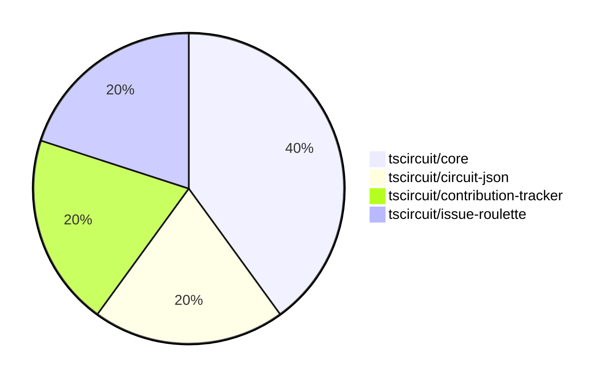

# Contribution Overview 2025-01-22

## PRs by Repository

## Contributor Overview

| Contributor | 🐳 Major | 🐙 Minor | 🐌 Tiny | ⭐ | Issues Created |
|-------------|---------|---------|---------|-----|----------------|
| [seveibar](#seveibar) | 1 | 1 | 0 | ⭐⭐ | 9 |
| [Anshgrover23](#Anshgrover23) | 1 | 1 | 0 | ⭐ | 0 |
| [imrishabh18](#imrishabh18) | 0 | 1 | 0 | ⭐ | 1 |

## Review Table

[reviews-received-hover]: ## "Number of reviews received for PRs for this contributor"
[approvals-received-hover]: ## "Number of approvals received for PRs this contributor authored"
[rejections-received-hover]: ## "Number of rejections received for PRs this contributor authored"
[prs-opened-hover]: ## "Number of PRs opened by this contributor"
[issues-created-hover]: ## "Number of issues created by this contributor"
[bountied-issues-hover]: ## "Number of issues this contributor created with a bounty"
[bountied-issue-$-hover]: ## "Total bounty amount placed on issues authored by this contributor"

| Contributor | Reviews Received | Approvals Received | Rejections Received | Approvals | Rejections | PRs Opened | PRs Merged | Issues Created | Bountied Issues | Bountied Issue $ |
|---|---|---|---|---|---|---|---|---|---|---|
| [seveibar](#seveibar) | 0 | 0 | 0 | 2 | 0 | 3 | 2 | 9 | 6 | 115 |
| [Ayushjhawar8](#Ayushjhawar8) | 4 | 0 | 2 | 0 | 0 | 2 | 0 | 0 | 0 | 0 |
| [Anshgrover23](#Anshgrover23) | 6 | 2 | 1 | 0 | 3 | 3 | 2 | 0 | 0 | 0 |
| [ArnavK-09](#ArnavK-09) | 0 | 0 | 0 | 0 | 0 | 1 | 0 | 0 | 0 | 0 |
| [imrishabh18](#imrishabh18) | 7 | 0 | 0 | 0 | 1 | 2 | 1 | 1 | 1 | 10 |
| [kom-senapati](#kom-senapati) | 1 | 0 | 1 | 0 | 0 | 1 | 0 | 0 | 0 | 0 |

## Changes by Repository

### [tscircuit/core](https://github.com/tscircuit/core)

| PR # | Impact | Contributor | Description |
|------|--------|-------------|-------------|
| [#543](https://github.com/tscircuit/core/pull/543) | 🐳 Major | seveibar | Adds support for subcircuit-dependent autorouting in the RootCircuit and Group components. |
| [#539](https://github.com/tscircuit/core/pull/539) | 🐙 Minor | imrishabh18 | Add subcircuit_id and pcb_group_id to primitive components |

### [tscircuit/circuit-json](https://github.com/tscircuit/circuit-json)

| PR # | Impact | Contributor | Description |
|------|--------|-------------|-------------|
| [#125](https://github.com/tscircuit/circuit-json/pull/125) | 🐙 Minor | seveibar | Add a new optional field `parent_subcircuit_id` to the `source_group` schema. |

### [tscircuit/contribution-tracker](https://github.com/tscircuit/contribution-tracker)

| PR # | Impact | Contributor | Description |
|------|--------|-------------|-------------|
| [#37](https://github.com/tscircuit/contribution-tracker/pull/37) | 🐳 Major | Anshgrover23 | The change ensures that reviews are only counted once per PR, rather than counting each approval and rejection separately. |

### [tscircuit/issue-roulette](https://github.com/tscircuit/issue-roulette)

| PR # | Impact | Contributor | Description |
|------|--------|-------------|-------------|
| [#8](https://github.com/tscircuit/issue-roulette/pull/8) | 🐙 Minor | Anshgrover23 | Add a filter to the IssueRoulette component to allow users to filter issues by bounty status (all, bountied, unbountied). |

## Changes by Contributor

### [seveibar](https://github.com/seveibar)

| PR # | Impact | Description |
|------|--------|-------------|
| [#543](https://github.com/tscircuit/core/pull/543) | 🐳 Major | Adds support for subcircuit-dependent autorouting in the RootCircuit and Group components. |
| [#125](https://github.com/tscircuit/circuit-json/pull/125) | 🐙 Minor | Add a new optional field `parent_subcircuit_id` to the `source_group` schema. |

### [imrishabh18](https://github.com/imrishabh18)

| PR # | Impact | Description |
|------|--------|-------------|
| [#539](https://github.com/tscircuit/core/pull/539) | 🐙 Minor | Add subcircuit_id and pcb_group_id to primitive components |

### [Anshgrover23](https://github.com/Anshgrover23)

| PR # | Impact | Description |
|------|--------|-------------|
| [#37](https://github.com/tscircuit/contribution-tracker/pull/37) | 🐳 Major | The change ensures that reviews are only counted once per PR, rather than counting each approval and rejection separately. |
| [#8](https://github.com/tscircuit/issue-roulette/pull/8) | 🐙 Minor | Add a filter to the IssueRoulette component to allow users to filter issues by bounty status (all, bountied, unbountied). |

