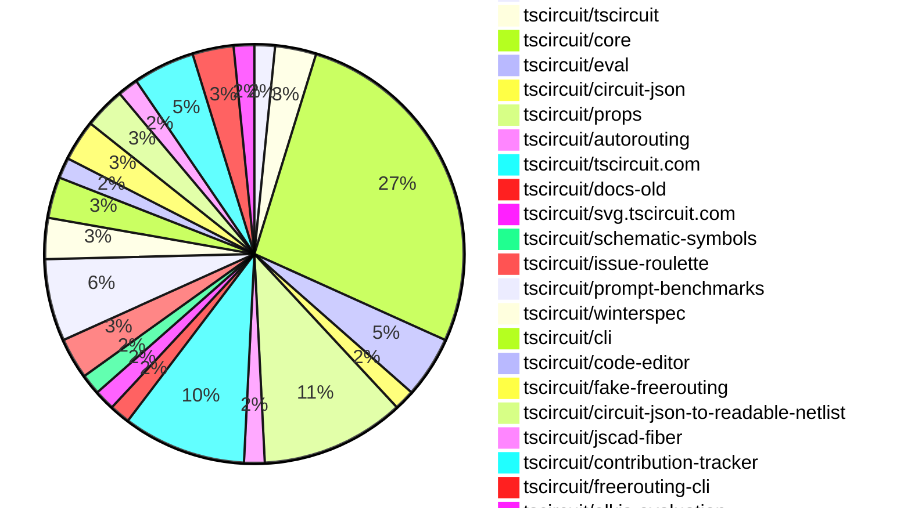

# Contribution Overview 2025-01-22

## PRs by Repository

## Contributor Overview

| Contributor | 🐳 Major | 🐙 Minor | 🐌 Tiny | ⭐ | Issues Created |
|-------------|---------|---------|---------|-----|----------------|
| [seveibar](#seveibar) | 3 | 17 | 0 | 👑 | 66 |
| [imrishabh18](#imrishabh18) | 1 | 11 | 1 | ⭐⭐ | 6 |
| [ShiboSoftwareDev](#ShiboSoftwareDev) | 1 | 6 | 0 | ⭐⭐ | 6 |
| [Anshgrover23](#Anshgrover23) | 1 | 3 | 0 | ⭐⭐ | 5 |
| [krushnarout](#krushnarout) | 2 | 0 | 0 | ⭐ | 0 |
| [techmannih](#techmannih) | 0 | 4 | 0 | ⭐ | 5 |
| [ArnavK-09](#ArnavK-09) | 1 | 2 | 0 | ⭐ | 0 |
| [kom-senapati](#kom-senapati) | 0 | 3 | 0 | ⭐ | 3 |
| [Abse2001](#Abse2001) | 1 | 1 | 0 | ⭐ | 0 |
| [Ayushjhawar8](#Ayushjhawar8) | 0 | 1 | 2 | ⭐ | 1 |
| [AnasSarkiz](#AnasSarkiz) | 1 | 0 | 0 | ⭐ | 1 |
| [devin-ai-integration[bot]](#devin-ai-integration[bot]) | 0 | 1 | 0 |  | 0 |

## Review Table

[reviews-received-hover]: ## "Number of reviews received for PRs for this contributor"
[approvals-received-hover]: ## "Number of approvals received for PRs this contributor authored"
[rejections-received-hover]: ## "Number of rejections received for PRs this contributor authored"
[prs-opened-hover]: ## "Number of PRs opened by this contributor"
[issues-created-hover]: ## "Number of issues created by this contributor"
[bountied-issues-hover]: ## "Number of issues this contributor created with a bounty"
[bountied-issue-$-hover]: ## "Total bounty amount placed on issues authored by this contributor"

| Contributor | Reviews Received | Approvals Received | Rejections Received | Approvals | Rejections | PRs Opened | PRs Merged | Issues Created | Bountied Issues | Bountied Issue $ |
|---|---|---|---|---|---|---|---|---|---|---|
| [Ayushjhawar8](#Ayushjhawar8) | 19 | 3 | 8 | 0 | 0 | 5 | 3 | 1 | 0 | 0 |
| [seveibar](#seveibar) | 0 | 0 | 0 | 28 | 14 | 22 | 20 | 66 | 54 | 861 |
| [krushnarout](#krushnarout) | 14 | 1 | 3 | 0 | 0 | 3 | 2 | 0 | 0 | 0 |
| [imrishabh18](#imrishabh18) | 9 | 1 | 0 | 1 | 6 | 14 | 13 | 6 | 2 | 15 |
| [Anshgrover23](#Anshgrover23) | 19 | 4 | 2 | 3 | 14 | 8 | 4 | 5 | 1 | 10 |
| [ArnavK-09](#ArnavK-09) | 8 | 4 | 1 | 0 | 0 | 4 | 3 | 0 | 0 | 0 |
| [devin-ai-integration[bot]](#devin-ai-integration[bot]) | 0 | 0 | 0 | 0 | 0 | 3 | 1 | 0 | 0 | 0 |
| [techmannih](#techmannih) | 21 | 6 | 9 | 0 | 0 | 11 | 4 | 5 | 0 | 0 |
| [kom-senapati](#kom-senapati) | 16 | 4 | 6 | 0 | 0 | 7 | 3 | 3 | 1 | 2 |
| [ShiboSoftwareDev](#ShiboSoftwareDev) | 5 | 5 | 0 | 0 | 0 | 8 | 7 | 6 | 4 | 40 |
| [AbhinavTheDev](#AbhinavTheDev) | 5 | 0 | 2 | 0 | 0 | 1 | 0 | 0 | 0 | 0 |
| [Rishikesh63](#Rishikesh63) | 3 | 0 | 2 | 0 | 0 | 1 | 0 | 0 | 0 | 0 |
| [mdkaifansari04](#mdkaifansari04) | 1 | 0 | 1 | 0 | 0 | 2 | 0 | 0 | 0 | 0 |
| [ARYPROGRAMMER](#ARYPROGRAMMER) | 1 | 0 | 0 | 0 | 0 | 1 | 0 | 0 | 0 | 0 |
| [mojafa](#mojafa) | 0 | 0 | 0 | 0 | 0 | 1 | 0 | 0 | 0 | 0 |
| [Abse2001](#Abse2001) | 7 | 3 | 0 | 0 | 0 | 2 | 2 | 0 | 0 | 0 |
| [Girma35](#Girma35) | 0 | 0 | 0 | 0 | 0 | 1 | 0 | 0 | 0 | 0 |
| [AnasSarkiz](#AnasSarkiz) | 1 | 1 | 0 | 0 | 0 | 1 | 1 | 1 | 0 | 0 |

## Changes by Repository

### [tscircuit/runframe](https://github.com/tscircuit/runframe)

| PR # | Impact | Contributor | Description |
|------|--------|-------------|-------------|
| [#164](https://github.com/tscircuit/runframe/pull/164) | 🐙 Minor | Ayushjhawar8 | Adds a red square stop/pause button to the run button in the RunFrame component. |

### [tscircuit/tscircuit](https://github.com/tscircuit/tscircuit)

| PR # | Impact | Contributor | Description |
|------|--------|-------------|-------------|
| [#513](https://github.com/tscircuit/tscircuit/pull/513) | 🐌 Tiny | Ayushjhawar8 | Fixed the header in the example preview image. |
| [#512](https://github.com/tscircuit/tscircuit/pull/512) | 🐌 Tiny | Ayushjhawar8 | Updates the images in the project's documentation. |

### [tscircuit/core](https://github.com/tscircuit/core)

| PR # | Impact | Contributor | Description |
|------|--------|-------------|-------------|
| [#549](https://github.com/tscircuit/core/pull/549) | 🐳 Major | seveibar | Introduces the `sel` object, which provides a typed interface for accessing various electronic components and their pins in a schematic. |
| [#543](https://github.com/tscircuit/core/pull/543) | 🐳 Major | seveibar | Adds support for subcircuit-dependent autorouting |
| [#574](https://github.com/tscircuit/core/pull/574) | 🐙 Minor | seveibar | Use `getInheritedProperty` for `partsEngine` in `NormalComponent` |
| [#576](https://github.com/tscircuit/core/pull/576) | 🐙 Minor | seveibar | Adds the `subcircuit_id` to the request body when using the simplified autorouting/solve endpoint. |
| [#563](https://github.com/tscircuit/core/pull/563) | 🐙 Minor | seveibar | Introduces support for new margin syntax to match web standards |
| [#555](https://github.com/tscircuit/core/pull/555) | 🐙 Minor | seveibar | Rename `internallyConnectedPorts` to `internallyConnectedPins` in the `NormalComponent` interface and implementation. |
| [#553](https://github.com/tscircuit/core/pull/553) | 🐙 Minor | seveibar | Rename `schPortArrangement` to `schPinArrangement` with backwards compatibility |
| [#552](https://github.com/tscircuit/core/pull/552) | 🐙 Minor | seveibar | Implement the `_getInternallyConnectedPorts` method in the `NormalComponent` class, which returns an array of arrays of `Port` objects representing the internally connected ports of the component. Additionally, add a `defaultInternallyConnectedPortNames` property to set the default internally connected ports for the `<pushbutton />` component. |
| [#551](https://github.com/tscircuit/core/pull/551) | 🐙 Minor | seveibar | Fix an issue where source ports are not being created for footprints if the schematic symbol has fewer pins. |
| [#546](https://github.com/tscircuit/core/pull/546) | 🐙 Minor | seveibar | Fix an issue with the import of reconciler constants that was preventing the use of NextJS core. |
| [#565](https://github.com/tscircuit/core/pull/565) | 🐙 Minor | techmannih | Adds support for the `Board` component to compute its width and height from the provided `outline` prop, even if the `width` and `height` props are not specified. |
| [#559](https://github.com/tscircuit/core/pull/559) | 🐙 Minor | imrishabh18 | Test to verify the footprinter for SOIC4 using autocloud |
| [#561](https://github.com/tscircuit/core/pull/561) | 🐙 Minor | imrishabh18 | Move `react-reconciler` from dev dependency to runtime dependency |
| [#545](https://github.com/tscircuit/core/pull/545) | 🐙 Minor | imrishabh18 | Optimized the circuit JSON sent to the autorouter by only including the `Source_` and `Pcb_` elements, and added the `subcircuit_id` to the request. |
| [#539](https://github.com/tscircuit/core/pull/539) | 🐙 Minor | imrishabh18 | Adds `subcircuit_id` and `pcb_group_id` to primitive components, and `is_subcircuit` to the `source_group`. |
| [#554](https://github.com/tscircuit/core/pull/554) | 🐙 Minor | kom-senapati | Adds the ability to create traces from externallyConnectedPorts in the <chip /> component. |
| [#557](https://github.com/tscircuit/core/pull/557) | 🐌 Tiny | imrishabh18 | Fixes a test case that was not using the `getTestFixture` utility function. |

### [tscircuit/eval](https://github.com/tscircuit/eval)

| PR # | Impact | Contributor | Description |
|------|--------|-------------|-------------|
| [#91](https://github.com/tscircuit/eval/pull/91) | 🐳 Major | seveibar | Adds the `CircuitRunner` class and its associated API to enable evaluating circuits |
| [#92](https://github.com/tscircuit/eval/pull/92) | 🐙 Minor | seveibar | Add types to exports in package.json |
| [#89](https://github.com/tscircuit/eval/pull/89) | 🐙 Minor | seveibar | Allow importing "tscircuit" and alias it to "@tscircuit/core" |

### [tscircuit/circuit-json](https://github.com/tscircuit/circuit-json)

| PR # | Impact | Contributor | Description |
|------|--------|-------------|-------------|
| [#125](https://github.com/tscircuit/circuit-json/pull/125) | 🐙 Minor | seveibar | Add a new optional field `parent_subcircuit_id` to the `source_group` schema. |

### [tscircuit/props](https://github.com/tscircuit/props)

| PR # | Impact | Contributor | Description |
|------|--------|-------------|-------------|
| [#148](https://github.com/tscircuit/props/pull/148) | 🐳 Major | ShiboSoftwareDev | This pull request adds a script to generate component types for the TSCircuit project. |
| [#154](https://github.com/tscircuit/props/pull/154) | 🐙 Minor | seveibar | Refactor the schematicPinStyle type and schema to use the modern CSS "margin" properties instead of the deprecated "leftMargin", "rightMargin", "topMargin", and "bottomMargin" properties. |
| [#153](https://github.com/tscircuit/props/pull/153) | 🐙 Minor | seveibar | Rename `schPortArrangement` to `schPinArrangement`, and `internallyConnectedPorts` to `internallyConnectedPins`. |
| [#152](https://github.com/tscircuit/props/pull/152) | 🐙 Minor | seveibar | Add two new properties, `internallyConnectedPorts` and `externallyConnectedPorts`, to the `ChipProps` interface. |
| [#156](https://github.com/tscircuit/props/pull/156) | 🐙 Minor | devin-ai-integration[bot] | This change updates the traceProps definition to allow maxLength as a distance type. |
| [#151](https://github.com/tscircuit/props/pull/151) | 🐙 Minor | techmannih | Add support for pill-shaped SMT pads in the `smtpad` component. |
| [#147](https://github.com/tscircuit/props/pull/147) | 🐙 Minor | ShiboSoftwareDev | Reorganize and clean up the folder structure by moving various component-related files to the `lib/components` directory. |

### [tscircuit/autorouting](https://github.com/tscircuit/autorouting)

| PR # | Impact | Contributor | Description |
|------|--------|-------------|-------------|
| [#110](https://github.com/tscircuit/autorouting/pull/110) | 🐙 Minor | seveibar | Ignore already routed traces when getting simple route JSON |

### [tscircuit/tscircuit.com](https://github.com/tscircuit/tscircuit.com)

| PR # | Impact | Contributor | Description |
|------|--------|-------------|-------------|
| [#611](https://github.com/tscircuit/tscircuit.com/pull/611) | 🐙 Minor | seveibar | Update the version of the "@tscircuit/core" dependency to the latest version (0.0.280) to enable using the "sel" feature. |
| [#605](https://github.com/tscircuit/tscircuit.com/pull/605) | 🐙 Minor | seveibar | Allows synchronous snippet "tscircuit" import in the "use-run-tsx" hook. |
| [#619](https://github.com/tscircuit/tscircuit.com/pull/619) | 🐙 Minor | ShiboSoftwareDev | Fix the prefetch behavior when the link has a query parameter |
| [#618](https://github.com/tscircuit/tscircuit.com/pull/618) | 🐙 Minor | imrishabh18 | Adds a debounce function to the searched snippet query |
| [#615](https://github.com/tscircuit/tscircuit.com/pull/615) | 🐙 Minor | imrishabh18 | Update the netlist library to version 0.0.7 |
| [#604](https://github.com/tscircuit/tscircuit.com/pull/604) | 🐙 Minor | imrishabh18 | Fix the preview page by using the `runframe` library instead of custom components. |

### [tscircuit/docs-old](https://github.com/tscircuit/docs-old)

| PR # | Impact | Contributor | Description |
|------|--------|-------------|-------------|
| [#59](https://github.com/tscircuit/docs-old/pull/59) | 🐳 Major | krushnarout | Porting the documentation from Mintlify to Docusaurus |

### [tscircuit/svg.tscircuit.com](https://github.com/tscircuit/svg.tscircuit.com)

| PR # | Impact | Contributor | Description |
|------|--------|-------------|-------------|
| [#5](https://github.com/tscircuit/svg.tscircuit.com/pull/5) | 🐳 Major | krushnarout | Adds support for rendering circuits without a `<board />` component. |

### [tscircuit/schematic-symbols](https://github.com/tscircuit/schematic-symbols)

| PR # | Impact | Contributor | Description |
|------|--------|-------------|-------------|
| [#236](https://github.com/tscircuit/schematic-symbols/pull/236) | 🐙 Minor | techmannih | Fixes the position and shape of the push button symbol |

### [tscircuit/issue-roulette](https://github.com/tscircuit/issue-roulette)

| PR # | Impact | Contributor | Description |
|------|--------|-------------|-------------|
| [#14](https://github.com/tscircuit/issue-roulette/pull/14) | 🐙 Minor | techmannih | Updates the title in the metadata object |
| [#8](https://github.com/tscircuit/issue-roulette/pull/8) | 🐙 Minor | Anshgrover23 | Adds a filter functionality to the IssueRoulette component, allowing the user to filter issues by "All", "Bountied", or "Unbountied". |

### [tscircuit/prompt-benchmarks](https://github.com/tscircuit/prompt-benchmarks)

| PR # | Impact | Contributor | Description |
|------|--------|-------------|-------------|
| [#16](https://github.com/tscircuit/prompt-benchmarks/pull/16) | 🐙 Minor | ShiboSoftwareDev | Saves the system prompt into a file and saves a reference to the file name |
| [#15](https://github.com/tscircuit/prompt-benchmarks/pull/15) | 🐙 Minor | ShiboSoftwareDev | Displays the code in code blocks instead of plain text. |
| [#14](https://github.com/tscircuit/prompt-benchmarks/pull/14) | 🐙 Minor | ShiboSoftwareDev | Adds error reporting to the `benchmark.eval.ts` file. |
| [#13](https://github.com/tscircuit/prompt-benchmarks/pull/13) | 🐙 Minor | ShiboSoftwareDev | Improves the benchmarking experience by enhancing the prompt to create more realistic circuit boards. |

### [tscircuit/winterspec](https://github.com/tscircuit/winterspec)

| PR # | Impact | Contributor | Description |
|------|--------|-------------|-------------|
| [#27](https://github.com/tscircuit/winterspec/pull/27) | 🐳 Major | ArnavK-09 |  |
| [#29](https://github.com/tscircuit/winterspec/pull/29) | 🐙 Minor | ArnavK-09 | Adds a new CI workflow to run tests with Bun, and fixes the existing Node.js-based CI workflow. |

### [tscircuit/cli](https://github.com/tscircuit/cli)

| PR # | Impact | Contributor | Description |
|------|--------|-------------|-------------|
| [#39](https://github.com/tscircuit/cli/pull/39) | 🐙 Minor | ArnavK-09 | Adds two new commands to the CLI: `tsci auth set-token` to explicitly set the authentication token, and `tsci auth print-token` to print the current authentication token. |
| [#40](https://github.com/tscircuit/cli/pull/40) | 🐙 Minor | kom-senapati | Add registry to .npmrc file while cloning a repository |

### [tscircuit/code-editor](https://github.com/tscircuit/code-editor)

| PR # | Impact | Contributor | Description |
|------|--------|-------------|-------------|
| [#9](https://github.com/tscircuit/code-editor/pull/9) | 🐳 Major | imrishabh18 | Adds a GitHub workflow to publish the package to npm. |

### [tscircuit/fake-freerouting](https://github.com/tscircuit/fake-freerouting)

| PR # | Impact | Contributor | Description |
|------|--------|-------------|-------------|
| [#21](https://github.com/tscircuit/fake-freerouting/pull/21) | 🐙 Minor | imrishabh18 | Update the version of the `dsn-converter` dependency from `0.0.41` to `0.0.57`. |
| [#20](https://github.com/tscircuit/fake-freerouting/pull/20) | 🐙 Minor | imrishabh18 | Update the version of the `@tscircuit/infgrid-ijump-astar` dependency from `0.0.24` to `0.0.34`. |

### [tscircuit/circuit-json-to-readable-netlist](https://github.com/tscircuit/circuit-json-to-readable-netlist)

| PR # | Impact | Contributor | Description |
|------|--------|-------------|-------------|
| [#7](https://github.com/tscircuit/circuit-json-to-readable-netlist/pull/7) | 🐙 Minor | imrishabh18 | Update the core dependency to the latest version |
| [#8](https://github.com/tscircuit/circuit-json-to-readable-netlist/pull/8) | 🐙 Minor | imrishabh18 | Update the GitHub Actions workflow for code formatting check |

### [tscircuit/jscad-fiber](https://github.com/tscircuit/jscad-fiber)

| PR # | Impact | Contributor | Description |
|------|--------|-------------|-------------|
| [#103](https://github.com/tscircuit/jscad-fiber/pull/103) | 🐙 Minor | kom-senapati | Isolate functions requiring Three.js into a separate entrypoint |

### [tscircuit/contribution-tracker](https://github.com/tscircuit/contribution-tracker)

| PR # | Impact | Contributor | Description |
|------|--------|-------------|-------------|
| [#41](https://github.com/tscircuit/contribution-tracker/pull/41) | 🐳 Major | Anshgrover23 | Setup frontend for contribution tracker |
| [#39](https://github.com/tscircuit/contribution-tracker/pull/39) | 🐙 Minor | Anshgrover23 | Adds a new section to the contributor stats in the generated markdown, including counts for Major, Minor, and Tiny PRs, as well as a "stars" field based on the contributor's score. |
| [#37](https://github.com/tscircuit/contribution-tracker/pull/37) | 🐙 Minor | Anshgrover23 | Ensures that reviews are only counted once per PR, rather than counting each individual review. |

### [tscircuit/freerouting-cli](https://github.com/tscircuit/freerouting-cli)

| PR # | Impact | Contributor | Description |
|------|--------|-------------|-------------|
| [#8](https://github.com/tscircuit/freerouting-cli/pull/8) | 🐳 Major | Abse2001 | The pull request adds a new function `routeUsingLocalFreerouting` that runs the freerouting tool locally using Docker and provides tests for it. |
| [#9](https://github.com/tscircuit/freerouting-cli/pull/9) | 🐙 Minor | Abse2001 | Improved the `freerouting-docker-manager.ts` file by removing the unnecessary container stop operation. |

### [tscircuit/elkjs-evaluation](https://github.com/tscircuit/elkjs-evaluation)

| PR # | Impact | Contributor | Description |
|------|--------|-------------|-------------|
| [#2](https://github.com/tscircuit/elkjs-evaluation/pull/2) | 🐳 Major | AnasSarkiz | Added Bootstrap ElkJS Evaluation |

## Changes by Contributor

### [Ayushjhawar8](https://github.com/Ayushjhawar8)

| PR # | Impact | Description |
|------|--------|-------------|
| [#164](https://github.com/tscircuit/runframe/pull/164) | 🐙 Minor | Adds a red square stop/pause button to the run button in the RunFrame component. |
| [#513](https://github.com/tscircuit/tscircuit/pull/513) | 🐌 Tiny | Fixed the header in the example preview image. |
| [#512](https://github.com/tscircuit/tscircuit/pull/512) | 🐌 Tiny | Updates the images in the project's documentation. |

### [seveibar](https://github.com/seveibar)

| PR # | Impact | Description |
|------|--------|-------------|
| [#549](https://github.com/tscircuit/core/pull/549) | 🐳 Major | Introduces the `sel` object, which provides a typed interface for accessing various electronic components and their pins in a schematic. |
| [#543](https://github.com/tscircuit/core/pull/543) | 🐳 Major | Adds support for subcircuit-dependent autorouting |
| [#91](https://github.com/tscircuit/eval/pull/91) | 🐳 Major | Adds the `CircuitRunner` class and its associated API to enable evaluating circuits |
| [#125](https://github.com/tscircuit/circuit-json/pull/125) | 🐙 Minor | Add a new optional field `parent_subcircuit_id` to the `source_group` schema. |
| [#154](https://github.com/tscircuit/props/pull/154) | 🐙 Minor | Refactor the schematicPinStyle type and schema to use the modern CSS "margin" properties instead of the deprecated "leftMargin", "rightMargin", "topMargin", and "bottomMargin" properties. |
| [#153](https://github.com/tscircuit/props/pull/153) | 🐙 Minor | Rename `schPortArrangement` to `schPinArrangement`, and `internallyConnectedPorts` to `internallyConnectedPins`. |
| [#152](https://github.com/tscircuit/props/pull/152) | 🐙 Minor | Add two new properties, `internallyConnectedPorts` and `externallyConnectedPorts`, to the `ChipProps` interface. |
| [#574](https://github.com/tscircuit/core/pull/574) | 🐙 Minor | Use `getInheritedProperty` for `partsEngine` in `NormalComponent` |
| [#576](https://github.com/tscircuit/core/pull/576) | 🐙 Minor | Adds the `subcircuit_id` to the request body when using the simplified autorouting/solve endpoint. |
| [#563](https://github.com/tscircuit/core/pull/563) | 🐙 Minor | Introduces support for new margin syntax to match web standards |
| [#555](https://github.com/tscircuit/core/pull/555) | 🐙 Minor | Rename `internallyConnectedPorts` to `internallyConnectedPins` in the `NormalComponent` interface and implementation. |
| [#553](https://github.com/tscircuit/core/pull/553) | 🐙 Minor | Rename `schPortArrangement` to `schPinArrangement` with backwards compatibility |
| [#552](https://github.com/tscircuit/core/pull/552) | 🐙 Minor | Implement the `_getInternallyConnectedPorts` method in the `NormalComponent` class, which returns an array of arrays of `Port` objects representing the internally connected ports of the component. Additionally, add a `defaultInternallyConnectedPortNames` property to set the default internally connected ports for the `<pushbutton />` component. |
| [#551](https://github.com/tscircuit/core/pull/551) | 🐙 Minor | Fix an issue where source ports are not being created for footprints if the schematic symbol has fewer pins. |
| [#546](https://github.com/tscircuit/core/pull/546) | 🐙 Minor | Fix an issue with the import of reconciler constants that was preventing the use of NextJS core. |
| [#110](https://github.com/tscircuit/autorouting/pull/110) | 🐙 Minor | Ignore already routed traces when getting simple route JSON |
| [#611](https://github.com/tscircuit/tscircuit.com/pull/611) | 🐙 Minor | Update the version of the "@tscircuit/core" dependency to the latest version (0.0.280) to enable using the "sel" feature. |
| [#605](https://github.com/tscircuit/tscircuit.com/pull/605) | 🐙 Minor | Allows synchronous snippet "tscircuit" import in the "use-run-tsx" hook. |
| [#92](https://github.com/tscircuit/eval/pull/92) | 🐙 Minor | Add types to exports in package.json |
| [#89](https://github.com/tscircuit/eval/pull/89) | 🐙 Minor | Allow importing "tscircuit" and alias it to "@tscircuit/core" |

### [krushnarout](https://github.com/krushnarout)

| PR # | Impact | Description |
|------|--------|-------------|
| [#59](https://github.com/tscircuit/docs-old/pull/59) | 🐳 Major | Porting the documentation from Mintlify to Docusaurus |
| [#5](https://github.com/tscircuit/svg.tscircuit.com/pull/5) | 🐳 Major | Adds support for rendering circuits without a `<board />` component. |

### [devin-ai-integration[bot]](https://github.com/devin-ai-integration[bot])

| PR # | Impact | Description |
|------|--------|-------------|
| [#156](https://github.com/tscircuit/props/pull/156) | 🐙 Minor | This change updates the traceProps definition to allow maxLength as a distance type. |

### [techmannih](https://github.com/techmannih)

| PR # | Impact | Description |
|------|--------|-------------|
| [#151](https://github.com/tscircuit/props/pull/151) | 🐙 Minor | Add support for pill-shaped SMT pads in the `smtpad` component. |
| [#565](https://github.com/tscircuit/core/pull/565) | 🐙 Minor | Adds support for the `Board` component to compute its width and height from the provided `outline` prop, even if the `width` and `height` props are not specified. |
| [#236](https://github.com/tscircuit/schematic-symbols/pull/236) | 🐙 Minor | Fixes the position and shape of the push button symbol |
| [#14](https://github.com/tscircuit/issue-roulette/pull/14) | 🐙 Minor | Updates the title in the metadata object |

### [ShiboSoftwareDev](https://github.com/ShiboSoftwareDev)

| PR # | Impact | Description |
|------|--------|-------------|
| [#148](https://github.com/tscircuit/props/pull/148) | 🐳 Major | This pull request adds a script to generate component types for the TSCircuit project. |
| [#147](https://github.com/tscircuit/props/pull/147) | 🐙 Minor | Reorganize and clean up the folder structure by moving various component-related files to the `lib/components` directory. |
| [#619](https://github.com/tscircuit/tscircuit.com/pull/619) | 🐙 Minor | Fix the prefetch behavior when the link has a query parameter |
| [#16](https://github.com/tscircuit/prompt-benchmarks/pull/16) | 🐙 Minor | Saves the system prompt into a file and saves a reference to the file name |
| [#15](https://github.com/tscircuit/prompt-benchmarks/pull/15) | 🐙 Minor | Displays the code in code blocks instead of plain text. |
| [#14](https://github.com/tscircuit/prompt-benchmarks/pull/14) | 🐙 Minor | Adds error reporting to the `benchmark.eval.ts` file. |
| [#13](https://github.com/tscircuit/prompt-benchmarks/pull/13) | 🐙 Minor | Improves the benchmarking experience by enhancing the prompt to create more realistic circuit boards. |

### [ArnavK-09](https://github.com/ArnavK-09)

| PR # | Impact | Description |
|------|--------|-------------|
| [#27](https://github.com/tscircuit/winterspec/pull/27) | 🐳 Major |  |
| [#29](https://github.com/tscircuit/winterspec/pull/29) | 🐙 Minor | Adds a new CI workflow to run tests with Bun, and fixes the existing Node.js-based CI workflow. |
| [#39](https://github.com/tscircuit/cli/pull/39) | 🐙 Minor | Adds two new commands to the CLI: `tsci auth set-token` to explicitly set the authentication token, and `tsci auth print-token` to print the current authentication token. |

### [imrishabh18](https://github.com/imrishabh18)

| PR # | Impact | Description |
|------|--------|-------------|
| [#9](https://github.com/tscircuit/code-editor/pull/9) | 🐳 Major | Adds a GitHub workflow to publish the package to npm. |
| [#559](https://github.com/tscircuit/core/pull/559) | 🐙 Minor | Test to verify the footprinter for SOIC4 using autocloud |
| [#561](https://github.com/tscircuit/core/pull/561) | 🐙 Minor | Move `react-reconciler` from dev dependency to runtime dependency |
| [#545](https://github.com/tscircuit/core/pull/545) | 🐙 Minor | Optimized the circuit JSON sent to the autorouter by only including the `Source_` and `Pcb_` elements, and added the `subcircuit_id` to the request. |
| [#539](https://github.com/tscircuit/core/pull/539) | 🐙 Minor | Adds `subcircuit_id` and `pcb_group_id` to primitive components, and `is_subcircuit` to the `source_group`. |
| [#618](https://github.com/tscircuit/tscircuit.com/pull/618) | 🐙 Minor | Adds a debounce function to the searched snippet query |
| [#615](https://github.com/tscircuit/tscircuit.com/pull/615) | 🐙 Minor | Update the netlist library to version 0.0.7 |
| [#604](https://github.com/tscircuit/tscircuit.com/pull/604) | 🐙 Minor | Fix the preview page by using the `runframe` library instead of custom components. |
| [#21](https://github.com/tscircuit/fake-freerouting/pull/21) | 🐙 Minor | Update the version of the `dsn-converter` dependency from `0.0.41` to `0.0.57`. |
| [#20](https://github.com/tscircuit/fake-freerouting/pull/20) | 🐙 Minor | Update the version of the `@tscircuit/infgrid-ijump-astar` dependency from `0.0.24` to `0.0.34`. |
| [#7](https://github.com/tscircuit/circuit-json-to-readable-netlist/pull/7) | 🐙 Minor | Update the core dependency to the latest version |
| [#8](https://github.com/tscircuit/circuit-json-to-readable-netlist/pull/8) | 🐙 Minor | Update the GitHub Actions workflow for code formatting check |
| [#557](https://github.com/tscircuit/core/pull/557) | 🐌 Tiny | Fixes a test case that was not using the `getTestFixture` utility function. |

### [kom-senapati](https://github.com/kom-senapati)

| PR # | Impact | Description |
|------|--------|-------------|
| [#554](https://github.com/tscircuit/core/pull/554) | 🐙 Minor | Adds the ability to create traces from externallyConnectedPorts in the <chip /> component. |
| [#103](https://github.com/tscircuit/jscad-fiber/pull/103) | 🐙 Minor | Isolate functions requiring Three.js into a separate entrypoint |
| [#40](https://github.com/tscircuit/cli/pull/40) | 🐙 Minor | Add registry to .npmrc file while cloning a repository |

### [Anshgrover23](https://github.com/Anshgrover23)

| PR # | Impact | Description |
|------|--------|-------------|
| [#41](https://github.com/tscircuit/contribution-tracker/pull/41) | 🐳 Major | Setup frontend for contribution tracker |
| [#39](https://github.com/tscircuit/contribution-tracker/pull/39) | 🐙 Minor | Adds a new section to the contributor stats in the generated markdown, including counts for Major, Minor, and Tiny PRs, as well as a "stars" field based on the contributor's score. |
| [#37](https://github.com/tscircuit/contribution-tracker/pull/37) | 🐙 Minor | Ensures that reviews are only counted once per PR, rather than counting each individual review. |
| [#8](https://github.com/tscircuit/issue-roulette/pull/8) | 🐙 Minor | Adds a filter functionality to the IssueRoulette component, allowing the user to filter issues by "All", "Bountied", or "Unbountied". |

### [Abse2001](https://github.com/Abse2001)

| PR # | Impact | Description |
|------|--------|-------------|
| [#8](https://github.com/tscircuit/freerouting-cli/pull/8) | 🐳 Major | The pull request adds a new function `routeUsingLocalFreerouting` that runs the freerouting tool locally using Docker and provides tests for it. |
| [#9](https://github.com/tscircuit/freerouting-cli/pull/9) | 🐙 Minor | Improved the `freerouting-docker-manager.ts` file by removing the unnecessary container stop operation. |

### [AnasSarkiz](https://github.com/AnasSarkiz)

| PR # | Impact | Description |
|------|--------|-------------|
| [#2](https://github.com/tscircuit/elkjs-evaluation/pull/2) | 🐳 Major | Added Bootstrap ElkJS Evaluation |

