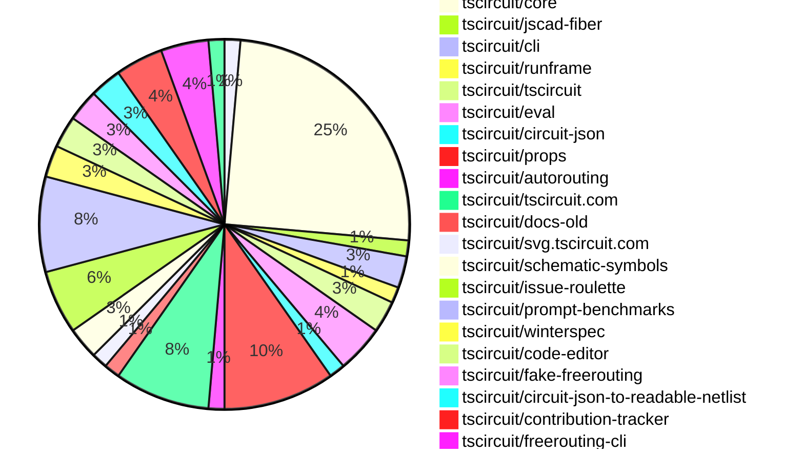

# Contribution Overview 2025-01-22

## PRs by Repository

## Contributor Overview

| Contributor | 🐳 Major | 🐙 Minor | 🐌 Tiny | ⭐ | Issues Created |
|-------------|---------|---------|---------|-----|----------------|
| [seveibar](#seveibar) | 4 | 16 | 0 | 👑 | 72 |
| [imrishabh18](#imrishabh18) | 1 | 13 | 0 | ⭐⭐⭐ | 7 |
| [ShiboSoftwareDev](#ShiboSoftwareDev) | 1 | 8 | 0 | ⭐⭐ | 9 |
| [Anshgrover23](#Anshgrover23) | 2 | 3 | 0 | ⭐⭐ | 5 |
| [techmannih](#techmannih) | 0 | 6 | 0 | ⭐⭐ | 5 |
| [ArnavK-09](#ArnavK-09) | 2 | 1 | 0 | ⭐ | 0 |
| [kom-senapati](#kom-senapati) | 0 | 4 | 0 | ⭐ | 3 |
| [Abse2001](#Abse2001) | 1 | 2 | 0 | ⭐ | 0 |
| [Ayushjhawar8](#Ayushjhawar8) | 1 | 0 | 2 | ⭐ | 1 |
| [krushnarout](#krushnarout) | 1 | 1 | 0 | ⭐ | 0 |
| [AnasSarkiz](#AnasSarkiz) | 1 | 0 | 0 | ⭐ | 1 |
| [devin-ai-integration[bot]](#devin-ai-integration[bot]) | 0 | 1 | 0 |  | 0 |
| [Rishikesh63](#Rishikesh63) | 0 | 1 | 0 |  | 0 |

## Review Table

[reviews-received-hover]: ## "Number of reviews received for PRs for this contributor"
[approvals-received-hover]: ## "Number of approvals received for PRs this contributor authored"
[rejections-received-hover]: ## "Number of rejections received for PRs this contributor authored"
[prs-opened-hover]: ## "Number of PRs opened by this contributor"
[issues-created-hover]: ## "Number of issues created by this contributor"
[bountied-issues-hover]: ## "Number of issues this contributor created with a bounty"
[bountied-issue-$-hover]: ## "Total bounty amount placed on issues authored by this contributor"

| Contributor | Reviews Received | Approvals Received | Rejections Received | Approvals | Rejections | PRs Opened | PRs Merged | Issues Created | Bountied Issues | Bountied Issue $ |
|---|---|---|---|---|---|---|---|---|---|---|
| [kom-senapati](#kom-senapati) | 24 | 6 | 8 | 0 | 0 | 10 | 4 | 3 | 1 | 2 |
| [seveibar](#seveibar) | 0 | 0 | 0 | 32 | 18 | 22 | 20 | 72 | 60 | 930 |
| [Ayushjhawar8](#Ayushjhawar8) | 19 | 3 | 8 | 0 | 0 | 6 | 3 | 1 | 0 | 0 |
| [krushnarout](#krushnarout) | 14 | 1 | 3 | 0 | 0 | 3 | 2 | 0 | 0 | 0 |
| [imrishabh18](#imrishabh18) | 9 | 1 | 0 | 2 | 7 | 15 | 14 | 7 | 2 | 15 |
| [Anshgrover23](#Anshgrover23) | 19 | 4 | 2 | 4 | 15 | 10 | 5 | 5 | 1 | 10 |
| [ArnavK-09](#ArnavK-09) | 9 | 4 | 2 | 0 | 0 | 4 | 3 | 0 | 0 | 0 |
| [devin-ai-integration[bot]](#devin-ai-integration[bot]) | 0 | 0 | 0 | 0 | 0 | 3 | 1 | 0 | 0 | 0 |
| [techmannih](#techmannih) | 26 | 8 | 10 | 0 | 0 | 11 | 6 | 5 | 0 | 0 |
| [ShiboSoftwareDev](#ShiboSoftwareDev) | 5 | 5 | 0 | 0 | 0 | 10 | 9 | 9 | 5 | 47 |
| [AbhinavTheDev](#AbhinavTheDev) | 5 | 0 | 2 | 0 | 0 | 1 | 0 | 0 | 0 | 0 |
| [Rishikesh63](#Rishikesh63) | 4 | 1 | 2 | 0 | 0 | 1 | 1 | 0 | 0 | 0 |
| [mdkaifansari04](#mdkaifansari04) | 1 | 0 | 1 | 0 | 0 | 2 | 0 | 0 | 0 | 0 |
| [ARYPROGRAMMER](#ARYPROGRAMMER) | 1 | 0 | 0 | 0 | 0 | 1 | 0 | 0 | 0 | 0 |
| [mojafa](#mojafa) | 0 | 0 | 0 | 0 | 0 | 1 | 0 | 0 | 0 | 0 |
| [Abse2001](#Abse2001) | 11 | 4 | 1 | 0 | 0 | 3 | 3 | 0 | 0 | 0 |
| [Girma35](#Girma35) | 0 | 0 | 0 | 0 | 0 | 1 | 0 | 0 | 0 | 0 |
| [MustafaMulla29](#MustafaMulla29) | 2 | 0 | 1 | 0 | 0 | 1 | 0 | 0 | 0 | 0 |
| [AnasSarkiz](#AnasSarkiz) | 1 | 1 | 0 | 0 | 0 | 1 | 1 | 1 | 0 | 0 |

## Changes by Repository

### [tscircuit/pcb-viewer](https://github.com/tscircuit/pcb-viewer)

| PR # | Impact | Contributor | Description |
|------|--------|-------------|-------------|
| [#141](https://github.com/tscircuit/pcb-viewer/pull/141) | 🐙 Minor | kom-senapati | The pull request disables the default behavior of the PCB viewer to focus on the element when the mouse hovers over it, and adds a new `focusOnHover` prop to allow enabling this feature if required. |

### [tscircuit/core](https://github.com/tscircuit/core)

| PR # | Impact | Contributor | Description |
|------|--------|-------------|-------------|
| [#552](https://github.com/tscircuit/core/pull/552) | 🐳 Major | seveibar | Implement the `internallyConnectedPorts` feature and add the default `<pushbutton />` internallyConnectedPorts. |
| [#549](https://github.com/tscircuit/core/pull/549) | 🐳 Major | seveibar | Introduces the `sel` object, which provides a type-safe way to access various electronic component properties and connections. |
| [#543](https://github.com/tscircuit/core/pull/543) | 🐳 Major | seveibar | Add support for subcircuit-dependent autorouting |
| [#554](https://github.com/tscircuit/core/pull/554) | 🐙 Minor | kom-senapati | Adds a function to create traces from externallyConnectedPorts in the Chip component |
| [#574](https://github.com/tscircuit/core/pull/574) | 🐙 Minor | seveibar | Use `getInheritedProperty` for `partsEngine` in `NormalComponent`. |
| [#576](https://github.com/tscircuit/core/pull/576) | 🐙 Minor | seveibar | Adds the subcircuit ID to the request body when using the simplified autorouting/solve endpoint. |
| [#563](https://github.com/tscircuit/core/pull/563) | 🐙 Minor | seveibar | Adds support for new margin syntax to match web standards. |
| [#555](https://github.com/tscircuit/core/pull/555) | 🐙 Minor | seveibar | Change the naming of `internallyConnectedPorts` to `internallyConnectedPins` throughout the codebase. |
| [#553](https://github.com/tscircuit/core/pull/553) | 🐙 Minor | seveibar | Renames `schPortArrangement` to `schPinArrangement` while maintaining backwards compatibility. |
| [#551](https://github.com/tscircuit/core/pull/551) | 🐙 Minor | seveibar | Fixes an issue where source ports were not being created for footprints if the schematic symbol had fewer pins. |
| [#546](https://github.com/tscircuit/core/pull/546) | 🐙 Minor | seveibar | Fix reconciler constants import that was preventing core in NextJS |
| [#579](https://github.com/tscircuit/core/pull/579) | 🐙 Minor | techmannih | Add support for polarized capacitor symbol |
| [#565](https://github.com/tscircuit/core/pull/565) | 🐙 Minor | techmannih | Adds support for board outlines without specifying width and height, with the dimensions computed from the outline points. |
| [#559](https://github.com/tscircuit/core/pull/559) | 🐙 Minor | imrishabh18 | The pull request adds a new test case to verify the footprinter for the SOIC4 component using the autocloud service. |
| [#561](https://github.com/tscircuit/core/pull/561) | 🐙 Minor | imrishabh18 | Move `react-reconciler` from `devDependencies` to `dependencies`. |
| [#557](https://github.com/tscircuit/core/pull/557) | 🐙 Minor | imrishabh18 | Add the getTestFixture function to the test file for example11-net-symbol.test.tsx |
| [#545](https://github.com/tscircuit/core/pull/545) | 🐙 Minor | imrishabh18 | Optimized the circuit JSON sent to the autorouter and added the `subcircuit_id` field. |
| [#539](https://github.com/tscircuit/core/pull/539) | 🐙 Minor | imrishabh18 | Add subcircuit_id and pcb_group_id to primitive components |

### [tscircuit/jscad-fiber](https://github.com/tscircuit/jscad-fiber)

| PR # | Impact | Contributor | Description |
|------|--------|-------------|-------------|
| [#103](https://github.com/tscircuit/jscad-fiber/pull/103) | 🐙 Minor | kom-senapati | Separate Three.js-specific exports into a separate module (`three.tsx`) to avoid bundling Three.js in projects that don't use it. |

### [tscircuit/cli](https://github.com/tscircuit/cli)

| PR # | Impact | Contributor | Description |
|------|--------|-------------|-------------|
| [#39](https://github.com/tscircuit/cli/pull/39) | 🐳 Major | ArnavK-09 | Adds two new commands to the CLI: `tsci auth set-token` to manually set the authentication token, and `tsci auth print-token` to print the current authentication token. |
| [#40](https://github.com/tscircuit/cli/pull/40) | 🐙 Minor | kom-senapati | Added the registry configuration to the cloned project |

### [tscircuit/runframe](https://github.com/tscircuit/runframe)

| PR # | Impact | Contributor | Description |
|------|--------|-------------|-------------|
| [#164](https://github.com/tscircuit/runframe/pull/164) | 🐳 Major | Ayushjhawar8 | Adds a red square stop/pause button to the run button in the RunFrame component. |

### [tscircuit/tscircuit](https://github.com/tscircuit/tscircuit)

| PR # | Impact | Contributor | Description |
|------|--------|-------------|-------------|
| [#513](https://github.com/tscircuit/tscircuit/pull/513) | 🐌 Tiny | Ayushjhawar8 | Fixed the header in the documentation's example preview image. |
| [#512](https://github.com/tscircuit/tscircuit/pull/512) | 🐌 Tiny | Ayushjhawar8 | Adds two new images to the project's documentation |

### [tscircuit/eval](https://github.com/tscircuit/eval)

| PR # | Impact | Contributor | Description |
|------|--------|-------------|-------------|
| [#91](https://github.com/tscircuit/eval/pull/91) | 🐳 Major | seveibar | Adds the `Eval` export, which includes the `CircuitRunner` class that provides an API for executing circuits. |
| [#92](https://github.com/tscircuit/eval/pull/92) | 🐙 Minor | seveibar | Adds TypeScript type definitions to the package exports |
| [#89](https://github.com/tscircuit/eval/pull/89) | 🐙 Minor | seveibar | Add an alias "tscircuit" for "@tscircuit/core" in the pre-supplied imports. |

### [tscircuit/circuit-json](https://github.com/tscircuit/circuit-json)

| PR # | Impact | Contributor | Description |
|------|--------|-------------|-------------|
| [#125](https://github.com/tscircuit/circuit-json/pull/125) | 🐙 Minor | seveibar | Add a new optional field `parent_subcircuit_id` to the `source_group` type. |

### [tscircuit/props](https://github.com/tscircuit/props)

| PR # | Impact | Contributor | Description |
|------|--------|-------------|-------------|
| [#148](https://github.com/tscircuit/props/pull/148) | 🐳 Major | ShiboSoftwareDev | Adds a script to generate component types for the TSCircuit project. |
| [#154](https://github.com/tscircuit/props/pull/154) | 🐙 Minor | seveibar | Refactor the convention of `schPinStyle` to use the standard `marginLeft`, `marginRight`, `marginTop`, and `marginBottom` properties instead of the deprecated `leftMargin`, `rightMargin`, `topMargin`, and `bottomMargin` properties. |
| [#153](https://github.com/tscircuit/props/pull/153) | 🐙 Minor | seveibar | Renames `schPortArrangement` to `schPinArrangement` and `internallyConnectedPorts` to `internallyConnectedPins`, and adds a default configuration for internally connected push button pins. |
| [#152](https://github.com/tscircuit/props/pull/152) | 🐙 Minor | seveibar | Add `internallyConnectedPorts` and `externallyConnectedPorts` properties to the `ChipOptions` type. |
| [#156](https://github.com/tscircuit/props/pull/156) | 🐙 Minor | devin-ai-integration[bot] | Update the traceProps definition to allow maxLength as a distance type. |
| [#151](https://github.com/tscircuit/props/pull/151) | 🐙 Minor | techmannih | Add support for pill-shaped SMT pads in the PCB layout component. |
| [#147](https://github.com/tscircuit/props/pull/147) | 🐙 Minor | ShiboSoftwareDev | Cleanup folder structure by organizing component files in the `lib/components` directory. |

### [tscircuit/autorouting](https://github.com/tscircuit/autorouting)

| PR # | Impact | Contributor | Description |
|------|--------|-------------|-------------|
| [#110](https://github.com/tscircuit/autorouting/pull/110) | 🐙 Minor | seveibar | The change ignores already routed traces when getting simple route JSON. |

### [tscircuit/tscircuit.com](https://github.com/tscircuit/tscircuit.com)

| PR # | Impact | Contributor | Description |
|------|--------|-------------|-------------|
| [#611](https://github.com/tscircuit/tscircuit.com/pull/611) | 🐙 Minor | seveibar | Update the version of `@tscircuit/core` dependency to `0.0.280` |
| [#605](https://github.com/tscircuit/tscircuit.com/pull/605) | 🐙 Minor | seveibar | Synchronous Snippet "tscircuit" import is now allowed |
| [#619](https://github.com/tscircuit/tscircuit.com/pull/619) | 🐙 Minor | ShiboSoftwareDev | Fixes the prefetch functionality to correctly determine the component name from the link URL. |
| [#618](https://github.com/tscircuit/tscircuit.com/pull/618) | 🐙 Minor | imrishabh18 | Debounce the searched snippet query |
| [#615](https://github.com/tscircuit/tscircuit.com/pull/615) | 🐙 Minor | imrishabh18 | Update the `circuit-json-to-readable-netlist` library to version `0.0.7`. |
| [#604](https://github.com/tscircuit/tscircuit.com/pull/604) | 🐙 Minor | imrishabh18 | Fixes the preview page by using the `runframe` library to render the circuit preview. |

### [tscircuit/docs-old](https://github.com/tscircuit/docs-old)

| PR # | Impact | Contributor | Description |
|------|--------|-------------|-------------|
| [#59](https://github.com/tscircuit/docs-old/pull/59) | 🐳 Major | krushnarout | The pull request moves the project's documentation from Mintlify to Docusaurus. |

### [tscircuit/svg.tscircuit.com](https://github.com/tscircuit/svg.tscircuit.com)

| PR # | Impact | Contributor | Description |
|------|--------|-------------|-------------|
| [#5](https://github.com/tscircuit/svg.tscircuit.com/pull/5) | 🐙 Minor | krushnarout | Adds support for rendering circuits without a `<board />` component. |

### [tscircuit/schematic-symbols](https://github.com/tscircuit/schematic-symbols)

| PR # | Impact | Contributor | Description |
|------|--------|-------------|-------------|
| [#236](https://github.com/tscircuit/schematic-symbols/pull/236) | 🐙 Minor | techmannih | Improve the push button symbol by modifying the paths and adding new paths. |
| [#238](https://github.com/tscircuit/schematic-symbols/pull/238) | 🐙 Minor | Rishikesh63 | Fixes improper arrow rendering in the darlington pair transistor and n-channel d MOSFET transistor symbols. |

### [tscircuit/issue-roulette](https://github.com/tscircuit/issue-roulette)

| PR # | Impact | Contributor | Description |
|------|--------|-------------|-------------|
| [#8](https://github.com/tscircuit/issue-roulette/pull/8) | 🐳 Major | Anshgrover23 | Adds a filter to the Issue Roulette component to allow users to view all issues, bountied issues, or unbountied issues. |
| [#11](https://github.com/tscircuit/issue-roulette/pull/11) | 🐙 Minor | techmannih | Adds a GitHub badge to the project's homepage. |
| [#14](https://github.com/tscircuit/issue-roulette/pull/14) | 🐙 Minor | techmannih | Update the page title in the metadata object. |
| [#17](https://github.com/tscircuit/issue-roulette/pull/17) | 🐙 Minor | Anshgrover23 | Add workflows for type checking and code formatting |

### [tscircuit/prompt-benchmarks](https://github.com/tscircuit/prompt-benchmarks)

| PR # | Impact | Contributor | Description |
|------|--------|-------------|-------------|
| [#19](https://github.com/tscircuit/prompt-benchmarks/pull/19) | 🐙 Minor | ShiboSoftwareDev |  |
| [#18](https://github.com/tscircuit/prompt-benchmarks/pull/18) | 🐙 Minor | ShiboSoftwareDev | Modified the prompt for the tscircuit API documentation. |
| [#16](https://github.com/tscircuit/prompt-benchmarks/pull/16) | 🐙 Minor | ShiboSoftwareDev | Adds functionality to save the system prompt into a file and save a reference to the file name. |
| [#15](https://github.com/tscircuit/prompt-benchmarks/pull/15) | 🐙 Minor | ShiboSoftwareDev | The pull request changes the way code is displayed in the output by displaying the entire code block instead of just the code contents. |
| [#14](https://github.com/tscircuit/prompt-benchmarks/pull/14) | 🐙 Minor | ShiboSoftwareDev | Adds error reporting to the `benchmark.eval.ts` file and modifies the `experimental_customColumns` function to handle string outputs. |
| [#13](https://github.com/tscircuit/prompt-benchmarks/pull/13) | 🐙 Minor | ShiboSoftwareDev | Enhances the prompt to create more realistic circuit boards for the tscircuit AI benchmarking process. |

### [tscircuit/winterspec](https://github.com/tscircuit/winterspec)

| PR # | Impact | Contributor | Description |
|------|--------|-------------|-------------|
| [#27](https://github.com/tscircuit/winterspec/pull/27) | 🐳 Major | ArnavK-09 |  |
| [#29](https://github.com/tscircuit/winterspec/pull/29) | 🐙 Minor | ArnavK-09 | Adds a new CI workflow to run tests with Bun and fixes an issue with the previous Node.js-based CI workflow. |

### [tscircuit/code-editor](https://github.com/tscircuit/code-editor)

| PR # | Impact | Contributor | Description |
|------|--------|-------------|-------------|
| [#9](https://github.com/tscircuit/code-editor/pull/9) | 🐳 Major | imrishabh18 | Adds a GitHub Actions workflow to publish the package to npm. |
| [#10](https://github.com/tscircuit/code-editor/pull/10) | 🐙 Minor | imrishabh18 | Build config updated and folder structure fixed |

### [tscircuit/fake-freerouting](https://github.com/tscircuit/fake-freerouting)

| PR # | Impact | Contributor | Description |
|------|--------|-------------|-------------|
| [#21](https://github.com/tscircuit/fake-freerouting/pull/21) | 🐙 Minor | imrishabh18 | Update the version of `dsn-converter` in the `peerDependencies` section from `0.0.41` to `0.0.57`. |
| [#20](https://github.com/tscircuit/fake-freerouting/pull/20) | 🐙 Minor | imrishabh18 | Update the `@tscircuit/infgrid-ijump-astar` dependency to version `^0.0.34`. |

### [tscircuit/circuit-json-to-readable-netlist](https://github.com/tscircuit/circuit-json-to-readable-netlist)

| PR # | Impact | Contributor | Description |
|------|--------|-------------|-------------|
| [#7](https://github.com/tscircuit/circuit-json-to-readable-netlist/pull/7) | 🐙 Minor | imrishabh18 | Update dependencies for `@tscircuit/core` and `circuit-json` packages |
| [#8](https://github.com/tscircuit/circuit-json-to-readable-netlist/pull/8) | 🐙 Minor | imrishabh18 | Update the GitHub Actions workflow to use the latest version of the Bun runtime and run the format check instead of the automatic formatting. |

### [tscircuit/contribution-tracker](https://github.com/tscircuit/contribution-tracker)

| PR # | Impact | Contributor | Description |
|------|--------|-------------|-------------|
| [#41](https://github.com/tscircuit/contribution-tracker/pull/41) | 🐳 Major | Anshgrover23 | This pull request sets up the frontend for a contribution tracker, which fetches and displays data about contributors to the tscircuit project. |
| [#39](https://github.com/tscircuit/contribution-tracker/pull/39) | 🐙 Minor | Anshgrover23 | Add major, minor, tiny, and stars statistics to the contributor's information in the generated markdown. |
| [#37](https://github.com/tscircuit/contribution-tracker/pull/37) | 🐙 Minor | Anshgrover23 | Change the PR scoring to only count distinct PRs reviewed, instead of raw review counts. |

### [tscircuit/freerouting-cli](https://github.com/tscircuit/freerouting-cli)

| PR # | Impact | Contributor | Description |
|------|--------|-------------|-------------|
| [#8](https://github.com/tscircuit/freerouting-cli/pull/8) | 🐳 Major | Abse2001 | This pull request adds a new function `routeUsingLocalFreerouting` that runs the freerouting tool locally using Docker and tests it. |
| [#10](https://github.com/tscircuit/freerouting-cli/pull/10) | 🐙 Minor | Abse2001 | Added a new library to the package.json files. |
| [#9](https://github.com/tscircuit/freerouting-cli/pull/9) | 🐙 Minor | Abse2001 | Improved the `freerouting-docker-manager.ts` file and removed unnecessary container stop. |

### [tscircuit/elkjs-evaluation](https://github.com/tscircuit/elkjs-evaluation)

| PR # | Impact | Contributor | Description |
|------|--------|-------------|-------------|
| [#2](https://github.com/tscircuit/elkjs-evaluation/pull/2) | 🐳 Major | AnasSarkiz | Added Bootstrap ElkJS Evaluation |

## Changes by Contributor

### [kom-senapati](https://github.com/kom-senapati)

| PR # | Impact | Description |
|------|--------|-------------|
| [#141](https://github.com/tscircuit/pcb-viewer/pull/141) | 🐙 Minor | The pull request disables the default behavior of the PCB viewer to focus on the element when the mouse hovers over it, and adds a new `focusOnHover` prop to allow enabling this feature if required. |
| [#554](https://github.com/tscircuit/core/pull/554) | 🐙 Minor | Adds a function to create traces from externallyConnectedPorts in the Chip component |
| [#103](https://github.com/tscircuit/jscad-fiber/pull/103) | 🐙 Minor | Separate Three.js-specific exports into a separate module (`three.tsx`) to avoid bundling Three.js in projects that don't use it. |
| [#40](https://github.com/tscircuit/cli/pull/40) | 🐙 Minor | Added the registry configuration to the cloned project |

### [Ayushjhawar8](https://github.com/Ayushjhawar8)

| PR # | Impact | Description |
|------|--------|-------------|
| [#164](https://github.com/tscircuit/runframe/pull/164) | 🐳 Major | Adds a red square stop/pause button to the run button in the RunFrame component. |
| [#513](https://github.com/tscircuit/tscircuit/pull/513) | 🐌 Tiny | Fixed the header in the documentation's example preview image. |
| [#512](https://github.com/tscircuit/tscircuit/pull/512) | 🐌 Tiny | Adds two new images to the project's documentation |

### [seveibar](https://github.com/seveibar)

| PR # | Impact | Description |
|------|--------|-------------|
| [#552](https://github.com/tscircuit/core/pull/552) | 🐳 Major | Implement the `internallyConnectedPorts` feature and add the default `<pushbutton />` internallyConnectedPorts. |
| [#549](https://github.com/tscircuit/core/pull/549) | 🐳 Major | Introduces the `sel` object, which provides a type-safe way to access various electronic component properties and connections. |
| [#543](https://github.com/tscircuit/core/pull/543) | 🐳 Major | Add support for subcircuit-dependent autorouting |
| [#91](https://github.com/tscircuit/eval/pull/91) | 🐳 Major | Adds the `Eval` export, which includes the `CircuitRunner` class that provides an API for executing circuits. |
| [#125](https://github.com/tscircuit/circuit-json/pull/125) | 🐙 Minor | Add a new optional field `parent_subcircuit_id` to the `source_group` type. |
| [#154](https://github.com/tscircuit/props/pull/154) | 🐙 Minor | Refactor the convention of `schPinStyle` to use the standard `marginLeft`, `marginRight`, `marginTop`, and `marginBottom` properties instead of the deprecated `leftMargin`, `rightMargin`, `topMargin`, and `bottomMargin` properties. |
| [#153](https://github.com/tscircuit/props/pull/153) | 🐙 Minor | Renames `schPortArrangement` to `schPinArrangement` and `internallyConnectedPorts` to `internallyConnectedPins`, and adds a default configuration for internally connected push button pins. |
| [#152](https://github.com/tscircuit/props/pull/152) | 🐙 Minor | Add `internallyConnectedPorts` and `externallyConnectedPorts` properties to the `ChipOptions` type. |
| [#574](https://github.com/tscircuit/core/pull/574) | 🐙 Minor | Use `getInheritedProperty` for `partsEngine` in `NormalComponent`. |
| [#576](https://github.com/tscircuit/core/pull/576) | 🐙 Minor | Adds the subcircuit ID to the request body when using the simplified autorouting/solve endpoint. |
| [#563](https://github.com/tscircuit/core/pull/563) | 🐙 Minor | Adds support for new margin syntax to match web standards. |
| [#555](https://github.com/tscircuit/core/pull/555) | 🐙 Minor | Change the naming of `internallyConnectedPorts` to `internallyConnectedPins` throughout the codebase. |
| [#553](https://github.com/tscircuit/core/pull/553) | 🐙 Minor | Renames `schPortArrangement` to `schPinArrangement` while maintaining backwards compatibility. |
| [#551](https://github.com/tscircuit/core/pull/551) | 🐙 Minor | Fixes an issue where source ports were not being created for footprints if the schematic symbol had fewer pins. |
| [#546](https://github.com/tscircuit/core/pull/546) | 🐙 Minor | Fix reconciler constants import that was preventing core in NextJS |
| [#110](https://github.com/tscircuit/autorouting/pull/110) | 🐙 Minor | The change ignores already routed traces when getting simple route JSON. |
| [#611](https://github.com/tscircuit/tscircuit.com/pull/611) | 🐙 Minor | Update the version of `@tscircuit/core` dependency to `0.0.280` |
| [#605](https://github.com/tscircuit/tscircuit.com/pull/605) | 🐙 Minor | Synchronous Snippet "tscircuit" import is now allowed |
| [#92](https://github.com/tscircuit/eval/pull/92) | 🐙 Minor | Adds TypeScript type definitions to the package exports |
| [#89](https://github.com/tscircuit/eval/pull/89) | 🐙 Minor | Add an alias "tscircuit" for "@tscircuit/core" in the pre-supplied imports. |

### [krushnarout](https://github.com/krushnarout)

| PR # | Impact | Description |
|------|--------|-------------|
| [#59](https://github.com/tscircuit/docs-old/pull/59) | 🐳 Major | The pull request moves the project's documentation from Mintlify to Docusaurus. |
| [#5](https://github.com/tscircuit/svg.tscircuit.com/pull/5) | 🐙 Minor | Adds support for rendering circuits without a `<board />` component. |

### [devin-ai-integration[bot]](https://github.com/devin-ai-integration[bot])

| PR # | Impact | Description |
|------|--------|-------------|
| [#156](https://github.com/tscircuit/props/pull/156) | 🐙 Minor | Update the traceProps definition to allow maxLength as a distance type. |

### [techmannih](https://github.com/techmannih)

| PR # | Impact | Description |
|------|--------|-------------|
| [#151](https://github.com/tscircuit/props/pull/151) | 🐙 Minor | Add support for pill-shaped SMT pads in the PCB layout component. |
| [#579](https://github.com/tscircuit/core/pull/579) | 🐙 Minor | Add support for polarized capacitor symbol |
| [#565](https://github.com/tscircuit/core/pull/565) | 🐙 Minor | Adds support for board outlines without specifying width and height, with the dimensions computed from the outline points. |
| [#236](https://github.com/tscircuit/schematic-symbols/pull/236) | 🐙 Minor | Improve the push button symbol by modifying the paths and adding new paths. |
| [#11](https://github.com/tscircuit/issue-roulette/pull/11) | 🐙 Minor | Adds a GitHub badge to the project's homepage. |
| [#14](https://github.com/tscircuit/issue-roulette/pull/14) | 🐙 Minor | Update the page title in the metadata object. |

### [ShiboSoftwareDev](https://github.com/ShiboSoftwareDev)

| PR # | Impact | Description |
|------|--------|-------------|
| [#148](https://github.com/tscircuit/props/pull/148) | 🐳 Major | Adds a script to generate component types for the TSCircuit project. |
| [#147](https://github.com/tscircuit/props/pull/147) | 🐙 Minor | Cleanup folder structure by organizing component files in the `lib/components` directory. |
| [#619](https://github.com/tscircuit/tscircuit.com/pull/619) | 🐙 Minor | Fixes the prefetch functionality to correctly determine the component name from the link URL. |
| [#19](https://github.com/tscircuit/prompt-benchmarks/pull/19) | 🐙 Minor |  |
| [#18](https://github.com/tscircuit/prompt-benchmarks/pull/18) | 🐙 Minor | Modified the prompt for the tscircuit API documentation. |
| [#16](https://github.com/tscircuit/prompt-benchmarks/pull/16) | 🐙 Minor | Adds functionality to save the system prompt into a file and save a reference to the file name. |
| [#15](https://github.com/tscircuit/prompt-benchmarks/pull/15) | 🐙 Minor | The pull request changes the way code is displayed in the output by displaying the entire code block instead of just the code contents. |
| [#14](https://github.com/tscircuit/prompt-benchmarks/pull/14) | 🐙 Minor | Adds error reporting to the `benchmark.eval.ts` file and modifies the `experimental_customColumns` function to handle string outputs. |
| [#13](https://github.com/tscircuit/prompt-benchmarks/pull/13) | 🐙 Minor | Enhances the prompt to create more realistic circuit boards for the tscircuit AI benchmarking process. |

### [ArnavK-09](https://github.com/ArnavK-09)

| PR # | Impact | Description |
|------|--------|-------------|
| [#27](https://github.com/tscircuit/winterspec/pull/27) | 🐳 Major |  |
| [#39](https://github.com/tscircuit/cli/pull/39) | 🐳 Major | Adds two new commands to the CLI: `tsci auth set-token` to manually set the authentication token, and `tsci auth print-token` to print the current authentication token. |
| [#29](https://github.com/tscircuit/winterspec/pull/29) | 🐙 Minor | Adds a new CI workflow to run tests with Bun and fixes an issue with the previous Node.js-based CI workflow. |

### [imrishabh18](https://github.com/imrishabh18)

| PR # | Impact | Description |
|------|--------|-------------|
| [#9](https://github.com/tscircuit/code-editor/pull/9) | 🐳 Major | Adds a GitHub Actions workflow to publish the package to npm. |
| [#559](https://github.com/tscircuit/core/pull/559) | 🐙 Minor | The pull request adds a new test case to verify the footprinter for the SOIC4 component using the autocloud service. |
| [#561](https://github.com/tscircuit/core/pull/561) | 🐙 Minor | Move `react-reconciler` from `devDependencies` to `dependencies`. |
| [#557](https://github.com/tscircuit/core/pull/557) | 🐙 Minor | Add the getTestFixture function to the test file for example11-net-symbol.test.tsx |
| [#545](https://github.com/tscircuit/core/pull/545) | 🐙 Minor | Optimized the circuit JSON sent to the autorouter and added the `subcircuit_id` field. |
| [#539](https://github.com/tscircuit/core/pull/539) | 🐙 Minor | Add subcircuit_id and pcb_group_id to primitive components |
| [#618](https://github.com/tscircuit/tscircuit.com/pull/618) | 🐙 Minor | Debounce the searched snippet query |
| [#615](https://github.com/tscircuit/tscircuit.com/pull/615) | 🐙 Minor | Update the `circuit-json-to-readable-netlist` library to version `0.0.7`. |
| [#604](https://github.com/tscircuit/tscircuit.com/pull/604) | 🐙 Minor | Fixes the preview page by using the `runframe` library to render the circuit preview. |
| [#21](https://github.com/tscircuit/fake-freerouting/pull/21) | 🐙 Minor | Update the version of `dsn-converter` in the `peerDependencies` section from `0.0.41` to `0.0.57`. |
| [#20](https://github.com/tscircuit/fake-freerouting/pull/20) | 🐙 Minor | Update the `@tscircuit/infgrid-ijump-astar` dependency to version `^0.0.34`. |
| [#7](https://github.com/tscircuit/circuit-json-to-readable-netlist/pull/7) | 🐙 Minor | Update dependencies for `@tscircuit/core` and `circuit-json` packages |
| [#8](https://github.com/tscircuit/circuit-json-to-readable-netlist/pull/8) | 🐙 Minor | Update the GitHub Actions workflow to use the latest version of the Bun runtime and run the format check instead of the automatic formatting. |
| [#10](https://github.com/tscircuit/code-editor/pull/10) | 🐙 Minor | Build config updated and folder structure fixed |

### [Anshgrover23](https://github.com/Anshgrover23)

| PR # | Impact | Description |
|------|--------|-------------|
| [#41](https://github.com/tscircuit/contribution-tracker/pull/41) | 🐳 Major | This pull request sets up the frontend for a contribution tracker, which fetches and displays data about contributors to the tscircuit project. |
| [#8](https://github.com/tscircuit/issue-roulette/pull/8) | 🐳 Major | Adds a filter to the Issue Roulette component to allow users to view all issues, bountied issues, or unbountied issues. |
| [#39](https://github.com/tscircuit/contribution-tracker/pull/39) | 🐙 Minor | Add major, minor, tiny, and stars statistics to the contributor's information in the generated markdown. |
| [#37](https://github.com/tscircuit/contribution-tracker/pull/37) | 🐙 Minor | Change the PR scoring to only count distinct PRs reviewed, instead of raw review counts. |
| [#17](https://github.com/tscircuit/issue-roulette/pull/17) | 🐙 Minor | Add workflows for type checking and code formatting |

### [Rishikesh63](https://github.com/Rishikesh63)

| PR # | Impact | Description |
|------|--------|-------------|
| [#238](https://github.com/tscircuit/schematic-symbols/pull/238) | 🐙 Minor | Fixes improper arrow rendering in the darlington pair transistor and n-channel d MOSFET transistor symbols. |

### [Abse2001](https://github.com/Abse2001)

| PR # | Impact | Description |
|------|--------|-------------|
| [#8](https://github.com/tscircuit/freerouting-cli/pull/8) | 🐳 Major | This pull request adds a new function `routeUsingLocalFreerouting` that runs the freerouting tool locally using Docker and tests it. |
| [#10](https://github.com/tscircuit/freerouting-cli/pull/10) | 🐙 Minor | Added a new library to the package.json files. |
| [#9](https://github.com/tscircuit/freerouting-cli/pull/9) | 🐙 Minor | Improved the `freerouting-docker-manager.ts` file and removed unnecessary container stop. |

### [AnasSarkiz](https://github.com/AnasSarkiz)

| PR # | Impact | Description |
|------|--------|-------------|
| [#2](https://github.com/tscircuit/elkjs-evaluation/pull/2) | 🐳 Major | Added Bootstrap ElkJS Evaluation |

