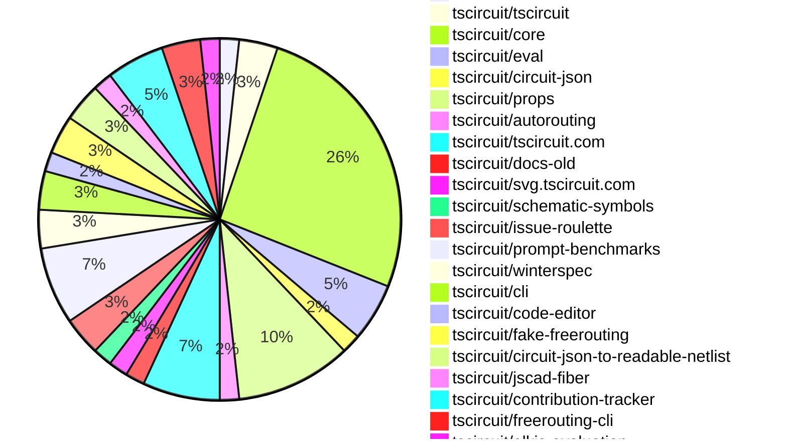

# Contribution Overview 2025-01-22

## PRs by Repository

## Contributor Overview

| Contributor | 🐳 Major | 🐙 Minor | 🐌 Tiny | ⭐ | Issues Created |
|-------------|---------|---------|---------|-----|----------------|
| [seveibar](#seveibar) | 3 | 15 | 0 | 👑 | 59 |
| [imrishabh18](#imrishabh18) | 2 | 8 | 2 | ⭐⭐ | 4 |
| [ShiboSoftwareDev](#ShiboSoftwareDev) | 1 | 5 | 0 | ⭐⭐ | 5 |
| [Anshgrover23](#Anshgrover23) | 1 | 3 | 0 | ⭐ | 3 |
| [krushnarout](#krushnarout) | 2 | 0 | 0 | ⭐ | 0 |
| [techmannih](#techmannih) | 0 | 4 | 0 | ⭐ | 5 |
| [ArnavK-09](#ArnavK-09) | 1 | 2 | 0 | ⭐ | 0 |
| [kom-senapati](#kom-senapati) | 1 | 2 | 0 | ⭐ | 3 |
| [Ayushjhawar8](#Ayushjhawar8) | 1 | 0 | 2 | ⭐ | 1 |
| [Abse2001](#Abse2001) | 1 | 1 | 0 | ⭐ | 0 |
| [AnasSarkiz](#AnasSarkiz) | 1 | 0 | 0 | ⭐ | 1 |

## Review Table

[reviews-received-hover]: ## "Number of reviews received for PRs for this contributor"
[approvals-received-hover]: ## "Number of approvals received for PRs this contributor authored"
[rejections-received-hover]: ## "Number of rejections received for PRs this contributor authored"
[prs-opened-hover]: ## "Number of PRs opened by this contributor"
[issues-created-hover]: ## "Number of issues created by this contributor"
[bountied-issues-hover]: ## "Number of issues this contributor created with a bounty"
[bountied-issue-$-hover]: ## "Total bounty amount placed on issues authored by this contributor"

| Contributor | Reviews Received | Approvals Received | Rejections Received | Approvals | Rejections | PRs Opened | PRs Merged | Issues Created | Bountied Issues | Bountied Issue $ |
|---|---|---|---|---|---|---|---|---|---|---|
| [Ayushjhawar8](#Ayushjhawar8) | 14 | 3 | 5 | 0 | 0 | 5 | 3 | 1 | 0 | 0 |
| [seveibar](#seveibar) | 0 | 0 | 0 | 26 | 12 | 19 | 18 | 59 | 47 | 714 |
| [krushnarout](#krushnarout) | 14 | 1 | 3 | 0 | 0 | 3 | 2 | 0 | 0 | 0 |
| [imrishabh18](#imrishabh18) | 8 | 0 | 0 | 0 | 4 | 14 | 12 | 4 | 1 | 10 |
| [Anshgrover23](#Anshgrover23) | 19 | 4 | 2 | 2 | 7 | 8 | 4 | 3 | 0 | 0 |
| [ArnavK-09](#ArnavK-09) | 8 | 4 | 1 | 0 | 0 | 4 | 3 | 0 | 0 | 0 |
| [techmannih](#techmannih) | 15 | 4 | 5 | 0 | 0 | 9 | 4 | 5 | 0 | 0 |
| [kom-senapati](#kom-senapati) | 15 | 4 | 5 | 0 | 0 | 7 | 3 | 3 | 1 | 2 |
| [ShiboSoftwareDev](#ShiboSoftwareDev) | 4 | 4 | 0 | 0 | 0 | 7 | 6 | 5 | 3 | 25 |
| [AbhinavTheDev](#AbhinavTheDev) | 1 | 0 | 1 | 0 | 0 | 1 | 0 | 0 | 0 | 0 |
| [devin-ai-integration[bot]](#devin-ai-integration[bot]) | 0 | 0 | 0 | 0 | 0 | 2 | 0 | 0 | 0 | 0 |
| [mdkaifansari04](#mdkaifansari04) | 1 | 0 | 1 | 0 | 0 | 2 | 0 | 0 | 0 | 0 |
| [ARYPROGRAMMER](#ARYPROGRAMMER) | 1 | 0 | 0 | 0 | 0 | 1 | 0 | 0 | 0 | 0 |
| [mojafa](#mojafa) | 0 | 0 | 0 | 0 | 0 | 1 | 0 | 0 | 0 | 0 |
| [Abse2001](#Abse2001) | 7 | 3 | 0 | 0 | 0 | 2 | 2 | 0 | 0 | 0 |
| [Girma35](#Girma35) | 0 | 0 | 0 | 0 | 0 | 1 | 0 | 0 | 0 | 0 |
| [AnasSarkiz](#AnasSarkiz) | 1 | 1 | 0 | 0 | 0 | 1 | 1 | 1 | 0 | 0 |

## Changes by Repository

### [tscircuit/runframe](https://github.com/tscircuit/runframe)

| PR # | Impact | Contributor | Description |
|------|--------|-------------|-------------|
| [#164](https://github.com/tscircuit/runframe/pull/164) | 🐳 Major | Ayushjhawar8 | Adds a red square stop/pause button to the run button in the RunFrame component. |

### [tscircuit/tscircuit](https://github.com/tscircuit/tscircuit)

| PR # | Impact | Contributor | Description |
|------|--------|-------------|-------------|
| [#513](https://github.com/tscircuit/tscircuit/pull/513) | 🐌 Tiny | Ayushjhawar8 | Fix the header in the documentation image. |
| [#512](https://github.com/tscircuit/tscircuit/pull/512) | 🐌 Tiny | Ayushjhawar8 | Adds new images to the project's documentation |

### [tscircuit/core](https://github.com/tscircuit/core)

| PR # | Impact | Contributor | Description |
|------|--------|-------------|-------------|
| [#549](https://github.com/tscircuit/core/pull/549) | 🐳 Major | seveibar | Introduce a new `sel` object that provides a type-safe way to access various circuit elements and their pins. |
| [#543](https://github.com/tscircuit/core/pull/543) | 🐳 Major | seveibar | Adds support for subcircuit-dependent autorouting in the RootCircuit and Group components. |
| [#545](https://github.com/tscircuit/core/pull/545) | 🐳 Major | imrishabh18 | Optimized the circuit JSON sent to the autorouter by including only the `Source_` and `Pcb_` elements, and added the `subcircuit_id` to the request. |
| [#554](https://github.com/tscircuit/core/pull/554) | 🐳 Major | kom-senapati | Introduces a new feature to create traces from externally connected ports in the `<Chip />` component. |
| [#563](https://github.com/tscircuit/core/pull/563) | 🐙 Minor | seveibar | Adds support for new margin syntax (to match web standards) in the `getNumericSchPinStyle` function. |
| [#555](https://github.com/tscircuit/core/pull/555) | 🐙 Minor | seveibar | Renames `internallyConnectedPorts` to `internallyConnectedPins` in the codebase. |
| [#553](https://github.com/tscircuit/core/pull/553) | 🐙 Minor | seveibar | Rename `schPortArrangement` to `schPinArrangement` with backwards compatibility |
| [#552](https://github.com/tscircuit/core/pull/552) | 🐙 Minor | seveibar | Implement the `_getInternallyConnectedPorts()` method in the `NormalComponent` class, and add a default implementation for the `<pushbutton />` component's `internallyConnectedPorts` property. |
| [#551](https://github.com/tscircuit/core/pull/551) | 🐙 Minor | seveibar | This pull request fixes a bug where source ports were not being created for footprints if the schematic symbol has fewer pins. |
| [#546](https://github.com/tscircuit/core/pull/546) | 🐙 Minor | seveibar | Fix reconciler constants import that was preventing core in NextJS |
| [#565](https://github.com/tscircuit/core/pull/565) | 🐙 Minor | techmannih | Adds support for defining a PCB board's outline without specifying its width and height, which are then computed from the outline. |
| [#559](https://github.com/tscircuit/core/pull/559) | 🐙 Minor | imrishabh18 | Verify the correctness of the footprinter SOIC4 component using autocloud. |
| [#561](https://github.com/tscircuit/core/pull/561) | 🐙 Minor | imrishabh18 | Move `react-reconciler` from dev dependency to runtime dependency |
| [#539](https://github.com/tscircuit/core/pull/539) | 🐙 Minor | imrishabh18 | Add subcircuit_id and pcb_group_id to primitive components. |
| [#557](https://github.com/tscircuit/core/pull/557) | 🐌 Tiny | imrishabh18 | Removes unused import `RootCircuit` and adds `getTestFixture` import. |

### [tscircuit/eval](https://github.com/tscircuit/eval)

| PR # | Impact | Contributor | Description |
|------|--------|-------------|-------------|
| [#91](https://github.com/tscircuit/eval/pull/91) | 🐳 Major | seveibar | Add Eval Export |
| [#92](https://github.com/tscircuit/eval/pull/92) | 🐙 Minor | seveibar | Added types to the exports in the package.json file. |
| [#89](https://github.com/tscircuit/eval/pull/89) | 🐙 Minor | seveibar | Allow importing "tscircuit" and alias it to "@tscircuit/core" |

### [tscircuit/circuit-json](https://github.com/tscircuit/circuit-json)

| PR # | Impact | Contributor | Description |
|------|--------|-------------|-------------|
| [#125](https://github.com/tscircuit/circuit-json/pull/125) | 🐙 Minor | seveibar | Adds a new optional field `parent_subcircuit_id` to the `source_group` schema. |

### [tscircuit/props](https://github.com/tscircuit/props)

| PR # | Impact | Contributor | Description |
|------|--------|-------------|-------------|
| [#148](https://github.com/tscircuit/props/pull/148) | 🐳 Major | ShiboSoftwareDev | Adds a script to generate component types for a TSCircuit project. |
| [#154](https://github.com/tscircuit/props/pull/154) | 🐙 Minor | seveibar | Renames the `leftMargin`, `rightMargin`, `topMargin`, and `bottomMargin` properties in the `SchematicPinStyle` type to match the CSS convention of `marginLeft`, `marginRight`, `marginTop`, and `marginBottom`. |
| [#153](https://github.com/tscircuit/props/pull/153) | 🐙 Minor | seveibar | Rename schPortArrangement to schPinArrangement, rename internallyConnectedPorts to internallyConnectedPins |
| [#152](https://github.com/tscircuit/props/pull/152) | 🐙 Minor | seveibar | Adds two new properties, `internallyConnectedPorts` and `externallyConnectedPorts`, to the `ChipProps` interface. |
| [#151](https://github.com/tscircuit/props/pull/151) | 🐙 Minor | techmannih | Add support for pill-shaped SMT pads. |
| [#147](https://github.com/tscircuit/props/pull/147) | 🐙 Minor | ShiboSoftwareDev | Cleanup folder structure by moving files to the appropriate "lib/components" directory. |

### [tscircuit/autorouting](https://github.com/tscircuit/autorouting)

| PR # | Impact | Contributor | Description |
|------|--------|-------------|-------------|
| [#110](https://github.com/tscircuit/autorouting/pull/110) | 🐙 Minor | seveibar | Ignore already routed traces when getting simple route JSON |

### [tscircuit/tscircuit.com](https://github.com/tscircuit/tscircuit.com)

| PR # | Impact | Contributor | Description |
|------|--------|-------------|-------------|
| [#611](https://github.com/tscircuit/tscircuit.com/pull/611) | 🐙 Minor | seveibar | Update the version of `@tscircuit/core` to `0.0.280` to enable using "sel" |
| [#605](https://github.com/tscircuit/tscircuit.com/pull/605) | 🐙 Minor | seveibar | Allows synchronous snippet "tscircuit" import in the "use-run-tsx" hook. |
| [#615](https://github.com/tscircuit/tscircuit.com/pull/615) | 🐙 Minor | imrishabh18 | Update the `circuit-json-to-readable-netlist` library to version 0.0.7. |
| [#604](https://github.com/tscircuit/tscircuit.com/pull/604) | 🐙 Minor | imrishabh18 | Fix the preview page by using the `runframe` library instead of the deprecated `PCBViewer`, `CadViewer`, and `CircuitToSvgWithMouseControl` components. |

### [tscircuit/docs-old](https://github.com/tscircuit/docs-old)

| PR # | Impact | Contributor | Description |
|------|--------|-------------|-------------|
| [#59](https://github.com/tscircuit/docs-old/pull/59) | 🐳 Major | krushnarout | The pull request ports the existing documentation from Mintlify to Docusaurus, a popular open-source documentation framework. |

### [tscircuit/svg.tscircuit.com](https://github.com/tscircuit/svg.tscircuit.com)

| PR # | Impact | Contributor | Description |
|------|--------|-------------|-------------|
| [#5](https://github.com/tscircuit/svg.tscircuit.com/pull/5) | 🐳 Major | krushnarout | Add support for rendering circuits without a `<board />` component |

### [tscircuit/schematic-symbols](https://github.com/tscircuit/schematic-symbols)

| PR # | Impact | Contributor | Description |
|------|--------|-------------|-------------|
| [#236](https://github.com/tscircuit/schematic-symbols/pull/236) | 🐙 Minor | techmannih | Improves the symbol for a push button that is normally open and momentary. |

### [tscircuit/issue-roulette](https://github.com/tscircuit/issue-roulette)

| PR # | Impact | Contributor | Description |
|------|--------|-------------|-------------|
| [#14](https://github.com/tscircuit/issue-roulette/pull/14) | 🐙 Minor | techmannih | Update the title of the metadata object. |
| [#8](https://github.com/tscircuit/issue-roulette/pull/8) | 🐙 Minor | Anshgrover23 | Adds a filter to the "Issue Roulette" feature to allow users to select between "All Issues", "Bountied Issues", and "Unbountied Issues". |

### [tscircuit/prompt-benchmarks](https://github.com/tscircuit/prompt-benchmarks)

| PR # | Impact | Contributor | Description |
|------|--------|-------------|-------------|
| [#16](https://github.com/tscircuit/prompt-benchmarks/pull/16) | 🐙 Minor | ShiboSoftwareDev | Saves the system prompt into a file and saves a reference to the file name. |
| [#15](https://github.com/tscircuit/prompt-benchmarks/pull/15) | 🐙 Minor | ShiboSoftwareDev | Modify the code to display the full code block instead of just the code inside the block. |
| [#14](https://github.com/tscircuit/prompt-benchmarks/pull/14) | 🐙 Minor | ShiboSoftwareDev | Adds error reporting to the `benchmark.eval.ts` file, and adds custom columns to the `experimental_customColumns` function. |
| [#13](https://github.com/tscircuit/prompt-benchmarks/pull/13) | 🐙 Minor | ShiboSoftwareDev | Enhances the prompt to create more sane circuit boards for the benchmarking experience. |

### [tscircuit/winterspec](https://github.com/tscircuit/winterspec)

| PR # | Impact | Contributor | Description |
|------|--------|-------------|-------------|
| [#27](https://github.com/tscircuit/winterspec/pull/27) | 🐳 Major | ArnavK-09 | Implements a new command "generate-ky-types" to generate TypeScript interfaces compatible with the typed-ky library, based on the route specifications defined in the application. |
| [#29](https://github.com/tscircuit/winterspec/pull/29) | 🐙 Minor | ArnavK-09 | Adds a new CI workflow to run tests with Bun and fixes the old Node check CI. |

### [tscircuit/cli](https://github.com/tscircuit/cli)

| PR # | Impact | Contributor | Description |
|------|--------|-------------|-------------|
| [#39](https://github.com/tscircuit/cli/pull/39) | 🐙 Minor | ArnavK-09 | Adds new commands "tsci auth set-token" and "tsci auth print-token" to the CLI |
| [#40](https://github.com/tscircuit/cli/pull/40) | 🐙 Minor | kom-senapati | Adds the registry to the cloned project's .npmrc file |

### [tscircuit/code-editor](https://github.com/tscircuit/code-editor)

| PR # | Impact | Contributor | Description |
|------|--------|-------------|-------------|
| [#9](https://github.com/tscircuit/code-editor/pull/9) | 🐳 Major | imrishabh18 | Adds a GitHub workflow to automatically publish the package to npm on push to the main branch. |

### [tscircuit/fake-freerouting](https://github.com/tscircuit/fake-freerouting)

| PR # | Impact | Contributor | Description |
|------|--------|-------------|-------------|
| [#20](https://github.com/tscircuit/fake-freerouting/pull/20) | 🐙 Minor | imrishabh18 | Update the version of the `@tscircuit/infgrid-ijump-astar` dependency from `0.0.24` to `0.0.34`. |
| [#21](https://github.com/tscircuit/fake-freerouting/pull/21) | 🐌 Tiny | imrishabh18 | Update the version of the `dsn-converter` dependency in the `package.json` file. |

### [tscircuit/circuit-json-to-readable-netlist](https://github.com/tscircuit/circuit-json-to-readable-netlist)

| PR # | Impact | Contributor | Description |
|------|--------|-------------|-------------|
| [#7](https://github.com/tscircuit/circuit-json-to-readable-netlist/pull/7) | 🐙 Minor | imrishabh18 | Update core dependencies to newer versions |
| [#8](https://github.com/tscircuit/circuit-json-to-readable-netlist/pull/8) | 🐙 Minor | imrishabh18 | Updates the bun-formatcheck.yml workflow to use the latest version of the setup-bun action and the bun run format:check command for checking the code format. |

### [tscircuit/jscad-fiber](https://github.com/tscircuit/jscad-fiber)

| PR # | Impact | Contributor | Description |
|------|--------|-------------|-------------|
| [#103](https://github.com/tscircuit/jscad-fiber/pull/103) | 🐙 Minor | kom-senapati | Isolate functions requiring Three.js into a separate entrypoint |

### [tscircuit/contribution-tracker](https://github.com/tscircuit/contribution-tracker)

| PR # | Impact | Contributor | Description |
|------|--------|-------------|-------------|
| [#41](https://github.com/tscircuit/contribution-tracker/pull/41) | 🐳 Major | Anshgrover23 | This pull request sets up the frontend for a contribution tracker application, which fetches and displays contributor stats from a GitHub repository. |
| [#39](https://github.com/tscircuit/contribution-tracker/pull/39) | 🐙 Minor | Anshgrover23 | Adds fields for "Major", "Minor", "Tiny", and "stars" to the contributor stats in the generated Markdown. |
| [#37](https://github.com/tscircuit/contribution-tracker/pull/37) | 🐙 Minor | Anshgrover23 | Ensures that review counts only contribute to a contributor's score once per pull request. |

### [tscircuit/freerouting-cli](https://github.com/tscircuit/freerouting-cli)

| PR # | Impact | Contributor | Description |
|------|--------|-------------|-------------|
| [#8](https://github.com/tscircuit/freerouting-cli/pull/8) | 🐳 Major | Abse2001 | Adds a new function `routeUsingLocalFreerouting` that runs the freerouting tool locally using Docker and provides tests for it. |
| [#9](https://github.com/tscircuit/freerouting-cli/pull/9) | 🐙 Minor | Abse2001 | Improved the `freerouting-docker-manager.ts` file and removed unnecessary container stop. |

### [tscircuit/elkjs-evaluation](https://github.com/tscircuit/elkjs-evaluation)

| PR # | Impact | Contributor | Description |
|------|--------|-------------|-------------|
| [#2](https://github.com/tscircuit/elkjs-evaluation/pull/2) | 🐳 Major | AnasSarkiz | Added Bootstrap ElkJS Evaluation |

## Changes by Contributor

### [Ayushjhawar8](https://github.com/Ayushjhawar8)

| PR # | Impact | Description |
|------|--------|-------------|
| [#164](https://github.com/tscircuit/runframe/pull/164) | 🐳 Major | Adds a red square stop/pause button to the run button in the RunFrame component. |
| [#513](https://github.com/tscircuit/tscircuit/pull/513) | 🐌 Tiny | Fix the header in the documentation image. |
| [#512](https://github.com/tscircuit/tscircuit/pull/512) | 🐌 Tiny | Adds new images to the project's documentation |

### [seveibar](https://github.com/seveibar)

| PR # | Impact | Description |
|------|--------|-------------|
| [#549](https://github.com/tscircuit/core/pull/549) | 🐳 Major | Introduce a new `sel` object that provides a type-safe way to access various circuit elements and their pins. |
| [#543](https://github.com/tscircuit/core/pull/543) | 🐳 Major | Adds support for subcircuit-dependent autorouting in the RootCircuit and Group components. |
| [#91](https://github.com/tscircuit/eval/pull/91) | 🐳 Major | Add Eval Export |
| [#125](https://github.com/tscircuit/circuit-json/pull/125) | 🐙 Minor | Adds a new optional field `parent_subcircuit_id` to the `source_group` schema. |
| [#154](https://github.com/tscircuit/props/pull/154) | 🐙 Minor | Renames the `leftMargin`, `rightMargin`, `topMargin`, and `bottomMargin` properties in the `SchematicPinStyle` type to match the CSS convention of `marginLeft`, `marginRight`, `marginTop`, and `marginBottom`. |
| [#153](https://github.com/tscircuit/props/pull/153) | 🐙 Minor | Rename schPortArrangement to schPinArrangement, rename internallyConnectedPorts to internallyConnectedPins |
| [#152](https://github.com/tscircuit/props/pull/152) | 🐙 Minor | Adds two new properties, `internallyConnectedPorts` and `externallyConnectedPorts`, to the `ChipProps` interface. |
| [#563](https://github.com/tscircuit/core/pull/563) | 🐙 Minor | Adds support for new margin syntax (to match web standards) in the `getNumericSchPinStyle` function. |
| [#555](https://github.com/tscircuit/core/pull/555) | 🐙 Minor | Renames `internallyConnectedPorts` to `internallyConnectedPins` in the codebase. |
| [#553](https://github.com/tscircuit/core/pull/553) | 🐙 Minor | Rename `schPortArrangement` to `schPinArrangement` with backwards compatibility |
| [#552](https://github.com/tscircuit/core/pull/552) | 🐙 Minor | Implement the `_getInternallyConnectedPorts()` method in the `NormalComponent` class, and add a default implementation for the `<pushbutton />` component's `internallyConnectedPorts` property. |
| [#551](https://github.com/tscircuit/core/pull/551) | 🐙 Minor | This pull request fixes a bug where source ports were not being created for footprints if the schematic symbol has fewer pins. |
| [#546](https://github.com/tscircuit/core/pull/546) | 🐙 Minor | Fix reconciler constants import that was preventing core in NextJS |
| [#110](https://github.com/tscircuit/autorouting/pull/110) | 🐙 Minor | Ignore already routed traces when getting simple route JSON |
| [#611](https://github.com/tscircuit/tscircuit.com/pull/611) | 🐙 Minor | Update the version of `@tscircuit/core` to `0.0.280` to enable using "sel" |
| [#605](https://github.com/tscircuit/tscircuit.com/pull/605) | 🐙 Minor | Allows synchronous snippet "tscircuit" import in the "use-run-tsx" hook. |
| [#92](https://github.com/tscircuit/eval/pull/92) | 🐙 Minor | Added types to the exports in the package.json file. |
| [#89](https://github.com/tscircuit/eval/pull/89) | 🐙 Minor | Allow importing "tscircuit" and alias it to "@tscircuit/core" |

### [krushnarout](https://github.com/krushnarout)

| PR # | Impact | Description |
|------|--------|-------------|
| [#59](https://github.com/tscircuit/docs-old/pull/59) | 🐳 Major | The pull request ports the existing documentation from Mintlify to Docusaurus, a popular open-source documentation framework. |
| [#5](https://github.com/tscircuit/svg.tscircuit.com/pull/5) | 🐳 Major | Add support for rendering circuits without a `<board />` component |

### [techmannih](https://github.com/techmannih)

| PR # | Impact | Description |
|------|--------|-------------|
| [#151](https://github.com/tscircuit/props/pull/151) | 🐙 Minor | Add support for pill-shaped SMT pads. |
| [#565](https://github.com/tscircuit/core/pull/565) | 🐙 Minor | Adds support for defining a PCB board's outline without specifying its width and height, which are then computed from the outline. |
| [#236](https://github.com/tscircuit/schematic-symbols/pull/236) | 🐙 Minor | Improves the symbol for a push button that is normally open and momentary. |
| [#14](https://github.com/tscircuit/issue-roulette/pull/14) | 🐙 Minor | Update the title of the metadata object. |

### [ShiboSoftwareDev](https://github.com/ShiboSoftwareDev)

| PR # | Impact | Description |
|------|--------|-------------|
| [#148](https://github.com/tscircuit/props/pull/148) | 🐳 Major | Adds a script to generate component types for a TSCircuit project. |
| [#147](https://github.com/tscircuit/props/pull/147) | 🐙 Minor | Cleanup folder structure by moving files to the appropriate "lib/components" directory. |
| [#16](https://github.com/tscircuit/prompt-benchmarks/pull/16) | 🐙 Minor | Saves the system prompt into a file and saves a reference to the file name. |
| [#15](https://github.com/tscircuit/prompt-benchmarks/pull/15) | 🐙 Minor | Modify the code to display the full code block instead of just the code inside the block. |
| [#14](https://github.com/tscircuit/prompt-benchmarks/pull/14) | 🐙 Minor | Adds error reporting to the `benchmark.eval.ts` file, and adds custom columns to the `experimental_customColumns` function. |
| [#13](https://github.com/tscircuit/prompt-benchmarks/pull/13) | 🐙 Minor | Enhances the prompt to create more sane circuit boards for the benchmarking experience. |

### [ArnavK-09](https://github.com/ArnavK-09)

| PR # | Impact | Description |
|------|--------|-------------|
| [#27](https://github.com/tscircuit/winterspec/pull/27) | 🐳 Major | Implements a new command "generate-ky-types" to generate TypeScript interfaces compatible with the typed-ky library, based on the route specifications defined in the application. |
| [#29](https://github.com/tscircuit/winterspec/pull/29) | 🐙 Minor | Adds a new CI workflow to run tests with Bun and fixes the old Node check CI. |
| [#39](https://github.com/tscircuit/cli/pull/39) | 🐙 Minor | Adds new commands "tsci auth set-token" and "tsci auth print-token" to the CLI |

### [imrishabh18](https://github.com/imrishabh18)

| PR # | Impact | Description |
|------|--------|-------------|
| [#545](https://github.com/tscircuit/core/pull/545) | 🐳 Major | Optimized the circuit JSON sent to the autorouter by including only the `Source_` and `Pcb_` elements, and added the `subcircuit_id` to the request. |
| [#9](https://github.com/tscircuit/code-editor/pull/9) | 🐳 Major | Adds a GitHub workflow to automatically publish the package to npm on push to the main branch. |
| [#559](https://github.com/tscircuit/core/pull/559) | 🐙 Minor | Verify the correctness of the footprinter SOIC4 component using autocloud. |
| [#561](https://github.com/tscircuit/core/pull/561) | 🐙 Minor | Move `react-reconciler` from dev dependency to runtime dependency |
| [#539](https://github.com/tscircuit/core/pull/539) | 🐙 Minor | Add subcircuit_id and pcb_group_id to primitive components. |
| [#615](https://github.com/tscircuit/tscircuit.com/pull/615) | 🐙 Minor | Update the `circuit-json-to-readable-netlist` library to version 0.0.7. |
| [#604](https://github.com/tscircuit/tscircuit.com/pull/604) | 🐙 Minor | Fix the preview page by using the `runframe` library instead of the deprecated `PCBViewer`, `CadViewer`, and `CircuitToSvgWithMouseControl` components. |
| [#20](https://github.com/tscircuit/fake-freerouting/pull/20) | 🐙 Minor | Update the version of the `@tscircuit/infgrid-ijump-astar` dependency from `0.0.24` to `0.0.34`. |
| [#7](https://github.com/tscircuit/circuit-json-to-readable-netlist/pull/7) | 🐙 Minor | Update core dependencies to newer versions |
| [#8](https://github.com/tscircuit/circuit-json-to-readable-netlist/pull/8) | 🐙 Minor | Updates the bun-formatcheck.yml workflow to use the latest version of the setup-bun action and the bun run format:check command for checking the code format. |
| [#557](https://github.com/tscircuit/core/pull/557) | 🐌 Tiny | Removes unused import `RootCircuit` and adds `getTestFixture` import. |
| [#21](https://github.com/tscircuit/fake-freerouting/pull/21) | 🐌 Tiny | Update the version of the `dsn-converter` dependency in the `package.json` file. |

### [kom-senapati](https://github.com/kom-senapati)

| PR # | Impact | Description |
|------|--------|-------------|
| [#554](https://github.com/tscircuit/core/pull/554) | 🐳 Major | Introduces a new feature to create traces from externally connected ports in the `<Chip />` component. |
| [#103](https://github.com/tscircuit/jscad-fiber/pull/103) | 🐙 Minor | Isolate functions requiring Three.js into a separate entrypoint |
| [#40](https://github.com/tscircuit/cli/pull/40) | 🐙 Minor | Adds the registry to the cloned project's .npmrc file |

### [Anshgrover23](https://github.com/Anshgrover23)

| PR # | Impact | Description |
|------|--------|-------------|
| [#41](https://github.com/tscircuit/contribution-tracker/pull/41) | 🐳 Major | This pull request sets up the frontend for a contribution tracker application, which fetches and displays contributor stats from a GitHub repository. |
| [#39](https://github.com/tscircuit/contribution-tracker/pull/39) | 🐙 Minor | Adds fields for "Major", "Minor", "Tiny", and "stars" to the contributor stats in the generated Markdown. |
| [#37](https://github.com/tscircuit/contribution-tracker/pull/37) | 🐙 Minor | Ensures that review counts only contribute to a contributor's score once per pull request. |
| [#8](https://github.com/tscircuit/issue-roulette/pull/8) | 🐙 Minor | Adds a filter to the "Issue Roulette" feature to allow users to select between "All Issues", "Bountied Issues", and "Unbountied Issues". |

### [Abse2001](https://github.com/Abse2001)

| PR # | Impact | Description |
|------|--------|-------------|
| [#8](https://github.com/tscircuit/freerouting-cli/pull/8) | 🐳 Major | Adds a new function `routeUsingLocalFreerouting` that runs the freerouting tool locally using Docker and provides tests for it. |
| [#9](https://github.com/tscircuit/freerouting-cli/pull/9) | 🐙 Minor | Improved the `freerouting-docker-manager.ts` file and removed unnecessary container stop. |

### [AnasSarkiz](https://github.com/AnasSarkiz)

| PR # | Impact | Description |
|------|--------|-------------|
| [#2](https://github.com/tscircuit/elkjs-evaluation/pull/2) | 🐳 Major | Added Bootstrap ElkJS Evaluation |

