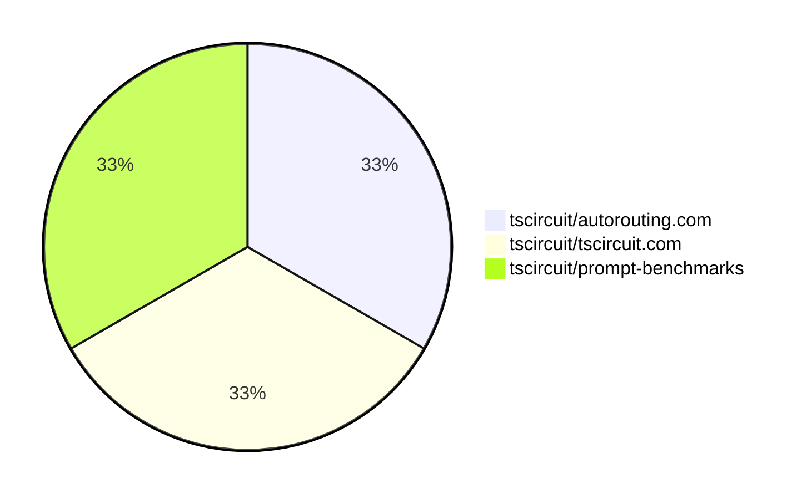

# Contribution Overview 2025-01-29

## PRs by Repository

## Contributor Overview

| Contributor | 🐳 Major | 🐙 Minor | 🐌 Tiny | ⭐ | Issues Created |
|-------------|---------|---------|---------|-----|----------------|
| [Abse2001](#Abse2001) | 1 | 0 | 0 | ⭐ | 0 |
| [ShiboSoftwareDev](#ShiboSoftwareDev) | 1 | 0 | 0 | ⭐ | 1 |
| [imrishabh18](#imrishabh18) | 0 | 1 | 0 |  | 1 |

## Review Table

[reviews-received-hover]: ## "Number of reviews received for PRs for this contributor"
[approvals-received-hover]: ## "Number of approvals received for PRs this contributor authored"
[rejections-received-hover]: ## "Number of rejections received for PRs this contributor authored"
[prs-opened-hover]: ## "Number of PRs opened by this contributor"
[issues-created-hover]: ## "Number of issues created by this contributor"
[bountied-issues-hover]: ## "Number of issues this contributor created with a bounty"
[bountied-issue-$-hover]: ## "Total bounty amount placed on issues authored by this contributor"

| Contributor | Reviews Received | Approvals Received | Rejections Received | Approvals | Rejections | PRs Opened | PRs Merged | Issues Created | Bountied Issues | Bountied Issue $ |
|---|---|---|---|---|---|---|---|---|---|---|
| [Rishikesh63](#Rishikesh63) | 3 | 0 | 3 | 0 | 0 | 1 | 0 | 0 | 0 | 0 |
| [Anshgrover23](#Anshgrover23) | 0 | 0 | 0 | 1 | 4 | 0 | 0 | 1 | 0 | 0 |
| [MustafaMulla29](#MustafaMulla29) | 2 | 1 | 1 | 0 | 0 | 2 | 0 | 0 | 0 | 0 |
| [Abse2001](#Abse2001) | 1 | 1 | 0 | 0 | 0 | 1 | 1 | 0 | 0 | 0 |
| [seveibar](#seveibar) | 0 | 0 | 0 | 1 | 0 | 0 | 0 | 2 | 2 | 32 |
| [imrishabh18](#imrishabh18) | 0 | 0 | 0 | 0 | 0 | 1 | 1 | 1 | 0 | 0 |
| [ShiboSoftwareDev](#ShiboSoftwareDev) | 0 | 0 | 0 | 0 | 0 | 1 | 1 | 1 | 0 | 0 |

## Changes by Repository

### [tscircuit/autorouting.com](https://github.com/tscircuit/autorouting.com)

| PR # | Impact | Contributor | Description |
|------|--------|-------------|-------------|
| [#30](https://github.com/tscircuit/autorouting.com/pull/30) | 🐳 Major | Abse2001 | Adds a new feature to process circuit files locally using the Freerouting autorouter instead of using the server. |

### [tscircuit/tscircuit.com](https://github.com/tscircuit/tscircuit.com)

| PR # | Impact | Contributor | Description |
|------|--------|-------------|-------------|
| [#622](https://github.com/tscircuit/tscircuit.com/pull/622) | 🐙 Minor | imrishabh18 | Fix the issue of not encoding the search parameters in the import snippet dialog. |

### [tscircuit/prompt-benchmarks](https://github.com/tscircuit/prompt-benchmarks)

| PR # | Impact | Contributor | Description |
|------|--------|-------------|-------------|
| [#21](https://github.com/tscircuit/prompt-benchmarks/pull/21) | 🐳 Major | ShiboSoftwareDev | Adds a new set of circuit problems and increases the timeout for the benchmark |

## Changes by Contributor

### [Abse2001](https://github.com/Abse2001)

| PR # | Impact | Description |
|------|--------|-------------|
| [#30](https://github.com/tscircuit/autorouting.com/pull/30) | 🐳 Major | Adds a new feature to process circuit files locally using the Freerouting autorouter instead of using the server. |

### [imrishabh18](https://github.com/imrishabh18)

| PR # | Impact | Description |
|------|--------|-------------|
| [#622](https://github.com/tscircuit/tscircuit.com/pull/622) | 🐙 Minor | Fix the issue of not encoding the search parameters in the import snippet dialog. |

### [ShiboSoftwareDev](https://github.com/ShiboSoftwareDev)

| PR # | Impact | Description |
|------|--------|-------------|
| [#21](https://github.com/tscircuit/prompt-benchmarks/pull/21) | 🐳 Major | Adds a new set of circuit problems and increases the timeout for the benchmark |

