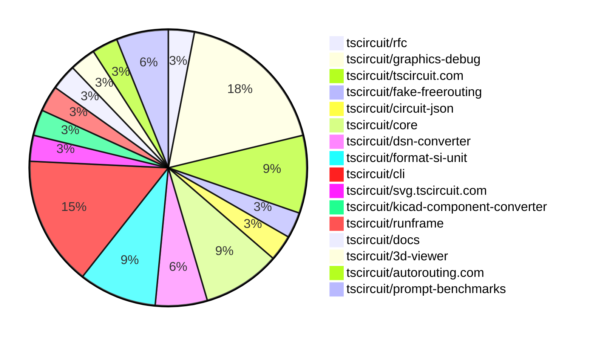

# Contribution Overview 2025-01-29

## PRs by Repository

## Contributor Overview

| Contributor | 🐳 Major | 🐙 Minor | 🐌 Tiny | ⭐ | Issues Created |
|-------------|---------|---------|---------|-----|----------------|
| [seveibar](#seveibar) | 3 | 3 | 0 | ⭐⭐⭐ | 21 |
| [imrishabh18](#imrishabh18) | 2 | 10 | 0 | ⭐⭐ | 2 |
| [ShiboSoftwareDev](#ShiboSoftwareDev) | 2 | 0 | 0 | ⭐⭐ | 10 |
| [ArnavK-09](#ArnavK-09) | 2 | 2 | 2 | ⭐⭐ | 2 |
| [Anshgrover23](#Anshgrover23) | 0 | 2 | 0 | ⭐ | 2 |
| [kom-senapati](#kom-senapati) | 0 | 3 | 0 | ⭐ | 3 |
| [Abse2001](#Abse2001) | 1 | 0 | 0 | ⭐ | 0 |
| [krushnarout](#krushnarout) | 0 | 1 | 0 |  | 0 |

## Review Table

[reviews-received-hover]: ## "Number of reviews received for PRs for this contributor"
[approvals-received-hover]: ## "Number of approvals received for PRs this contributor authored"
[rejections-received-hover]: ## "Number of rejections received for PRs this contributor authored"
[prs-opened-hover]: ## "Number of PRs opened by this contributor"
[issues-created-hover]: ## "Number of issues created by this contributor"
[bountied-issues-hover]: ## "Number of issues this contributor created with a bounty"
[bountied-issue-$-hover]: ## "Total bounty amount placed on issues authored by this contributor"

| Contributor | Reviews Received | Approvals Received | Rejections Received | Approvals | Rejections | PRs Opened | PRs Merged | Issues Created | Bountied Issues | Bountied Issue $ |
|---|---|---|---|---|---|---|---|---|---|---|
| [seveibar](#seveibar) | 0 | 0 | 0 | 16 | 9 | 6 | 6 | 21 | 20 | 266 |
| [imrishabh18](#imrishabh18) | 14 | 2 | 0 | 2 | 1 | 15 | 12 | 2 | 1 | 5 |
| [Rishikesh63](#Rishikesh63) | 3 | 0 | 3 | 0 | 0 | 1 | 0 | 0 | 0 | 0 |
| [Anshgrover23](#Anshgrover23) | 8 | 2 | 5 | 2 | 7 | 4 | 2 | 2 | 1 | 10 |
| [ArnavK-09](#ArnavK-09) | 27 | 8 | 7 | 0 | 0 | 9 | 6 | 2 | 0 | 0 |
| [DrSensor](#DrSensor) | 0 | 0 | 0 | 1 | 0 | 1 | 0 | 3 | 0 | 0 |
| [ARYPROGRAMMER](#ARYPROGRAMMER) | 1 | 0 | 1 | 0 | 0 | 1 | 0 | 0 | 0 | 0 |
| [MustafaMulla29](#MustafaMulla29) | 2 | 1 | 1 | 0 | 0 | 2 | 0 | 0 | 0 | 0 |
| [ShiboSoftwareDev](#ShiboSoftwareDev) | 1 | 1 | 0 | 0 | 2 | 3 | 2 | 10 | 7 | 59 |
| [kom-senapati](#kom-senapati) | 6 | 5 | 0 | 0 | 0 | 5 | 3 | 3 | 1 | 2 |
| [Abse2001](#Abse2001) | 1 | 1 | 0 | 0 | 0 | 1 | 1 | 0 | 0 | 0 |
| [krushnarout](#krushnarout) | 3 | 1 | 2 | 0 | 0 | 1 | 1 | 0 | 0 | 0 |

## Changes by Repository

### [tscircuit/rfc](https://github.com/tscircuit/rfc)

| PR # | Impact | Contributor | Description |
|------|--------|-------------|-------------|
| [#5](https://github.com/tscircuit/rfc/pull/5) | 🐳 Major | seveibar | This pull request introduces a vision for the tscircuit v0.1 release, which aims to make tscircuit more compatible with modern development practices by adding a command-line tool, a GitHub workflow action, and an advanced registry server with features like public and private packages, package bundling, and snapshot testing. |

### [tscircuit/graphics-debug](https://github.com/tscircuit/graphics-debug)

| PR # | Impact | Contributor | Description |
|------|--------|-------------|-------------|
| [#19](https://github.com/tscircuit/graphics-debug/pull/19) | 🐳 Major | seveibar | Adds filtering functionality to the interactive graphics, allows for toggling layers and steps, and centers the graphics around the objects. |
| [#18](https://github.com/tscircuit/graphics-debug/pull/18) | 🐳 Major | seveibar | This pull request cleans up the code, separates it into files, adds React Cosmos for interactive component development, and introduces new features such as tooltips, distance to line segments, and support for more label, step, and layer properties in the graphics objects. |
| [#22](https://github.com/tscircuit/graphics-debug/pull/22) | 🐙 Minor | seveibar | Add full width and height to the SVG container to fix the lines rendering. |
| [#21](https://github.com/tscircuit/graphics-debug/pull/21) | 🐙 Minor | seveibar | Add handling for invalid/undefined color when hovering on a rectangle in the interactive graphics component. |
| [#20](https://github.com/tscircuit/graphics-debug/pull/20) | 🐙 Minor | seveibar | Fix Example Data for Steps |
| [#16](https://github.com/tscircuit/graphics-debug/pull/16) | 🐙 Minor | Anshgrover23 | Add a GitHub badge to the landing page and an example graphics debug JSON file. |

### [tscircuit/tscircuit.com](https://github.com/tscircuit/tscircuit.com)

| PR # | Impact | Contributor | Description |
|------|--------|-------------|-------------|
| [#627](https://github.com/tscircuit/tscircuit.com/pull/627) | 🐳 Major | imrishabh18 | Adds a fake API for the packages in the Bun.sh project. |
| [#622](https://github.com/tscircuit/tscircuit.com/pull/622) | 🐙 Minor | imrishabh18 | Encode the search parameters in the URL to fix a potential security vulnerability. |
| [#624](https://github.com/tscircuit/tscircuit.com/pull/624) | 🐌 Tiny | ArnavK-09 | Updated the external actions used in the bundle-size-analysis workflow to their latest versions. |

### [tscircuit/fake-freerouting](https://github.com/tscircuit/fake-freerouting)

| PR # | Impact | Contributor | Description |
|------|--------|-------------|-------------|
| [#22](https://github.com/tscircuit/fake-freerouting/pull/22) | 🐳 Major | imrishabh18 | Fix for splitting source_trace having more than 3 connected_ports |

### [tscircuit/circuit-json](https://github.com/tscircuit/circuit-json)

| PR # | Impact | Contributor | Description |
|------|--------|-------------|-------------|
| [#126](https://github.com/tscircuit/circuit-json/pull/126) | 🐙 Minor | imrishabh18 | Fix to handle negative numbers in the `convertSiUnitToNumber` function. |

### [tscircuit/core](https://github.com/tscircuit/core)

| PR # | Impact | Contributor | Description |
|------|--------|-------------|-------------|
| [#592](https://github.com/tscircuit/core/pull/592) | 🐙 Minor | imrishabh18 | Update the dependency "format-si-unit" to version 0.0.3 |
| [#589](https://github.com/tscircuit/core/pull/589) | 🐙 Minor | imrishabh18 | Fix parsing of negative value PCB properties. |
| [#588](https://github.com/tscircuit/core/pull/588) | 🐙 Minor | imrishabh18 | Fix the issue where the schematic x and y props were not using the parsed value in mm. |

### [tscircuit/dsn-converter](https://github.com/tscircuit/dsn-converter)

| PR # | Impact | Contributor | Description |
|------|--------|-------------|-------------|
| [#85](https://github.com/tscircuit/dsn-converter/pull/85) | 🐙 Minor | imrishabh18 | Fix the calculation of trace_length, which was previously calculated incorrectly as the width of the polyline path instead of the actual length of the trace. |
| [#84](https://github.com/tscircuit/dsn-converter/pull/84) | 🐙 Minor | imrishabh18 | Add the trace_length property to the pcb_trace object. |

### [tscircuit/format-si-unit](https://github.com/tscircuit/format-si-unit)

| PR # | Impact | Contributor | Description |
|------|--------|-------------|-------------|
| [#4](https://github.com/tscircuit/format-si-unit/pull/4) | 🐙 Minor | imrishabh18 | Update the GitHub Actions workflow to use Bun instead of npm. |
| [#3](https://github.com/tscircuit/format-si-unit/pull/3) | 🐙 Minor | imrishabh18 | Add a GitHub Actions workflow to automatically publish the package to npm on push to the main branch. |
| [#2](https://github.com/tscircuit/format-si-unit/pull/2) | 🐙 Minor | imrishabh18 | Fixes a bug in the `formatSiUnit` function to correctly handle values like "100uF". |

### [tscircuit/cli](https://github.com/tscircuit/cli)

| PR # | Impact | Contributor | Description |
|------|--------|-------------|-------------|
| [#32](https://github.com/tscircuit/cli/pull/32) | 🐳 Major | ArnavK-09 | Automatically refresh import types on file update |
| [#37](https://github.com/tscircuit/cli/pull/37) | 🐙 Minor | krushnarout | Set the default port for the development server to 3020. |
| [#47](https://github.com/tscircuit/cli/pull/47) | 🐙 Minor | kom-senapati | Enforce the use of `.tsx` file extension for the `dev` command. |
| [#45](https://github.com/tscircuit/cli/pull/45) | 🐙 Minor | kom-senapati | Fixes endpoint types issues in the CLI's login and clone functionality. |
| [#42](https://github.com/tscircuit/cli/pull/42) | 🐙 Minor | kom-senapati | Fetch the GitHub username from the session token and store it in the CLI config. |

### [tscircuit/svg.tscircuit.com](https://github.com/tscircuit/svg.tscircuit.com)

| PR # | Impact | Contributor | Description |
|------|--------|-------------|-------------|
| [#6](https://github.com/tscircuit/svg.tscircuit.com/pull/6) | 🐳 Major | ArnavK-09 | Adds an error handling mechanism that returns an SVG with red text if there's an error in the user's code. |

### [tscircuit/kicad-component-converter](https://github.com/tscircuit/kicad-component-converter)

| PR # | Impact | Contributor | Description |
|------|--------|-------------|-------------|
| [#118](https://github.com/tscircuit/kicad-component-converter/pull/118) | 🐙 Minor | ArnavK-09 | Fixes an issue where the `mid` and `stroke` attributes were not being handled properly, leading to default values being used instead. |

### [tscircuit/runframe](https://github.com/tscircuit/runframe)

| PR # | Impact | Contributor | Description |
|------|--------|-------------|-------------|
| [#167](https://github.com/tscircuit/runframe/pull/167) | 🐙 Minor | ArnavK-09 | Fixes an issue where an import error message will be shown and allows rerunning if any worker error occurs. |

### [tscircuit/docs](https://github.com/tscircuit/docs)

| PR # | Impact | Contributor | Description |
|------|--------|-------------|-------------|
| [#2](https://github.com/tscircuit/docs/pull/2) | 🐌 Tiny | ArnavK-09 |  |

### [tscircuit/3d-viewer](https://github.com/tscircuit/3d-viewer)

| PR # | Impact | Contributor | Description |
|------|--------|-------------|-------------|
| [#141](https://github.com/tscircuit/3d-viewer/pull/141) | 🐙 Minor | Anshgrover23 | Adds a new prop `autoRotateDisabled` to the `CadViewer` and `CadViewerContainer` components to allow disabling the automatic rotation of the 3D model. |

### [tscircuit/autorouting.com](https://github.com/tscircuit/autorouting.com)

| PR # | Impact | Contributor | Description |
|------|--------|-------------|-------------|
| [#30](https://github.com/tscircuit/autorouting.com/pull/30) | 🐳 Major | Abse2001 | Introduces a new feature to run the local freerouting autorouter instead of using the server. |

### [tscircuit/prompt-benchmarks](https://github.com/tscircuit/prompt-benchmarks)

| PR # | Impact | Contributor | Description |
|------|--------|-------------|-------------|
| [#22](https://github.com/tscircuit/prompt-benchmarks/pull/22) | 🐳 Major | ShiboSoftwareDev | Fixes a critical bug in the benchmark error correction code, allowing all circuits to pass in both problem sets. |
| [#21](https://github.com/tscircuit/prompt-benchmarks/pull/21) | 🐳 Major | ShiboSoftwareDev | Adds new circuit design problems and increases the timeout for the benchmark evaluation. |

## Changes by Contributor

### [seveibar](https://github.com/seveibar)

| PR # | Impact | Description |
|------|--------|-------------|
| [#5](https://github.com/tscircuit/rfc/pull/5) | 🐳 Major | This pull request introduces a vision for the tscircuit v0.1 release, which aims to make tscircuit more compatible with modern development practices by adding a command-line tool, a GitHub workflow action, and an advanced registry server with features like public and private packages, package bundling, and snapshot testing. |
| [#19](https://github.com/tscircuit/graphics-debug/pull/19) | 🐳 Major | Adds filtering functionality to the interactive graphics, allows for toggling layers and steps, and centers the graphics around the objects. |
| [#18](https://github.com/tscircuit/graphics-debug/pull/18) | 🐳 Major | This pull request cleans up the code, separates it into files, adds React Cosmos for interactive component development, and introduces new features such as tooltips, distance to line segments, and support for more label, step, and layer properties in the graphics objects. |
| [#22](https://github.com/tscircuit/graphics-debug/pull/22) | 🐙 Minor | Add full width and height to the SVG container to fix the lines rendering. |
| [#21](https://github.com/tscircuit/graphics-debug/pull/21) | 🐙 Minor | Add handling for invalid/undefined color when hovering on a rectangle in the interactive graphics component. |
| [#20](https://github.com/tscircuit/graphics-debug/pull/20) | 🐙 Minor | Fix Example Data for Steps |

### [imrishabh18](https://github.com/imrishabh18)

| PR # | Impact | Description |
|------|--------|-------------|
| [#627](https://github.com/tscircuit/tscircuit.com/pull/627) | 🐳 Major | Adds a fake API for the packages in the Bun.sh project. |
| [#22](https://github.com/tscircuit/fake-freerouting/pull/22) | 🐳 Major | Fix for splitting source_trace having more than 3 connected_ports |
| [#126](https://github.com/tscircuit/circuit-json/pull/126) | 🐙 Minor | Fix to handle negative numbers in the `convertSiUnitToNumber` function. |
| [#592](https://github.com/tscircuit/core/pull/592) | 🐙 Minor | Update the dependency "format-si-unit" to version 0.0.3 |
| [#589](https://github.com/tscircuit/core/pull/589) | 🐙 Minor | Fix parsing of negative value PCB properties. |
| [#588](https://github.com/tscircuit/core/pull/588) | 🐙 Minor | Fix the issue where the schematic x and y props were not using the parsed value in mm. |
| [#85](https://github.com/tscircuit/dsn-converter/pull/85) | 🐙 Minor | Fix the calculation of trace_length, which was previously calculated incorrectly as the width of the polyline path instead of the actual length of the trace. |
| [#84](https://github.com/tscircuit/dsn-converter/pull/84) | 🐙 Minor | Add the trace_length property to the pcb_trace object. |
| [#622](https://github.com/tscircuit/tscircuit.com/pull/622) | 🐙 Minor | Encode the search parameters in the URL to fix a potential security vulnerability. |
| [#4](https://github.com/tscircuit/format-si-unit/pull/4) | 🐙 Minor | Update the GitHub Actions workflow to use Bun instead of npm. |
| [#3](https://github.com/tscircuit/format-si-unit/pull/3) | 🐙 Minor | Add a GitHub Actions workflow to automatically publish the package to npm on push to the main branch. |
| [#2](https://github.com/tscircuit/format-si-unit/pull/2) | 🐙 Minor | Fixes a bug in the `formatSiUnit` function to correctly handle values like "100uF". |

### [ArnavK-09](https://github.com/ArnavK-09)

| PR # | Impact | Description |
|------|--------|-------------|
| [#32](https://github.com/tscircuit/cli/pull/32) | 🐳 Major | Automatically refresh import types on file update |
| [#6](https://github.com/tscircuit/svg.tscircuit.com/pull/6) | 🐳 Major | Adds an error handling mechanism that returns an SVG with red text if there's an error in the user's code. |
| [#118](https://github.com/tscircuit/kicad-component-converter/pull/118) | 🐙 Minor | Fixes an issue where the `mid` and `stroke` attributes were not being handled properly, leading to default values being used instead. |
| [#167](https://github.com/tscircuit/runframe/pull/167) | 🐙 Minor | Fixes an issue where an import error message will be shown and allows rerunning if any worker error occurs. |
| [#624](https://github.com/tscircuit/tscircuit.com/pull/624) | 🐌 Tiny | Updated the external actions used in the bundle-size-analysis workflow to their latest versions. |
| [#2](https://github.com/tscircuit/docs/pull/2) | 🐌 Tiny |  |

### [Anshgrover23](https://github.com/Anshgrover23)

| PR # | Impact | Description |
|------|--------|-------------|
| [#141](https://github.com/tscircuit/3d-viewer/pull/141) | 🐙 Minor | Adds a new prop `autoRotateDisabled` to the `CadViewer` and `CadViewerContainer` components to allow disabling the automatic rotation of the 3D model. |
| [#16](https://github.com/tscircuit/graphics-debug/pull/16) | 🐙 Minor | Add a GitHub badge to the landing page and an example graphics debug JSON file. |

### [Abse2001](https://github.com/Abse2001)

| PR # | Impact | Description |
|------|--------|-------------|
| [#30](https://github.com/tscircuit/autorouting.com/pull/30) | 🐳 Major | Introduces a new feature to run the local freerouting autorouter instead of using the server. |

### [ShiboSoftwareDev](https://github.com/ShiboSoftwareDev)

| PR # | Impact | Description |
|------|--------|-------------|
| [#22](https://github.com/tscircuit/prompt-benchmarks/pull/22) | 🐳 Major | Fixes a critical bug in the benchmark error correction code, allowing all circuits to pass in both problem sets. |
| [#21](https://github.com/tscircuit/prompt-benchmarks/pull/21) | 🐳 Major | Adds new circuit design problems and increases the timeout for the benchmark evaluation. |

### [krushnarout](https://github.com/krushnarout)

| PR # | Impact | Description |
|------|--------|-------------|
| [#37](https://github.com/tscircuit/cli/pull/37) | 🐙 Minor | Set the default port for the development server to 3020. |

### [kom-senapati](https://github.com/kom-senapati)

| PR # | Impact | Description |
|------|--------|-------------|
| [#47](https://github.com/tscircuit/cli/pull/47) | 🐙 Minor | Enforce the use of `.tsx` file extension for the `dev` command. |
| [#45](https://github.com/tscircuit/cli/pull/45) | 🐙 Minor | Fixes endpoint types issues in the CLI's login and clone functionality. |
| [#42](https://github.com/tscircuit/cli/pull/42) | 🐙 Minor | Fetch the GitHub username from the session token and store it in the CLI config. |

