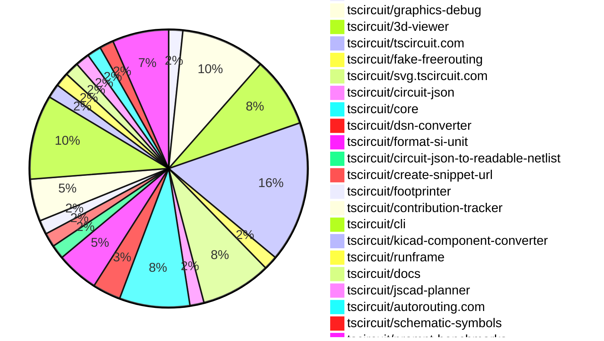

# Contribution Overview 2025-01-29

## PRs by Repository

## Contributor Overview

| Contributor | 🐳 Major | 🐙 Minor | 🐌 Tiny | ⭐ | Issues Created |
|-------------|---------|---------|---------|-----|----------------|
| [imrishabh18](#imrishabh18) | 4 | 18 | 1 | 👑 | 8 |
| [seveibar](#seveibar) | 3 | 4 | 1 | ⭐⭐⭐ | 35 |
| [ShiboSoftwareDev](#ShiboSoftwareDev) | 3 | 1 | 0 | ⭐⭐⭐ | 15 |
| [ArnavK-09](#ArnavK-09) | 3 | 6 | 1 | ⭐⭐ | 3 |
| [kom-senapati](#kom-senapati) | 1 | 3 | 0 | ⭐ | 3 |
| [Anshgrover23](#Anshgrover23) | 0 | 3 | 0 | ⭐ | 2 |
| [techmannih](#techmannih) | 0 | 3 | 0 | ⭐ | 1 |
| [Abse2001](#Abse2001) | 1 | 0 | 0 | ⭐ | 0 |
| [Ayushjhawar8](#Ayushjhawar8) | 0 | 1 | 0 |  | 0 |
| [rohittcodes](#rohittcodes) | 0 | 1 | 0 |  | 0 |
| [MustafaMulla29](#MustafaMulla29) | 0 | 1 | 0 |  | 0 |
| [krushnarout](#krushnarout) | 0 | 1 | 0 |  | 0 |

## Review Table

[reviews-received-hover]: ## "Number of reviews received for PRs for this contributor"
[approvals-received-hover]: ## "Number of approvals received for PRs this contributor authored"
[rejections-received-hover]: ## "Number of rejections received for PRs this contributor authored"
[prs-opened-hover]: ## "Number of PRs opened by this contributor"
[issues-created-hover]: ## "Number of issues created by this contributor"
[bountied-issues-hover]: ## "Number of issues this contributor created with a bounty"
[bountied-issue-$-hover]: ## "Total bounty amount placed on issues authored by this contributor"

| Contributor | Reviews Received | Approvals Received | Rejections Received | Approvals | Rejections | PRs Opened | PRs Merged | Issues Created | Bountied Issues | Bountied Issue $ |
|---|---|---|---|---|---|---|---|---|---|---|
| [DrSensor](#DrSensor) | 0 | 0 | 0 | 1 | 0 | 2 | 0 | 5 | 0 | 0 |
| [seveibar](#seveibar) | 2 | 0 | 0 | 35 | 12 | 9 | 8 | 35 | 28 | 380 |
| [imrishabh18](#imrishabh18) | 18 | 4 | 0 | 2 | 3 | 25 | 23 | 8 | 3 | 20 |
| [Rishikesh63](#Rishikesh63) | 13 | 2 | 8 | 0 | 0 | 2 | 0 | 0 | 0 | 0 |
| [Anshgrover23](#Anshgrover23) | 18 | 4 | 7 | 7 | 21 | 8 | 3 | 2 | 1 | 10 |
| [ShiboSoftwareDev](#ShiboSoftwareDev) | 2 | 2 | 0 | 1 | 2 | 4 | 4 | 15 | 11 | 113 |
| [Ayushjhawar8](#Ayushjhawar8) | 9 | 1 | 4 | 0 | 0 | 2 | 1 | 0 | 0 | 0 |
| [ArnavK-09](#ArnavK-09) | 54 | 14 | 12 | 0 | 0 | 15 | 10 | 3 | 0 | 0 |
| [rohittcodes](#rohittcodes) | 9 | 3 | 2 | 0 | 0 | 3 | 1 | 0 | 0 | 0 |
| [UTK-a-RSH](#UTK-a-RSH) | 0 | 0 | 0 | 0 | 0 | 1 | 0 | 0 | 0 | 0 |
| [ARYPROGRAMMER](#ARYPROGRAMMER) | 1 | 0 | 1 | 0 | 0 | 1 | 0 | 0 | 0 | 0 |
| [MustafaMulla29](#MustafaMulla29) | 3 | 2 | 1 | 0 | 0 | 2 | 1 | 0 | 0 | 0 |
| [kom-senapati](#kom-senapati) | 12 | 8 | 0 | 0 | 0 | 6 | 5 | 3 | 1 | 2 |
| [Abse2001](#Abse2001) | 1 | 1 | 0 | 0 | 0 | 1 | 1 | 0 | 0 | 0 |
| [techmannih](#techmannih) | 5 | 4 | 1 | 0 | 0 | 3 | 3 | 1 | 1 | 2 |
| [krushnarout](#krushnarout) | 3 | 1 | 2 | 0 | 0 | 1 | 1 | 0 | 0 | 0 |

## Changes by Repository

### [tscircuit/rfc](https://github.com/tscircuit/rfc)

| PR # | Impact | Contributor | Description |
|------|--------|-------------|-------------|
| [#5](https://github.com/tscircuit/rfc/pull/5) | 🐳 Major | seveibar | This RFC introduces the vision for the tscircuit v0.1 release, including features like a command-line tool, a modern registry server, and snapshot testing. |

### [tscircuit/graphics-debug](https://github.com/tscircuit/graphics-debug)

| PR # | Impact | Contributor | Description |
|------|--------|-------------|-------------|
| [#19](https://github.com/tscircuit/graphics-debug/pull/19) | 🐳 Major | seveibar | Adds filtering functionality based on layers and steps, and improves the interactive graphics to center around the objects. |
| [#18](https://github.com/tscircuit/graphics-debug/pull/18) | 🐳 Major | seveibar | This pull request exports interactive React components, adds React Cosmos, and adds more support for labels, steps, and layers in the graphics library. |
| [#22](https://github.com/tscircuit/graphics-debug/pull/22) | 🐙 Minor | seveibar | Add full width and height to the SVG container to fix the appearance of the lines. |
| [#21](https://github.com/tscircuit/graphics-debug/pull/21) | 🐙 Minor | seveibar | Add handling for invalid/undefined color when hovering on a rectangle in the interactive graphics component. |
| [#20](https://github.com/tscircuit/graphics-debug/pull/20) | 🐙 Minor | seveibar | Fix the example data for the steps in the interactive2-layer-and-step-filtering.fixture.tsx file. |
| [#16](https://github.com/tscircuit/graphics-debug/pull/16) | 🐙 Minor | Anshgrover23 | Adds a GitHub badge to the landing page and an example button to load a sample graphics JSON file. |

### [tscircuit/3d-viewer](https://github.com/tscircuit/3d-viewer)

| PR # | Impact | Contributor | Description |
|------|--------|-------------|-------------|
| [#143](https://github.com/tscircuit/3d-viewer/pull/143) | 🐳 Major | imrishabh18 | Converts a 3D circuit view to an SVG format. |
| [#145](https://github.com/tscircuit/3d-viewer/pull/145) | 🐙 Minor | seveibar | Bundle the `jscad/modeling` library into the 3D viewer to resolve CommonJS issues. |
| [#141](https://github.com/tscircuit/3d-viewer/pull/141) | 🐙 Minor | Anshgrover23 | Add a new prop `autoRotateDisabled` to the `CadViewer` and `CadViewerContainer` components to allow disabling the automatic rotation of the 3D scene. |
| [#152](https://github.com/tscircuit/3d-viewer/pull/152) | 🐌 Tiny | seveibar | Adds a test to ensure the node bundle can be loaded. |
| [#153](https://github.com/tscircuit/3d-viewer/pull/153) | 🐌 Tiny | imrishabh18 | Fix a type import in the Storybook preview configuration |

### [tscircuit/tscircuit.com](https://github.com/tscircuit/tscircuit.com)

| PR # | Impact | Contributor | Description |
|------|--------|-------------|-------------|
| [#633](https://github.com/tscircuit/tscircuit.com/pull/633) | 🐳 Major | imrishabh18 | The pull request adds the `package_release` fake for the registry, including tests for creating, getting, and listing package releases. |
| [#640](https://github.com/tscircuit/tscircuit.com/pull/640) | 🐙 Minor | imrishabh18 | Reverts a previous update to the `@tscircuit/3d-viewer` and `circuit-json-to-readable-netlist` packages. |
| [#637](https://github.com/tscircuit/tscircuit.com/pull/637) | 🐙 Minor | imrishabh18 | Update packages to fix a format issue |
| [#627](https://github.com/tscircuit/tscircuit.com/pull/627) | 🐙 Minor | imrishabh18 | Adds a fake API for the packages, including tests for creating, deleting, and getting packages. |
| [#622](https://github.com/tscircuit/tscircuit.com/pull/622) | 🐙 Minor | imrishabh18 | Encode the search params in the import-snippet-dialog component to handle special characters in the search query. |
| [#636](https://github.com/tscircuit/tscircuit.com/pull/636) | 🐙 Minor | ArnavK-09 | Adds missing package_release/get logic to handle package name with version. |
| [#599](https://github.com/tscircuit/tscircuit.com/pull/599) | 🐙 Minor | ArnavK-09 | Introduces a new dependency 'circuit-json-to-tscircuit' for importing circuit JSON files |
| [#624](https://github.com/tscircuit/tscircuit.com/pull/624) | 🐙 Minor | ArnavK-09 | Updates the external actions used in the bundle-size-analysis GitHub workflow. |
| [#635](https://github.com/tscircuit/tscircuit.com/pull/635) | 🐙 Minor | techmannih | Change the background color of code snippets to the previous color. |
| [#631](https://github.com/tscircuit/tscircuit.com/pull/631) | 🐙 Minor | techmannih | Adds a skeleton loader for the landing page to improve user experience while the page is loading. |

### [tscircuit/fake-freerouting](https://github.com/tscircuit/fake-freerouting)

| PR # | Impact | Contributor | Description |
|------|--------|-------------|-------------|
| [#22](https://github.com/tscircuit/fake-freerouting/pull/22) | 🐳 Major | imrishabh18 | The pull request fixes an issue where source_trace elements in the circuit JSON have more than 3 connected_ports, by splitting such traces into multiple traces with 2 ports each. |

### [tscircuit/svg.tscircuit.com](https://github.com/tscircuit/svg.tscircuit.com)

| PR # | Impact | Contributor | Description |
|------|--------|-------------|-------------|
| [#22](https://github.com/tscircuit/svg.tscircuit.com/pull/22) | 🐳 Major | imrishabh18 | Adds support for 3D SVG generation |
| [#6](https://github.com/tscircuit/svg.tscircuit.com/pull/6) | 🐳 Major | ArnavK-09 | Adds the ability to return an SVG with red text if there's an error in the code. |
| [#28](https://github.com/tscircuit/svg.tscircuit.com/pull/28) | 🐙 Minor | imrishabh18 | Remove the "three" dependency from the project. |
| [#26](https://github.com/tscircuit/svg.tscircuit.com/pull/26) | 🐙 Minor | imrishabh18 | Updates the tsconfig.json file and next-env.d.ts file to improve TypeScript integration with Next.js. |
| [#21](https://github.com/tscircuit/svg.tscircuit.com/pull/21) | 🐙 Minor | ArnavK-09 | Refactor the `getErrorSvg` function to include better and full-length errors in landscape mode. |

### [tscircuit/circuit-json](https://github.com/tscircuit/circuit-json)

| PR # | Impact | Contributor | Description |
|------|--------|-------------|-------------|
| [#126](https://github.com/tscircuit/circuit-json/pull/126) | 🐙 Minor | imrishabh18 | Fix the function to handle negative numbers in the input. |

### [tscircuit/core](https://github.com/tscircuit/core)

| PR # | Impact | Contributor | Description |
|------|--------|-------------|-------------|
| [#590](https://github.com/tscircuit/core/pull/590) | 🐙 Minor | imrishabh18 | The pull request fixes a bug by breaking up a function to create a separate function for creating a ground symbol for one port instead of a pair of ports. |
| [#592](https://github.com/tscircuit/core/pull/592) | 🐙 Minor | imrishabh18 | Update the version of the "format-si-unit" dependency from 0.0.2 to 0.0.3 |
| [#589](https://github.com/tscircuit/core/pull/589) | 🐙 Minor | imrishabh18 | Fix parsing of negative value PCB properties |
| [#588](https://github.com/tscircuit/core/pull/588) | 🐙 Minor | imrishabh18 | Fix the schematic x and y props using the parsed value in mm. |
| [#584](https://github.com/tscircuit/core/pull/584) | 🐙 Minor | MustafaMulla29 | Modified the bundle-size.yml workflow to post a comment if the bundle size or install size difference is greater than or equal to 10KB (absolute value). |

### [tscircuit/dsn-converter](https://github.com/tscircuit/dsn-converter)

| PR # | Impact | Contributor | Description |
|------|--------|-------------|-------------|
| [#85](https://github.com/tscircuit/dsn-converter/pull/85) | 🐙 Minor | imrishabh18 | Fix the calculation of `trace_length` by using the `getTraceLength` function instead of the `width` property. |
| [#84](https://github.com/tscircuit/dsn-converter/pull/84) | 🐙 Minor | imrishabh18 | Add the `trace_length` property to the PCB traces. |

### [tscircuit/format-si-unit](https://github.com/tscircuit/format-si-unit)

| PR # | Impact | Contributor | Description |
|------|--------|-------------|-------------|
| [#4](https://github.com/tscircuit/format-si-unit/pull/4) | 🐙 Minor | imrishabh18 | Migrates the release workflow from using npm to using Bun for building the project. |
| [#3](https://github.com/tscircuit/format-si-unit/pull/3) | 🐙 Minor | imrishabh18 | Add a GitHub Actions workflow to publish the package to npm |
| [#2](https://github.com/tscircuit/format-si-unit/pull/2) | 🐙 Minor | imrishabh18 | Fix regex to correctly convert 100uF (microfarad) to 100µ. |

### [tscircuit/circuit-json-to-readable-netlist](https://github.com/tscircuit/circuit-json-to-readable-netlist)

| PR # | Impact | Contributor | Description |
|------|--------|-------------|-------------|
| [#9](https://github.com/tscircuit/circuit-json-to-readable-netlist/pull/9) | 🐙 Minor | imrishabh18 | Update the version of `@tscircuit/core` dependency from `0.0.286` to `0.0.299`. |

### [tscircuit/create-snippet-url](https://github.com/tscircuit/create-snippet-url)

| PR # | Impact | Contributor | Description |
|------|--------|-------------|-------------|
| [#2](https://github.com/tscircuit/create-snippet-url/pull/2) | 🐙 Minor | imrishabh18 | Adds support for a new SVG type, "3d", in the `createSvgUrl` function. |

### [tscircuit/footprinter](https://github.com/tscircuit/footprinter)

| PR # | Impact | Contributor | Description |
|------|--------|-------------|-------------|
| [#115](https://github.com/tscircuit/footprinter/pull/115) | 🐙 Minor | Ayushjhawar8 | Introduces a new single-pin pad footprint with configurable width and height, along with snapshot tests to verify the dimensions. |

### [tscircuit/contribution-tracker](https://github.com/tscircuit/contribution-tracker)

| PR # | Impact | Contributor | Description |
|------|--------|-------------|-------------|
| [#45](https://github.com/tscircuit/contribution-tracker/pull/45) | 🐳 Major | ArnavK-09 | Introduces a contributor graph feature that displays various contributor metrics over the last 8 weeks. |
| [#43](https://github.com/tscircuit/contribution-tracker/pull/43) | 🐳 Major | kom-senapati | Updates the frontend to include a podium and PR statistics by repository |
| [#47](https://github.com/tscircuit/contribution-tracker/pull/47) | 🐙 Minor | kom-senapati | Change the sorting of contributors from stars to score |

### [tscircuit/cli](https://github.com/tscircuit/cli)

| PR # | Impact | Contributor | Description |
|------|--------|-------------|-------------|
| [#32](https://github.com/tscircuit/cli/pull/32) | 🐳 Major | ArnavK-09 | Automatically refresh import types on file update in the development server |
| [#53](https://github.com/tscircuit/cli/pull/53) | 🐙 Minor | Anshgrover23 | Add tsci auth logout functionality |
| [#47](https://github.com/tscircuit/cli/pull/47) | 🐙 Minor | kom-senapati | Enforce the use of .tsx file extension for the dev command |
| [#45](https://github.com/tscircuit/cli/pull/45) | 🟣 | kom-senapati |  |
| [#42](https://github.com/tscircuit/cli/pull/42) | 🐙 Minor | kom-senapati | Adds functionality to extract the GitHub username from the session token and store it in the CLI configuration |
| [#37](https://github.com/tscircuit/cli/pull/37) | 🐙 Minor | krushnarout | Set the default port for the development server to 3020 |

### [tscircuit/kicad-component-converter](https://github.com/tscircuit/kicad-component-converter)

| PR # | Impact | Contributor | Description |
|------|--------|-------------|-------------|
| [#118](https://github.com/tscircuit/kicad-component-converter/pull/118) | 🐙 Minor | ArnavK-09 | Fixes a bug where missing `mid` and `stroke` attributes in the KiCad JSON file were not handled properly, and introduces default values for them. |

### [tscircuit/runframe](https://github.com/tscircuit/runframe)

| PR # | Impact | Contributor | Description |
|------|--------|-------------|-------------|
| [#167](https://github.com/tscircuit/runframe/pull/167) | 🐙 Minor | ArnavK-09 | Fixes an issue that would show an import error message and allows re-running the code if any worker error occurs. |

### [tscircuit/docs](https://github.com/tscircuit/docs)

| PR # | Impact | Contributor | Description |
|------|--------|-------------|-------------|
| [#2](https://github.com/tscircuit/docs/pull/2) | 🐌 Tiny | ArnavK-09 |  |

### [tscircuit/jscad-planner](https://github.com/tscircuit/jscad-planner)

| PR # | Impact | Contributor | Description |
|------|--------|-------------|-------------|
| [#8](https://github.com/tscircuit/jscad-planner/pull/8) | 🐙 Minor | rohittcodes | Re-implementation of the `hull` and `hullChain` operations in the `jscad-implementation-types` module. |

### [tscircuit/autorouting.com](https://github.com/tscircuit/autorouting.com)

| PR # | Impact | Contributor | Description |
|------|--------|-------------|-------------|
| [#30](https://github.com/tscircuit/autorouting.com/pull/30) | 🐳 Major | Abse2001 | Introduces a local freerouting autorouter for processing circuit files. |

### [tscircuit/schematic-symbols](https://github.com/tscircuit/schematic-symbols)

| PR # | Impact | Contributor | Description |
|------|--------|-------------|-------------|
| [#242](https://github.com/tscircuit/schematic-symbols/pull/242) | 🐙 Minor | techmannih | Improves the capacitor and MOSFET symbol by adjusting the positions and coordinates of various elements in the SVG files. |

### [tscircuit/prompt-benchmarks](https://github.com/tscircuit/prompt-benchmarks)

| PR # | Impact | Contributor | Description |
|------|--------|-------------|-------------|
| [#24](https://github.com/tscircuit/prompt-benchmarks/pull/24) | 🐳 Major | ShiboSoftwareDev | Adds a new file `random-circuit-generation.eval.ts` that generates 10 random prompts for circuits and creates those circuits, which is useful for debugging and finding issues. |
| [#22](https://github.com/tscircuit/prompt-benchmarks/pull/22) | 🐳 Major | ShiboSoftwareDev | Fixes error correction in the benchmark code, allowing all circuits to pass in both problem sets. |
| [#21](https://github.com/tscircuit/prompt-benchmarks/pull/21) | 🐳 Major | ShiboSoftwareDev | Adds a set of new circuit design problems to the benchmarks-evalite project. |
| [#23](https://github.com/tscircuit/prompt-benchmarks/pull/23) | 🐙 Minor | ShiboSoftwareDev | The pull request creates a log directory to store all failed attempts during the benchmark, and also adds functionality to clean up the directory when starting the benchmark. |

## Changes by Contributor

### [seveibar](https://github.com/seveibar)

| PR # | Impact | Description |
|------|--------|-------------|
| [#5](https://github.com/tscircuit/rfc/pull/5) | 🐳 Major | This RFC introduces the vision for the tscircuit v0.1 release, including features like a command-line tool, a modern registry server, and snapshot testing. |
| [#19](https://github.com/tscircuit/graphics-debug/pull/19) | 🐳 Major | Adds filtering functionality based on layers and steps, and improves the interactive graphics to center around the objects. |
| [#18](https://github.com/tscircuit/graphics-debug/pull/18) | 🐳 Major | This pull request exports interactive React components, adds React Cosmos, and adds more support for labels, steps, and layers in the graphics library. |
| [#145](https://github.com/tscircuit/3d-viewer/pull/145) | 🐙 Minor | Bundle the `jscad/modeling` library into the 3D viewer to resolve CommonJS issues. |
| [#22](https://github.com/tscircuit/graphics-debug/pull/22) | 🐙 Minor | Add full width and height to the SVG container to fix the appearance of the lines. |
| [#21](https://github.com/tscircuit/graphics-debug/pull/21) | 🐙 Minor | Add handling for invalid/undefined color when hovering on a rectangle in the interactive graphics component. |
| [#20](https://github.com/tscircuit/graphics-debug/pull/20) | 🐙 Minor | Fix the example data for the steps in the interactive2-layer-and-step-filtering.fixture.tsx file. |
| [#152](https://github.com/tscircuit/3d-viewer/pull/152) | 🐌 Tiny | Adds a test to ensure the node bundle can be loaded. |

### [imrishabh18](https://github.com/imrishabh18)

| PR # | Impact | Description |
|------|--------|-------------|
| [#143](https://github.com/tscircuit/3d-viewer/pull/143) | 🐳 Major | Converts a 3D circuit view to an SVG format. |
| [#633](https://github.com/tscircuit/tscircuit.com/pull/633) | 🐳 Major | The pull request adds the `package_release` fake for the registry, including tests for creating, getting, and listing package releases. |
| [#22](https://github.com/tscircuit/fake-freerouting/pull/22) | 🐳 Major | The pull request fixes an issue where source_trace elements in the circuit JSON have more than 3 connected_ports, by splitting such traces into multiple traces with 2 ports each. |
| [#22](https://github.com/tscircuit/svg.tscircuit.com/pull/22) | 🐳 Major | Adds support for 3D SVG generation |
| [#126](https://github.com/tscircuit/circuit-json/pull/126) | 🐙 Minor | Fix the function to handle negative numbers in the input. |
| [#590](https://github.com/tscircuit/core/pull/590) | 🐙 Minor | The pull request fixes a bug by breaking up a function to create a separate function for creating a ground symbol for one port instead of a pair of ports. |
| [#592](https://github.com/tscircuit/core/pull/592) | 🐙 Minor | Update the version of the "format-si-unit" dependency from 0.0.2 to 0.0.3 |
| [#589](https://github.com/tscircuit/core/pull/589) | 🐙 Minor | Fix parsing of negative value PCB properties |
| [#588](https://github.com/tscircuit/core/pull/588) | 🐙 Minor | Fix the schematic x and y props using the parsed value in mm. |
| [#85](https://github.com/tscircuit/dsn-converter/pull/85) | 🐙 Minor | Fix the calculation of `trace_length` by using the `getTraceLength` function instead of the `width` property. |
| [#84](https://github.com/tscircuit/dsn-converter/pull/84) | 🐙 Minor | Add the `trace_length` property to the PCB traces. |
| [#640](https://github.com/tscircuit/tscircuit.com/pull/640) | 🐙 Minor | Reverts a previous update to the `@tscircuit/3d-viewer` and `circuit-json-to-readable-netlist` packages. |
| [#637](https://github.com/tscircuit/tscircuit.com/pull/637) | 🐙 Minor | Update packages to fix a format issue |
| [#627](https://github.com/tscircuit/tscircuit.com/pull/627) | 🐙 Minor | Adds a fake API for the packages, including tests for creating, deleting, and getting packages. |
| [#622](https://github.com/tscircuit/tscircuit.com/pull/622) | 🐙 Minor | Encode the search params in the import-snippet-dialog component to handle special characters in the search query. |
| [#4](https://github.com/tscircuit/format-si-unit/pull/4) | 🐙 Minor | Migrates the release workflow from using npm to using Bun for building the project. |
| [#3](https://github.com/tscircuit/format-si-unit/pull/3) | 🐙 Minor | Add a GitHub Actions workflow to publish the package to npm |
| [#2](https://github.com/tscircuit/format-si-unit/pull/2) | 🐙 Minor | Fix regex to correctly convert 100uF (microfarad) to 100µ. |
| [#9](https://github.com/tscircuit/circuit-json-to-readable-netlist/pull/9) | 🐙 Minor | Update the version of `@tscircuit/core` dependency from `0.0.286` to `0.0.299`. |
| [#2](https://github.com/tscircuit/create-snippet-url/pull/2) | 🐙 Minor | Adds support for a new SVG type, "3d", in the `createSvgUrl` function. |
| [#28](https://github.com/tscircuit/svg.tscircuit.com/pull/28) | 🐙 Minor | Remove the "three" dependency from the project. |
| [#26](https://github.com/tscircuit/svg.tscircuit.com/pull/26) | 🐙 Minor | Updates the tsconfig.json file and next-env.d.ts file to improve TypeScript integration with Next.js. |
| [#153](https://github.com/tscircuit/3d-viewer/pull/153) | 🐌 Tiny | Fix a type import in the Storybook preview configuration |

### [Ayushjhawar8](https://github.com/Ayushjhawar8)

| PR # | Impact | Description |
|------|--------|-------------|
| [#115](https://github.com/tscircuit/footprinter/pull/115) | 🐙 Minor | Introduces a new single-pin pad footprint with configurable width and height, along with snapshot tests to verify the dimensions. |

### [ArnavK-09](https://github.com/ArnavK-09)

| PR # | Impact | Description |
|------|--------|-------------|
| [#45](https://github.com/tscircuit/contribution-tracker/pull/45) | 🐳 Major | Introduces a contributor graph feature that displays various contributor metrics over the last 8 weeks. |
| [#32](https://github.com/tscircuit/cli/pull/32) | 🐳 Major | Automatically refresh import types on file update in the development server |
| [#6](https://github.com/tscircuit/svg.tscircuit.com/pull/6) | 🐳 Major | Adds the ability to return an SVG with red text if there's an error in the code. |
| [#118](https://github.com/tscircuit/kicad-component-converter/pull/118) | 🐙 Minor | Fixes a bug where missing `mid` and `stroke` attributes in the KiCad JSON file were not handled properly, and introduces default values for them. |
| [#636](https://github.com/tscircuit/tscircuit.com/pull/636) | 🐙 Minor | Adds missing package_release/get logic to handle package name with version. |
| [#599](https://github.com/tscircuit/tscircuit.com/pull/599) | 🐙 Minor | Introduces a new dependency 'circuit-json-to-tscircuit' for importing circuit JSON files |
| [#624](https://github.com/tscircuit/tscircuit.com/pull/624) | 🐙 Minor | Updates the external actions used in the bundle-size-analysis GitHub workflow. |
| [#167](https://github.com/tscircuit/runframe/pull/167) | 🐙 Minor | Fixes an issue that would show an import error message and allows re-running the code if any worker error occurs. |
| [#21](https://github.com/tscircuit/svg.tscircuit.com/pull/21) | 🐙 Minor | Refactor the `getErrorSvg` function to include better and full-length errors in landscape mode. |
| [#2](https://github.com/tscircuit/docs/pull/2) | 🐌 Tiny |  |

### [Anshgrover23](https://github.com/Anshgrover23)

| PR # | Impact | Description |
|------|--------|-------------|
| [#141](https://github.com/tscircuit/3d-viewer/pull/141) | 🐙 Minor | Add a new prop `autoRotateDisabled` to the `CadViewer` and `CadViewerContainer` components to allow disabling the automatic rotation of the 3D scene. |
| [#16](https://github.com/tscircuit/graphics-debug/pull/16) | 🐙 Minor | Adds a GitHub badge to the landing page and an example button to load a sample graphics JSON file. |
| [#53](https://github.com/tscircuit/cli/pull/53) | 🐙 Minor | Add tsci auth logout functionality |

### [rohittcodes](https://github.com/rohittcodes)

| PR # | Impact | Description |
|------|--------|-------------|
| [#8](https://github.com/tscircuit/jscad-planner/pull/8) | 🐙 Minor | Re-implementation of the `hull` and `hullChain` operations in the `jscad-implementation-types` module. |

### [MustafaMulla29](https://github.com/MustafaMulla29)

| PR # | Impact | Description |
|------|--------|-------------|
| [#584](https://github.com/tscircuit/core/pull/584) | 🐙 Minor | Modified the bundle-size.yml workflow to post a comment if the bundle size or install size difference is greater than or equal to 10KB (absolute value). |

### [kom-senapati](https://github.com/kom-senapati)

| PR # | Impact | Description |
|------|--------|-------------|
| [#43](https://github.com/tscircuit/contribution-tracker/pull/43) | 🐳 Major | Updates the frontend to include a podium and PR statistics by repository |
| [#47](https://github.com/tscircuit/contribution-tracker/pull/47) | 🐙 Minor | Change the sorting of contributors from stars to score |
| [#47](https://github.com/tscircuit/cli/pull/47) | 🐙 Minor | Enforce the use of .tsx file extension for the dev command |
| [#45](https://github.com/tscircuit/cli/pull/45) | 🟣 |  |
| [#42](https://github.com/tscircuit/cli/pull/42) | 🐙 Minor | Adds functionality to extract the GitHub username from the session token and store it in the CLI configuration |

### [Abse2001](https://github.com/Abse2001)

| PR # | Impact | Description |
|------|--------|-------------|
| [#30](https://github.com/tscircuit/autorouting.com/pull/30) | 🐳 Major | Introduces a local freerouting autorouter for processing circuit files. |

### [techmannih](https://github.com/techmannih)

| PR # | Impact | Description |
|------|--------|-------------|
| [#242](https://github.com/tscircuit/schematic-symbols/pull/242) | 🐙 Minor | Improves the capacitor and MOSFET symbol by adjusting the positions and coordinates of various elements in the SVG files. |
| [#635](https://github.com/tscircuit/tscircuit.com/pull/635) | 🐙 Minor | Change the background color of code snippets to the previous color. |
| [#631](https://github.com/tscircuit/tscircuit.com/pull/631) | 🐙 Minor | Adds a skeleton loader for the landing page to improve user experience while the page is loading. |

### [ShiboSoftwareDev](https://github.com/ShiboSoftwareDev)

| PR # | Impact | Description |
|------|--------|-------------|
| [#24](https://github.com/tscircuit/prompt-benchmarks/pull/24) | 🐳 Major | Adds a new file `random-circuit-generation.eval.ts` that generates 10 random prompts for circuits and creates those circuits, which is useful for debugging and finding issues. |
| [#22](https://github.com/tscircuit/prompt-benchmarks/pull/22) | 🐳 Major | Fixes error correction in the benchmark code, allowing all circuits to pass in both problem sets. |
| [#21](https://github.com/tscircuit/prompt-benchmarks/pull/21) | 🐳 Major | Adds a set of new circuit design problems to the benchmarks-evalite project. |
| [#23](https://github.com/tscircuit/prompt-benchmarks/pull/23) | 🐙 Minor | The pull request creates a log directory to store all failed attempts during the benchmark, and also adds functionality to clean up the directory when starting the benchmark. |

### [krushnarout](https://github.com/krushnarout)

| PR # | Impact | Description |
|------|--------|-------------|
| [#37](https://github.com/tscircuit/cli/pull/37) | 🐙 Minor | Set the default port for the development server to 3020 |

