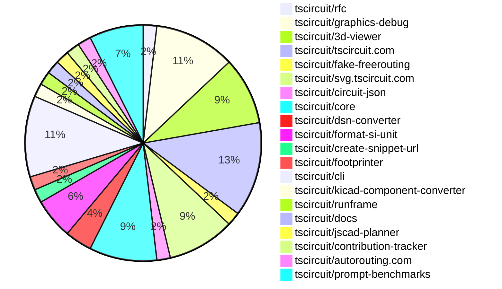

# Contribution Overview 2025-01-29

## PRs by Repository

## Contributor Overview

| Contributor | 🐳 Major | 🐙 Minor | 🐌 Tiny | ⭐ | Issues Created |
|-------------|---------|---------|---------|-----|----------------|
| [imrishabh18](#imrishabh18) | 5 | 14 | 1 | 👑 | 6 |
| [seveibar](#seveibar) | 3 | 5 | 0 | ⭐⭐⭐ | 30 |
| [ShiboSoftwareDev](#ShiboSoftwareDev) | 3 | 1 | 0 | ⭐⭐ | 12 |
| [ArnavK-09](#ArnavK-09) | 2 | 4 | 2 | ⭐⭐ | 3 |
| [kom-senapati](#kom-senapati) | 1 | 3 | 0 | ⭐ | 3 |
| [Anshgrover23](#Anshgrover23) | 0 | 3 | 0 | ⭐ | 2 |
| [Abse2001](#Abse2001) | 1 | 0 | 0 | ⭐ | 0 |
| [techmannih](#techmannih) | 0 | 1 | 1 |  | 1 |
| [Ayushjhawar8](#Ayushjhawar8) | 0 | 1 | 0 |  | 0 |
| [rohittcodes](#rohittcodes) | 0 | 1 | 0 |  | 0 |
| [MustafaMulla29](#MustafaMulla29) | 0 | 1 | 0 |  | 0 |
| [krushnarout](#krushnarout) | 0 | 1 | 0 |  | 0 |

## Review Table

[reviews-received-hover]: ## "Number of reviews received for PRs for this contributor"
[approvals-received-hover]: ## "Number of approvals received for PRs this contributor authored"
[rejections-received-hover]: ## "Number of rejections received for PRs this contributor authored"
[prs-opened-hover]: ## "Number of PRs opened by this contributor"
[issues-created-hover]: ## "Number of issues created by this contributor"
[bountied-issues-hover]: ## "Number of issues this contributor created with a bounty"
[bountied-issue-$-hover]: ## "Total bounty amount placed on issues authored by this contributor"

| Contributor | Reviews Received | Approvals Received | Rejections Received | Approvals | Rejections | PRs Opened | PRs Merged | Issues Created | Bountied Issues | Bountied Issue $ |
|---|---|---|---|---|---|---|---|---|---|---|
| [DrSensor](#DrSensor) | 0 | 0 | 0 | 1 | 0 | 2 | 0 | 5 | 0 | 0 |
| [seveibar](#seveibar) | 2 | 0 | 0 | 30 | 11 | 9 | 8 | 30 | 26 | 336 |
| [imrishabh18](#imrishabh18) | 18 | 4 | 0 | 2 | 3 | 22 | 20 | 6 | 2 | 15 |
| [Rishikesh63](#Rishikesh63) | 7 | 0 | 6 | 0 | 0 | 1 | 0 | 0 | 0 | 0 |
| [Anshgrover23](#Anshgrover23) | 18 | 4 | 7 | 6 | 20 | 7 | 3 | 2 | 1 | 10 |
| [Ayushjhawar8](#Ayushjhawar8) | 9 | 1 | 4 | 0 | 0 | 1 | 1 | 0 | 0 | 0 |
| [ArnavK-09](#ArnavK-09) | 52 | 12 | 12 | 0 | 0 | 13 | 8 | 3 | 0 | 0 |
| [rohittcodes](#rohittcodes) | 9 | 3 | 2 | 0 | 0 | 3 | 1 | 0 | 0 | 0 |
| [UTK-a-RSH](#UTK-a-RSH) | 0 | 0 | 0 | 0 | 0 | 1 | 0 | 0 | 0 | 0 |
| [ARYPROGRAMMER](#ARYPROGRAMMER) | 1 | 0 | 1 | 0 | 0 | 1 | 0 | 0 | 0 | 0 |
| [MustafaMulla29](#MustafaMulla29) | 3 | 2 | 1 | 0 | 0 | 2 | 1 | 0 | 0 | 0 |
| [ShiboSoftwareDev](#ShiboSoftwareDev) | 2 | 2 | 0 | 1 | 2 | 4 | 4 | 12 | 8 | 79 |
| [kom-senapati](#kom-senapati) | 11 | 7 | 0 | 0 | 0 | 5 | 4 | 3 | 1 | 2 |
| [Abse2001](#Abse2001) | 1 | 1 | 0 | 0 | 0 | 1 | 1 | 0 | 0 | 0 |
| [techmannih](#techmannih) | 4 | 3 | 1 | 0 | 0 | 3 | 2 | 1 | 1 | 2 |
| [krushnarout](#krushnarout) | 3 | 1 | 2 | 0 | 0 | 1 | 1 | 0 | 0 | 0 |

## Changes by Repository

### [tscircuit/rfc](https://github.com/tscircuit/rfc)

| PR # | Impact | Contributor | Description |
|------|--------|-------------|-------------|
| [#5](https://github.com/tscircuit/rfc/pull/5) | 🐳 Major | seveibar | This pull request introduces the developer experience vision for tscircuit v0.1, including a command-line tool, a modern registry server, and snapshot testing capabilities. |

### [tscircuit/graphics-debug](https://github.com/tscircuit/graphics-debug)

| PR # | Impact | Contributor | Description |
|------|--------|-------------|-------------|
| [#19](https://github.com/tscircuit/graphics-debug/pull/19) | 🐳 Major | seveibar | Add filtering functionality to the interactive graphics component, including the ability to filter by layer and step, and add x,y coordinates to the point tooltip hover. The graphics are now centered around the objects. |
| [#18](https://github.com/tscircuit/graphics-debug/pull/18) | 🐳 Major | seveibar | Exports interactive React components, adds React Cosmos, and introduces more support for labels, steps, and layers. |
| [#22](https://github.com/tscircuit/graphics-debug/pull/22) | 🐙 Minor | seveibar | Add full width and height to the SVG container to fix the display of lines. |
| [#21](https://github.com/tscircuit/graphics-debug/pull/21) | 🐙 Minor | seveibar | Add handling for invalid/undefined color when hovering |
| [#20](https://github.com/tscircuit/graphics-debug/pull/20) | 🐙 Minor | seveibar | Fix the example data for the steps in the interactive2-layer-and-step-filtering.fixture.tsx file |
| [#16](https://github.com/tscircuit/graphics-debug/pull/16) | 🐙 Minor | Anshgrover23 | Add a GitHub badge to the landing page and an example button to load the example graphics JSON file. |

### [tscircuit/3d-viewer](https://github.com/tscircuit/3d-viewer)

| PR # | Impact | Contributor | Description |
|------|--------|-------------|-------------|
| [#143](https://github.com/tscircuit/3d-viewer/pull/143) | 🐳 Major | imrishabh18 | The pull request converts the 3D view of a circuit to an SVG format, allowing for easier rendering and integration in Node.js environments. |
| [#145](https://github.com/tscircuit/3d-viewer/pull/145) | 🐙 Minor | seveibar | Bundles the jscad/modeling library into the 3D viewer to resolve CommonJS issues. |
| [#152](https://github.com/tscircuit/3d-viewer/pull/152) | 🐙 Minor | seveibar | Add a test to ensure the node bundle can be loaded. |
| [#141](https://github.com/tscircuit/3d-viewer/pull/141) | 🐙 Minor | Anshgrover23 | Add a new prop `autoRotateDisabled` to disable auto-rotation in `CadViewer` and `CadViewerContainer` components. |
| [#153](https://github.com/tscircuit/3d-viewer/pull/153) | 🐌 Tiny | imrishabh18 | Fix the Storybook configuration by updating the import statement for `StoryFn`. |

### [tscircuit/tscircuit.com](https://github.com/tscircuit/tscircuit.com)

| PR # | Impact | Contributor | Description |
|------|--------|-------------|-------------|
| [#633](https://github.com/tscircuit/tscircuit.com/pull/633) | 🐳 Major | imrishabh18 | This pull request adds a set of tests for the "package_releases" API endpoints, including creating a package release, getting a package release by ID, and handling edge cases like version conflicts and non-existent packages. |
| [#627](https://github.com/tscircuit/tscircuit.com/pull/627) | 🐳 Major | imrishabh18 | Adds a fake API for the packages in the bun-tests project. |
| [#622](https://github.com/tscircuit/tscircuit.com/pull/622) | 🐙 Minor | imrishabh18 | Encode the search parameters in the import-snippet-dialog component to fix a potential issue. |
| [#599](https://github.com/tscircuit/tscircuit.com/pull/599) | 🐙 Minor | ArnavK-09 | Adds a new dependency "circuit-json-to-tscircuit" to the project. |
| [#631](https://github.com/tscircuit/tscircuit.com/pull/631) | 🐙 Minor | techmannih | Add a skeleton loader for the landing page |
| [#624](https://github.com/tscircuit/tscircuit.com/pull/624) | 🐌 Tiny | ArnavK-09 | Updated external actions used in the bundle-size-analysis GitHub workflow |
| [#635](https://github.com/tscircuit/tscircuit.com/pull/635) | 🐌 Tiny | techmannih | Changes the background color of the snippet to the previous color. |

### [tscircuit/fake-freerouting](https://github.com/tscircuit/fake-freerouting)

| PR # | Impact | Contributor | Description |
|------|--------|-------------|-------------|
| [#22](https://github.com/tscircuit/fake-freerouting/pull/22) | 🐳 Major | imrishabh18 | The pull request fixes an issue where source traces with more than three connected ports are split into separate traces. |

### [tscircuit/svg.tscircuit.com](https://github.com/tscircuit/svg.tscircuit.com)

| PR # | Impact | Contributor | Description |
|------|--------|-------------|-------------|
| [#22](https://github.com/tscircuit/svg.tscircuit.com/pull/22) | 🐳 Major | imrishabh18 | Add 3D SVG generation |
| [#6](https://github.com/tscircuit/svg.tscircuit.com/pull/6) | 🐳 Major | ArnavK-09 | Adds error handling to the API endpoint, returning an SVG with red text if there's an error. |
| [#28](https://github.com/tscircuit/svg.tscircuit.com/pull/28) | 🐙 Minor | imrishabh18 | Removes the "three" dependency from the project. |
| [#26](https://github.com/tscircuit/svg.tscircuit.com/pull/26) | 🐙 Minor | imrishabh18 | Updates the TypeScript configuration for better Next.js integration. |
| [#21](https://github.com/tscircuit/svg.tscircuit.com/pull/21) | 🐙 Minor | ArnavK-09 | Refactors the `getErrorSvg` function to include better and full-length errors in landscape mode. |

### [tscircuit/circuit-json](https://github.com/tscircuit/circuit-json)

| PR # | Impact | Contributor | Description |
|------|--------|-------------|-------------|
| [#126](https://github.com/tscircuit/circuit-json/pull/126) | 🐙 Minor | imrishabh18 | Fix the conversion function to handle negative numbers |

### [tscircuit/core](https://github.com/tscircuit/core)

| PR # | Impact | Contributor | Description |
|------|--------|-------------|-------------|
| [#590](https://github.com/tscircuit/core/pull/590) | 🐙 Minor | imrishabh18 | The pull request breaks up the function to create a function for one port and not in a pair. |
| [#592](https://github.com/tscircuit/core/pull/592) | 🐙 Minor | imrishabh18 | Update the dependency "format-si-unit" from version 0.0.2 to 0.0.3 |
| [#589](https://github.com/tscircuit/core/pull/589) | 🐙 Minor | imrishabh18 | Fixes a bug in parsing negative value PCB properties. |
| [#588](https://github.com/tscircuit/core/pull/588) | 🐙 Minor | imrishabh18 | Fix the issue with the schematic x and y props by using the parsed value in mm. |
| [#584](https://github.com/tscircuit/core/pull/584) | 🐙 Minor | MustafaMulla29 | Modified the bundle-size.yml workflow to post a comment if the change in bundle or install size is greater than 10 KB. |

### [tscircuit/dsn-converter](https://github.com/tscircuit/dsn-converter)

| PR # | Impact | Contributor | Description |
|------|--------|-------------|-------------|
| [#85](https://github.com/tscircuit/dsn-converter/pull/85) | 🐙 Minor | imrishabh18 | The pull request fixes the calculation of `trace_length` by using a dedicated `getTraceLength` function instead of directly using the `width` property. |
| [#84](https://github.com/tscircuit/dsn-converter/pull/84) | 🐙 Minor | imrishabh18 | Add the `trace_length` property to the `pcb_trace` object in the `convert-polyline-path-to-pcb-traces.ts` and `convert-wiring-path-to-pcb-traces.ts` files. |

### [tscircuit/format-si-unit](https://github.com/tscircuit/format-si-unit)

| PR # | Impact | Contributor | Description |
|------|--------|-------------|-------------|
| [#4](https://github.com/tscircuit/format-si-unit/pull/4) | 🐙 Minor | imrishabh18 | Update the GitHub Actions workflow to use the `bun` runtime instead of `npm`. |
| [#3](https://github.com/tscircuit/format-si-unit/pull/3) | 🐙 Minor | imrishabh18 | Adds a GitHub Actions workflow to publish the package to npm. |
| [#2](https://github.com/tscircuit/format-si-unit/pull/2) | 🐙 Minor | imrishabh18 | Fixes a bug where the `formatSiUnit` function would not correctly convert values like "100uF" to the appropriate SI unit. |

### [tscircuit/create-snippet-url](https://github.com/tscircuit/create-snippet-url)

| PR # | Impact | Contributor | Description |
|------|--------|-------------|-------------|
| [#2](https://github.com/tscircuit/create-snippet-url/pull/2) | 🐙 Minor | imrishabh18 | Adds support for 3D SVG type in the function that generates SVG URLs. |

### [tscircuit/footprinter](https://github.com/tscircuit/footprinter)

| PR # | Impact | Contributor | Description |
|------|--------|-------------|-------------|
| [#115](https://github.com/tscircuit/footprinter/pull/115) | 🐙 Minor | Ayushjhawar8 | Introduces a new single-pin pad footprint with configurable width and height, adds snapshot tests verifying the dimensions, and positions the reference text above the pad. |

### [tscircuit/cli](https://github.com/tscircuit/cli)

| PR # | Impact | Contributor | Description |
|------|--------|-------------|-------------|
| [#32](https://github.com/tscircuit/cli/pull/32) | 🐳 Major | ArnavK-09 | Automatically refreshes import types on file update. |
| [#53](https://github.com/tscircuit/cli/pull/53) | 🐙 Minor | Anshgrover23 | Add tsci auth logout functionality to clear user session. |
| [#47](https://github.com/tscircuit/cli/pull/47) | 🐙 Minor | kom-senapati | Enforce the use of `.tsx` file extension for the dev command |
| [#45](https://github.com/tscircuit/cli/pull/45) | 🐙 Minor | kom-senapati | Fix type issues in the endpoint types for the registry API |
| [#42](https://github.com/tscircuit/cli/pull/42) | 🐙 Minor | kom-senapati | Retrieves the GitHub username from the session token and stores it in the CLI config. |
| [#37](https://github.com/tscircuit/cli/pull/37) | 🐙 Minor | krushnarout | Set the default port for the development server to 3020. |

### [tscircuit/kicad-component-converter](https://github.com/tscircuit/kicad-component-converter)

| PR # | Impact | Contributor | Description |
|------|--------|-------------|-------------|
| [#118](https://github.com/tscircuit/kicad-component-converter/pull/118) | 🐙 Minor | ArnavK-09 | Handles missing `mid` and `stroke` attributes in `fp_arc_row` with default values |

### [tscircuit/runframe](https://github.com/tscircuit/runframe)

| PR # | Impact | Contributor | Description |
|------|--------|-------------|-------------|
| [#167](https://github.com/tscircuit/runframe/pull/167) | 🐙 Minor | ArnavK-09 | Fix to show import error message and allow to rerun if any worker error occurs |

### [tscircuit/docs](https://github.com/tscircuit/docs)

| PR # | Impact | Contributor | Description |
|------|--------|-------------|-------------|
| [#2](https://github.com/tscircuit/docs/pull/2) | 🐌 Tiny | ArnavK-09 |  |

### [tscircuit/jscad-planner](https://github.com/tscircuit/jscad-planner)

| PR # | Impact | Contributor | Description |
|------|--------|-------------|-------------|
| [#8](https://github.com/tscircuit/jscad-planner/pull/8) | 🐙 Minor | rohittcodes | Fixes the implementation of the "hull" and "hullChain" operations in the `execute-jscad-operations.ts` file. |

### [tscircuit/contribution-tracker](https://github.com/tscircuit/contribution-tracker)

| PR # | Impact | Contributor | Description |
|------|--------|-------------|-------------|
| [#43](https://github.com/tscircuit/contribution-tracker/pull/43) | 🐳 Major | kom-senapati | Introduces a new frontend feature to include podium and pull requests by repository |

### [tscircuit/autorouting.com](https://github.com/tscircuit/autorouting.com)

| PR # | Impact | Contributor | Description |
|------|--------|-------------|-------------|
| [#30](https://github.com/tscircuit/autorouting.com/pull/30) | 🐳 Major | Abse2001 | Introduces a local freerouting autorouter to the CLI |

### [tscircuit/prompt-benchmarks](https://github.com/tscircuit/prompt-benchmarks)

| PR # | Impact | Contributor | Description |
|------|--------|-------------|-------------|
| [#24](https://github.com/tscircuit/prompt-benchmarks/pull/24) | 🐳 Major | ShiboSoftwareDev | Generates 10 random prompts for circuits and creates those circuits, very good for debugging and finding issues. |
| [#22](https://github.com/tscircuit/prompt-benchmarks/pull/22) | 🐳 Major | ShiboSoftwareDev | Fixes a critical bug that prevented all circuits from passing in both problem sets. |
| [#21](https://github.com/tscircuit/prompt-benchmarks/pull/21) | 🐳 Major | ShiboSoftwareDev | Introduces a new set of circuit problems and increases the timeout for the evaluation |
| [#23](https://github.com/tscircuit/prompt-benchmarks/pull/23) | 🐙 Minor | ShiboSoftwareDev | The pull request adds a log directory to save failed attempts during the benchmarking process, which is useful for debugging. It also includes cleanup functionality to remove the log directory before starting a new benchmark. |

## Changes by Contributor

### [seveibar](https://github.com/seveibar)

| PR # | Impact | Description |
|------|--------|-------------|
| [#5](https://github.com/tscircuit/rfc/pull/5) | 🐳 Major | This pull request introduces the developer experience vision for tscircuit v0.1, including a command-line tool, a modern registry server, and snapshot testing capabilities. |
| [#19](https://github.com/tscircuit/graphics-debug/pull/19) | 🐳 Major | Add filtering functionality to the interactive graphics component, including the ability to filter by layer and step, and add x,y coordinates to the point tooltip hover. The graphics are now centered around the objects. |
| [#18](https://github.com/tscircuit/graphics-debug/pull/18) | 🐳 Major | Exports interactive React components, adds React Cosmos, and introduces more support for labels, steps, and layers. |
| [#145](https://github.com/tscircuit/3d-viewer/pull/145) | 🐙 Minor | Bundles the jscad/modeling library into the 3D viewer to resolve CommonJS issues. |
| [#152](https://github.com/tscircuit/3d-viewer/pull/152) | 🐙 Minor | Add a test to ensure the node bundle can be loaded. |
| [#22](https://github.com/tscircuit/graphics-debug/pull/22) | 🐙 Minor | Add full width and height to the SVG container to fix the display of lines. |
| [#21](https://github.com/tscircuit/graphics-debug/pull/21) | 🐙 Minor | Add handling for invalid/undefined color when hovering |
| [#20](https://github.com/tscircuit/graphics-debug/pull/20) | 🐙 Minor | Fix the example data for the steps in the interactive2-layer-and-step-filtering.fixture.tsx file |

### [imrishabh18](https://github.com/imrishabh18)

| PR # | Impact | Description |
|------|--------|-------------|
| [#143](https://github.com/tscircuit/3d-viewer/pull/143) | 🐳 Major | The pull request converts the 3D view of a circuit to an SVG format, allowing for easier rendering and integration in Node.js environments. |
| [#633](https://github.com/tscircuit/tscircuit.com/pull/633) | 🐳 Major | This pull request adds a set of tests for the "package_releases" API endpoints, including creating a package release, getting a package release by ID, and handling edge cases like version conflicts and non-existent packages. |
| [#627](https://github.com/tscircuit/tscircuit.com/pull/627) | 🐳 Major | Adds a fake API for the packages in the bun-tests project. |
| [#22](https://github.com/tscircuit/fake-freerouting/pull/22) | 🐳 Major | The pull request fixes an issue where source traces with more than three connected ports are split into separate traces. |
| [#22](https://github.com/tscircuit/svg.tscircuit.com/pull/22) | 🐳 Major | Add 3D SVG generation |
| [#126](https://github.com/tscircuit/circuit-json/pull/126) | 🐙 Minor | Fix the conversion function to handle negative numbers |
| [#590](https://github.com/tscircuit/core/pull/590) | 🐙 Minor | The pull request breaks up the function to create a function for one port and not in a pair. |
| [#592](https://github.com/tscircuit/core/pull/592) | 🐙 Minor | Update the dependency "format-si-unit" from version 0.0.2 to 0.0.3 |
| [#589](https://github.com/tscircuit/core/pull/589) | 🐙 Minor | Fixes a bug in parsing negative value PCB properties. |
| [#588](https://github.com/tscircuit/core/pull/588) | 🐙 Minor | Fix the issue with the schematic x and y props by using the parsed value in mm. |
| [#85](https://github.com/tscircuit/dsn-converter/pull/85) | 🐙 Minor | The pull request fixes the calculation of `trace_length` by using a dedicated `getTraceLength` function instead of directly using the `width` property. |
| [#84](https://github.com/tscircuit/dsn-converter/pull/84) | 🐙 Minor | Add the `trace_length` property to the `pcb_trace` object in the `convert-polyline-path-to-pcb-traces.ts` and `convert-wiring-path-to-pcb-traces.ts` files. |
| [#622](https://github.com/tscircuit/tscircuit.com/pull/622) | 🐙 Minor | Encode the search parameters in the import-snippet-dialog component to fix a potential issue. |
| [#4](https://github.com/tscircuit/format-si-unit/pull/4) | 🐙 Minor | Update the GitHub Actions workflow to use the `bun` runtime instead of `npm`. |
| [#3](https://github.com/tscircuit/format-si-unit/pull/3) | 🐙 Minor | Adds a GitHub Actions workflow to publish the package to npm. |
| [#2](https://github.com/tscircuit/format-si-unit/pull/2) | 🐙 Minor | Fixes a bug where the `formatSiUnit` function would not correctly convert values like "100uF" to the appropriate SI unit. |
| [#2](https://github.com/tscircuit/create-snippet-url/pull/2) | 🐙 Minor | Adds support for 3D SVG type in the function that generates SVG URLs. |
| [#28](https://github.com/tscircuit/svg.tscircuit.com/pull/28) | 🐙 Minor | Removes the "three" dependency from the project. |
| [#26](https://github.com/tscircuit/svg.tscircuit.com/pull/26) | 🐙 Minor | Updates the TypeScript configuration for better Next.js integration. |
| [#153](https://github.com/tscircuit/3d-viewer/pull/153) | 🐌 Tiny | Fix the Storybook configuration by updating the import statement for `StoryFn`. |

### [Ayushjhawar8](https://github.com/Ayushjhawar8)

| PR # | Impact | Description |
|------|--------|-------------|
| [#115](https://github.com/tscircuit/footprinter/pull/115) | 🐙 Minor | Introduces a new single-pin pad footprint with configurable width and height, adds snapshot tests verifying the dimensions, and positions the reference text above the pad. |

### [ArnavK-09](https://github.com/ArnavK-09)

| PR # | Impact | Description |
|------|--------|-------------|
| [#32](https://github.com/tscircuit/cli/pull/32) | 🐳 Major | Automatically refreshes import types on file update. |
| [#6](https://github.com/tscircuit/svg.tscircuit.com/pull/6) | 🐳 Major | Adds error handling to the API endpoint, returning an SVG with red text if there's an error. |
| [#118](https://github.com/tscircuit/kicad-component-converter/pull/118) | 🐙 Minor | Handles missing `mid` and `stroke` attributes in `fp_arc_row` with default values |
| [#599](https://github.com/tscircuit/tscircuit.com/pull/599) | 🐙 Minor | Adds a new dependency "circuit-json-to-tscircuit" to the project. |
| [#167](https://github.com/tscircuit/runframe/pull/167) | 🐙 Minor | Fix to show import error message and allow to rerun if any worker error occurs |
| [#21](https://github.com/tscircuit/svg.tscircuit.com/pull/21) | 🐙 Minor | Refactors the `getErrorSvg` function to include better and full-length errors in landscape mode. |
| [#624](https://github.com/tscircuit/tscircuit.com/pull/624) | 🐌 Tiny | Updated external actions used in the bundle-size-analysis GitHub workflow |
| [#2](https://github.com/tscircuit/docs/pull/2) | 🐌 Tiny |  |

### [Anshgrover23](https://github.com/Anshgrover23)

| PR # | Impact | Description |
|------|--------|-------------|
| [#141](https://github.com/tscircuit/3d-viewer/pull/141) | 🐙 Minor | Add a new prop `autoRotateDisabled` to disable auto-rotation in `CadViewer` and `CadViewerContainer` components. |
| [#16](https://github.com/tscircuit/graphics-debug/pull/16) | 🐙 Minor | Add a GitHub badge to the landing page and an example button to load the example graphics JSON file. |
| [#53](https://github.com/tscircuit/cli/pull/53) | 🐙 Minor | Add tsci auth logout functionality to clear user session. |

### [rohittcodes](https://github.com/rohittcodes)

| PR # | Impact | Description |
|------|--------|-------------|
| [#8](https://github.com/tscircuit/jscad-planner/pull/8) | 🐙 Minor | Fixes the implementation of the "hull" and "hullChain" operations in the `execute-jscad-operations.ts` file. |

### [MustafaMulla29](https://github.com/MustafaMulla29)

| PR # | Impact | Description |
|------|--------|-------------|
| [#584](https://github.com/tscircuit/core/pull/584) | 🐙 Minor | Modified the bundle-size.yml workflow to post a comment if the change in bundle or install size is greater than 10 KB. |

### [kom-senapati](https://github.com/kom-senapati)

| PR # | Impact | Description |
|------|--------|-------------|
| [#43](https://github.com/tscircuit/contribution-tracker/pull/43) | 🐳 Major | Introduces a new frontend feature to include podium and pull requests by repository |
| [#47](https://github.com/tscircuit/cli/pull/47) | 🐙 Minor | Enforce the use of `.tsx` file extension for the dev command |
| [#45](https://github.com/tscircuit/cli/pull/45) | 🐙 Minor | Fix type issues in the endpoint types for the registry API |
| [#42](https://github.com/tscircuit/cli/pull/42) | 🐙 Minor | Retrieves the GitHub username from the session token and stores it in the CLI config. |

### [Abse2001](https://github.com/Abse2001)

| PR # | Impact | Description |
|------|--------|-------------|
| [#30](https://github.com/tscircuit/autorouting.com/pull/30) | 🐳 Major | Introduces a local freerouting autorouter to the CLI |

### [techmannih](https://github.com/techmannih)

| PR # | Impact | Description |
|------|--------|-------------|
| [#631](https://github.com/tscircuit/tscircuit.com/pull/631) | 🐙 Minor | Add a skeleton loader for the landing page |
| [#635](https://github.com/tscircuit/tscircuit.com/pull/635) | 🐌 Tiny | Changes the background color of the snippet to the previous color. |

### [ShiboSoftwareDev](https://github.com/ShiboSoftwareDev)

| PR # | Impact | Description |
|------|--------|-------------|
| [#24](https://github.com/tscircuit/prompt-benchmarks/pull/24) | 🐳 Major | Generates 10 random prompts for circuits and creates those circuits, very good for debugging and finding issues. |
| [#22](https://github.com/tscircuit/prompt-benchmarks/pull/22) | 🐳 Major | Fixes a critical bug that prevented all circuits from passing in both problem sets. |
| [#21](https://github.com/tscircuit/prompt-benchmarks/pull/21) | 🐳 Major | Introduces a new set of circuit problems and increases the timeout for the evaluation |
| [#23](https://github.com/tscircuit/prompt-benchmarks/pull/23) | 🐙 Minor | The pull request adds a log directory to save failed attempts during the benchmarking process, which is useful for debugging. It also includes cleanup functionality to remove the log directory before starting a new benchmark. |

### [krushnarout](https://github.com/krushnarout)

| PR # | Impact | Description |
|------|--------|-------------|
| [#37](https://github.com/tscircuit/cli/pull/37) | 🐙 Minor | Set the default port for the development server to 3020. |

