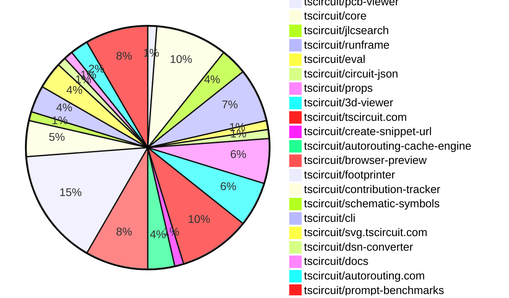

# Contribution Overview 2025-02-05

## PRs by Repository

## Contributor Overview

| Contributor | 🐳 Major | 🐙 Minor | 🐌 Tiny | ⭐ | Issues Created |
|-------------|---------|---------|---------|-----|----------------|
| [seveibar](#seveibar) | 1 | 18 | 0 | 👑 | 50 |
| [techmannih](#techmannih) | 1 | 13 | 0 | ⭐⭐⭐ | 15 |
| [ShiboSoftwareDev](#ShiboSoftwareDev) | 1 | 6 | 0 | ⭐⭐⭐ | 17 |
| [imrishabh18](#imrishabh18) | 1 | 12 | 2 | ⭐⭐ | 10 |
| [kom-senapati](#kom-senapati) | 1 | 6 | 1 | ⭐⭐ | 6 |
| [Anshgrover23](#Anshgrover23) | 1 | 3 | 1 | ⭐⭐ | 7 |
| [Ayushjhawar8](#Ayushjhawar8) | 1 | 3 | 0 | ⭐ | 0 |
| [ArnavK-09](#ArnavK-09) | 1 | 3 | 0 | ⭐ | 1 |
| [Rishikesh63](#Rishikesh63) | 0 | 1 | 0 | ⭐ | 2 |
| [Abse2001](#Abse2001) | 0 | 1 | 0 |  | 1 |
| [PatanSharuKhan](#PatanSharuKhan) | 0 | 1 | 0 |  | 0 |
| [zalabhavy](#zalabhavy) | 0 | 1 | 0 |  | 1 |
| [MustafaMulla29](#MustafaMulla29) | 0 | 1 | 0 |  | 1 |
| [rohittcodes](#rohittcodes) | 0 | 1 | 0 |  | 1 |

## Review Table

[reviews-received-hover]: ## "Number of reviews received for PRs for this contributor"
[approvals-received-hover]: ## "Number of approvals received for PRs this contributor authored"
[rejections-received-hover]: ## "Number of rejections received for PRs this contributor authored"
[prs-opened-hover]: ## "Number of PRs opened by this contributor"
[issues-created-hover]: ## "Number of issues created by this contributor"
[bountied-issues-hover]: ## "Number of issues this contributor created with a bounty"
[bountied-issue-$-hover]: ## "Total bounty amount placed on issues authored by this contributor"

| Contributor | Reviews Received | Approvals Received | Rejections Received | Approvals | Rejections | PRs Opened | PRs Merged | Issues Created | Bountied Issues | Bountied Issue $ |
|---|---|---|---|---|---|---|---|---|---|---|
| [Ayushjhawar8](#Ayushjhawar8) | 12 | 4 | 2 | 0 | 0 | 4 | 4 | 0 | 0 | 0 |
| [seveibar](#seveibar) | 1 | 0 | 0 | 39 | 18 | 26 | 20 | 50 | 39 | 571 |
| [PatanSharuKhan](#PatanSharuKhan) | 2 | 1 | 1 | 0 | 0 | 2 | 1 | 0 | 0 | 0 |
| [Anshgrover23](#Anshgrover23) | 16 | 4 | 6 | 5 | 18 | 13 | 5 | 7 | 0 | 0 |
| [Rishikesh63](#Rishikesh63) | 17 | 3 | 7 | 0 | 0 | 6 | 1 | 2 | 2 | 20 |
| [techmannih](#techmannih) | 55 | 17 | 14 | 0 | 2 | 24 | 14 | 15 | 8 | 55 |
| [imrishabh18](#imrishabh18) | 6 | 4 | 0 | 12 | 12 | 17 | 15 | 10 | 1 | 2 |
| [ArnavK-09](#ArnavK-09) | 34 | 4 | 9 | 0 | 0 | 6 | 4 | 1 | 0 | 0 |
| [ShiboSoftwareDev](#ShiboSoftwareDev) | 7 | 6 | 0 | 1 | 1 | 9 | 7 | 17 | 11 | 128 |
| [kom-senapati](#kom-senapati) | 17 | 9 | 3 | 0 | 0 | 9 | 8 | 6 | 3 | 14 |
| [AnasSarkiz](#AnasSarkiz) | 0 | 0 | 0 | 1 | 1 | 0 | 0 | 0 | 0 | 0 |
| [rohittcodes](#rohittcodes) | 10 | 2 | 2 | 0 | 0 | 2 | 1 | 1 | 0 | 0 |
| [AbhinavTheDev](#AbhinavTheDev) | 2 | 0 | 1 | 0 | 0 | 2 | 0 | 0 | 0 | 0 |
| [zalabhavy](#zalabhavy) | 2 | 1 | 1 | 0 | 0 | 2 | 1 | 1 | 0 | 0 |
| [MustafaMulla29](#MustafaMulla29) | 2 | 1 | 1 | 0 | 0 | 3 | 1 | 1 | 0 | 0 |
| [Abse2001](#Abse2001) | 3 | 2 | 1 | 0 | 0 | 2 | 2 | 1 | 0 | 0 |
| [ajey35](#ajey35) | 3 | 0 | 2 | 0 | 0 | 3 | 0 | 1 | 0 | 0 |
| [18bharathkumar](#18bharathkumar) | 2 | 0 | 2 | 0 | 0 | 3 | 0 | 0 | 0 | 0 |
| [DrSensor](#DrSensor) | 0 | 0 | 0 | 0 | 0 | 0 | 0 | 1 | 0 | 0 |

## Changes by Repository

### [tscircuit/pcb-viewer](https://github.com/tscircuit/pcb-viewer)

| PR # | Impact | Contributor | Description |
|------|--------|-------------|-------------|
| [#153](https://github.com/tscircuit/pcb-viewer/pull/153) | 🐳 Major | Ayushjhawar8 | Adds a "Click to Interact" feature that allows the user to click to enable interaction with the PCB viewer. |

### [tscircuit/core](https://github.com/tscircuit/core)

| PR # | Impact | Contributor | Description |
|------|--------|-------------|-------------|
| [#580](https://github.com/tscircuit/core/pull/580) | 🐙 Minor | Ayushjhawar8 | Improves error handling for components with no PCB connection and missing footprint. |
| [#612](https://github.com/tscircuit/core/pull/612) | 🐙 Minor | seveibar | Fixes an issue with undefined overshadowing on autorouter props in the Group component. |
| [#611](https://github.com/tscircuit/core/pull/611) | 🐙 Minor | seveibar | Fix typo in `autoroutingCacheEnabled`, add `subcircuit_id` to output `source_trace` and `source_port` |
| [#608](https://github.com/tscircuit/core/pull/608) | 🐙 Minor | seveibar | Adds a new configuration option `serverCacheEnabled` to the autorouter configuration, which enables caching of autorouting requests on the server-side. |
| [#609](https://github.com/tscircuit/core/pull/609) | 🐙 Minor | ArnavK-09 | Improves the error message when adding an invalid JSX element to a `PrimitiveComponent`. |
| [#610](https://github.com/tscircuit/core/pull/610) | 🐙 Minor | imrishabh18 | Fix the issue where the autorouter is inherited by the subcircuit child. |
| [#601](https://github.com/tscircuit/core/pull/601) | 🐙 Minor | imrishabh18 | Adds a test case to reproduce an issue with subcircuit overlap traces in the PCB. |
| [#596](https://github.com/tscircuit/core/pull/596) | 🐙 Minor | imrishabh18 | Adds a test for subcircuit caching functionality in the PCB rendering |

### [tscircuit/jlcsearch](https://github.com/tscircuit/jlcsearch)

| PR # | Impact | Contributor | Description |
|------|--------|-------------|-------------|
| [#30](https://github.com/tscircuit/jlcsearch/pull/30) | 🐙 Minor | Ayushjhawar8 | Fix wrong linking of issues to the tscircuit repository. |
| [#33](https://github.com/tscircuit/jlcsearch/pull/33) | 🐙 Minor | seveibar | Introduces more aggressive caching behavior via `s-maxage` and `stale-while-revalidate` for URLs containing "tscircuit.com". |
| [#32](https://github.com/tscircuit/jlcsearch/pull/32) | 🐙 Minor | Anshgrover23 | Introduced a common base-component interface to reduce code duplication across different component types. |

### [tscircuit/runframe](https://github.com/tscircuit/runframe)

| PR # | Impact | Contributor | Description |
|------|--------|-------------|-------------|
| [#207](https://github.com/tscircuit/runframe/pull/207) | 🐙 Minor | Ayushjhawar8 | Fix the overlapping issue between the cancel button and the run button |
| [#223](https://github.com/tscircuit/runframe/pull/223) | 🐙 Minor | seveibar | Update the import paths for `createCircuitWebWorker` and `evalWebWorkerBlobUrl` to use the new `@tscircuit/eval` package instead of the deprecated `@tscircuit/eval-webworker` package. |
| [#215](https://github.com/tscircuit/runframe/pull/215) | 🐙 Minor | seveibar | Update the `@tscircuit/3d-viewer` and `jscad-fiber` dependencies to newer versions |
| [#212](https://github.com/tscircuit/runframe/pull/212) | 🐙 Minor | imrishabh18 | Adds a standalone CircuitJsonPreview component with a toggle for the right header content. |
| [#211](https://github.com/tscircuit/runframe/pull/211) | 🐙 Minor | imrishabh18 | Add the `autoRotateDisabled` prop for `3d-viewer` component. |
| [#202](https://github.com/tscircuit/runframe/pull/202) | 🐙 Minor | rohittcodes | Adds a fullscreen button to toggle the mode in the CircuitJsonPreview component. |

### [tscircuit/eval](https://github.com/tscircuit/eval)

| PR # | Impact | Contributor | Description |
|------|--------|-------------|-------------|
| [#104](https://github.com/tscircuit/eval/pull/104) | 🐳 Major | seveibar | Migrate to text lockfile, update core, and improve termination logic |

### [tscircuit/circuit-json](https://github.com/tscircuit/circuit-json)

| PR # | Impact | Contributor | Description |
|------|--------|-------------|-------------|
| [#127](https://github.com/tscircuit/circuit-json/pull/127) | 🐙 Minor | seveibar | Add subcircuit ID to source port and trace |

### [tscircuit/props](https://github.com/tscircuit/props)

| PR # | Impact | Contributor | Description |
|------|--------|-------------|-------------|
| [#165](https://github.com/tscircuit/props/pull/165) | 🐙 Minor | seveibar | Introduces a new configuration option `serverCacheEnabled` for the `Group` component. |
| [#158](https://github.com/tscircuit/props/pull/158) | 🐙 Minor | seveibar | Renames the `transistorType` property to `type` and expands the allowed values to include additional transistor types. |
| [#164](https://github.com/tscircuit/props/pull/164) | 🐙 Minor | techmannih | The pull request improves the switch component props by adding more detailed type properties and providing a transformation to automatically set the appropriate boolean properties based on the selected switch type. |
| [#161](https://github.com/tscircuit/props/pull/161) | 🐙 Minor | Anshgrover23 | Add a new `schFacingDirection` prop to the `pinHeaderProps` interface to specify the schematic facing direction. |
| [#162](https://github.com/tscircuit/props/pull/162) | 🐙 Minor | Anshgrover23 | Update transistor test to use the correct property name "type" instead of "transistorType" |

### [tscircuit/3d-viewer](https://github.com/tscircuit/3d-viewer)

| PR # | Impact | Contributor | Description |
|------|--------|-------------|-------------|
| [#151](https://github.com/tscircuit/3d-viewer/pull/151) | 🐳 Major | Anshgrover23 | Replace `@tscircuit/soup` with `circuit-json` in the project. |
| [#166](https://github.com/tscircuit/3d-viewer/pull/166) | 🐙 Minor | seveibar | Set the default camera position based on the size of the board, and make the camera position higher. |
| [#160](https://github.com/tscircuit/3d-viewer/pull/160) | 🐙 Minor | imrishabh18 | Fix backwards compatibility by using the `soup` parameter if `circuitJson` is not provided. |
| [#157](https://github.com/tscircuit/3d-viewer/pull/157) | 🐌 Tiny | Anshgrover23 | Updates the bun lockfile |
| [#161](https://github.com/tscircuit/3d-viewer/pull/161) | 🐌 Tiny | imrishabh18 | Adds a .gitignore file to the project, which is a common file used to specify which files and directories should be ignored by version control systems. |

### [tscircuit/tscircuit.com](https://github.com/tscircuit/tscircuit.com)

| PR # | Impact | Contributor | Description |
|------|--------|-------------|-------------|
| [#647](https://github.com/tscircuit/tscircuit.com/pull/647) | 🐳 Major | kom-senapati | Adds a delete icon and functionality to the profile snippet grid. |
| [#663](https://github.com/tscircuit/tscircuit.com/pull/663) | 🐙 Minor | seveibar | Remove console.logs, allow viewing core version, update props |
| [#661](https://github.com/tscircuit/tscircuit.com/pull/661) | 🐙 Minor | seveibar | Update the core library to support subcircuit_id on source elements for Autorouting Caching |
| [#660](https://github.com/tscircuit/tscircuit.com/pull/660) | 🐙 Minor | seveibar | Update the dependency version of "@tscircuit/core" from 0.0.299 to 0.0.305 |
| [#651](https://github.com/tscircuit/tscircuit.com/pull/651) | 🐙 Minor | seveibar | The change updates the "Get Started" button to link to the documentation site instead of navigating to the dashboard. |
| [#658](https://github.com/tscircuit/tscircuit.com/pull/658) | 🐙 Minor | PatanSharuKhan | Fixes the responsiveness of the GitHub badge on the landing page. |
| [#655](https://github.com/tscircuit/tscircuit.com/pull/655) | 🐙 Minor | zalabhavy | Add spacing on the right side of the "Get Started" button for smaller screen sizes. |
| [#654](https://github.com/tscircuit/tscircuit.com/pull/654) | 🐙 Minor | MustafaMulla29 | Update the editor page to handle screen overflow. |

### [tscircuit/create-snippet-url](https://github.com/tscircuit/create-snippet-url)

| PR # | Impact | Contributor | Description |
|------|--------|-------------|-------------|
| [#3](https://github.com/tscircuit/create-snippet-url/pull/3) | 🐙 Minor | seveibar | Adds `createPngUrl` and `createBrowserPreviewUrl` functions, and makes `gzipSync` deterministic by fixing the `mtime`. |

### [tscircuit/autorouting-cache-engine](https://github.com/tscircuit/autorouting-cache-engine)

| PR # | Impact | Contributor | Description |
|------|--------|-------------|-------------|
| [#5](https://github.com/tscircuit/autorouting-cache-engine/pull/5) | 🐙 Minor | seveibar | Fixes an issue where the code was calculating the region of interest bounds incorrectly, resulting in NaN values. |
| [#4](https://github.com/tscircuit/autorouting-cache-engine/pull/4) | 🐙 Minor | seveibar | Rename `normalizedtrace` to `normalizedtraceobstacle` and allow subcircuit ID when denormalizing PCB traces. |
| [#2](https://github.com/tscircuit/autorouting-cache-engine/pull/2) | 🟣 | seveibar | Handling for Subcircuits in cache key, handling for already-routed traces |

### [tscircuit/browser-preview](https://github.com/tscircuit/browser-preview)

| PR # | Impact | Contributor | Description |
|------|--------|-------------|-------------|
| [#7](https://github.com/tscircuit/browser-preview/pull/7) | 🐳 Major | imrishabh18 | The pull request adds the ability to pass compressed code in the query parameters as a base64-encoded gzip string. |
| [#10](https://github.com/tscircuit/browser-preview/pull/10) | 🐙 Minor | seveibar | Copy on build for runframe standalone bundle |
| [#9](https://github.com/tscircuit/browser-preview/pull/9) | 🐙 Minor | kom-senapati | Adds an "Open Example" button that loads a pre-defined example code into the textarea |
| [#4](https://github.com/tscircuit/browser-preview/pull/4) | 🐙 Minor | imrishabh18 | Update package dependencies in the `bun.lock` file and update the title and description in the `get-index-page-html.ts` file. |
| [#3](https://github.com/tscircuit/browser-preview/pull/3) | 🐙 Minor | imrishabh18 | Replaces the entire README.md file with a new description of the project. |
| [#1](https://github.com/tscircuit/browser-preview/pull/1) | 🐙 Minor | imrishabh18 | Add a configuration file for the Biome linter and formatter |
| [#5](https://github.com/tscircuit/browser-preview/pull/5) | 🐌 Tiny | imrishabh18 | Update the header of the preview |

### [tscircuit/footprinter](https://github.com/tscircuit/footprinter)

| PR # | Impact | Contributor | Description |
|------|--------|-------------|-------------|
| [#132](https://github.com/tscircuit/footprinter/pull/132) | 🐳 Major | techmannih | Adds the `sod523` function to the `fn/index.ts` file, which generates a circuit JSON representation of the SOD523 component. |
| [#177](https://github.com/tscircuit/footprinter/pull/177) | 🐳 Major | ArnavK-09 | This pull request adds a feature to allow creating footprints on the footprinter website. |
| [#155](https://github.com/tscircuit/footprinter/pull/155) | 🐙 Minor | techmannih | Adds the `minimelf` footprint to the project. |
| [#160](https://github.com/tscircuit/footprinter/pull/160) | 🐙 Minor | techmannih | Adds the sod882d footprint to the project. |
| [#152](https://github.com/tscircuit/footprinter/pull/152) | 🐙 Minor | techmannih | Adds the "melf" footprint to the project. |
| [#157](https://github.com/tscircuit/footprinter/pull/157) | 🐙 Minor | techmannih | Add a new micromelf footprint to the project. |
| [#142](https://github.com/tscircuit/footprinter/pull/142) | 🐙 Minor | techmannih | Adds the Sod882 footprint |
| [#146](https://github.com/tscircuit/footprinter/pull/146) | 🐙 Minor | techmannih | Adds the sod323f footprint to the library. |
| [#144](https://github.com/tscircuit/footprinter/pull/144) | 🐙 Minor | techmannih | Add a new footprint for the sod123f component. |
| [#150](https://github.com/tscircuit/footprinter/pull/150) | 🐙 Minor | techmannih | Adds a new footprint for the SOD128 component. |
| [#137](https://github.com/tscircuit/footprinter/pull/137) | 🐙 Minor | techmannih | Adds the "sod723" footprint to the project. |
| [#178](https://github.com/tscircuit/footprinter/pull/178) | 🐙 Minor | kom-senapati | Add a test to check that all footprint functions are exposed in `src/footprinter.ts`. |
| [#128](https://github.com/tscircuit/footprinter/pull/128) | 🐙 Minor | Rishikesh63 | Added SOP-8 footprint component |

### [tscircuit/contribution-tracker](https://github.com/tscircuit/contribution-tracker)

| PR # | Impact | Contributor | Description |
|------|--------|-------------|-------------|
| [#57](https://github.com/tscircuit/contribution-tracker/pull/57) | 🐙 Minor | techmannih | Adds score and star icons to the contribution graph |
| [#48](https://github.com/tscircuit/contribution-tracker/pull/48) | 🐙 Minor | techmannih | Add GitHub profile link for top contributors |
| [#51](https://github.com/tscircuit/contribution-tracker/pull/51) | 🐙 Minor | kom-senapati | Add faded lines and labels for star ratings in the contributor graph. |
| [#55](https://github.com/tscircuit/contribution-tracker/pull/55) | 🐌 Tiny | kom-senapati | Adds a small shadow and gap under the contributor graph. |

### [tscircuit/schematic-symbols](https://github.com/tscircuit/schematic-symbols)

| PR # | Impact | Contributor | Description |
|------|--------|-------------|-------------|
| [#245](https://github.com/tscircuit/schematic-symbols/pull/245) | 🐙 Minor | techmannih | Adds a new 3-pin potentiometer symbol to the library. |

### [tscircuit/cli](https://github.com/tscircuit/cli)

| PR # | Impact | Contributor | Description |
|------|--------|-------------|-------------|
| [#54](https://github.com/tscircuit/cli/pull/54) | 🐙 Minor | ArnavK-09 | Adds a feature to save a snippet to the registry |
| [#50](https://github.com/tscircuit/cli/pull/50) | 🐙 Minor | ArnavK-09 | Fixes React type declarations |
| [#55](https://github.com/tscircuit/cli/pull/55) | 🐙 Minor | kom-senapati | Add React type support for `tsci clone package` by generating a React-compatible `tsconfig.json` and installing necessary TypeScript dependencies. |

### [tscircuit/svg.tscircuit.com](https://github.com/tscircuit/svg.tscircuit.com)

| PR # | Impact | Contributor | Description |
|------|--------|-------------|-------------|
| [#43](https://github.com/tscircuit/svg.tscircuit.com/pull/43) | 🐙 Minor | kom-senapati | Adds support for the "view" parameter as an alternative to the "svg_type" parameter in the API endpoint, allowing users to specify the desired view (e.g., "pcb" or "schematic") for the SVG output. |
| [#42](https://github.com/tscircuit/svg.tscircuit.com/pull/42) | 🐙 Minor | kom-senapati | Add core package to the project. |
| [#40](https://github.com/tscircuit/svg.tscircuit.com/pull/40) | 🐙 Minor | imrishabh18 | Removes the 3D SVG generation code. |

### [tscircuit/dsn-converter](https://github.com/tscircuit/dsn-converter)

| PR # | Impact | Contributor | Description |
|------|--------|-------------|-------------|
| [#88](https://github.com/tscircuit/dsn-converter/pull/88) | 🐙 Minor | imrishabh18 | Ensures that the `pcb_trace_id` is unique for the same wire segment across different nets. |

### [tscircuit/docs](https://github.com/tscircuit/docs)

| PR # | Impact | Contributor | Description |
|------|--------|-------------|-------------|
| [#4](https://github.com/tscircuit/docs/pull/4) | 🐙 Minor | imrishabh18 | Adds support for a 3D view of the circuit snippets |

### [tscircuit/autorouting.com](https://github.com/tscircuit/autorouting.com)

| PR # | Impact | Contributor | Description |
|------|--------|-------------|-------------|
| [#32](https://github.com/tscircuit/autorouting.com/pull/32) | 🐙 Minor | Abse2001 | Refactor CLI code to use Golang-style error handling. |
| [#31](https://github.com/tscircuit/autorouting.com/pull/31) | 🟣 | Abse2001 | Refactor the download command to use Golang-style error handling instead of try-catch. |

### [tscircuit/prompt-benchmarks](https://github.com/tscircuit/prompt-benchmarks)

| PR # | Impact | Contributor | Description |
|------|--------|-------------|-------------|
| [#27](https://github.com/tscircuit/prompt-benchmarks/pull/27) | 🐳 Major | ShiboSoftwareDev | The pull request introduces an interface for creating a circuit with streaming and a VFS (Virtual File System) for attempts. |
| [#31](https://github.com/tscircuit/prompt-benchmarks/pull/31) | 🐙 Minor | ShiboSoftwareDev | The pull request fixes the library path for the Anthropic client and allows the creation of a custom Anthropic client instance to be passed to the `createAiCoder` function. |
| [#30](https://github.com/tscircuit/prompt-benchmarks/pull/30) | 🐙 Minor | ShiboSoftwareDev | Fixed exports in various modules. |
| [#29](https://github.com/tscircuit/prompt-benchmarks/pull/29) | 🐙 Minor | ShiboSoftwareDev | Fixed the export of the "ai" module from the library. |
| [#28](https://github.com/tscircuit/prompt-benchmarks/pull/28) | 🐙 Minor | ShiboSoftwareDev | Exported the `AiCoder` module and updated the README with information about the `AiCoder` interface and usage examples. |
| [#26](https://github.com/tscircuit/prompt-benchmarks/pull/26) | 🐙 Minor | ShiboSoftwareDev | Updates the README file with more detailed information about the project, including the structure of the repository, how to run benchmarks, and details about the benchmark directory. |
| [#25](https://github.com/tscircuit/prompt-benchmarks/pull/25) | 🐙 Minor | ShiboSoftwareDev | Refactored codebase structure by removing an old benchmark script and adding a new one. |

## Changes by Contributor

### [Ayushjhawar8](https://github.com/Ayushjhawar8)

| PR # | Impact | Description |
|------|--------|-------------|
| [#153](https://github.com/tscircuit/pcb-viewer/pull/153) | 🐳 Major | Adds a "Click to Interact" feature that allows the user to click to enable interaction with the PCB viewer. |
| [#580](https://github.com/tscircuit/core/pull/580) | 🐙 Minor | Improves error handling for components with no PCB connection and missing footprint. |
| [#30](https://github.com/tscircuit/jlcsearch/pull/30) | 🐙 Minor | Fix wrong linking of issues to the tscircuit repository. |
| [#207](https://github.com/tscircuit/runframe/pull/207) | 🐙 Minor | Fix the overlapping issue between the cancel button and the run button |

### [seveibar](https://github.com/seveibar)

| PR # | Impact | Description |
|------|--------|-------------|
| [#104](https://github.com/tscircuit/eval/pull/104) | 🐳 Major | Migrate to text lockfile, update core, and improve termination logic |
| [#127](https://github.com/tscircuit/circuit-json/pull/127) | 🐙 Minor | Add subcircuit ID to source port and trace |
| [#165](https://github.com/tscircuit/props/pull/165) | 🐙 Minor | Introduces a new configuration option `serverCacheEnabled` for the `Group` component. |
| [#158](https://github.com/tscircuit/props/pull/158) | 🐙 Minor | Renames the `transistorType` property to `type` and expands the allowed values to include additional transistor types. |
| [#166](https://github.com/tscircuit/3d-viewer/pull/166) | 🐙 Minor | Set the default camera position based on the size of the board, and make the camera position higher. |
| [#612](https://github.com/tscircuit/core/pull/612) | 🐙 Minor | Fixes an issue with undefined overshadowing on autorouter props in the Group component. |
| [#611](https://github.com/tscircuit/core/pull/611) | 🐙 Minor | Fix typo in `autoroutingCacheEnabled`, add `subcircuit_id` to output `source_trace` and `source_port` |
| [#608](https://github.com/tscircuit/core/pull/608) | 🐙 Minor | Adds a new configuration option `serverCacheEnabled` to the autorouter configuration, which enables caching of autorouting requests on the server-side. |
| [#663](https://github.com/tscircuit/tscircuit.com/pull/663) | 🐙 Minor | Remove console.logs, allow viewing core version, update props |
| [#661](https://github.com/tscircuit/tscircuit.com/pull/661) | 🐙 Minor | Update the core library to support subcircuit_id on source elements for Autorouting Caching |
| [#660](https://github.com/tscircuit/tscircuit.com/pull/660) | 🐙 Minor | Update the dependency version of "@tscircuit/core" from 0.0.299 to 0.0.305 |
| [#651](https://github.com/tscircuit/tscircuit.com/pull/651) | 🐙 Minor | The change updates the "Get Started" button to link to the documentation site instead of navigating to the dashboard. |
| [#33](https://github.com/tscircuit/jlcsearch/pull/33) | 🐙 Minor | Introduces more aggressive caching behavior via `s-maxage` and `stale-while-revalidate` for URLs containing "tscircuit.com". |
| [#223](https://github.com/tscircuit/runframe/pull/223) | 🐙 Minor | Update the import paths for `createCircuitWebWorker` and `evalWebWorkerBlobUrl` to use the new `@tscircuit/eval` package instead of the deprecated `@tscircuit/eval-webworker` package. |
| [#215](https://github.com/tscircuit/runframe/pull/215) | 🐙 Minor | Update the `@tscircuit/3d-viewer` and `jscad-fiber` dependencies to newer versions |
| [#3](https://github.com/tscircuit/create-snippet-url/pull/3) | 🐙 Minor | Adds `createPngUrl` and `createBrowserPreviewUrl` functions, and makes `gzipSync` deterministic by fixing the `mtime`. |
| [#5](https://github.com/tscircuit/autorouting-cache-engine/pull/5) | 🐙 Minor | Fixes an issue where the code was calculating the region of interest bounds incorrectly, resulting in NaN values. |
| [#4](https://github.com/tscircuit/autorouting-cache-engine/pull/4) | 🐙 Minor | Rename `normalizedtrace` to `normalizedtraceobstacle` and allow subcircuit ID when denormalizing PCB traces. |
| [#2](https://github.com/tscircuit/autorouting-cache-engine/pull/2) | 🟣 | Handling for Subcircuits in cache key, handling for already-routed traces |
| [#10](https://github.com/tscircuit/browser-preview/pull/10) | 🐙 Minor | Copy on build for runframe standalone bundle |

### [techmannih](https://github.com/techmannih)

| PR # | Impact | Description |
|------|--------|-------------|
| [#132](https://github.com/tscircuit/footprinter/pull/132) | 🐳 Major | Adds the `sod523` function to the `fn/index.ts` file, which generates a circuit JSON representation of the SOD523 component. |
| [#164](https://github.com/tscircuit/props/pull/164) | 🐙 Minor | The pull request improves the switch component props by adding more detailed type properties and providing a transformation to automatically set the appropriate boolean properties based on the selected switch type. |
| [#155](https://github.com/tscircuit/footprinter/pull/155) | 🐙 Minor | Adds the `minimelf` footprint to the project. |
| [#160](https://github.com/tscircuit/footprinter/pull/160) | 🐙 Minor | Adds the sod882d footprint to the project. |
| [#152](https://github.com/tscircuit/footprinter/pull/152) | 🐙 Minor | Adds the "melf" footprint to the project. |
| [#157](https://github.com/tscircuit/footprinter/pull/157) | 🐙 Minor | Add a new micromelf footprint to the project. |
| [#142](https://github.com/tscircuit/footprinter/pull/142) | 🐙 Minor | Adds the Sod882 footprint |
| [#146](https://github.com/tscircuit/footprinter/pull/146) | 🐙 Minor | Adds the sod323f footprint to the library. |
| [#144](https://github.com/tscircuit/footprinter/pull/144) | 🐙 Minor | Add a new footprint for the sod123f component. |
| [#150](https://github.com/tscircuit/footprinter/pull/150) | 🐙 Minor | Adds a new footprint for the SOD128 component. |
| [#137](https://github.com/tscircuit/footprinter/pull/137) | 🐙 Minor | Adds the "sod723" footprint to the project. |
| [#57](https://github.com/tscircuit/contribution-tracker/pull/57) | 🐙 Minor | Adds score and star icons to the contribution graph |
| [#48](https://github.com/tscircuit/contribution-tracker/pull/48) | 🐙 Minor | Add GitHub profile link for top contributors |
| [#245](https://github.com/tscircuit/schematic-symbols/pull/245) | 🐙 Minor | Adds a new 3-pin potentiometer symbol to the library. |

### [Anshgrover23](https://github.com/Anshgrover23)

| PR # | Impact | Description |
|------|--------|-------------|
| [#151](https://github.com/tscircuit/3d-viewer/pull/151) | 🐳 Major | Replace `@tscircuit/soup` with `circuit-json` in the project. |
| [#161](https://github.com/tscircuit/props/pull/161) | 🐙 Minor | Add a new `schFacingDirection` prop to the `pinHeaderProps` interface to specify the schematic facing direction. |
| [#162](https://github.com/tscircuit/props/pull/162) | 🐙 Minor | Update transistor test to use the correct property name "type" instead of "transistorType" |
| [#32](https://github.com/tscircuit/jlcsearch/pull/32) | 🐙 Minor | Introduced a common base-component interface to reduce code duplication across different component types. |
| [#157](https://github.com/tscircuit/3d-viewer/pull/157) | 🐌 Tiny | Updates the bun lockfile |

### [ArnavK-09](https://github.com/ArnavK-09)

| PR # | Impact | Description |
|------|--------|-------------|
| [#177](https://github.com/tscircuit/footprinter/pull/177) | 🐳 Major | This pull request adds a feature to allow creating footprints on the footprinter website. |
| [#609](https://github.com/tscircuit/core/pull/609) | 🐙 Minor | Improves the error message when adding an invalid JSX element to a `PrimitiveComponent`. |
| [#54](https://github.com/tscircuit/cli/pull/54) | 🐙 Minor | Adds a feature to save a snippet to the registry |
| [#50](https://github.com/tscircuit/cli/pull/50) | 🐙 Minor | Fixes React type declarations |

### [kom-senapati](https://github.com/kom-senapati)

| PR # | Impact | Description |
|------|--------|-------------|
| [#647](https://github.com/tscircuit/tscircuit.com/pull/647) | 🐳 Major | Adds a delete icon and functionality to the profile snippet grid. |
| [#178](https://github.com/tscircuit/footprinter/pull/178) | 🐙 Minor | Add a test to check that all footprint functions are exposed in `src/footprinter.ts`. |
| [#51](https://github.com/tscircuit/contribution-tracker/pull/51) | 🐙 Minor | Add faded lines and labels for star ratings in the contributor graph. |
| [#55](https://github.com/tscircuit/cli/pull/55) | 🐙 Minor | Add React type support for `tsci clone package` by generating a React-compatible `tsconfig.json` and installing necessary TypeScript dependencies. |
| [#43](https://github.com/tscircuit/svg.tscircuit.com/pull/43) | 🐙 Minor | Adds support for the "view" parameter as an alternative to the "svg_type" parameter in the API endpoint, allowing users to specify the desired view (e.g., "pcb" or "schematic") for the SVG output. |
| [#42](https://github.com/tscircuit/svg.tscircuit.com/pull/42) | 🐙 Minor | Add core package to the project. |
| [#9](https://github.com/tscircuit/browser-preview/pull/9) | 🐙 Minor | Adds an "Open Example" button that loads a pre-defined example code into the textarea |
| [#55](https://github.com/tscircuit/contribution-tracker/pull/55) | 🐌 Tiny | Adds a small shadow and gap under the contributor graph. |

### [Rishikesh63](https://github.com/Rishikesh63)

| PR # | Impact | Description |
|------|--------|-------------|
| [#128](https://github.com/tscircuit/footprinter/pull/128) | 🐙 Minor | Added SOP-8 footprint component |

### [imrishabh18](https://github.com/imrishabh18)

| PR # | Impact | Description |
|------|--------|-------------|
| [#7](https://github.com/tscircuit/browser-preview/pull/7) | 🐳 Major | The pull request adds the ability to pass compressed code in the query parameters as a base64-encoded gzip string. |
| [#160](https://github.com/tscircuit/3d-viewer/pull/160) | 🐙 Minor | Fix backwards compatibility by using the `soup` parameter if `circuitJson` is not provided. |
| [#610](https://github.com/tscircuit/core/pull/610) | 🐙 Minor | Fix the issue where the autorouter is inherited by the subcircuit child. |
| [#601](https://github.com/tscircuit/core/pull/601) | 🐙 Minor | Adds a test case to reproduce an issue with subcircuit overlap traces in the PCB. |
| [#596](https://github.com/tscircuit/core/pull/596) | 🐙 Minor | Adds a test for subcircuit caching functionality in the PCB rendering |
| [#88](https://github.com/tscircuit/dsn-converter/pull/88) | 🐙 Minor | Ensures that the `pcb_trace_id` is unique for the same wire segment across different nets. |
| [#212](https://github.com/tscircuit/runframe/pull/212) | 🐙 Minor | Adds a standalone CircuitJsonPreview component with a toggle for the right header content. |
| [#211](https://github.com/tscircuit/runframe/pull/211) | 🐙 Minor | Add the `autoRotateDisabled` prop for `3d-viewer` component. |
| [#40](https://github.com/tscircuit/svg.tscircuit.com/pull/40) | 🐙 Minor | Removes the 3D SVG generation code. |
| [#4](https://github.com/tscircuit/docs/pull/4) | 🐙 Minor | Adds support for a 3D view of the circuit snippets |
| [#4](https://github.com/tscircuit/browser-preview/pull/4) | 🐙 Minor | Update package dependencies in the `bun.lock` file and update the title and description in the `get-index-page-html.ts` file. |
| [#3](https://github.com/tscircuit/browser-preview/pull/3) | 🐙 Minor | Replaces the entire README.md file with a new description of the project. |
| [#1](https://github.com/tscircuit/browser-preview/pull/1) | 🐙 Minor | Add a configuration file for the Biome linter and formatter |
| [#161](https://github.com/tscircuit/3d-viewer/pull/161) | 🐌 Tiny | Adds a .gitignore file to the project, which is a common file used to specify which files and directories should be ignored by version control systems. |
| [#5](https://github.com/tscircuit/browser-preview/pull/5) | 🐌 Tiny | Update the header of the preview |

### [Abse2001](https://github.com/Abse2001)

| PR # | Impact | Description |
|------|--------|-------------|
| [#32](https://github.com/tscircuit/autorouting.com/pull/32) | 🐙 Minor | Refactor CLI code to use Golang-style error handling. |
| [#31](https://github.com/tscircuit/autorouting.com/pull/31) | 🟣 | Refactor the download command to use Golang-style error handling instead of try-catch. |

### [PatanSharuKhan](https://github.com/PatanSharuKhan)

| PR # | Impact | Description |
|------|--------|-------------|
| [#658](https://github.com/tscircuit/tscircuit.com/pull/658) | 🐙 Minor | Fixes the responsiveness of the GitHub badge on the landing page. |

### [zalabhavy](https://github.com/zalabhavy)

| PR # | Impact | Description |
|------|--------|-------------|
| [#655](https://github.com/tscircuit/tscircuit.com/pull/655) | 🐙 Minor | Add spacing on the right side of the "Get Started" button for smaller screen sizes. |

### [MustafaMulla29](https://github.com/MustafaMulla29)

| PR # | Impact | Description |
|------|--------|-------------|
| [#654](https://github.com/tscircuit/tscircuit.com/pull/654) | 🐙 Minor | Update the editor page to handle screen overflow. |

### [ShiboSoftwareDev](https://github.com/ShiboSoftwareDev)

| PR # | Impact | Description |
|------|--------|-------------|
| [#27](https://github.com/tscircuit/prompt-benchmarks/pull/27) | 🐳 Major | The pull request introduces an interface for creating a circuit with streaming and a VFS (Virtual File System) for attempts. |
| [#31](https://github.com/tscircuit/prompt-benchmarks/pull/31) | 🐙 Minor | The pull request fixes the library path for the Anthropic client and allows the creation of a custom Anthropic client instance to be passed to the `createAiCoder` function. |
| [#30](https://github.com/tscircuit/prompt-benchmarks/pull/30) | 🐙 Minor | Fixed exports in various modules. |
| [#29](https://github.com/tscircuit/prompt-benchmarks/pull/29) | 🐙 Minor | Fixed the export of the "ai" module from the library. |
| [#28](https://github.com/tscircuit/prompt-benchmarks/pull/28) | 🐙 Minor | Exported the `AiCoder` module and updated the README with information about the `AiCoder` interface and usage examples. |
| [#26](https://github.com/tscircuit/prompt-benchmarks/pull/26) | 🐙 Minor | Updates the README file with more detailed information about the project, including the structure of the repository, how to run benchmarks, and details about the benchmark directory. |
| [#25](https://github.com/tscircuit/prompt-benchmarks/pull/25) | 🐙 Minor | Refactored codebase structure by removing an old benchmark script and adding a new one. |

### [rohittcodes](https://github.com/rohittcodes)

| PR # | Impact | Description |
|------|--------|-------------|
| [#202](https://github.com/tscircuit/runframe/pull/202) | 🐙 Minor | Adds a fullscreen button to toggle the mode in the CircuitJsonPreview component. |

