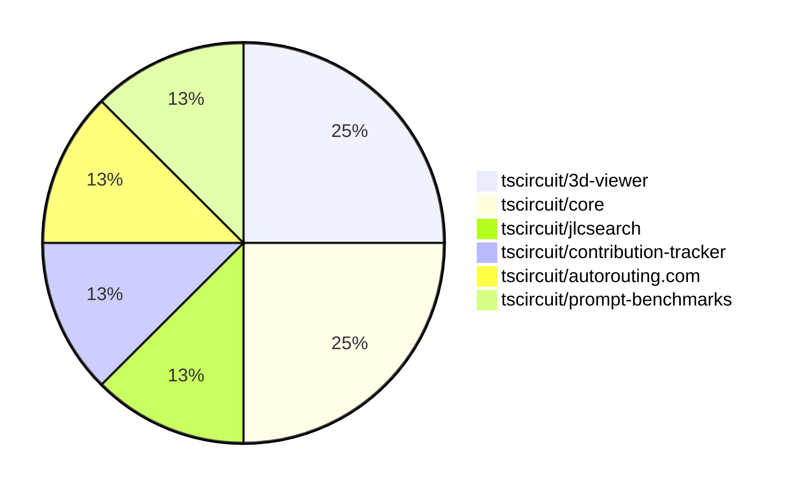

# Contribution Overview 2025-02-05

## PRs by Repository

## Contributor Overview

| Contributor | 🐳 Major | 🐙 Minor | 🐌 Tiny | ⭐ | Issues Created |
|-------------|---------|---------|---------|-----|----------------|
| [ShiboSoftwareDev](#ShiboSoftwareDev) | 1 | 0 | 0 | ⭐ | 1 |
| [Ayushjhawar8](#Ayushjhawar8) | 0 | 2 | 0 | ⭐ | 0 |
| [Anshgrover23](#Anshgrover23) | 0 | 1 | 1 |  | 0 |
| [kom-senapati](#kom-senapati) | 0 | 1 | 0 |  | 1 |
| [Abse2001](#Abse2001) | 0 | 1 | 0 |  | 0 |
| [imrishabh18](#imrishabh18) | 0 | 0 | 1 |  | 2 |

## Review Table

[reviews-received-hover]: ## "Number of reviews received for PRs for this contributor"
[approvals-received-hover]: ## "Number of approvals received for PRs this contributor authored"
[rejections-received-hover]: ## "Number of rejections received for PRs this contributor authored"
[prs-opened-hover]: ## "Number of PRs opened by this contributor"
[issues-created-hover]: ## "Number of issues created by this contributor"
[bountied-issues-hover]: ## "Number of issues this contributor created with a bounty"
[bountied-issue-$-hover]: ## "Total bounty amount placed on issues authored by this contributor"

| Contributor | Reviews Received | Approvals Received | Rejections Received | Approvals | Rejections | PRs Opened | PRs Merged | Issues Created | Bountied Issues | Bountied Issue $ |
|---|---|---|---|---|---|---|---|---|---|---|
| [Rishikesh63](#Rishikesh63) | 2 | 0 | 1 | 0 | 0 | 3 | 0 | 0 | 0 | 0 |
| [seveibar](#seveibar) | 0 | 0 | 0 | 9 | 4 | 0 | 0 | 10 | 9 | 124 |
| [Anshgrover23](#Anshgrover23) | 4 | 1 | 1 | 1 | 0 | 3 | 2 | 0 | 0 | 0 |
| [imrishabh18](#imrishabh18) | 1 | 1 | 0 | 0 | 1 | 1 | 1 | 2 | 0 | 0 |
| [Ayushjhawar8](#Ayushjhawar8) | 5 | 3 | 2 | 0 | 0 | 2 | 2 | 0 | 0 | 0 |
| [techmannih](#techmannih) | 2 | 2 | 0 | 0 | 0 | 1 | 0 | 0 | 0 | 0 |
| [kom-senapati](#kom-senapati) | 1 | 1 | 0 | 0 | 0 | 1 | 1 | 1 | 1 | 2 |
| [Abse2001](#Abse2001) | 2 | 1 | 1 | 0 | 0 | 1 | 1 | 0 | 0 | 0 |
| [ShiboSoftwareDev](#ShiboSoftwareDev) | 1 | 1 | 0 | 0 | 0 | 1 | 1 | 1 | 1 | 12 |

## Changes by Repository

### [tscircuit/3d-viewer](https://github.com/tscircuit/3d-viewer)

| PR # | Impact | Contributor | Description |
|------|--------|-------------|-------------|
| [#151](https://github.com/tscircuit/3d-viewer/pull/151) | 🐙 Minor | Anshgrover23 | Replace "@tscircuit/soup" with "circuit-json" in the project. |
| [#157](https://github.com/tscircuit/3d-viewer/pull/157) | 🐌 Tiny | Anshgrover23 | Updates the bun lockfile |

### [tscircuit/core](https://github.com/tscircuit/core)

| PR # | Impact | Contributor | Description |
|------|--------|-------------|-------------|
| [#580](https://github.com/tscircuit/core/pull/580) | 🐙 Minor | Ayushjhawar8 | Improves error handling for components with no PCB connection and missing footprint. |
| [#596](https://github.com/tscircuit/core/pull/596) | 🐌 Tiny | imrishabh18 | Adds a SVG snapshot for testing subcircuit caching in a PCB example. |

### [tscircuit/jlcsearch](https://github.com/tscircuit/jlcsearch)

| PR # | Impact | Contributor | Description |
|------|--------|-------------|-------------|
| [#30](https://github.com/tscircuit/jlcsearch/pull/30) | 🐙 Minor | Ayushjhawar8 | Fixes the wrong linking of issues from the footprint index list to the tscircuit repository instead of the footprinter repository. |

### [tscircuit/contribution-tracker](https://github.com/tscircuit/contribution-tracker)

| PR # | Impact | Contributor | Description |
|------|--------|-------------|-------------|
| [#51](https://github.com/tscircuit/contribution-tracker/pull/51) | 🐙 Minor | kom-senapati | Add faded lines for stars in contributor graph to represent score thresholds. |

### [tscircuit/autorouting.com](https://github.com/tscircuit/autorouting.com)

| PR # | Impact | Contributor | Description |
|------|--------|-------------|-------------|
| [#31](https://github.com/tscircuit/autorouting.com/pull/31) | 🐙 Minor | Abse2001 | Refactors the download command to use Golang-style error handling instead of try-catch. |

### [tscircuit/prompt-benchmarks](https://github.com/tscircuit/prompt-benchmarks)

| PR # | Impact | Contributor | Description |
|------|--------|-------------|-------------|
| [#25](https://github.com/tscircuit/prompt-benchmarks/pull/25) | 🐳 Major | ShiboSoftwareDev | Removes the old benchmark script and associated code. |

## Changes by Contributor

### [Anshgrover23](https://github.com/Anshgrover23)

| PR # | Impact | Description |
|------|--------|-------------|
| [#151](https://github.com/tscircuit/3d-viewer/pull/151) | 🐙 Minor | Replace "@tscircuit/soup" with "circuit-json" in the project. |
| [#157](https://github.com/tscircuit/3d-viewer/pull/157) | 🐌 Tiny | Updates the bun lockfile |

### [Ayushjhawar8](https://github.com/Ayushjhawar8)

| PR # | Impact | Description |
|------|--------|-------------|
| [#580](https://github.com/tscircuit/core/pull/580) | 🐙 Minor | Improves error handling for components with no PCB connection and missing footprint. |
| [#30](https://github.com/tscircuit/jlcsearch/pull/30) | 🐙 Minor | Fixes the wrong linking of issues from the footprint index list to the tscircuit repository instead of the footprinter repository. |

### [imrishabh18](https://github.com/imrishabh18)

| PR # | Impact | Description |
|------|--------|-------------|
| [#596](https://github.com/tscircuit/core/pull/596) | 🐌 Tiny | Adds a SVG snapshot for testing subcircuit caching in a PCB example. |

### [kom-senapati](https://github.com/kom-senapati)

| PR # | Impact | Description |
|------|--------|-------------|
| [#51](https://github.com/tscircuit/contribution-tracker/pull/51) | 🐙 Minor | Add faded lines for stars in contributor graph to represent score thresholds. |

### [Abse2001](https://github.com/Abse2001)

| PR # | Impact | Description |
|------|--------|-------------|
| [#31](https://github.com/tscircuit/autorouting.com/pull/31) | 🐙 Minor | Refactors the download command to use Golang-style error handling instead of try-catch. |

### [ShiboSoftwareDev](https://github.com/ShiboSoftwareDev)

| PR # | Impact | Description |
|------|--------|-------------|
| [#25](https://github.com/tscircuit/prompt-benchmarks/pull/25) | 🐳 Major | Removes the old benchmark script and associated code. |

