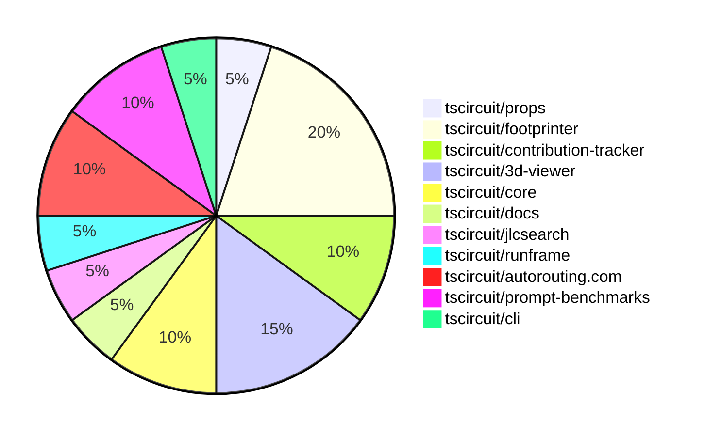

# Contribution Overview 2025-02-05

## PRs by Repository

## Contributor Overview

| Contributor | 🐳 Major | 🐙 Minor | 🐌 Tiny | ⭐ | Issues Created |
|-------------|---------|---------|---------|-----|----------------|
| [seveibar](#seveibar) | 0 | 1 | 0 | ⭐⭐ | 20 |
| [techmannih](#techmannih) | 1 | 3 | 0 | ⭐⭐ | 9 |
| [imrishabh18](#imrishabh18) | 0 | 3 | 0 | ⭐ | 4 |
| [Ayushjhawar8](#Ayushjhawar8) | 0 | 3 | 0 | ⭐ | 0 |
| [ShiboSoftwareDev](#ShiboSoftwareDev) | 0 | 2 | 0 | ⭐ | 2 |
| [Abse2001](#Abse2001) | 0 | 2 | 0 | ⭐ | 0 |
| [Anshgrover23](#Anshgrover23) | 0 | 1 | 1 |  | 0 |
| [Rishikesh63](#Rishikesh63) | 0 | 1 | 0 |  | 2 |
| [kom-senapati](#kom-senapati) | 0 | 1 | 0 |  | 1 |
| [ArnavK-09](#ArnavK-09) | 0 | 1 | 0 |  | 0 |

## Review Table

[reviews-received-hover]: ## "Number of reviews received for PRs for this contributor"
[approvals-received-hover]: ## "Number of approvals received for PRs this contributor authored"
[rejections-received-hover]: ## "Number of rejections received for PRs this contributor authored"
[prs-opened-hover]: ## "Number of PRs opened by this contributor"
[issues-created-hover]: ## "Number of issues created by this contributor"
[bountied-issues-hover]: ## "Number of issues this contributor created with a bounty"
[bountied-issue-$-hover]: ## "Total bounty amount placed on issues authored by this contributor"

| Contributor | Reviews Received | Approvals Received | Rejections Received | Approvals | Rejections | PRs Opened | PRs Merged | Issues Created | Bountied Issues | Bountied Issue $ |
|---|---|---|---|---|---|---|---|---|---|---|
| [seveibar](#seveibar) | 0 | 0 | 0 | 19 | 6 | 1 | 1 | 20 | 16 | 224 |
| [techmannih](#techmannih) | 13 | 7 | 3 | 0 | 0 | 11 | 4 | 9 | 2 | 20 |
| [rohittcodes](#rohittcodes) | 3 | 0 | 0 | 0 | 0 | 1 | 0 | 1 | 0 | 0 |
| [imrishabh18](#imrishabh18) | 2 | 2 | 0 | 0 | 3 | 5 | 3 | 4 | 0 | 0 |
| [Rishikesh63](#Rishikesh63) | 3 | 1 | 1 | 0 | 0 | 3 | 1 | 2 | 0 | 0 |
| [Anshgrover23](#Anshgrover23) | 4 | 1 | 1 | 1 | 4 | 3 | 2 | 0 | 0 | 0 |
| [AbhinavTheDev](#AbhinavTheDev) | 0 | 0 | 0 | 0 | 0 | 1 | 0 | 0 | 0 | 0 |
| [Ayushjhawar8](#Ayushjhawar8) | 5 | 3 | 2 | 0 | 0 | 3 | 3 | 0 | 0 | 0 |
| [kom-senapati](#kom-senapati) | 1 | 1 | 0 | 0 | 0 | 1 | 1 | 1 | 1 | 2 |
| [Abse2001](#Abse2001) | 3 | 2 | 1 | 0 | 0 | 2 | 2 | 0 | 0 | 0 |
| [ShiboSoftwareDev](#ShiboSoftwareDev) | 2 | 2 | 0 | 0 | 0 | 2 | 2 | 2 | 1 | 12 |
| [ArnavK-09](#ArnavK-09) | 12 | 1 | 5 | 0 | 0 | 2 | 1 | 0 | 0 | 0 |

## Changes by Repository

### [tscircuit/props](https://github.com/tscircuit/props)

| PR # | Impact | Contributor | Description |
|------|--------|-------------|-------------|
| [#158](https://github.com/tscircuit/props/pull/158) | 🐙 Minor | seveibar | Rename `transistorType` to `type` and expand the valid types to include `bjt`, `jfet`, and `mosfet`. |

### [tscircuit/footprinter](https://github.com/tscircuit/footprinter)

| PR # | Impact | Contributor | Description |
|------|--------|-------------|-------------|
| [#132](https://github.com/tscircuit/footprinter/pull/132) | 🐳 Major | techmannih | Implements the sod523 component, which includes defining the component parameters, generating the pads, and adding silkscreen elements. |
| [#150](https://github.com/tscircuit/footprinter/pull/150) | 🐙 Minor | techmannih | Adds the sod128 footprint to the project. |
| [#137](https://github.com/tscircuit/footprinter/pull/137) | 🐙 Minor | techmannih | Adds a new footprint for the SOD723 package. |
| [#128](https://github.com/tscircuit/footprinter/pull/128) | 🐙 Minor | Rishikesh63 | Added SOP-8 footprint to the library |

### [tscircuit/contribution-tracker](https://github.com/tscircuit/contribution-tracker)

| PR # | Impact | Contributor | Description |
|------|--------|-------------|-------------|
| [#48](https://github.com/tscircuit/contribution-tracker/pull/48) | 🐙 Minor | techmannih | Add GitHub link for top contributors |
| [#51](https://github.com/tscircuit/contribution-tracker/pull/51) | 🐙 Minor | kom-senapati | Add faded lines for stars in contributor graph |

### [tscircuit/3d-viewer](https://github.com/tscircuit/3d-viewer)

| PR # | Impact | Contributor | Description |
|------|--------|-------------|-------------|
| [#160](https://github.com/tscircuit/3d-viewer/pull/160) | 🐙 Minor | imrishabh18 | Fixes a backwards compatibility issue by defaulting `circuitJson` to `soup` if it is not provided. |
| [#151](https://github.com/tscircuit/3d-viewer/pull/151) | 🐙 Minor | Anshgrover23 | Replace @tscircuit/soup with circuit-json |
| [#157](https://github.com/tscircuit/3d-viewer/pull/157) | 🐌 Tiny | Anshgrover23 | Updates the bun lockfile |

### [tscircuit/core](https://github.com/tscircuit/core)

| PR # | Impact | Contributor | Description |
|------|--------|-------------|-------------|
| [#596](https://github.com/tscircuit/core/pull/596) | 🐙 Minor | imrishabh18 | Adds a test for subcircuit caching to ensure maximum number of traces are rendered correctly. |
| [#580](https://github.com/tscircuit/core/pull/580) | 🐙 Minor | Ayushjhawar8 | Improves error handling for components with no PCB connection and missing footprint. |

### [tscircuit/docs](https://github.com/tscircuit/docs)

| PR # | Impact | Contributor | Description |
|------|--------|-------------|-------------|
| [#4](https://github.com/tscircuit/docs/pull/4) | 🐙 Minor | imrishabh18 | Adds support for a 3D view of the circuit snippets in the application. |

### [tscircuit/jlcsearch](https://github.com/tscircuit/jlcsearch)

| PR # | Impact | Contributor | Description |
|------|--------|-------------|-------------|
| [#30](https://github.com/tscircuit/jlcsearch/pull/30) | 🐙 Minor | Ayushjhawar8 | Fixes the wrong linking of issues to the tscircuit repository. |

### [tscircuit/runframe](https://github.com/tscircuit/runframe)

| PR # | Impact | Contributor | Description |
|------|--------|-------------|-------------|
| [#207](https://github.com/tscircuit/runframe/pull/207) | 🐙 Minor | Ayushjhawar8 | Fix the positioning of the cancel button to prevent it from overlapping the run button. |

### [tscircuit/autorouting.com](https://github.com/tscircuit/autorouting.com)

| PR # | Impact | Contributor | Description |
|------|--------|-------------|-------------|
| [#32](https://github.com/tscircuit/autorouting.com/pull/32) | 🐙 Minor | Abse2001 | Refactored the CLI code to use the Go-style error handling pattern. |
| [#31](https://github.com/tscircuit/autorouting.com/pull/31) | 🐙 Minor | Abse2001 | Refactor the download command to use Golang-style error handling instead of try-catch. |

### [tscircuit/prompt-benchmarks](https://github.com/tscircuit/prompt-benchmarks)

| PR # | Impact | Contributor | Description |
|------|--------|-------------|-------------|
| [#26](https://github.com/tscircuit/prompt-benchmarks/pull/26) | 🐙 Minor | ShiboSoftwareDev | Adds detailed documentation about the project's structure, setup, and benchmarking capabilities. |
| [#25](https://github.com/tscircuit/prompt-benchmarks/pull/25) | 🐙 Minor | ShiboSoftwareDev | Refactoring the codebase structure by removing an old benchmark script and adding a new one. |

### [tscircuit/cli](https://github.com/tscircuit/cli)

| PR # | Impact | Contributor | Description |
|------|--------|-------------|-------------|
| [#50](https://github.com/tscircuit/cli/pull/50) | 🐙 Minor | ArnavK-09 | Fixes the react type declarations in the project. |

## Changes by Contributor

### [seveibar](https://github.com/seveibar)

| PR # | Impact | Description |
|------|--------|-------------|
| [#158](https://github.com/tscircuit/props/pull/158) | 🐙 Minor | Rename `transistorType` to `type` and expand the valid types to include `bjt`, `jfet`, and `mosfet`. |

### [techmannih](https://github.com/techmannih)

| PR # | Impact | Description |
|------|--------|-------------|
| [#132](https://github.com/tscircuit/footprinter/pull/132) | 🐳 Major | Implements the sod523 component, which includes defining the component parameters, generating the pads, and adding silkscreen elements. |
| [#150](https://github.com/tscircuit/footprinter/pull/150) | 🐙 Minor | Adds the sod128 footprint to the project. |
| [#137](https://github.com/tscircuit/footprinter/pull/137) | 🐙 Minor | Adds a new footprint for the SOD723 package. |
| [#48](https://github.com/tscircuit/contribution-tracker/pull/48) | 🐙 Minor | Add GitHub link for top contributors |

### [Rishikesh63](https://github.com/Rishikesh63)

| PR # | Impact | Description |
|------|--------|-------------|
| [#128](https://github.com/tscircuit/footprinter/pull/128) | 🐙 Minor | Added SOP-8 footprint to the library |

### [imrishabh18](https://github.com/imrishabh18)

| PR # | Impact | Description |
|------|--------|-------------|
| [#160](https://github.com/tscircuit/3d-viewer/pull/160) | 🐙 Minor | Fixes a backwards compatibility issue by defaulting `circuitJson` to `soup` if it is not provided. |
| [#596](https://github.com/tscircuit/core/pull/596) | 🐙 Minor | Adds a test for subcircuit caching to ensure maximum number of traces are rendered correctly. |
| [#4](https://github.com/tscircuit/docs/pull/4) | 🐙 Minor | Adds support for a 3D view of the circuit snippets in the application. |

### [Anshgrover23](https://github.com/Anshgrover23)

| PR # | Impact | Description |
|------|--------|-------------|
| [#151](https://github.com/tscircuit/3d-viewer/pull/151) | 🐙 Minor | Replace @tscircuit/soup with circuit-json |
| [#157](https://github.com/tscircuit/3d-viewer/pull/157) | 🐌 Tiny | Updates the bun lockfile |

### [Ayushjhawar8](https://github.com/Ayushjhawar8)

| PR # | Impact | Description |
|------|--------|-------------|
| [#580](https://github.com/tscircuit/core/pull/580) | 🐙 Minor | Improves error handling for components with no PCB connection and missing footprint. |
| [#30](https://github.com/tscircuit/jlcsearch/pull/30) | 🐙 Minor | Fixes the wrong linking of issues to the tscircuit repository. |
| [#207](https://github.com/tscircuit/runframe/pull/207) | 🐙 Minor | Fix the positioning of the cancel button to prevent it from overlapping the run button. |

### [kom-senapati](https://github.com/kom-senapati)

| PR # | Impact | Description |
|------|--------|-------------|
| [#51](https://github.com/tscircuit/contribution-tracker/pull/51) | 🐙 Minor | Add faded lines for stars in contributor graph |

### [Abse2001](https://github.com/Abse2001)

| PR # | Impact | Description |
|------|--------|-------------|
| [#32](https://github.com/tscircuit/autorouting.com/pull/32) | 🐙 Minor | Refactored the CLI code to use the Go-style error handling pattern. |
| [#31](https://github.com/tscircuit/autorouting.com/pull/31) | 🐙 Minor | Refactor the download command to use Golang-style error handling instead of try-catch. |

### [ShiboSoftwareDev](https://github.com/ShiboSoftwareDev)

| PR # | Impact | Description |
|------|--------|-------------|
| [#26](https://github.com/tscircuit/prompt-benchmarks/pull/26) | 🐙 Minor | Adds detailed documentation about the project's structure, setup, and benchmarking capabilities. |
| [#25](https://github.com/tscircuit/prompt-benchmarks/pull/25) | 🐙 Minor | Refactoring the codebase structure by removing an old benchmark script and adding a new one. |

### [ArnavK-09](https://github.com/ArnavK-09)

| PR # | Impact | Description |
|------|--------|-------------|
| [#50](https://github.com/tscircuit/cli/pull/50) | 🐙 Minor | Fixes the react type declarations in the project. |

