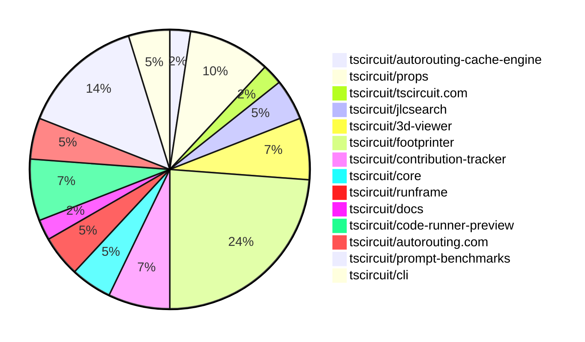

# Contribution Overview 2025-02-05

## PRs by Repository

## Contributor Overview

| Contributor | 🐳 Major | 🐙 Minor | 🐌 Tiny | ⭐ | Issues Created |
|-------------|---------|---------|---------|-----|----------------|
| [seveibar](#seveibar) | 1 | 3 | 0 | ⭐⭐ | 38 |
| [techmannih](#techmannih) | 1 | 9 | 0 | ⭐⭐ | 14 |
| [ShiboSoftwareDev](#ShiboSoftwareDev) | 2 | 4 | 0 | ⭐⭐ | 2 |
| [imrishabh18](#imrishabh18) | 0 | 6 | 1 | ⭐⭐ | 6 |
| [Anshgrover23](#Anshgrover23) | 1 | 3 | 1 | ⭐⭐ | 5 |
| [Rishikesh63](#Rishikesh63) | 0 | 1 | 0 | ⭐ | 2 |
| [Ayushjhawar8](#Ayushjhawar8) | 0 | 3 | 0 | ⭐ | 0 |
| [ArnavK-09](#ArnavK-09) | 1 | 1 | 0 | ⭐ | 0 |
| [kom-senapati](#kom-senapati) | 0 | 1 | 1 | ⭐ | 5 |
| [Abse2001](#Abse2001) | 0 | 2 | 0 | ⭐ | 1 |

## Review Table

[reviews-received-hover]: ## "Number of reviews received for PRs for this contributor"
[approvals-received-hover]: ## "Number of approvals received for PRs this contributor authored"
[rejections-received-hover]: ## "Number of rejections received for PRs this contributor authored"
[prs-opened-hover]: ## "Number of PRs opened by this contributor"
[issues-created-hover]: ## "Number of issues created by this contributor"
[bountied-issues-hover]: ## "Number of issues this contributor created with a bounty"
[bountied-issue-$-hover]: ## "Total bounty amount placed on issues authored by this contributor"

| Contributor | Reviews Received | Approvals Received | Rejections Received | Approvals | Rejections | PRs Opened | PRs Merged | Issues Created | Bountied Issues | Bountied Issue $ |
|---|---|---|---|---|---|---|---|---|---|---|
| [Ayushjhawar8](#Ayushjhawar8) | 11 | 3 | 2 | 0 | 0 | 4 | 3 | 0 | 0 | 0 |
| [seveibar](#seveibar) | 0 | 0 | 0 | 24 | 12 | 5 | 4 | 38 | 31 | 474 |
| [PatanSharuKhan](#PatanSharuKhan) | 1 | 0 | 1 | 0 | 0 | 1 | 0 | 0 | 0 | 0 |
| [Anshgrover23](#Anshgrover23) | 13 | 4 | 5 | 4 | 11 | 9 | 5 | 5 | 0 | 0 |
| [imrishabh18](#imrishabh18) | 3 | 3 | 0 | 5 | 9 | 11 | 7 | 6 | 0 | 0 |
| [techmannih](#techmannih) | 33 | 12 | 9 | 0 | 1 | 18 | 10 | 14 | 3 | 30 |
| [Rishikesh63](#Rishikesh63) | 10 | 2 | 4 | 0 | 0 | 6 | 1 | 2 | 2 | 20 |
| [kom-senapati](#kom-senapati) | 6 | 2 | 3 | 0 | 0 | 5 | 2 | 5 | 2 | 12 |
| [rohittcodes](#rohittcodes) | 3 | 0 | 0 | 0 | 0 | 1 | 0 | 1 | 0 | 0 |
| [zalabhavy](#zalabhavy) | 0 | 0 | 0 | 0 | 0 | 1 | 0 | 0 | 0 | 0 |
| [MustafaMulla29](#MustafaMulla29) | 1 | 0 | 1 | 0 | 0 | 2 | 0 | 0 | 0 | 0 |
| [AbhinavTheDev](#AbhinavTheDev) | 0 | 0 | 0 | 0 | 0 | 2 | 0 | 0 | 0 | 0 |
| [ArnavK-09](#ArnavK-09) | 23 | 2 | 6 | 0 | 0 | 3 | 2 | 0 | 0 | 0 |
| [Abse2001](#Abse2001) | 3 | 2 | 1 | 0 | 0 | 2 | 2 | 1 | 0 | 0 |
| [ShiboSoftwareDev](#ShiboSoftwareDev) | 4 | 4 | 0 | 0 | 0 | 7 | 6 | 2 | 1 | 12 |
| [AnasSarkiz](#AnasSarkiz) | 0 | 0 | 0 | 1 | 0 | 0 | 0 | 0 | 0 | 0 |
| [ajey35](#ajey35) | 1 | 0 | 1 | 0 | 0 | 1 | 0 | 0 | 0 | 0 |

## Changes by Repository

### [tscircuit/autorouting-cache-engine](https://github.com/tscircuit/autorouting-cache-engine)

| PR # | Impact | Contributor | Description |
|------|--------|-------------|-------------|
| [#2](https://github.com/tscircuit/autorouting-cache-engine/pull/2) | 🐳 Major | seveibar | Handling for Subcircuits in cache key, handling for already-routed traces |

### [tscircuit/props](https://github.com/tscircuit/props)

| PR # | Impact | Contributor | Description |
|------|--------|-------------|-------------|
| [#165](https://github.com/tscircuit/props/pull/165) | 🐙 Minor | seveibar | Introduce a new `serverCacheEnabled` option to control the caching behavior of the autorouter server. |
| [#158](https://github.com/tscircuit/props/pull/158) | 🐙 Minor | seveibar | Rename `transistorType` to `type` and expand the valid types to include `bjt`, `jfet`, and `mosfet`. |
| [#161](https://github.com/tscircuit/props/pull/161) | 🐙 Minor | Anshgrover23 | Add a new property 'schFacingDirection' to the 'pinHeaderProps' component to specify the schematic facing direction. |
| [#162](https://github.com/tscircuit/props/pull/162) | 🐙 Minor | Anshgrover23 | Fix transistor test cases to use the correct property name "type" instead of "transistorType". |

### [tscircuit/tscircuit.com](https://github.com/tscircuit/tscircuit.com)

| PR # | Impact | Contributor | Description |
|------|--------|-------------|-------------|
| [#651](https://github.com/tscircuit/tscircuit.com/pull/651) | 🐙 Minor | seveibar | Change the "Get Started" button to redirect to the documentation website instead of the dashboard. |

### [tscircuit/jlcsearch](https://github.com/tscircuit/jlcsearch)

| PR # | Impact | Contributor | Description |
|------|--------|-------------|-------------|
| [#32](https://github.com/tscircuit/jlcsearch/pull/32) | 🐳 Major | Anshgrover23 | Introduces a common base-component interface to be used across the different component interfaces. |
| [#30](https://github.com/tscircuit/jlcsearch/pull/30) | 🐙 Minor | Ayushjhawar8 | Fix wrong linking of issues to the tscircuit repository instead of the footprinter repository. |

### [tscircuit/3d-viewer](https://github.com/tscircuit/3d-viewer)

| PR # | Impact | Contributor | Description |
|------|--------|-------------|-------------|
| [#151](https://github.com/tscircuit/3d-viewer/pull/151) | 🐙 Minor | Anshgrover23 | Replace the usage of `@tscircuit/soup` with `circuit-json` in the 3D viewer library. |
| [#160](https://github.com/tscircuit/3d-viewer/pull/160) | 🐙 Minor | imrishabh18 | Fix backwards compatibility by allowing `circuitJson` to be optional and defaulting to `soup` if not provided. |
| [#157](https://github.com/tscircuit/3d-viewer/pull/157) | 🐌 Tiny | Anshgrover23 | Updates the bun lockfile |

### [tscircuit/footprinter](https://github.com/tscircuit/footprinter)

| PR # | Impact | Contributor | Description |
|------|--------|-------------|-------------|
| [#132](https://github.com/tscircuit/footprinter/pull/132) | 🐳 Major | techmannih | Implements the SOD523 component, a 2-pin semiconductor package, and adds it to the library. |
| [#160](https://github.com/tscircuit/footprinter/pull/160) | 🐙 Minor | techmannih | Adds a new footprint for the SOD882D component. |
| [#152](https://github.com/tscircuit/footprinter/pull/152) | 🐙 Minor | techmannih | Adds a new component footprint for the MELF (Metal Electrode Leadless Face) package. |
| [#157](https://github.com/tscircuit/footprinter/pull/157) | 🐙 Minor | techmannih | Adds a new footprint for the "micromelf" component. |
| [#142](https://github.com/tscircuit/footprinter/pull/142) | 🐙 Minor | techmannih | Adds the Sod882 footprint. |
| [#146](https://github.com/tscircuit/footprinter/pull/146) | 🐙 Minor | techmannih | Adds a new footprint for the SOD323F package. |
| [#144](https://github.com/tscircuit/footprinter/pull/144) | 🐙 Minor | techmannih | Adds a new footprint for the sod123f package. |
| [#150](https://github.com/tscircuit/footprinter/pull/150) | 🐙 Minor | techmannih | Adds a new footprint for the SOD128 package. |
| [#137](https://github.com/tscircuit/footprinter/pull/137) | 🐙 Minor | techmannih | Adds a new footprint for the SOD723 package. |
| [#128](https://github.com/tscircuit/footprinter/pull/128) | 🐙 Minor | Rishikesh63 | Adds support for the SOP-8 (Small Outline Package) footprint. |

### [tscircuit/contribution-tracker](https://github.com/tscircuit/contribution-tracker)

| PR # | Impact | Contributor | Description |
|------|--------|-------------|-------------|
| [#48](https://github.com/tscircuit/contribution-tracker/pull/48) | 🐙 Minor | techmannih | Add GitHub profile link for top contributors |
| [#51](https://github.com/tscircuit/contribution-tracker/pull/51) | 🐙 Minor | kom-senapati | Add faded lines for stars in contributor graph |
| [#55](https://github.com/tscircuit/contribution-tracker/pull/55) | 🐌 Tiny | kom-senapati | Add a small shadow and gap under the contributor graph |

### [tscircuit/core](https://github.com/tscircuit/core)

| PR # | Impact | Contributor | Description |
|------|--------|-------------|-------------|
| [#596](https://github.com/tscircuit/core/pull/596) | 🐙 Minor | imrishabh18 | Adds a test for subcircuit caching to ensure the maximum number of traces are generated correctly. |
| [#580](https://github.com/tscircuit/core/pull/580) | 🐙 Minor | Ayushjhawar8 | Improves error handling for components with no PCB connection and missing footprint. |

### [tscircuit/runframe](https://github.com/tscircuit/runframe)

| PR # | Impact | Contributor | Description |
|------|--------|-------------|-------------|
| [#211](https://github.com/tscircuit/runframe/pull/211) | 🐙 Minor | imrishabh18 | Add the `autoRotateDisabled` prop for the `3d-viewer` component. |
| [#207](https://github.com/tscircuit/runframe/pull/207) | 🐙 Minor | Ayushjhawar8 | Fix the overlapping issue between the cancel button and the run button. |

### [tscircuit/docs](https://github.com/tscircuit/docs)

| PR # | Impact | Contributor | Description |
|------|--------|-------------|-------------|
| [#4](https://github.com/tscircuit/docs/pull/4) | 🐙 Minor | imrishabh18 | Adds support for 3D view of snippets |

### [tscircuit/code-runner-preview](https://github.com/tscircuit/code-runner-preview)

| PR # | Impact | Contributor | Description |
|------|--------|-------------|-------------|
| [#4](https://github.com/tscircuit/code-runner-preview/pull/4) | 🐙 Minor | imrishabh18 | Update the package.json dependencies |
| [#1](https://github.com/tscircuit/code-runner-preview/pull/1) | 🐙 Minor | imrishabh18 | Add a circuit JSON preview |
| [#3](https://github.com/tscircuit/code-runner-preview/pull/3) | 🐌 Tiny | imrishabh18 | Updates the README.md file with a new description for the project. |

### [tscircuit/autorouting.com](https://github.com/tscircuit/autorouting.com)

| PR # | Impact | Contributor | Description |
|------|--------|-------------|-------------|
| [#32](https://github.com/tscircuit/autorouting.com/pull/32) | 🐙 Minor | Abse2001 | Refactored the CLI to use Golang-style error handling. |
| [#31](https://github.com/tscircuit/autorouting.com/pull/31) | 🐙 Minor | Abse2001 | Refactor the download command to use Golang-style error handling instead of try-catch. |

### [tscircuit/prompt-benchmarks](https://github.com/tscircuit/prompt-benchmarks)

| PR # | Impact | Contributor | Description |
|------|--------|-------------|-------------|
| [#27](https://github.com/tscircuit/prompt-benchmarks/pull/27) | 🐳 Major | ShiboSoftwareDev | This pull request introduces an interface for creating a circuit with streaming and a virtual file system (VFS) for attempts. |
| [#25](https://github.com/tscircuit/prompt-benchmarks/pull/25) | 🐳 Major | ShiboSoftwareDev | Removes the old benchmark script and related code |
| [#30](https://github.com/tscircuit/prompt-benchmarks/pull/30) | 🐙 Minor | ShiboSoftwareDev | Fixed exports in various modules |
| [#29](https://github.com/tscircuit/prompt-benchmarks/pull/29) | 🐙 Minor | ShiboSoftwareDev | Fixed the export of the `ai` module in the library. |
| [#28](https://github.com/tscircuit/prompt-benchmarks/pull/28) | 🐙 Minor | ShiboSoftwareDev | Exported the `AiCoder` module and updated the README with information about using the `AiCoder` interface. |
| [#26](https://github.com/tscircuit/prompt-benchmarks/pull/26) | 🐙 Minor | ShiboSoftwareDev | Updates the project's README file with more detailed information about the repository, including a description of the components, problem sets, and benchmarking workflow. |

### [tscircuit/cli](https://github.com/tscircuit/cli)

| PR # | Impact | Contributor | Description |
|------|--------|-------------|-------------|
| [#54](https://github.com/tscircuit/cli/pull/54) | 🐳 Major | ArnavK-09 | Adds a function to push a code snippet to a remote service |
| [#50](https://github.com/tscircuit/cli/pull/50) | 🐙 Minor | ArnavK-09 | Fixes the react type declarations. |

## Changes by Contributor

### [seveibar](https://github.com/seveibar)

| PR # | Impact | Description |
|------|--------|-------------|
| [#2](https://github.com/tscircuit/autorouting-cache-engine/pull/2) | 🐳 Major | Handling for Subcircuits in cache key, handling for already-routed traces |
| [#165](https://github.com/tscircuit/props/pull/165) | 🐙 Minor | Introduce a new `serverCacheEnabled` option to control the caching behavior of the autorouter server. |
| [#158](https://github.com/tscircuit/props/pull/158) | 🐙 Minor | Rename `transistorType` to `type` and expand the valid types to include `bjt`, `jfet`, and `mosfet`. |
| [#651](https://github.com/tscircuit/tscircuit.com/pull/651) | 🐙 Minor | Change the "Get Started" button to redirect to the documentation website instead of the dashboard. |

### [Anshgrover23](https://github.com/Anshgrover23)

| PR # | Impact | Description |
|------|--------|-------------|
| [#32](https://github.com/tscircuit/jlcsearch/pull/32) | 🐳 Major | Introduces a common base-component interface to be used across the different component interfaces. |
| [#161](https://github.com/tscircuit/props/pull/161) | 🐙 Minor | Add a new property 'schFacingDirection' to the 'pinHeaderProps' component to specify the schematic facing direction. |
| [#162](https://github.com/tscircuit/props/pull/162) | 🐙 Minor | Fix transistor test cases to use the correct property name "type" instead of "transistorType". |
| [#151](https://github.com/tscircuit/3d-viewer/pull/151) | 🐙 Minor | Replace the usage of `@tscircuit/soup` with `circuit-json` in the 3D viewer library. |
| [#157](https://github.com/tscircuit/3d-viewer/pull/157) | 🐌 Tiny | Updates the bun lockfile |

### [techmannih](https://github.com/techmannih)

| PR # | Impact | Description |
|------|--------|-------------|
| [#132](https://github.com/tscircuit/footprinter/pull/132) | 🐳 Major | Implements the SOD523 component, a 2-pin semiconductor package, and adds it to the library. |
| [#160](https://github.com/tscircuit/footprinter/pull/160) | 🐙 Minor | Adds a new footprint for the SOD882D component. |
| [#152](https://github.com/tscircuit/footprinter/pull/152) | 🐙 Minor | Adds a new component footprint for the MELF (Metal Electrode Leadless Face) package. |
| [#157](https://github.com/tscircuit/footprinter/pull/157) | 🐙 Minor | Adds a new footprint for the "micromelf" component. |
| [#142](https://github.com/tscircuit/footprinter/pull/142) | 🐙 Minor | Adds the Sod882 footprint. |
| [#146](https://github.com/tscircuit/footprinter/pull/146) | 🐙 Minor | Adds a new footprint for the SOD323F package. |
| [#144](https://github.com/tscircuit/footprinter/pull/144) | 🐙 Minor | Adds a new footprint for the sod123f package. |
| [#150](https://github.com/tscircuit/footprinter/pull/150) | 🐙 Minor | Adds a new footprint for the SOD128 package. |
| [#137](https://github.com/tscircuit/footprinter/pull/137) | 🐙 Minor | Adds a new footprint for the SOD723 package. |
| [#48](https://github.com/tscircuit/contribution-tracker/pull/48) | 🐙 Minor | Add GitHub profile link for top contributors |

### [Rishikesh63](https://github.com/Rishikesh63)

| PR # | Impact | Description |
|------|--------|-------------|
| [#128](https://github.com/tscircuit/footprinter/pull/128) | 🐙 Minor | Adds support for the SOP-8 (Small Outline Package) footprint. |

### [imrishabh18](https://github.com/imrishabh18)

| PR # | Impact | Description |
|------|--------|-------------|
| [#160](https://github.com/tscircuit/3d-viewer/pull/160) | 🐙 Minor | Fix backwards compatibility by allowing `circuitJson` to be optional and defaulting to `soup` if not provided. |
| [#596](https://github.com/tscircuit/core/pull/596) | 🐙 Minor | Adds a test for subcircuit caching to ensure the maximum number of traces are generated correctly. |
| [#211](https://github.com/tscircuit/runframe/pull/211) | 🐙 Minor | Add the `autoRotateDisabled` prop for the `3d-viewer` component. |
| [#4](https://github.com/tscircuit/docs/pull/4) | 🐙 Minor | Adds support for 3D view of snippets |
| [#4](https://github.com/tscircuit/code-runner-preview/pull/4) | 🐙 Minor | Update the package.json dependencies |
| [#1](https://github.com/tscircuit/code-runner-preview/pull/1) | 🐙 Minor | Add a circuit JSON preview |
| [#3](https://github.com/tscircuit/code-runner-preview/pull/3) | 🐌 Tiny | Updates the README.md file with a new description for the project. |

### [Ayushjhawar8](https://github.com/Ayushjhawar8)

| PR # | Impact | Description |
|------|--------|-------------|
| [#580](https://github.com/tscircuit/core/pull/580) | 🐙 Minor | Improves error handling for components with no PCB connection and missing footprint. |
| [#30](https://github.com/tscircuit/jlcsearch/pull/30) | 🐙 Minor | Fix wrong linking of issues to the tscircuit repository instead of the footprinter repository. |
| [#207](https://github.com/tscircuit/runframe/pull/207) | 🐙 Minor | Fix the overlapping issue between the cancel button and the run button. |

### [kom-senapati](https://github.com/kom-senapati)

| PR # | Impact | Description |
|------|--------|-------------|
| [#51](https://github.com/tscircuit/contribution-tracker/pull/51) | 🐙 Minor | Add faded lines for stars in contributor graph |
| [#55](https://github.com/tscircuit/contribution-tracker/pull/55) | 🐌 Tiny | Add a small shadow and gap under the contributor graph |

### [Abse2001](https://github.com/Abse2001)

| PR # | Impact | Description |
|------|--------|-------------|
| [#32](https://github.com/tscircuit/autorouting.com/pull/32) | 🐙 Minor | Refactored the CLI to use Golang-style error handling. |
| [#31](https://github.com/tscircuit/autorouting.com/pull/31) | 🐙 Minor | Refactor the download command to use Golang-style error handling instead of try-catch. |

### [ShiboSoftwareDev](https://github.com/ShiboSoftwareDev)

| PR # | Impact | Description |
|------|--------|-------------|
| [#27](https://github.com/tscircuit/prompt-benchmarks/pull/27) | 🐳 Major | This pull request introduces an interface for creating a circuit with streaming and a virtual file system (VFS) for attempts. |
| [#25](https://github.com/tscircuit/prompt-benchmarks/pull/25) | 🐳 Major | Removes the old benchmark script and related code |
| [#30](https://github.com/tscircuit/prompt-benchmarks/pull/30) | 🐙 Minor | Fixed exports in various modules |
| [#29](https://github.com/tscircuit/prompt-benchmarks/pull/29) | 🐙 Minor | Fixed the export of the `ai` module in the library. |
| [#28](https://github.com/tscircuit/prompt-benchmarks/pull/28) | 🐙 Minor | Exported the `AiCoder` module and updated the README with information about using the `AiCoder` interface. |
| [#26](https://github.com/tscircuit/prompt-benchmarks/pull/26) | 🐙 Minor | Updates the project's README file with more detailed information about the repository, including a description of the components, problem sets, and benchmarking workflow. |

### [ArnavK-09](https://github.com/ArnavK-09)

| PR # | Impact | Description |
|------|--------|-------------|
| [#54](https://github.com/tscircuit/cli/pull/54) | 🐳 Major | Adds a function to push a code snippet to a remote service |
| [#50](https://github.com/tscircuit/cli/pull/50) | 🐙 Minor | Fixes the react type declarations. |

