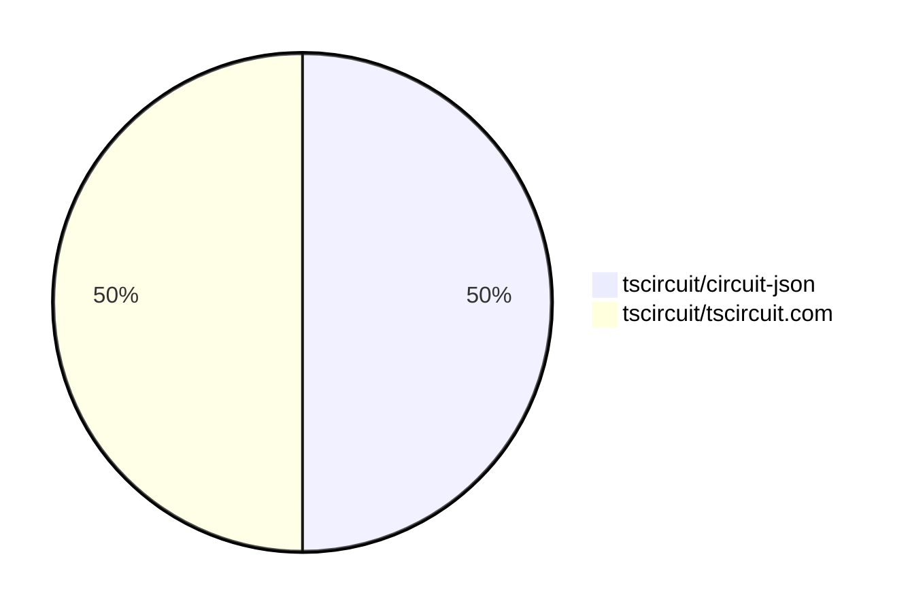

# Contribution Overview 2025-02-12

## PRs by Repository

## Contributor Overview

| Contributor | 🐳 Major | 🐙 Minor | 🐌 Tiny | ⭐ | Issues Created |
|-------------|---------|---------|---------|-----|----------------|
| [techmannih](#techmannih) | 0 | 1 | 0 |  | 0 |
| [imrishabh18](#imrishabh18) | 0 | 1 | 0 |  | 0 |

## Review Table

[reviews-received-hover]: ## "Number of reviews received for PRs for this contributor"
[approvals-received-hover]: ## "Number of approvals received for PRs this contributor authored"
[rejections-received-hover]: ## "Number of rejections received for PRs this contributor authored"
[prs-opened-hover]: ## "Number of PRs opened by this contributor"
[issues-created-hover]: ## "Number of issues created by this contributor"
[bountied-issues-hover]: ## "Number of issues this contributor created with a bounty"
[bountied-issue-$-hover]: ## "Total bounty amount placed on issues authored by this contributor"

| Contributor | Reviews Received | Approvals Received | Rejections Received | Approvals | Rejections | PRs Opened | PRs Merged | Issues Created | Bountied Issues | Bountied Issue $ |
|---|---|---|---|---|---|---|---|---|---|---|
| [techmannih](#techmannih) | 1 | 1 | 0 | 0 | 0 | 1 | 1 | 0 | 0 | 0 |
| [imrishabh18](#imrishabh18) | 1 | 1 | 0 | 1 | 0 | 1 | 1 | 0 | 0 | 0 |
| [Ayushjhawar8](#Ayushjhawar8) | 0 | 0 | 0 | 0 | 0 | 1 | 0 | 0 | 0 | 0 |
| [Abse2001](#Abse2001) | 1 | 0 | 0 | 0 | 0 | 1 | 0 | 0 | 0 | 0 |
| [seveibar](#seveibar) | 0 | 0 | 0 | 1 | 0 | 0 | 0 | 1 | 1 | 40 |
| [kom-senapati](#kom-senapati) | 1 | 0 | 1 | 0 | 0 | 1 | 0 | 1 | 0 | 0 |
| [Anshgrover23](#Anshgrover23) | 0 | 0 | 0 | 0 | 1 | 0 | 0 | 0 | 0 | 0 |

## Changes by Repository

### [tscircuit/circuit-json](https://github.com/tscircuit/circuit-json)

| PR # | Impact | Contributor | Description |
|------|--------|-------------|-------------|
| [#131](https://github.com/tscircuit/circuit-json/pull/131) | 🐙 Minor | techmannih | Add missing switch source from the 'src' module |

### [tscircuit/tscircuit.com](https://github.com/tscircuit/tscircuit.com)

| PR # | Impact | Contributor | Description |
|------|--------|-------------|-------------|
| [#667](https://github.com/tscircuit/tscircuit.com/pull/667) | 🐙 Minor | imrishabh18 | Updates the version of the `@tscircuit/core` and `schematic-symbols` dependencies. |

## Changes by Contributor

### [techmannih](https://github.com/techmannih)

| PR # | Impact | Description |
|------|--------|-------------|
| [#131](https://github.com/tscircuit/circuit-json/pull/131) | 🐙 Minor | Add missing switch source from the 'src' module |

### [imrishabh18](https://github.com/imrishabh18)

| PR # | Impact | Description |
|------|--------|-------------|
| [#667](https://github.com/tscircuit/tscircuit.com/pull/667) | 🐙 Minor | Updates the version of the `@tscircuit/core` and `schematic-symbols` dependencies. |

