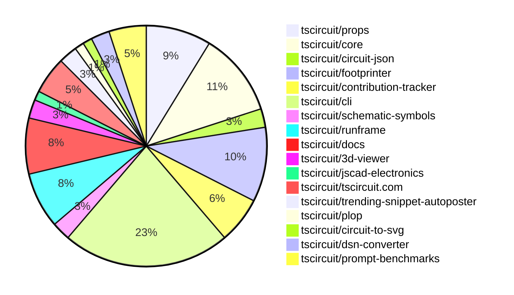

# Contribution Overview 2025-02-12

## PRs by Repository

## Contributor Overview

| Contributor | 🐳 Major | 🐙 Minor | 🐌 Tiny | ⭐ | Issues Created |
|-------------|---------|---------|---------|-----|----------------|
| [imrishabh18](#imrishabh18) | 1 | 16 | 2 | 👑 | 38 |
| [seveibar](#seveibar) | 3 | 6 | 1 | ⭐⭐⭐ | 72 |
| [techmannih](#techmannih) | 2 | 10 | 0 | ⭐⭐⭐ | 11 |
| [Anshgrover23](#Anshgrover23) | 3 | 11 | 0 | ⭐⭐⭐ | 8 |
| [ShiboSoftwareDev](#ShiboSoftwareDev) | 2 | 2 | 0 | ⭐⭐⭐ | 13 |
| [ArnavK-09](#ArnavK-09) | 3 | 6 | 5 | ⭐⭐ | 12 |
| [Abse2001](#Abse2001) | 0 | 2 | 0 | ⭐ | 1 |
| [kom-senapati](#kom-senapati) | 0 | 2 | 0 | ⭐ | 14 |
| [rohittcodes](#rohittcodes) | 0 | 1 | 0 |  | 0 |
| [krushnarout](#krushnarout) | 0 | 1 | 0 |  | 0 |
| [Ayushjhawar8](#Ayushjhawar8) | 0 | 1 | 0 |  | 2 |

## Review Table

[reviews-received-hover]: ## "Number of reviews received for PRs for this contributor"
[approvals-received-hover]: ## "Number of approvals received for PRs this contributor authored"
[rejections-received-hover]: ## "Number of rejections received for PRs this contributor authored"
[prs-opened-hover]: ## "Number of PRs opened by this contributor"
[issues-created-hover]: ## "Number of issues created by this contributor"
[bountied-issues-hover]: ## "Number of issues this contributor created with a bounty"
[bountied-issue-$-hover]: ## "Total bounty amount placed on issues authored by this contributor"

| Contributor | Reviews Received | Approvals Received | Rejections Received | Approvals | Rejections | PRs Opened | PRs Merged | Issues Created | Bountied Issues | Bountied Issue $ |
|---|---|---|---|---|---|---|---|---|---|---|
| [zalabhavy](#zalabhavy) | 0 | 0 | 0 | 0 | 0 | 2 | 0 | 1 | 0 | 0 |
| [krushnarout](#krushnarout) | 2 | 2 | 0 | 0 | 0 | 2 | 1 | 0 | 0 | 0 |
| [007King007](#007King007) | 1 | 0 | 1 | 0 | 0 | 1 | 0 | 0 | 0 | 0 |
| [seveibar](#seveibar) | 0 | 0 | 0 | 49 | 10 | 10 | 10 | 72 | 61 | 1043 |
| [Anshgrover23](#Anshgrover23) | 43 | 16 | 8 | 5 | 12 | 17 | 14 | 8 | 0 | 0 |
| [Abse2001](#Abse2001) | 6 | 1 | 1 | 2 | 0 | 3 | 2 | 1 | 0 | 0 |
| [techmannih](#techmannih) | 46 | 19 | 9 | 0 | 1 | 16 | 12 | 11 | 8 | 50 |
| [imrishabh18](#imrishabh18) | 10 | 8 | 0 | 16 | 9 | 23 | 19 | 38 | 10 | 134 |
| [AnasSarkiz](#AnasSarkiz) | 0 | 0 | 0 | 0 | 1 | 0 | 0 | 0 | 0 | 0 |
| [rohittcodes](#rohittcodes) | 4 | 1 | 0 | 0 | 0 | 1 | 1 | 0 | 0 | 0 |
| [ShiboSoftwareDev](#ShiboSoftwareDev) | 3 | 3 | 0 | 2 | 4 | 6 | 4 | 13 | 7 | 137 |
| [aryel780](#aryel780) | 0 | 0 | 0 | 0 | 0 | 1 | 0 | 0 | 0 | 0 |
| [ArnavK-09](#ArnavK-09) | 49 | 15 | 7 | 1 | 2 | 17 | 14 | 12 | 0 | 0 |
| [Ayushjhawar8](#Ayushjhawar8) | 15 | 3 | 8 | 0 | 0 | 3 | 1 | 2 | 0 | 0 |
| [kom-senapati](#kom-senapati) | 13 | 5 | 2 | 0 | 0 | 5 | 2 | 14 | 0 | 0 |
| [siva222003](#siva222003) | 3 | 2 | 0 | 0 | 0 | 2 | 0 | 0 | 0 | 0 |
| [deekshatomer](#deekshatomer) | 1 | 0 | 1 | 0 | 0 | 1 | 0 | 0 | 0 | 0 |
| [Saurabhsing21](#Saurabhsing21) | 2 | 0 | 2 | 0 | 0 | 1 | 0 | 0 | 0 | 0 |

## Changes by Repository

### [tscircuit/props](https://github.com/tscircuit/props)

| PR # | Impact | Contributor | Description |
|------|--------|-------------|-------------|
| [#184](https://github.com/tscircuit/props/pull/184) | 🐳 Major | Anshgrover23 | Introduce a new component called "stampboard" with various properties to define the board's dimensions, pin counts, and configuration. |
| [#177](https://github.com/tscircuit/props/pull/177) | 🐳 Major | seveibar | Introduces a new `platformConfig` module that defines the structure of the platform configuration and exports it as a Zod schema. |
| [#185](https://github.com/tscircuit/props/pull/185) | 🐙 Minor | Anshgrover23 | Add `stampboard` component to the index.ts file. |
| [#182](https://github.com/tscircuit/props/pull/182) | 🐙 Minor | Anshgrover23 | Add a new optional property `schShowRatings` to the `CapacitorProps` interface and the `capacitorProps` object. |
| [#180](https://github.com/tscircuit/props/pull/180) | 🐙 Minor | Anshgrover23 | Add `maxVoltageRating` property to the `CapacitorProps` interface and update the `capacitorProps` object to include the new property. |
| [#176](https://github.com/tscircuit/props/pull/176) | 🐙 Minor | Anshgrover23 | Adds a new "connections" prop to the "ChipProps" interface, allowing for more granular control over the connections between a chip and other components in the circuit. |
| [#178](https://github.com/tscircuit/props/pull/178) | 🐙 Minor | techmannih | Added switch test cases to validate parsing of switch props |

### [tscircuit/core](https://github.com/tscircuit/core)

| PR # | Impact | Contributor | Description |
|------|--------|-------------|-------------|
| [#633](https://github.com/tscircuit/core/pull/633) | 🐳 Major | Anshgrover23 | Automatically create traces for a chip based on the `connections` prop. |
| [#626](https://github.com/tscircuit/core/pull/626) | 🐳 Major | Anshgrover23 | Adds support for a four-pin crystal |
| [#628](https://github.com/tscircuit/core/pull/628) | 🐳 Major | techmannih | Implements a new Switch component |
| [#634](https://github.com/tscircuit/core/pull/634) | 🐳 Major | imrishabh18 | Introduces a new phase called `PcbBoardAutoSize` that automatically calculates the board dimensions based on the positions of the components on the board if the dimensions are not explicitly provided. |
| [#636](https://github.com/tscircuit/core/pull/636) | 🐙 Minor | Anshgrover23 | Adds support for "CN" (Connector) type to the "sel" object in the library. |
| [#629](https://github.com/tscircuit/core/pull/629) | 🐙 Minor | Anshgrover23 | Add `maxVoltageRating` property to the `Capacitor` component and display it in the schematic symbol. |
| [#625](https://github.com/tscircuit/core/pull/625) | 🐙 Minor | Anshgrover23 | Adds additional aliases to transistor ports (emitter, collector, base) |
| [#632](https://github.com/tscircuit/core/pull/632) | 🐙 Minor | techmannih | Add support for normally closed switch symbol |
| [#630](https://github.com/tscircuit/core/pull/630) | 🐙 Minor | imrishabh18 | Updates the version of the `@tscircuit/footprinter` dependency from `0.0.97` to `0.0.124`. |

### [tscircuit/circuit-json](https://github.com/tscircuit/circuit-json)

| PR # | Impact | Contributor | Description |
|------|--------|-------------|-------------|
| [#133](https://github.com/tscircuit/circuit-json/pull/133) | 🐙 Minor | Anshgrover23 | Add `maxVoltageRating` property to the `SourceSimpleCapacitor` type. |
| [#131](https://github.com/tscircuit/circuit-json/pull/131) | 🐙 Minor | techmannih | Adds a missing switch from the src directory. |

### [tscircuit/footprinter](https://github.com/tscircuit/footprinter)

| PR # | Impact | Contributor | Description |
|------|--------|-------------|-------------|
| [#201](https://github.com/tscircuit/footprinter/pull/201) | 🐙 Minor | Anshgrover23 | Fixes the plated hole size for the DIP8 component with 1.27mm pitch. |
| [#173](https://github.com/tscircuit/footprinter/pull/173) | 🐙 Minor | techmannih | Adds the SMA footprint to the library. |
| [#200](https://github.com/tscircuit/footprinter/pull/200) | 🐙 Minor | techmannih | The pull request improves the inline footprint for the TO-92 component by adjusting the placement of the plated holes based on the "inline" parameter. |
| [#191](https://github.com/tscircuit/footprinter/pull/191) | 🐙 Minor | techmannih | Increases the diameter of the plated holes in the push button pads from 1.2 times the hole diameter to 1.5 times the hole diameter. |
| [#175](https://github.com/tscircuit/footprinter/pull/175) | 🐙 Minor | techmannih | Adds the SMF (Surface Mount Fuse) footprint to the project. |
| [#186](https://github.com/tscircuit/footprinter/pull/186) | 🐙 Minor | techmannih | Add missing footprint and rename pad_spacing |
| [#187](https://github.com/tscircuit/footprinter/pull/187) | 🐙 Minor | imrishabh18 | Fix unit conversion issue and jscad footprint placement issue |
| [#130](https://github.com/tscircuit/footprinter/pull/130) | 🐙 Minor | rohittcodes | Adds a silkscreen path and updates the silkscreen reference text position to indicate the polarity of the component. |

### [tscircuit/contribution-tracker](https://github.com/tscircuit/contribution-tracker)

| PR # | Impact | Contributor | Description |
|------|--------|-------------|-------------|
| [#53](https://github.com/tscircuit/contribution-tracker/pull/53) | 🐳 Major | ArnavK-09 | Adds Discord integration support, including a script to sync discord roles based on GitHub contributions. |
| [#65](https://github.com/tscircuit/contribution-tracker/pull/65) | 🐙 Minor | Anshgrover23 | Added a new user's Discord ID and GitHub username to the users.json file. |
| [#66](https://github.com/tscircuit/contribution-tracker/pull/66) | 🐙 Minor | techmannih | Added new user's Discord ID and GitHub username to the users.json file. |
| [#63](https://github.com/tscircuit/contribution-tracker/pull/63) | 🐙 Minor | ArnavK-09 | Tweak the UI of the navbar on desktop to improve the layout and appearance. |
| [#67](https://github.com/tscircuit/contribution-tracker/pull/67) | 🐌 Tiny | ArnavK-09 | Rename the workflow variable `DISCORD_BOT_TOKEN` to `DISCORD_TOKEN`. |

### [tscircuit/cli](https://github.com/tscircuit/cli)

| PR # | Impact | Contributor | Description |
|------|--------|-------------|-------------|
| [#79](https://github.com/tscircuit/cli/pull/79) | 🐙 Minor | Anshgrover23 | Update dependencies to the latest versions |
| [#84](https://github.com/tscircuit/cli/pull/84) | 🐙 Minor | imrishabh18 | Ignore watch of node_modules and update the message for entrypoint detection. |
| [#77](https://github.com/tscircuit/cli/pull/77) | 🐙 Minor | imrishabh18 | Fixes an issue where the login command would not handle the case where the user is already logged in. |
| [#72](https://github.com/tscircuit/cli/pull/72) | 🐙 Minor | imrishabh18 | Update CLI prompts to provide more detailed information to the user |
| [#61](https://github.com/tscircuit/cli/pull/61) | 🐙 Minor | imrishabh18 | Adds package.json file generation on init |
| [#69](https://github.com/tscircuit/cli/pull/69) | 🐙 Minor | imrishabh18 | Add a .gitignore file on `tsci init` |
| [#62](https://github.com/tscircuit/cli/pull/62) | 🐙 Minor | imrishabh18 | Add a GitHub Actions workflow to test the project using Bun. |
| [#60](https://github.com/tscircuit/cli/pull/60) | 🐙 Minor | imrishabh18 | Update the `@tscircuit/runframe` dependency to version `0.0.167` and add the `@tscircuit/eval` dependency. |
| [#81](https://github.com/tscircuit/cli/pull/81) | 🐙 Minor | ArnavK-09 | Fixes various issues in tests, including unreliable/horrible things, and updates dependencies. |
| [#64](https://github.com/tscircuit/cli/pull/64) | 🐙 Minor | ArnavK-09 | Avoid standalone file read errors and fall back to the production version. |
| [#63](https://github.com/tscircuit/cli/pull/63) | 🐙 Minor | ArnavK-09 | Refactors the `clone` command to avoid duplicate code, use DRY principles, and add the ability to initialize the project in a custom directory. |
| [#71](https://github.com/tscircuit/cli/pull/71) | 🐙 Minor | kom-senapati | Adds export functionality to `readable-netlist` and `dsn` modules. |
| [#57](https://github.com/tscircuit/cli/pull/57) | 🐙 Minor | kom-senapati | Adds the ability to export PCB and schematic SVGs. |
| [#70](https://github.com/tscircuit/cli/pull/70) | 🐌 Tiny | seveibar | Add Rishabh, Seve, and Arn as CODEOWNERS |
| [#65](https://github.com/tscircuit/cli/pull/65) | 🐌 Tiny | imrishabh18 | Converts the imports in the `setup-tsci-packages.ts` file to use ECMAScript modules (ESM) instead of CommonJS. |
| [#82](https://github.com/tscircuit/cli/pull/82) | 🐌 Tiny | ArnavK-09 | Changes the command name from `snippets dev` to `tsci dev` in the README. |
| [#73](https://github.com/tscircuit/cli/pull/73) | 🐌 Tiny | ArnavK-09 | Bump versions of GitHub Actions used in the project's workflows |
| [#66](https://github.com/tscircuit/cli/pull/66) | 🐌 Tiny | ArnavK-09 | Removes comments from the `setupTsciProject` function |

### [tscircuit/schematic-symbols](https://github.com/tscircuit/schematic-symbols)

| PR # | Impact | Contributor | Description |
|------|--------|-------------|-------------|
| [#252](https://github.com/tscircuit/schematic-symbols/pull/252) | 🐳 Major | techmannih | Implement Closed Switch Symbols for SPST, SPDT, DPDT, DPST |
| [#249](https://github.com/tscircuit/schematic-symbols/pull/249) | 🐙 Minor | techmannih | Fixes the incorrect pin name for the SPDT switch in the JSON and SVG files. |

### [tscircuit/runframe](https://github.com/tscircuit/runframe)

| PR # | Impact | Contributor | Description |
|------|--------|-------------|-------------|
| [#252](https://github.com/tscircuit/runframe/pull/252) | 🐳 Major | seveibar | Greatly improved iframe messaging and support, including a new standalone iframe implementation and better handling of events from the iframe. |
| [#243](https://github.com/tscircuit/runframe/pull/243) | 🐳 Major | seveibar | Adds support for embedding RunFrame in a standalone iframe, allowing for the evaluation of tscircuit code from a parent application. |
| [#251](https://github.com/tscircuit/runframe/pull/251) | 🐳 Major | ArnavK-09 | Adds a new component for the Runframe-cli, including a left header with options for saving and exporting the current snippet. |
| [#254](https://github.com/tscircuit/runframe/pull/254) | 🐙 Minor | seveibar | Adds an iframe loader with a loading animation and disables the fullscreen button for the iframe. |
| [#235](https://github.com/tscircuit/runframe/pull/235) | 🐙 Minor | imrishabh18 | Adds the `standalone.min.js` file in the build dist directory. |
| [#234](https://github.com/tscircuit/runframe/pull/234) | 🐙 Minor | imrishabh18 | Fixes the `debug grid` prop in the `CircuitJsonPreview` component. |

### [tscircuit/docs](https://github.com/tscircuit/docs)

| PR # | Impact | Contributor | Description |
|------|--------|-------------|-------------|
| [#13](https://github.com/tscircuit/docs/pull/13) | 🐙 Minor | seveibar | The pull request fills in some blank pages in the documentation. |
| [#12](https://github.com/tscircuit/docs/pull/12) | 🐙 Minor | seveibar | Initial documentation for the footprinter strings page. |
| [#11](https://github.com/tscircuit/docs/pull/11) | 🐙 Minor | seveibar | Adds an AI context file (ai.txt) and a link to it in the documentation. |
| [#10](https://github.com/tscircuit/docs/pull/10) | 🐙 Minor | seveibar | Adds a new element, `<pinheader />`, and related documentation, and makes mobile-specific layout changes to the `<CircuitPreview />` component. |
| [#9](https://github.com/tscircuit/docs/pull/9) | 🐙 Minor | seveibar | Adds documentation for the `@tscircuit/math-utils` package, including the `grid` utility function, and updates the documentation for various circuit elements. |
| [#15](https://github.com/tscircuit/docs/pull/15) | 🐌 Tiny | imrishabh18 | Fixes a typo in the "importing-from-jlcpcb.mdx" documentation. |

### [tscircuit/3d-viewer](https://github.com/tscircuit/3d-viewer)

| PR # | Impact | Contributor | Description |
|------|--------|-------------|-------------|
| [#179](https://github.com/tscircuit/3d-viewer/pull/179) | 🐙 Minor | imrishabh18 | Update core and add story of the fixed dip footprint |
| [#176](https://github.com/tscircuit/3d-viewer/pull/176) | 🐙 Minor | imrishabh18 | Remove `react-fiber` and update `jscad-electronics` dependency to `^0.0.25` |

### [tscircuit/jscad-electronics](https://github.com/tscircuit/jscad-electronics)

| PR # | Impact | Contributor | Description |
|------|--------|-------------|-------------|
| [#86](https://github.com/tscircuit/jscad-electronics/pull/86) | 🐙 Minor | imrishabh18 | Fix footprint position placement by adjusting the z-coordinate of the chip body and pin legs. |

### [tscircuit/tscircuit.com](https://github.com/tscircuit/tscircuit.com)

| PR # | Impact | Contributor | Description |
|------|--------|-------------|-------------|
| [#687](https://github.com/tscircuit/tscircuit.com/pull/687) | 🐙 Minor | imrishabh18 | Fixes a bug in the schematic pushbutton footprint due to an old version of the `runframe` package. |
| [#667](https://github.com/tscircuit/tscircuit.com/pull/667) | 🐙 Minor | imrishabh18 | Update the `@tscircuit/core` dependency to version `0.0.311` and the `schematic-symbols` dependency to version `0.0.119`. |
| [#681](https://github.com/tscircuit/tscircuit.com/pull/681) | 🐙 Minor | krushnarout | Adds a warning message if the user tries to save a snippet without running it first. |
| [#672](https://github.com/tscircuit/tscircuit.com/pull/672) | 🐙 Minor | Ayushjhawar8 | Adds a "Show more/less" button to the Trending Snippets and Newest Snippets sections in the dashboard. |

### [tscircuit/trending-snippet-autoposter](https://github.com/tscircuit/trending-snippet-autoposter)

| PR # | Impact | Contributor | Description |
|------|--------|-------------|-------------|
| [#4](https://github.com/tscircuit/trending-snippet-autoposter/pull/4) | 🐳 Major | ArnavK-09 | This pull request bootstraps the repository by setting up the necessary configuration files, including a Bun script, GitHub Actions workflows, and a .gitignore file. |
| [#7](https://github.com/tscircuit/trending-snippet-autoposter/pull/7) | 🐌 Tiny | ArnavK-09 | Removes Twitter API credentials from the example environment file. |

### [tscircuit/plop](https://github.com/tscircuit/plop)

| PR # | Impact | Contributor | Description |
|------|--------|-------------|-------------|
| [#9](https://github.com/tscircuit/plop/pull/9) | 🐙 Minor | ArnavK-09 | Update versions of GitHub Actions used in the workflow files |

### [tscircuit/circuit-to-svg](https://github.com/tscircuit/circuit-to-svg)

| PR # | Impact | Contributor | Description |
|------|--------|-------------|-------------|
| [#167](https://github.com/tscircuit/circuit-to-svg/pull/167) | 🐙 Minor | ArnavK-09 | Adds support for rendering rats nest connections in PCB SVG diagrams. |

### [tscircuit/dsn-converter](https://github.com/tscircuit/dsn-converter)

| PR # | Impact | Contributor | Description |
|------|--------|-------------|-------------|
| [#92](https://github.com/tscircuit/dsn-converter/pull/92) | 🐙 Minor | Abse2001 | Improved smoothie board parsing and added an isolated test for the next issue (rotation of components). |
| [#91](https://github.com/tscircuit/dsn-converter/pull/91) | 🐙 Minor | Abse2001 | Add support for component rotation in the DSN to Circuit JSON conversion process. |

### [tscircuit/prompt-benchmarks](https://github.com/tscircuit/prompt-benchmarks)

| PR # | Impact | Contributor | Description |
|------|--------|-------------|-------------|
| [#41](https://github.com/tscircuit/prompt-benchmarks/pull/41) | 🐳 Major | ShiboSoftwareDev | Refactored the project to use the new evaluation method. |
| [#40](https://github.com/tscircuit/prompt-benchmarks/pull/40) | 🐳 Major | ShiboSoftwareDev | Integrated the `@tscircuit/eval` library for evaluating circuit code. |
| [#39](https://github.com/tscircuit/prompt-benchmarks/pull/39) | 🐙 Minor | ShiboSoftwareDev | Added a GitHub Actions workflow to run tests for the Bun runtime. |
| [#36](https://github.com/tscircuit/prompt-benchmarks/pull/36) | 🐙 Minor | ShiboSoftwareDev | The pull request changes the AI integration from Anthropic to OpenAI, specifically using the GPT-4o-mini model instead of the Claude-3-5-haiku-20241022 model. |

## Changes by Contributor

### [Anshgrover23](https://github.com/Anshgrover23)

| PR # | Impact | Description |
|------|--------|-------------|
| [#184](https://github.com/tscircuit/props/pull/184) | 🐳 Major | Introduce a new component called "stampboard" with various properties to define the board's dimensions, pin counts, and configuration. |
| [#633](https://github.com/tscircuit/core/pull/633) | 🐳 Major | Automatically create traces for a chip based on the `connections` prop. |
| [#626](https://github.com/tscircuit/core/pull/626) | 🐳 Major | Adds support for a four-pin crystal |
| [#133](https://github.com/tscircuit/circuit-json/pull/133) | 🐙 Minor | Add `maxVoltageRating` property to the `SourceSimpleCapacitor` type. |
| [#185](https://github.com/tscircuit/props/pull/185) | 🐙 Minor | Add `stampboard` component to the index.ts file. |
| [#182](https://github.com/tscircuit/props/pull/182) | 🐙 Minor | Add a new optional property `schShowRatings` to the `CapacitorProps` interface and the `capacitorProps` object. |
| [#180](https://github.com/tscircuit/props/pull/180) | 🐙 Minor | Add `maxVoltageRating` property to the `CapacitorProps` interface and update the `capacitorProps` object to include the new property. |
| [#176](https://github.com/tscircuit/props/pull/176) | 🐙 Minor | Adds a new "connections" prop to the "ChipProps" interface, allowing for more granular control over the connections between a chip and other components in the circuit. |
| [#201](https://github.com/tscircuit/footprinter/pull/201) | 🐙 Minor | Fixes the plated hole size for the DIP8 component with 1.27mm pitch. |
| [#636](https://github.com/tscircuit/core/pull/636) | 🐙 Minor | Adds support for "CN" (Connector) type to the "sel" object in the library. |
| [#629](https://github.com/tscircuit/core/pull/629) | 🐙 Minor | Add `maxVoltageRating` property to the `Capacitor` component and display it in the schematic symbol. |
| [#625](https://github.com/tscircuit/core/pull/625) | 🐙 Minor | Adds additional aliases to transistor ports (emitter, collector, base) |
| [#65](https://github.com/tscircuit/contribution-tracker/pull/65) | 🐙 Minor | Added a new user's Discord ID and GitHub username to the users.json file. |
| [#79](https://github.com/tscircuit/cli/pull/79) | 🐙 Minor | Update dependencies to the latest versions |

### [techmannih](https://github.com/techmannih)

| PR # | Impact | Description |
|------|--------|-------------|
| [#628](https://github.com/tscircuit/core/pull/628) | 🐳 Major | Implements a new Switch component |
| [#252](https://github.com/tscircuit/schematic-symbols/pull/252) | 🐳 Major | Implement Closed Switch Symbols for SPST, SPDT, DPDT, DPST |
| [#131](https://github.com/tscircuit/circuit-json/pull/131) | 🐙 Minor | Adds a missing switch from the src directory. |
| [#178](https://github.com/tscircuit/props/pull/178) | 🐙 Minor | Added switch test cases to validate parsing of switch props |
| [#173](https://github.com/tscircuit/footprinter/pull/173) | 🐙 Minor | Adds the SMA footprint to the library. |
| [#200](https://github.com/tscircuit/footprinter/pull/200) | 🐙 Minor | The pull request improves the inline footprint for the TO-92 component by adjusting the placement of the plated holes based on the "inline" parameter. |
| [#191](https://github.com/tscircuit/footprinter/pull/191) | 🐙 Minor | Increases the diameter of the plated holes in the push button pads from 1.2 times the hole diameter to 1.5 times the hole diameter. |
| [#175](https://github.com/tscircuit/footprinter/pull/175) | 🐙 Minor | Adds the SMF (Surface Mount Fuse) footprint to the project. |
| [#186](https://github.com/tscircuit/footprinter/pull/186) | 🐙 Minor | Add missing footprint and rename pad_spacing |
| [#632](https://github.com/tscircuit/core/pull/632) | 🐙 Minor | Add support for normally closed switch symbol |
| [#66](https://github.com/tscircuit/contribution-tracker/pull/66) | 🐙 Minor | Added new user's Discord ID and GitHub username to the users.json file. |
| [#249](https://github.com/tscircuit/schematic-symbols/pull/249) | 🐙 Minor | Fixes the incorrect pin name for the SPDT switch in the JSON and SVG files. |

### [seveibar](https://github.com/seveibar)

| PR # | Impact | Description |
|------|--------|-------------|
| [#177](https://github.com/tscircuit/props/pull/177) | 🐳 Major | Introduces a new `platformConfig` module that defines the structure of the platform configuration and exports it as a Zod schema. |
| [#252](https://github.com/tscircuit/runframe/pull/252) | 🐳 Major | Greatly improved iframe messaging and support, including a new standalone iframe implementation and better handling of events from the iframe. |
| [#243](https://github.com/tscircuit/runframe/pull/243) | 🐳 Major | Adds support for embedding RunFrame in a standalone iframe, allowing for the evaluation of tscircuit code from a parent application. |
| [#254](https://github.com/tscircuit/runframe/pull/254) | 🐙 Minor | Adds an iframe loader with a loading animation and disables the fullscreen button for the iframe. |
| [#13](https://github.com/tscircuit/docs/pull/13) | 🐙 Minor | The pull request fills in some blank pages in the documentation. |
| [#12](https://github.com/tscircuit/docs/pull/12) | 🐙 Minor | Initial documentation for the footprinter strings page. |
| [#11](https://github.com/tscircuit/docs/pull/11) | 🐙 Minor | Adds an AI context file (ai.txt) and a link to it in the documentation. |
| [#10](https://github.com/tscircuit/docs/pull/10) | 🐙 Minor | Adds a new element, `<pinheader />`, and related documentation, and makes mobile-specific layout changes to the `<CircuitPreview />` component. |
| [#9](https://github.com/tscircuit/docs/pull/9) | 🐙 Minor | Adds documentation for the `@tscircuit/math-utils` package, including the `grid` utility function, and updates the documentation for various circuit elements. |
| [#70](https://github.com/tscircuit/cli/pull/70) | 🐌 Tiny | Add Rishabh, Seve, and Arn as CODEOWNERS |

### [imrishabh18](https://github.com/imrishabh18)

| PR # | Impact | Description |
|------|--------|-------------|
| [#634](https://github.com/tscircuit/core/pull/634) | 🐳 Major | Introduces a new phase called `PcbBoardAutoSize` that automatically calculates the board dimensions based on the positions of the components on the board if the dimensions are not explicitly provided. |
| [#187](https://github.com/tscircuit/footprinter/pull/187) | 🐙 Minor | Fix unit conversion issue and jscad footprint placement issue |
| [#179](https://github.com/tscircuit/3d-viewer/pull/179) | 🐙 Minor | Update core and add story of the fixed dip footprint |
| [#176](https://github.com/tscircuit/3d-viewer/pull/176) | 🐙 Minor | Remove `react-fiber` and update `jscad-electronics` dependency to `^0.0.25` |
| [#630](https://github.com/tscircuit/core/pull/630) | 🐙 Minor | Updates the version of the `@tscircuit/footprinter` dependency from `0.0.97` to `0.0.124`. |
| [#86](https://github.com/tscircuit/jscad-electronics/pull/86) | 🐙 Minor | Fix footprint position placement by adjusting the z-coordinate of the chip body and pin legs. |
| [#687](https://github.com/tscircuit/tscircuit.com/pull/687) | 🐙 Minor | Fixes a bug in the schematic pushbutton footprint due to an old version of the `runframe` package. |
| [#667](https://github.com/tscircuit/tscircuit.com/pull/667) | 🐙 Minor | Update the `@tscircuit/core` dependency to version `0.0.311` and the `schematic-symbols` dependency to version `0.0.119`. |
| [#235](https://github.com/tscircuit/runframe/pull/235) | 🐙 Minor | Adds the `standalone.min.js` file in the build dist directory. |
| [#234](https://github.com/tscircuit/runframe/pull/234) | 🐙 Minor | Fixes the `debug grid` prop in the `CircuitJsonPreview` component. |
| [#84](https://github.com/tscircuit/cli/pull/84) | 🐙 Minor | Ignore watch of node_modules and update the message for entrypoint detection. |
| [#77](https://github.com/tscircuit/cli/pull/77) | 🐙 Minor | Fixes an issue where the login command would not handle the case where the user is already logged in. |
| [#72](https://github.com/tscircuit/cli/pull/72) | 🐙 Minor | Update CLI prompts to provide more detailed information to the user |
| [#61](https://github.com/tscircuit/cli/pull/61) | 🐙 Minor | Adds package.json file generation on init |
| [#69](https://github.com/tscircuit/cli/pull/69) | 🐙 Minor | Add a .gitignore file on `tsci init` |
| [#62](https://github.com/tscircuit/cli/pull/62) | 🐙 Minor | Add a GitHub Actions workflow to test the project using Bun. |
| [#60](https://github.com/tscircuit/cli/pull/60) | 🐙 Minor | Update the `@tscircuit/runframe` dependency to version `0.0.167` and add the `@tscircuit/eval` dependency. |
| [#65](https://github.com/tscircuit/cli/pull/65) | 🐌 Tiny | Converts the imports in the `setup-tsci-packages.ts` file to use ECMAScript modules (ESM) instead of CommonJS. |
| [#15](https://github.com/tscircuit/docs/pull/15) | 🐌 Tiny | Fixes a typo in the "importing-from-jlcpcb.mdx" documentation. |

### [rohittcodes](https://github.com/rohittcodes)

| PR # | Impact | Description |
|------|--------|-------------|
| [#130](https://github.com/tscircuit/footprinter/pull/130) | 🐙 Minor | Adds a silkscreen path and updates the silkscreen reference text position to indicate the polarity of the component. |

### [ArnavK-09](https://github.com/ArnavK-09)

| PR # | Impact | Description |
|------|--------|-------------|
| [#53](https://github.com/tscircuit/contribution-tracker/pull/53) | 🐳 Major | Adds Discord integration support, including a script to sync discord roles based on GitHub contributions. |
| [#251](https://github.com/tscircuit/runframe/pull/251) | 🐳 Major | Adds a new component for the Runframe-cli, including a left header with options for saving and exporting the current snippet. |
| [#4](https://github.com/tscircuit/trending-snippet-autoposter/pull/4) | 🐳 Major | This pull request bootstraps the repository by setting up the necessary configuration files, including a Bun script, GitHub Actions workflows, and a .gitignore file. |
| [#9](https://github.com/tscircuit/plop/pull/9) | 🐙 Minor | Update versions of GitHub Actions used in the workflow files |
| [#63](https://github.com/tscircuit/contribution-tracker/pull/63) | 🐙 Minor | Tweak the UI of the navbar on desktop to improve the layout and appearance. |
| [#167](https://github.com/tscircuit/circuit-to-svg/pull/167) | 🐙 Minor | Adds support for rendering rats nest connections in PCB SVG diagrams. |
| [#81](https://github.com/tscircuit/cli/pull/81) | 🐙 Minor | Fixes various issues in tests, including unreliable/horrible things, and updates dependencies. |
| [#64](https://github.com/tscircuit/cli/pull/64) | 🐙 Minor | Avoid standalone file read errors and fall back to the production version. |
| [#63](https://github.com/tscircuit/cli/pull/63) | 🐙 Minor | Refactors the `clone` command to avoid duplicate code, use DRY principles, and add the ability to initialize the project in a custom directory. |
| [#67](https://github.com/tscircuit/contribution-tracker/pull/67) | 🐌 Tiny | Rename the workflow variable `DISCORD_BOT_TOKEN` to `DISCORD_TOKEN`. |
| [#82](https://github.com/tscircuit/cli/pull/82) | 🐌 Tiny | Changes the command name from `snippets dev` to `tsci dev` in the README. |
| [#73](https://github.com/tscircuit/cli/pull/73) | 🐌 Tiny | Bump versions of GitHub Actions used in the project's workflows |
| [#66](https://github.com/tscircuit/cli/pull/66) | 🐌 Tiny | Removes comments from the `setupTsciProject` function |
| [#7](https://github.com/tscircuit/trending-snippet-autoposter/pull/7) | 🐌 Tiny | Removes Twitter API credentials from the example environment file. |

### [Abse2001](https://github.com/Abse2001)

| PR # | Impact | Description |
|------|--------|-------------|
| [#92](https://github.com/tscircuit/dsn-converter/pull/92) | 🐙 Minor | Improved smoothie board parsing and added an isolated test for the next issue (rotation of components). |
| [#91](https://github.com/tscircuit/dsn-converter/pull/91) | 🐙 Minor | Add support for component rotation in the DSN to Circuit JSON conversion process. |

### [krushnarout](https://github.com/krushnarout)

| PR # | Impact | Description |
|------|--------|-------------|
| [#681](https://github.com/tscircuit/tscircuit.com/pull/681) | 🐙 Minor | Adds a warning message if the user tries to save a snippet without running it first. |

### [Ayushjhawar8](https://github.com/Ayushjhawar8)

| PR # | Impact | Description |
|------|--------|-------------|
| [#672](https://github.com/tscircuit/tscircuit.com/pull/672) | 🐙 Minor | Adds a "Show more/less" button to the Trending Snippets and Newest Snippets sections in the dashboard. |

### [ShiboSoftwareDev](https://github.com/ShiboSoftwareDev)

| PR # | Impact | Description |
|------|--------|-------------|
| [#41](https://github.com/tscircuit/prompt-benchmarks/pull/41) | 🐳 Major | Refactored the project to use the new evaluation method. |
| [#40](https://github.com/tscircuit/prompt-benchmarks/pull/40) | 🐳 Major | Integrated the `@tscircuit/eval` library for evaluating circuit code. |
| [#39](https://github.com/tscircuit/prompt-benchmarks/pull/39) | 🐙 Minor | Added a GitHub Actions workflow to run tests for the Bun runtime. |
| [#36](https://github.com/tscircuit/prompt-benchmarks/pull/36) | 🐙 Minor | The pull request changes the AI integration from Anthropic to OpenAI, specifically using the GPT-4o-mini model instead of the Claude-3-5-haiku-20241022 model. |

### [kom-senapati](https://github.com/kom-senapati)

| PR # | Impact | Description |
|------|--------|-------------|
| [#71](https://github.com/tscircuit/cli/pull/71) | 🐙 Minor | Adds export functionality to `readable-netlist` and `dsn` modules. |
| [#57](https://github.com/tscircuit/cli/pull/57) | 🐙 Minor | Adds the ability to export PCB and schematic SVGs. |

