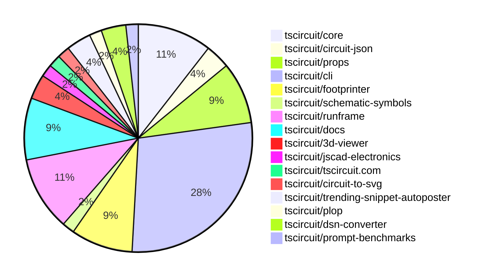

# Contribution Overview 2025-02-12

## PRs by Repository

## Contributor Overview

| Contributor | 🐳 Major | 🐙 Minor | 🐌 Tiny | ⭐ | Issues Created |
|-------------|---------|---------|---------|-----|----------------|
| [seveibar](#seveibar) | 4 | 5 | 1 | ⭐⭐⭐ | 49 |
| [imrishabh18](#imrishabh18) | 0 | 15 | 0 | ⭐⭐⭐ | 14 |
| [ArnavK-09](#ArnavK-09) | 3 | 4 | 3 | ⭐⭐ | 2 |
| [techmannih](#techmannih) | 1 | 6 | 0 | ⭐⭐ | 6 |
| [ShiboSoftwareDev](#ShiboSoftwareDev) | 0 | 1 | 0 | ⭐⭐ | 13 |
| [Anshgrover23](#Anshgrover23) | 1 | 8 | 0 | ⭐⭐ | 7 |
| [Abse2001](#Abse2001) | 0 | 2 | 0 | ⭐ | 1 |
| [kom-senapati](#kom-senapati) | 0 | 2 | 0 | ⭐ | 2 |
| [rohittcodes](#rohittcodes) | 0 | 1 | 0 |  | 0 |

## Review Table

[reviews-received-hover]: ## "Number of reviews received for PRs for this contributor"
[approvals-received-hover]: ## "Number of approvals received for PRs this contributor authored"
[rejections-received-hover]: ## "Number of rejections received for PRs this contributor authored"
[prs-opened-hover]: ## "Number of PRs opened by this contributor"
[issues-created-hover]: ## "Number of issues created by this contributor"
[bountied-issues-hover]: ## "Number of issues this contributor created with a bounty"
[bountied-issue-$-hover]: ## "Total bounty amount placed on issues authored by this contributor"

| Contributor | Reviews Received | Approvals Received | Rejections Received | Approvals | Rejections | PRs Opened | PRs Merged | Issues Created | Bountied Issues | Bountied Issue $ |
|---|---|---|---|---|---|---|---|---|---|---|
| [krushnarout](#krushnarout) | 1 | 1 | 0 | 0 | 0 | 2 | 0 | 0 | 0 | 0 |
| [007King007](#007King007) | 1 | 0 | 1 | 0 | 0 | 1 | 0 | 0 | 0 | 0 |
| [seveibar](#seveibar) | 0 | 0 | 0 | 31 | 8 | 10 | 10 | 49 | 40 | 676 |
| [zalabhavy](#zalabhavy) | 0 | 0 | 0 | 0 | 0 | 2 | 0 | 1 | 0 | 0 |
| [Anshgrover23](#Anshgrover23) | 32 | 13 | 5 | 4 | 11 | 13 | 9 | 7 | 0 | 0 |
| [Abse2001](#Abse2001) | 5 | 1 | 0 | 2 | 0 | 2 | 2 | 1 | 0 | 0 |
| [techmannih](#techmannih) | 38 | 14 | 7 | 0 | 1 | 13 | 7 | 6 | 4 | 30 |
| [imrishabh18](#imrishabh18) | 7 | 5 | 0 | 15 | 8 | 20 | 15 | 14 | 4 | 34 |
| [AnasSarkiz](#AnasSarkiz) | 0 | 0 | 0 | 0 | 1 | 0 | 0 | 0 | 0 | 0 |
| [rohittcodes](#rohittcodes) | 4 | 1 | 0 | 0 | 0 | 1 | 1 | 0 | 0 | 0 |
| [ShiboSoftwareDev](#ShiboSoftwareDev) | 1 | 1 | 0 | 1 | 1 | 5 | 1 | 13 | 7 | 137 |
| [arnavjoyel](#arnavjoyel) | 0 | 0 | 0 | 0 | 0 | 1 | 0 | 0 | 0 | 0 |
| [ArnavK-09](#ArnavK-09) | 42 | 11 | 7 | 1 | 2 | 12 | 10 | 2 | 0 | 0 |
| [Ayushjhawar8](#Ayushjhawar8) | 12 | 1 | 7 | 0 | 0 | 3 | 0 | 2 | 0 | 0 |
| [kom-senapati](#kom-senapati) | 13 | 5 | 2 | 0 | 0 | 5 | 2 | 2 | 0 | 0 |
| [deekshatomer](#deekshatomer) | 1 | 0 | 1 | 0 | 0 | 1 | 0 | 0 | 0 | 0 |
| [siva222003](#siva222003) | 1 | 1 | 0 | 0 | 0 | 1 | 0 | 0 | 0 | 0 |
| [Saurabhsing21](#Saurabhsing21) | 2 | 0 | 2 | 0 | 0 | 1 | 0 | 0 | 0 | 0 |

## Changes by Repository

### [tscircuit/core](https://github.com/tscircuit/core)

| PR # | Impact | Contributor | Description |
|------|--------|-------------|-------------|
| [#633](https://github.com/tscircuit/core/pull/633) | 🐳 Major | Anshgrover23 | Automatically create traces for a chip based on the `connections` prop. |
| [#628](https://github.com/tscircuit/core/pull/628) | 🐳 Major | techmannih | Implement a new switch component in the TSCircuit library. |
| [#629](https://github.com/tscircuit/core/pull/629) | 🐙 Minor | Anshgrover23 | Adds a new property "maxVoltageRating" to the Capacitor component and updates the schematic symbol display to show the voltage rating if it is present. |
| [#626](https://github.com/tscircuit/core/pull/626) | 🐙 Minor | Anshgrover23 | Adds support for four-pin crystal |
| [#625](https://github.com/tscircuit/core/pull/625) | 🐙 Minor | Anshgrover23 | Adds additional aliases to transistor ports, including "emitter", "collector", and "base". |
| [#630](https://github.com/tscircuit/core/pull/630) | 🐙 Minor | imrishabh18 | Update the version of the `@tscircuit/footprinter` dependency from `^0.0.97` to `^0.0.124`. |

### [tscircuit/circuit-json](https://github.com/tscircuit/circuit-json)

| PR # | Impact | Contributor | Description |
|------|--------|-------------|-------------|
| [#133](https://github.com/tscircuit/circuit-json/pull/133) | 🐙 Minor | Anshgrover23 | Add a new optional field `max_voltage_rating` to the `SourceSimpleCapacitor` interface. |
| [#131](https://github.com/tscircuit/circuit-json/pull/131) | 🐙 Minor | techmannih | Adds a missing switch from the `src` module to the `any_circuit_element.ts` file. |

### [tscircuit/props](https://github.com/tscircuit/props)

| PR # | Impact | Contributor | Description |
|------|--------|-------------|-------------|
| [#177](https://github.com/tscircuit/props/pull/177) | 🐳 Major | seveibar | Adds a new `platformConfig` module that defines the structure of the platform configuration object. |
| [#182](https://github.com/tscircuit/props/pull/182) | 🐙 Minor | Anshgrover23 | Adds a new optional property `schShowRatings` to the `CapacitorProps` interface and the `capacitorProps` object. |
| [#180](https://github.com/tscircuit/props/pull/180) | 🐙 Minor | Anshgrover23 | Adds the `maxVoltageRating` property to the `CapacitorProps` interface and the `capacitorProps` object. |
| [#176](https://github.com/tscircuit/props/pull/176) | 🐙 Minor | Anshgrover23 | Adds a new `connections` prop to the `ChipProps` interface, allowing users to specify connections for individual pins or groups of pins. |
| [#178](https://github.com/tscircuit/props/pull/178) | 🐙 Minor | techmannih | Add switch test cases to cover the switch component's functionality. |

### [tscircuit/cli](https://github.com/tscircuit/cli)

| PR # | Impact | Contributor | Description |
|------|--------|-------------|-------------|
| [#79](https://github.com/tscircuit/cli/pull/79) | 🐙 Minor | Anshgrover23 | Bumps the versions of various Storybook dependencies. |
| [#77](https://github.com/tscircuit/cli/pull/77) | 🐙 Minor | imrishabh18 | Fix the login command to check if the user is already logged in and display a message instead of trying to log in again. |
| [#72](https://github.com/tscircuit/cli/pull/72) | 🐙 Minor | imrishabh18 | Update the CLI prompts to provide more informative messages to the user. |
| [#61](https://github.com/tscircuit/cli/pull/61) | 🐙 Minor | imrishabh18 | Adds package.json file generation on init |
| [#69](https://github.com/tscircuit/cli/pull/69) | 🐙 Minor | imrishabh18 | Add a .gitignore file on `tsci init` |
| [#65](https://github.com/tscircuit/cli/pull/65) | 🐙 Minor | imrishabh18 | Change regular imports to use ES modules (esm) instead of CommonJS |
| [#62](https://github.com/tscircuit/cli/pull/62) | 🐙 Minor | imrishabh18 | Add a GitHub Actions workflow to test the project using Bun. |
| [#60](https://github.com/tscircuit/cli/pull/60) | 🐙 Minor | imrishabh18 | Update the `@tscircuit/runframe` dependency and add the `@tscircuit/eval` dependency. |
| [#81](https://github.com/tscircuit/cli/pull/81) | 🐙 Minor | ArnavK-09 | Fixed several unreliable or problematic tests, including the bump test, export test, and a test that was taking a long time to run. |
| [#64](https://github.com/tscircuit/cli/pull/64) | 🐙 Minor | ArnavK-09 | Avoids errors when standalone file is not found by falling back to the production version. |
| [#63](https://github.com/tscircuit/cli/pull/63) | 🐙 Minor | ArnavK-09 | Refactor the clone functionality to avoid duplicating code, use DRY principles, and add the ability to init the package.json before adding dependencies. |
| [#71](https://github.com/tscircuit/cli/pull/71) | 🐙 Minor | kom-senapati | Adds export to readable-netlist and dsn |
| [#57](https://github.com/tscircuit/cli/pull/57) | 🐙 Minor | kom-senapati | Adds export functionality to pcb-svg and schematic-svg |
| [#70](https://github.com/tscircuit/cli/pull/70) | 🐌 Tiny | seveibar | Add Rishabh, Seve, and Arn as CODEOWNERS |
| [#73](https://github.com/tscircuit/cli/pull/73) | 🐌 Tiny | ArnavK-09 | Bump versions of GitHub Actions used in the project |
| [#66](https://github.com/tscircuit/cli/pull/66) | 🐌 Tiny | ArnavK-09 | Removes comments from the `setup-tsci-packages.ts` file. |

### [tscircuit/footprinter](https://github.com/tscircuit/footprinter)

| PR # | Impact | Contributor | Description |
|------|--------|-------------|-------------|
| [#191](https://github.com/tscircuit/footprinter/pull/191) | 🐙 Minor | techmannih | Increased the outer diameter of the plated holes for the push button pads. |
| [#175](https://github.com/tscircuit/footprinter/pull/175) | 🐙 Minor | techmannih | Add SMF footprint to the library. |
| [#186](https://github.com/tscircuit/footprinter/pull/186) | 🐙 Minor | techmannih | Rename the `pad_spacing` parameter to `p` and add the missing footprint information. |
| [#187](https://github.com/tscircuit/footprinter/pull/187) | 🐙 Minor | imrishabh18 | Fix unit conversion issue and jscad footprint placement issue |
| [#130](https://github.com/tscircuit/footprinter/pull/130) | 🐙 Minor | rohittcodes | Adds a polarity marking to the PCB silkscreen |

### [tscircuit/schematic-symbols](https://github.com/tscircuit/schematic-symbols)

| PR # | Impact | Contributor | Description |
|------|--------|-------------|-------------|
| [#249](https://github.com/tscircuit/schematic-symbols/pull/249) | 🐙 Minor | techmannih | Fixes the incorrect pin name for the SPDT (Single Pole Double Throw) switch by updating the coordinates of the "right2" pin. |

### [tscircuit/runframe](https://github.com/tscircuit/runframe)

| PR # | Impact | Contributor | Description |
|------|--------|-------------|-------------|
| [#252](https://github.com/tscircuit/runframe/pull/252) | 🐳 Major | seveibar | Improves iframe messaging and support in the RunFrame component. |
| [#243](https://github.com/tscircuit/runframe/pull/243) | 🐳 Major | seveibar | Adds a standalone iframe build and export functionality to the Cosmos export |
| [#251](https://github.com/tscircuit/runframe/pull/251) | 🐳 Major | ArnavK-09 | Adds new components for the Runframe CLI, including a left header with file management and export options. |
| [#254](https://github.com/tscircuit/runframe/pull/254) | 🐙 Minor | seveibar | Add an iframe loader with a loading animation and prevent fullscreen mode for the iframe |
| [#235](https://github.com/tscircuit/runframe/pull/235) | 🐙 Minor | imrishabh18 | Add the standalone.min.js file in the build dist directory |
| [#234](https://github.com/tscircuit/runframe/pull/234) | 🐙 Minor | imrishabh18 | Fix the "debug grid" prop in the `CircuitJsonPreview` component. |

### [tscircuit/docs](https://github.com/tscircuit/docs)

| PR # | Impact | Contributor | Description |
|------|--------|-------------|-------------|
| [#12](https://github.com/tscircuit/docs/pull/12) | 🐳 Major | seveibar | Adds documentation for various footprint strings used in the project. |
| [#13](https://github.com/tscircuit/docs/pull/13) | 🐙 Minor | seveibar | Adds new pages for `<silkscreencircle>`, `<silkscreenrect>`, and `<solderpaste>` elements, and updates the `building-a-simple-usb-flashlight.mdx` tutorial. |
| [#11](https://github.com/tscircuit/docs/pull/11) | 🐙 Minor | seveibar | Adds an AI context file (ai.txt) and a link to it in the documentation. |
| [#10](https://github.com/tscircuit/docs/pull/10) | 🐙 Minor | seveibar | Add new `<pinheader>` and `<via>` elements, remove `<jumper>` element, add group content, and apply mobile fixes. |
| [#9](https://github.com/tscircuit/docs/pull/9) | 🐙 Minor | seveibar | Adds documentation for the `@tscircuit/math-utils` package, including a utility function to generate a grid of cells, and adds documentation for various circuit elements like `<group>`, `<potentiometer>`, `<pushbutton>`, `<resonator>`, and `<subcircuit>`. |

### [tscircuit/3d-viewer](https://github.com/tscircuit/3d-viewer)

| PR # | Impact | Contributor | Description |
|------|--------|-------------|-------------|
| [#179](https://github.com/tscircuit/3d-viewer/pull/179) | 🐙 Minor | imrishabh18 | Update core and add story of the fixed dip footprint |
| [#176](https://github.com/tscircuit/3d-viewer/pull/176) | 🐙 Minor | imrishabh18 | Remove `react-fiber` and update `jscad-electronics` to version `0.0.25`. |

### [tscircuit/jscad-electronics](https://github.com/tscircuit/jscad-electronics)

| PR # | Impact | Contributor | Description |
|------|--------|-------------|-------------|
| [#86](https://github.com/tscircuit/jscad-electronics/pull/86) | 🐙 Minor | imrishabh18 | Fix the position placement of the footprint in the DualInlinePackage component. |

### [tscircuit/tscircuit.com](https://github.com/tscircuit/tscircuit.com)

| PR # | Impact | Contributor | Description |
|------|--------|-------------|-------------|
| [#667](https://github.com/tscircuit/tscircuit.com/pull/667) | 🐙 Minor | imrishabh18 | Update the dependency `@tscircuit/core` from version `0.0.308` to `0.0.311` |

### [tscircuit/circuit-to-svg](https://github.com/tscircuit/circuit-to-svg)

| PR # | Impact | Contributor | Description |
|------|--------|-------------|-------------|
| [#167](https://github.com/tscircuit/circuit-to-svg/pull/167) | 🐳 Major | ArnavK-09 | Adds support for displaying rats nest connections in the PCB SVG |

### [tscircuit/trending-snippet-autoposter](https://github.com/tscircuit/trending-snippet-autoposter)

| PR # | Impact | Contributor | Description |
|------|--------|-------------|-------------|
| [#4](https://github.com/tscircuit/trending-snippet-autoposter/pull/4) | 🐳 Major | ArnavK-09 | This pull request bootstraps the repository by adding Bun scripts, GitHub Actions for weekly posting, and a .gitignore file. |
| [#7](https://github.com/tscircuit/trending-snippet-autoposter/pull/7) | 🐌 Tiny | ArnavK-09 | Removes Twitter API credentials from the example.env file. |

### [tscircuit/plop](https://github.com/tscircuit/plop)

| PR # | Impact | Contributor | Description |
|------|--------|-------------|-------------|
| [#9](https://github.com/tscircuit/plop/pull/9) | 🐙 Minor | ArnavK-09 | Bump the versions of the GitHub Actions used in the Bun-related workflows. |

### [tscircuit/dsn-converter](https://github.com/tscircuit/dsn-converter)

| PR # | Impact | Contributor | Description |
|------|--------|-------------|-------------|
| [#92](https://github.com/tscircuit/dsn-converter/pull/92) | 🐙 Minor | Abse2001 | Improved smoothie board parsing and added an isolated test for the next issue, which will be the rotation of components. |
| [#91](https://github.com/tscircuit/dsn-converter/pull/91) | 🐙 Minor | Abse2001 | Add support for component rotation in the PCB conversion process. |

### [tscircuit/prompt-benchmarks](https://github.com/tscircuit/prompt-benchmarks)

| PR # | Impact | Contributor | Description |
|------|--------|-------------|-------------|
| [#36](https://github.com/tscircuit/prompt-benchmarks/pull/36) | 🐙 Minor | ShiboSoftwareDev | The pull request migrates the code from using Anthropic's Claude models to using OpenAI's models for prompt completions and error correction. |

## Changes by Contributor

### [Anshgrover23](https://github.com/Anshgrover23)

| PR # | Impact | Description |
|------|--------|-------------|
| [#633](https://github.com/tscircuit/core/pull/633) | 🐳 Major | Automatically create traces for a chip based on the `connections` prop. |
| [#133](https://github.com/tscircuit/circuit-json/pull/133) | 🐙 Minor | Add a new optional field `max_voltage_rating` to the `SourceSimpleCapacitor` interface. |
| [#182](https://github.com/tscircuit/props/pull/182) | 🐙 Minor | Adds a new optional property `schShowRatings` to the `CapacitorProps` interface and the `capacitorProps` object. |
| [#180](https://github.com/tscircuit/props/pull/180) | 🐙 Minor | Adds the `maxVoltageRating` property to the `CapacitorProps` interface and the `capacitorProps` object. |
| [#176](https://github.com/tscircuit/props/pull/176) | 🐙 Minor | Adds a new `connections` prop to the `ChipProps` interface, allowing users to specify connections for individual pins or groups of pins. |
| [#629](https://github.com/tscircuit/core/pull/629) | 🐙 Minor | Adds a new property "maxVoltageRating" to the Capacitor component and updates the schematic symbol display to show the voltage rating if it is present. |
| [#626](https://github.com/tscircuit/core/pull/626) | 🐙 Minor | Adds support for four-pin crystal |
| [#625](https://github.com/tscircuit/core/pull/625) | 🐙 Minor | Adds additional aliases to transistor ports, including "emitter", "collector", and "base". |
| [#79](https://github.com/tscircuit/cli/pull/79) | 🐙 Minor | Bumps the versions of various Storybook dependencies. |

### [techmannih](https://github.com/techmannih)

| PR # | Impact | Description |
|------|--------|-------------|
| [#628](https://github.com/tscircuit/core/pull/628) | 🐳 Major | Implement a new switch component in the TSCircuit library. |
| [#131](https://github.com/tscircuit/circuit-json/pull/131) | 🐙 Minor | Adds a missing switch from the `src` module to the `any_circuit_element.ts` file. |
| [#178](https://github.com/tscircuit/props/pull/178) | 🐙 Minor | Add switch test cases to cover the switch component's functionality. |
| [#191](https://github.com/tscircuit/footprinter/pull/191) | 🐙 Minor | Increased the outer diameter of the plated holes for the push button pads. |
| [#175](https://github.com/tscircuit/footprinter/pull/175) | 🐙 Minor | Add SMF footprint to the library. |
| [#186](https://github.com/tscircuit/footprinter/pull/186) | 🐙 Minor | Rename the `pad_spacing` parameter to `p` and add the missing footprint information. |
| [#249](https://github.com/tscircuit/schematic-symbols/pull/249) | 🐙 Minor | Fixes the incorrect pin name for the SPDT (Single Pole Double Throw) switch by updating the coordinates of the "right2" pin. |

### [seveibar](https://github.com/seveibar)

| PR # | Impact | Description |
|------|--------|-------------|
| [#177](https://github.com/tscircuit/props/pull/177) | 🐳 Major | Adds a new `platformConfig` module that defines the structure of the platform configuration object. |
| [#252](https://github.com/tscircuit/runframe/pull/252) | 🐳 Major | Improves iframe messaging and support in the RunFrame component. |
| [#243](https://github.com/tscircuit/runframe/pull/243) | 🐳 Major | Adds a standalone iframe build and export functionality to the Cosmos export |
| [#12](https://github.com/tscircuit/docs/pull/12) | 🐳 Major | Adds documentation for various footprint strings used in the project. |
| [#254](https://github.com/tscircuit/runframe/pull/254) | 🐙 Minor | Add an iframe loader with a loading animation and prevent fullscreen mode for the iframe |
| [#13](https://github.com/tscircuit/docs/pull/13) | 🐙 Minor | Adds new pages for `<silkscreencircle>`, `<silkscreenrect>`, and `<solderpaste>` elements, and updates the `building-a-simple-usb-flashlight.mdx` tutorial. |
| [#11](https://github.com/tscircuit/docs/pull/11) | 🐙 Minor | Adds an AI context file (ai.txt) and a link to it in the documentation. |
| [#10](https://github.com/tscircuit/docs/pull/10) | 🐙 Minor | Add new `<pinheader>` and `<via>` elements, remove `<jumper>` element, add group content, and apply mobile fixes. |
| [#9](https://github.com/tscircuit/docs/pull/9) | 🐙 Minor | Adds documentation for the `@tscircuit/math-utils` package, including a utility function to generate a grid of cells, and adds documentation for various circuit elements like `<group>`, `<potentiometer>`, `<pushbutton>`, `<resonator>`, and `<subcircuit>`. |
| [#70](https://github.com/tscircuit/cli/pull/70) | 🐌 Tiny | Add Rishabh, Seve, and Arn as CODEOWNERS |

### [imrishabh18](https://github.com/imrishabh18)

| PR # | Impact | Description |
|------|--------|-------------|
| [#187](https://github.com/tscircuit/footprinter/pull/187) | 🐙 Minor | Fix unit conversion issue and jscad footprint placement issue |
| [#179](https://github.com/tscircuit/3d-viewer/pull/179) | 🐙 Minor | Update core and add story of the fixed dip footprint |
| [#176](https://github.com/tscircuit/3d-viewer/pull/176) | 🐙 Minor | Remove `react-fiber` and update `jscad-electronics` to version `0.0.25`. |
| [#630](https://github.com/tscircuit/core/pull/630) | 🐙 Minor | Update the version of the `@tscircuit/footprinter` dependency from `^0.0.97` to `^0.0.124`. |
| [#86](https://github.com/tscircuit/jscad-electronics/pull/86) | 🐙 Minor | Fix the position placement of the footprint in the DualInlinePackage component. |
| [#667](https://github.com/tscircuit/tscircuit.com/pull/667) | 🐙 Minor | Update the dependency `@tscircuit/core` from version `0.0.308` to `0.0.311` |
| [#235](https://github.com/tscircuit/runframe/pull/235) | 🐙 Minor | Add the standalone.min.js file in the build dist directory |
| [#234](https://github.com/tscircuit/runframe/pull/234) | 🐙 Minor | Fix the "debug grid" prop in the `CircuitJsonPreview` component. |
| [#77](https://github.com/tscircuit/cli/pull/77) | 🐙 Minor | Fix the login command to check if the user is already logged in and display a message instead of trying to log in again. |
| [#72](https://github.com/tscircuit/cli/pull/72) | 🐙 Minor | Update the CLI prompts to provide more informative messages to the user. |
| [#61](https://github.com/tscircuit/cli/pull/61) | 🐙 Minor | Adds package.json file generation on init |
| [#69](https://github.com/tscircuit/cli/pull/69) | 🐙 Minor | Add a .gitignore file on `tsci init` |
| [#65](https://github.com/tscircuit/cli/pull/65) | 🐙 Minor | Change regular imports to use ES modules (esm) instead of CommonJS |
| [#62](https://github.com/tscircuit/cli/pull/62) | 🐙 Minor | Add a GitHub Actions workflow to test the project using Bun. |
| [#60](https://github.com/tscircuit/cli/pull/60) | 🐙 Minor | Update the `@tscircuit/runframe` dependency and add the `@tscircuit/eval` dependency. |

### [rohittcodes](https://github.com/rohittcodes)

| PR # | Impact | Description |
|------|--------|-------------|
| [#130](https://github.com/tscircuit/footprinter/pull/130) | 🐙 Minor | Adds a polarity marking to the PCB silkscreen |

### [ArnavK-09](https://github.com/ArnavK-09)

| PR # | Impact | Description |
|------|--------|-------------|
| [#167](https://github.com/tscircuit/circuit-to-svg/pull/167) | 🐳 Major | Adds support for displaying rats nest connections in the PCB SVG |
| [#251](https://github.com/tscircuit/runframe/pull/251) | 🐳 Major | Adds new components for the Runframe CLI, including a left header with file management and export options. |
| [#4](https://github.com/tscircuit/trending-snippet-autoposter/pull/4) | 🐳 Major | This pull request bootstraps the repository by adding Bun scripts, GitHub Actions for weekly posting, and a .gitignore file. |
| [#9](https://github.com/tscircuit/plop/pull/9) | 🐙 Minor | Bump the versions of the GitHub Actions used in the Bun-related workflows. |
| [#81](https://github.com/tscircuit/cli/pull/81) | 🐙 Minor | Fixed several unreliable or problematic tests, including the bump test, export test, and a test that was taking a long time to run. |
| [#64](https://github.com/tscircuit/cli/pull/64) | 🐙 Minor | Avoids errors when standalone file is not found by falling back to the production version. |
| [#63](https://github.com/tscircuit/cli/pull/63) | 🐙 Minor | Refactor the clone functionality to avoid duplicating code, use DRY principles, and add the ability to init the package.json before adding dependencies. |
| [#73](https://github.com/tscircuit/cli/pull/73) | 🐌 Tiny | Bump versions of GitHub Actions used in the project |
| [#66](https://github.com/tscircuit/cli/pull/66) | 🐌 Tiny | Removes comments from the `setup-tsci-packages.ts` file. |
| [#7](https://github.com/tscircuit/trending-snippet-autoposter/pull/7) | 🐌 Tiny | Removes Twitter API credentials from the example.env file. |

### [Abse2001](https://github.com/Abse2001)

| PR # | Impact | Description |
|------|--------|-------------|
| [#92](https://github.com/tscircuit/dsn-converter/pull/92) | 🐙 Minor | Improved smoothie board parsing and added an isolated test for the next issue, which will be the rotation of components. |
| [#91](https://github.com/tscircuit/dsn-converter/pull/91) | 🐙 Minor | Add support for component rotation in the PCB conversion process. |

### [ShiboSoftwareDev](https://github.com/ShiboSoftwareDev)

| PR # | Impact | Description |
|------|--------|-------------|
| [#36](https://github.com/tscircuit/prompt-benchmarks/pull/36) | 🐙 Minor | The pull request migrates the code from using Anthropic's Claude models to using OpenAI's models for prompt completions and error correction. |

### [kom-senapati](https://github.com/kom-senapati)

| PR # | Impact | Description |
|------|--------|-------------|
| [#71](https://github.com/tscircuit/cli/pull/71) | 🐙 Minor | Adds export to readable-netlist and dsn |
| [#57](https://github.com/tscircuit/cli/pull/57) | 🐙 Minor | Adds export functionality to pcb-svg and schematic-svg |

