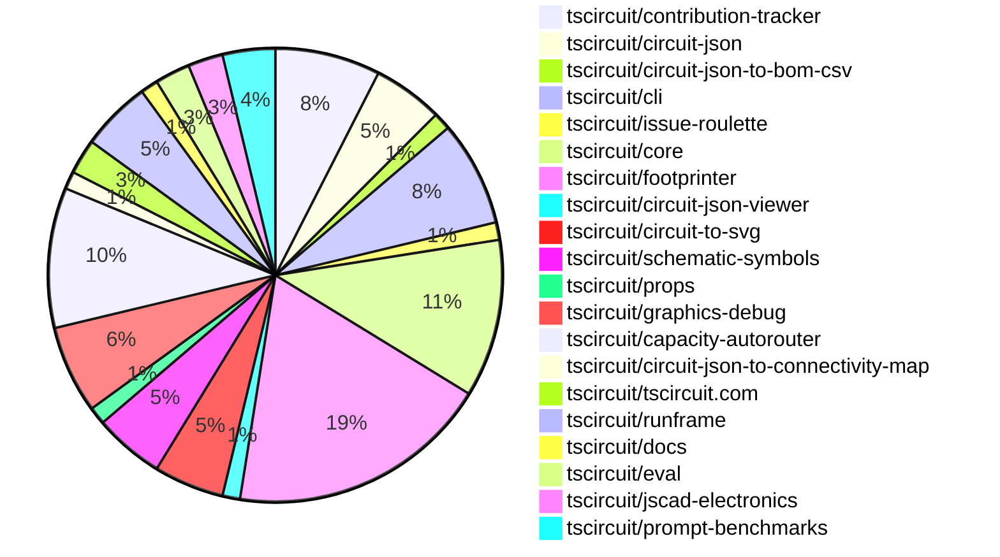

# Contribution Overview 2025-02-19

## PRs by Repository

## Contributor Overview

| Contributor | 🐳 Major | 🐙 Minor | 🐌 Tiny | ⭐ | Issues Created |
|-------------|---------|---------|---------|-----|----------------|
| [seveibar](#seveibar) | 11 | 9 | 1 | 👑 | 49 |
| [techmannih](#techmannih) | 2 | 10 | 1 | ⭐⭐⭐ | 6 |
| [imrishabh18](#imrishabh18) | 0 | 7 | 2 | ⭐⭐ | 13 |
| [Abse2001](#Abse2001) | 2 | 5 | 0 | ⭐⭐ | 4 |
| [kom-senapati](#kom-senapati) | 1 | 4 | 1 | ⭐⭐ | 5 |
| [ShiboSoftwareDev](#ShiboSoftwareDev) | 0 | 3 | 0 | ⭐⭐ | 10 |
| [Ayushjhawar8](#Ayushjhawar8) | 1 | 2 | 0 | ⭐ | 2 |
| [ArnavK-09](#ArnavK-09) | 0 | 3 | 1 | ⭐ | 1 |
| [Anshgrover23](#Anshgrover23) | 0 | 3 | 0 | ⭐ | 3 |
| [MustafaMulla29](#MustafaMulla29) | 1 | 1 | 0 | ⭐ | 1 |
| [AnasSarkiz](#AnasSarkiz) | 0 | 2 | 0 | ⭐ | 2 |
| [siva222003](#siva222003) | 0 | 1 | 0 |  | 1 |

## Review Table

[reviews-received-hover]: ## "Number of reviews received for PRs for this contributor"
[approvals-received-hover]: ## "Number of approvals received for PRs this contributor authored"
[rejections-received-hover]: ## "Number of rejections received for PRs this contributor authored"
[prs-opened-hover]: ## "Number of PRs opened by this contributor"
[issues-created-hover]: ## "Number of issues created by this contributor"
[bountied-issues-hover]: ## "Number of issues this contributor created with a bounty"
[bountied-issue-$-hover]: ## "Total bounty amount placed on issues authored by this contributor"

| Contributor | Reviews Received | Approvals Received | Rejections Received | Approvals | Rejections | PRs Opened | PRs Merged | Issues Created | Bountied Issues | Bountied Issue $ |
|---|---|---|---|---|---|---|---|---|---|---|
| [rohitbhure65](#rohitbhure65) | 2 | 0 | 1 | 0 | 0 | 7 | 0 | 0 | 0 | 0 |
| [imrishabh18](#imrishabh18) | 10 | 5 | 0 | 12 | 3 | 11 | 9 | 13 | 5 | 59 |
| [kom-senapati](#kom-senapati) | 32 | 18 | 4 | 0 | 0 | 11 | 7 | 5 | 0 | 0 |
| [seveibar](#seveibar) | 1 | 1 | 0 | 40 | 7 | 25 | 24 | 49 | 31 | 473 |
| [Abse2001](#Abse2001) | 11 | 8 | 1 | 0 | 0 | 7 | 7 | 4 | 1 | 10 |
| [techmannih](#techmannih) | 30 | 15 | 5 | 3 | 1 | 17 | 13 | 6 | 4 | 32 |
| [Anshgrover23](#Anshgrover23) | 5 | 3 | 2 | 8 | 10 | 4 | 3 | 3 | 0 | 0 |
| [PatanSharuKhan](#PatanSharuKhan) | 1 | 0 | 1 | 0 | 0 | 1 | 0 | 0 | 0 | 0 |
| [ShiboSoftwareDev](#ShiboSoftwareDev) | 2 | 1 | 1 | 3 | 1 | 5 | 3 | 10 | 6 | 170 |
| [deekshatomer](#deekshatomer) | 2 | 0 | 2 | 0 | 0 | 2 | 0 | 0 | 0 | 0 |
| [MustafaMulla29](#MustafaMulla29) | 8 | 6 | 1 | 0 | 0 | 4 | 2 | 1 | 0 | 0 |
| [AnasSarkiz](#AnasSarkiz) | 4 | 3 | 0 | 0 | 1 | 3 | 3 | 2 | 1 | 5 |
| [ArnavK-09](#ArnavK-09) | 6 | 6 | 0 | 6 | 4 | 6 | 5 | 1 | 0 | 0 |
| [Ayushjhawar8](#Ayushjhawar8) | 9 | 3 | 3 | 0 | 0 | 3 | 3 | 2 | 0 | 0 |
| [siva222003](#siva222003) | 5 | 1 | 1 | 0 | 0 | 2 | 1 | 1 | 0 | 0 |
| [AayushSaini101](#AayushSaini101) | 21 | 2 | 5 | 0 | 0 | 1 | 0 | 0 | 0 | 0 |

## Changes by Repository

### [tscircuit/contribution-tracker](https://github.com/tscircuit/contribution-tracker)

| PR # | Impact | Contributor | Description |
|------|--------|-------------|-------------|
| [#82](https://github.com/tscircuit/contribution-tracker/pull/82) | 🐳 Major | kom-senapati | Automates the generation of a CSV file containing sponsorship information for project contributors. |
| [#81](https://github.com/tscircuit/contribution-tracker/pull/81) | 🐙 Minor | kom-senapati | Add Header, Footer components and Favicon |
| [#72](https://github.com/tscircuit/contribution-tracker/pull/72) | 🟣 | kom-senapati | Add GitHub workflows for format check, testing, and type checking |
| [#84](https://github.com/tscircuit/contribution-tracker/pull/84) | 🐙 Minor | seveibar | The pull request refactors the codebase for improved readability, changes the scoring logic for bountied issues, and updates the project configuration. |
| [#76](https://github.com/tscircuit/contribution-tracker/pull/76) | 🐙 Minor | ArnavK-09 | The pull request changes the way review information is processed for merged and non-merged pull requests, ensuring that only the latest review per user is considered for merged PRs. |
| [#58](https://github.com/tscircuit/contribution-tracker/pull/58) | 🐙 Minor | Ayushjhawar8 | The pull request introduces a change to handle the display of full-time contributors separately from other contributors in the contributor overview section. |

### [tscircuit/circuit-json](https://github.com/tscircuit/circuit-json)

| PR # | Impact | Contributor | Description |
|------|--------|-------------|-------------|
| [#140](https://github.com/tscircuit/circuit-json/pull/140) | 🐙 Minor | kom-senapati | Removes the `rotation` field from the `SchematicComponent` interface and the corresponding `schematic_component` Zod schema. |
| [#138](https://github.com/tscircuit/circuit-json/pull/138) | 🐙 Minor | Abse2001 | Adding the `pcb_autorouting_error` type to the `any_circuit_element` type. |
| [#137](https://github.com/tscircuit/circuit-json/pull/137) | 🐙 Minor | Abse2001 | Adds a new type `AutoroutingError` to represent errors that occur during autorouting of a PCB. |
| [#135](https://github.com/tscircuit/circuit-json/pull/135) | 🐙 Minor | techmannih | Add stroke width for silkscreen circle and silkscreen rectangle |

### [tscircuit/circuit-json-to-bom-csv](https://github.com/tscircuit/circuit-json-to-bom-csv)

| PR # | Impact | Contributor | Description |
|------|--------|-------------|-------------|
| [#6](https://github.com/tscircuit/circuit-json-to-bom-csv/pull/6) | 🐙 Minor | kom-senapati | Add LCSC interpretation to the JLCPCB Part # column in the BOM CSV |

### [tscircuit/cli](https://github.com/tscircuit/cli)

| PR # | Impact | Contributor | Description |
|------|--------|-------------|-------------|
| [#87](https://github.com/tscircuit/cli/pull/87) | 🐙 Minor | kom-senapati | Adds a GitHub Actions workflow to automatically update the README file with the CLI usage documentation. |
| [#89](https://github.com/tscircuit/cli/pull/89) | 🟣 | seveibar | Remove all the "import @tscircuit/core" statements from the codebase. |
| [#88](https://github.com/tscircuit/cli/pull/88) | 🐳 Major | seveibar | Massive reduction in install size (from ~500MB to ~25MB) by bundling using `bun build` instead of `tsup-node`. |
| [#96](https://github.com/tscircuit/cli/pull/96) | 🐙 Minor | imrishabh18 | Update dependency @tscircuit/core from version 0.0.249 to 0.0.323 |
| [#95](https://github.com/tscircuit/cli/pull/95) | 🐙 Minor | ArnavK-09 | Add support for detecting the Bun package manager by checking for the presence of a `bun.lock` file. |
| [#92](https://github.com/tscircuit/cli/pull/92) | 🟣 | ArnavK-09 |  |

### [tscircuit/issue-roulette](https://github.com/tscircuit/issue-roulette)

| PR # | Impact | Contributor | Description |
|------|--------|-------------|-------------|
| [#19](https://github.com/tscircuit/issue-roulette/pull/19) | 🐌 Tiny | kom-senapati | Remove package-lock.json file |

### [tscircuit/core](https://github.com/tscircuit/core)

| PR # | Impact | Contributor | Description |
|------|--------|-------------|-------------|
| [#649](https://github.com/tscircuit/core/pull/649) | 🐳 Major | Abse2001 | Inserts a `pcb_trace_error` when a trace is routed outside the board boundaries. |
| [#639](https://github.com/tscircuit/core/pull/639) | 🐳 Major | Abse2001 | Adds silkscreen text for component names in the PCB footprint |
| [#645](https://github.com/tscircuit/core/pull/645) | 🐳 Major | seveibar | Fix connections implementation to automatically create nets and be accepted across NormalComponents |
| [#644](https://github.com/tscircuit/core/pull/644) | 🐙 Minor | Abse2001 |  |
| [#646](https://github.com/tscircuit/core/pull/646) | 🐙 Minor | techmannih | Update the jumper test with rows and the footprint |
| [#638](https://github.com/tscircuit/core/pull/638) | 🐙 Minor | seveibar | Adds more common pin names to the `sel-utility-types.ts` file. |
| [#643](https://github.com/tscircuit/core/pull/643) | 🐙 Minor | imrishabh18 | Adds the `@tscircuit/footprinter` package as a peer dependency and updates the `bun.lockb` file. |
| [#641](https://github.com/tscircuit/core/pull/641) | 🐙 Minor | imrishabh18 | Update the version of the "@tscircuit/footprinter" dependency from 0.0.128 to 0.0.135. |
| [#640](https://github.com/tscircuit/core/pull/640) | 🐙 Minor | imrishabh18 | The pull request adds the `subcircuit_id` property to the output `pcb_trace` objects in the `Group` component. |

### [tscircuit/footprinter](https://github.com/tscircuit/footprinter)

| PR # | Impact | Contributor | Description |
|------|--------|-------------|-------------|
| [#215](https://github.com/tscircuit/footprinter/pull/215) | 🐳 Major | techmannih | This pull request adds support for the SOT223 footprint. |
| [#184](https://github.com/tscircuit/footprinter/pull/184) | 🐳 Major | MustafaMulla29 | Implemented VSSOP-8-0.65mm footprint |
| [#208](https://github.com/tscircuit/footprinter/pull/208) | 🐙 Minor | Abse2001 | Fixed NaN in sot23 silkscreen |
| [#161](https://github.com/tscircuit/footprinter/pull/161) | 🐙 Minor | techmannih | Add SOT89-3 footprint |
| [#135](https://github.com/tscircuit/footprinter/pull/135) | 🐙 Minor | techmannih | Add a new footprint for the SOD323 package. |
| [#216](https://github.com/tscircuit/footprinter/pull/216) | 🐙 Minor | techmannih | Add a new "rows" parameter to the pinrow footprint function, allowing the creation of multi-row pin headers. |
| [#218](https://github.com/tscircuit/footprinter/pull/218) | 🐙 Minor | techmannih | Update snapshot due to bound issue |
| [#148](https://github.com/tscircuit/footprinter/pull/148) | 🐙 Minor | techmannih | Adds a new footprint for the SOD123W component. |
| [#214](https://github.com/tscircuit/footprinter/pull/214) | 🐙 Minor | Anshgrover23 | Fix the incorrect pad layout for the TO-220-5 footprint. |
| [#209](https://github.com/tscircuit/footprinter/pull/209) | 🐙 Minor | Anshgrover23 | Adds a new DIP 0.1 inch test case |
| [#206](https://github.com/tscircuit/footprinter/pull/206) | 🐙 Minor | MustafaMulla29 | Fixed the incorrect marking of pins in the `stampreceiver` function. |
| [#212](https://github.com/tscircuit/footprinter/pull/212) | 🐙 Minor | imrishabh18 | Fixes the number format for the `sot23_N` footprint, where N can be 3, 5, 6, etc. |
| [#210](https://github.com/tscircuit/footprinter/pull/210) | 🐙 Minor | imrishabh18 | Fix to220 footprint parsing |
| [#204](https://github.com/tscircuit/footprinter/pull/204) | 🐙 Minor | AnasSarkiz | Added support for male and female flags in the pinrow footprint definition. |
| [#207](https://github.com/tscircuit/footprinter/pull/207) | 🐌 Tiny | imrishabh18 | Add a build workflow for the Bun runtime. |

### [tscircuit/circuit-json-viewer](https://github.com/tscircuit/circuit-json-viewer)

| PR # | Impact | Contributor | Description |
|------|--------|-------------|-------------|
| [#3](https://github.com/tscircuit/circuit-json-viewer/pull/3) | 🐙 Minor | Abse2001 | Updated the version of the `@tscircuit/runframe` dependency from `0.0.12` to `0.0.189`. |

### [tscircuit/circuit-to-svg](https://github.com/tscircuit/circuit-to-svg)

| PR # | Impact | Contributor | Description |
|------|--------|-------------|-------------|
| [#170](https://github.com/tscircuit/circuit-to-svg/pull/170) | 🐳 Major | techmannih | Add support for silkscreenline, silkscreencircle, and silkscreenrect elements in the PCB SVG conversion process. |
| [#177](https://github.com/tscircuit/circuit-to-svg/pull/177) | 🐙 Minor | techmannih | Update the snapshot for the chip-crossing-schemtic-example1 test case. |
| [#172](https://github.com/tscircuit/circuit-to-svg/pull/172) | 🐙 Minor | Anshgrover23 | Fixes an issue with the incorrect bounds calculation in the circuit-to-SVG conversion process. |
| [#176](https://github.com/tscircuit/circuit-to-svg/pull/176) | 🐌 Tiny | imrishabh18 | Deletes the `testing.tsx` file. |

### [tscircuit/schematic-symbols](https://github.com/tscircuit/schematic-symbols)

| PR # | Impact | Contributor | Description |
|------|--------|-------------|-------------|
| [#259](https://github.com/tscircuit/schematic-symbols/pull/259) | 🐙 Minor | techmannih | Improve the resistor symbol by adding new visual elements and annotations. |
| [#257](https://github.com/tscircuit/schematic-symbols/pull/257) | 🐙 Minor | techmannih | Replaced the emitter and collector pins for the NPN bipolar transistor symbol. |
| [#258](https://github.com/tscircuit/schematic-symbols/pull/258) | 🐌 Tiny | techmannih | Removes unnecessary model files |
| [#256](https://github.com/tscircuit/schematic-symbols/pull/256) | 🐌 Tiny | seveibar | Removes unused directories from the package output |

### [tscircuit/props](https://github.com/tscircuit/props)

| PR # | Impact | Contributor | Description |
|------|--------|-------------|-------------|
| [#186](https://github.com/tscircuit/props/pull/186) | 🐳 Major | seveibar | Introduce `layoutMode`, `pcbLayout` and `schLayout` to allow flexbox layout and grid layout inside of `<group />`. |

### [tscircuit/graphics-debug](https://github.com/tscircuit/graphics-debug)

| PR # | Impact | Contributor | Description |
|------|--------|-------------|-------------|
| [#27](https://github.com/tscircuit/graphics-debug/pull/27) | 🐳 Major | seveibar | Adds a function to draw canvas graphics with a simple example implementation. |
| [#28](https://github.com/tscircuit/graphics-debug/pull/28) | 🐙 Minor | seveibar | Adds an `onObjectClicked` callback function to the `InteractiveGraphics` component and its child components (Circle, Line, Point, Rect). |
| [#26](https://github.com/tscircuit/graphics-debug/pull/26) | 🟣 | seveibar | Track the original index prior to filtering for color stability in the InteractiveGraphics component. |
| [#25](https://github.com/tscircuit/graphics-debug/pull/25) | 🐙 Minor | seveibar | The pull request initializes the "Claude" file, adds optimizations for filtering offscreen elements, and factors hooks to a separate directory. |
| [#24](https://github.com/tscircuit/graphics-debug/pull/24) | 🐙 Minor | seveibar | Add dash array and line cap to the Line component |

### [tscircuit/capacity-autorouter](https://github.com/tscircuit/capacity-autorouter)

| PR # | Impact | Contributor | Description |
|------|--------|-------------|-------------|
| [#13](https://github.com/tscircuit/capacity-autorouter/pull/13) | 🐳 Major | seveibar | Optimizes the larger LED matrix, fixes the Hyper Debugger, and adjusts the SegmentPointOptimizer probability formula to never exceed 1 and consider trace capacity. |
| [#12](https://github.com/tscircuit/capacity-autorouter/pull/12) | 🐳 Major | seveibar | High Density Improvements, Segment Optimizer Fixes, LED Matrix 2 now routing completely, Segment Optimizer doesn't place vias in low capacity nodes |
| [#11](https://github.com/tscircuit/capacity-autorouter/pull/11) | 🐳 Major | seveibar | The changes in this pull request optimize the segmentation points for layer changes in a circuit board design. |
| [#8](https://github.com/tscircuit/capacity-autorouter/pull/8) | 🐳 Major | seveibar | The pull request introduces several changes, including capacity function tuning, more tests, LED matrices, and caching for overlapping obstacles, as well as a fix for obstacle traversal. |
| [#5](https://github.com/tscircuit/capacity-autorouter/pull/5) | 🐳 Major | seveibar | Improve Difficult very dense edge cases, add higher difficulty cases, support for connection map for deliberate shorting, add second keyboard test |
| [#3](https://github.com/tscircuit/capacity-autorouter/pull/3) | 🐳 Major | seveibar | The pull request introduces many improvements to animation and fixes issues in the hyper-parameter solver. |
| [#2](https://github.com/tscircuit/capacity-autorouter/pull/2) | 🐳 Major | seveibar | Improves the High Density Autorouter by combining visualizations of failed solvers and the main solver, and adds more details to the `SingleHighDensityRouteSolver` class. |
| [#17](https://github.com/tscircuit/capacity-autorouter/pull/17) | 🐙 Minor | seveibar |  |

### [tscircuit/circuit-json-to-connectivity-map](https://github.com/tscircuit/circuit-json-to-connectivity-map)

| PR # | Impact | Contributor | Description |
|------|--------|-------------|-------------|
| [#8](https://github.com/tscircuit/circuit-json-to-connectivity-map/pull/8) | 🐙 Minor | seveibar | The pull request fixes a bug and adds a test to handle unknown nets in the ConnectivityMap. |

### [tscircuit/tscircuit.com](https://github.com/tscircuit/tscircuit.com)

| PR # | Impact | Contributor | Description |
|------|--------|-------------|-------------|
| [#688](https://github.com/tscircuit/tscircuit.com/pull/688) | 🐙 Minor | seveibar | Change AI links to chat.tscircuit.com |
| [#685](https://github.com/tscircuit/tscircuit.com/pull/685) | 🐙 Minor | siva222003 | Adjusts the layout of UI cards and badge on the /quickstart page for improved responsiveness on small screens. |

### [tscircuit/runframe](https://github.com/tscircuit/runframe)

| PR # | Impact | Contributor | Description |
|------|--------|-------------|-------------|
| [#270](https://github.com/tscircuit/runframe/pull/270) | 🟣 | seveibar | Allow standalone bundle to display CLI version of RunFrame |
| [#273](https://github.com/tscircuit/runframe/pull/273) | 🐙 Minor | ArnavK-09 | This pull request introduces various tweaks and improvements to the RunframeForCli component, including the use of an alert dialog for snippet save errors, a notification for export processing, and various UI tweaks such as using text-xs instead of text-sm, adding export names for better UX, and adding a clickable NotSync badge to push the snippet. |
| [#250](https://github.com/tscircuit/runframe/pull/250) | 🐙 Minor | Ayushjhawar8 | Fix better error message and handling of infinitely loading runframe |
| [#274](https://github.com/tscircuit/runframe/pull/274) | 🐌 Tiny | ArnavK-09 | Bump versions of GitHub Actions used in the repository |

### [tscircuit/docs](https://github.com/tscircuit/docs)

| PR # | Impact | Contributor | Description |
|------|--------|-------------|-------------|
| [#19](https://github.com/tscircuit/docs/pull/19) | 🐙 Minor | seveibar | The pull request adds the CLAUDE.md file with development guidelines and documentation for the image generation API. |

### [tscircuit/eval](https://github.com/tscircuit/eval)

| PR # | Impact | Contributor | Description |
|------|--------|-------------|-------------|
| [#118](https://github.com/tscircuit/eval/pull/118) | 🐳 Major | Ayushjhawar8 | Adds support for parsing default import with namespace import syntax in the `getImportsFromCode` utility. |
| [#124](https://github.com/tscircuit/eval/pull/124) | 🐙 Minor | imrishabh18 | Updates the version of the `@tscircuit/core` dependency and adds a new test for the `example8-footprinter-to220` functionality. |

### [tscircuit/jscad-electronics](https://github.com/tscircuit/jscad-electronics)

| PR # | Impact | Contributor | Description |
|------|--------|-------------|-------------|
| [#91](https://github.com/tscircuit/jscad-electronics/pull/91) | 🐙 Minor | AnasSarkiz | Introduce a new 3D component for a push button. |
| [#89](https://github.com/tscircuit/jscad-electronics/pull/89) | 🟣 | AnasSarkiz | Introduce Female headers 3D model and added example |

### [tscircuit/prompt-benchmarks](https://github.com/tscircuit/prompt-benchmarks)

| PR # | Impact | Contributor | Description |
|------|--------|-------------|-------------|
| [#44](https://github.com/tscircuit/prompt-benchmarks/pull/44) | 🐙 Minor | ShiboSoftwareDev | Added more tests for utils |
| [#43](https://github.com/tscircuit/prompt-benchmarks/pull/43) | 🐙 Minor | ShiboSoftwareDev | Added more tests for utils |
| [#42](https://github.com/tscircuit/prompt-benchmarks/pull/42) | 🐙 Minor | ShiboSoftwareDev | Renaming and refactoring the project structure. |

## Changes by Contributor

### [kom-senapati](https://github.com/kom-senapati)

| PR # | Impact | Description |
|------|--------|-------------|
| [#82](https://github.com/tscircuit/contribution-tracker/pull/82) | 🐳 Major | Automates the generation of a CSV file containing sponsorship information for project contributors. |
| [#140](https://github.com/tscircuit/circuit-json/pull/140) | 🐙 Minor | Removes the `rotation` field from the `SchematicComponent` interface and the corresponding `schematic_component` Zod schema. |
| [#81](https://github.com/tscircuit/contribution-tracker/pull/81) | 🐙 Minor | Add Header, Footer components and Favicon |
| [#72](https://github.com/tscircuit/contribution-tracker/pull/72) | 🟣 | Add GitHub workflows for format check, testing, and type checking |
| [#6](https://github.com/tscircuit/circuit-json-to-bom-csv/pull/6) | 🐙 Minor | Add LCSC interpretation to the JLCPCB Part # column in the BOM CSV |
| [#87](https://github.com/tscircuit/cli/pull/87) | 🐙 Minor | Adds a GitHub Actions workflow to automatically update the README file with the CLI usage documentation. |
| [#19](https://github.com/tscircuit/issue-roulette/pull/19) | 🐌 Tiny | Remove package-lock.json file |

### [Abse2001](https://github.com/Abse2001)

| PR # | Impact | Description |
|------|--------|-------------|
| [#649](https://github.com/tscircuit/core/pull/649) | 🐳 Major | Inserts a `pcb_trace_error` when a trace is routed outside the board boundaries. |
| [#639](https://github.com/tscircuit/core/pull/639) | 🐳 Major | Adds silkscreen text for component names in the PCB footprint |
| [#138](https://github.com/tscircuit/circuit-json/pull/138) | 🐙 Minor | Adding the `pcb_autorouting_error` type to the `any_circuit_element` type. |
| [#137](https://github.com/tscircuit/circuit-json/pull/137) | 🐙 Minor | Adds a new type `AutoroutingError` to represent errors that occur during autorouting of a PCB. |
| [#208](https://github.com/tscircuit/footprinter/pull/208) | 🐙 Minor | Fixed NaN in sot23 silkscreen |
| [#644](https://github.com/tscircuit/core/pull/644) | 🐙 Minor |  |
| [#3](https://github.com/tscircuit/circuit-json-viewer/pull/3) | 🐙 Minor | Updated the version of the `@tscircuit/runframe` dependency from `0.0.12` to `0.0.189`. |

### [techmannih](https://github.com/techmannih)

| PR # | Impact | Description |
|------|--------|-------------|
| [#215](https://github.com/tscircuit/footprinter/pull/215) | 🐳 Major | This pull request adds support for the SOT223 footprint. |
| [#170](https://github.com/tscircuit/circuit-to-svg/pull/170) | 🐳 Major | Add support for silkscreenline, silkscreencircle, and silkscreenrect elements in the PCB SVG conversion process. |
| [#135](https://github.com/tscircuit/circuit-json/pull/135) | 🐙 Minor | Add stroke width for silkscreen circle and silkscreen rectangle |
| [#161](https://github.com/tscircuit/footprinter/pull/161) | 🐙 Minor | Add SOT89-3 footprint |
| [#135](https://github.com/tscircuit/footprinter/pull/135) | 🐙 Minor | Add a new footprint for the SOD323 package. |
| [#216](https://github.com/tscircuit/footprinter/pull/216) | 🐙 Minor | Add a new "rows" parameter to the pinrow footprint function, allowing the creation of multi-row pin headers. |
| [#218](https://github.com/tscircuit/footprinter/pull/218) | 🐙 Minor | Update snapshot due to bound issue |
| [#148](https://github.com/tscircuit/footprinter/pull/148) | 🐙 Minor | Adds a new footprint for the SOD123W component. |
| [#646](https://github.com/tscircuit/core/pull/646) | 🐙 Minor | Update the jumper test with rows and the footprint |
| [#177](https://github.com/tscircuit/circuit-to-svg/pull/177) | 🐙 Minor | Update the snapshot for the chip-crossing-schemtic-example1 test case. |
| [#259](https://github.com/tscircuit/schematic-symbols/pull/259) | 🐙 Minor | Improve the resistor symbol by adding new visual elements and annotations. |
| [#257](https://github.com/tscircuit/schematic-symbols/pull/257) | 🐙 Minor | Replaced the emitter and collector pins for the NPN bipolar transistor symbol. |
| [#258](https://github.com/tscircuit/schematic-symbols/pull/258) | 🐌 Tiny | Removes unnecessary model files |

### [seveibar](https://github.com/seveibar)

| PR # | Impact | Description |
|------|--------|-------------|
| [#186](https://github.com/tscircuit/props/pull/186) | 🐳 Major | Introduce `layoutMode`, `pcbLayout` and `schLayout` to allow flexbox layout and grid layout inside of `<group />`. |
| [#645](https://github.com/tscircuit/core/pull/645) | 🐳 Major | Fix connections implementation to automatically create nets and be accepted across NormalComponents |
| [#27](https://github.com/tscircuit/graphics-debug/pull/27) | 🐳 Major | Adds a function to draw canvas graphics with a simple example implementation. |
| [#13](https://github.com/tscircuit/capacity-autorouter/pull/13) | 🐳 Major | Optimizes the larger LED matrix, fixes the Hyper Debugger, and adjusts the SegmentPointOptimizer probability formula to never exceed 1 and consider trace capacity. |
| [#12](https://github.com/tscircuit/capacity-autorouter/pull/12) | 🐳 Major | High Density Improvements, Segment Optimizer Fixes, LED Matrix 2 now routing completely, Segment Optimizer doesn't place vias in low capacity nodes |
| [#11](https://github.com/tscircuit/capacity-autorouter/pull/11) | 🐳 Major | The changes in this pull request optimize the segmentation points for layer changes in a circuit board design. |
| [#8](https://github.com/tscircuit/capacity-autorouter/pull/8) | 🐳 Major | The pull request introduces several changes, including capacity function tuning, more tests, LED matrices, and caching for overlapping obstacles, as well as a fix for obstacle traversal. |
| [#5](https://github.com/tscircuit/capacity-autorouter/pull/5) | 🐳 Major | Improve Difficult very dense edge cases, add higher difficulty cases, support for connection map for deliberate shorting, add second keyboard test |
| [#3](https://github.com/tscircuit/capacity-autorouter/pull/3) | 🐳 Major | The pull request introduces many improvements to animation and fixes issues in the hyper-parameter solver. |
| [#2](https://github.com/tscircuit/capacity-autorouter/pull/2) | 🐳 Major | Improves the High Density Autorouter by combining visualizations of failed solvers and the main solver, and adds more details to the `SingleHighDensityRouteSolver` class. |
| [#638](https://github.com/tscircuit/core/pull/638) | 🐙 Minor | Adds more common pin names to the `sel-utility-types.ts` file. |
| [#84](https://github.com/tscircuit/contribution-tracker/pull/84) | 🐙 Minor | The pull request refactors the codebase for improved readability, changes the scoring logic for bountied issues, and updates the project configuration. |
| [#8](https://github.com/tscircuit/circuit-json-to-connectivity-map/pull/8) | 🐙 Minor | The pull request fixes a bug and adds a test to handle unknown nets in the ConnectivityMap. |
| [#688](https://github.com/tscircuit/tscircuit.com/pull/688) | 🐙 Minor | Change AI links to chat.tscircuit.com |
| [#28](https://github.com/tscircuit/graphics-debug/pull/28) | 🐙 Minor | Adds an `onObjectClicked` callback function to the `InteractiveGraphics` component and its child components (Circle, Line, Point, Rect). |
| [#17](https://github.com/tscircuit/capacity-autorouter/pull/17) | 🐙 Minor |  |
| [#256](https://github.com/tscircuit/schematic-symbols/pull/256) | 🐌 Tiny | Removes unused directories from the package output |
| [#26](https://github.com/tscircuit/graphics-debug/pull/26) | 🟣 | Track the original index prior to filtering for color stability in the InteractiveGraphics component. |
| [#25](https://github.com/tscircuit/graphics-debug/pull/25) | 🐙 Minor | The pull request initializes the "Claude" file, adds optimizations for filtering offscreen elements, and factors hooks to a separate directory. |
| [#24](https://github.com/tscircuit/graphics-debug/pull/24) | 🐙 Minor | Add dash array and line cap to the Line component |
| [#270](https://github.com/tscircuit/runframe/pull/270) | 🟣 | Allow standalone bundle to display CLI version of RunFrame |
| [#89](https://github.com/tscircuit/cli/pull/89) | 🟣 | Remove all the "import @tscircuit/core" statements from the codebase. |
| [#88](https://github.com/tscircuit/cli/pull/88) | 🐳 Major | Massive reduction in install size (from ~500MB to ~25MB) by bundling using `bun build` instead of `tsup-node`. |
| [#19](https://github.com/tscircuit/docs/pull/19) | 🐙 Minor | The pull request adds the CLAUDE.md file with development guidelines and documentation for the image generation API. |

### [Anshgrover23](https://github.com/Anshgrover23)

| PR # | Impact | Description |
|------|--------|-------------|
| [#214](https://github.com/tscircuit/footprinter/pull/214) | 🐙 Minor | Fix the incorrect pad layout for the TO-220-5 footprint. |
| [#209](https://github.com/tscircuit/footprinter/pull/209) | 🐙 Minor | Adds a new DIP 0.1 inch test case |
| [#172](https://github.com/tscircuit/circuit-to-svg/pull/172) | 🐙 Minor | Fixes an issue with the incorrect bounds calculation in the circuit-to-SVG conversion process. |

### [MustafaMulla29](https://github.com/MustafaMulla29)

| PR # | Impact | Description |
|------|--------|-------------|
| [#184](https://github.com/tscircuit/footprinter/pull/184) | 🐳 Major | Implemented VSSOP-8-0.65mm footprint |
| [#206](https://github.com/tscircuit/footprinter/pull/206) | 🐙 Minor | Fixed the incorrect marking of pins in the `stampreceiver` function. |

### [imrishabh18](https://github.com/imrishabh18)

| PR # | Impact | Description |
|------|--------|-------------|
| [#212](https://github.com/tscircuit/footprinter/pull/212) | 🐙 Minor | Fixes the number format for the `sot23_N` footprint, where N can be 3, 5, 6, etc. |
| [#210](https://github.com/tscircuit/footprinter/pull/210) | 🐙 Minor | Fix to220 footprint parsing |
| [#643](https://github.com/tscircuit/core/pull/643) | 🐙 Minor | Adds the `@tscircuit/footprinter` package as a peer dependency and updates the `bun.lockb` file. |
| [#641](https://github.com/tscircuit/core/pull/641) | 🐙 Minor | Update the version of the "@tscircuit/footprinter" dependency from 0.0.128 to 0.0.135. |
| [#640](https://github.com/tscircuit/core/pull/640) | 🐙 Minor | The pull request adds the `subcircuit_id` property to the output `pcb_trace` objects in the `Group` component. |
| [#124](https://github.com/tscircuit/eval/pull/124) | 🐙 Minor | Updates the version of the `@tscircuit/core` dependency and adds a new test for the `example8-footprinter-to220` functionality. |
| [#96](https://github.com/tscircuit/cli/pull/96) | 🐙 Minor | Update dependency @tscircuit/core from version 0.0.249 to 0.0.323 |
| [#207](https://github.com/tscircuit/footprinter/pull/207) | 🐌 Tiny | Add a build workflow for the Bun runtime. |
| [#176](https://github.com/tscircuit/circuit-to-svg/pull/176) | 🐌 Tiny | Deletes the `testing.tsx` file. |

### [AnasSarkiz](https://github.com/AnasSarkiz)

| PR # | Impact | Description |
|------|--------|-------------|
| [#204](https://github.com/tscircuit/footprinter/pull/204) | 🐙 Minor | Added support for male and female flags in the pinrow footprint definition. |
| [#91](https://github.com/tscircuit/jscad-electronics/pull/91) | 🐙 Minor | Introduce a new 3D component for a push button. |
| [#89](https://github.com/tscircuit/jscad-electronics/pull/89) | 🟣 | Introduce Female headers 3D model and added example |

### [ArnavK-09](https://github.com/ArnavK-09)

| PR # | Impact | Description |
|------|--------|-------------|
| [#76](https://github.com/tscircuit/contribution-tracker/pull/76) | 🐙 Minor | The pull request changes the way review information is processed for merged and non-merged pull requests, ensuring that only the latest review per user is considered for merged PRs. |
| [#273](https://github.com/tscircuit/runframe/pull/273) | 🐙 Minor | This pull request introduces various tweaks and improvements to the RunframeForCli component, including the use of an alert dialog for snippet save errors, a notification for export processing, and various UI tweaks such as using text-xs instead of text-sm, adding export names for better UX, and adding a clickable NotSync badge to push the snippet. |
| [#95](https://github.com/tscircuit/cli/pull/95) | 🐙 Minor | Add support for detecting the Bun package manager by checking for the presence of a `bun.lock` file. |
| [#274](https://github.com/tscircuit/runframe/pull/274) | 🐌 Tiny | Bump versions of GitHub Actions used in the repository |
| [#92](https://github.com/tscircuit/cli/pull/92) | 🟣 |  |

### [Ayushjhawar8](https://github.com/Ayushjhawar8)

| PR # | Impact | Description |
|------|--------|-------------|
| [#118](https://github.com/tscircuit/eval/pull/118) | 🐳 Major | Adds support for parsing default import with namespace import syntax in the `getImportsFromCode` utility. |
| [#58](https://github.com/tscircuit/contribution-tracker/pull/58) | 🐙 Minor | The pull request introduces a change to handle the display of full-time contributors separately from other contributors in the contributor overview section. |
| [#250](https://github.com/tscircuit/runframe/pull/250) | 🐙 Minor | Fix better error message and handling of infinitely loading runframe |

### [siva222003](https://github.com/siva222003)

| PR # | Impact | Description |
|------|--------|-------------|
| [#685](https://github.com/tscircuit/tscircuit.com/pull/685) | 🐙 Minor | Adjusts the layout of UI cards and badge on the /quickstart page for improved responsiveness on small screens. |

### [ShiboSoftwareDev](https://github.com/ShiboSoftwareDev)

| PR # | Impact | Description |
|------|--------|-------------|
| [#44](https://github.com/tscircuit/prompt-benchmarks/pull/44) | 🐙 Minor | Added more tests for utils |
| [#43](https://github.com/tscircuit/prompt-benchmarks/pull/43) | 🐙 Minor | Added more tests for utils |
| [#42](https://github.com/tscircuit/prompt-benchmarks/pull/42) | 🐙 Minor | Renaming and refactoring the project structure. |

