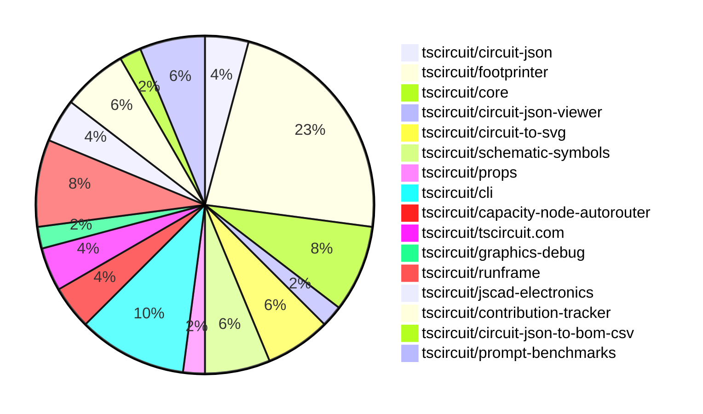

# Contribution Overview 2025-02-19

## PRs by Repository

## Contributor Overview

| Contributor | 🐳 Major | 🐙 Minor | 🐌 Tiny | ⭐ | Issues Created |
|-------------|---------|---------|---------|-----|----------------|
| [seveibar](#seveibar) | 3 | 7 | 0 | ⭐⭐⭐ | 27 |
| [ShiboSoftwareDev](#ShiboSoftwareDev) | 0 | 3 | 0 | ⭐⭐ | 6 |
| [imrishabh18](#imrishabh18) | 0 | 5 | 2 | ⭐⭐ | 10 |
| [techmannih](#techmannih) | 1 | 4 | 1 | ⭐⭐ | 6 |
| [ArnavK-09](#ArnavK-09) | 1 | 3 | 1 | ⭐⭐ | 1 |
| [Abse2001](#Abse2001) | 0 | 4 | 0 | ⭐ | 2 |
| [AnasSarkiz](#AnasSarkiz) | 2 | 1 | 0 | ⭐ | 1 |
| [MustafaMulla29](#MustafaMulla29) | 1 | 1 | 0 | ⭐ | 1 |
| [kom-senapati](#kom-senapati) | 1 | 1 | 0 | ⭐ | 3 |
| [Anshgrover23](#Anshgrover23) | 0 | 2 | 1 | ⭐ | 3 |
| [Ayushjhawar8](#Ayushjhawar8) | 0 | 2 | 0 | ⭐ | 1 |
| [siva222003](#siva222003) | 0 | 1 | 0 |  | 1 |

## Review Table

[reviews-received-hover]: ## "Number of reviews received for PRs for this contributor"
[approvals-received-hover]: ## "Number of approvals received for PRs this contributor authored"
[rejections-received-hover]: ## "Number of rejections received for PRs this contributor authored"
[prs-opened-hover]: ## "Number of PRs opened by this contributor"
[issues-created-hover]: ## "Number of issues created by this contributor"
[bountied-issues-hover]: ## "Number of issues this contributor created with a bounty"
[bountied-issue-$-hover]: ## "Total bounty amount placed on issues authored by this contributor"

| Contributor | Reviews Received | Approvals Received | Rejections Received | Approvals | Rejections | PRs Opened | PRs Merged | Issues Created | Bountied Issues | Bountied Issue $ |
|---|---|---|---|---|---|---|---|---|---|---|
| [Abse2001](#Abse2001) | 5 | 4 | 1 | 0 | 0 | 4 | 4 | 2 | 1 | 10 |
| [seveibar](#seveibar) | 1 | 1 | 0 | 27 | 4 | 12 | 10 | 27 | 22 | 359 |
| [techmannih](#techmannih) | 17 | 7 | 4 | 2 | 0 | 13 | 6 | 6 | 4 | 32 |
| [imrishabh18](#imrishabh18) | 3 | 3 | 0 | 7 | 1 | 8 | 7 | 10 | 4 | 49 |
| [deekshatomer](#deekshatomer) | 2 | 0 | 2 | 0 | 0 | 2 | 0 | 0 | 0 | 0 |
| [MustafaMulla29](#MustafaMulla29) | 8 | 6 | 1 | 0 | 0 | 3 | 2 | 1 | 0 | 0 |
| [Anshgrover23](#Anshgrover23) | 3 | 3 | 0 | 5 | 10 | 3 | 3 | 3 | 0 | 0 |
| [AnasSarkiz](#AnasSarkiz) | 4 | 3 | 0 | 0 | 1 | 3 | 3 | 1 | 1 | 5 |
| [ShiboSoftwareDev](#ShiboSoftwareDev) | 1 | 1 | 0 | 2 | 0 | 3 | 3 | 6 | 3 | 100 |
| [kom-senapati](#kom-senapati) | 22 | 10 | 3 | 0 | 0 | 5 | 2 | 3 | 0 | 0 |
| [ArnavK-09](#ArnavK-09) | 6 | 6 | 0 | 6 | 4 | 6 | 5 | 1 | 0 | 0 |
| [Ayushjhawar8](#Ayushjhawar8) | 21 | 2 | 6 | 0 | 0 | 3 | 2 | 1 | 0 | 0 |
| [siva222003](#siva222003) | 2 | 1 | 0 | 0 | 0 | 1 | 1 | 1 | 0 | 0 |
| [AayushSaini101](#AayushSaini101) | 15 | 2 | 3 | 0 | 0 | 1 | 0 | 0 | 0 | 0 |

## Changes by Repository

### [tscircuit/circuit-json](https://github.com/tscircuit/circuit-json)

| PR # | Impact | Contributor | Description |
|------|--------|-------------|-------------|
| [#137](https://github.com/tscircuit/circuit-json/pull/137) | 🐙 Minor | Abse2001 | Introduces a new type of error called `AutoroutingError` to handle errors related to the autorouting process. |
| [#135](https://github.com/tscircuit/circuit-json/pull/135) | 🐙 Minor | techmannih | Adds stroke width for silkscreen circle and silkscreen rectangle. |

### [tscircuit/footprinter](https://github.com/tscircuit/footprinter)

| PR # | Impact | Contributor | Description |
|------|--------|-------------|-------------|
| [#184](https://github.com/tscircuit/footprinter/pull/184) | 🐳 Major | MustafaMulla29 | Implemented VSSOP-8-0.65mm footprint component |
| [#208](https://github.com/tscircuit/footprinter/pull/208) | 🐙 Minor | Abse2001 | Fixed NaN in sot23 silkscreen |
| [#148](https://github.com/tscircuit/footprinter/pull/148) | 🐙 Minor | techmannih | Adds a new footprint for the SOD123W package. |
| [#135](https://github.com/tscircuit/footprinter/pull/135) | 🐙 Minor | techmannih | Adds a new footprint for the "sod323" component. |
| [#206](https://github.com/tscircuit/footprinter/pull/206) | 🐙 Minor | MustafaMulla29 | The pull request fixes an issue where the stamp receiver pins were marked incorrectly. |
| [#212](https://github.com/tscircuit/footprinter/pull/212) | 🐙 Minor | imrishabh18 | This pull request fixes the number format for the `sot23_N` footprint, where N is 3, 5, 6, etc. It also removes the incorrect `sot235` and `sot236` footprints. |
| [#210](https://github.com/tscircuit/footprinter/pull/210) | 🐙 Minor | imrishabh18 | Fix the parsing of the to220 footprint by removing the dependency on the `fn` field and introducing a new `string` field to extract the number of pins. |
| [#207](https://github.com/tscircuit/footprinter/pull/207) | 🐙 Minor | imrishabh18 | Add a build workflow for the Bun runtime |
| [#214](https://github.com/tscircuit/footprinter/pull/214) | 🐙 Minor | Anshgrover23 | Fixes the pad spacing issue in the to220_5 component. |
| [#204](https://github.com/tscircuit/footprinter/pull/204) | 🐙 Minor | AnasSarkiz | Added support for male and female flags in the pinrow footprint definition. |
| [#209](https://github.com/tscircuit/footprinter/pull/209) | 🐌 Tiny | Anshgrover23 | Add a test for the `dip_0.1in` component. |

### [tscircuit/core](https://github.com/tscircuit/core)

| PR # | Impact | Contributor | Description |
|------|--------|-------------|-------------|
| [#639](https://github.com/tscircuit/core/pull/639) | 🐙 Minor | Abse2001 | Adds silkscreen text for component names on the PCB. |
| [#638](https://github.com/tscircuit/core/pull/638) | 🐙 Minor | seveibar | Add more common pin names to the `sel-utility-types.ts` file. |
| [#640](https://github.com/tscircuit/core/pull/640) | 🐙 Minor | imrishabh18 | Adds the `subcircuit_id` property to the output traces in the `Group` component. |
| [#641](https://github.com/tscircuit/core/pull/641) | 🐌 Tiny | imrishabh18 | Update the version of the `@tscircuit/footprinter` dependency in the `package.json` file. |

### [tscircuit/circuit-json-viewer](https://github.com/tscircuit/circuit-json-viewer)

| PR # | Impact | Contributor | Description |
|------|--------|-------------|-------------|
| [#3](https://github.com/tscircuit/circuit-json-viewer/pull/3) | 🐙 Minor | Abse2001 | Updated the version of the `@tscircuit/runframe` dependency in the `package.json` file. |

### [tscircuit/circuit-to-svg](https://github.com/tscircuit/circuit-to-svg)

| PR # | Impact | Contributor | Description |
|------|--------|-------------|-------------|
| [#170](https://github.com/tscircuit/circuit-to-svg/pull/170) | 🐳 Major | techmannih | This pull request adds support for silkscreenline, silkscreencircle, and silkscreenrect in the PCB SVG conversion process. |
| [#172](https://github.com/tscircuit/circuit-to-svg/pull/172) | 🐙 Minor | Anshgrover23 | Fix incorrect bounds calculation for PCB silkscreen elements in the circuit-to-SVG conversion. |
| [#176](https://github.com/tscircuit/circuit-to-svg/pull/176) | 🐌 Tiny | imrishabh18 | Deletes the `testing.tsx` file. |

### [tscircuit/schematic-symbols](https://github.com/tscircuit/schematic-symbols)

| PR # | Impact | Contributor | Description |
|------|--------|-------------|-------------|
| [#257](https://github.com/tscircuit/schematic-symbols/pull/257) | 🐙 Minor | techmannih | Swapped the emitter and collector pins for the horizontal and vertical NPN bipolar transistor symbols. |
| [#256](https://github.com/tscircuit/schematic-symbols/pull/256) | 🐙 Minor | seveibar | Remove unused directories from the package output |
| [#258](https://github.com/tscircuit/schematic-symbols/pull/258) | 🐌 Tiny | techmannih | Removes two empty model files. |

### [tscircuit/props](https://github.com/tscircuit/props)

| PR # | Impact | Contributor | Description |
|------|--------|-------------|-------------|
| [#186](https://github.com/tscircuit/props/pull/186) | 🐳 Major | seveibar | Introduce `layoutMode`, `pcbLayout` and `schLayout` properties to the `<group />` component to allow for flexbox layout and grid layout. |

### [tscircuit/cli](https://github.com/tscircuit/cli)

| PR # | Impact | Contributor | Description |
|------|--------|-------------|-------------|
| [#88](https://github.com/tscircuit/cli/pull/88) | 🐳 Major | seveibar | Reduces the install size of the project by bundling it with bun instead of tsup-node. |
| [#89](https://github.com/tscircuit/cli/pull/89) | 🐙 Minor | seveibar | Removes all the "import @tscircuit/core" statements from the codebase. |
| [#96](https://github.com/tscircuit/cli/pull/96) | 🐙 Minor | imrishabh18 | Update the `@tscircuit/core` dependency to version `0.0.323` |
| [#95](https://github.com/tscircuit/cli/pull/95) | 🐙 Minor | ArnavK-09 | Adds detection for the new "bun.lock" file to determine the package manager used in the project. |
| [#92](https://github.com/tscircuit/cli/pull/92) | 🐙 Minor | ArnavK-09 | The pull request adds the ability to send an error message to the runframe if saving a snippet fails. |

### [tscircuit/capacity-node-autorouter](https://github.com/tscircuit/capacity-node-autorouter)

| PR # | Impact | Contributor | Description |
|------|--------|-------------|-------------|
| [#3](https://github.com/tscircuit/capacity-node-autorouter/pull/3) | 🐳 Major | seveibar | Introduces many improvements to animation and fixes to the hyper-parameter solver. |
| [#2](https://github.com/tscircuit/capacity-node-autorouter/pull/2) | 🐙 Minor | seveibar | Improves the high density autorouter by combining the visualizations of successful and failed solvers. |

### [tscircuit/tscircuit.com](https://github.com/tscircuit/tscircuit.com)

| PR # | Impact | Contributor | Description |
|------|--------|-------------|-------------|
| [#688](https://github.com/tscircuit/tscircuit.com/pull/688) | 🐙 Minor | seveibar | Change AI links to chat.tscircuit.com |
| [#685](https://github.com/tscircuit/tscircuit.com/pull/685) | 🐙 Minor | siva222003 | Adjusted the layout of UI cards and badge on the /quickstart page for improved responsiveness on small screens. |

### [tscircuit/graphics-debug](https://github.com/tscircuit/graphics-debug)

| PR # | Impact | Contributor | Description |
|------|--------|-------------|-------------|
| [#24](https://github.com/tscircuit/graphics-debug/pull/24) | 🐙 Minor | seveibar | Add support for dash array and line cap to the `Line` component. |

### [tscircuit/runframe](https://github.com/tscircuit/runframe)

| PR # | Impact | Contributor | Description |
|------|--------|-------------|-------------|
| [#270](https://github.com/tscircuit/runframe/pull/270) | 🐙 Minor | seveibar | Allow standalone bundle to display CLI version of RunFrame |
| [#273](https://github.com/tscircuit/runframe/pull/273) | 🐙 Minor | ArnavK-09 | Tweaks the RunframeForCli application, including changes to the alert dialog, notification for export processing, text styles, export names, tab menu density, and adding a clickable NotSync badge. |
| [#250](https://github.com/tscircuit/runframe/pull/250) | 🐙 Minor | Ayushjhawar8 | Improve error handling and message for RunFrame component when there are issues with the provided files or entrypoint. |
| [#274](https://github.com/tscircuit/runframe/pull/274) | 🐌 Tiny | ArnavK-09 | Bump GitHub Actions versions used in the project. |

### [tscircuit/jscad-electronics](https://github.com/tscircuit/jscad-electronics)

| PR # | Impact | Contributor | Description |
|------|--------|-------------|-------------|
| [#91](https://github.com/tscircuit/jscad-electronics/pull/91) | 🐳 Major | AnasSarkiz | Introduce a new 3D component for a push button |
| [#89](https://github.com/tscircuit/jscad-electronics/pull/89) | 🐳 Major | AnasSarkiz | Introduce Female headers 3D model and added example |

### [tscircuit/contribution-tracker](https://github.com/tscircuit/contribution-tracker)

| PR # | Impact | Contributor | Description |
|------|--------|-------------|-------------|
| [#76](https://github.com/tscircuit/contribution-tracker/pull/76) | 🐳 Major | ArnavK-09 | This pull request requires approval for points by processing reviews for merged and non-merged pull requests. |
| [#72](https://github.com/tscircuit/contribution-tracker/pull/72) | 🐳 Major | kom-senapati | Add GitHub workflows for format check, testing, and type checking |
| [#58](https://github.com/tscircuit/contribution-tracker/pull/58) | 🐙 Minor | Ayushjhawar8 | Fixes an issue with displaying special recognition for full-time contributors in the contributor overview section. |

### [tscircuit/circuit-json-to-bom-csv](https://github.com/tscircuit/circuit-json-to-bom-csv)

| PR # | Impact | Contributor | Description |
|------|--------|-------------|-------------|
| [#6](https://github.com/tscircuit/circuit-json-to-bom-csv/pull/6) | 🐙 Minor | kom-senapati | Add LCSC part number interpretation to JLCPCB Part # column |

### [tscircuit/prompt-benchmarks](https://github.com/tscircuit/prompt-benchmarks)

| PR # | Impact | Contributor | Description |
|------|--------|-------------|-------------|
| [#44](https://github.com/tscircuit/prompt-benchmarks/pull/44) | 🐙 Minor | ShiboSoftwareDev | Added more tests for various utility functions. |
| [#43](https://github.com/tscircuit/prompt-benchmarks/pull/43) | 🐙 Minor | ShiboSoftwareDev | Added more tests for various utility functions. |
| [#42](https://github.com/tscircuit/prompt-benchmarks/pull/42) | 🐙 Minor | ShiboSoftwareDev | Renaming and refactoring the project structure, including renaming "AiCoder" to "TscircuitCoder" and moving related files to a new "ask-ai" directory. |

## Changes by Contributor

### [Abse2001](https://github.com/Abse2001)

| PR # | Impact | Description |
|------|--------|-------------|
| [#137](https://github.com/tscircuit/circuit-json/pull/137) | 🐙 Minor | Introduces a new type of error called `AutoroutingError` to handle errors related to the autorouting process. |
| [#208](https://github.com/tscircuit/footprinter/pull/208) | 🐙 Minor | Fixed NaN in sot23 silkscreen |
| [#639](https://github.com/tscircuit/core/pull/639) | 🐙 Minor | Adds silkscreen text for component names on the PCB. |
| [#3](https://github.com/tscircuit/circuit-json-viewer/pull/3) | 🐙 Minor | Updated the version of the `@tscircuit/runframe` dependency in the `package.json` file. |

### [techmannih](https://github.com/techmannih)

| PR # | Impact | Description |
|------|--------|-------------|
| [#170](https://github.com/tscircuit/circuit-to-svg/pull/170) | 🐳 Major | This pull request adds support for silkscreenline, silkscreencircle, and silkscreenrect in the PCB SVG conversion process. |
| [#135](https://github.com/tscircuit/circuit-json/pull/135) | 🐙 Minor | Adds stroke width for silkscreen circle and silkscreen rectangle. |
| [#148](https://github.com/tscircuit/footprinter/pull/148) | 🐙 Minor | Adds a new footprint for the SOD123W package. |
| [#135](https://github.com/tscircuit/footprinter/pull/135) | 🐙 Minor | Adds a new footprint for the "sod323" component. |
| [#257](https://github.com/tscircuit/schematic-symbols/pull/257) | 🐙 Minor | Swapped the emitter and collector pins for the horizontal and vertical NPN bipolar transistor symbols. |
| [#258](https://github.com/tscircuit/schematic-symbols/pull/258) | 🐌 Tiny | Removes two empty model files. |

### [seveibar](https://github.com/seveibar)

| PR # | Impact | Description |
|------|--------|-------------|
| [#186](https://github.com/tscircuit/props/pull/186) | 🐳 Major | Introduce `layoutMode`, `pcbLayout` and `schLayout` properties to the `<group />` component to allow for flexbox layout and grid layout. |
| [#88](https://github.com/tscircuit/cli/pull/88) | 🐳 Major | Reduces the install size of the project by bundling it with bun instead of tsup-node. |
| [#3](https://github.com/tscircuit/capacity-node-autorouter/pull/3) | 🐳 Major | Introduces many improvements to animation and fixes to the hyper-parameter solver. |
| [#638](https://github.com/tscircuit/core/pull/638) | 🐙 Minor | Add more common pin names to the `sel-utility-types.ts` file. |
| [#256](https://github.com/tscircuit/schematic-symbols/pull/256) | 🐙 Minor | Remove unused directories from the package output |
| [#688](https://github.com/tscircuit/tscircuit.com/pull/688) | 🐙 Minor | Change AI links to chat.tscircuit.com |
| [#24](https://github.com/tscircuit/graphics-debug/pull/24) | 🐙 Minor | Add support for dash array and line cap to the `Line` component. |
| [#270](https://github.com/tscircuit/runframe/pull/270) | 🐙 Minor | Allow standalone bundle to display CLI version of RunFrame |
| [#89](https://github.com/tscircuit/cli/pull/89) | 🐙 Minor | Removes all the "import @tscircuit/core" statements from the codebase. |
| [#2](https://github.com/tscircuit/capacity-node-autorouter/pull/2) | 🐙 Minor | Improves the high density autorouter by combining the visualizations of successful and failed solvers. |

### [MustafaMulla29](https://github.com/MustafaMulla29)

| PR # | Impact | Description |
|------|--------|-------------|
| [#184](https://github.com/tscircuit/footprinter/pull/184) | 🐳 Major | Implemented VSSOP-8-0.65mm footprint component |
| [#206](https://github.com/tscircuit/footprinter/pull/206) | 🐙 Minor | The pull request fixes an issue where the stamp receiver pins were marked incorrectly. |

### [imrishabh18](https://github.com/imrishabh18)

| PR # | Impact | Description |
|------|--------|-------------|
| [#212](https://github.com/tscircuit/footprinter/pull/212) | 🐙 Minor | This pull request fixes the number format for the `sot23_N` footprint, where N is 3, 5, 6, etc. It also removes the incorrect `sot235` and `sot236` footprints. |
| [#210](https://github.com/tscircuit/footprinter/pull/210) | 🐙 Minor | Fix the parsing of the to220 footprint by removing the dependency on the `fn` field and introducing a new `string` field to extract the number of pins. |
| [#207](https://github.com/tscircuit/footprinter/pull/207) | 🐙 Minor | Add a build workflow for the Bun runtime |
| [#640](https://github.com/tscircuit/core/pull/640) | 🐙 Minor | Adds the `subcircuit_id` property to the output traces in the `Group` component. |
| [#96](https://github.com/tscircuit/cli/pull/96) | 🐙 Minor | Update the `@tscircuit/core` dependency to version `0.0.323` |
| [#641](https://github.com/tscircuit/core/pull/641) | 🐌 Tiny | Update the version of the `@tscircuit/footprinter` dependency in the `package.json` file. |
| [#176](https://github.com/tscircuit/circuit-to-svg/pull/176) | 🐌 Tiny | Deletes the `testing.tsx` file. |

### [Anshgrover23](https://github.com/Anshgrover23)

| PR # | Impact | Description |
|------|--------|-------------|
| [#214](https://github.com/tscircuit/footprinter/pull/214) | 🐙 Minor | Fixes the pad spacing issue in the to220_5 component. |
| [#172](https://github.com/tscircuit/circuit-to-svg/pull/172) | 🐙 Minor | Fix incorrect bounds calculation for PCB silkscreen elements in the circuit-to-SVG conversion. |
| [#209](https://github.com/tscircuit/footprinter/pull/209) | 🐌 Tiny | Add a test for the `dip_0.1in` component. |

### [AnasSarkiz](https://github.com/AnasSarkiz)

| PR # | Impact | Description |
|------|--------|-------------|
| [#91](https://github.com/tscircuit/jscad-electronics/pull/91) | 🐳 Major | Introduce a new 3D component for a push button |
| [#89](https://github.com/tscircuit/jscad-electronics/pull/89) | 🐳 Major | Introduce Female headers 3D model and added example |
| [#204](https://github.com/tscircuit/footprinter/pull/204) | 🐙 Minor | Added support for male and female flags in the pinrow footprint definition. |

### [ArnavK-09](https://github.com/ArnavK-09)

| PR # | Impact | Description |
|------|--------|-------------|
| [#76](https://github.com/tscircuit/contribution-tracker/pull/76) | 🐳 Major | This pull request requires approval for points by processing reviews for merged and non-merged pull requests. |
| [#273](https://github.com/tscircuit/runframe/pull/273) | 🐙 Minor | Tweaks the RunframeForCli application, including changes to the alert dialog, notification for export processing, text styles, export names, tab menu density, and adding a clickable NotSync badge. |
| [#95](https://github.com/tscircuit/cli/pull/95) | 🐙 Minor | Adds detection for the new "bun.lock" file to determine the package manager used in the project. |
| [#92](https://github.com/tscircuit/cli/pull/92) | 🐙 Minor | The pull request adds the ability to send an error message to the runframe if saving a snippet fails. |
| [#274](https://github.com/tscircuit/runframe/pull/274) | 🐌 Tiny | Bump GitHub Actions versions used in the project. |

### [kom-senapati](https://github.com/kom-senapati)

| PR # | Impact | Description |
|------|--------|-------------|
| [#72](https://github.com/tscircuit/contribution-tracker/pull/72) | 🐳 Major | Add GitHub workflows for format check, testing, and type checking |
| [#6](https://github.com/tscircuit/circuit-json-to-bom-csv/pull/6) | 🐙 Minor | Add LCSC part number interpretation to JLCPCB Part # column |

### [Ayushjhawar8](https://github.com/Ayushjhawar8)

| PR # | Impact | Description |
|------|--------|-------------|
| [#58](https://github.com/tscircuit/contribution-tracker/pull/58) | 🐙 Minor | Fixes an issue with displaying special recognition for full-time contributors in the contributor overview section. |
| [#250](https://github.com/tscircuit/runframe/pull/250) | 🐙 Minor | Improve error handling and message for RunFrame component when there are issues with the provided files or entrypoint. |

### [siva222003](https://github.com/siva222003)

| PR # | Impact | Description |
|------|--------|-------------|
| [#685](https://github.com/tscircuit/tscircuit.com/pull/685) | 🐙 Minor | Adjusted the layout of UI cards and badge on the /quickstart page for improved responsiveness on small screens. |

### [ShiboSoftwareDev](https://github.com/ShiboSoftwareDev)

| PR # | Impact | Description |
|------|--------|-------------|
| [#44](https://github.com/tscircuit/prompt-benchmarks/pull/44) | 🐙 Minor | Added more tests for various utility functions. |
| [#43](https://github.com/tscircuit/prompt-benchmarks/pull/43) | 🐙 Minor | Added more tests for various utility functions. |
| [#42](https://github.com/tscircuit/prompt-benchmarks/pull/42) | 🐙 Minor | Renaming and refactoring the project structure, including renaming "AiCoder" to "TscircuitCoder" and moving related files to a new "ask-ai" directory. |

