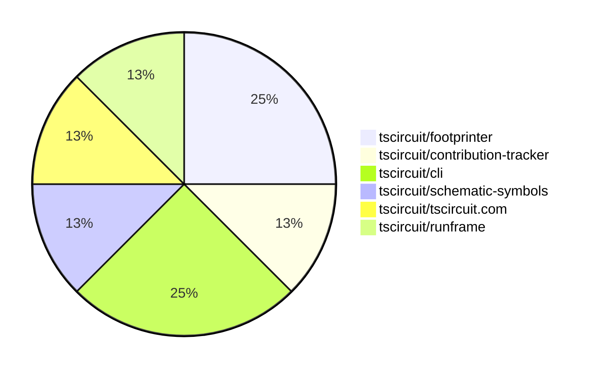

# Contribution Overview 2025-02-19

## PRs by Repository

## Contributor Overview

| Contributor | 🐳 Major | 🐙 Minor | 🐌 Tiny | ⭐ | Issues Created |
|-------------|---------|---------|---------|-----|----------------|
| [seveibar](#seveibar) | 1 | 4 | 0 | ⭐⭐ | 6 |
| [imrishabh18](#imrishabh18) | 0 | 1 | 0 |  | 1 |
| [MustafaMulla29](#MustafaMulla29) | 0 | 1 | 0 |  | 0 |
| [Ayushjhawar8](#Ayushjhawar8) | 0 | 1 | 0 |  | 0 |

## Review Table

[reviews-received-hover]: ## "Number of reviews received for PRs for this contributor"
[approvals-received-hover]: ## "Number of approvals received for PRs this contributor authored"
[rejections-received-hover]: ## "Number of rejections received for PRs this contributor authored"
[prs-opened-hover]: ## "Number of PRs opened by this contributor"
[issues-created-hover]: ## "Number of issues created by this contributor"
[bountied-issues-hover]: ## "Number of issues this contributor created with a bounty"
[bountied-issue-$-hover]: ## "Total bounty amount placed on issues authored by this contributor"

| Contributor | Reviews Received | Approvals Received | Rejections Received | Approvals | Rejections | PRs Opened | PRs Merged | Issues Created | Bountied Issues | Bountied Issue $ |
|---|---|---|---|---|---|---|---|---|---|---|
| [imrishabh18](#imrishabh18) | 0 | 0 | 0 | 1 | 0 | 1 | 1 | 1 | 0 | 0 |
| [MustafaMulla29](#MustafaMulla29) | 12 | 3 | 5 | 0 | 0 | 3 | 1 | 0 | 0 | 0 |
| [Anshgrover23](#Anshgrover23) | 0 | 0 | 0 | 1 | 7 | 0 | 0 | 1 | 0 | 0 |
| [seveibar](#seveibar) | 1 | 1 | 0 | 3 | 2 | 7 | 5 | 6 | 6 | 57 |
| [techmannih](#techmannih) | 0 | 0 | 0 | 1 | 2 | 0 | 0 | 0 | 0 | 0 |
| [ShiboSoftwareDev](#ShiboSoftwareDev) | 0 | 0 | 0 | 1 | 1 | 0 | 0 | 1 | 1 | 30 |
| [Ayushjhawar8](#Ayushjhawar8) | 10 | 1 | 5 | 0 | 0 | 2 | 1 | 0 | 0 | 0 |
| [kom-senapati](#kom-senapati) | 1 | 1 | 0 | 0 | 0 | 1 | 0 | 1 | 0 | 0 |
| [ArnavK-09](#ArnavK-09) | 2 | 2 | 0 | 1 | 1 | 3 | 0 | 1 | 0 | 0 |
| [deekshatomer](#deekshatomer) | 2 | 0 | 2 | 0 | 0 | 1 | 0 | 0 | 0 | 0 |
| [AayushSaini101](#AayushSaini101) | 3 | 0 | 1 | 0 | 0 | 1 | 0 | 0 | 0 | 0 |

## Changes by Repository

### [tscircuit/footprinter](https://github.com/tscircuit/footprinter)

| PR # | Impact | Contributor | Description |
|------|--------|-------------|-------------|
| [#207](https://github.com/tscircuit/footprinter/pull/207) | 🐙 Minor | imrishabh18 | Add a build workflow for the Bun runtime. |
| [#184](https://github.com/tscircuit/footprinter/pull/184) | 🐙 Minor | MustafaMulla29 | Implemented VSSOP-8-0.65mm footprint |

### [tscircuit/contribution-tracker](https://github.com/tscircuit/contribution-tracker)

| PR # | Impact | Contributor | Description |
|------|--------|-------------|-------------|
| [#58](https://github.com/tscircuit/contribution-tracker/pull/58) | 🐙 Minor | Ayushjhawar8 | Fix to show special honor to full-time contributors in the Contributor Overview section. |

### [tscircuit/cli](https://github.com/tscircuit/cli)

| PR # | Impact | Contributor | Description |
|------|--------|-------------|-------------|
| [#88](https://github.com/tscircuit/cli/pull/88) | 🐳 Major | seveibar | Massive reduction in install size by bundling using `bun build` instead of `tsup-node`. |
| [#89](https://github.com/tscircuit/cli/pull/89) | 🐙 Minor | seveibar | Removes all the "import @tscircuit/core" statements from the codebase. |

### [tscircuit/schematic-symbols](https://github.com/tscircuit/schematic-symbols)

| PR # | Impact | Contributor | Description |
|------|--------|-------------|-------------|
| [#256](https://github.com/tscircuit/schematic-symbols/pull/256) | 🐙 Minor | seveibar | Remove unused directories from the package output |

### [tscircuit/tscircuit.com](https://github.com/tscircuit/tscircuit.com)

| PR # | Impact | Contributor | Description |
|------|--------|-------------|-------------|
| [#688](https://github.com/tscircuit/tscircuit.com/pull/688) | 🐙 Minor | seveibar | Changes all AI links to point to chat.tscircuit.com |

### [tscircuit/runframe](https://github.com/tscircuit/runframe)

| PR # | Impact | Contributor | Description |
|------|--------|-------------|-------------|
| [#270](https://github.com/tscircuit/runframe/pull/270) | 🐙 Minor | seveibar | Allow standalone bundle to display CLI version of runframe |

## Changes by Contributor

### [imrishabh18](https://github.com/imrishabh18)

| PR # | Impact | Description |
|------|--------|-------------|
| [#207](https://github.com/tscircuit/footprinter/pull/207) | 🐙 Minor | Add a build workflow for the Bun runtime. |

### [MustafaMulla29](https://github.com/MustafaMulla29)

| PR # | Impact | Description |
|------|--------|-------------|
| [#184](https://github.com/tscircuit/footprinter/pull/184) | 🐙 Minor | Implemented VSSOP-8-0.65mm footprint |

### [Ayushjhawar8](https://github.com/Ayushjhawar8)

| PR # | Impact | Description |
|------|--------|-------------|
| [#58](https://github.com/tscircuit/contribution-tracker/pull/58) | 🐙 Minor | Fix to show special honor to full-time contributors in the Contributor Overview section. |

### [seveibar](https://github.com/seveibar)

| PR # | Impact | Description |
|------|--------|-------------|
| [#88](https://github.com/tscircuit/cli/pull/88) | 🐳 Major | Massive reduction in install size by bundling using `bun build` instead of `tsup-node`. |
| [#256](https://github.com/tscircuit/schematic-symbols/pull/256) | 🐙 Minor | Remove unused directories from the package output |
| [#688](https://github.com/tscircuit/tscircuit.com/pull/688) | 🐙 Minor | Changes all AI links to point to chat.tscircuit.com |
| [#270](https://github.com/tscircuit/runframe/pull/270) | 🐙 Minor | Allow standalone bundle to display CLI version of runframe |
| [#89](https://github.com/tscircuit/cli/pull/89) | 🐙 Minor | Removes all the "import @tscircuit/core" statements from the codebase. |

