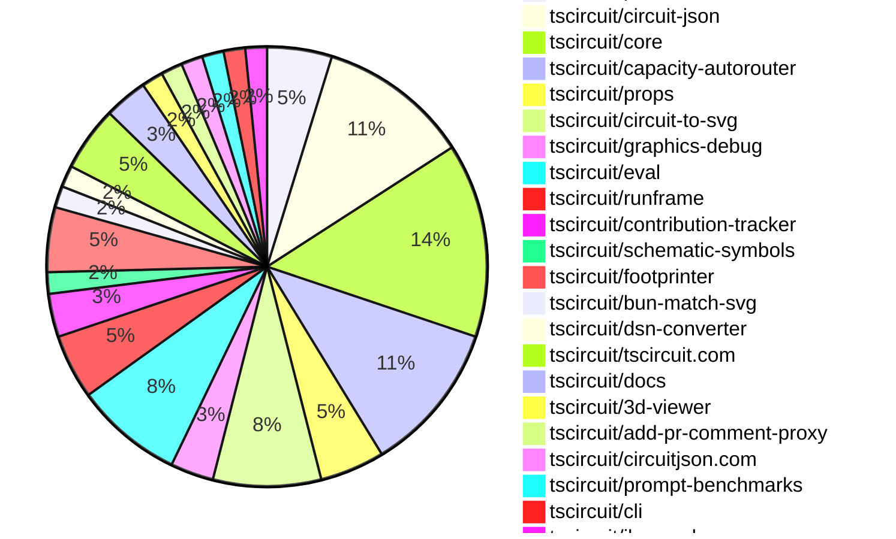

# Contribution Overview 2025-02-26

## PRs by Repository

## Contributor Overview

| Contributor | 🐳 Major | 🐙 Minor | 🐌 Tiny | ⭐ | Issues Created |
|-------------|---------|---------|---------|-----|----------------|
| [seveibar](#seveibar) | 6 | 22 | 1 | 👑 | 37 |
| [techmannih](#techmannih) | 1 | 9 | 0 | ⭐⭐ | 13 |
| [imrishabh18](#imrishabh18) | 0 | 5 | 3 | ⭐⭐ | 8 |
| [Abse2001](#Abse2001) | 1 | 1 | 0 | ⭐ | 2 |
| [ShiboSoftwareDev](#ShiboSoftwareDev) | 0 | 1 | 0 | ⭐ | 15 |
| [kom-senapati](#kom-senapati) | 0 | 3 | 0 | ⭐ | 0 |
| [Anshgrover23](#Anshgrover23) | 0 | 2 | 0 | ⭐ | 5 |
| [MustafaMulla29](#MustafaMulla29) | 0 | 2 | 0 | ⭐ | 1 |
| [ArnavK-09](#ArnavK-09) | 0 | 1 | 1 |  | 2 |
| [rohitbhure65](#rohitbhure65) | 0 | 1 | 0 |  | 0 |
| [Ayushjhawar8](#Ayushjhawar8) | 0 | 1 | 0 |  | 1 |
| [krushnarout](#krushnarout) | 0 | 1 | 0 |  | 1 |

## Review Table

[reviews-received-hover]: ## "Number of reviews received for PRs for this contributor"
[approvals-received-hover]: ## "Number of approvals received for PRs this contributor authored"
[rejections-received-hover]: ## "Number of rejections received for PRs this contributor authored"
[prs-opened-hover]: ## "Number of PRs opened by this contributor"
[issues-created-hover]: ## "Number of issues created by this contributor"
[bountied-issues-hover]: ## "Number of issues this contributor created with a bounty"
[bountied-issue-$-hover]: ## "Total bounty amount placed on issues authored by this contributor"

| Contributor | Reviews Received | Approvals Received | Rejections Received | Approvals | Rejections | PRs Opened | PRs Merged | Issues Created | Bountied Issues | Bountied Issue $ |
|---|---|---|---|---|---|---|---|---|---|---|
| [Abse2001](#Abse2001) | 1 | 1 | 0 | 2 | 1 | 2 | 2 | 2 | 2 | 25 |
| [seveibar](#seveibar) | 1 | 1 | 0 | 22 | 11 | 34 | 29 | 37 | 28 | 458 |
| [MustafaMulla29](#MustafaMulla29) | 10 | 4 | 5 | 0 | 0 | 6 | 3 | 1 | 0 | 0 |
| [ShiboSoftwareDev](#ShiboSoftwareDev) | 7 | 2 | 0 | 4 | 2 | 5 | 1 | 15 | 7 | 187 |
| [Anshgrover23](#Anshgrover23) | 6 | 2 | 4 | 3 | 1 | 6 | 2 | 5 | 1 | 5 |
| [kom-senapati](#kom-senapati) | 22 | 6 | 2 | 0 | 0 | 5 | 3 | 0 | 0 | 0 |
| [techmannih](#techmannih) | 24 | 15 | 6 | 0 | 3 | 20 | 10 | 13 | 3 | 15 |
| [imrishabh18](#imrishabh18) | 2 | 1 | 0 | 7 | 3 | 8 | 8 | 8 | 2 | 22 |
| [rohitbhure65](#rohitbhure65) | 2 | 2 | 0 | 0 | 0 | 1 | 1 | 0 | 0 | 0 |
| [Rishikesh63](#Rishikesh63) | 0 | 0 | 0 | 0 | 0 | 1 | 0 | 0 | 0 | 0 |
| [Ayushjhawar8](#Ayushjhawar8) | 3 | 1 | 0 | 0 | 0 | 3 | 1 | 1 | 0 | 0 |
| [kanakOS01](#kanakOS01) | 1 | 0 | 1 | 0 | 0 | 1 | 0 | 0 | 0 | 0 |
| [yashksaini-coder](#yashksaini-coder) | 0 | 0 | 0 | 0 | 0 | 1 | 0 | 0 | 0 | 0 |
| [ArnavK-09](#ArnavK-09) | 3 | 2 | 0 | 2 | 1 | 3 | 2 | 2 | 0 | 0 |
| [Saurabhsing21](#Saurabhsing21) | 7 | 2 | 4 | 0 | 0 | 3 | 0 | 0 | 0 | 0 |
| [krushnarout](#krushnarout) | 1 | 1 | 0 | 0 | 0 | 1 | 1 | 1 | 0 | 0 |
| [PatanSharuKhan](#PatanSharuKhan) | 0 | 0 | 0 | 0 | 0 | 1 | 0 | 0 | 0 | 0 |

## Changes by Repository

### [tscircuit/pcb-viewer](https://github.com/tscircuit/pcb-viewer)

| PR # | Impact | Contributor | Description |
|------|--------|-------------|-------------|
| [#179](https://github.com/tscircuit/pcb-viewer/pull/179) | 🐳 Major | Abse2001 | Adds support for multiple silkscreen layers, including top and bottom silkscreen layers. |
| [#177](https://github.com/tscircuit/pcb-viewer/pull/177) | 🐙 Minor | seveibar | Adds a new `onMouseOverPrimitives` callback to the `CanvasElementsRenderer` component to handle mouse hover events over PCB elements. |
| [#176](https://github.com/tscircuit/pcb-viewer/pull/176) | 🐙 Minor | seveibar | Allow Debug Objects to be passed into PCB Viewer (enables autorouting animations). Fix "d" key not working |

### [tscircuit/circuit-json](https://github.com/tscircuit/circuit-json)

| PR # | Impact | Contributor | Description |
|------|--------|-------------|-------------|
| [#152](https://github.com/tscircuit/circuit-json/pull/152) | 🐙 Minor | Abse2001 | Revert the addition of rotation in schematic component |
| [#158](https://github.com/tscircuit/circuit-json/pull/158) | 🐙 Minor | seveibar | Fix source project metadata exports |
| [#157](https://github.com/tscircuit/circuit-json/pull/157) | 🐙 Minor | seveibar | Remove stroke width from silkscreen text |
| [#141](https://github.com/tscircuit/circuit-json/pull/141) | 🐙 Minor | kom-senapati | Add a new `source_project_metadata` component to the project. |
| [#150](https://github.com/tscircuit/circuit-json/pull/150) | 🐙 Minor | techmannih | Add support for stroke-width for silkscreen text |
| [#151](https://github.com/tscircuit/circuit-json/pull/151) | 🐙 Minor | techmannih | Adds a new rotation property to the SchematicComponent type. |
| [#145](https://github.com/tscircuit/circuit-json/pull/145) | 🐙 Minor | rohitbhure65 | Add support for `kohm` unit in resistance parsing. |

### [tscircuit/core](https://github.com/tscircuit/core)

| PR # | Impact | Contributor | Description |
|------|--------|-------------|-------------|
| [#675](https://github.com/tscircuit/core/pull/675) | 🐳 Major | seveibar | Add project metadata to the output, make the Capacity Autorouter the default autorouter. |
| [#667](https://github.com/tscircuit/core/pull/667) | 🐳 Major | seveibar | Allows the user to supply a custom autorouting algorithm function to the Group component. |
| [#656](https://github.com/tscircuit/core/pull/656) | 🐳 Major | seveibar | Integrate Capacity Autorouter |
| [#674](https://github.com/tscircuit/core/pull/674) | 🐙 Minor | seveibar | Upgrade the `circuit-json` dependency to version 0.0.149, which does not have a backwards-incompatible change. |
| [#670](https://github.com/tscircuit/core/pull/670) | 🐙 Minor | seveibar | Update the version of the `@tscircuit/capacity-autorouter` dependency to 0.0.13. |
| [#669](https://github.com/tscircuit/core/pull/669) | 🐙 Minor | seveibar | Enhances the traceability of connection names when converting Circuit JSON to Simple Route JSON. |
| [#666](https://github.com/tscircuit/core/pull/666) | 🐙 Minor | seveibar | Exports the `GenericLocalAutorouter` interface. |
| [#657](https://github.com/tscircuit/core/pull/657) | 🐙 Minor | seveibar | Add support for the `autorouting:progress` and `renderComplete` events in the `RootCircuit` class. |
| [#653](https://github.com/tscircuit/core/pull/653) | 🐙 Minor | MustafaMulla29 | Exports the `SimpleRouteJson` module for use in the project. |

### [tscircuit/capacity-autorouter](https://github.com/tscircuit/capacity-autorouter)

| PR # | Impact | Contributor | Description |
|------|--------|-------------|-------------|
| [#25](https://github.com/tscircuit/capacity-autorouter/pull/25) | 🐳 Major | seveibar | Switches the implementation to use a pipeline definition and improves the high-density stitching algorithm. |
| [#23](https://github.com/tscircuit/capacity-autorouter/pull/23) | 🐳 Major | seveibar | The pull request changes the way PCB traces are processed and merged, adding support for vias and ensuring consistent trace thickness. |
| [#20](https://github.com/tscircuit/capacity-autorouter/pull/20) | 🐳 Major | seveibar | Adds a new JSON file with details about obstacles and their connectivity in a PCB design. |
| [#27](https://github.com/tscircuit/capacity-autorouter/pull/27) | 🐙 Minor | seveibar | The pull request fixes a bug that caused accidental mutation of the `SRJ` object, and also includes minor fixes and core testing improvements. |
| [#24](https://github.com/tscircuit/capacity-autorouter/pull/24) | 🐙 Minor | seveibar | Fix SimpleRouteJson output and add svg tests for making sure they don't break |
| [#22](https://github.com/tscircuit/capacity-autorouter/pull/22) | 🐙 Minor | seveibar | The pull request fixes layers and adds connection names to output PCB traces. |
| [#21](https://github.com/tscircuit/capacity-autorouter/pull/21) | 🐙 Minor | seveibar | Makes connection names unique to fix segment point crossing issues. |

### [tscircuit/props](https://github.com/tscircuit/props)

| PR # | Impact | Contributor | Description |
|------|--------|-------------|-------------|
| [#191](https://github.com/tscircuit/props/pull/191) | 🐙 Minor | seveibar | Adds a new `algorithmFn` property to the `AutorouterProp` type, which allows creating custom autorouting functions inside the `autorouter` prop. |
| [#189](https://github.com/tscircuit/props/pull/189) | 🐙 Minor | techmannih | Adds support for a new type of plated hole, "CircularHoleWithRectPlatedProps", which includes a circular hole with a rectangular plated pad. |
| [#190](https://github.com/tscircuit/props/pull/190) | 🐙 Minor | Anshgrover23 | Add missing component types, including silkscreen, to the COMPONENT_TYPES.md file. |

### [tscircuit/circuit-to-svg](https://github.com/tscircuit/circuit-to-svg)

| PR # | Impact | Contributor | Description |
|------|--------|-------------|-------------|
| [#184](https://github.com/tscircuit/circuit-to-svg/pull/184) | 🐙 Minor | seveibar | Fix the silkscreen text style |
| [#187](https://github.com/tscircuit/circuit-to-svg/pull/187) | 🐙 Minor | techmannih | Adds support for `stroke_width` for all silkscreen elements (circles, rectangles, and text) in the PCB rendering. |
| [#189](https://github.com/tscircuit/circuit-to-svg/pull/189) | 🐙 Minor | techmannih | Add support for rectangular plated holes with circular holes. |
| [#186](https://github.com/tscircuit/circuit-to-svg/pull/186) | 🐙 Minor | techmannih | Fixes the issue where the bottom layer was not being drawn below the top layer. |
| [#179](https://github.com/tscircuit/circuit-to-svg/pull/179) | 🐙 Minor | Ayushjhawar8 | Fix silkscreen text rotation |

### [tscircuit/graphics-debug](https://github.com/tscircuit/graphics-debug)

| PR # | Impact | Contributor | Description |
|------|--------|-------------|-------------|
| [#31](https://github.com/tscircuit/graphics-debug/pull/31) | 🐙 Minor | seveibar | The pull request formats the code and adds a `disableLabels` option. |
| [#30](https://github.com/tscircuit/graphics-debug/pull/30) | 🐙 Minor | seveibar | Adds a custom matcher for the Bun test framework to compare GraphicsObjects as SVGs. |

### [tscircuit/eval](https://github.com/tscircuit/eval)

| PR # | Impact | Contributor | Description |
|------|--------|-------------|-------------|
| [#129](https://github.com/tscircuit/eval/pull/129) | 🐙 Minor | seveibar | Allow supplying a specific version of the `@tscircuit/eval` dependency in the web worker configuration. |
| [#128](https://github.com/tscircuit/eval/pull/128) | 🐙 Minor | seveibar | The pull request fixes the webworker building and adds a web test. |
| [#126](https://github.com/tscircuit/eval/pull/126) | 🐙 Minor | seveibar | Improves event types for event listening, fixes `removeListener` issue. |
| [#125](https://github.com/tscircuit/eval/pull/125) | 🐙 Minor | seveibar | Update the dependencies for @tscircuit/core and circuit-json to newer versions, and add them as peer dependencies. |
| [#127](https://github.com/tscircuit/eval/pull/127) | 🐌 Tiny | seveibar | Fix the default blob URL used to create the CircuitWebWorker. |

### [tscircuit/runframe](https://github.com/tscircuit/runframe)

| PR # | Impact | Contributor | Description |
|------|--------|-------------|-------------|
| [#294](https://github.com/tscircuit/runframe/pull/294) | 🐙 Minor | seveibar | Adds autorouting graphics to the `RunFrame` component. |
| [#281](https://github.com/tscircuit/runframe/pull/281) | 🐙 Minor | imrishabh18 | Update the pushbutton footprint in the 3D viewer |
| [#282](https://github.com/tscircuit/runframe/pull/282) | 🐌 Tiny | imrishabh18 | Fixes a bug in the npm release workflow |

### [tscircuit/contribution-tracker](https://github.com/tscircuit/contribution-tracker)

| PR # | Impact | Contributor | Description |
|------|--------|-------------|-------------|
| [#68](https://github.com/tscircuit/contribution-tracker/pull/68) | 🐙 Minor | kom-senapati | Adds a loading state during contributors data fetching |
| [#79](https://github.com/tscircuit/contribution-tracker/pull/79) | 🐙 Minor | kom-senapati | Add tooltips to contribution icons and stats in the ContributorCard and ContributorOverview components. |

### [tscircuit/schematic-symbols](https://github.com/tscircuit/schematic-symbols)

| PR # | Impact | Contributor | Description |
|------|--------|-------------|-------------|
| [#254](https://github.com/tscircuit/schematic-symbols/pull/254) | 🐳 Major | techmannih | Add all orientation for SPDT and SPST switch components. |

### [tscircuit/footprinter](https://github.com/tscircuit/footprinter)

| PR # | Impact | Contributor | Description |
|------|--------|-------------|-------------|
| [#225](https://github.com/tscircuit/footprinter/pull/225) | 🐙 Minor | techmannih | Add a new footprint for the SOD-110 component. |
| [#221](https://github.com/tscircuit/footprinter/pull/221) | 🐙 Minor | techmannih | Adds a new JST footprint |
| [#228](https://github.com/tscircuit/footprinter/pull/228) | 🐙 Minor | techmannih | Adds a new footprint for the TO-92S component. |

### [tscircuit/bun-match-svg](https://github.com/tscircuit/bun-match-svg)

| PR # | Impact | Contributor | Description |
|------|--------|-------------|-------------|
| [#10](https://github.com/tscircuit/bun-match-svg/pull/10) | 🐙 Minor | Anshgrover23 | Fix the issue of overwriting an existing file when creating new snapshots. |

### [tscircuit/dsn-converter](https://github.com/tscircuit/dsn-converter)

| PR # | Impact | Contributor | Description |
|------|--------|-------------|-------------|
| [#94](https://github.com/tscircuit/dsn-converter/pull/94) | 🐙 Minor | imrishabh18 | Fix missing padstack for rotated_rect pad shape |

### [tscircuit/tscircuit.com](https://github.com/tscircuit/tscircuit.com)

| PR # | Impact | Contributor | Description |
|------|--------|-------------|-------------|
| [#700](https://github.com/tscircuit/tscircuit.com/pull/700) | 🐙 Minor | imrishabh18 | Update the snippet create fake test to include a new test case that verifies the created snippet is returned by the package get endpoint. |
| [#696](https://github.com/tscircuit/tscircuit.com/pull/696) | 🐙 Minor | krushnarout | Fixes the blinking LED board template by replacing the deprecated `A555Timer` component with the new `useNE555P` component. |
| [#699](https://github.com/tscircuit/tscircuit.com/pull/699) | 🐌 Tiny | imrishabh18 | The pull request adds a fake `package_files/` endpoint for testing purposes. |

### [tscircuit/docs](https://github.com/tscircuit/docs)

| PR # | Impact | Contributor | Description |
|------|--------|-------------|-------------|
| [#20](https://github.com/tscircuit/docs/pull/20) | 🐙 Minor | imrishabh18 | The pull request improves the documentation for building an LED matrix by adding more details, links, and images. |
| [#18](https://github.com/tscircuit/docs/pull/18) | 🐙 Minor | imrishabh18 | Adds a new tutorial for building a 3x5 LED matrix controlled by a Raspberry Pi Pico using tscircuit. |

### [tscircuit/3d-viewer](https://github.com/tscircuit/3d-viewer)

| PR # | Impact | Contributor | Description |
|------|--------|-------------|-------------|
| [#196](https://github.com/tscircuit/3d-viewer/pull/196) | 🐌 Tiny | imrishabh18 | Update the version of the `jscad-electronics` package from `0.0.25` to `0.0.27`. |

### [tscircuit/add-pr-comment-proxy](https://github.com/tscircuit/add-pr-comment-proxy)

| PR # | Impact | Contributor | Description |
|------|--------|-------------|-------------|
| [#9](https://github.com/tscircuit/add-pr-comment-proxy/pull/9) | 🐙 Minor | MustafaMulla29 | The PR updates the `createComment` function to check for an existing comment and update it instead of creating a new one. |

### [tscircuit/circuitjson.com](https://github.com/tscircuit/circuitjson.com)

| PR # | Impact | Contributor | Description |
|------|--------|-------------|-------------|
| [#12](https://github.com/tscircuit/circuitjson.com/pull/12) | 🟣 | MustafaMulla29 | Added support for uploading SimpleRouteJson and converting it to CircuitJson. |

### [tscircuit/prompt-benchmarks](https://github.com/tscircuit/prompt-benchmarks)

| PR # | Impact | Contributor | Description |
|------|--------|-------------|-------------|
| [#47](https://github.com/tscircuit/prompt-benchmarks/pull/47) | 🐙 Minor | ShiboSoftwareDev | Adds code to return a new VFS with the edited code and the new attempts |

### [tscircuit/cli](https://github.com/tscircuit/cli)

| PR # | Impact | Contributor | Description |
|------|--------|-------------|-------------|
| [#98](https://github.com/tscircuit/cli/pull/98) | 🐙 Minor | ArnavK-09 | Adds a feature to check for updates to the tsci CLI and prompt the user to update if a newer version is available. |

### [tscircuit/jlcsearch](https://github.com/tscircuit/jlcsearch)

| PR # | Impact | Contributor | Description |
|------|--------|-------------|-------------|
| [#37](https://github.com/tscircuit/jlcsearch/pull/37) | 🐌 Tiny | ArnavK-09 | Bump actions versions in CI workflow files |

## Changes by Contributor

### [Abse2001](https://github.com/Abse2001)

| PR # | Impact | Description |
|------|--------|-------------|
| [#179](https://github.com/tscircuit/pcb-viewer/pull/179) | 🐳 Major | Adds support for multiple silkscreen layers, including top and bottom silkscreen layers. |
| [#152](https://github.com/tscircuit/circuit-json/pull/152) | 🐙 Minor | Revert the addition of rotation in schematic component |

### [seveibar](https://github.com/seveibar)

| PR # | Impact | Description |
|------|--------|-------------|
| [#675](https://github.com/tscircuit/core/pull/675) | 🐳 Major | Add project metadata to the output, make the Capacity Autorouter the default autorouter. |
| [#667](https://github.com/tscircuit/core/pull/667) | 🐳 Major | Allows the user to supply a custom autorouting algorithm function to the Group component. |
| [#656](https://github.com/tscircuit/core/pull/656) | 🐳 Major | Integrate Capacity Autorouter |
| [#25](https://github.com/tscircuit/capacity-autorouter/pull/25) | 🐳 Major | Switches the implementation to use a pipeline definition and improves the high-density stitching algorithm. |
| [#23](https://github.com/tscircuit/capacity-autorouter/pull/23) | 🐳 Major | The pull request changes the way PCB traces are processed and merged, adding support for vias and ensuring consistent trace thickness. |
| [#20](https://github.com/tscircuit/capacity-autorouter/pull/20) | 🐳 Major | Adds a new JSON file with details about obstacles and their connectivity in a PCB design. |
| [#177](https://github.com/tscircuit/pcb-viewer/pull/177) | 🐙 Minor | Adds a new `onMouseOverPrimitives` callback to the `CanvasElementsRenderer` component to handle mouse hover events over PCB elements. |
| [#176](https://github.com/tscircuit/pcb-viewer/pull/176) | 🐙 Minor | Allow Debug Objects to be passed into PCB Viewer (enables autorouting animations). Fix "d" key not working |
| [#158](https://github.com/tscircuit/circuit-json/pull/158) | 🐙 Minor | Fix source project metadata exports |
| [#157](https://github.com/tscircuit/circuit-json/pull/157) | 🐙 Minor | Remove stroke width from silkscreen text |
| [#191](https://github.com/tscircuit/props/pull/191) | 🐙 Minor | Adds a new `algorithmFn` property to the `AutorouterProp` type, which allows creating custom autorouting functions inside the `autorouter` prop. |
| [#674](https://github.com/tscircuit/core/pull/674) | 🐙 Minor | Upgrade the `circuit-json` dependency to version 0.0.149, which does not have a backwards-incompatible change. |
| [#670](https://github.com/tscircuit/core/pull/670) | 🐙 Minor | Update the version of the `@tscircuit/capacity-autorouter` dependency to 0.0.13. |
| [#669](https://github.com/tscircuit/core/pull/669) | 🐙 Minor | Enhances the traceability of connection names when converting Circuit JSON to Simple Route JSON. |
| [#666](https://github.com/tscircuit/core/pull/666) | 🐙 Minor | Exports the `GenericLocalAutorouter` interface. |
| [#657](https://github.com/tscircuit/core/pull/657) | 🐙 Minor | Add support for the `autorouting:progress` and `renderComplete` events in the `RootCircuit` class. |
| [#184](https://github.com/tscircuit/circuit-to-svg/pull/184) | 🐙 Minor | Fix the silkscreen text style |
| [#31](https://github.com/tscircuit/graphics-debug/pull/31) | 🐙 Minor | The pull request formats the code and adds a `disableLabels` option. |
| [#30](https://github.com/tscircuit/graphics-debug/pull/30) | 🐙 Minor | Adds a custom matcher for the Bun test framework to compare GraphicsObjects as SVGs. |
| [#129](https://github.com/tscircuit/eval/pull/129) | 🐙 Minor | Allow supplying a specific version of the `@tscircuit/eval` dependency in the web worker configuration. |
| [#128](https://github.com/tscircuit/eval/pull/128) | 🐙 Minor | The pull request fixes the webworker building and adds a web test. |
| [#126](https://github.com/tscircuit/eval/pull/126) | 🐙 Minor | Improves event types for event listening, fixes `removeListener` issue. |
| [#125](https://github.com/tscircuit/eval/pull/125) | 🐙 Minor | Update the dependencies for @tscircuit/core and circuit-json to newer versions, and add them as peer dependencies. |
| [#294](https://github.com/tscircuit/runframe/pull/294) | 🐙 Minor | Adds autorouting graphics to the `RunFrame` component. |
| [#27](https://github.com/tscircuit/capacity-autorouter/pull/27) | 🐙 Minor | The pull request fixes a bug that caused accidental mutation of the `SRJ` object, and also includes minor fixes and core testing improvements. |
| [#24](https://github.com/tscircuit/capacity-autorouter/pull/24) | 🐙 Minor | Fix SimpleRouteJson output and add svg tests for making sure they don't break |
| [#22](https://github.com/tscircuit/capacity-autorouter/pull/22) | 🐙 Minor | The pull request fixes layers and adds connection names to output PCB traces. |
| [#21](https://github.com/tscircuit/capacity-autorouter/pull/21) | 🐙 Minor | Makes connection names unique to fix segment point crossing issues. |
| [#127](https://github.com/tscircuit/eval/pull/127) | 🐌 Tiny | Fix the default blob URL used to create the CircuitWebWorker. |

### [kom-senapati](https://github.com/kom-senapati)

| PR # | Impact | Description |
|------|--------|-------------|
| [#141](https://github.com/tscircuit/circuit-json/pull/141) | 🐙 Minor | Add a new `source_project_metadata` component to the project. |
| [#68](https://github.com/tscircuit/contribution-tracker/pull/68) | 🐙 Minor | Adds a loading state during contributors data fetching |
| [#79](https://github.com/tscircuit/contribution-tracker/pull/79) | 🐙 Minor | Add tooltips to contribution icons and stats in the ContributorCard and ContributorOverview components. |

### [techmannih](https://github.com/techmannih)

| PR # | Impact | Description |
|------|--------|-------------|
| [#254](https://github.com/tscircuit/schematic-symbols/pull/254) | 🐳 Major | Add all orientation for SPDT and SPST switch components. |
| [#150](https://github.com/tscircuit/circuit-json/pull/150) | 🐙 Minor | Add support for stroke-width for silkscreen text |
| [#151](https://github.com/tscircuit/circuit-json/pull/151) | 🐙 Minor | Adds a new rotation property to the SchematicComponent type. |
| [#189](https://github.com/tscircuit/props/pull/189) | 🐙 Minor | Adds support for a new type of plated hole, "CircularHoleWithRectPlatedProps", which includes a circular hole with a rectangular plated pad. |
| [#225](https://github.com/tscircuit/footprinter/pull/225) | 🐙 Minor | Add a new footprint for the SOD-110 component. |
| [#221](https://github.com/tscircuit/footprinter/pull/221) | 🐙 Minor | Adds a new JST footprint |
| [#228](https://github.com/tscircuit/footprinter/pull/228) | 🐙 Minor | Adds a new footprint for the TO-92S component. |
| [#187](https://github.com/tscircuit/circuit-to-svg/pull/187) | 🐙 Minor | Adds support for `stroke_width` for all silkscreen elements (circles, rectangles, and text) in the PCB rendering. |
| [#189](https://github.com/tscircuit/circuit-to-svg/pull/189) | 🐙 Minor | Add support for rectangular plated holes with circular holes. |
| [#186](https://github.com/tscircuit/circuit-to-svg/pull/186) | 🐙 Minor | Fixes the issue where the bottom layer was not being drawn below the top layer. |

### [rohitbhure65](https://github.com/rohitbhure65)

| PR # | Impact | Description |
|------|--------|-------------|
| [#145](https://github.com/tscircuit/circuit-json/pull/145) | 🐙 Minor | Add support for `kohm` unit in resistance parsing. |

### [Anshgrover23](https://github.com/Anshgrover23)

| PR # | Impact | Description |
|------|--------|-------------|
| [#190](https://github.com/tscircuit/props/pull/190) | 🐙 Minor | Add missing component types, including silkscreen, to the COMPONENT_TYPES.md file. |
| [#10](https://github.com/tscircuit/bun-match-svg/pull/10) | 🐙 Minor | Fix the issue of overwriting an existing file when creating new snapshots. |

### [imrishabh18](https://github.com/imrishabh18)

| PR # | Impact | Description |
|------|--------|-------------|
| [#94](https://github.com/tscircuit/dsn-converter/pull/94) | 🐙 Minor | Fix missing padstack for rotated_rect pad shape |
| [#700](https://github.com/tscircuit/tscircuit.com/pull/700) | 🐙 Minor | Update the snippet create fake test to include a new test case that verifies the created snippet is returned by the package get endpoint. |
| [#281](https://github.com/tscircuit/runframe/pull/281) | 🐙 Minor | Update the pushbutton footprint in the 3D viewer |
| [#20](https://github.com/tscircuit/docs/pull/20) | 🐙 Minor | The pull request improves the documentation for building an LED matrix by adding more details, links, and images. |
| [#18](https://github.com/tscircuit/docs/pull/18) | 🐙 Minor | Adds a new tutorial for building a 3x5 LED matrix controlled by a Raspberry Pi Pico using tscircuit. |
| [#196](https://github.com/tscircuit/3d-viewer/pull/196) | 🐌 Tiny | Update the version of the `jscad-electronics` package from `0.0.25` to `0.0.27`. |
| [#699](https://github.com/tscircuit/tscircuit.com/pull/699) | 🐌 Tiny | The pull request adds a fake `package_files/` endpoint for testing purposes. |
| [#282](https://github.com/tscircuit/runframe/pull/282) | 🐌 Tiny | Fixes a bug in the npm release workflow |

### [MustafaMulla29](https://github.com/MustafaMulla29)

| PR # | Impact | Description |
|------|--------|-------------|
| [#653](https://github.com/tscircuit/core/pull/653) | 🐙 Minor | Exports the `SimpleRouteJson` module for use in the project. |
| [#9](https://github.com/tscircuit/add-pr-comment-proxy/pull/9) | 🐙 Minor | The PR updates the `createComment` function to check for an existing comment and update it instead of creating a new one. |
| [#12](https://github.com/tscircuit/circuitjson.com/pull/12) | 🟣 | Added support for uploading SimpleRouteJson and converting it to CircuitJson. |

### [Ayushjhawar8](https://github.com/Ayushjhawar8)

| PR # | Impact | Description |
|------|--------|-------------|
| [#179](https://github.com/tscircuit/circuit-to-svg/pull/179) | 🐙 Minor | Fix silkscreen text rotation |

### [krushnarout](https://github.com/krushnarout)

| PR # | Impact | Description |
|------|--------|-------------|
| [#696](https://github.com/tscircuit/tscircuit.com/pull/696) | 🐙 Minor | Fixes the blinking LED board template by replacing the deprecated `A555Timer` component with the new `useNE555P` component. |

### [ShiboSoftwareDev](https://github.com/ShiboSoftwareDev)

| PR # | Impact | Description |
|------|--------|-------------|
| [#47](https://github.com/tscircuit/prompt-benchmarks/pull/47) | 🐙 Minor | Adds code to return a new VFS with the edited code and the new attempts |

### [ArnavK-09](https://github.com/ArnavK-09)

| PR # | Impact | Description |
|------|--------|-------------|
| [#98](https://github.com/tscircuit/cli/pull/98) | 🐙 Minor | Adds a feature to check for updates to the tsci CLI and prompt the user to update if a newer version is available. |
| [#37](https://github.com/tscircuit/jlcsearch/pull/37) | 🐌 Tiny | Bump actions versions in CI workflow files |

