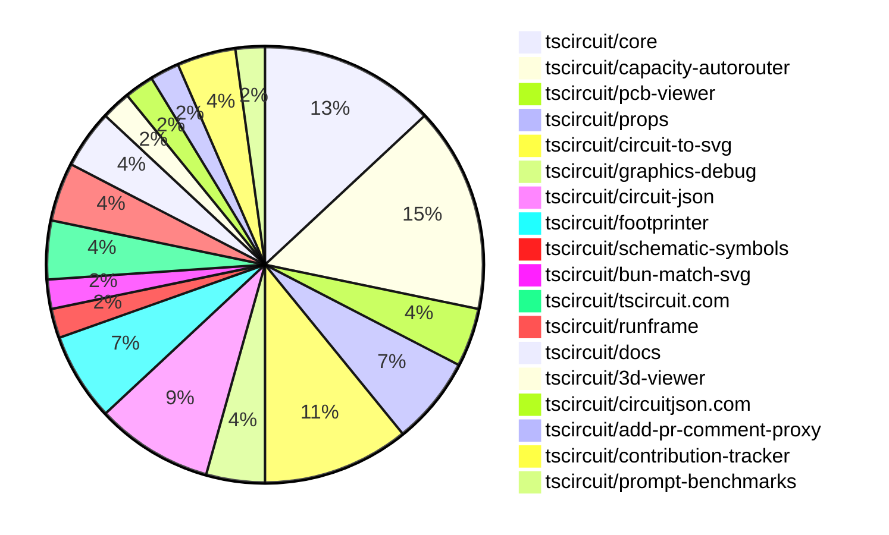

# Contribution Overview 2025-02-26

## PRs by Repository

## Contributor Overview

| Contributor | 🐳 Major | 🐙 Minor | 🐌 Tiny | ⭐ | Issues Created |
|-------------|---------|---------|---------|-----|----------------|
| [seveibar](#seveibar) | 5 | 11 | 2 | ⭐⭐⭐ | 30 |
| [techmannih](#techmannih) | 2 | 8 | 0 | ⭐⭐ | 13 |
| [imrishabh18](#imrishabh18) | 0 | 5 | 1 | ⭐⭐ | 6 |
| [MustafaMulla29](#MustafaMulla29) | 1 | 2 | 0 | ⭐ | 1 |
| [ShiboSoftwareDev](#ShiboSoftwareDev) | 0 | 1 | 0 | ⭐ | 15 |
| [Abse2001](#Abse2001) | 0 | 1 | 0 | ⭐ | 2 |
| [Anshgrover23](#Anshgrover23) | 0 | 2 | 0 | ⭐ | 4 |
| [kom-senapati](#kom-senapati) | 0 | 2 | 0 | ⭐ | 0 |
| [rohitbhure65](#rohitbhure65) | 0 | 1 | 0 |  | 0 |
| [Ayushjhawar8](#Ayushjhawar8) | 0 | 1 | 0 |  | 1 |
| [krushnarout](#krushnarout) | 0 | 1 | 0 |  | 1 |

## Review Table

[reviews-received-hover]: ## "Number of reviews received for PRs for this contributor"
[approvals-received-hover]: ## "Number of approvals received for PRs this contributor authored"
[rejections-received-hover]: ## "Number of rejections received for PRs this contributor authored"
[prs-opened-hover]: ## "Number of PRs opened by this contributor"
[issues-created-hover]: ## "Number of issues created by this contributor"
[bountied-issues-hover]: ## "Number of issues this contributor created with a bounty"
[bountied-issue-$-hover]: ## "Total bounty amount placed on issues authored by this contributor"

| Contributor | Reviews Received | Approvals Received | Rejections Received | Approvals | Rejections | PRs Opened | PRs Merged | Issues Created | Bountied Issues | Bountied Issue $ |
|---|---|---|---|---|---|---|---|---|---|---|
| [seveibar](#seveibar) | 0 | 0 | 0 | 17 | 7 | 22 | 18 | 30 | 24 | 390 |
| [MustafaMulla29](#MustafaMulla29) | 9 | 4 | 4 | 0 | 0 | 6 | 3 | 1 | 0 | 0 |
| [ShiboSoftwareDev](#ShiboSoftwareDev) | 2 | 1 | 0 | 4 | 2 | 2 | 1 | 15 | 7 | 187 |
| [Anshgrover23](#Anshgrover23) | 3 | 2 | 1 | 3 | 1 | 4 | 2 | 4 | 1 | 5 |
| [techmannih](#techmannih) | 22 | 15 | 4 | 0 | 3 | 19 | 10 | 13 | 3 | 15 |
| [Abse2001](#Abse2001) | 0 | 0 | 0 | 2 | 0 | 1 | 1 | 2 | 2 | 25 |
| [imrishabh18](#imrishabh18) | 1 | 1 | 0 | 6 | 3 | 6 | 6 | 6 | 1 | 20 |
| [rohitbhure65](#rohitbhure65) | 2 | 2 | 0 | 0 | 0 | 1 | 1 | 0 | 0 | 0 |
| [kom-senapati](#kom-senapati) | 21 | 5 | 2 | 0 | 0 | 4 | 2 | 0 | 0 | 0 |
| [kanakOS01](#kanakOS01) | 1 | 0 | 1 | 0 | 0 | 1 | 0 | 0 | 0 | 0 |
| [Ayushjhawar8](#Ayushjhawar8) | 3 | 1 | 0 | 0 | 0 | 2 | 1 | 1 | 0 | 0 |
| [yashksaini-coder](#yashksaini-coder) | 0 | 0 | 0 | 0 | 0 | 1 | 0 | 0 | 0 | 0 |
| [ArnavK-09](#ArnavK-09) | 1 | 0 | 0 | 2 | 0 | 2 | 0 | 2 | 0 | 0 |
| [Saurabhsing21](#Saurabhsing21) | 6 | 2 | 4 | 0 | 0 | 3 | 0 | 0 | 0 | 0 |
| [krushnarout](#krushnarout) | 1 | 1 | 0 | 0 | 0 | 1 | 1 | 1 | 0 | 0 |
| [PatanSharuKhan](#PatanSharuKhan) | 0 | 0 | 0 | 0 | 0 | 1 | 0 | 0 | 0 | 0 |

## Changes by Repository

### [tscircuit/core](https://github.com/tscircuit/core)

| PR # | Impact | Contributor | Description |
|------|--------|-------------|-------------|
| [#667](https://github.com/tscircuit/core/pull/667) | 🐳 Major | seveibar | Allows the user to provide a custom autorouting algorithm function to the Group component |
| [#656](https://github.com/tscircuit/core/pull/656) | 🐳 Major | seveibar | Integrate Capacity Autorouter |
| [#669](https://github.com/tscircuit/core/pull/669) | 🐙 Minor | seveibar | This pull request adds more traceable connection names when converting Circuit JSON to Simple Route JSON. |
| [#666](https://github.com/tscircuit/core/pull/666) | 🐙 Minor | seveibar | Export the `GenericLocalAutorouter` interface from the library. |
| [#657](https://github.com/tscircuit/core/pull/657) | 🐙 Minor | seveibar | Add support for `autorouting:progress` and `renderComplete` events in the `RootCircuit` and `Group` components. |
| [#653](https://github.com/tscircuit/core/pull/653) | 🐙 Minor | MustafaMulla29 | Adds a new export for the `SimpleRouteJson` utility from the `autorouting` directory. |

### [tscircuit/capacity-autorouter](https://github.com/tscircuit/capacity-autorouter)

| PR # | Impact | Contributor | Description |
|------|--------|-------------|-------------|
| [#25](https://github.com/tscircuit/capacity-autorouter/pull/25) | 🐳 Major | seveibar | Switches to a pipeline definition for better high density stitching. |
| [#23](https://github.com/tscircuit/capacity-autorouter/pull/23) | 🐳 Major | seveibar | The pull request adds support for output vias in trace output. |
| [#20](https://github.com/tscircuit/capacity-autorouter/pull/20) | 🐳 Major | seveibar | The pull request adds a JSON file containing information about a circuit board, including its bounds, obstacles, and connectivity between different elements. |
| [#27](https://github.com/tscircuit/capacity-autorouter/pull/27) | 🐙 Minor | seveibar | Minor Fixes and Core Testing, Fix accidental SRJ mutation |
| [#24](https://github.com/tscircuit/capacity-autorouter/pull/24) | 🐙 Minor | seveibar | Fix SimpleRouteJson output and add svg tests for making sure they don't break |
| [#22](https://github.com/tscircuit/capacity-autorouter/pull/22) | 🐙 Minor | seveibar | Fixes layers and adds connection name to output PCB traces |
| [#21](https://github.com/tscircuit/capacity-autorouter/pull/21) | 🐙 Minor | seveibar | Make connection names unique to fix segment point crossing issues |

### [tscircuit/pcb-viewer](https://github.com/tscircuit/pcb-viewer)

| PR # | Impact | Contributor | Description |
|------|--------|-------------|-------------|
| [#176](https://github.com/tscircuit/pcb-viewer/pull/176) | 🐙 Minor | seveibar | Allow Debug Objects to be passed into PCB Viewer (enables autorouting animations). Fix "d" key not working |
| [#177](https://github.com/tscircuit/pcb-viewer/pull/177) | 🐌 Tiny | seveibar | Adds a type check workflow for the project using Bun and TypeScript, and updates dependencies. |

### [tscircuit/props](https://github.com/tscircuit/props)

| PR # | Impact | Contributor | Description |
|------|--------|-------------|-------------|
| [#189](https://github.com/tscircuit/props/pull/189) | 🐳 Major | techmannih | Adds support for rectangular plated holes with circular holes in the middle. |
| [#191](https://github.com/tscircuit/props/pull/191) | 🐙 Minor | seveibar | Adds a new `algorithmFn` property to the `AutorouterProp` type, allowing users to provide a custom autorouting function to be used in the autorouter. |
| [#190](https://github.com/tscircuit/props/pull/190) | 🐙 Minor | Anshgrover23 | Adds missing component types, such as silkscreen, to the COMPONENT_TYPES.md file. |

### [tscircuit/circuit-to-svg](https://github.com/tscircuit/circuit-to-svg)

| PR # | Impact | Contributor | Description |
|------|--------|-------------|-------------|
| [#189](https://github.com/tscircuit/circuit-to-svg/pull/189) | 🐳 Major | techmannih | Adds support for rectangular pads with circular holes in the PCB SVG object creation function. |
| [#184](https://github.com/tscircuit/circuit-to-svg/pull/184) | 🐙 Minor | seveibar | Fix the silkscreen text style. |
| [#187](https://github.com/tscircuit/circuit-to-svg/pull/187) | 🐙 Minor | techmannih | Add support for stroke_width for all silkscreen elements (circles, rectangles, and text) |
| [#186](https://github.com/tscircuit/circuit-to-svg/pull/186) | 🐙 Minor | techmannih | Fixes an issue where the bottom layer was not drawn below the top layer. |
| [#179](https://github.com/tscircuit/circuit-to-svg/pull/179) | 🐙 Minor | Ayushjhawar8 | Fix the silkscreen text rotation. |

### [tscircuit/graphics-debug](https://github.com/tscircuit/graphics-debug)

| PR # | Impact | Contributor | Description |
|------|--------|-------------|-------------|
| [#30](https://github.com/tscircuit/graphics-debug/pull/30) | 🐙 Minor | seveibar | Adds a custom matcher for testing GraphicsObjects with Bun's Test Framework. |
| [#31](https://github.com/tscircuit/graphics-debug/pull/31) | 🐌 Tiny | seveibar | The pull request formats the code and adds a `disableLabels` option to the `drawGraphicsToCanvas` function. |

### [tscircuit/circuit-json](https://github.com/tscircuit/circuit-json)

| PR # | Impact | Contributor | Description |
|------|--------|-------------|-------------|
| [#150](https://github.com/tscircuit/circuit-json/pull/150) | 🐙 Minor | techmannih | Add support for configuring the stroke width of silkscreen text. |
| [#151](https://github.com/tscircuit/circuit-json/pull/151) | 🐙 Minor | techmannih | Add rotation property to schematic component |
| [#145](https://github.com/tscircuit/circuit-json/pull/145) | 🐙 Minor | rohitbhure65 | Adds support for the `kohm` unit in resistance parsing. |
| [#152](https://github.com/tscircuit/circuit-json/pull/152) | 🐙 Minor | Abse2001 | Reverts the addition of rotation in schematic component |

### [tscircuit/footprinter](https://github.com/tscircuit/footprinter)

| PR # | Impact | Contributor | Description |
|------|--------|-------------|-------------|
| [#225](https://github.com/tscircuit/footprinter/pull/225) | 🐙 Minor | techmannih | Add sod110 footprint |
| [#221](https://github.com/tscircuit/footprinter/pull/221) | 🐙 Minor | techmannih | Adds a new JST footprint. |
| [#228](https://github.com/tscircuit/footprinter/pull/228) | 🐙 Minor | techmannih | Adds a new TO-92S footprint to the library. |

### [tscircuit/schematic-symbols](https://github.com/tscircuit/schematic-symbols)

| PR # | Impact | Contributor | Description |
|------|--------|-------------|-------------|
| [#254](https://github.com/tscircuit/schematic-symbols/pull/254) | 🐙 Minor | techmannih | Add all orientation for SPDT and SPST switches |

### [tscircuit/bun-match-svg](https://github.com/tscircuit/bun-match-svg)

| PR # | Impact | Contributor | Description |
|------|--------|-------------|-------------|
| [#10](https://github.com/tscircuit/bun-match-svg/pull/10) | 🐙 Minor | Anshgrover23 | Fix an issue where existing files were being overwritten. |

### [tscircuit/tscircuit.com](https://github.com/tscircuit/tscircuit.com)

| PR # | Impact | Contributor | Description |
|------|--------|-------------|-------------|
| [#699](https://github.com/tscircuit/tscircuit.com/pull/699) | 🐙 Minor | imrishabh18 | Adds a new endpoint to the fake snippets API for creating package files. |
| [#696](https://github.com/tscircuit/tscircuit.com/pull/696) | 🐙 Minor | krushnarout | Fixes the blinking LED board template by replacing the deprecated `A555Timer` component with the new `useNE555P` component. |

### [tscircuit/runframe](https://github.com/tscircuit/runframe)

| PR # | Impact | Contributor | Description |
|------|--------|-------------|-------------|
| [#282](https://github.com/tscircuit/runframe/pull/282) | 🐙 Minor | imrishabh18 | Fix for the npm release workflow. |
| [#281](https://github.com/tscircuit/runframe/pull/281) | 🐙 Minor | imrishabh18 | Update the pushbutton footprint in the 3D viewer |

### [tscircuit/docs](https://github.com/tscircuit/docs)

| PR # | Impact | Contributor | Description |
|------|--------|-------------|-------------|
| [#20](https://github.com/tscircuit/docs/pull/20) | 🐙 Minor | imrishabh18 | Improve the documentation for the LED matrix tutorial, including adding images and clarifying the Pico schematic and LED matrix layout. |
| [#18](https://github.com/tscircuit/docs/pull/18) | 🐙 Minor | imrishabh18 | This pull request adds a new tutorial for building a 3x5 LED matrix controlled by a Raspberry Pi Pico using tscircuit. |

### [tscircuit/3d-viewer](https://github.com/tscircuit/3d-viewer)

| PR # | Impact | Contributor | Description |
|------|--------|-------------|-------------|
| [#196](https://github.com/tscircuit/3d-viewer/pull/196) | 🐌 Tiny | imrishabh18 | Update the jscad-electronics dependency from version 0.0.25 to 0.0.27 |

### [tscircuit/circuitjson.com](https://github.com/tscircuit/circuitjson.com)

| PR # | Impact | Contributor | Description |
|------|--------|-------------|-------------|
| [#12](https://github.com/tscircuit/circuitjson.com/pull/12) | 🐳 Major | MustafaMulla29 | Added support for uploading SimpleRouteJson, which is converted to CircuitJson format. |

### [tscircuit/add-pr-comment-proxy](https://github.com/tscircuit/add-pr-comment-proxy)

| PR # | Impact | Contributor | Description |
|------|--------|-------------|-------------|
| [#9](https://github.com/tscircuit/add-pr-comment-proxy/pull/9) | 🐙 Minor | MustafaMulla29 | The PR fixes an issue with the add-pr-comment-proxy workflow, where it was creating a new comment instead of updating an existing one. |

### [tscircuit/contribution-tracker](https://github.com/tscircuit/contribution-tracker)

| PR # | Impact | Contributor | Description |
|------|--------|-------------|-------------|
| [#68](https://github.com/tscircuit/contribution-tracker/pull/68) | 🐙 Minor | kom-senapati | Add loading state to contributors data fetching |
| [#79](https://github.com/tscircuit/contribution-tracker/pull/79) | 🐙 Minor | kom-senapati | Adds tooltips to contribution icons and stats in the ContributorCard and ContributorOverview components. |

### [tscircuit/prompt-benchmarks](https://github.com/tscircuit/prompt-benchmarks)

| PR # | Impact | Contributor | Description |
|------|--------|-------------|-------------|
| [#47](https://github.com/tscircuit/prompt-benchmarks/pull/47) | 🐙 Minor | ShiboSoftwareDev | The pull request adds a new function `getPrimarySourceCodeFromVfs` to retrieve the primary source code from the Virtual File System (VFS) and integrates it into the `askAiWithPreviousAttempts` and `runAiWithErrorCorrection` functions. |

## Changes by Contributor

### [seveibar](https://github.com/seveibar)

| PR # | Impact | Description |
|------|--------|-------------|
| [#667](https://github.com/tscircuit/core/pull/667) | 🐳 Major | Allows the user to provide a custom autorouting algorithm function to the Group component |
| [#656](https://github.com/tscircuit/core/pull/656) | 🐳 Major | Integrate Capacity Autorouter |
| [#25](https://github.com/tscircuit/capacity-autorouter/pull/25) | 🐳 Major | Switches to a pipeline definition for better high density stitching. |
| [#23](https://github.com/tscircuit/capacity-autorouter/pull/23) | 🐳 Major | The pull request adds support for output vias in trace output. |
| [#20](https://github.com/tscircuit/capacity-autorouter/pull/20) | 🐳 Major | The pull request adds a JSON file containing information about a circuit board, including its bounds, obstacles, and connectivity between different elements. |
| [#176](https://github.com/tscircuit/pcb-viewer/pull/176) | 🐙 Minor | Allow Debug Objects to be passed into PCB Viewer (enables autorouting animations). Fix "d" key not working |
| [#191](https://github.com/tscircuit/props/pull/191) | 🐙 Minor | Adds a new `algorithmFn` property to the `AutorouterProp` type, allowing users to provide a custom autorouting function to be used in the autorouter. |
| [#669](https://github.com/tscircuit/core/pull/669) | 🐙 Minor | This pull request adds more traceable connection names when converting Circuit JSON to Simple Route JSON. |
| [#666](https://github.com/tscircuit/core/pull/666) | 🐙 Minor | Export the `GenericLocalAutorouter` interface from the library. |
| [#657](https://github.com/tscircuit/core/pull/657) | 🐙 Minor | Add support for `autorouting:progress` and `renderComplete` events in the `RootCircuit` and `Group` components. |
| [#184](https://github.com/tscircuit/circuit-to-svg/pull/184) | 🐙 Minor | Fix the silkscreen text style. |
| [#30](https://github.com/tscircuit/graphics-debug/pull/30) | 🐙 Minor | Adds a custom matcher for testing GraphicsObjects with Bun's Test Framework. |
| [#27](https://github.com/tscircuit/capacity-autorouter/pull/27) | 🐙 Minor | Minor Fixes and Core Testing, Fix accidental SRJ mutation |
| [#24](https://github.com/tscircuit/capacity-autorouter/pull/24) | 🐙 Minor | Fix SimpleRouteJson output and add svg tests for making sure they don't break |
| [#22](https://github.com/tscircuit/capacity-autorouter/pull/22) | 🐙 Minor | Fixes layers and adds connection name to output PCB traces |
| [#21](https://github.com/tscircuit/capacity-autorouter/pull/21) | 🐙 Minor | Make connection names unique to fix segment point crossing issues |
| [#177](https://github.com/tscircuit/pcb-viewer/pull/177) | 🐌 Tiny | Adds a type check workflow for the project using Bun and TypeScript, and updates dependencies. |
| [#31](https://github.com/tscircuit/graphics-debug/pull/31) | 🐌 Tiny | The pull request formats the code and adds a `disableLabels` option to the `drawGraphicsToCanvas` function. |

### [techmannih](https://github.com/techmannih)

| PR # | Impact | Description |
|------|--------|-------------|
| [#189](https://github.com/tscircuit/props/pull/189) | 🐳 Major | Adds support for rectangular plated holes with circular holes in the middle. |
| [#189](https://github.com/tscircuit/circuit-to-svg/pull/189) | 🐳 Major | Adds support for rectangular pads with circular holes in the PCB SVG object creation function. |
| [#150](https://github.com/tscircuit/circuit-json/pull/150) | 🐙 Minor | Add support for configuring the stroke width of silkscreen text. |
| [#151](https://github.com/tscircuit/circuit-json/pull/151) | 🐙 Minor | Add rotation property to schematic component |
| [#225](https://github.com/tscircuit/footprinter/pull/225) | 🐙 Minor | Add sod110 footprint |
| [#221](https://github.com/tscircuit/footprinter/pull/221) | 🐙 Minor | Adds a new JST footprint. |
| [#228](https://github.com/tscircuit/footprinter/pull/228) | 🐙 Minor | Adds a new TO-92S footprint to the library. |
| [#187](https://github.com/tscircuit/circuit-to-svg/pull/187) | 🐙 Minor | Add support for stroke_width for all silkscreen elements (circles, rectangles, and text) |
| [#186](https://github.com/tscircuit/circuit-to-svg/pull/186) | 🐙 Minor | Fixes an issue where the bottom layer was not drawn below the top layer. |
| [#254](https://github.com/tscircuit/schematic-symbols/pull/254) | 🐙 Minor | Add all orientation for SPDT and SPST switches |

### [rohitbhure65](https://github.com/rohitbhure65)

| PR # | Impact | Description |
|------|--------|-------------|
| [#145](https://github.com/tscircuit/circuit-json/pull/145) | 🐙 Minor | Adds support for the `kohm` unit in resistance parsing. |

### [Abse2001](https://github.com/Abse2001)

| PR # | Impact | Description |
|------|--------|-------------|
| [#152](https://github.com/tscircuit/circuit-json/pull/152) | 🐙 Minor | Reverts the addition of rotation in schematic component |

### [Anshgrover23](https://github.com/Anshgrover23)

| PR # | Impact | Description |
|------|--------|-------------|
| [#190](https://github.com/tscircuit/props/pull/190) | 🐙 Minor | Adds missing component types, such as silkscreen, to the COMPONENT_TYPES.md file. |
| [#10](https://github.com/tscircuit/bun-match-svg/pull/10) | 🐙 Minor | Fix an issue where existing files were being overwritten. |

### [imrishabh18](https://github.com/imrishabh18)

| PR # | Impact | Description |
|------|--------|-------------|
| [#699](https://github.com/tscircuit/tscircuit.com/pull/699) | 🐙 Minor | Adds a new endpoint to the fake snippets API for creating package files. |
| [#282](https://github.com/tscircuit/runframe/pull/282) | 🐙 Minor | Fix for the npm release workflow. |
| [#281](https://github.com/tscircuit/runframe/pull/281) | 🐙 Minor | Update the pushbutton footprint in the 3D viewer |
| [#20](https://github.com/tscircuit/docs/pull/20) | 🐙 Minor | Improve the documentation for the LED matrix tutorial, including adding images and clarifying the Pico schematic and LED matrix layout. |
| [#18](https://github.com/tscircuit/docs/pull/18) | 🐙 Minor | This pull request adds a new tutorial for building a 3x5 LED matrix controlled by a Raspberry Pi Pico using tscircuit. |
| [#196](https://github.com/tscircuit/3d-viewer/pull/196) | 🐌 Tiny | Update the jscad-electronics dependency from version 0.0.25 to 0.0.27 |

### [MustafaMulla29](https://github.com/MustafaMulla29)

| PR # | Impact | Description |
|------|--------|-------------|
| [#12](https://github.com/tscircuit/circuitjson.com/pull/12) | 🐳 Major | Added support for uploading SimpleRouteJson, which is converted to CircuitJson format. |
| [#653](https://github.com/tscircuit/core/pull/653) | 🐙 Minor | Adds a new export for the `SimpleRouteJson` utility from the `autorouting` directory. |
| [#9](https://github.com/tscircuit/add-pr-comment-proxy/pull/9) | 🐙 Minor | The PR fixes an issue with the add-pr-comment-proxy workflow, where it was creating a new comment instead of updating an existing one. |

### [kom-senapati](https://github.com/kom-senapati)

| PR # | Impact | Description |
|------|--------|-------------|
| [#68](https://github.com/tscircuit/contribution-tracker/pull/68) | 🐙 Minor | Add loading state to contributors data fetching |
| [#79](https://github.com/tscircuit/contribution-tracker/pull/79) | 🐙 Minor | Adds tooltips to contribution icons and stats in the ContributorCard and ContributorOverview components. |

### [Ayushjhawar8](https://github.com/Ayushjhawar8)

| PR # | Impact | Description |
|------|--------|-------------|
| [#179](https://github.com/tscircuit/circuit-to-svg/pull/179) | 🐙 Minor | Fix the silkscreen text rotation. |

### [krushnarout](https://github.com/krushnarout)

| PR # | Impact | Description |
|------|--------|-------------|
| [#696](https://github.com/tscircuit/tscircuit.com/pull/696) | 🐙 Minor | Fixes the blinking LED board template by replacing the deprecated `A555Timer` component with the new `useNE555P` component. |

### [ShiboSoftwareDev](https://github.com/ShiboSoftwareDev)

| PR # | Impact | Description |
|------|--------|-------------|
| [#47](https://github.com/tscircuit/prompt-benchmarks/pull/47) | 🐙 Minor | The pull request adds a new function `getPrimarySourceCodeFromVfs` to retrieve the primary source code from the Virtual File System (VFS) and integrates it into the `askAiWithPreviousAttempts` and `runAiWithErrorCorrection` functions. |

