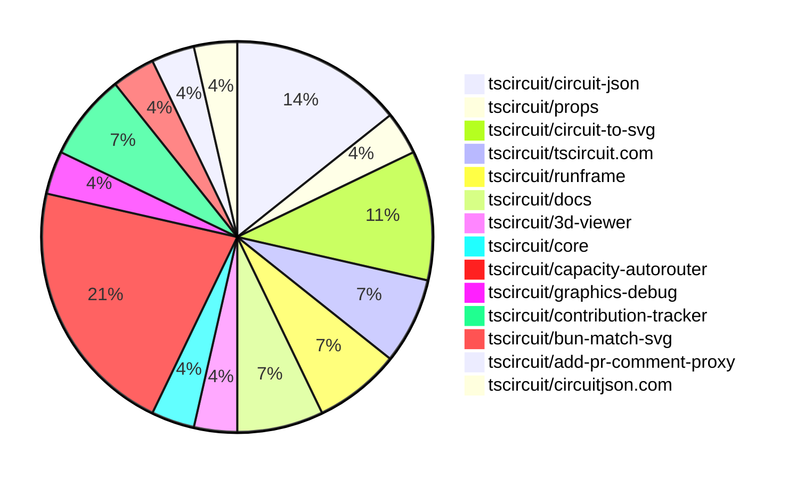

# Contribution Overview 2025-02-26

## PRs by Repository

## Contributor Overview

| Contributor | 🐳 Major | 🐙 Minor | 🐌 Tiny | ⭐ | Issues Created |
|-------------|---------|---------|---------|-----|----------------|
| [seveibar](#seveibar) | 4 | 5 | 0 | ⭐⭐⭐ | 19 |
| [techmannih](#techmannih) | 1 | 3 | 0 | ⭐⭐ | 9 |
| [imrishabh18](#imrishabh18) | 0 | 4 | 2 | ⭐⭐ | 6 |
| [Abse2001](#Abse2001) | 0 | 1 | 0 | ⭐ | 2 |
| [kom-senapati](#kom-senapati) | 0 | 2 | 0 | ⭐ | 0 |
| [MustafaMulla29](#MustafaMulla29) | 0 | 2 | 0 | ⭐ | 1 |
| [Anshgrover23](#Anshgrover23) | 0 | 1 | 0 |  | 4 |
| [rohitbhure65](#rohitbhure65) | 0 | 1 | 0 |  | 0 |
| [Ayushjhawar8](#Ayushjhawar8) | 0 | 1 | 0 |  | 1 |
| [krushnarout](#krushnarout) | 0 | 1 | 0 |  | 1 |

## Review Table

[reviews-received-hover]: ## "Number of reviews received for PRs for this contributor"
[approvals-received-hover]: ## "Number of approvals received for PRs this contributor authored"
[rejections-received-hover]: ## "Number of rejections received for PRs this contributor authored"
[prs-opened-hover]: ## "Number of PRs opened by this contributor"
[issues-created-hover]: ## "Number of issues created by this contributor"
[bountied-issues-hover]: ## "Number of issues this contributor created with a bounty"
[bountied-issue-$-hover]: ## "Total bounty amount placed on issues authored by this contributor"

| Contributor | Reviews Received | Approvals Received | Rejections Received | Approvals | Rejections | PRs Opened | PRs Merged | Issues Created | Bountied Issues | Bountied Issue $ |
|---|---|---|---|---|---|---|---|---|---|---|
| [MustafaMulla29](#MustafaMulla29) | 7 | 3 | 3 | 0 | 0 | 5 | 2 | 1 | 0 | 0 |
| [ShiboSoftwareDev](#ShiboSoftwareDev) | 0 | 0 | 0 | 2 | 1 | 1 | 0 | 14 | 6 | 177 |
| [seveibar](#seveibar) | 0 | 0 | 0 | 10 | 4 | 12 | 9 | 19 | 16 | 262 |
| [rohitbhure65](#rohitbhure65) | 2 | 2 | 0 | 0 | 0 | 1 | 1 | 0 | 0 | 0 |
| [imrishabh18](#imrishabh18) | 1 | 1 | 0 | 6 | 1 | 6 | 6 | 6 | 1 | 20 |
| [Anshgrover23](#Anshgrover23) | 2 | 2 | 0 | 3 | 1 | 2 | 1 | 4 | 1 | 5 |
| [techmannih](#techmannih) | 13 | 8 | 2 | 0 | 0 | 15 | 4 | 9 | 3 | 15 |
| [Abse2001](#Abse2001) | 0 | 0 | 0 | 2 | 0 | 1 | 1 | 2 | 2 | 25 |
| [kanakOS01](#kanakOS01) | 1 | 0 | 1 | 0 | 0 | 1 | 0 | 0 | 0 | 0 |
| [Ayushjhawar8](#Ayushjhawar8) | 3 | 1 | 0 | 0 | 0 | 2 | 1 | 1 | 0 | 0 |
| [yashksaini-coder](#yashksaini-coder) | 0 | 0 | 0 | 0 | 0 | 1 | 0 | 0 | 0 | 0 |
| [kom-senapati](#kom-senapati) | 7 | 5 | 0 | 0 | 0 | 2 | 2 | 0 | 0 | 0 |
| [ArnavK-09](#ArnavK-09) | 0 | 0 | 0 | 2 | 0 | 0 | 0 | 2 | 0 | 0 |
| [Saurabhsing21](#Saurabhsing21) | 3 | 2 | 1 | 0 | 0 | 1 | 0 | 0 | 0 | 0 |
| [krushnarout](#krushnarout) | 1 | 1 | 0 | 0 | 0 | 1 | 1 | 1 | 0 | 0 |
| [PatanSharuKhan](#PatanSharuKhan) | 0 | 0 | 0 | 0 | 0 | 1 | 0 | 0 | 0 | 0 |

## Changes by Repository

### [tscircuit/circuit-json](https://github.com/tscircuit/circuit-json)

| PR # | Impact | Contributor | Description |
|------|--------|-------------|-------------|
| [#145](https://github.com/tscircuit/circuit-json/pull/145) | 🐙 Minor | rohitbhure65 | Adds support for the `kohm` unit in resistance parsing. |
| [#150](https://github.com/tscircuit/circuit-json/pull/150) | 🐙 Minor | techmannih | Add support for specifying stroke width for silkscreen text. |
| [#151](https://github.com/tscircuit/circuit-json/pull/151) | 🐙 Minor | techmannih | Add rotation property to schematic component |
| [#152](https://github.com/tscircuit/circuit-json/pull/152) | 🐙 Minor | Abse2001 | Reverts the addition of rotation in schematic component. |

### [tscircuit/props](https://github.com/tscircuit/props)

| PR # | Impact | Contributor | Description |
|------|--------|-------------|-------------|
| [#189](https://github.com/tscircuit/props/pull/189) | 🐳 Major | techmannih | The pull request adds support for a new type of plated hole called "CircularHoleWithRectPlatedProps" in the circuit-json library. |

### [tscircuit/circuit-to-svg](https://github.com/tscircuit/circuit-to-svg)

| PR # | Impact | Contributor | Description |
|------|--------|-------------|-------------|
| [#186](https://github.com/tscircuit/circuit-to-svg/pull/186) | 🐙 Minor | techmannih | Fixes the issue where the bottom layer was not drawn below the top layer. |
| [#184](https://github.com/tscircuit/circuit-to-svg/pull/184) | 🐙 Minor | seveibar | Fix the silkscreen text style by updating the CSS for `.pcb-silkscreen-text` to use the `#f2eda1` color. |
| [#179](https://github.com/tscircuit/circuit-to-svg/pull/179) | 🐙 Minor | Ayushjhawar8 | Fix the silkscreen text rotation |

### [tscircuit/tscircuit.com](https://github.com/tscircuit/tscircuit.com)

| PR # | Impact | Contributor | Description |
|------|--------|-------------|-------------|
| [#699](https://github.com/tscircuit/tscircuit.com/pull/699) | 🐙 Minor | imrishabh18 | Add a fake `package_files/` endpoint to the test server. |
| [#696](https://github.com/tscircuit/tscircuit.com/pull/696) | 🐙 Minor | krushnarout | Fix the blinking LED board template by replacing the deprecated `A555Timer` component with the new `useNE555P` component. |

### [tscircuit/runframe](https://github.com/tscircuit/runframe)

| PR # | Impact | Contributor | Description |
|------|--------|-------------|-------------|
| [#281](https://github.com/tscircuit/runframe/pull/281) | 🐙 Minor | imrishabh18 | Update the pushbutton footprint in the 3D viewer |
| [#282](https://github.com/tscircuit/runframe/pull/282) | 🐌 Tiny | imrishabh18 | Fix the GitHub Actions workflow to use the correct version of the setup-bun action. |

### [tscircuit/docs](https://github.com/tscircuit/docs)

| PR # | Impact | Contributor | Description |
|------|--------|-------------|-------------|
| [#20](https://github.com/tscircuit/docs/pull/20) | 🐙 Minor | imrishabh18 | Improve the documentation of the LED matrix tutorial by adding more details, clarifying the Pico connection, and including relevant images. |
| [#18](https://github.com/tscircuit/docs/pull/18) | 🐙 Minor | imrishabh18 | The pull request adds a new tutorial document for building a 3x5 LED matrix controlled by a Raspberry Pi Pico using tscircuit. |

### [tscircuit/3d-viewer](https://github.com/tscircuit/3d-viewer)

| PR # | Impact | Contributor | Description |
|------|--------|-------------|-------------|
| [#196](https://github.com/tscircuit/3d-viewer/pull/196) | 🐌 Tiny | imrishabh18 | Update the version of the `jscad-electronics` dependency from `0.0.25` to `0.0.27`. |

### [tscircuit/core](https://github.com/tscircuit/core)

| PR # | Impact | Contributor | Description |
|------|--------|-------------|-------------|
| [#656](https://github.com/tscircuit/core/pull/656) | 🐳 Major | seveibar | Integrates the Capacity Mesh Autorouter and modifies the autorouting behavior based on the configuration. |

### [tscircuit/capacity-autorouter](https://github.com/tscircuit/capacity-autorouter)

| PR # | Impact | Contributor | Description |
|------|--------|-------------|-------------|
| [#25](https://github.com/tscircuit/capacity-autorouter/pull/25) | 🐳 Major | seveibar | The pull request rewrites the output function and switches to a pipeline definition for better stitching. |
| [#23](https://github.com/tscircuit/capacity-autorouter/pull/23) | 🐳 Major | seveibar | The pull request modifies the output of the CapacityMeshSolver to group routes by pcb_trace_id and merge them, adding vias when the layer changes. |
| [#20](https://github.com/tscircuit/capacity-autorouter/pull/20) | 🐳 Major | seveibar | This pull request adds a new JSON file "e2e2.json" containing information about circuit board obstacles and their connections. |
| [#24](https://github.com/tscircuit/capacity-autorouter/pull/24) | 🐙 Minor | seveibar | The pull request fixes the output of the `SimpleRouteJson` and adds SVG tests to ensure that the changes don't break the SVG output. |
| [#22](https://github.com/tscircuit/capacity-autorouter/pull/22) | 🐙 Minor | seveibar | Fixes layers and adds connection name to output PCB traces |
| [#21](https://github.com/tscircuit/capacity-autorouter/pull/21) | 🐙 Minor | seveibar | Make connection names unique to fix segment point crossing issues |

### [tscircuit/graphics-debug](https://github.com/tscircuit/graphics-debug)

| PR # | Impact | Contributor | Description |
|------|--------|-------------|-------------|
| [#30](https://github.com/tscircuit/graphics-debug/pull/30) | 🐙 Minor | seveibar | Add a custom matcher for testing GraphicsObjects with Bun's test framework |

### [tscircuit/contribution-tracker](https://github.com/tscircuit/contribution-tracker)

| PR # | Impact | Contributor | Description |
|------|--------|-------------|-------------|
| [#68](https://github.com/tscircuit/contribution-tracker/pull/68) | 🐙 Minor | kom-senapati | Adds a loading state to the contributors data fetching process. |
| [#79](https://github.com/tscircuit/contribution-tracker/pull/79) | 🐙 Minor | kom-senapati | Add tooltips to contribution icons and stats in the contributor card and overview. |

### [tscircuit/bun-match-svg](https://github.com/tscircuit/bun-match-svg)

| PR # | Impact | Contributor | Description |
|------|--------|-------------|-------------|
| [#10](https://github.com/tscircuit/bun-match-svg/pull/10) | 🐙 Minor | Anshgrover23 | Fix an issue where the script would overwrite an existing file without checking if it exists first. |

### [tscircuit/add-pr-comment-proxy](https://github.com/tscircuit/add-pr-comment-proxy)

| PR # | Impact | Contributor | Description |
|------|--------|-------------|-------------|
| [#9](https://github.com/tscircuit/add-pr-comment-proxy/pull/9) | 🐙 Minor | MustafaMulla29 | The pull request fixes an issue in the workflow file by updating the add-pr-comment-proxy code to check for an existing comment and update it rather than creating a new one. |

### [tscircuit/circuitjson.com](https://github.com/tscircuit/circuitjson.com)

| PR # | Impact | Contributor | Description |
|------|--------|-------------|-------------|
| [#12](https://github.com/tscircuit/circuitjson.com/pull/12) | 🐙 Minor | MustafaMulla29 | Added support for uploading and converting SimpleRouteJson to CircuitJson |

## Changes by Contributor

### [rohitbhure65](https://github.com/rohitbhure65)

| PR # | Impact | Description |
|------|--------|-------------|
| [#145](https://github.com/tscircuit/circuit-json/pull/145) | 🐙 Minor | Adds support for the `kohm` unit in resistance parsing. |

### [techmannih](https://github.com/techmannih)

| PR # | Impact | Description |
|------|--------|-------------|
| [#189](https://github.com/tscircuit/props/pull/189) | 🐳 Major | The pull request adds support for a new type of plated hole called "CircularHoleWithRectPlatedProps" in the circuit-json library. |
| [#150](https://github.com/tscircuit/circuit-json/pull/150) | 🐙 Minor | Add support for specifying stroke width for silkscreen text. |
| [#151](https://github.com/tscircuit/circuit-json/pull/151) | 🐙 Minor | Add rotation property to schematic component |
| [#186](https://github.com/tscircuit/circuit-to-svg/pull/186) | 🐙 Minor | Fixes the issue where the bottom layer was not drawn below the top layer. |

### [Abse2001](https://github.com/Abse2001)

| PR # | Impact | Description |
|------|--------|-------------|
| [#152](https://github.com/tscircuit/circuit-json/pull/152) | 🐙 Minor | Reverts the addition of rotation in schematic component. |

### [imrishabh18](https://github.com/imrishabh18)

| PR # | Impact | Description |
|------|--------|-------------|
| [#699](https://github.com/tscircuit/tscircuit.com/pull/699) | 🐙 Minor | Add a fake `package_files/` endpoint to the test server. |
| [#281](https://github.com/tscircuit/runframe/pull/281) | 🐙 Minor | Update the pushbutton footprint in the 3D viewer |
| [#20](https://github.com/tscircuit/docs/pull/20) | 🐙 Minor | Improve the documentation of the LED matrix tutorial by adding more details, clarifying the Pico connection, and including relevant images. |
| [#18](https://github.com/tscircuit/docs/pull/18) | 🐙 Minor | The pull request adds a new tutorial document for building a 3x5 LED matrix controlled by a Raspberry Pi Pico using tscircuit. |
| [#196](https://github.com/tscircuit/3d-viewer/pull/196) | 🐌 Tiny | Update the version of the `jscad-electronics` dependency from `0.0.25` to `0.0.27`. |
| [#282](https://github.com/tscircuit/runframe/pull/282) | 🐌 Tiny | Fix the GitHub Actions workflow to use the correct version of the setup-bun action. |

### [seveibar](https://github.com/seveibar)

| PR # | Impact | Description |
|------|--------|-------------|
| [#656](https://github.com/tscircuit/core/pull/656) | 🐳 Major | Integrates the Capacity Mesh Autorouter and modifies the autorouting behavior based on the configuration. |
| [#25](https://github.com/tscircuit/capacity-autorouter/pull/25) | 🐳 Major | The pull request rewrites the output function and switches to a pipeline definition for better stitching. |
| [#23](https://github.com/tscircuit/capacity-autorouter/pull/23) | 🐳 Major | The pull request modifies the output of the CapacityMeshSolver to group routes by pcb_trace_id and merge them, adding vias when the layer changes. |
| [#20](https://github.com/tscircuit/capacity-autorouter/pull/20) | 🐳 Major | This pull request adds a new JSON file "e2e2.json" containing information about circuit board obstacles and their connections. |
| [#184](https://github.com/tscircuit/circuit-to-svg/pull/184) | 🐙 Minor | Fix the silkscreen text style by updating the CSS for `.pcb-silkscreen-text` to use the `#f2eda1` color. |
| [#30](https://github.com/tscircuit/graphics-debug/pull/30) | 🐙 Minor | Add a custom matcher for testing GraphicsObjects with Bun's test framework |
| [#24](https://github.com/tscircuit/capacity-autorouter/pull/24) | 🐙 Minor | The pull request fixes the output of the `SimpleRouteJson` and adds SVG tests to ensure that the changes don't break the SVG output. |
| [#22](https://github.com/tscircuit/capacity-autorouter/pull/22) | 🐙 Minor | Fixes layers and adds connection name to output PCB traces |
| [#21](https://github.com/tscircuit/capacity-autorouter/pull/21) | 🐙 Minor | Make connection names unique to fix segment point crossing issues |

### [kom-senapati](https://github.com/kom-senapati)

| PR # | Impact | Description |
|------|--------|-------------|
| [#68](https://github.com/tscircuit/contribution-tracker/pull/68) | 🐙 Minor | Adds a loading state to the contributors data fetching process. |
| [#79](https://github.com/tscircuit/contribution-tracker/pull/79) | 🐙 Minor | Add tooltips to contribution icons and stats in the contributor card and overview. |

### [Ayushjhawar8](https://github.com/Ayushjhawar8)

| PR # | Impact | Description |
|------|--------|-------------|
| [#179](https://github.com/tscircuit/circuit-to-svg/pull/179) | 🐙 Minor | Fix the silkscreen text rotation |

### [Anshgrover23](https://github.com/Anshgrover23)

| PR # | Impact | Description |
|------|--------|-------------|
| [#10](https://github.com/tscircuit/bun-match-svg/pull/10) | 🐙 Minor | Fix an issue where the script would overwrite an existing file without checking if it exists first. |

### [krushnarout](https://github.com/krushnarout)

| PR # | Impact | Description |
|------|--------|-------------|
| [#696](https://github.com/tscircuit/tscircuit.com/pull/696) | 🐙 Minor | Fix the blinking LED board template by replacing the deprecated `A555Timer` component with the new `useNE555P` component. |

### [MustafaMulla29](https://github.com/MustafaMulla29)

| PR # | Impact | Description |
|------|--------|-------------|
| [#9](https://github.com/tscircuit/add-pr-comment-proxy/pull/9) | 🐙 Minor | The pull request fixes an issue in the workflow file by updating the add-pr-comment-proxy code to check for an existing comment and update it rather than creating a new one. |
| [#12](https://github.com/tscircuit/circuitjson.com/pull/12) | 🐙 Minor | Added support for uploading and converting SimpleRouteJson to CircuitJson |

