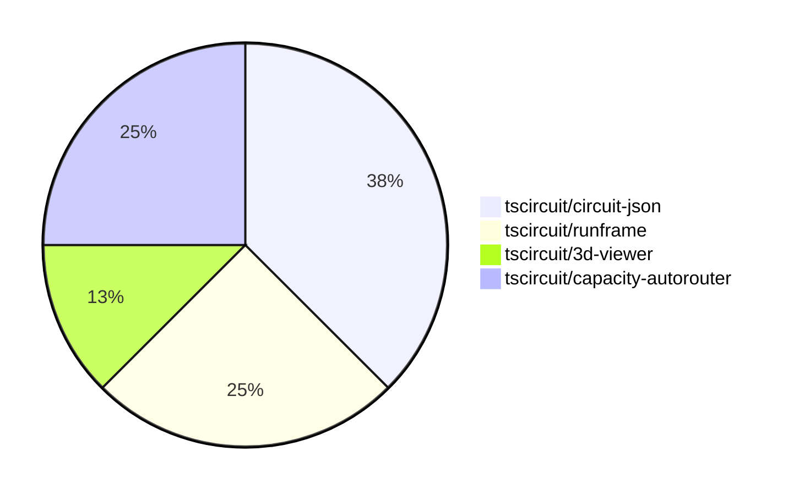

# Contribution Overview 2025-02-26

## PRs by Repository

## Contributor Overview

| Contributor | 🐳 Major | 🐙 Minor | 🐌 Tiny | ⭐ | Issues Created |
|-------------|---------|---------|---------|-----|----------------|
| [seveibar](#seveibar) | 1 | 1 | 0 | ⭐⭐ | 3 |
| [imrishabh18](#imrishabh18) | 0 | 1 | 2 | ⭐ | 1 |
| [Abse2001](#Abse2001) | 0 | 1 | 0 | ⭐ | 1 |
| [techmannih](#techmannih) | 0 | 2 | 0 | ⭐ | 1 |

## Review Table

[reviews-received-hover]: ## "Number of reviews received for PRs for this contributor"
[approvals-received-hover]: ## "Number of approvals received for PRs this contributor authored"
[rejections-received-hover]: ## "Number of rejections received for PRs this contributor authored"
[prs-opened-hover]: ## "Number of PRs opened by this contributor"
[issues-created-hover]: ## "Number of issues created by this contributor"
[bountied-issues-hover]: ## "Number of issues this contributor created with a bounty"
[bountied-issue-$-hover]: ## "Total bounty amount placed on issues authored by this contributor"

| Contributor | Reviews Received | Approvals Received | Rejections Received | Approvals | Rejections | PRs Opened | PRs Merged | Issues Created | Bountied Issues | Bountied Issue $ |
|---|---|---|---|---|---|---|---|---|---|---|
| [Abse2001](#Abse2001) | 0 | 0 | 0 | 2 | 0 | 1 | 1 | 1 | 1 | 15 |
| [MustafaMulla29](#MustafaMulla29) | 2 | 0 | 2 | 0 | 0 | 2 | 0 | 1 | 0 | 0 |
| [seveibar](#seveibar) | 0 | 0 | 0 | 0 | 1 | 2 | 2 | 3 | 3 | 55 |
| [techmannih](#techmannih) | 3 | 3 | 0 | 0 | 0 | 3 | 2 | 1 | 0 | 0 |
| [imrishabh18](#imrishabh18) | 0 | 0 | 0 | 1 | 0 | 3 | 3 | 1 | 1 | 20 |
| [Ayushjhawar8](#Ayushjhawar8) | 3 | 0 | 0 | 0 | 0 | 2 | 0 | 0 | 0 | 0 |
| [ShiboSoftwareDev](#ShiboSoftwareDev) | 0 | 0 | 0 | 0 | 1 | 0 | 0 | 0 | 0 | 0 |

## Changes by Repository

### [tscircuit/circuit-json](https://github.com/tscircuit/circuit-json)

| PR # | Impact | Contributor | Description |
|------|--------|-------------|-------------|
| [#152](https://github.com/tscircuit/circuit-json/pull/152) | 🐙 Minor | Abse2001 | Reverts the previous change that added rotation in schematic component. |
| [#151](https://github.com/tscircuit/circuit-json/pull/151) | 🐙 Minor | techmannih | Add a `rotation` property to the `SchematicComponent` type. |
| [#150](https://github.com/tscircuit/circuit-json/pull/150) | 🐙 Minor | techmannih | Add support for configuring the stroke width of silkscreen text. |

### [tscircuit/runframe](https://github.com/tscircuit/runframe)

| PR # | Impact | Contributor | Description |
|------|--------|-------------|-------------|
| [#281](https://github.com/tscircuit/runframe/pull/281) | 🐙 Minor | imrishabh18 | Update the pushbutton footprint in the 3D viewer |
| [#282](https://github.com/tscircuit/runframe/pull/282) | 🐌 Tiny | imrishabh18 | Fix the GitHub Actions workflow to use the correct version of the `oven-sh/setup-bun` action. |

### [tscircuit/3d-viewer](https://github.com/tscircuit/3d-viewer)

| PR # | Impact | Contributor | Description |
|------|--------|-------------|-------------|
| [#196](https://github.com/tscircuit/3d-viewer/pull/196) | 🐌 Tiny | imrishabh18 | Update the version of the `jscad-electronics` dependency from `0.0.25` to `0.0.27`. |

### [tscircuit/capacity-autorouter](https://github.com/tscircuit/capacity-autorouter)

| PR # | Impact | Contributor | Description |
|------|--------|-------------|-------------|
| [#20](https://github.com/tscircuit/capacity-autorouter/pull/20) | 🐳 Major | seveibar | Adds a new JSON file with information about obstacles, their locations, sizes, and connections to various PCB elements. |
| [#21](https://github.com/tscircuit/capacity-autorouter/pull/21) | 🐙 Minor | seveibar | Make connection names unique to fix segment point crossing issues |

## Changes by Contributor

### [Abse2001](https://github.com/Abse2001)

| PR # | Impact | Description |
|------|--------|-------------|
| [#152](https://github.com/tscircuit/circuit-json/pull/152) | 🐙 Minor | Reverts the previous change that added rotation in schematic component. |

### [techmannih](https://github.com/techmannih)

| PR # | Impact | Description |
|------|--------|-------------|
| [#151](https://github.com/tscircuit/circuit-json/pull/151) | 🐙 Minor | Add a `rotation` property to the `SchematicComponent` type. |
| [#150](https://github.com/tscircuit/circuit-json/pull/150) | 🐙 Minor | Add support for configuring the stroke width of silkscreen text. |

### [imrishabh18](https://github.com/imrishabh18)

| PR # | Impact | Description |
|------|--------|-------------|
| [#281](https://github.com/tscircuit/runframe/pull/281) | 🐙 Minor | Update the pushbutton footprint in the 3D viewer |
| [#196](https://github.com/tscircuit/3d-viewer/pull/196) | 🐌 Tiny | Update the version of the `jscad-electronics` dependency from `0.0.25` to `0.0.27`. |
| [#282](https://github.com/tscircuit/runframe/pull/282) | 🐌 Tiny | Fix the GitHub Actions workflow to use the correct version of the `oven-sh/setup-bun` action. |

### [seveibar](https://github.com/seveibar)

| PR # | Impact | Description |
|------|--------|-------------|
| [#20](https://github.com/tscircuit/capacity-autorouter/pull/20) | 🐳 Major | Adds a new JSON file with information about obstacles, their locations, sizes, and connections to various PCB elements. |
| [#21](https://github.com/tscircuit/capacity-autorouter/pull/21) | 🐙 Minor | Make connection names unique to fix segment point crossing issues |

