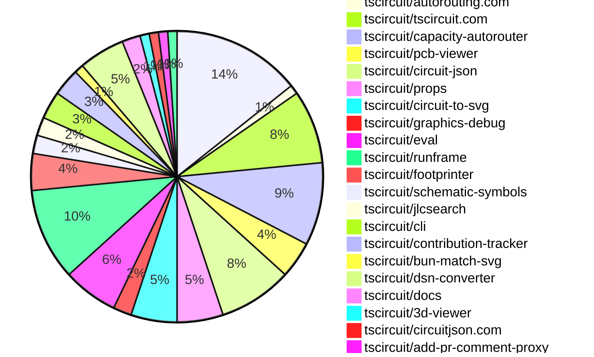

# Contribution Overview 2025-02-26

## PRs by Repository

## Contributor Overview

| Contributor | 🐳 Major | 🐙 Minor | 🐌 Tiny | ⭐ | Issues Created |
|-------------|---------|---------|---------|-----|----------------|
| [seveibar](#seveibar) | 7 | 34 | 4 | 👑👑👑 | 58 |
| [techmannih](#techmannih) | 1 | 10 | 0 | ⭐⭐ | 13 |
| [imrishabh18](#imrishabh18) | 0 | 10 | 2 | ⭐⭐ | 11 |
| [Abse2001](#Abse2001) | 2 | 1 | 0 | ⭐⭐ | 6 |
| [kom-senapati](#kom-senapati) | 0 | 4 | 0 | ⭐ | 2 |
| [MustafaMulla29](#MustafaMulla29) | 1 | 2 | 0 | ⭐ | 2 |
| [ArnavK-09](#ArnavK-09) | 0 | 4 | 0 | ⭐ | 7 |
| [ShiboSoftwareDev](#ShiboSoftwareDev) | 0 | 1 | 0 | ⭐ | 16 |
| [Anshgrover23](#Anshgrover23) | 0 | 3 | 0 | ⭐ | 5 |
| [Ayushjhawar8](#Ayushjhawar8) | 1 | 1 | 0 | ⭐ | 1 |
| [krushnarout](#krushnarout) | 0 | 2 | 0 | ⭐ | 1 |
| [rohitbhure65](#rohitbhure65) | 0 | 1 | 0 |  | 0 |
| [Saurabhsing21](#Saurabhsing21) | 0 | 1 | 0 |  | 0 |

## Review Table

[reviews-received-hover]: ## "Number of reviews received for PRs for this contributor"
[approvals-received-hover]: ## "Number of approvals received for PRs this contributor authored"
[rejections-received-hover]: ## "Number of rejections received for PRs this contributor authored"
[prs-opened-hover]: ## "Number of PRs opened by this contributor"
[issues-created-hover]: ## "Number of issues created by this contributor"
[bountied-issues-hover]: ## "Number of issues this contributor created with a bounty"
[bountied-issue-$-hover]: ## "Total bounty amount placed on issues authored by this contributor"

| Contributor | Reviews Received | Approvals Received | Rejections Received | Approvals | Rejections | PRs Opened | PRs Merged | Issues Created | Bountied Issues | Bountied Issue $ |
|---|---|---|---|---|---|---|---|---|---|---|
| [seveibar](#seveibar) | 2 | 1 | 0 | 34 | 13 | 51 | 47 | 58 | 38 | 553 |
| [Abse2001](#Abse2001) | 2 | 2 | 0 | 2 | 1 | 3 | 3 | 6 | 3 | 37 |
| [MustafaMulla29](#MustafaMulla29) | 15 | 5 | 9 | 0 | 0 | 8 | 3 | 2 | 0 | 0 |
| [ShiboSoftwareDev](#ShiboSoftwareDev) | 7 | 2 | 0 | 6 | 1 | 5 | 1 | 16 | 7 | 187 |
| [techmannih](#techmannih) | 30 | 19 | 6 | 2 | 6 | 24 | 14 | 13 | 4 | 18 |
| [Anshgrover23](#Anshgrover23) | 9 | 3 | 5 | 3 | 2 | 8 | 3 | 5 | 1 | 5 |
| [kom-senapati](#kom-senapati) | 24 | 7 | 3 | 0 | 0 | 7 | 4 | 2 | 0 | 0 |
| [imrishabh18](#imrishabh18) | 2 | 1 | 0 | 7 | 2 | 15 | 12 | 11 | 3 | 33 |
| [rohitbhure65](#rohitbhure65) | 2 | 2 | 0 | 0 | 0 | 1 | 1 | 0 | 0 | 0 |
| [Ayushjhawar8](#Ayushjhawar8) | 5 | 2 | 0 | 0 | 0 | 4 | 2 | 1 | 0 | 0 |
| [Rishikesh63](#Rishikesh63) | 0 | 0 | 0 | 0 | 0 | 1 | 0 | 0 | 0 | 0 |
| [krushnarout](#krushnarout) | 3 | 2 | 0 | 0 | 0 | 3 | 2 | 1 | 0 | 0 |
| [ArnavK-09](#ArnavK-09) | 6 | 5 | 0 | 3 | 1 | 6 | 5 | 7 | 0 | 0 |
| [kanakOS01](#kanakOS01) | 1 | 0 | 1 | 0 | 0 | 1 | 0 | 0 | 0 | 0 |
| [yashksaini-coder](#yashksaini-coder) | 0 | 0 | 0 | 0 | 0 | 1 | 0 | 0 | 0 | 0 |
| [Saurabhsing21](#Saurabhsing21) | 9 | 6 | 2 | 0 | 0 | 3 | 1 | 0 | 0 | 0 |
| [PatanSharuKhan](#PatanSharuKhan) | 0 | 0 | 0 | 0 | 0 | 1 | 0 | 0 | 0 | 0 |

## Changes by Repository

### [tscircuit/core](https://github.com/tscircuit/core)

| PR # | Impact | Contributor | Description |
|------|--------|-------------|-------------|
| [#675](https://github.com/tscircuit/core/pull/675) | 🐳 Major | seveibar | Add project metadata to the circuit output and make the Capacity Autorouter the default autorouter. |
| [#667](https://github.com/tscircuit/core/pull/667) | 🐳 Major | seveibar | Allow the user to supply a custom autorouting algorithm function. |
| [#656](https://github.com/tscircuit/core/pull/656) | 🐳 Major | seveibar | Integrate Capacity Autorouter |
| [#679](https://github.com/tscircuit/core/pull/679) | 🐳 Major | Abse2001 | The pull request modifies the `is-route-outside-board.ts` file to support checking if a route is outside the board outline. |
| [#685](https://github.com/tscircuit/core/pull/685) | 🐙 Minor | seveibar | Adds PCB holes and vias as obstacles for autorouting, improving routing through holes. |
| [#682](https://github.com/tscircuit/core/pull/682) | 🐙 Minor | seveibar | Increase the maximum time for executing autorouter steps without progress |
| [#681](https://github.com/tscircuit/core/pull/681) | 🐙 Minor | seveibar | Introduce reproduction for USB-C autorouting issue |
| [#674](https://github.com/tscircuit/core/pull/674) | 🐙 Minor | seveibar | Upgrade the `circuit-json` dependency to version `0.0.149` to avoid a backwards-incompatible change. |
| [#670](https://github.com/tscircuit/core/pull/670) | 🐙 Minor | seveibar | Update the version of the `@tscircuit/capacity-autorouter` dependency to `^0.0.13`. |
| [#669](https://github.com/tscircuit/core/pull/669) | 🐙 Minor | seveibar | The pull request adds more traceable connection names when converting Circuit JSON to Simple Route JSON. |
| [#666](https://github.com/tscircuit/core/pull/666) | 🐙 Minor | seveibar | Exports the `GenericLocalAutorouter` interface from the library. |
| [#657](https://github.com/tscircuit/core/pull/657) | 🐙 Minor | seveibar | Add support for new events "autorouting:progress" and "renderComplete" in the RootCircuit class. |
| [#678](https://github.com/tscircuit/core/pull/678) | 🐙 Minor | Anshgrover23 | Adds a test that confirms the `source_project_metadata` is added to the circuit JSON output. |
| [#653](https://github.com/tscircuit/core/pull/653) | 🐙 Minor | MustafaMulla29 | Adds a new export for the `SimpleRouteJson` module from the `utils/autorouting` directory. |

### [tscircuit/autorouting.com](https://github.com/tscircuit/autorouting.com)

| PR # | Impact | Contributor | Description |
|------|--------|-------------|-------------|
| [#33](https://github.com/tscircuit/autorouting.com/pull/33) | 🐳 Major | seveibar | Introduces a new API endpoint to create a bug report with a sample file. |

### [tscircuit/tscircuit.com](https://github.com/tscircuit/tscircuit.com)

| PR # | Impact | Contributor | Description |
|------|--------|-------------|-------------|
| [#702](https://github.com/tscircuit/tscircuit.com/pull/702) | 🐳 Major | seveibar | Remove legacy tsx runner, replace with RunFrame, everything uses WebWorkers |
| [#707](https://github.com/tscircuit/tscircuit.com/pull/707) | 🐙 Minor | seveibar | Update Runframe package to version 0.0.220 to fix "d" key issue |
| [#705](https://github.com/tscircuit/tscircuit.com/pull/705) | 🐙 Minor | seveibar | Update the package dependencies to ensure the latest version of the PCB Viewer is used in the RunFrame. |
| [#704](https://github.com/tscircuit/tscircuit.com/pull/704) | 🐙 Minor | seveibar | Update runframe to enable debugging schematic viewer (currently broken on several prod circuits) |
| [#708](https://github.com/tscircuit/tscircuit.com/pull/708) | 🐙 Minor | kom-senapati | Fix to ensure the isStarred state updates when the snippet changes. |
| [#700](https://github.com/tscircuit/tscircuit.com/pull/700) | 🐙 Minor | imrishabh18 | Updates the snippet creation test to include a step that verifies the created package can be retrieved through the package API endpoint. |
| [#699](https://github.com/tscircuit/tscircuit.com/pull/699) | 🐙 Minor | imrishabh18 | Adds a fake `package_files/` endpoint for testing purposes. |
| [#696](https://github.com/tscircuit/tscircuit.com/pull/696) | 🐙 Minor | krushnarout | Fixes the blinking LED board template by updating the import statement for the A555Timer component. |

### [tscircuit/capacity-autorouter](https://github.com/tscircuit/capacity-autorouter)

| PR # | Impact | Contributor | Description |
|------|--------|-------------|-------------|
| [#25](https://github.com/tscircuit/capacity-autorouter/pull/25) | 🐳 Major | seveibar | Rewrites the output function and switches the solver to a pipeline definition for better high-density stitching. |
| [#20](https://github.com/tscircuit/capacity-autorouter/pull/20) | 🐳 Major | seveibar | The pull request adds a JSON file containing information about a circuit board layout, including the bounds, obstacles, and their connections. |
| [#29](https://github.com/tscircuit/capacity-autorouter/pull/29) | 🐙 Minor | seveibar | Fix layer choice bug for random operations on segments. |
| [#28](https://github.com/tscircuit/capacity-autorouter/pull/28) | 🐙 Minor | seveibar | Add an example with a core bug routing |
| [#27](https://github.com/tscircuit/capacity-autorouter/pull/27) | 🐙 Minor | seveibar | Minor fixes and core testing, fix accidental SRJ mutation |
| [#24](https://github.com/tscircuit/capacity-autorouter/pull/24) | 🐙 Minor | seveibar | Fix SimpleRouteJson output and add svg tests for making sure they don't break |
| [#22](https://github.com/tscircuit/capacity-autorouter/pull/22) | 🐙 Minor | seveibar | Fix layers and add connection name to output PCB traces |
| [#21](https://github.com/tscircuit/capacity-autorouter/pull/21) | 🐙 Minor | seveibar | Make connection names unique to fix segment point crossing issues |
| [#23](https://github.com/tscircuit/capacity-autorouter/pull/23) | 🟣 | seveibar | The changes in this pull request aim to improve the handling of output vias in the trace output of the CapacityMeshSolver. |

### [tscircuit/pcb-viewer](https://github.com/tscircuit/pcb-viewer)

| PR # | Impact | Contributor | Description |
|------|--------|-------------|-------------|
| [#179](https://github.com/tscircuit/pcb-viewer/pull/179) | 🐳 Major | Abse2001 | Adds support for multiple silkscreen layers in the Drawer component. |
| [#183](https://github.com/tscircuit/pcb-viewer/pull/183) | 🐙 Minor | seveibar | Removes the `preventDefault()` call to prevent issues with the "d" key not working in code editors. |
| [#176](https://github.com/tscircuit/pcb-viewer/pull/176) | 🐙 Minor | seveibar | Allow Debug Objects to be passed into PCB Viewer (enables autorouting animations). Fix "d" key not working |
| [#177](https://github.com/tscircuit/pcb-viewer/pull/177) | 🐌 Tiny | seveibar | Added a new workflow to check the type of the project using Bun. |

### [tscircuit/circuit-json](https://github.com/tscircuit/circuit-json)

| PR # | Impact | Contributor | Description |
|------|--------|-------------|-------------|
| [#158](https://github.com/tscircuit/circuit-json/pull/158) | 🐙 Minor | seveibar | Fix source project metadata exports |
| [#157](https://github.com/tscircuit/circuit-json/pull/157) | 🐙 Minor | seveibar | Remove stroke width from silkscreen text |
| [#152](https://github.com/tscircuit/circuit-json/pull/152) | 🐙 Minor | Abse2001 | Reverts the previous change that added rotation in schematic component. |
| [#159](https://github.com/tscircuit/circuit-json/pull/159) | 🟣 | techmannih | Add support for pill-shaped holes with rectangular pads in PCB design. |
| [#150](https://github.com/tscircuit/circuit-json/pull/150) | 🐙 Minor | techmannih | Add support for specifying the stroke width of silkscreen text. |
| [#151](https://github.com/tscircuit/circuit-json/pull/151) | 🐙 Minor | techmannih | Add the ability to rotate schematic components. |
| [#141](https://github.com/tscircuit/circuit-json/pull/141) | 🐙 Minor | kom-senapati | Adds a new `source_project_metadata` component to the project. |
| [#145](https://github.com/tscircuit/circuit-json/pull/145) | 🐙 Minor | rohitbhure65 | Adds support for the `kohm` unit in resistance parsing. |

### [tscircuit/props](https://github.com/tscircuit/props)

| PR # | Impact | Contributor | Description |
|------|--------|-------------|-------------|
| [#194](https://github.com/tscircuit/props/pull/194) | 🐳 Major | Ayushjhawar8 | Introduce a generic type parameter `PinLabel` to the `ChipProps` interface, allowing the use of custom pin labels instead of just strings or numbers. |
| [#195](https://github.com/tscircuit/props/pull/195) | 🐙 Minor | seveibar | Give pushbutton the same props as chip |
| [#191](https://github.com/tscircuit/props/pull/191) | 🐙 Minor | seveibar | Adds an 'algorithmFn' property to the 'AutorouterProp' interface to allow creating custom autorouting functions inside the autorouter prop. |
| [#189](https://github.com/tscircuit/props/pull/189) | 🟣 | techmannih | Add support for rectangular plated holes with circular holes |
| [#190](https://github.com/tscircuit/props/pull/190) | 🐙 Minor | Anshgrover23 | Add missing component types, including silkscreen, to the COMPONENT_TYPES.md file. |

### [tscircuit/circuit-to-svg](https://github.com/tscircuit/circuit-to-svg)

| PR # | Impact | Contributor | Description |
|------|--------|-------------|-------------|
| [#189](https://github.com/tscircuit/circuit-to-svg/pull/189) | 🐳 Major | techmannih | Adds support for rectangular plated holes with circular holes in the center. |
| [#184](https://github.com/tscircuit/circuit-to-svg/pull/184) | 🐙 Minor | seveibar | Fix the silkscreen text style |
| [#187](https://github.com/tscircuit/circuit-to-svg/pull/187) | 🐙 Minor | techmannih | Introduces support for stroke_width for all silkscreen elements (circles, rectangles, and text) in the PCB rendering |
| [#186](https://github.com/tscircuit/circuit-to-svg/pull/186) | 🐙 Minor | techmannih | Fixes an issue where the bottom layer of the PCB is drawn below the top layer. |
| [#179](https://github.com/tscircuit/circuit-to-svg/pull/179) | 🐙 Minor | Ayushjhawar8 | Fix the silkscreen text rotation |

### [tscircuit/graphics-debug](https://github.com/tscircuit/graphics-debug)

| PR # | Impact | Contributor | Description |
|------|--------|-------------|-------------|
| [#30](https://github.com/tscircuit/graphics-debug/pull/30) | 🐙 Minor | seveibar | Adds a custom matcher `toMatchGraphicsSvg` to the Bun test framework for comparing GraphicsObjects against saved snapshots. |
| [#31](https://github.com/tscircuit/graphics-debug/pull/31) | 🐌 Tiny | seveibar | The pull request formats the code and adds a `disableLabels` option. |

### [tscircuit/eval](https://github.com/tscircuit/eval)

| PR # | Impact | Contributor | Description |
|------|--------|-------------|-------------|
| [#129](https://github.com/tscircuit/eval/pull/129) | 🐙 Minor | seveibar | Add support for specifying the `evalVersion` in the `WebWorkerConfiguration`. |
| [#128](https://github.com/tscircuit/eval/pull/128) | 🐙 Minor | seveibar | The pull request fixes the webworker building and adds a web-based test. |
| [#125](https://github.com/tscircuit/eval/pull/125) | 🐙 Minor | seveibar | Updates the versions of '@tscircuit/core' and 'circuit-json' dependencies, and adds them as peer dependencies for regular import. |
| [#127](https://github.com/tscircuit/eval/pull/127) | 🐌 Tiny | seveibar | Fixed the default blob URL for the CircuitWebWorker. |
| [#126](https://github.com/tscircuit/eval/pull/126) | 🟣 | seveibar | Improve Event Types for event listening, fix removeListener |
| [#131](https://github.com/tscircuit/eval/pull/131) | 🐙 Minor | ArnavK-09 | Improves error handling for undefined imports in the circuit web worker. |

### [tscircuit/runframe](https://github.com/tscircuit/runframe)

| PR # | Impact | Contributor | Description |
|------|--------|-------------|-------------|
| [#311](https://github.com/tscircuit/runframe/pull/311) | 🐙 Minor | seveibar | Add a feature to force the latest eval version for tscircuit.com |
| [#309](https://github.com/tscircuit/runframe/pull/309) | 🐙 Minor | seveibar | Adds a UI for displaying and reporting autorouting logs. |
| [#305](https://github.com/tscircuit/runframe/pull/305) | 🐙 Minor | seveibar | Update the appearance of the dropdown menu and the PCB viewer component |
| [#302](https://github.com/tscircuit/runframe/pull/302) | 🐙 Minor | seveibar | Update the version of the `@tscircuit/pcb-viewer` library from `1.11.56` to `1.11.60`. |
| [#298](https://github.com/tscircuit/runframe/pull/298) | 🐙 Minor | seveibar | Add fallback render for error boundaries in the CircuitJsonPreview component. |
| [#294](https://github.com/tscircuit/runframe/pull/294) | 🐙 Minor | seveibar | The pull request adds autorouting graphics to the `RunFrame` component and updates dependencies. |
| [#281](https://github.com/tscircuit/runframe/pull/281) | 🐙 Minor | imrishabh18 | Updates the pushbutton footprint in the 3D viewer |
| [#303](https://github.com/tscircuit/runframe/pull/303) | 🐙 Minor | krushnarout | Adds the runframe version to the CircuitJsonPreview component. |
| [#296](https://github.com/tscircuit/runframe/pull/296) | 🐌 Tiny | seveibar | Disable auto focus for PCB viewer |
| [#282](https://github.com/tscircuit/runframe/pull/282) | 🐌 Tiny | imrishabh18 | Update the setup-bun action version to v1 and the setup-node action version to v3 |

### [tscircuit/footprinter](https://github.com/tscircuit/footprinter)

| PR # | Impact | Contributor | Description |
|------|--------|-------------|-------------|
| [#230](https://github.com/tscircuit/footprinter/pull/230) | 🐙 Minor | techmannih | Add a new footprint for the SOT23W package. |
| [#225](https://github.com/tscircuit/footprinter/pull/225) | 🐙 Minor | techmannih | Adds a new sod110 footprint to the library. |
| [#221](https://github.com/tscircuit/footprinter/pull/221) | 🐙 Minor | techmannih | Add a new JST footprint |
| [#228](https://github.com/tscircuit/footprinter/pull/228) | 🐙 Minor | techmannih | Adds a new footprint for the TO-92S package with 2 or 3 pins. |

### [tscircuit/schematic-symbols](https://github.com/tscircuit/schematic-symbols)

| PR # | Impact | Contributor | Description |
|------|--------|-------------|-------------|
| [#254](https://github.com/tscircuit/schematic-symbols/pull/254) | 🐙 Minor | techmannih | Add all orientation for SPDT and SPST switches |
| [#262](https://github.com/tscircuit/schematic-symbols/pull/262) | 🐙 Minor | Saurabhsing21 | Added a backward diode symbol to the project. |

### [tscircuit/jlcsearch](https://github.com/tscircuit/jlcsearch)

| PR # | Impact | Contributor | Description |
|------|--------|-------------|-------------|
| [#38](https://github.com/tscircuit/jlcsearch/pull/38) | 🐙 Minor | techmannih | Update the version of the "@tscircuit/footprinter" dependency in the package.json file. |
| [#37](https://github.com/tscircuit/jlcsearch/pull/37) | 🟣 | ArnavK-09 | Bump actions versions |

### [tscircuit/cli](https://github.com/tscircuit/cli)

| PR # | Impact | Contributor | Description |
|------|--------|-------------|-------------|
| [#102](https://github.com/tscircuit/cli/pull/102) | 🟣 | techmannih | Set up continuous branch release with pkg-pr-new |
| [#100](https://github.com/tscircuit/cli/pull/100) | 🐙 Minor | ArnavK-09 | Update the check-for-cli-update logic to use the patched version instead of the package version and fix a potential issue with the export tests. |
| [#98](https://github.com/tscircuit/cli/pull/98) | 🐙 Minor | ArnavK-09 | Adds a feature to check for updates to the CLI on initialization and prompt the user to update if a newer version is available. |

### [tscircuit/contribution-tracker](https://github.com/tscircuit/contribution-tracker)

| PR # | Impact | Contributor | Description |
|------|--------|-------------|-------------|
| [#68](https://github.com/tscircuit/contribution-tracker/pull/68) | 🐙 Minor | kom-senapati | Add loading state to contributors data fetching |
| [#79](https://github.com/tscircuit/contribution-tracker/pull/79) | 🐙 Minor | kom-senapati | Add tooltips to contribution icons and stats on the contributor card and overview. |
| [#92](https://github.com/tscircuit/contribution-tracker/pull/92) | 🐙 Minor | ArnavK-09 | Updates the schedule for the Discord roles synchronization workflow to run every Wednesday instead of every Monday. |

### [tscircuit/bun-match-svg](https://github.com/tscircuit/bun-match-svg)

| PR # | Impact | Contributor | Description |
|------|--------|-------------|-------------|
| [#10](https://github.com/tscircuit/bun-match-svg/pull/10) | 🐙 Minor | Anshgrover23 | Fix the issue of overwriting an existing file when creating snapshots. |

### [tscircuit/dsn-converter](https://github.com/tscircuit/dsn-converter)

| PR # | Impact | Contributor | Description |
|------|--------|-------------|-------------|
| [#100](https://github.com/tscircuit/dsn-converter/pull/100) | 🐙 Minor | imrishabh18 | The pull request fixes the handling of rotated rectangular SMT pads in the circuit-json-to-dsn-json conversion process. |
| [#99](https://github.com/tscircuit/dsn-converter/pull/99) | 🐙 Minor | imrishabh18 | Reverts the "feat support rotation" change in tscircuit/dsn-converter#91. |
| [#98](https://github.com/tscircuit/dsn-converter/pull/98) | 🐙 Minor | imrishabh18 | Reverts the changes made in pull request #92, which improved the parsing of the smoothie board and added an isolated test for the next issue. |
| [#97](https://github.com/tscircuit/dsn-converter/pull/97) | 🐙 Minor | imrishabh18 | Reverts a previous fix for missing padstack for rotated rectangular pads |
| [#94](https://github.com/tscircuit/dsn-converter/pull/94) | 🐙 Minor | imrishabh18 | Fix missing padstack for rotated rectangular pads |

### [tscircuit/docs](https://github.com/tscircuit/docs)

| PR # | Impact | Contributor | Description |
|------|--------|-------------|-------------|
| [#20](https://github.com/tscircuit/docs/pull/20) | 🐙 Minor | imrishabh18 | Improve the documentation for the LED matrix tutorial by adding more details, images, and references. |
| [#18](https://github.com/tscircuit/docs/pull/18) | 🐙 Minor | imrishabh18 | The pull request adds a new documentation page for building a 3x5 LED matrix controlled by a Raspberry Pi Pico using tscircuit. |

### [tscircuit/3d-viewer](https://github.com/tscircuit/3d-viewer)

| PR # | Impact | Contributor | Description |
|------|--------|-------------|-------------|
| [#196](https://github.com/tscircuit/3d-viewer/pull/196) | 🐌 Tiny | imrishabh18 | Update the jscad-electronics dependency to version 0.0.27 |

### [tscircuit/circuitjson.com](https://github.com/tscircuit/circuitjson.com)

| PR # | Impact | Contributor | Description |
|------|--------|-------------|-------------|
| [#12](https://github.com/tscircuit/circuitjson.com/pull/12) | 🐳 Major | MustafaMulla29 | Added support for uploading SimpleRouteJson and converting it to CircuitJson format. |

### [tscircuit/add-pr-comment-proxy](https://github.com/tscircuit/add-pr-comment-proxy)

| PR # | Impact | Contributor | Description |
|------|--------|-------------|-------------|
| [#9](https://github.com/tscircuit/add-pr-comment-proxy/pull/9) | 🐙 Minor | MustafaMulla29 | Fixes a bug in the add-pr-comment-proxy by checking for an existing comment and updating it instead of creating a new one. |

### [tscircuit/prompt-benchmarks](https://github.com/tscircuit/prompt-benchmarks)

| PR # | Impact | Contributor | Description |
|------|--------|-------------|-------------|
| [#47](https://github.com/tscircuit/prompt-benchmarks/pull/47) | 🐙 Minor | ShiboSoftwareDev | The pull request adds the ability to provide the current VFS (Virtual File System) to the `askAiWithPreviousAttempts` function, which allows the function to use the primary source code from the VFS as part of the prompt. This can help guide the AI in modifying the provided code. |

## Changes by Contributor

### [seveibar](https://github.com/seveibar)

| PR # | Impact | Description |
|------|--------|-------------|
| [#675](https://github.com/tscircuit/core/pull/675) | 🐳 Major | Add project metadata to the circuit output and make the Capacity Autorouter the default autorouter. |
| [#667](https://github.com/tscircuit/core/pull/667) | 🐳 Major | Allow the user to supply a custom autorouting algorithm function. |
| [#656](https://github.com/tscircuit/core/pull/656) | 🐳 Major | Integrate Capacity Autorouter |
| [#33](https://github.com/tscircuit/autorouting.com/pull/33) | 🐳 Major | Introduces a new API endpoint to create a bug report with a sample file. |
| [#702](https://github.com/tscircuit/tscircuit.com/pull/702) | 🐳 Major | Remove legacy tsx runner, replace with RunFrame, everything uses WebWorkers |
| [#25](https://github.com/tscircuit/capacity-autorouter/pull/25) | 🐳 Major | Rewrites the output function and switches the solver to a pipeline definition for better high-density stitching. |
| [#20](https://github.com/tscircuit/capacity-autorouter/pull/20) | 🐳 Major | The pull request adds a JSON file containing information about a circuit board layout, including the bounds, obstacles, and their connections. |
| [#183](https://github.com/tscircuit/pcb-viewer/pull/183) | 🐙 Minor | Removes the `preventDefault()` call to prevent issues with the "d" key not working in code editors. |
| [#176](https://github.com/tscircuit/pcb-viewer/pull/176) | 🐙 Minor | Allow Debug Objects to be passed into PCB Viewer (enables autorouting animations). Fix "d" key not working |
| [#158](https://github.com/tscircuit/circuit-json/pull/158) | 🐙 Minor | Fix source project metadata exports |
| [#157](https://github.com/tscircuit/circuit-json/pull/157) | 🐙 Minor | Remove stroke width from silkscreen text |
| [#195](https://github.com/tscircuit/props/pull/195) | 🐙 Minor | Give pushbutton the same props as chip |
| [#191](https://github.com/tscircuit/props/pull/191) | 🐙 Minor | Adds an 'algorithmFn' property to the 'AutorouterProp' interface to allow creating custom autorouting functions inside the autorouter prop. |
| [#685](https://github.com/tscircuit/core/pull/685) | 🐙 Minor | Adds PCB holes and vias as obstacles for autorouting, improving routing through holes. |
| [#682](https://github.com/tscircuit/core/pull/682) | 🐙 Minor | Increase the maximum time for executing autorouter steps without progress |
| [#681](https://github.com/tscircuit/core/pull/681) | 🐙 Minor | Introduce reproduction for USB-C autorouting issue |
| [#674](https://github.com/tscircuit/core/pull/674) | 🐙 Minor | Upgrade the `circuit-json` dependency to version `0.0.149` to avoid a backwards-incompatible change. |
| [#670](https://github.com/tscircuit/core/pull/670) | 🐙 Minor | Update the version of the `@tscircuit/capacity-autorouter` dependency to `^0.0.13`. |
| [#669](https://github.com/tscircuit/core/pull/669) | 🐙 Minor | The pull request adds more traceable connection names when converting Circuit JSON to Simple Route JSON. |
| [#666](https://github.com/tscircuit/core/pull/666) | 🐙 Minor | Exports the `GenericLocalAutorouter` interface from the library. |
| [#657](https://github.com/tscircuit/core/pull/657) | 🐙 Minor | Add support for new events "autorouting:progress" and "renderComplete" in the RootCircuit class. |
| [#184](https://github.com/tscircuit/circuit-to-svg/pull/184) | 🐙 Minor | Fix the silkscreen text style |
| [#707](https://github.com/tscircuit/tscircuit.com/pull/707) | 🐙 Minor | Update Runframe package to version 0.0.220 to fix "d" key issue |
| [#705](https://github.com/tscircuit/tscircuit.com/pull/705) | 🐙 Minor | Update the package dependencies to ensure the latest version of the PCB Viewer is used in the RunFrame. |
| [#704](https://github.com/tscircuit/tscircuit.com/pull/704) | 🐙 Minor | Update runframe to enable debugging schematic viewer (currently broken on several prod circuits) |
| [#30](https://github.com/tscircuit/graphics-debug/pull/30) | 🐙 Minor | Adds a custom matcher `toMatchGraphicsSvg` to the Bun test framework for comparing GraphicsObjects against saved snapshots. |
| [#129](https://github.com/tscircuit/eval/pull/129) | 🐙 Minor | Add support for specifying the `evalVersion` in the `WebWorkerConfiguration`. |
| [#128](https://github.com/tscircuit/eval/pull/128) | 🐙 Minor | The pull request fixes the webworker building and adds a web-based test. |
| [#125](https://github.com/tscircuit/eval/pull/125) | 🐙 Minor | Updates the versions of '@tscircuit/core' and 'circuit-json' dependencies, and adds them as peer dependencies for regular import. |
| [#311](https://github.com/tscircuit/runframe/pull/311) | 🐙 Minor | Add a feature to force the latest eval version for tscircuit.com |
| [#309](https://github.com/tscircuit/runframe/pull/309) | 🐙 Minor | Adds a UI for displaying and reporting autorouting logs. |
| [#305](https://github.com/tscircuit/runframe/pull/305) | 🐙 Minor | Update the appearance of the dropdown menu and the PCB viewer component |
| [#302](https://github.com/tscircuit/runframe/pull/302) | 🐙 Minor | Update the version of the `@tscircuit/pcb-viewer` library from `1.11.56` to `1.11.60`. |
| [#298](https://github.com/tscircuit/runframe/pull/298) | 🐙 Minor | Add fallback render for error boundaries in the CircuitJsonPreview component. |
| [#294](https://github.com/tscircuit/runframe/pull/294) | 🐙 Minor | The pull request adds autorouting graphics to the `RunFrame` component and updates dependencies. |
| [#29](https://github.com/tscircuit/capacity-autorouter/pull/29) | 🐙 Minor | Fix layer choice bug for random operations on segments. |
| [#28](https://github.com/tscircuit/capacity-autorouter/pull/28) | 🐙 Minor | Add an example with a core bug routing |
| [#27](https://github.com/tscircuit/capacity-autorouter/pull/27) | 🐙 Minor | Minor fixes and core testing, fix accidental SRJ mutation |
| [#24](https://github.com/tscircuit/capacity-autorouter/pull/24) | 🐙 Minor | Fix SimpleRouteJson output and add svg tests for making sure they don't break |
| [#22](https://github.com/tscircuit/capacity-autorouter/pull/22) | 🐙 Minor | Fix layers and add connection name to output PCB traces |
| [#21](https://github.com/tscircuit/capacity-autorouter/pull/21) | 🐙 Minor | Make connection names unique to fix segment point crossing issues |
| [#177](https://github.com/tscircuit/pcb-viewer/pull/177) | 🐌 Tiny | Added a new workflow to check the type of the project using Bun. |
| [#31](https://github.com/tscircuit/graphics-debug/pull/31) | 🐌 Tiny | The pull request formats the code and adds a `disableLabels` option. |
| [#127](https://github.com/tscircuit/eval/pull/127) | 🐌 Tiny | Fixed the default blob URL for the CircuitWebWorker. |
| [#126](https://github.com/tscircuit/eval/pull/126) | 🟣 | Improve Event Types for event listening, fix removeListener |
| [#296](https://github.com/tscircuit/runframe/pull/296) | 🐌 Tiny | Disable auto focus for PCB viewer |
| [#23](https://github.com/tscircuit/capacity-autorouter/pull/23) | 🟣 | The changes in this pull request aim to improve the handling of output vias in the trace output of the CapacityMeshSolver. |

### [Abse2001](https://github.com/Abse2001)

| PR # | Impact | Description |
|------|--------|-------------|
| [#179](https://github.com/tscircuit/pcb-viewer/pull/179) | 🐳 Major | Adds support for multiple silkscreen layers in the Drawer component. |
| [#679](https://github.com/tscircuit/core/pull/679) | 🐳 Major | The pull request modifies the `is-route-outside-board.ts` file to support checking if a route is outside the board outline. |
| [#152](https://github.com/tscircuit/circuit-json/pull/152) | 🐙 Minor | Reverts the previous change that added rotation in schematic component. |

### [techmannih](https://github.com/techmannih)

| PR # | Impact | Description |
|------|--------|-------------|
| [#159](https://github.com/tscircuit/circuit-json/pull/159) | 🟣 | Add support for pill-shaped holes with rectangular pads in PCB design. |
| [#189](https://github.com/tscircuit/circuit-to-svg/pull/189) | 🐳 Major | Adds support for rectangular plated holes with circular holes in the center. |
| [#150](https://github.com/tscircuit/circuit-json/pull/150) | 🐙 Minor | Add support for specifying the stroke width of silkscreen text. |
| [#151](https://github.com/tscircuit/circuit-json/pull/151) | 🐙 Minor | Add the ability to rotate schematic components. |
| [#189](https://github.com/tscircuit/props/pull/189) | 🟣 | Add support for rectangular plated holes with circular holes |
| [#230](https://github.com/tscircuit/footprinter/pull/230) | 🐙 Minor | Add a new footprint for the SOT23W package. |
| [#225](https://github.com/tscircuit/footprinter/pull/225) | 🐙 Minor | Adds a new sod110 footprint to the library. |
| [#221](https://github.com/tscircuit/footprinter/pull/221) | 🐙 Minor | Add a new JST footprint |
| [#228](https://github.com/tscircuit/footprinter/pull/228) | 🐙 Minor | Adds a new footprint for the TO-92S package with 2 or 3 pins. |
| [#187](https://github.com/tscircuit/circuit-to-svg/pull/187) | 🐙 Minor | Introduces support for stroke_width for all silkscreen elements (circles, rectangles, and text) in the PCB rendering |
| [#186](https://github.com/tscircuit/circuit-to-svg/pull/186) | 🐙 Minor | Fixes an issue where the bottom layer of the PCB is drawn below the top layer. |
| [#254](https://github.com/tscircuit/schematic-symbols/pull/254) | 🐙 Minor | Add all orientation for SPDT and SPST switches |
| [#38](https://github.com/tscircuit/jlcsearch/pull/38) | 🐙 Minor | Update the version of the "@tscircuit/footprinter" dependency in the package.json file. |
| [#102](https://github.com/tscircuit/cli/pull/102) | 🟣 | Set up continuous branch release with pkg-pr-new |

### [kom-senapati](https://github.com/kom-senapati)

| PR # | Impact | Description |
|------|--------|-------------|
| [#141](https://github.com/tscircuit/circuit-json/pull/141) | 🐙 Minor | Adds a new `source_project_metadata` component to the project. |
| [#68](https://github.com/tscircuit/contribution-tracker/pull/68) | 🐙 Minor | Add loading state to contributors data fetching |
| [#79](https://github.com/tscircuit/contribution-tracker/pull/79) | 🐙 Minor | Add tooltips to contribution icons and stats on the contributor card and overview. |
| [#708](https://github.com/tscircuit/tscircuit.com/pull/708) | 🐙 Minor | Fix to ensure the isStarred state updates when the snippet changes. |

### [rohitbhure65](https://github.com/rohitbhure65)

| PR # | Impact | Description |
|------|--------|-------------|
| [#145](https://github.com/tscircuit/circuit-json/pull/145) | 🐙 Minor | Adds support for the `kohm` unit in resistance parsing. |

### [Ayushjhawar8](https://github.com/Ayushjhawar8)

| PR # | Impact | Description |
|------|--------|-------------|
| [#194](https://github.com/tscircuit/props/pull/194) | 🐳 Major | Introduce a generic type parameter `PinLabel` to the `ChipProps` interface, allowing the use of custom pin labels instead of just strings or numbers. |
| [#179](https://github.com/tscircuit/circuit-to-svg/pull/179) | 🐙 Minor | Fix the silkscreen text rotation |

### [Anshgrover23](https://github.com/Anshgrover23)

| PR # | Impact | Description |
|------|--------|-------------|
| [#190](https://github.com/tscircuit/props/pull/190) | 🐙 Minor | Add missing component types, including silkscreen, to the COMPONENT_TYPES.md file. |
| [#678](https://github.com/tscircuit/core/pull/678) | 🐙 Minor | Adds a test that confirms the `source_project_metadata` is added to the circuit JSON output. |
| [#10](https://github.com/tscircuit/bun-match-svg/pull/10) | 🐙 Minor | Fix the issue of overwriting an existing file when creating snapshots. |

### [imrishabh18](https://github.com/imrishabh18)

| PR # | Impact | Description |
|------|--------|-------------|
| [#100](https://github.com/tscircuit/dsn-converter/pull/100) | 🐙 Minor | The pull request fixes the handling of rotated rectangular SMT pads in the circuit-json-to-dsn-json conversion process. |
| [#99](https://github.com/tscircuit/dsn-converter/pull/99) | 🐙 Minor | Reverts the "feat support rotation" change in tscircuit/dsn-converter#91. |
| [#98](https://github.com/tscircuit/dsn-converter/pull/98) | 🐙 Minor | Reverts the changes made in pull request #92, which improved the parsing of the smoothie board and added an isolated test for the next issue. |
| [#97](https://github.com/tscircuit/dsn-converter/pull/97) | 🐙 Minor | Reverts a previous fix for missing padstack for rotated rectangular pads |
| [#94](https://github.com/tscircuit/dsn-converter/pull/94) | 🐙 Minor | Fix missing padstack for rotated rectangular pads |
| [#700](https://github.com/tscircuit/tscircuit.com/pull/700) | 🐙 Minor | Updates the snippet creation test to include a step that verifies the created package can be retrieved through the package API endpoint. |
| [#699](https://github.com/tscircuit/tscircuit.com/pull/699) | 🐙 Minor | Adds a fake `package_files/` endpoint for testing purposes. |
| [#281](https://github.com/tscircuit/runframe/pull/281) | 🐙 Minor | Updates the pushbutton footprint in the 3D viewer |
| [#20](https://github.com/tscircuit/docs/pull/20) | 🐙 Minor | Improve the documentation for the LED matrix tutorial by adding more details, images, and references. |
| [#18](https://github.com/tscircuit/docs/pull/18) | 🐙 Minor | The pull request adds a new documentation page for building a 3x5 LED matrix controlled by a Raspberry Pi Pico using tscircuit. |
| [#196](https://github.com/tscircuit/3d-viewer/pull/196) | 🐌 Tiny | Update the jscad-electronics dependency to version 0.0.27 |
| [#282](https://github.com/tscircuit/runframe/pull/282) | 🐌 Tiny | Update the setup-bun action version to v1 and the setup-node action version to v3 |

### [MustafaMulla29](https://github.com/MustafaMulla29)

| PR # | Impact | Description |
|------|--------|-------------|
| [#12](https://github.com/tscircuit/circuitjson.com/pull/12) | 🐳 Major | Added support for uploading SimpleRouteJson and converting it to CircuitJson format. |
| [#653](https://github.com/tscircuit/core/pull/653) | 🐙 Minor | Adds a new export for the `SimpleRouteJson` module from the `utils/autorouting` directory. |
| [#9](https://github.com/tscircuit/add-pr-comment-proxy/pull/9) | 🐙 Minor | Fixes a bug in the add-pr-comment-proxy by checking for an existing comment and updating it instead of creating a new one. |

### [ArnavK-09](https://github.com/ArnavK-09)

| PR # | Impact | Description |
|------|--------|-------------|
| [#92](https://github.com/tscircuit/contribution-tracker/pull/92) | 🐙 Minor | Updates the schedule for the Discord roles synchronization workflow to run every Wednesday instead of every Monday. |
| [#37](https://github.com/tscircuit/jlcsearch/pull/37) | 🟣 | Bump actions versions |
| [#131](https://github.com/tscircuit/eval/pull/131) | 🐙 Minor | Improves error handling for undefined imports in the circuit web worker. |
| [#100](https://github.com/tscircuit/cli/pull/100) | 🐙 Minor | Update the check-for-cli-update logic to use the patched version instead of the package version and fix a potential issue with the export tests. |
| [#98](https://github.com/tscircuit/cli/pull/98) | 🐙 Minor | Adds a feature to check for updates to the CLI on initialization and prompt the user to update if a newer version is available. |

### [Saurabhsing21](https://github.com/Saurabhsing21)

| PR # | Impact | Description |
|------|--------|-------------|
| [#262](https://github.com/tscircuit/schematic-symbols/pull/262) | 🐙 Minor | Added a backward diode symbol to the project. |

### [krushnarout](https://github.com/krushnarout)

| PR # | Impact | Description |
|------|--------|-------------|
| [#696](https://github.com/tscircuit/tscircuit.com/pull/696) | 🐙 Minor | Fixes the blinking LED board template by updating the import statement for the A555Timer component. |
| [#303](https://github.com/tscircuit/runframe/pull/303) | 🐙 Minor | Adds the runframe version to the CircuitJsonPreview component. |

### [ShiboSoftwareDev](https://github.com/ShiboSoftwareDev)

| PR # | Impact | Description |
|------|--------|-------------|
| [#47](https://github.com/tscircuit/prompt-benchmarks/pull/47) | 🐙 Minor | The pull request adds the ability to provide the current VFS (Virtual File System) to the `askAiWithPreviousAttempts` function, which allows the function to use the primary source code from the VFS as part of the prompt. This can help guide the AI in modifying the provided code. |

