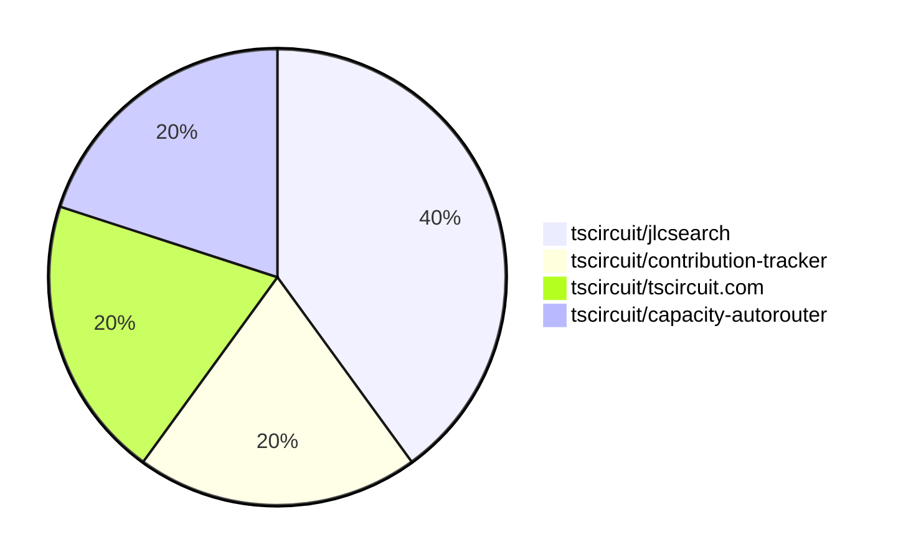

# Contribution Overview 2025-03-05

## PRs by Repository

## Contributor Overview

| Contributor | 🐳 Major | 🐙 Minor | 🐌 Tiny | ⭐ | Issues Created |
|-------------|---------|---------|---------|-----|----------------|
| [seveibar](#seveibar) | 1 | 0 | 0 | ⭐ | 8 |
| [ArnavK-09](#ArnavK-09) | 1 | 1 | 1 | ⭐ | 0 |
| [imrishabh18](#imrishabh18) | 1 | 0 | 0 | ⭐ | 2 |

## Review Table

[reviews-received-hover]: ## "Number of reviews received for PRs for this contributor"
[approvals-received-hover]: ## "Number of approvals received for PRs this contributor authored"
[rejections-received-hover]: ## "Number of rejections received for PRs this contributor authored"
[prs-opened-hover]: ## "Number of PRs opened by this contributor"
[issues-created-hover]: ## "Number of issues created by this contributor"
[bountied-issues-hover]: ## "Number of issues this contributor created with a bounty"
[bountied-issue-$-hover]: ## "Total bounty amount placed on issues authored by this contributor"

| Contributor | Reviews Received | Approvals Received | Rejections Received | Approvals | Rejections | PRs Opened | PRs Merged | Issues Created | Bountied Issues | Bountied Issue $ |
|---|---|---|---|---|---|---|---|---|---|---|
| [ShiboSoftwareDev](#ShiboSoftwareDev) | 0 | 0 | 0 | 0 | 0 | 1 | 0 | 0 | 0 | 0 |
| [MustafaMulla29](#MustafaMulla29) | 0 | 0 | 0 | 0 | 0 | 1 | 0 | 2 | 0 | 0 |
| [Ayushjhawar8](#Ayushjhawar8) | 2 | 1 | 0 | 0 | 0 | 1 | 0 | 1 | 0 | 0 |
| [seveibar](#seveibar) | 0 | 0 | 0 | 4 | 0 | 4 | 1 | 8 | 6 | 106 |
| [techmannih](#techmannih) | 0 | 0 | 0 | 0 | 0 | 1 | 0 | 1 | 1 | 5 |
| [ArnavK-09](#ArnavK-09) | 2 | 2 | 0 | 0 | 0 | 3 | 3 | 0 | 0 | 0 |
| [imrishabh18](#imrishabh18) | 1 | 1 | 0 | 0 | 1 | 2 | 1 | 2 | 1 | 5 |
| [kom-senapati](#kom-senapati) | 4 | 0 | 1 | 0 | 0 | 1 | 0 | 0 | 0 | 0 |
| [PatanSharuKhan](#PatanSharuKhan) | 0 | 0 | 0 | 0 | 0 | 1 | 0 | 0 | 0 | 0 |

## Changes by Repository

### [tscircuit/jlcsearch](https://github.com/tscircuit/jlcsearch)

| PR # | Impact | Contributor | Description |
|------|--------|-------------|-------------|
| [#36](https://github.com/tscircuit/jlcsearch/pull/36) | 🐳 Major | ArnavK-09 | Introduces a new API endpoint `/api/search` for searching components with support for full-text search, filtering by package, and limiting the number of results. |
| [#39](https://github.com/tscircuit/jlcsearch/pull/39) | 🐌 Tiny | ArnavK-09 | Removes a surplus log statement from a search API test. |

### [tscircuit/contribution-tracker](https://github.com/tscircuit/contribution-tracker)

| PR # | Impact | Contributor | Description |
|------|--------|-------------|-------------|
| [#97](https://github.com/tscircuit/contribution-tracker/pull/97) | 🐙 Minor | ArnavK-09 | Upload the Anthropic cache to GitHub Actions |

### [tscircuit/tscircuit.com](https://github.com/tscircuit/tscircuit.com)

| PR # | Impact | Contributor | Description |
|------|--------|-------------|-------------|
| [#714](https://github.com/tscircuit/tscircuit.com/pull/714) | 🐳 Major | imrishabh18 | Adds a new `/update` endpoint to the package fake API that allows updating existing packages, including privacy settings. |

### [tscircuit/capacity-autorouter](https://github.com/tscircuit/capacity-autorouter)

| PR # | Impact | Contributor | Description |
|------|--------|-------------|-------------|
| [#32](https://github.com/tscircuit/capacity-autorouter/pull/32) | 🐳 Major | seveibar | Fix major issues in Capacity Segment Optimization |

## Changes by Contributor

### [ArnavK-09](https://github.com/ArnavK-09)

| PR # | Impact | Description |
|------|--------|-------------|
| [#36](https://github.com/tscircuit/jlcsearch/pull/36) | 🐳 Major | Introduces a new API endpoint `/api/search` for searching components with support for full-text search, filtering by package, and limiting the number of results. |
| [#97](https://github.com/tscircuit/contribution-tracker/pull/97) | 🐙 Minor | Upload the Anthropic cache to GitHub Actions |
| [#39](https://github.com/tscircuit/jlcsearch/pull/39) | 🐌 Tiny | Removes a surplus log statement from a search API test. |

### [imrishabh18](https://github.com/imrishabh18)

| PR # | Impact | Description |
|------|--------|-------------|
| [#714](https://github.com/tscircuit/tscircuit.com/pull/714) | 🐳 Major | Adds a new `/update` endpoint to the package fake API that allows updating existing packages, including privacy settings. |

### [seveibar](https://github.com/seveibar)

| PR # | Impact | Description |
|------|--------|-------------|
| [#32](https://github.com/tscircuit/capacity-autorouter/pull/32) | 🐳 Major | Fix major issues in Capacity Segment Optimization |

