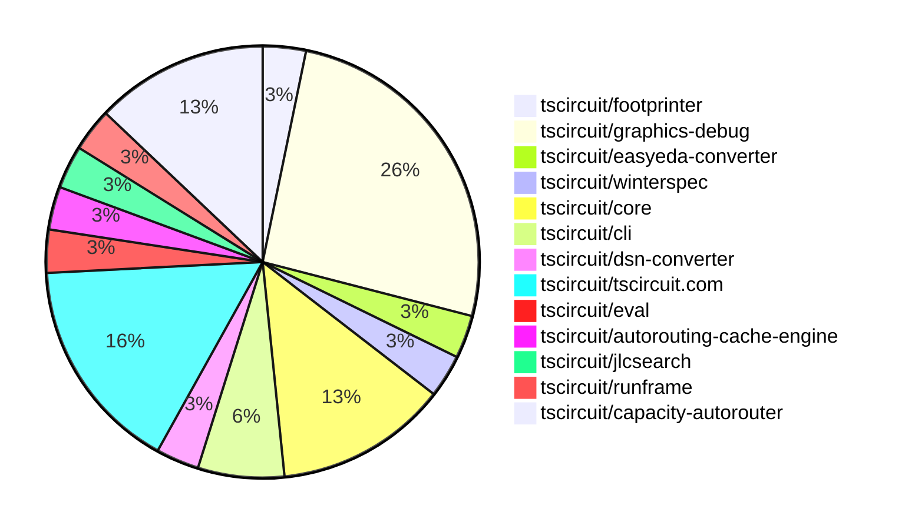

# Contribution Overview 2025-03-12

## PRs by Repository

## Contributor Overview

| Contributor | 🐳 Major | 🐙 Minor | 🐌 Tiny | ⭐ | Issues Created |
|-------------|---------|---------|---------|-----|----------------|
| [seveibar](#seveibar) | 4 | 4 | 1 | ⭐⭐⭐ | 28 |
| [imrishabh18](#imrishabh18) | 2 | 7 | 1 | ⭐⭐ | 7 |
| [Ayushjhawar8](#Ayushjhawar8) | 0 | 3 | 0 | ⭐ | 1 |
| [MustafaMulla29](#MustafaMulla29) | 0 | 2 | 0 | ⭐ | 1 |
| [Anshgrover23](#Anshgrover23) | 0 | 0 | 2 |  | 2 |
| [krushnarout](#krushnarout) | 0 | 0 | 1 |  | 0 |
| [ArnavK-09](#ArnavK-09) | 0 | 0 | 1 |  | 0 |

## Review Table

[reviews-received-hover]: ## "Number of reviews received for PRs for this contributor"
[approvals-received-hover]: ## "Number of approvals received for PRs this contributor authored"
[rejections-received-hover]: ## "Number of rejections received for PRs this contributor authored"
[prs-opened-hover]: ## "Number of PRs opened by this contributor"
[issues-created-hover]: ## "Number of issues created by this contributor"
[bountied-issues-hover]: ## "Number of issues this contributor created with a bounty"
[bountied-issue-$-hover]: ## "Total bounty amount placed on issues authored by this contributor"

| Contributor | Reviews Received | Approvals Received | Rejections Received | Approvals | Rejections | PRs Opened | PRs Merged | Issues Created | Bountied Issues | Bountied Issue $ |
|---|---|---|---|---|---|---|---|---|---|---|
| [ShiboSoftwareDev](#ShiboSoftwareDev) | 0 | 0 | 0 | 0 | 0 | 1 | 0 | 1 | 1 | 40 |
| [Anshgrover23](#Anshgrover23) | 1 | 1 | 0 | 0 | 1 | 3 | 2 | 2 | 0 | 0 |
| [MustafaMulla29](#MustafaMulla29) | 5 | 3 | 1 | 0 | 0 | 5 | 2 | 1 | 0 | 0 |
| [techmannih](#techmannih) | 0 | 0 | 0 | 1 | 1 | 0 | 0 | 0 | 0 | 0 |
| [seveibar](#seveibar) | 0 | 0 | 0 | 12 | 3 | 14 | 11 | 28 | 12 | 182 |
| [krushnarout](#krushnarout) | 3 | 1 | 2 | 0 | 0 | 2 | 1 | 0 | 0 | 0 |
| [ArnavK-09](#ArnavK-09) | 1 | 1 | 0 | 0 | 0 | 1 | 1 | 0 | 0 | 0 |
| [imrishabh18](#imrishabh18) | 5 | 4 | 0 | 0 | 0 | 11 | 11 | 7 | 4 | 34 |
| [Rishikesh63](#Rishikesh63) | 2 | 0 | 2 | 0 | 0 | 2 | 0 | 0 | 0 | 0 |
| [Ayushjhawar8](#Ayushjhawar8) | 5 | 3 | 0 | 0 | 0 | 4 | 3 | 1 | 0 | 0 |
| [joharkhan99](#joharkhan99) | 1 | 0 | 0 | 0 | 0 | 1 | 0 | 0 | 0 | 0 |
| [ricohageman](#ricohageman) | 5 | 0 | 0 | 0 | 0 | 3 | 0 | 0 | 0 | 0 |

## Changes by Repository

### [tscircuit/footprinter](https://github.com/tscircuit/footprinter)

| PR # | Impact | Contributor | Description |
|------|--------|-------------|-------------|
| [#237](https://github.com/tscircuit/footprinter/pull/237) | 🐙 Minor | MustafaMulla29 | Implement VSSOP-10-0.5mm footprint |

### [tscircuit/graphics-debug](https://github.com/tscircuit/graphics-debug)

| PR # | Impact | Contributor | Description |
|------|--------|-------------|-------------|
| [#46](https://github.com/tscircuit/graphics-debug/pull/46) | 🐳 Major | seveibar | Adds a new component `InteractiveGraphicsCanvas` which provides an interactive canvas with features like panning, zooming, and step-by-step visualization of graphics objects. |
| [#45](https://github.com/tscircuit/graphics-debug/pull/45) | 🐙 Minor | MustafaMulla29 | Added an `objectLimit` option to the `InteractiveGraphics` component to limit the number of objects displayed. |
| [#48](https://github.com/tscircuit/graphics-debug/pull/48) | 🐙 Minor | seveibar | Removes `useMemos` from `InteractiveGraphicsCanvas` to avoid call stack overflow |
| [#47](https://github.com/tscircuit/graphics-debug/pull/47) | 🐙 Minor | seveibar | Add stroke width scaling for graphics objects |
| [#37](https://github.com/tscircuit/graphics-debug/pull/37) | 🐙 Minor | seveibar | Adds a "stroke-width" attribute to the SVG elements in the rendered graphics, scaling the stroke width based on the matrix transformation. |
| [#39](https://github.com/tscircuit/graphics-debug/pull/39) | 🐙 Minor | seveibar | Fix type issues and add type checking in CI |
| [#40](https://github.com/tscircuit/graphics-debug/pull/40) | 🐌 Tiny | seveibar | Remove the `container.focus()` calls from the `DimensionOverlay` component. |
| [#38](https://github.com/tscircuit/graphics-debug/pull/38) | 🟣 | seveibar | Add support for zoomable stroke dash |

### [tscircuit/easyeda-converter](https://github.com/tscircuit/easyeda-converter)

| PR # | Impact | Contributor | Description |
|------|--------|-------------|-------------|
| [#169](https://github.com/tscircuit/easyeda-converter/pull/169) | 🐌 Tiny | krushnarout | Removes the "height" attribute from the "platedhole" element for "oval" or "pill" shaped plated holes. |

### [tscircuit/winterspec](https://github.com/tscircuit/winterspec)

| PR # | Impact | Contributor | Description |
|------|--------|-------------|-------------|
| [#33](https://github.com/tscircuit/winterspec/pull/33) | 🐌 Tiny | ArnavK-09 | Update the GitHub Actions used in the project to their latest versions. |

### [tscircuit/core](https://github.com/tscircuit/core)

| PR # | Impact | Contributor | Description |
|------|--------|-------------|-------------|
| [#703](https://github.com/tscircuit/core/pull/703) | 🐳 Major | imrishabh18 | Automatically sizes the board to fit the components, even when the components are inside a group. |
| [#689](https://github.com/tscircuit/core/pull/689) | 🐙 Minor | Ayushjhawar8 | Fix silkscreen component to follow parent layer |
| [#701](https://github.com/tscircuit/core/pull/701) | 🐌 Tiny | Anshgrover23 | Adds the import path to the snapshot file names in the tests. |
| [#700](https://github.com/tscircuit/core/pull/700) | 🐌 Tiny | Anshgrover23 | Move snapshot files to correct directory |

### [tscircuit/cli](https://github.com/tscircuit/cli)

| PR # | Impact | Contributor | Description |
|------|--------|-------------|-------------|
| [#106](https://github.com/tscircuit/cli/pull/106) | 🐳 Major | imrishabh18 | Refactor the export command to generate circuit JSON and convert it to the requested format. |
| [#104](https://github.com/tscircuit/cli/pull/104) | 🐙 Minor | imrishabh18 | Adds a --private flag to the push command to create private snippets. |

### [tscircuit/dsn-converter](https://github.com/tscircuit/dsn-converter)

| PR # | Impact | Contributor | Description |
|------|--------|-------------|-------------|
| [#104](https://github.com/tscircuit/dsn-converter/pull/104) | 🐙 Minor | imrishabh18 | Add support for the `circle` shape for SMT pads and refactor the `processedComponents` file. |

### [tscircuit/tscircuit.com](https://github.com/tscircuit/tscircuit.com)

| PR # | Impact | Contributor | Description |
|------|--------|-------------|-------------|
| [#731](https://github.com/tscircuit/tscircuit.com/pull/731) | 🐙 Minor | imrishabh18 | Removes the fixed board dimensions for the module. |
| [#730](https://github.com/tscircuit/tscircuit.com/pull/730) | 🐙 Minor | imrishabh18 | Add a lock icon on the profile page to indicate if a snippet is private. |
| [#728](https://github.com/tscircuit/tscircuit.com/pull/728) | 🐙 Minor | imrishabh18 | Adds a dialog to choose package visibility (public or private) when creating a new snippet. |
| [#727](https://github.com/tscircuit/tscircuit.com/pull/727) | 🐙 Minor | imrishabh18 | Add the lock icon for private snippet |
| [#726](https://github.com/tscircuit/tscircuit.com/pull/726) | 🐙 Minor | imrishabh18 | Adds support for creating private packages in the fake-snippets-api |

### [tscircuit/eval](https://github.com/tscircuit/eval)

| PR # | Impact | Contributor | Description |
|------|--------|-------------|-------------|
| [#140](https://github.com/tscircuit/eval/pull/140) | 🐌 Tiny | imrishabh18 | Updates the lock file for the core component |

### [tscircuit/autorouting-cache-engine](https://github.com/tscircuit/autorouting-cache-engine)

| PR # | Impact | Contributor | Description |
|------|--------|-------------|-------------|
| [#7](https://github.com/tscircuit/autorouting-cache-engine/pull/7) | 🟣 | imrishabh18 | Add thickness as a property to normalize |

### [tscircuit/jlcsearch](https://github.com/tscircuit/jlcsearch)

| PR # | Impact | Contributor | Description |
|------|--------|-------------|-------------|
| [#41](https://github.com/tscircuit/jlcsearch/pull/41) | 🐙 Minor | Ayushjhawar8 | Add a title tag to the HTML response. |

### [tscircuit/runframe](https://github.com/tscircuit/runframe)

| PR # | Impact | Contributor | Description |
|------|--------|-------------|-------------|
| [#329](https://github.com/tscircuit/runframe/pull/329) | 🐙 Minor | Ayushjhawar8 | Add ctrl/cmd+enter shortcut to run the circuit |

### [tscircuit/capacity-autorouter](https://github.com/tscircuit/capacity-autorouter)

| PR # | Impact | Contributor | Description |
|------|--------|-------------|-------------|
| [#55](https://github.com/tscircuit/capacity-autorouter/pull/55) | 🐳 Major | seveibar | The pull request switches the renderer to canvas, which results in a 10x speedup for the unravel multisection solver. |
| [#45](https://github.com/tscircuit/capacity-autorouter/pull/45) | 🐳 Major | seveibar | The pull request allows straws to be connected if they are from different parents, and requires higher capacity when z availability differs between connected nodes. |
| [#42](https://github.com/tscircuit/capacity-autorouter/pull/42) | 🐳 Major | seveibar | Adds a simplified path solver JSON file with a source trace route. |
| [#52](https://github.com/tscircuit/capacity-autorouter/pull/52) | 🟣 | seveibar | Massive Optimizations Pt1: Optimizations for every stage, mostly 2d-hash bucket stuff and undumbing maps |

## Changes by Contributor

### [MustafaMulla29](https://github.com/MustafaMulla29)

| PR # | Impact | Description |
|------|--------|-------------|
| [#237](https://github.com/tscircuit/footprinter/pull/237) | 🐙 Minor | Implement VSSOP-10-0.5mm footprint |
| [#45](https://github.com/tscircuit/graphics-debug/pull/45) | 🐙 Minor | Added an `objectLimit` option to the `InteractiveGraphics` component to limit the number of objects displayed. |

### [krushnarout](https://github.com/krushnarout)

| PR # | Impact | Description |
|------|--------|-------------|
| [#169](https://github.com/tscircuit/easyeda-converter/pull/169) | 🐌 Tiny | Removes the "height" attribute from the "platedhole" element for "oval" or "pill" shaped plated holes. |

### [ArnavK-09](https://github.com/ArnavK-09)

| PR # | Impact | Description |
|------|--------|-------------|
| [#33](https://github.com/tscircuit/winterspec/pull/33) | 🐌 Tiny | Update the GitHub Actions used in the project to their latest versions. |

### [imrishabh18](https://github.com/imrishabh18)

| PR # | Impact | Description |
|------|--------|-------------|
| [#703](https://github.com/tscircuit/core/pull/703) | 🐳 Major | Automatically sizes the board to fit the components, even when the components are inside a group. |
| [#106](https://github.com/tscircuit/cli/pull/106) | 🐳 Major | Refactor the export command to generate circuit JSON and convert it to the requested format. |
| [#104](https://github.com/tscircuit/dsn-converter/pull/104) | 🐙 Minor | Add support for the `circle` shape for SMT pads and refactor the `processedComponents` file. |
| [#731](https://github.com/tscircuit/tscircuit.com/pull/731) | 🐙 Minor | Removes the fixed board dimensions for the module. |
| [#730](https://github.com/tscircuit/tscircuit.com/pull/730) | 🐙 Minor | Add a lock icon on the profile page to indicate if a snippet is private. |
| [#728](https://github.com/tscircuit/tscircuit.com/pull/728) | 🐙 Minor | Adds a dialog to choose package visibility (public or private) when creating a new snippet. |
| [#727](https://github.com/tscircuit/tscircuit.com/pull/727) | 🐙 Minor | Add the lock icon for private snippet |
| [#726](https://github.com/tscircuit/tscircuit.com/pull/726) | 🐙 Minor | Adds support for creating private packages in the fake-snippets-api |
| [#104](https://github.com/tscircuit/cli/pull/104) | 🐙 Minor | Adds a --private flag to the push command to create private snippets. |
| [#140](https://github.com/tscircuit/eval/pull/140) | 🐌 Tiny | Updates the lock file for the core component |
| [#7](https://github.com/tscircuit/autorouting-cache-engine/pull/7) | 🟣 | Add thickness as a property to normalize |

### [Ayushjhawar8](https://github.com/Ayushjhawar8)

| PR # | Impact | Description |
|------|--------|-------------|
| [#689](https://github.com/tscircuit/core/pull/689) | 🐙 Minor | Fix silkscreen component to follow parent layer |
| [#41](https://github.com/tscircuit/jlcsearch/pull/41) | 🐙 Minor | Add a title tag to the HTML response. |
| [#329](https://github.com/tscircuit/runframe/pull/329) | 🐙 Minor | Add ctrl/cmd+enter shortcut to run the circuit |

### [Anshgrover23](https://github.com/Anshgrover23)

| PR # | Impact | Description |
|------|--------|-------------|
| [#701](https://github.com/tscircuit/core/pull/701) | 🐌 Tiny | Adds the import path to the snapshot file names in the tests. |
| [#700](https://github.com/tscircuit/core/pull/700) | 🐌 Tiny | Move snapshot files to correct directory |

### [seveibar](https://github.com/seveibar)

| PR # | Impact | Description |
|------|--------|-------------|
| [#46](https://github.com/tscircuit/graphics-debug/pull/46) | 🐳 Major | Adds a new component `InteractiveGraphicsCanvas` which provides an interactive canvas with features like panning, zooming, and step-by-step visualization of graphics objects. |
| [#55](https://github.com/tscircuit/capacity-autorouter/pull/55) | 🐳 Major | The pull request switches the renderer to canvas, which results in a 10x speedup for the unravel multisection solver. |
| [#45](https://github.com/tscircuit/capacity-autorouter/pull/45) | 🐳 Major | The pull request allows straws to be connected if they are from different parents, and requires higher capacity when z availability differs between connected nodes. |
| [#42](https://github.com/tscircuit/capacity-autorouter/pull/42) | 🐳 Major | Adds a simplified path solver JSON file with a source trace route. |
| [#48](https://github.com/tscircuit/graphics-debug/pull/48) | 🐙 Minor | Removes `useMemos` from `InteractiveGraphicsCanvas` to avoid call stack overflow |
| [#47](https://github.com/tscircuit/graphics-debug/pull/47) | 🐙 Minor | Add stroke width scaling for graphics objects |
| [#37](https://github.com/tscircuit/graphics-debug/pull/37) | 🐙 Minor | Adds a "stroke-width" attribute to the SVG elements in the rendered graphics, scaling the stroke width based on the matrix transformation. |
| [#39](https://github.com/tscircuit/graphics-debug/pull/39) | 🐙 Minor | Fix type issues and add type checking in CI |
| [#40](https://github.com/tscircuit/graphics-debug/pull/40) | 🐌 Tiny | Remove the `container.focus()` calls from the `DimensionOverlay` component. |
| [#38](https://github.com/tscircuit/graphics-debug/pull/38) | 🟣 | Add support for zoomable stroke dash |
| [#52](https://github.com/tscircuit/capacity-autorouter/pull/52) | 🟣 | Massive Optimizations Pt1: Optimizations for every stage, mostly 2d-hash bucket stuff and undumbing maps |

