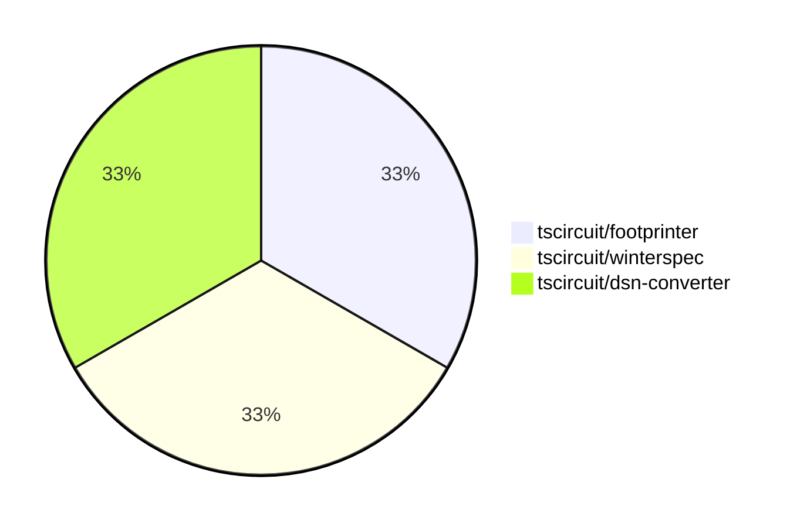

# Contribution Overview 2025-03-12

## PRs by Repository

## Contributor Overview

| Contributor | 🐳 Major | 🐙 Minor | 🐌 Tiny | ⭐ | Issues Created |
|-------------|---------|---------|---------|-----|----------------|
| [MustafaMulla29](#MustafaMulla29) | 0 | 1 | 0 |  | 0 |
| [imrishabh18](#imrishabh18) | 0 | 1 | 0 |  | 0 |
| [ArnavK-09](#ArnavK-09) | 0 | 0 | 1 |  | 0 |

## Review Table

[reviews-received-hover]: ## "Number of reviews received for PRs for this contributor"
[approvals-received-hover]: ## "Number of approvals received for PRs this contributor authored"
[rejections-received-hover]: ## "Number of rejections received for PRs this contributor authored"
[prs-opened-hover]: ## "Number of PRs opened by this contributor"
[issues-created-hover]: ## "Number of issues created by this contributor"
[bountied-issues-hover]: ## "Number of issues this contributor created with a bounty"
[bountied-issue-$-hover]: ## "Total bounty amount placed on issues authored by this contributor"

| Contributor | Reviews Received | Approvals Received | Rejections Received | Approvals | Rejections | PRs Opened | PRs Merged | Issues Created | Bountied Issues | Bountied Issue $ |
|---|---|---|---|---|---|---|---|---|---|---|
| [MustafaMulla29](#MustafaMulla29) | 3 | 2 | 0 | 0 | 0 | 1 | 1 | 0 | 0 | 0 |
| [seveibar](#seveibar) | 0 | 0 | 0 | 2 | 0 | 0 | 0 | 0 | 0 | 0 |
| [techmannih](#techmannih) | 0 | 0 | 0 | 1 | 0 | 0 | 0 | 0 | 0 | 0 |
| [ArnavK-09](#ArnavK-09) | 1 | 1 | 0 | 0 | 0 | 1 | 1 | 0 | 0 | 0 |
| [imrishabh18](#imrishabh18) | 0 | 0 | 0 | 0 | 0 | 3 | 1 | 0 | 0 | 0 |

## Changes by Repository

### [tscircuit/footprinter](https://github.com/tscircuit/footprinter)

| PR # | Impact | Contributor | Description |
|------|--------|-------------|-------------|
| [#237](https://github.com/tscircuit/footprinter/pull/237) | 🐙 Minor | MustafaMulla29 | Implement VSSOP-10-0.5mm footprint |

### [tscircuit/winterspec](https://github.com/tscircuit/winterspec)

| PR # | Impact | Contributor | Description |
|------|--------|-------------|-------------|
| [#33](https://github.com/tscircuit/winterspec/pull/33) | 🐌 Tiny | ArnavK-09 | Update the GitHub Actions used in the project to their latest versions. |

### [tscircuit/dsn-converter](https://github.com/tscircuit/dsn-converter)

| PR # | Impact | Contributor | Description |
|------|--------|-------------|-------------|
| [#104](https://github.com/tscircuit/dsn-converter/pull/104) | 🐙 Minor | imrishabh18 | Add support for the `circle` shape for SMT pads and refactor the `processedComponents` file. |

## Changes by Contributor

### [MustafaMulla29](https://github.com/MustafaMulla29)

| PR # | Impact | Description |
|------|--------|-------------|
| [#237](https://github.com/tscircuit/footprinter/pull/237) | 🐙 Minor | Implement VSSOP-10-0.5mm footprint |

### [ArnavK-09](https://github.com/ArnavK-09)

| PR # | Impact | Description |
|------|--------|-------------|
| [#33](https://github.com/tscircuit/winterspec/pull/33) | 🐌 Tiny | Update the GitHub Actions used in the project to their latest versions. |

### [imrishabh18](https://github.com/imrishabh18)

| PR # | Impact | Description |
|------|--------|-------------|
| [#104](https://github.com/tscircuit/dsn-converter/pull/104) | 🐙 Minor | Add support for the `circle` shape for SMT pads and refactor the `processedComponents` file. |

