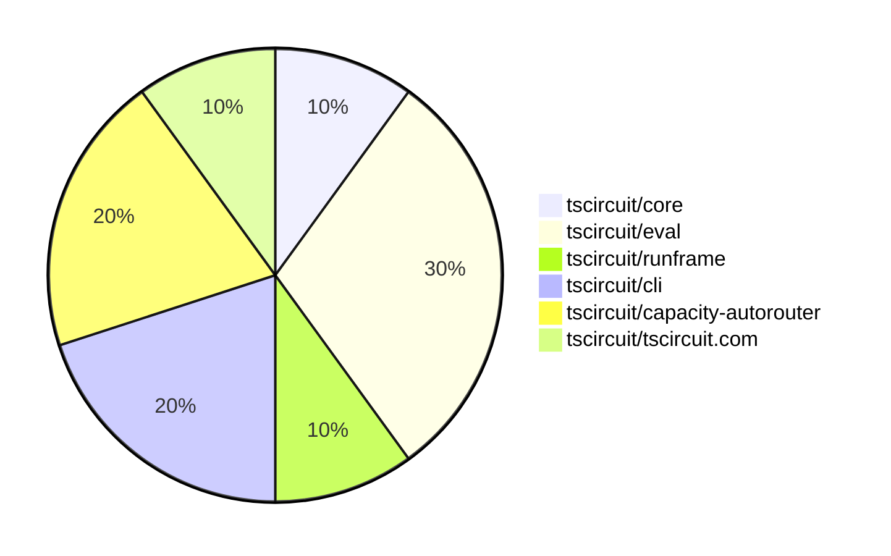

# Contribution Overview 2025-03-19

## PRs by Repository

## Contributor Overview

| Contributor | 🐳 Major | 🐙 Minor | 🐌 Tiny | ⭐ | Issues Created |
|-------------|---------|---------|---------|-----|----------------|
| [seveibar](#seveibar) | 0 | 6 | 0 | ⭐⭐ | 4 |
| [kom-senapati](#kom-senapati) | 0 | 1 | 0 |  | 0 |
| [imrishabh18](#imrishabh18) | 0 | 0 | 1 |  | 0 |
| [tscircuitbot](#tscircuitbot) | 0 | 0 | 1 |  | 0 |

## Review Table

[reviews-received-hover]: ## "Number of reviews received for PRs for this contributor"
[approvals-received-hover]: ## "Number of approvals received for PRs this contributor authored"
[rejections-received-hover]: ## "Number of rejections received for PRs this contributor authored"
[prs-opened-hover]: ## "Number of PRs opened by this contributor"
[issues-created-hover]: ## "Number of issues created by this contributor"
[bountied-issues-hover]: ## "Number of issues this contributor created with a bounty"
[bountied-issue-$-hover]: ## "Total bounty amount placed on issues authored by this contributor"

| Contributor | Reviews Received | Approvals Received | Rejections Received | Approvals | Rejections | PRs Opened | PRs Merged | Issues Created | Bountied Issues | Bountied Issue $ |
|---|---|---|---|---|---|---|---|---|---|---|
| [seveibar](#seveibar) | 1 | 1 | 0 | 2 | 0 | 7 | 7 | 4 | 3 | 33 |
| [kom-senapati](#kom-senapati) | 3 | 2 | 0 | 0 | 0 | 1 | 1 | 0 | 0 | 0 |
| [imrishabh18](#imrishabh18) | 1 | 1 | 0 | 1 | 0 | 1 | 1 | 0 | 0 | 0 |
| [krushnarout](#krushnarout) | 1 | 0 | 0 | 0 | 0 | 2 | 0 | 0 | 0 | 0 |
| [tscircuitbot](#tscircuitbot) | 0 | 0 | 0 | 0 | 0 | 2 | 1 | 0 | 0 | 0 |
| [MustafaMulla29](#MustafaMulla29) | 0 | 0 | 0 | 0 | 0 | 1 | 0 | 0 | 0 | 0 |
| [ArnavK-09](#ArnavK-09) | 0 | 0 | 0 | 1 | 0 | 0 | 0 | 0 | 0 | 0 |

## Changes by Repository

### [tscircuit/core](https://github.com/tscircuit/core)

| PR # | Impact | Contributor | Description |
|------|--------|-------------|-------------|
| [#705](https://github.com/tscircuit/core/pull/705) | 🐙 Minor | seveibar | Update the capacity autorouter to version 0.0.34 |

### [tscircuit/eval](https://github.com/tscircuit/eval)

| PR # | Impact | Contributor | Description |
|------|--------|-------------|-------------|
| [#146](https://github.com/tscircuit/eval/pull/146) | 🟣 | seveibar | Add an auto-merge workflow for pull requests updating the `@tscircuit/core` package. |
| [#148](https://github.com/tscircuit/eval/pull/148) | 🐌 Tiny | imrishabh18 | Update config to not generate lockfile |
| [#144](https://github.com/tscircuit/eval/pull/144) | 🐌 Tiny | tscircuitbot | Update @tscircuit/core to v0.0.353 |

### [tscircuit/runframe](https://github.com/tscircuit/runframe)

| PR # | Impact | Contributor | Description |
|------|--------|-------------|-------------|
| [#339](https://github.com/tscircuit/runframe/pull/339) | 🐙 Minor | seveibar | RunFrame will now force the latest @tscircuit/eval version in the CLI by default |

### [tscircuit/cli](https://github.com/tscircuit/cli)

| PR # | Impact | Contributor | Description |
|------|--------|-------------|-------------|
| [#110](https://github.com/tscircuit/cli/pull/110) | 🐙 Minor | seveibar | Update the `@tscircuit/runframe` dependency to version `0.0.254` to get the "force latest eval" feature. |
| [#108](https://github.com/tscircuit/cli/pull/108) | 🐙 Minor | seveibar | Update tscircuit/core and tscircuit/eval dependencies to latest versions |

### [tscircuit/capacity-autorouter](https://github.com/tscircuit/capacity-autorouter)

| PR # | Impact | Contributor | Description |
|------|--------|-------------|-------------|
| [#60](https://github.com/tscircuit/capacity-autorouter/pull/60) | 🐙 Minor | seveibar | The pull request allows connecting connections with no hd routes due to adjacent nodes. |
| [#59](https://github.com/tscircuit/capacity-autorouter/pull/59) | 🐙 Minor | seveibar | Adds a new JSON file with data for a capacityMeshNode and a nodeWithPortPoints. |

### [tscircuit/tscircuit.com](https://github.com/tscircuit/tscircuit.com)

| PR # | Impact | Contributor | Description |
|------|--------|-------------|-------------|
| [#716](https://github.com/tscircuit/tscircuit.com/pull/716) | 🐙 Minor | kom-senapati | Add a new "Starred Snippets" tab to the user profile page. |

## Changes by Contributor

### [seveibar](https://github.com/seveibar)

| PR # | Impact | Description |
|------|--------|-------------|
| [#705](https://github.com/tscircuit/core/pull/705) | 🐙 Minor | Update the capacity autorouter to version 0.0.34 |
| [#146](https://github.com/tscircuit/eval/pull/146) | 🟣 | Add an auto-merge workflow for pull requests updating the `@tscircuit/core` package. |
| [#339](https://github.com/tscircuit/runframe/pull/339) | 🐙 Minor | RunFrame will now force the latest @tscircuit/eval version in the CLI by default |
| [#110](https://github.com/tscircuit/cli/pull/110) | 🐙 Minor | Update the `@tscircuit/runframe` dependency to version `0.0.254` to get the "force latest eval" feature. |
| [#108](https://github.com/tscircuit/cli/pull/108) | 🐙 Minor | Update tscircuit/core and tscircuit/eval dependencies to latest versions |
| [#60](https://github.com/tscircuit/capacity-autorouter/pull/60) | 🐙 Minor | The pull request allows connecting connections with no hd routes due to adjacent nodes. |
| [#59](https://github.com/tscircuit/capacity-autorouter/pull/59) | 🐙 Minor | Adds a new JSON file with data for a capacityMeshNode and a nodeWithPortPoints. |

### [kom-senapati](https://github.com/kom-senapati)

| PR # | Impact | Description |
|------|--------|-------------|
| [#716](https://github.com/tscircuit/tscircuit.com/pull/716) | 🐙 Minor | Add a new "Starred Snippets" tab to the user profile page. |

### [imrishabh18](https://github.com/imrishabh18)

| PR # | Impact | Description |
|------|--------|-------------|
| [#148](https://github.com/tscircuit/eval/pull/148) | 🐌 Tiny | Update config to not generate lockfile |

### [tscircuitbot](https://github.com/tscircuitbot)

| PR # | Impact | Description |
|------|--------|-------------|
| [#144](https://github.com/tscircuit/eval/pull/144) | 🐌 Tiny | Update @tscircuit/core to v0.0.353 |

