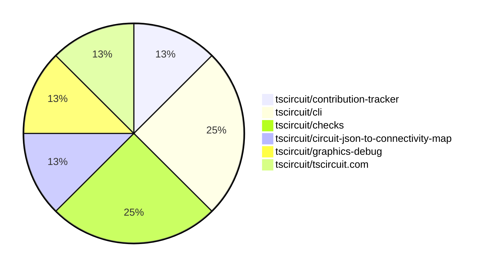

# Contribution Overview 2025-03-26

## PRs by Repository

## Contributor Overview

| Contributor | 🐳 Major | 🐙 Minor | 🐌 Tiny | ⭐ | Issues Created |
|-------------|---------|---------|---------|-----|----------------|
| [seveibar](#seveibar) | 1 | 3 | 0 | ⭐⭐ | 3 |
| [ArnavK-09](#ArnavK-09) | 0 | 2 | 1 | ⭐ | 1 |
| [MustafaMulla29](#MustafaMulla29) | 0 | 1 | 0 |  | 0 |

## Review Table

[reviews-received-hover]: ## "Number of reviews received for PRs for this contributor"
[approvals-received-hover]: ## "Number of approvals received for PRs this contributor authored"
[rejections-received-hover]: ## "Number of rejections received for PRs this contributor authored"
[prs-opened-hover]: ## "Number of PRs opened by this contributor"
[issues-created-hover]: ## "Number of issues created by this contributor"
[bountied-issues-hover]: ## "Number of issues this contributor created with a bounty"
[bountied-issue-$-hover]: ## "Total bounty amount placed on issues authored by this contributor"

| Contributor | Reviews Received | Approvals Received | Rejections Received | Approvals | Rejections | PRs Opened | PRs Merged | Issues Created | Bountied Issues | Bountied Issue $ |
|---|---|---|---|---|---|---|---|---|---|---|
| [ArnavK-09](#ArnavK-09) | 4 | 4 | 0 | 0 | 0 | 3 | 3 | 1 | 1 | 10 |
| [seveibar](#seveibar) | 0 | 0 | 0 | 4 | 0 | 5 | 4 | 3 | 3 | 41 |
| [MustafaMulla29](#MustafaMulla29) | 1 | 1 | 0 | 0 | 0 | 2 | 1 | 0 | 0 | 0 |
| [onyedikachi-david](#onyedikachi-david) | 0 | 0 | 0 | 0 | 0 | 1 | 0 | 0 | 0 | 0 |
| [Anshgrover23](#Anshgrover23) | 0 | 0 | 0 | 1 | 0 | 0 | 0 | 0 | 0 | 0 |

## Changes by Repository

### [tscircuit/contribution-tracker](https://github.com/tscircuit/contribution-tracker)

| PR # | Impact | Contributor | Description | Milestone Aligned |
|------|--------|-------------|-------------|-------------------|
| [#105](https://github.com/tscircuit/contribution-tracker/pull/105) | 🐙 Minor | ArnavK-09 | Downgrade the file-system-cache dependency to a stable version 2.3.0 | ✅ |

### [tscircuit/cli](https://github.com/tscircuit/cli)

| PR # | Impact | Contributor | Description | Milestone Aligned |
|------|--------|-------------|-------------|-------------------|
| [#135](https://github.com/tscircuit/cli/pull/135) | 🐙 Minor | ArnavK-09 |  | ✅ |
| [#132](https://github.com/tscircuit/cli/pull/132) | 🐌 Tiny | ArnavK-09 | The onSuccess callback now destructures the outputDestination parameter for clarity and consistency with the codebase's style. | ✅ |

### [tscircuit/checks](https://github.com/tscircuit/checks)

| PR # | Impact | Contributor | Description | Milestone Aligned |
|------|--------|-------------|-------------|-------------------|
| [#21](https://github.com/tscircuit/checks/pull/21) | 🐳 Major | seveibar | The pull request incorporates layer information and improves the pcb_via test in the DRC (Design Rule Check) check. | ✅ |
| [#22](https://github.com/tscircuit/checks/pull/22) | 🐙 Minor | seveibar | Improves the overlapping trace message and error.center | ✅ |

### [tscircuit/circuit-json-to-connectivity-map](https://github.com/tscircuit/circuit-json-to-connectivity-map)

| PR # | Impact | Contributor | Description | Milestone Aligned |
|------|--------|-------------|-------------|-------------------|
| [#9](https://github.com/tscircuit/circuit-json-to-connectivity-map/pull/9) | 🐙 Minor | seveibar | Adds support for PCB vias when computing full connectivity net | ✅ |

### [tscircuit/graphics-debug](https://github.com/tscircuit/graphics-debug)

| PR # | Impact | Contributor | Description | Milestone Aligned |
|------|--------|-------------|-------------|-------------------|
| [#51](https://github.com/tscircuit/graphics-debug/pull/51) | 🐙 Minor | seveibar | Adds a "Show last step" checkbox to the InteractiveGraphics component. | ✅ |

### [tscircuit/tscircuit.com](https://github.com/tscircuit/tscircuit.com)

| PR # | Impact | Contributor | Description | Milestone Aligned |
|------|--------|-------------|-------------|-------------------|
| [#757](https://github.com/tscircuit/tscircuit.com/pull/757) | 🐙 Minor | MustafaMulla29 | Changed "Snippets" to "Packages" and used the correct "javascript-time-ago" package instead of "timeago.js". | ❌ |

## Changes by Contributor

### [ArnavK-09](https://github.com/ArnavK-09)

| PR # | Impact | Description | Milestone Aligned |
|------|--------|-------------|-------------------|
| [#105](https://github.com/tscircuit/contribution-tracker/pull/105) | 🐙 Minor | Downgrade the file-system-cache dependency to a stable version 2.3.0 | ✅ |
| [#135](https://github.com/tscircuit/cli/pull/135) | 🐙 Minor |  | ✅ |
| [#132](https://github.com/tscircuit/cli/pull/132) | 🐌 Tiny | The onSuccess callback now destructures the outputDestination parameter for clarity and consistency with the codebase's style. | ✅ |

### [seveibar](https://github.com/seveibar)

| PR # | Impact | Description | Milestone Aligned |
|------|--------|-------------|-------------------|
| [#21](https://github.com/tscircuit/checks/pull/21) | 🐳 Major | The pull request incorporates layer information and improves the pcb_via test in the DRC (Design Rule Check) check. | ✅ |
| [#22](https://github.com/tscircuit/checks/pull/22) | 🐙 Minor | Improves the overlapping trace message and error.center | ✅ |
| [#9](https://github.com/tscircuit/circuit-json-to-connectivity-map/pull/9) | 🐙 Minor | Adds support for PCB vias when computing full connectivity net | ✅ |
| [#51](https://github.com/tscircuit/graphics-debug/pull/51) | 🐙 Minor | Adds a "Show last step" checkbox to the InteractiveGraphics component. | ✅ |

### [MustafaMulla29](https://github.com/MustafaMulla29)

| PR # | Impact | Description | Milestone Aligned |
|------|--------|-------------|-------------------|
| [#757](https://github.com/tscircuit/tscircuit.com/pull/757) | 🐙 Minor | Changed "Snippets" to "Packages" and used the correct "javascript-time-ago" package instead of "timeago.js". | ❌ |

