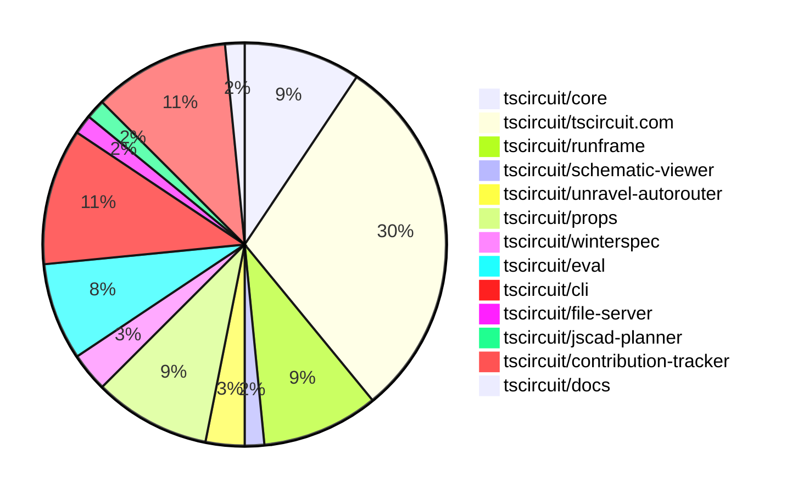

# Contribution Overview 2025-04-09

## PRs by Repository

## Contributor Overview

| Contributor | 🐳 Major | 🐙 Minor | 🐌 Tiny | ⭐ | Issues Created | Discussion Contributions |
|-------------|---------|---------|---------|-----|----------------|--------------------------|
| [seveibar](#seveibar) | 2 | 17 | 3 | 👑 | 18 | 0🔹 0🔶 0💎 |
| [imrishabh18](#imrishabh18) | 4 | 6 | 0 | ⭐⭐⭐ | 9 | 0🔹 1🔶 0💎 |
| [ArnavK-09](#ArnavK-09) | 5 | 8 | 3 | ⭐⭐⭐ | 6 | 1🔹 0🔶 0💎 |
| [andrii-balitskyi](#andrii-balitskyi) | 0 | 3 | 0 | ⭐ | 1 | 0🔹 0🔶 0💎 |
| [Anshgrover23](#Anshgrover23) | 0 | 1 | 0 | ⭐ | 3 | 0🔹 0🔶 0💎 |
| [Ayushjhawar8](#Ayushjhawar8) | 1 | 1 | 0 | ⭐ | 1 | 0🔹 0🔶 0💎 |
| [divanshu-go](#divanshu-go) | 0 | 2 | 0 | ⭐ | 3 | 0🔹 0🔶 0💎 |
| [MustafaMulla29](#MustafaMulla29) | 0 | 1 | 1 | ⭐ | 0 | 0🔹 0🔶 0💎 |
| [oldbear26](#oldbear26) | 0 | 1 | 0 |  | 0 | 0🔹 0🔶 0💎 |
| [dekkku](#dekkku) | 0 | 1 | 0 |  | 0 | 0🔹 0🔶 0💎 |
| [techmannih](#techmannih) | 0 | 1 | 0 |  | 0 | 0🔹 0🔶 0💎 |
| [tscircuitbot](#tscircuitbot) | 0 | 0 | 2 |  | 0 | 0🔹 0🔶 0💎 |

### Discussion Contribution Legend

- 🔹 Participating: Basic participation with minimal effort
- 🔶 Very Active: Thoughtful participation that adds value
- 💎 Extremely Active: Exceptional participation with high-quality content

## Review Table

[reviews-received-hover]: ## "Number of reviews received for PRs for this contributor"
[approvals-received-hover]: ## "Number of approvals received for PRs this contributor authored"
[rejections-received-hover]: ## "Number of rejections received for PRs this contributor authored"
[prs-opened-hover]: ## "Number of PRs opened by this contributor"
[issues-created-hover]: ## "Number of issues created by this contributor"
[bountied-issues-hover]: ## "Number of issues this contributor created with a bounty"
[bountied-issue-$-hover]: ## "Total bounty amount placed on issues authored by this contributor"

| Contributor | Reviews Received | Approvals Received | Rejections Received | Approvals | Rejections | PRs Opened | PRs Merged | Issues Created | Bountied Issues | Bountied Issue $ |
|---|---|---|---|---|---|---|---|---|---|---|
| [imrishabh18](#imrishabh18) | 17 | 6 | 1 | 5 | 6 | 13 | 10 | 9 | 7 | 45 |
| [seveibar](#seveibar) | 0 | 0 | 0 | 30 | 6 | 24 | 23 | 18 | 11 | 342 |
| [andrii-balitskyi](#andrii-balitskyi) | 3 | 3 | 0 | 0 | 0 | 4 | 3 | 1 | 0 | 0 |
| [techmannih](#techmannih) | 4 | 1 | 2 | 0 | 0 | 5 | 1 | 0 | 0 | 0 |
| [oldbear26](#oldbear26) | 1 | 1 | 0 | 0 | 0 | 1 | 1 | 0 | 0 | 0 |
| [Slaviiiii](#Slaviiiii) | 3 | 0 | 1 | 0 | 0 | 1 | 0 | 0 | 0 | 0 |
| [Anshgrover23](#Anshgrover23) | 4 | 1 | 2 | 0 | 1 | 2 | 1 | 3 | 1 | 20 |
| [ArnavK-09](#ArnavK-09) | 23 | 15 | 1 | 1 | 0 | 18 | 16 | 6 | 0 | 0 |
| [Ayushjhawar8](#Ayushjhawar8) | 3 | 3 | 0 | 0 | 0 | 2 | 2 | 1 | 0 | 0 |
| [MustafaMulla29](#MustafaMulla29) | 2 | 2 | 0 | 0 | 1 | 2 | 2 | 0 | 0 | 0 |
| [onyedikachi-david](#onyedikachi-david) | 1 | 0 | 1 | 0 | 0 | 1 | 0 | 0 | 0 | 0 |
| [Ayush9026](#Ayush9026) | 3 | 0 | 2 | 0 | 0 | 2 | 0 | 0 | 0 | 0 |
| [dekkku](#dekkku) | 2 | 1 | 1 | 0 | 0 | 2 | 1 | 0 | 0 | 0 |
| [Ani-4x](#Ani-4x) | 0 | 0 | 0 | 0 | 0 | 1 | 0 | 0 | 0 | 0 |
| [tscircuitbot](#tscircuitbot) | 0 | 0 | 0 | 0 | 0 | 12 | 2 | 0 | 0 | 0 |
| [divanshu-go](#divanshu-go) | 9 | 3 | 3 | 0 | 0 | 5 | 2 | 3 | 0 | 0 |

## Changes by Repository

### [tscircuit/core](https://github.com/tscircuit/core)

| PR # | Impact | Contributor | Description | Milestone Aligned |
|------|--------|-------------|-------------|-------------------|
| [#728](https://github.com/tscircuit/core/pull/728) | 🐳 Major | imrishabh18 | Abstracts the PCB and schematic manual edits method to handle both schematic and PCB edit events separately. | ✅ |
| [#726](https://github.com/tscircuit/core/pull/726) | 🐳 Major | imrishabh18 | Adds a method `applySchematicEditEventsToManualEditsFile` that updates the `schematic_placements` field in the `manual_edits_file` based on the `edit_schematic_component_location` edit events. | ✅ |
| [#731](https://github.com/tscircuit/core/pull/731) | 🐳 Major | seveibar | Adds support for modules/components defined with `connections` and `selectors` to `sel`, and improves `ChipProps` handling. | ✅ |
| [#735](https://github.com/tscircuit/core/pull/735) | 🐙 Minor | seveibar | Perform DRC checks after async autorouting | ✅ |
| [#733](https://github.com/tscircuit/core/pull/733) | 🐙 Minor | seveibar | Fix resistor/capacitor connections prop | ✅ |
| [#727](https://github.com/tscircuit/core/pull/727) | 🐙 Minor | andrii-balitskyi | Update the dependency "@tscircuit/props" to version 0.0.167 | ✅ |

### [tscircuit/tscircuit.com](https://github.com/tscircuit/tscircuit.com)

| PR # | Impact | Contributor | Description | Milestone Aligned |
|------|--------|-------------|-------------|-------------------|
| [#829](https://github.com/tscircuit/tscircuit.com/pull/829) | 🐳 Major | imrishabh18 | Adds a new `/packages/fork` endpoint to the API, allowing users to fork existing packages. | ❌ |
| [#831](https://github.com/tscircuit/tscircuit.com/pull/831) | 🐳 Major | ArnavK-09 | Introduce new functionality to create, update, and delete package files. | ✅ |
| [#814](https://github.com/tscircuit/tscircuit.com/pull/814) | 🐳 Major | ArnavK-09 | Add a new trending page to display popular snippets | ✅ |
| [#841](https://github.com/tscircuit/tscircuit.com/pull/841) | 🐳 Major | Ayushjhawar8 | Adds a new "Latest Snippets" page to the application. | ✅ |
| [#835](https://github.com/tscircuit/tscircuit.com/pull/835) | 🐙 Minor | imrishabh18 | Introduce a new `useDeletePackage` hook and replace the `useConfirmDeleteSnippetDialog` with `useConfirmDeletePackageDialog` in the `EditorNav` component. | ❌ |
| [#832](https://github.com/tscircuit/tscircuit.com/pull/832) | 🐙 Minor | imrishabh18 | Fixes the fork functionality by using the `/fork` endpoint instead of the previous approach. | ❌ |
| [#827](https://github.com/tscircuit/tscircuit.com/pull/827) | 🐙 Minor | imrishabh18 | Refactors the tests to remove hardcoded session values and use dynamic values from the test server. | ❌ |
| [#825](https://github.com/tscircuit/tscircuit.com/pull/825) | 🐙 Minor | imrishabh18 | The pull request adds support for manual edits in the schematic, in addition to the existing support for PCB edits. | ✅ |
| [#815](https://github.com/tscircuit/tscircuit.com/pull/815) | 🐙 Minor | seveibar | Reverts the addition of a 404 page and handling of not found states. | ❌ |
| [#824](https://github.com/tscircuit/tscircuit.com/pull/824) | 🐙 Minor | ArnavK-09 | The "Create with AI" link was moved from the list of navigation items to a standalone link in the footer. | ✅ |
| [#820](https://github.com/tscircuit/tscircuit.com/pull/820) | 🐙 Minor | ArnavK-09 | Add a new 404 page to handle cases where users navigate to non-existent routes or packages. | ✅ |
| [#813](https://github.com/tscircuit/tscircuit.com/pull/813) | 🐙 Minor | ArnavK-09 | Add a new 404 page to handle cases where users navigate to non-existent routes or packages. | ✅ |
| [#810](https://github.com/tscircuit/tscircuit.com/pull/810) | 🐙 Minor | ArnavK-09 | Add edit package details dialog and update sidebar UI | ✅ |
| [#846](https://github.com/tscircuit/tscircuit.com/pull/846) | 🐙 Minor | Ayushjhawar8 | Add a "clickToInteractEnabled" prop to the CadViewer and SchematicViewer components. | ✅ |
| [#839](https://github.com/tscircuit/tscircuit.com/pull/839) | 🐙 Minor | MustafaMulla29 | Created a dropdown menu to toggle showing/hiding hidden files in the files view. | ❌ |
| [#818](https://github.com/tscircuit/tscircuit.com/pull/818) | 🐙 Minor | dekkku | The change adds a check for the availability of circuitJson and displays appropriate UI for disabled views. | ✅ |
| [#809](https://github.com/tscircuit/tscircuit.com/pull/809) | 🐙 Minor | techmannih | Fixes the text snippets to packages in the user profile page. | ❌ |
| [#811](https://github.com/tscircuit/tscircuit.com/pull/811) | 🐌 Tiny | ArnavK-09 | Wrap the disabled button in a div to improve structure and use `asChild` for DropdownMenuTrigger to ensure proper component composition. | ✅ |
| [#848](https://github.com/tscircuit/tscircuit.com/pull/848) | 🐌 Tiny | MustafaMulla29 | Fixed the overflow text for BOM view | ✅ |

### [tscircuit/runframe](https://github.com/tscircuit/runframe)

| PR # | Impact | Contributor | Description | Milestone Aligned |
|------|--------|-------------|-------------|-------------------|
| [#435](https://github.com/tscircuit/runframe/pull/435) | 🐳 Major | imrishabh18 | Adds schematic manual edits functionality. | ✅ |
| [#440](https://github.com/tscircuit/runframe/pull/440) | 🐙 Minor | imrishabh18 | Fix publish workflow | ✅ |
| [#452](https://github.com/tscircuit/runframe/pull/452) | 🐙 Minor | seveibar | Fixes the entry point for the example13 fixture by exporting the component directly instead of using a console.log statement. | ✅ |
| [#444](https://github.com/tscircuit/runframe/pull/444) | 🐙 Minor | seveibar | Fixes entrypoint inference and moves ordering to a separate fixture | ✅ |
| [#441](https://github.com/tscircuit/runframe/pull/441) | 🐙 Minor | seveibar | Allow entrypoint inference from @tscircuit/eval | ❌ |
| [#439](https://github.com/tscircuit/runframe/pull/439) | 🐌 Tiny | seveibar | Increment package.json version | ✅ |

### [tscircuit/schematic-viewer](https://github.com/tscircuit/schematic-viewer)

| PR # | Impact | Contributor | Description | Milestone Aligned |
|------|--------|-------------|-------------|-------------------|
| [#80](https://github.com/tscircuit/schematic-viewer/pull/80) | 🐙 Minor | imrishabh18 | Upgrade the `@tscircuit/core` dependency from version `0.0.245` to `0.0.362`. | ❌ |

### [tscircuit/unravel-autorouter](https://github.com/tscircuit/unravel-autorouter)

| PR # | Impact | Contributor | Description | Milestone Aligned |
|------|--------|-------------|-------------|-------------------|
| [#94](https://github.com/tscircuit/unravel-autorouter/pull/94) | 🐳 Major | seveibar | Fixes issues with the high-density router and improves the method for determining when to stop unraveling. | ✅ |
| [#89](https://github.com/tscircuit/unravel-autorouter/pull/89) | 🐌 Tiny | seveibar | Remove the code for formatting and linting the code. | ❌ |

### [tscircuit/props](https://github.com/tscircuit/props)

| PR # | Impact | Contributor | Description | Milestone Aligned |
|------|--------|-------------|-------------|-------------------|
| [#209](https://github.com/tscircuit/props/pull/209) | 🐙 Minor | seveibar | Add `connections` prop for resistor and capacitor | ✅ |
| [#208](https://github.com/tscircuit/props/pull/208) | 🐙 Minor | seveibar | Defines selectors and connections as utility types, and exports them properly. | ✅ |
| [#207](https://github.com/tscircuit/props/pull/207) | 🐙 Minor | seveibar | Add support for `ChipProps` without `pinLabels` record | ✅ |
| [#206](https://github.com/tscircuit/props/pull/206) | 🐙 Minor | seveibar | Add support for pseudo-deprecated `innerWidth` and `innerHeight` properties in `PlatedHoleProps` and `PillPlatedHoleProps`. | ✅ |
| [#205](https://github.com/tscircuit/props/pull/205) | 🐙 Minor | andrii-balitskyi | The pull request updates the `platedhole.ts` component to use `holeWidth` and `holeHeight` instead of `innerWidth` and `innerHeight` for oval plated holes. | ✅ |
| [#203](https://github.com/tscircuit/props/pull/203) | 🐙 Minor | andrii-balitskyi | Changes the properties used for a "pill" plated hole from `innerWidth`/`innerHeight` to `holeWidth`/`holeHeight`. | ✅ |

### [tscircuit/winterspec](https://github.com/tscircuit/winterspec)

| PR # | Impact | Contributor | Description | Milestone Aligned |
|------|--------|-------------|-------------|-------------------|
| [#35](https://github.com/tscircuit/winterspec/pull/35) | 🐙 Minor | seveibar | Change zod from a direct dependency to a peer dependency | ✅ |
| [#34](https://github.com/tscircuit/winterspec/pull/34) | 🐌 Tiny | seveibar | Update the version of the `birpc` dependency to `2.3.0`. | ❌ |

### [tscircuit/eval](https://github.com/tscircuit/eval)

| PR # | Impact | Contributor | Description | Milestone Aligned |
|------|--------|-------------|-------------|-------------------|
| [#191](https://github.com/tscircuit/eval/pull/191) | 🐳 Major | ArnavK-09 | Introduces a new utility function to resolve node modules using the package.json file and the "exports" field. | ✅ |
| [#201](https://github.com/tscircuit/eval/pull/201) | 🐙 Minor | seveibar | Improve multi-file inference when there's only a single TSX file | ✅ |
| [#200](https://github.com/tscircuit/eval/pull/200) | 🐙 Minor | seveibar | Add support for inferred entrypoint for webworker | ✅ |
| [#205](https://github.com/tscircuit/eval/pull/205) | 🐌 Tiny | tscircuitbot | Automated update of @tscircuit/core to v0.0.367. | ✅ |
| [#203](https://github.com/tscircuit/eval/pull/203) | 🐌 Tiny | tscircuitbot | Update @tscircuit/core dependency to version 0.0.366 | ✅ |

### [tscircuit/cli](https://github.com/tscircuit/cli)

| PR # | Impact | Contributor | Description | Milestone Aligned |
|------|--------|-------------|-------------|-------------------|
| [#162](https://github.com/tscircuit/cli/pull/162) | 🐙 Minor | seveibar | Fix the project directory path for `tsci push` command | ✅ |
| [#150](https://github.com/tscircuit/cli/pull/150) | 🐙 Minor | seveibar | Use package root rather than entrypoint dir when pushing | ✅ |
| [#149](https://github.com/tscircuit/cli/pull/149) | 🐙 Minor | seveibar | Removes the automatic generation of the "entrypoint.tsx" file and instead relies on the specified "eval" entrypoints. | ✅ |
| [#157](https://github.com/tscircuit/cli/pull/157) | 🟣 | seveibar |  | ✅ |
| [#161](https://github.com/tscircuit/cli/pull/161) | 🐙 Minor | ArnavK-09 | Add support for URL format and improve snippet path validation in the clone command | ✅ |
| [#160](https://github.com/tscircuit/cli/pull/160) | 🐙 Minor | divanshu-go | Refactor the build configuration to remove the `tsup` related build config and modify the import method for `runFrameStandaloneBundleContent`. | ✅ |
| [#159](https://github.com/tscircuit/cli/pull/159) | 🐙 Minor | divanshu-go | Update bun install command to use 'bun install' instead of 'bun add' for global dependencies | ✅ |

### [tscircuit/file-server](https://github.com/tscircuit/file-server)

| PR # | Impact | Contributor | Description | Milestone Aligned |
|------|--------|-------------|-------------|-------------------|
| [#9](https://github.com/tscircuit/file-server/pull/9) | 🐙 Minor | seveibar | Escapes HTML special characters in file content to prevent XSS vulnerabilities on admin pages. | ✅ |

### [tscircuit/jscad-planner](https://github.com/tscircuit/jscad-planner)

| PR # | Impact | Contributor | Description | Milestone Aligned |
|------|--------|-------------|-------------|-------------------|
| [#9](https://github.com/tscircuit/jscad-planner/pull/9) | 🐙 Minor | oldbear26 | Fix a bug where the hull plan can have an array of operations in its shapes, but the plan executioner doesn't throw an error when the input is an array. | ✅ |

### [tscircuit/contribution-tracker](https://github.com/tscircuit/contribution-tracker)

| PR # | Impact | Contributor | Description | Milestone Aligned |
|------|--------|-------------|-------------|-------------------|
| [#118](https://github.com/tscircuit/contribution-tracker/pull/118) | 🐳 Major | ArnavK-09 | The pull request introduces new fields to the `ContributorStats` interface to track discussion participation levels and related metrics, and implements a scoring system based on these metrics, converting the score to a star rating. | ❌ |
| [#116](https://github.com/tscircuit/contribution-tracker/pull/116) | 🐳 Major | ArnavK-09 | Introduce functionality to detect `/major` tags in **merged pull requests**, including checks in titles, bodies, and maintainer comments, allowing for automatic impact classification of PRs based on the presence of the tag. | ✅ |
| [#119](https://github.com/tscircuit/contribution-tracker/pull/119) | 🐙 Minor | ArnavK-09 | Introduce a new function `storePrAnalysis` to save analyzed PR data to a JSON file. | ✅ |
| [#115](https://github.com/tscircuit/contribution-tracker/pull/115) | 🐙 Minor | ArnavK-09 | The changes allow the hook to process PR rows in tables with and without contributor information, ensuring compatibility with different markdown formats and improving the robustness of the data extraction logic. | ✅ |
| [#112](https://github.com/tscircuit/contribution-tracker/pull/112) | 🐙 Minor | ArnavK-09 | Update ring and background colors for the 2nd place contributor | ❌ |
| [#121](https://github.com/tscircuit/contribution-tracker/pull/121) | 🐙 Minor | Anshgrover23 | Add Andrii Balitskyi to the staff list | ✅ |
| [#120](https://github.com/tscircuit/contribution-tracker/pull/120) | 🐌 Tiny | ArnavK-09 | Add a new script to analyze pull requests | ❌ |

### [tscircuit/docs](https://github.com/tscircuit/docs)

| PR # | Impact | Contributor | Description | Milestone Aligned |
|------|--------|-------------|-------------|-------------------|
| [#32](https://github.com/tscircuit/docs/pull/32) | 🐌 Tiny | ArnavK-09 | Fix meta tags and add descriptions to Docusaurus pages | ✅ |

## Changes by Contributor

### [imrishabh18](https://github.com/imrishabh18)

| PR # | Impact | Description | Milestone Aligned |
|------|--------|-------------|-------------------|
| [#728](https://github.com/tscircuit/core/pull/728) | 🐳 Major | Abstracts the PCB and schematic manual edits method to handle both schematic and PCB edit events separately. | ✅ |
| [#726](https://github.com/tscircuit/core/pull/726) | 🐳 Major | Adds a method `applySchematicEditEventsToManualEditsFile` that updates the `schematic_placements` field in the `manual_edits_file` based on the `edit_schematic_component_location` edit events. | ✅ |
| [#829](https://github.com/tscircuit/tscircuit.com/pull/829) | 🐳 Major | Adds a new `/packages/fork` endpoint to the API, allowing users to fork existing packages. | ❌ |
| [#435](https://github.com/tscircuit/runframe/pull/435) | 🐳 Major | Adds schematic manual edits functionality. | ✅ |
| [#80](https://github.com/tscircuit/schematic-viewer/pull/80) | 🐙 Minor | Upgrade the `@tscircuit/core` dependency from version `0.0.245` to `0.0.362`. | ❌ |
| [#835](https://github.com/tscircuit/tscircuit.com/pull/835) | 🐙 Minor | Introduce a new `useDeletePackage` hook and replace the `useConfirmDeleteSnippetDialog` with `useConfirmDeletePackageDialog` in the `EditorNav` component. | ❌ |
| [#832](https://github.com/tscircuit/tscircuit.com/pull/832) | 🐙 Minor | Fixes the fork functionality by using the `/fork` endpoint instead of the previous approach. | ❌ |
| [#827](https://github.com/tscircuit/tscircuit.com/pull/827) | 🐙 Minor | Refactors the tests to remove hardcoded session values and use dynamic values from the test server. | ❌ |
| [#825](https://github.com/tscircuit/tscircuit.com/pull/825) | 🐙 Minor | The pull request adds support for manual edits in the schematic, in addition to the existing support for PCB edits. | ✅ |
| [#440](https://github.com/tscircuit/runframe/pull/440) | 🐙 Minor | Fix publish workflow | ✅ |

### [seveibar](https://github.com/seveibar)

| PR # | Impact | Description | Milestone Aligned |
|------|--------|-------------|-------------------|
| [#731](https://github.com/tscircuit/core/pull/731) | 🐳 Major | Adds support for modules/components defined with `connections` and `selectors` to `sel`, and improves `ChipProps` handling. | ✅ |
| [#94](https://github.com/tscircuit/unravel-autorouter/pull/94) | 🐳 Major | Fixes issues with the high-density router and improves the method for determining when to stop unraveling. | ✅ |
| [#209](https://github.com/tscircuit/props/pull/209) | 🐙 Minor | Add `connections` prop for resistor and capacitor | ✅ |
| [#208](https://github.com/tscircuit/props/pull/208) | 🐙 Minor | Defines selectors and connections as utility types, and exports them properly. | ✅ |
| [#207](https://github.com/tscircuit/props/pull/207) | 🐙 Minor | Add support for `ChipProps` without `pinLabels` record | ✅ |
| [#206](https://github.com/tscircuit/props/pull/206) | 🐙 Minor | Add support for pseudo-deprecated `innerWidth` and `innerHeight` properties in `PlatedHoleProps` and `PillPlatedHoleProps`. | ✅ |
| [#35](https://github.com/tscircuit/winterspec/pull/35) | 🐙 Minor | Change zod from a direct dependency to a peer dependency | ✅ |
| [#735](https://github.com/tscircuit/core/pull/735) | 🐙 Minor | Perform DRC checks after async autorouting | ✅ |
| [#733](https://github.com/tscircuit/core/pull/733) | 🐙 Minor | Fix resistor/capacitor connections prop | ✅ |
| [#815](https://github.com/tscircuit/tscircuit.com/pull/815) | 🐙 Minor | Reverts the addition of a 404 page and handling of not found states. | ❌ |
| [#201](https://github.com/tscircuit/eval/pull/201) | 🐙 Minor | Improve multi-file inference when there's only a single TSX file | ✅ |
| [#200](https://github.com/tscircuit/eval/pull/200) | 🐙 Minor | Add support for inferred entrypoint for webworker | ✅ |
| [#452](https://github.com/tscircuit/runframe/pull/452) | 🐙 Minor | Fixes the entry point for the example13 fixture by exporting the component directly instead of using a console.log statement. | ✅ |
| [#444](https://github.com/tscircuit/runframe/pull/444) | 🐙 Minor | Fixes entrypoint inference and moves ordering to a separate fixture | ✅ |
| [#441](https://github.com/tscircuit/runframe/pull/441) | 🐙 Minor | Allow entrypoint inference from @tscircuit/eval | ❌ |
| [#162](https://github.com/tscircuit/cli/pull/162) | 🐙 Minor | Fix the project directory path for `tsci push` command | ✅ |
| [#150](https://github.com/tscircuit/cli/pull/150) | 🐙 Minor | Use package root rather than entrypoint dir when pushing | ✅ |
| [#149](https://github.com/tscircuit/cli/pull/149) | 🐙 Minor | Removes the automatic generation of the "entrypoint.tsx" file and instead relies on the specified "eval" entrypoints. | ✅ |
| [#9](https://github.com/tscircuit/file-server/pull/9) | 🐙 Minor | Escapes HTML special characters in file content to prevent XSS vulnerabilities on admin pages. | ✅ |
| [#34](https://github.com/tscircuit/winterspec/pull/34) | 🐌 Tiny | Update the version of the `birpc` dependency to `2.3.0`. | ❌ |
| [#439](https://github.com/tscircuit/runframe/pull/439) | 🐌 Tiny | Increment package.json version | ✅ |
| [#157](https://github.com/tscircuit/cli/pull/157) | 🟣 |  | ✅ |
| [#89](https://github.com/tscircuit/unravel-autorouter/pull/89) | 🐌 Tiny | Remove the code for formatting and linting the code. | ❌ |

### [andrii-balitskyi](https://github.com/andrii-balitskyi)

| PR # | Impact | Description | Milestone Aligned |
|------|--------|-------------|-------------------|
| [#205](https://github.com/tscircuit/props/pull/205) | 🐙 Minor | The pull request updates the `platedhole.ts` component to use `holeWidth` and `holeHeight` instead of `innerWidth` and `innerHeight` for oval plated holes. | ✅ |
| [#203](https://github.com/tscircuit/props/pull/203) | 🐙 Minor | Changes the properties used for a "pill" plated hole from `innerWidth`/`innerHeight` to `holeWidth`/`holeHeight`. | ✅ |
| [#727](https://github.com/tscircuit/core/pull/727) | 🐙 Minor | Update the dependency "@tscircuit/props" to version 0.0.167 | ✅ |

### [oldbear26](https://github.com/oldbear26)

| PR # | Impact | Description | Milestone Aligned |
|------|--------|-------------|-------------------|
| [#9](https://github.com/tscircuit/jscad-planner/pull/9) | 🐙 Minor | Fix a bug where the hull plan can have an array of operations in its shapes, but the plan executioner doesn't throw an error when the input is an array. | ✅ |

### [ArnavK-09](https://github.com/ArnavK-09)

| PR # | Impact | Description | Milestone Aligned |
|------|--------|-------------|-------------------|
| [#118](https://github.com/tscircuit/contribution-tracker/pull/118) | 🐳 Major | The pull request introduces new fields to the `ContributorStats` interface to track discussion participation levels and related metrics, and implements a scoring system based on these metrics, converting the score to a star rating. | ❌ |
| [#116](https://github.com/tscircuit/contribution-tracker/pull/116) | 🐳 Major | Introduce functionality to detect `/major` tags in **merged pull requests**, including checks in titles, bodies, and maintainer comments, allowing for automatic impact classification of PRs based on the presence of the tag. | ✅ |
| [#831](https://github.com/tscircuit/tscircuit.com/pull/831) | 🐳 Major | Introduce new functionality to create, update, and delete package files. | ✅ |
| [#814](https://github.com/tscircuit/tscircuit.com/pull/814) | 🐳 Major | Add a new trending page to display popular snippets | ✅ |
| [#191](https://github.com/tscircuit/eval/pull/191) | 🐳 Major | Introduces a new utility function to resolve node modules using the package.json file and the "exports" field. | ✅ |
| [#119](https://github.com/tscircuit/contribution-tracker/pull/119) | 🐙 Minor | Introduce a new function `storePrAnalysis` to save analyzed PR data to a JSON file. | ✅ |
| [#115](https://github.com/tscircuit/contribution-tracker/pull/115) | 🐙 Minor | The changes allow the hook to process PR rows in tables with and without contributor information, ensuring compatibility with different markdown formats and improving the robustness of the data extraction logic. | ✅ |
| [#112](https://github.com/tscircuit/contribution-tracker/pull/112) | 🐙 Minor | Update ring and background colors for the 2nd place contributor | ❌ |
| [#824](https://github.com/tscircuit/tscircuit.com/pull/824) | 🐙 Minor | The "Create with AI" link was moved from the list of navigation items to a standalone link in the footer. | ✅ |
| [#820](https://github.com/tscircuit/tscircuit.com/pull/820) | 🐙 Minor | Add a new 404 page to handle cases where users navigate to non-existent routes or packages. | ✅ |
| [#813](https://github.com/tscircuit/tscircuit.com/pull/813) | 🐙 Minor | Add a new 404 page to handle cases where users navigate to non-existent routes or packages. | ✅ |
| [#810](https://github.com/tscircuit/tscircuit.com/pull/810) | 🐙 Minor | Add edit package details dialog and update sidebar UI | ✅ |
| [#161](https://github.com/tscircuit/cli/pull/161) | 🐙 Minor | Add support for URL format and improve snippet path validation in the clone command | ✅ |
| [#120](https://github.com/tscircuit/contribution-tracker/pull/120) | 🐌 Tiny | Add a new script to analyze pull requests | ❌ |
| [#811](https://github.com/tscircuit/tscircuit.com/pull/811) | 🐌 Tiny | Wrap the disabled button in a div to improve structure and use `asChild` for DropdownMenuTrigger to ensure proper component composition. | ✅ |
| [#32](https://github.com/tscircuit/docs/pull/32) | 🐌 Tiny | Fix meta tags and add descriptions to Docusaurus pages | ✅ |

### [Anshgrover23](https://github.com/Anshgrover23)

| PR # | Impact | Description | Milestone Aligned |
|------|--------|-------------|-------------------|
| [#121](https://github.com/tscircuit/contribution-tracker/pull/121) | 🐙 Minor | Add Andrii Balitskyi to the staff list | ✅ |

### [Ayushjhawar8](https://github.com/Ayushjhawar8)

| PR # | Impact | Description | Milestone Aligned |
|------|--------|-------------|-------------------|
| [#841](https://github.com/tscircuit/tscircuit.com/pull/841) | 🐳 Major | Adds a new "Latest Snippets" page to the application. | ✅ |
| [#846](https://github.com/tscircuit/tscircuit.com/pull/846) | 🐙 Minor | Add a "clickToInteractEnabled" prop to the CadViewer and SchematicViewer components. | ✅ |

### [MustafaMulla29](https://github.com/MustafaMulla29)

| PR # | Impact | Description | Milestone Aligned |
|------|--------|-------------|-------------------|
| [#839](https://github.com/tscircuit/tscircuit.com/pull/839) | 🐙 Minor | Created a dropdown menu to toggle showing/hiding hidden files in the files view. | ❌ |
| [#848](https://github.com/tscircuit/tscircuit.com/pull/848) | 🐌 Tiny | Fixed the overflow text for BOM view | ✅ |

### [dekkku](https://github.com/dekkku)

| PR # | Impact | Description | Milestone Aligned |
|------|--------|-------------|-------------------|
| [#818](https://github.com/tscircuit/tscircuit.com/pull/818) | 🐙 Minor | The change adds a check for the availability of circuitJson and displays appropriate UI for disabled views. | ✅ |

### [techmannih](https://github.com/techmannih)

| PR # | Impact | Description | Milestone Aligned |
|------|--------|-------------|-------------------|
| [#809](https://github.com/tscircuit/tscircuit.com/pull/809) | 🐙 Minor | Fixes the text snippets to packages in the user profile page. | ❌ |

### [tscircuitbot](https://github.com/tscircuitbot)

| PR # | Impact | Description | Milestone Aligned |
|------|--------|-------------|-------------------|
| [#205](https://github.com/tscircuit/eval/pull/205) | 🐌 Tiny | Automated update of @tscircuit/core to v0.0.367. | ✅ |
| [#203](https://github.com/tscircuit/eval/pull/203) | 🐌 Tiny | Update @tscircuit/core dependency to version 0.0.366 | ✅ |

### [divanshu-go](https://github.com/divanshu-go)

| PR # | Impact | Description | Milestone Aligned |
|------|--------|-------------|-------------------|
| [#160](https://github.com/tscircuit/cli/pull/160) | 🐙 Minor | Refactor the build configuration to remove the `tsup` related build config and modify the import method for `runFrameStandaloneBundleContent`. | ✅ |
| [#159](https://github.com/tscircuit/cli/pull/159) | 🐙 Minor | Update bun install command to use 'bun install' instead of 'bun add' for global dependencies | ✅ |

