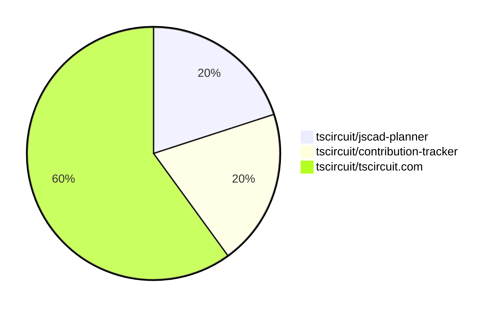

# Contribution Overview 2025-04-09

## PRs by Repository

## Contributor Overview

| Contributor | 🐳 Major | 🐙 Minor | 🐌 Tiny | ⭐ | Issues Created | Discussion Contributions |
|-------------|---------|---------|---------|-----|----------------|--------------------------|
| [ArnavK-09](#ArnavK-09) | 0 | 2 | 1 | ⭐ | 0 | 0🔹 0🔶 0💎 |
| [oldbear26](#oldbear26) | 0 | 1 | 0 |  | 0 | 0🔹 0🔶 0💎 |
| [techmannih](#techmannih) | 0 | 1 | 0 |  | 0 | 0🔹 0🔶 0💎 |
| [seveibar](#seveibar) | 0 | 0 | 0 | ⭐ | 3 | 3🔹 3🔶 0💎 |
| [gurjeetsinghvirdee](#gurjeetsinghvirdee) | 0 | 0 | 0 | ⭐ | 0 | 0🔹 2🔶 0💎 |
| [Anshgrover23](#Anshgrover23) | 0 | 0 | 0 |  | 0 | 1🔹 0🔶 0💎 |

### Discussion Contribution Legend

- 🔹 Participating: Basic participation with minimal effort
- 🔶 Very Active: Thoughtful participation that adds value
- 💎 Extremely Active: Exceptional participation with high-quality content

## Review Table

[reviews-received-hover]: ## "Number of reviews received for PRs for this contributor"
[approvals-received-hover]: ## "Number of approvals received for PRs this contributor authored"
[rejections-received-hover]: ## "Number of rejections received for PRs this contributor authored"
[prs-opened-hover]: ## "Number of PRs opened by this contributor"
[issues-created-hover]: ## "Number of issues created by this contributor"
[bountied-issues-hover]: ## "Number of issues this contributor created with a bounty"
[bountied-issue-$-hover]: ## "Total bounty amount placed on issues authored by this contributor"

| Contributor | Reviews Received | Approvals Received | Rejections Received | Approvals | Rejections | PRs Opened | PRs Merged | Issues Created | Bountied Issues | Bountied Issue $ |
|---|---|---|---|---|---|---|---|---|---|---|
| [oldbear26](#oldbear26) | 1 | 1 | 0 | 0 | 0 | 1 | 1 | 0 | 0 | 0 |
| [seveibar](#seveibar) | 0 | 0 | 0 | 6 | 0 | 0 | 0 | 3 | 2 | 80 |
| [ArnavK-09](#ArnavK-09) | 8 | 4 | 0 | 0 | 0 | 5 | 3 | 0 | 0 | 0 |
| [techmannih](#techmannih) | 1 | 1 | 0 | 0 | 0 | 1 | 1 | 0 | 0 | 0 |
| [gurjeetsinghvirdee](#gurjeetsinghvirdee) | 0 | 0 | 0 | 0 | 0 | 0 | 0 | 0 | 0 | 0 |
| [Anshgrover23](#Anshgrover23) | 0 | 0 | 0 | 0 | 0 | 0 | 0 | 0 | 0 | 0 |

## Changes by Repository

### [tscircuit/jscad-planner](https://github.com/tscircuit/jscad-planner)

| PR # | Impact | Contributor | Description | Milestone Aligned |
|------|--------|-------------|-------------|-------------------|
| [#9](https://github.com/tscircuit/jscad-planner/pull/9) | 🐙 Minor | oldbear26 | Fix a bug where the hull plan can have an array of operations in its shapes, but the plan executioner doesn't throw an error when the input is an array. | ✅ |

### [tscircuit/contribution-tracker](https://github.com/tscircuit/contribution-tracker)

| PR # | Impact | Contributor | Description | Milestone Aligned |
|------|--------|-------------|-------------|-------------------|
| [#112](https://github.com/tscircuit/contribution-tracker/pull/112) | 🐙 Minor | ArnavK-09 | Update ring and background colors for the 2nd place contributor | ❌ |

### [tscircuit/tscircuit.com](https://github.com/tscircuit/tscircuit.com)

| PR # | Impact | Contributor | Description | Milestone Aligned |
|------|--------|-------------|-------------|-------------------|
| [#810](https://github.com/tscircuit/tscircuit.com/pull/810) | 🐙 Minor | ArnavK-09 | Add edit package details dialog and update sidebar UI | ✅ |
| [#809](https://github.com/tscircuit/tscircuit.com/pull/809) | 🐙 Minor | techmannih | Fixes the text snippets to packages in the user profile page. | ❌ |
| [#811](https://github.com/tscircuit/tscircuit.com/pull/811) | 🐌 Tiny | ArnavK-09 | Wrap the disabled button in a div to improve structure and use `asChild` for DropdownMenuTrigger to ensure proper component composition. | ✅ |

## Changes by Contributor

### [oldbear26](https://github.com/oldbear26)

| PR # | Impact | Description | Milestone Aligned |
|------|--------|-------------|-------------------|
| [#9](https://github.com/tscircuit/jscad-planner/pull/9) | 🐙 Minor | Fix a bug where the hull plan can have an array of operations in its shapes, but the plan executioner doesn't throw an error when the input is an array. | ✅ |

### [ArnavK-09](https://github.com/ArnavK-09)

| PR # | Impact | Description | Milestone Aligned |
|------|--------|-------------|-------------------|
| [#112](https://github.com/tscircuit/contribution-tracker/pull/112) | 🐙 Minor | Update ring and background colors for the 2nd place contributor | ❌ |
| [#810](https://github.com/tscircuit/tscircuit.com/pull/810) | 🐙 Minor | Add edit package details dialog and update sidebar UI | ✅ |
| [#811](https://github.com/tscircuit/tscircuit.com/pull/811) | 🐌 Tiny | Wrap the disabled button in a div to improve structure and use `asChild` for DropdownMenuTrigger to ensure proper component composition. | ✅ |

### [techmannih](https://github.com/techmannih)

| PR # | Impact | Description | Milestone Aligned |
|------|--------|-------------|-------------------|
| [#809](https://github.com/tscircuit/tscircuit.com/pull/809) | 🐙 Minor | Fixes the text snippets to packages in the user profile page. | ❌ |

