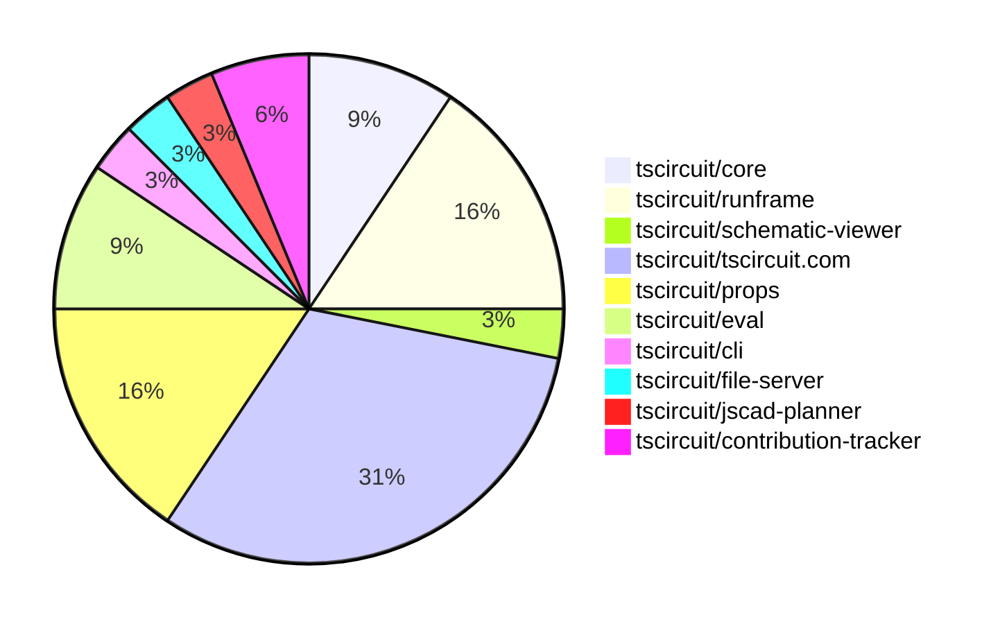

# Contribution Overview 2025-04-09

## PRs by Repository

## Contributor Overview

| Contributor | 🐳 Major | 🐙 Minor | 🐌 Tiny | ⭐ | Issues Created | Discussion Contributions |
|-------------|---------|---------|---------|-----|----------------|--------------------------|
| [seveibar](#seveibar) | 0 | 10 | 1 | ⭐⭐⭐ | 9 | 3🔹 3🔶 0💎 |
| [imrishabh18](#imrishabh18) | 3 | 4 | 0 | ⭐⭐ | 3 | 0🔹 0🔶 0💎 |
| [ArnavK-09](#ArnavK-09) | 2 | 5 | 1 | ⭐⭐ | 5 | 0🔹 0🔶 0💎 |
| [andrii-balitskyi](#andrii-balitskyi) | 0 | 3 | 0 | ⭐ | 1 | 0🔹 0🔶 0💎 |
| [oldbear26](#oldbear26) | 0 | 1 | 0 |  | 0 | 0🔹 0🔶 0💎 |
| [dekkku](#dekkku) | 0 | 1 | 0 |  | 0 | 0🔹 0🔶 0💎 |
| [techmannih](#techmannih) | 0 | 1 | 0 |  | 0 | 0🔹 0🔶 0💎 |
| [gurjeetsinghvirdee](#gurjeetsinghvirdee) | 0 | 0 | 0 | ⭐ | 0 | 0🔹 2🔶 0💎 |
| [Anshgrover23](#Anshgrover23) | 0 | 0 | 0 |  | 0 | 1🔹 0🔶 0💎 |

### Discussion Contribution Legend

- 🔹 Participating: Basic participation with minimal effort
- 🔶 Very Active: Thoughtful participation that adds value
- 💎 Extremely Active: Exceptional participation with high-quality content

## Review Table

[reviews-received-hover]: ## "Number of reviews received for PRs for this contributor"
[approvals-received-hover]: ## "Number of approvals received for PRs this contributor authored"
[rejections-received-hover]: ## "Number of rejections received for PRs this contributor authored"
[prs-opened-hover]: ## "Number of PRs opened by this contributor"
[issues-created-hover]: ## "Number of issues created by this contributor"
[bountied-issues-hover]: ## "Number of issues this contributor created with a bounty"
[bountied-issue-$-hover]: ## "Total bounty amount placed on issues authored by this contributor"

| Contributor | Reviews Received | Approvals Received | Rejections Received | Approvals | Rejections | PRs Opened | PRs Merged | Issues Created | Bountied Issues | Bountied Issue $ |
|---|---|---|---|---|---|---|---|---|---|---|
| [imrishabh18](#imrishabh18) | 5 | 3 | 0 | 1 | 2 | 8 | 7 | 3 | 3 | 14 |
| [seveibar](#seveibar) | 0 | 0 | 0 | 15 | 1 | 11 | 11 | 9 | 6 | 157 |
| [andrii-balitskyi](#andrii-balitskyi) | 3 | 3 | 0 | 0 | 0 | 4 | 3 | 1 | 0 | 0 |
| [techmannih](#techmannih) | 1 | 1 | 0 | 0 | 0 | 3 | 1 | 0 | 0 | 0 |
| [oldbear26](#oldbear26) | 1 | 1 | 0 | 0 | 0 | 1 | 1 | 0 | 0 | 0 |
| [Slaviiiii](#Slaviiiii) | 3 | 0 | 1 | 0 | 0 | 1 | 0 | 0 | 0 | 0 |
| [ArnavK-09](#ArnavK-09) | 13 | 7 | 1 | 0 | 0 | 11 | 8 | 5 | 0 | 0 |
| [Ayush9026](#Ayush9026) | 3 | 0 | 2 | 0 | 0 | 2 | 0 | 0 | 0 | 0 |
| [MustafaMulla29](#MustafaMulla29) | 0 | 0 | 0 | 0 | 1 | 0 | 0 | 0 | 0 | 0 |
| [dekkku](#dekkku) | 1 | 1 | 0 | 0 | 0 | 1 | 1 | 0 | 0 | 0 |
| [Ani-4x](#Ani-4x) | 0 | 0 | 0 | 0 | 0 | 1 | 0 | 0 | 0 | 0 |
| [tscircuitbot](#tscircuitbot) | 0 | 0 | 0 | 0 | 0 | 6 | 0 | 0 | 0 | 0 |
| [gurjeetsinghvirdee](#gurjeetsinghvirdee) | 0 | 0 | 0 | 0 | 0 | 0 | 0 | 0 | 0 | 0 |
| [Anshgrover23](#Anshgrover23) | 0 | 0 | 0 | 0 | 0 | 0 | 0 | 0 | 0 | 0 |

## Changes by Repository

### [tscircuit/core](https://github.com/tscircuit/core)

| PR # | Impact | Contributor | Description | Milestone Aligned |
|------|--------|-------------|-------------|-------------------|
| [#728](https://github.com/tscircuit/core/pull/728) | 🐳 Major | imrishabh18 | Abstracts the PCB and schematic manual edits method to handle both schematic and PCB edit events separately. | ✅ |
| [#726](https://github.com/tscircuit/core/pull/726) | 🐳 Major | imrishabh18 | Adds a method `applySchematicEditEventsToManualEditsFile` that updates the `schematic_placements` field in the `manual_edits_file` based on the `edit_schematic_component_location` edit events. | ✅ |
| [#727](https://github.com/tscircuit/core/pull/727) | 🐙 Minor | andrii-balitskyi | Update the dependency "@tscircuit/props" to version 0.0.167 | ✅ |

### [tscircuit/runframe](https://github.com/tscircuit/runframe)

| PR # | Impact | Contributor | Description | Milestone Aligned |
|------|--------|-------------|-------------|-------------------|
| [#435](https://github.com/tscircuit/runframe/pull/435) | 🐳 Major | imrishabh18 | Adds schematic manual edits functionality. | ✅ |
| [#440](https://github.com/tscircuit/runframe/pull/440) | 🐙 Minor | imrishabh18 | Fix publish workflow | ✅ |
| [#444](https://github.com/tscircuit/runframe/pull/444) | 🐙 Minor | seveibar | Fixes entrypoint inference and moves ordering to a separate fixture | ✅ |
| [#441](https://github.com/tscircuit/runframe/pull/441) | 🐙 Minor | seveibar | Allow entrypoint inference from @tscircuit/eval | ❌ |
| [#439](https://github.com/tscircuit/runframe/pull/439) | 🐌 Tiny | seveibar | Increment package.json version | ✅ |

### [tscircuit/schematic-viewer](https://github.com/tscircuit/schematic-viewer)

| PR # | Impact | Contributor | Description | Milestone Aligned |
|------|--------|-------------|-------------|-------------------|
| [#80](https://github.com/tscircuit/schematic-viewer/pull/80) | 🐙 Minor | imrishabh18 | Upgrade the `@tscircuit/core` dependency from version `0.0.245` to `0.0.362`. | ❌ |

### [tscircuit/tscircuit.com](https://github.com/tscircuit/tscircuit.com)

| PR # | Impact | Contributor | Description | Milestone Aligned |
|------|--------|-------------|-------------|-------------------|
| [#814](https://github.com/tscircuit/tscircuit.com/pull/814) | 🐳 Major | ArnavK-09 | Add a new trending page to display popular snippets | ✅ |
| [#827](https://github.com/tscircuit/tscircuit.com/pull/827) | 🐙 Minor | imrishabh18 | Refactors the tests to remove hardcoded session values and use dynamic values from the test server. | ❌ |
| [#825](https://github.com/tscircuit/tscircuit.com/pull/825) | 🐙 Minor | imrishabh18 | The pull request adds support for manual edits in the schematic, in addition to the existing support for PCB edits. | ✅ |
| [#815](https://github.com/tscircuit/tscircuit.com/pull/815) | 🐙 Minor | seveibar | Reverts the addition of a 404 page and handling of not found states. | ❌ |
| [#820](https://github.com/tscircuit/tscircuit.com/pull/820) | 🐙 Minor | ArnavK-09 | Add a new 404 page to handle cases where users navigate to non-existent routes or packages. | ✅ |
| [#813](https://github.com/tscircuit/tscircuit.com/pull/813) | 🐙 Minor | ArnavK-09 | Add a new 404 page to handle cases where users navigate to non-existent routes or packages. | ✅ |
| [#810](https://github.com/tscircuit/tscircuit.com/pull/810) | 🐙 Minor | ArnavK-09 | Add edit package details dialog and update sidebar UI | ✅ |
| [#818](https://github.com/tscircuit/tscircuit.com/pull/818) | 🐙 Minor | dekkku | The change adds a check for the availability of circuitJson and displays appropriate UI for disabled views. | ✅ |
| [#809](https://github.com/tscircuit/tscircuit.com/pull/809) | 🐙 Minor | techmannih | Fixes the text snippets to packages in the user profile page. | ❌ |
| [#811](https://github.com/tscircuit/tscircuit.com/pull/811) | 🐌 Tiny | ArnavK-09 | Wrap the disabled button in a div to improve structure and use `asChild` for DropdownMenuTrigger to ensure proper component composition. | ✅ |

### [tscircuit/props](https://github.com/tscircuit/props)

| PR # | Impact | Contributor | Description | Milestone Aligned |
|------|--------|-------------|-------------|-------------------|
| [#208](https://github.com/tscircuit/props/pull/208) | 🐙 Minor | seveibar | Defines selectors and connections as utility types, and exports them properly. | ✅ |
| [#207](https://github.com/tscircuit/props/pull/207) | 🐙 Minor | seveibar | Add support for `ChipProps` without `pinLabels` record | ✅ |
| [#206](https://github.com/tscircuit/props/pull/206) | 🐙 Minor | seveibar | Add support for pseudo-deprecated `innerWidth` and `innerHeight` properties in `PlatedHoleProps` and `PillPlatedHoleProps`. | ✅ |
| [#205](https://github.com/tscircuit/props/pull/205) | 🐙 Minor | andrii-balitskyi | The pull request updates the `platedhole.ts` component to use `holeWidth` and `holeHeight` instead of `innerWidth` and `innerHeight` for oval plated holes. | ✅ |
| [#203](https://github.com/tscircuit/props/pull/203) | 🐙 Minor | andrii-balitskyi | Changes the properties used for a "pill" plated hole from `innerWidth`/`innerHeight` to `holeWidth`/`holeHeight`. | ✅ |

### [tscircuit/eval](https://github.com/tscircuit/eval)

| PR # | Impact | Contributor | Description | Milestone Aligned |
|------|--------|-------------|-------------|-------------------|
| [#191](https://github.com/tscircuit/eval/pull/191) | 🐳 Major | ArnavK-09 | Introduces a new utility function to resolve node modules using the package.json file and the "exports" field. | ✅ |
| [#201](https://github.com/tscircuit/eval/pull/201) | 🐙 Minor | seveibar | Improve multi-file inference when there's only a single TSX file | ✅ |
| [#200](https://github.com/tscircuit/eval/pull/200) | 🐙 Minor | seveibar | Add support for inferred entrypoint for webworker | ✅ |

### [tscircuit/cli](https://github.com/tscircuit/cli)

| PR # | Impact | Contributor | Description | Milestone Aligned |
|------|--------|-------------|-------------|-------------------|
| [#149](https://github.com/tscircuit/cli/pull/149) | 🐙 Minor | seveibar | Removes the automatic generation of the "entrypoint.tsx" file and instead relies on the specified "eval" entrypoints. | ✅ |

### [tscircuit/file-server](https://github.com/tscircuit/file-server)

| PR # | Impact | Contributor | Description | Milestone Aligned |
|------|--------|-------------|-------------|-------------------|
| [#9](https://github.com/tscircuit/file-server/pull/9) | 🐙 Minor | seveibar | Escapes HTML special characters in file content to prevent XSS vulnerabilities on admin pages. | ✅ |

### [tscircuit/jscad-planner](https://github.com/tscircuit/jscad-planner)

| PR # | Impact | Contributor | Description | Milestone Aligned |
|------|--------|-------------|-------------|-------------------|
| [#9](https://github.com/tscircuit/jscad-planner/pull/9) | 🐙 Minor | oldbear26 | Fix a bug where the hull plan can have an array of operations in its shapes, but the plan executioner doesn't throw an error when the input is an array. | ✅ |

### [tscircuit/contribution-tracker](https://github.com/tscircuit/contribution-tracker)

| PR # | Impact | Contributor | Description | Milestone Aligned |
|------|--------|-------------|-------------|-------------------|
| [#115](https://github.com/tscircuit/contribution-tracker/pull/115) | 🐙 Minor | ArnavK-09 | The changes allow the hook to process PR rows in tables with and without contributor information, ensuring compatibility with different markdown formats and improving the robustness of the data extraction logic. | ✅ |
| [#112](https://github.com/tscircuit/contribution-tracker/pull/112) | 🐙 Minor | ArnavK-09 | Update ring and background colors for the 2nd place contributor | ❌ |

## Changes by Contributor

### [imrishabh18](https://github.com/imrishabh18)

| PR # | Impact | Description | Milestone Aligned |
|------|--------|-------------|-------------------|
| [#728](https://github.com/tscircuit/core/pull/728) | 🐳 Major | Abstracts the PCB and schematic manual edits method to handle both schematic and PCB edit events separately. | ✅ |
| [#726](https://github.com/tscircuit/core/pull/726) | 🐳 Major | Adds a method `applySchematicEditEventsToManualEditsFile` that updates the `schematic_placements` field in the `manual_edits_file` based on the `edit_schematic_component_location` edit events. | ✅ |
| [#435](https://github.com/tscircuit/runframe/pull/435) | 🐳 Major | Adds schematic manual edits functionality. | ✅ |
| [#80](https://github.com/tscircuit/schematic-viewer/pull/80) | 🐙 Minor | Upgrade the `@tscircuit/core` dependency from version `0.0.245` to `0.0.362`. | ❌ |
| [#827](https://github.com/tscircuit/tscircuit.com/pull/827) | 🐙 Minor | Refactors the tests to remove hardcoded session values and use dynamic values from the test server. | ❌ |
| [#825](https://github.com/tscircuit/tscircuit.com/pull/825) | 🐙 Minor | The pull request adds support for manual edits in the schematic, in addition to the existing support for PCB edits. | ✅ |
| [#440](https://github.com/tscircuit/runframe/pull/440) | 🐙 Minor | Fix publish workflow | ✅ |

### [seveibar](https://github.com/seveibar)

| PR # | Impact | Description | Milestone Aligned |
|------|--------|-------------|-------------------|
| [#208](https://github.com/tscircuit/props/pull/208) | 🐙 Minor | Defines selectors and connections as utility types, and exports them properly. | ✅ |
| [#207](https://github.com/tscircuit/props/pull/207) | 🐙 Minor | Add support for `ChipProps` without `pinLabels` record | ✅ |
| [#206](https://github.com/tscircuit/props/pull/206) | 🐙 Minor | Add support for pseudo-deprecated `innerWidth` and `innerHeight` properties in `PlatedHoleProps` and `PillPlatedHoleProps`. | ✅ |
| [#815](https://github.com/tscircuit/tscircuit.com/pull/815) | 🐙 Minor | Reverts the addition of a 404 page and handling of not found states. | ❌ |
| [#201](https://github.com/tscircuit/eval/pull/201) | 🐙 Minor | Improve multi-file inference when there's only a single TSX file | ✅ |
| [#200](https://github.com/tscircuit/eval/pull/200) | 🐙 Minor | Add support for inferred entrypoint for webworker | ✅ |
| [#444](https://github.com/tscircuit/runframe/pull/444) | 🐙 Minor | Fixes entrypoint inference and moves ordering to a separate fixture | ✅ |
| [#441](https://github.com/tscircuit/runframe/pull/441) | 🐙 Minor | Allow entrypoint inference from @tscircuit/eval | ❌ |
| [#149](https://github.com/tscircuit/cli/pull/149) | 🐙 Minor | Removes the automatic generation of the "entrypoint.tsx" file and instead relies on the specified "eval" entrypoints. | ✅ |
| [#9](https://github.com/tscircuit/file-server/pull/9) | 🐙 Minor | Escapes HTML special characters in file content to prevent XSS vulnerabilities on admin pages. | ✅ |
| [#439](https://github.com/tscircuit/runframe/pull/439) | 🐌 Tiny | Increment package.json version | ✅ |

### [andrii-balitskyi](https://github.com/andrii-balitskyi)

| PR # | Impact | Description | Milestone Aligned |
|------|--------|-------------|-------------------|
| [#205](https://github.com/tscircuit/props/pull/205) | 🐙 Minor | The pull request updates the `platedhole.ts` component to use `holeWidth` and `holeHeight` instead of `innerWidth` and `innerHeight` for oval plated holes. | ✅ |
| [#203](https://github.com/tscircuit/props/pull/203) | 🐙 Minor | Changes the properties used for a "pill" plated hole from `innerWidth`/`innerHeight` to `holeWidth`/`holeHeight`. | ✅ |
| [#727](https://github.com/tscircuit/core/pull/727) | 🐙 Minor | Update the dependency "@tscircuit/props" to version 0.0.167 | ✅ |

### [oldbear26](https://github.com/oldbear26)

| PR # | Impact | Description | Milestone Aligned |
|------|--------|-------------|-------------------|
| [#9](https://github.com/tscircuit/jscad-planner/pull/9) | 🐙 Minor | Fix a bug where the hull plan can have an array of operations in its shapes, but the plan executioner doesn't throw an error when the input is an array. | ✅ |

### [ArnavK-09](https://github.com/ArnavK-09)

| PR # | Impact | Description | Milestone Aligned |
|------|--------|-------------|-------------------|
| [#814](https://github.com/tscircuit/tscircuit.com/pull/814) | 🐳 Major | Add a new trending page to display popular snippets | ✅ |
| [#191](https://github.com/tscircuit/eval/pull/191) | 🐳 Major | Introduces a new utility function to resolve node modules using the package.json file and the "exports" field. | ✅ |
| [#115](https://github.com/tscircuit/contribution-tracker/pull/115) | 🐙 Minor | The changes allow the hook to process PR rows in tables with and without contributor information, ensuring compatibility with different markdown formats and improving the robustness of the data extraction logic. | ✅ |
| [#112](https://github.com/tscircuit/contribution-tracker/pull/112) | 🐙 Minor | Update ring and background colors for the 2nd place contributor | ❌ |
| [#820](https://github.com/tscircuit/tscircuit.com/pull/820) | 🐙 Minor | Add a new 404 page to handle cases where users navigate to non-existent routes or packages. | ✅ |
| [#813](https://github.com/tscircuit/tscircuit.com/pull/813) | 🐙 Minor | Add a new 404 page to handle cases where users navigate to non-existent routes or packages. | ✅ |
| [#810](https://github.com/tscircuit/tscircuit.com/pull/810) | 🐙 Minor | Add edit package details dialog and update sidebar UI | ✅ |
| [#811](https://github.com/tscircuit/tscircuit.com/pull/811) | 🐌 Tiny | Wrap the disabled button in a div to improve structure and use `asChild` for DropdownMenuTrigger to ensure proper component composition. | ✅ |

### [dekkku](https://github.com/dekkku)

| PR # | Impact | Description | Milestone Aligned |
|------|--------|-------------|-------------------|
| [#818](https://github.com/tscircuit/tscircuit.com/pull/818) | 🐙 Minor | The change adds a check for the availability of circuitJson and displays appropriate UI for disabled views. | ✅ |

### [techmannih](https://github.com/techmannih)

| PR # | Impact | Description | Milestone Aligned |
|------|--------|-------------|-------------------|
| [#809](https://github.com/tscircuit/tscircuit.com/pull/809) | 🐙 Minor | Fixes the text snippets to packages in the user profile page. | ❌ |

