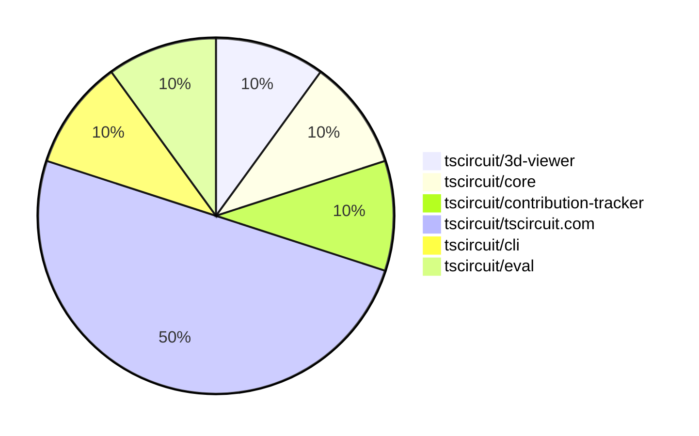

# Contribution Overview 2025-04-16

## PRs by Repository

## Contributor Overview

| Contributor | 🐳 Major | 🐙 Minor | 🐌 Tiny | ⭐ | Issues Created | Discussion Contributions |
|-------------|---------|---------|---------|-----|----------------|--------------------------|
| [seveibar](#seveibar) | 1 | 1 | 0 | ⭐⭐ | 4 | 0🔹 0🔶 0💎 |
| [ArnavK-09](#ArnavK-09) | 1 | 3 | 0 | ⭐ | 2 | 0🔹 0🔶 0💎 |
| [imrishabh18](#imrishabh18) | 1 | 2 | 0 | ⭐ | 0 | 0🔹 0🔶 0💎 |
| [tscircuitbot](#tscircuitbot) | 0 | 0 | 1 |  | 0 | 0🔹 0🔶 0💎 |

### Discussion Contribution Legend

- 🔹 Participating: Basic participation with minimal effort
- 🔶 Very Active: Thoughtful participation that adds value
- 💎 Extremely Active: Exceptional participation with high-quality content

## Review Table

[reviews-received-hover]: ## "Number of reviews received for PRs for this contributor"
[approvals-received-hover]: ## "Number of approvals received for PRs this contributor authored"
[rejections-received-hover]: ## "Number of rejections received for PRs this contributor authored"
[prs-opened-hover]: ## "Number of PRs opened by this contributor"
[issues-created-hover]: ## "Number of issues created by this contributor"
[bountied-issues-hover]: ## "Number of issues this contributor created with a bounty"
[bountied-issue-$-hover]: ## "Total bounty amount placed on issues authored by this contributor"

| Contributor | Reviews Received | Approvals Received | Rejections Received | Approvals | Rejections | PRs Opened | PRs Merged | Issues Created | Bountied Issues | Bountied Issue $ |
|---|---|---|---|---|---|---|---|---|---|---|
| [Abse2001](#Abse2001) | 1 | 0 | 1 | 1 | 0 | 1 | 0 | 0 | 0 | 0 |
| [seveibar](#seveibar) | 1 | 1 | 0 | 7 | 1 | 3 | 2 | 4 | 2 | 90 |
| [ArnavK-09](#ArnavK-09) | 6 | 5 | 0 | 0 | 0 | 5 | 4 | 2 | 0 | 0 |
| [imrishabh18](#imrishabh18) | 2 | 2 | 0 | 0 | 0 | 3 | 3 | 0 | 0 | 0 |
| [graphite-app[bot]](#graphite-app[bot]) | 0 | 0 | 0 | 0 | 0 | 0 | 0 | 0 | 0 | 0 |
| [tscircuitbot](#tscircuitbot) | 0 | 0 | 0 | 0 | 0 | 2 | 1 | 0 | 0 | 0 |

## Changes by Repository

### [tscircuit/3d-viewer](https://github.com/tscircuit/3d-viewer)

| PR # | Impact | Contributor | Description | Milestone Aligned |
|------|--------|-------------|-------------|-------------------|
| [#245](https://github.com/tscircuit/3d-viewer/pull/245) | 🐳 Major | seveibar | Introduces major performance improvements, fixes for board centering, trace drawings, and tooltip slowdown. | ✅ |

### [tscircuit/core](https://github.com/tscircuit/core)

| PR # | Impact | Contributor | Description | Milestone Aligned |
|------|--------|-------------|-------------|-------------------|
| [#739](https://github.com/tscircuit/core/pull/739) | 🐙 Minor | seveibar | Update checks and circuit JSON to connectivity net, a speculative fix for spurious DRC errors | ✅ |

### [tscircuit/contribution-tracker](https://github.com/tscircuit/contribution-tracker)

| PR # | Impact | Contributor | Description | Milestone Aligned |
|------|--------|-------------|-------------|-------------------|
| [#122](https://github.com/tscircuit/contribution-tracker/pull/122) | 🐳 Major | ArnavK-09 | Refactors the PR analysis feature by introducing a new `PrsTable` component to replace the deprecated `PRsByRepository` component, and adds support for fetching and processing PR analysis data, including grouping PRs by repository and contributor. | ✅ |

### [tscircuit/tscircuit.com](https://github.com/tscircuit/tscircuit.com)

| PR # | Impact | Contributor | Description | Milestone Aligned |
|------|--------|-------------|-------------|-------------------|
| [#860](https://github.com/tscircuit/tscircuit.com/pull/860) | 🐳 Major | imrishabh18 | The pull request adds a fake endpoint for `order_quotes` that allows creating, retrieving, and creating all vendor quotes for a package release. | ❌ |
| [#862](https://github.com/tscircuit/tscircuit.com/pull/862) | 🐙 Minor | ArnavK-09 | Fixes an error that occurs when trying to fork one's own package. | ✅ |
| [#861](https://github.com/tscircuit/tscircuit.com/pull/861) | 🐙 Minor | ArnavK-09 | Improve responsiveness and styling of the package header and code viewer components | ❌ |
| [#864](https://github.com/tscircuit/tscircuit.com/pull/864) | 🐙 Minor | imrishabh18 | Rename the "order_quote" directory to "order_quotes" | ✅ |
| [#859](https://github.com/tscircuit/tscircuit.com/pull/859) | 🐙 Minor | imrishabh18 | Fix the image preview in the package page. | ✅ |

### [tscircuit/cli](https://github.com/tscircuit/cli)

| PR # | Impact | Contributor | Description | Milestone Aligned |
|------|--------|-------------|-------------|-------------------|
| [#164](https://github.com/tscircuit/cli/pull/164) | 🐙 Minor | ArnavK-09 | Add a confirmation prompt to the `tsci init` command when no directory is provided. | ✅ |

### [tscircuit/eval](https://github.com/tscircuit/eval)

| PR # | Impact | Contributor | Description | Milestone Aligned |
|------|--------|-------------|-------------|-------------------|
| [#217](https://github.com/tscircuit/eval/pull/217) | 🐌 Tiny | tscircuitbot | Automated update of @tscircuit/core to v0.0.372. | ✅ |

## Changes by Contributor

### [seveibar](https://github.com/seveibar)

| PR # | Impact | Description | Milestone Aligned |
|------|--------|-------------|-------------------|
| [#245](https://github.com/tscircuit/3d-viewer/pull/245) | 🐳 Major | Introduces major performance improvements, fixes for board centering, trace drawings, and tooltip slowdown. | ✅ |
| [#739](https://github.com/tscircuit/core/pull/739) | 🐙 Minor | Update checks and circuit JSON to connectivity net, a speculative fix for spurious DRC errors | ✅ |

### [ArnavK-09](https://github.com/ArnavK-09)

| PR # | Impact | Description | Milestone Aligned |
|------|--------|-------------|-------------------|
| [#122](https://github.com/tscircuit/contribution-tracker/pull/122) | 🐳 Major | Refactors the PR analysis feature by introducing a new `PrsTable` component to replace the deprecated `PRsByRepository` component, and adds support for fetching and processing PR analysis data, including grouping PRs by repository and contributor. | ✅ |
| [#862](https://github.com/tscircuit/tscircuit.com/pull/862) | 🐙 Minor | Fixes an error that occurs when trying to fork one's own package. | ✅ |
| [#861](https://github.com/tscircuit/tscircuit.com/pull/861) | 🐙 Minor | Improve responsiveness and styling of the package header and code viewer components | ❌ |
| [#164](https://github.com/tscircuit/cli/pull/164) | 🐙 Minor | Add a confirmation prompt to the `tsci init` command when no directory is provided. | ✅ |

### [imrishabh18](https://github.com/imrishabh18)

| PR # | Impact | Description | Milestone Aligned |
|------|--------|-------------|-------------------|
| [#860](https://github.com/tscircuit/tscircuit.com/pull/860) | 🐳 Major | The pull request adds a fake endpoint for `order_quotes` that allows creating, retrieving, and creating all vendor quotes for a package release. | ❌ |
| [#864](https://github.com/tscircuit/tscircuit.com/pull/864) | 🐙 Minor | Rename the "order_quote" directory to "order_quotes" | ✅ |
| [#859](https://github.com/tscircuit/tscircuit.com/pull/859) | 🐙 Minor | Fix the image preview in the package page. | ✅ |

### [tscircuitbot](https://github.com/tscircuitbot)

| PR # | Impact | Description | Milestone Aligned |
|------|--------|-------------|-------------------|
| [#217](https://github.com/tscircuit/eval/pull/217) | 🐌 Tiny | Automated update of @tscircuit/core to v0.0.372. | ✅ |

