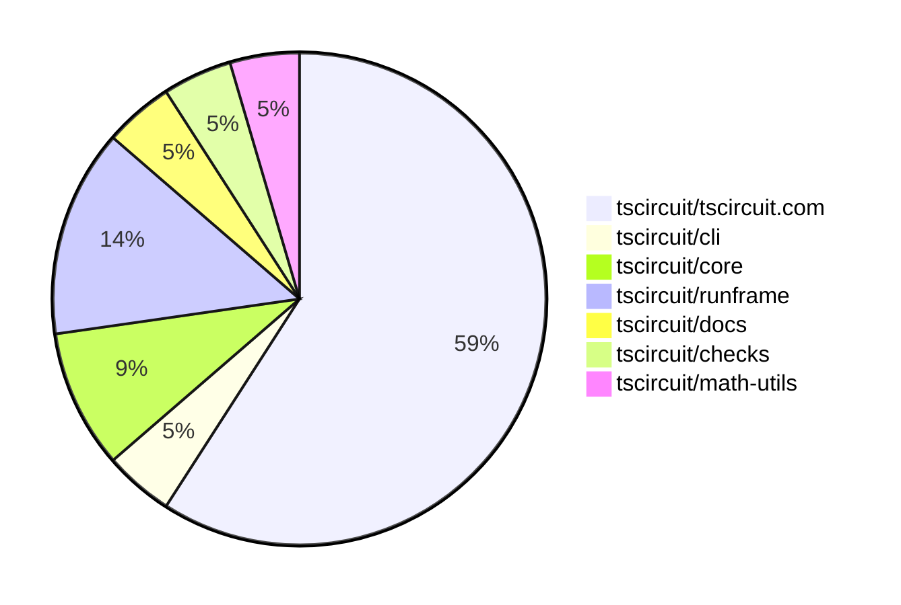

# Contribution Overview 2025-04-23

## PRs by Repository

## Contributor Overview

| Contributor | 🐳 Major | 🐙 Minor | 🐌 Tiny | ⭐ | Issues Created | Discussion Contributions |
|-------------|---------|---------|---------|-----|----------------|--------------------------|
| [imrishabh18](#imrishabh18) | 3 | 2 | 0 | ⭐⭐ | 6 | 0🔹 0🔶 0💎 |
| [ArnavK-09](#ArnavK-09) | 2 | 5 | 0 | ⭐⭐ | 5 | 0🔹 0🔶 0💎 |
| [seveibar](#seveibar) | 0 | 2 | 0 | ⭐⭐ | 25 | 0🔹 0🔶 0💎 |
| [Abse2001](#Abse2001) | 1 | 2 | 0 | ⭐ | 1 | 0🔹 0🔶 0💎 |
| [mohan-bee](#mohan-bee) | 1 | 1 | 0 | ⭐ | 0 | 0🔹 0🔶 0💎 |
| [MustafaMulla29](#MustafaMulla29) | 0 | 1 | 0 | ⭐ | 2 | 0🔹 0🔶 0💎 |
| [dhvll](#dhvll) | 1 | 0 | 0 | ⭐ | 0 | 0🔹 0🔶 0💎 |

### Discussion Contribution Legend

- 🔹 Participating: Basic participation with minimal effort
- 🔶 Very Active: Thoughtful participation that adds value
- 💎 Extremely Active: Exceptional participation with high-quality content

## Review Table

[reviews-received-hover]: ## "Number of reviews received for PRs for this contributor"
[approvals-received-hover]: ## "Number of approvals received for PRs this contributor authored"
[rejections-received-hover]: ## "Number of rejections received for PRs this contributor authored"
[prs-opened-hover]: ## "Number of PRs opened by this contributor"
[issues-created-hover]: ## "Number of issues created by this contributor"
[bountied-issues-hover]: ## "Number of issues this contributor created with a bounty"
[bountied-issue-$-hover]: ## "Total bounty amount placed on issues authored by this contributor"

| Contributor | Reviews Received | Approvals Received | Rejections Received | Approvals | Rejections | PRs Opened | PRs Merged | Issues Created | Bountied Issues | Bountied Issue $ |
|---|---|---|---|---|---|---|---|---|---|---|
| [guptadeepak8](#guptadeepak8) | 0 | 0 | 0 | 0 | 0 | 1 | 0 | 0 | 0 | 0 |
| [ArnavK-09](#ArnavK-09) | 11 | 8 | 0 | 1 | 1 | 8 | 7 | 5 | 0 | 0 |
| [seveibar](#seveibar) | 0 | 0 | 0 | 16 | 1 | 4 | 2 | 25 | 12 | 344 |
| [Abse2001](#Abse2001) | 12 | 3 | 0 | 0 | 0 | 4 | 3 | 1 | 0 | 0 |
| [ShiboSoftwareDev](#ShiboSoftwareDev) | 2 | 0 | 1 | 0 | 0 | 2 | 0 | 1 | 0 | 0 |
| [graphite-app[bot]](#graphite-app[bot]) | 0 | 0 | 0 | 0 | 0 | 0 | 0 | 0 | 0 | 0 |
| [mohan-bee](#mohan-bee) | 7 | 4 | 1 | 0 | 0 | 2 | 2 | 0 | 0 | 0 |
| [imrishabh18](#imrishabh18) | 3 | 0 | 0 | 2 | 2 | 5 | 5 | 6 | 5 | 79 |
| [MustafaMulla29](#MustafaMulla29) | 3 | 2 | 1 | 0 | 1 | 2 | 2 | 2 | 2 | 25 |
| [dhvll](#dhvll) | 2 | 2 | 0 | 0 | 0 | 1 | 1 | 0 | 0 | 0 |
| [tscircuitbot](#tscircuitbot) | 0 | 0 | 0 | 0 | 0 | 2 | 0 | 0 | 0 | 0 |
| [roshanDev-eng](#roshanDev-eng) | 3 | 0 | 1 | 0 | 0 | 1 | 0 | 0 | 0 | 0 |
| [akhilender-bongirwar](#akhilender-bongirwar) | 1 | 0 | 1 | 0 | 0 | 1 | 0 | 0 | 0 | 0 |

## Changes by Repository

### [tscircuit/tscircuit.com](https://github.com/tscircuit/tscircuit.com)

| PR # | Impact | Contributor | Description | Milestone Aligned |
|------|--------|-------------|-------------|-------------------|
| [#945](https://github.com/tscircuit/tscircuit.com/pull/945) | 🐳 Major | ArnavK-09 | Introduce a beta edit option in the dropdown menu for package editing, refactor the manual edits import functionality to support multiple files and improve error handling, and streamline state management in the CodeAndPreview component for better maintainability and performance. | ✅ |
| [#922](https://github.com/tscircuit/tscircuit.com/pull/922) | 🐳 Major | mohan-bee | The pull request adds a settings view that allows changing the visibility and deleting the package. | ✅ |
| [#944](https://github.com/tscircuit/tscircuit.com/pull/944) | 🐳 Major | imrishabh18 | Adds Stripe checkout functionality and passes session token to runframe | ✅ |
| [#931](https://github.com/tscircuit/tscircuit.com/pull/931) | 🐳 Major | imrishabh18 | Add support for markdown rendering in the application | ✅ |
| [#926](https://github.com/tscircuit/tscircuit.com/pull/926) | 🐳 Major | dhvll | Adds a star timestamp to snippets and updates the related logic to allow sorting packages based on the most recently starred ones. | ❌ |
| [#946](https://github.com/tscircuit/tscircuit.com/pull/946) | 🐙 Minor | ArnavK-09 | Simplifies the save logic in the EditorNav component by removing unused props. | ✅ |
| [#937](https://github.com/tscircuit/tscircuit.com/pull/937) | 🐙 Minor | ArnavK-09 | Add a useRef hook to the input element and focus it on component mount to enhance user experience by immediately allowing keyboard input. | ✅ |
| [#943](https://github.com/tscircuit/tscircuit.com/pull/943) | 🐙 Minor | Abse2001 | Update the fake API to accept either `circuit_json` or `package_release_id` when creating an order quote. | ✅ |
| [#925](https://github.com/tscircuit/tscircuit.com/pull/925) | 🐙 Minor | mohan-bee | Fixed the order button on the package header page. | ✅ |
| [#933](https://github.com/tscircuit/tscircuit.com/pull/933) | 🐙 Minor | imrishabh18 | Fix to ensure the order dialog opens correctly. | ✅ |
| [#921](https://github.com/tscircuit/tscircuit.com/pull/921) | 🐙 Minor | imrishabh18 | Add internal user to filter out the analytics from posthog | ❌ |
| [#934](https://github.com/tscircuit/tscircuit.com/pull/934) | 🐙 Minor | MustafaMulla29 | Added syntax highlighting to the hover tooltip in the code editor. | ❌ |
| [#928](https://github.com/tscircuit/tscircuit.com/pull/928) | 🟣 | MustafaMulla29 | Fix the overflow and tooltip UI when hovering over code components | ✅ |

### [tscircuit/cli](https://github.com/tscircuit/cli)

| PR # | Impact | Contributor | Description | Milestone Aligned |
|------|--------|-------------|-------------|-------------------|
| [#183](https://github.com/tscircuit/cli/pull/183) | 🐳 Major | ArnavK-09 | Introduces a new configuration option `alwaysCloneWithAuthorName` to control whether the author name is included in the cloned snippet directory by default, and improves error handling for the clone command. | ✅ |

### [tscircuit/core](https://github.com/tscircuit/core)

| PR # | Impact | Contributor | Description | Milestone Aligned |
|------|--------|-------------|-------------|-------------------|
| [#760](https://github.com/tscircuit/core/pull/760) | 🐙 Minor | ArnavK-09 | Refactors the condition checks for manual placement in the `NormalComponent` class, and reorganizes the manual edit conflict warning tests. | ✅ |
| [#756](https://github.com/tscircuit/core/pull/756) | 🐙 Minor | Abse2001 | Fix flaky test for schematic trace overlap with manufacturer label. | ✅ |

### [tscircuit/runframe](https://github.com/tscircuit/runframe)

| PR # | Impact | Contributor | Description | Milestone Aligned |
|------|--------|-------------|-------------|-------------------|
| [#508](https://github.com/tscircuit/runframe/pull/508) | 🐳 Major | imrishabh18 | Adds support for creating an order quote with checkout to Stripe. | ✅ |
| [#497](https://github.com/tscircuit/runframe/pull/497) | 🐙 Minor | ArnavK-09 | Enhance the PreviewEmptyState component by adding a dynamic tip for users, improving the visual layout, and making the component more informative. | ✅ |
| [#504](https://github.com/tscircuit/runframe/pull/504) | 🐙 Minor | seveibar | Adds support for authentication tokens and setup for proxying to a local registry for testing | ✅ |

### [tscircuit/docs](https://github.com/tscircuit/docs)

| PR # | Impact | Contributor | Description | Milestone Aligned |
|------|--------|-------------|-------------|-------------------|
| [#38](https://github.com/tscircuit/docs/pull/38) | 🐙 Minor | ArnavK-09 | Adds responsive styles for iframes and prevents horizontal overflow | ✅ |

### [tscircuit/checks](https://github.com/tscircuit/checks)

| PR # | Impact | Contributor | Description | Milestone Aligned |
|------|--------|-------------|-------------|-------------------|
| [#36](https://github.com/tscircuit/checks/pull/36) | 🐳 Major | Abse2001 | Introduces a new DRC rule to check if PCB components are out of the board boundary. | ❌ |

### [tscircuit/math-utils](https://github.com/tscircuit/math-utils)

| PR # | Impact | Contributor | Description | Milestone Aligned |
|------|--------|-------------|-------------|-------------------|
| [#10](https://github.com/tscircuit/math-utils/pull/10) | 🐙 Minor | seveibar | Adds two utility functions: `distSq` to calculate the squared distance between two points, and `pointToSegmentClosestPoint` to find the closest point on a line segment to a given point. | ✅ |

## Changes by Contributor

### [ArnavK-09](https://github.com/ArnavK-09)

| PR # | Impact | Description | Milestone Aligned |
|------|--------|-------------|-------------------|
| [#945](https://github.com/tscircuit/tscircuit.com/pull/945) | 🐳 Major | Introduce a beta edit option in the dropdown menu for package editing, refactor the manual edits import functionality to support multiple files and improve error handling, and streamline state management in the CodeAndPreview component for better maintainability and performance. | ✅ |
| [#183](https://github.com/tscircuit/cli/pull/183) | 🐳 Major | Introduces a new configuration option `alwaysCloneWithAuthorName` to control whether the author name is included in the cloned snippet directory by default, and improves error handling for the clone command. | ✅ |
| [#760](https://github.com/tscircuit/core/pull/760) | 🐙 Minor | Refactors the condition checks for manual placement in the `NormalComponent` class, and reorganizes the manual edit conflict warning tests. | ✅ |
| [#946](https://github.com/tscircuit/tscircuit.com/pull/946) | 🐙 Minor | Simplifies the save logic in the EditorNav component by removing unused props. | ✅ |
| [#937](https://github.com/tscircuit/tscircuit.com/pull/937) | 🐙 Minor | Add a useRef hook to the input element and focus it on component mount to enhance user experience by immediately allowing keyboard input. | ✅ |
| [#497](https://github.com/tscircuit/runframe/pull/497) | 🐙 Minor | Enhance the PreviewEmptyState component by adding a dynamic tip for users, improving the visual layout, and making the component more informative. | ✅ |
| [#38](https://github.com/tscircuit/docs/pull/38) | 🐙 Minor | Adds responsive styles for iframes and prevents horizontal overflow | ✅ |

### [Abse2001](https://github.com/Abse2001)

| PR # | Impact | Description | Milestone Aligned |
|------|--------|-------------|-------------------|
| [#36](https://github.com/tscircuit/checks/pull/36) | 🐳 Major | Introduces a new DRC rule to check if PCB components are out of the board boundary. | ❌ |
| [#756](https://github.com/tscircuit/core/pull/756) | 🐙 Minor | Fix flaky test for schematic trace overlap with manufacturer label. | ✅ |
| [#943](https://github.com/tscircuit/tscircuit.com/pull/943) | 🐙 Minor | Update the fake API to accept either `circuit_json` or `package_release_id` when creating an order quote. | ✅ |

### [seveibar](https://github.com/seveibar)

| PR # | Impact | Description | Milestone Aligned |
|------|--------|-------------|-------------------|
| [#10](https://github.com/tscircuit/math-utils/pull/10) | 🐙 Minor | Adds two utility functions: `distSq` to calculate the squared distance between two points, and `pointToSegmentClosestPoint` to find the closest point on a line segment to a given point. | ✅ |
| [#504](https://github.com/tscircuit/runframe/pull/504) | 🐙 Minor | Adds support for authentication tokens and setup for proxying to a local registry for testing | ✅ |

### [mohan-bee](https://github.com/mohan-bee)

| PR # | Impact | Description | Milestone Aligned |
|------|--------|-------------|-------------------|
| [#922](https://github.com/tscircuit/tscircuit.com/pull/922) | 🐳 Major | The pull request adds a settings view that allows changing the visibility and deleting the package. | ✅ |
| [#925](https://github.com/tscircuit/tscircuit.com/pull/925) | 🐙 Minor | Fixed the order button on the package header page. | ✅ |

### [imrishabh18](https://github.com/imrishabh18)

| PR # | Impact | Description | Milestone Aligned |
|------|--------|-------------|-------------------|
| [#944](https://github.com/tscircuit/tscircuit.com/pull/944) | 🐳 Major | Adds Stripe checkout functionality and passes session token to runframe | ✅ |
| [#931](https://github.com/tscircuit/tscircuit.com/pull/931) | 🐳 Major | Add support for markdown rendering in the application | ✅ |
| [#508](https://github.com/tscircuit/runframe/pull/508) | 🐳 Major | Adds support for creating an order quote with checkout to Stripe. | ✅ |
| [#933](https://github.com/tscircuit/tscircuit.com/pull/933) | 🐙 Minor | Fix to ensure the order dialog opens correctly. | ✅ |
| [#921](https://github.com/tscircuit/tscircuit.com/pull/921) | 🐙 Minor | Add internal user to filter out the analytics from posthog | ❌ |

### [MustafaMulla29](https://github.com/MustafaMulla29)

| PR # | Impact | Description | Milestone Aligned |
|------|--------|-------------|-------------------|
| [#934](https://github.com/tscircuit/tscircuit.com/pull/934) | 🐙 Minor | Added syntax highlighting to the hover tooltip in the code editor. | ❌ |
| [#928](https://github.com/tscircuit/tscircuit.com/pull/928) | 🟣 | Fix the overflow and tooltip UI when hovering over code components | ✅ |

### [dhvll](https://github.com/dhvll)

| PR # | Impact | Description | Milestone Aligned |
|------|--------|-------------|-------------------|
| [#926](https://github.com/tscircuit/tscircuit.com/pull/926) | 🐳 Major | Adds a star timestamp to snippets and updates the related logic to allow sorting packages based on the most recently starred ones. | ❌ |

