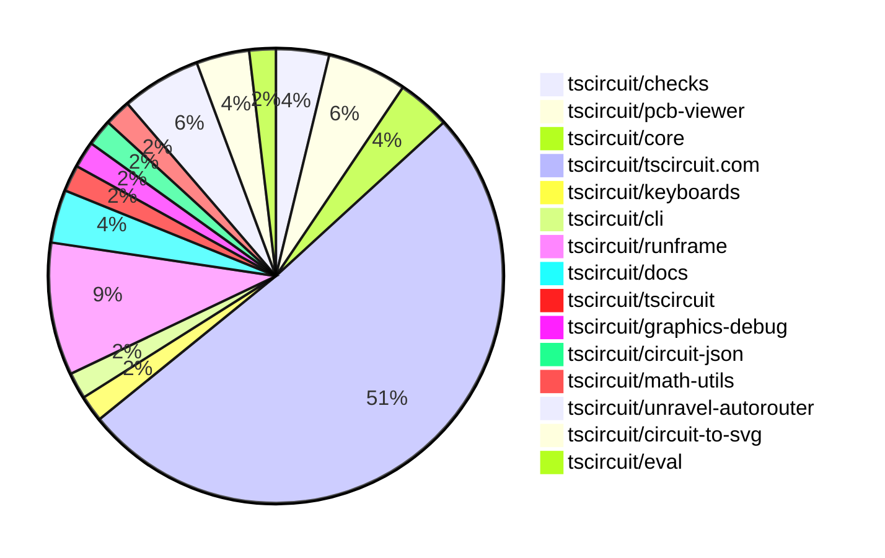

# Contribution Overview 2025-04-23

## PRs by Repository

## Contributor Overview

| Contributor | 🐳 Major | 🐙 Minor | 🐌 Tiny | ⭐ | Issues Created | Discussion Contributions |
|-------------|---------|---------|---------|-----|----------------|--------------------------|
| [imrishabh18](#imrishabh18) | 3 | 6 | 1 | ⭐⭐⭐ | 8 | 0🔹 0🔶 0💎 |
| [ArnavK-09](#ArnavK-09) | 3 | 9 | 2 | ⭐⭐⭐ | 7 | 0🔹 0🔶 0💎 |
| [seveibar](#seveibar) | 1 | 6 | 0 | ⭐⭐⭐ | 43 | 0🔹 0🔶 0💎 |
| [Abse2001](#Abse2001) | 1 | 4 | 0 | ⭐⭐ | 1 | 0🔹 0🔶 0💎 |
| [mohan-bee](#mohan-bee) | 1 | 2 | 2 | ⭐⭐ | 3 | 0🔹 0🔶 0💎 |
| [MustafaMulla29](#MustafaMulla29) | 0 | 4 | 0 | ⭐⭐ | 5 | 0🔹 0🔶 0💎 |
| [ShiboSoftwareDev](#ShiboSoftwareDev) | 0 | 3 | 0 | ⭐ | 5 | 0🔹 0🔶 0💎 |
| [dhvll](#dhvll) | 1 | 0 | 0 | ⭐ | 1 | 0🔹 0🔶 0💎 |
| [akhilender-bongirwar](#akhilender-bongirwar) | 1 | 0 | 0 | ⭐ | 0 | 0🔹 0🔶 0💎 |
| [guptadeepak8](#guptadeepak8) | 0 | 1 | 0 |  | 0 | 0🔹 0🔶 0💎 |
| [tscircuitbot](#tscircuitbot) | 0 | 0 | 1 |  | 0 | 0🔹 0🔶 0💎 |

### Discussion Contribution Legend

- 🔹 Participating: Basic participation with minimal effort
- 🔶 Very Active: Thoughtful participation that adds value
- 💎 Extremely Active: Exceptional participation with high-quality content

## Review Table

[reviews-received-hover]: ## "Number of reviews received for PRs for this contributor"
[approvals-received-hover]: ## "Number of approvals received for PRs this contributor authored"
[rejections-received-hover]: ## "Number of rejections received for PRs this contributor authored"
[prs-opened-hover]: ## "Number of PRs opened by this contributor"
[issues-created-hover]: ## "Number of issues created by this contributor"
[bountied-issues-hover]: ## "Number of issues this contributor created with a bounty"
[bountied-issue-$-hover]: ## "Total bounty amount placed on issues authored by this contributor"

| Contributor | Reviews Received | Approvals Received | Rejections Received | Approvals | Rejections | PRs Opened | PRs Merged | Issues Created | Bountied Issues | Bountied Issue $ |
|---|---|---|---|---|---|---|---|---|---|---|
| [Abse2001](#Abse2001) | 17 | 4 | 0 | 0 | 0 | 7 | 5 | 1 | 0 | 0 |
| [seveibar](#seveibar) | 0 | 0 | 0 | 32 | 0 | 12 | 7 | 43 | 22 | 594 |
| [ArnavK-09](#ArnavK-09) | 19 | 15 | 0 | 2 | 1 | 15 | 14 | 7 | 2 | 30 |
| [guptadeepak8](#guptadeepak8) | 1 | 1 | 0 | 0 | 0 | 1 | 1 | 0 | 0 | 0 |
| [imrishabh18](#imrishabh18) | 4 | 1 | 0 | 9 | 3 | 10 | 10 | 8 | 5 | 109 |
| [tscircuitbot](#tscircuitbot) | 0 | 0 | 0 | 0 | 0 | 3 | 1 | 0 | 0 | 0 |
| [ShiboSoftwareDev](#ShiboSoftwareDev) | 9 | 4 | 2 | 0 | 0 | 6 | 3 | 5 | 2 | 20 |
| [dekkku](#dekkku) | 0 | 0 | 0 | 0 | 0 | 1 | 0 | 0 | 0 | 0 |
| [graphite-app[bot]](#graphite-app[bot]) | 0 | 0 | 0 | 0 | 0 | 0 | 0 | 0 | 0 | 0 |
| [mohan-bee](#mohan-bee) | 14 | 8 | 1 | 0 | 0 | 9 | 5 | 3 | 1 | 8 |
| [MustafaMulla29](#MustafaMulla29) | 9 | 7 | 1 | 0 | 1 | 5 | 5 | 5 | 2 | 25 |
| [dhvll](#dhvll) | 2 | 2 | 0 | 0 | 0 | 8 | 1 | 1 | 0 | 0 |
| [krushnarout](#krushnarout) | 2 | 0 | 0 | 0 | 0 | 1 | 0 | 0 | 0 | 0 |
| [roshanDev-eng](#roshanDev-eng) | 3 | 0 | 1 | 0 | 0 | 1 | 0 | 0 | 0 | 0 |
| [ricohageman](#ricohageman) | 0 | 0 | 0 | 0 | 0 | 1 | 0 | 0 | 0 | 0 |
| [akhilender-bongirwar](#akhilender-bongirwar) | 2 | 1 | 0 | 0 | 0 | 2 | 1 | 0 | 0 | 0 |

## Changes by Repository

### [tscircuit/checks](https://github.com/tscircuit/checks)

| PR # | Impact | Contributor | Description | Milestone Aligned |
|------|--------|-------------|-------------|-------------------|
| [#36](https://github.com/tscircuit/checks/pull/36) | 🐳 Major | Abse2001 | Introduces a new DRC rule to check if PCB components are out of the board boundary. | ❌ |
| [#39](https://github.com/tscircuit/checks/pull/39) | 🐙 Minor | ShiboSoftwareDev | Fixed an issue where the via was too close to the trace, causing it to not error. | ✅ |

### [tscircuit/pcb-viewer](https://github.com/tscircuit/pcb-viewer)

| PR # | Impact | Contributor | Description | Milestone Aligned |
|------|--------|-------------|-------------|-------------------|
| [#244](https://github.com/tscircuit/pcb-viewer/pull/244) | 🐳 Major | ArnavK-09 | Adds a warning graphics overlay to the PCB viewer for manual edit conflicts. | ✅ |
| [#245](https://github.com/tscircuit/pcb-viewer/pull/245) | 🐙 Minor | Abse2001 | Adds functionality to highlight DRC (Design Rule Check) errors on the PCB canvas. | ❌ |
| [#242](https://github.com/tscircuit/pcb-viewer/pull/242) | 🐙 Minor | guptadeepak8 | Adjust the rendering order of layers to ensure components appear on top. | ✅ |

### [tscircuit/core](https://github.com/tscircuit/core)

| PR # | Impact | Contributor | Description | Milestone Aligned |
|------|--------|-------------|-------------|-------------------|
| [#756](https://github.com/tscircuit/core/pull/756) | 🐙 Minor | Abse2001 | Fix flaky test for schematic trace overlap with manufacturer label. | ✅ |
| [#760](https://github.com/tscircuit/core/pull/760) | 🐙 Minor | ArnavK-09 | Refactors the condition checks for manual placement in the `NormalComponent` class, and reorganizes the manual edit conflict warning tests. | ✅ |

### [tscircuit/tscircuit.com](https://github.com/tscircuit/tscircuit.com)

| PR # | Impact | Contributor | Description | Milestone Aligned |
|------|--------|-------------|-------------|-------------------|
| [#945](https://github.com/tscircuit/tscircuit.com/pull/945) | 🐳 Major | ArnavK-09 | Introduce a beta edit option in the dropdown menu for package editing, refactor the manual edits import functionality to support multiple files and improve error handling, and streamline state management in the CodeAndPreview component for better maintainability and performance. | ✅ |
| [#944](https://github.com/tscircuit/tscircuit.com/pull/944) | 🐳 Major | imrishabh18 | Adds Stripe checkout functionality and passes session token to runframe | ✅ |
| [#931](https://github.com/tscircuit/tscircuit.com/pull/931) | 🐳 Major | imrishabh18 | Add support for markdown rendering in the application | ✅ |
| [#922](https://github.com/tscircuit/tscircuit.com/pull/922) | 🐳 Major | mohan-bee | The pull request adds a settings view that allows changing the visibility and deleting the package. | ✅ |
| [#926](https://github.com/tscircuit/tscircuit.com/pull/926) | 🐳 Major | dhvll | Adds a star timestamp to snippets and updates the related logic to allow sorting packages based on the most recently starred ones. | ❌ |
| [#943](https://github.com/tscircuit/tscircuit.com/pull/943) | 🐙 Minor | Abse2001 | Update the fake API to accept either `circuit_json` or `package_release_id` when creating an order quote. | ✅ |
| [#978](https://github.com/tscircuit/tscircuit.com/pull/978) | 🐙 Minor | ArnavK-09 | Ensures consistent path handling in the `fsMap` by prefixing paths that don't start with a forward slash. | ✅ |
| [#956](https://github.com/tscircuit/tscircuit.com/pull/956) | 🐙 Minor | ArnavK-09 | Adds manual edit conflict warning handling for PCB and schematic | ✅ |
| [#968](https://github.com/tscircuit/tscircuit.com/pull/968) | 🐙 Minor | ArnavK-09 | Fix to prevent premature rendering when files are still loading | ✅ |
| [#964](https://github.com/tscircuit/tscircuit.com/pull/964) | 🐙 Minor | ArnavK-09 | Add an `autofocus` prop to the `SearchComponent` to control whether the search input should be focused on component mount. | ❌ |
| [#946](https://github.com/tscircuit/tscircuit.com/pull/946) | 🐙 Minor | ArnavK-09 | Simplifies the save logic in the EditorNav component by removing unused props. | ✅ |
| [#937](https://github.com/tscircuit/tscircuit.com/pull/937) | 🐙 Minor | ArnavK-09 | Add a useRef hook to the input element and focus it on component mount to enhance user experience by immediately allowing keyboard input. | ✅ |
| [#973](https://github.com/tscircuit/tscircuit.com/pull/973) | 🐙 Minor | imrishabh18 | The pull request fixes the test cases for the `/order_quotes/create` endpoint, updating the test names and handling the optional `circuit_json` parameter in the request body. | ❌ |
| [#933](https://github.com/tscircuit/tscircuit.com/pull/933) | 🐙 Minor | imrishabh18 | Fix to ensure the order dialog opens correctly. | ✅ |
| [#921](https://github.com/tscircuit/tscircuit.com/pull/921) | 🐙 Minor | imrishabh18 | Add internal user to filter out the analytics from posthog | ❌ |
| [#976](https://github.com/tscircuit/tscircuit.com/pull/976) | 🐙 Minor | mohan-bee | Removed the "Fork" button for the package owner. | ✅ |
| [#925](https://github.com/tscircuit/tscircuit.com/pull/925) | 🐙 Minor | mohan-bee | Fixed the order button on the package header page. | ✅ |
| [#955](https://github.com/tscircuit/tscircuit.com/pull/955) | 🐙 Minor | MustafaMulla29 | Adds an empty state message to the dashboard page if the user is not logged in, prompting them to log in. | ❌ |
| [#963](https://github.com/tscircuit/tscircuit.com/pull/963) | 🐙 Minor | MustafaMulla29 | Commented out the `CreateNewSnippetWithAiHero` component and added a `SnippetCard` component to display snippets on the `/dashboard` page. | ❌ |
| [#962](https://github.com/tscircuit/tscircuit.com/pull/962) | 🐙 Minor | MustafaMulla29 | Add a message to indicate when there are no packages available or starred packages. | ✅ |
| [#934](https://github.com/tscircuit/tscircuit.com/pull/934) | 🐙 Minor | MustafaMulla29 | Added syntax highlighting to the hover tooltip in the code editor. | ❌ |
| [#980](https://github.com/tscircuit/tscircuit.com/pull/980) | 🐌 Tiny | ArnavK-09 | Rename `informManualEditConflicts` function to `toastManualEditConflicts` | ✅ |
| [#954](https://github.com/tscircuit/tscircuit.com/pull/954) | 🐌 Tiny | ArnavK-09 | Remove additional console log statement. | ✅ |
| [#967](https://github.com/tscircuit/tscircuit.com/pull/967) | 🐌 Tiny | imrishabh18 | Stops sending events to Posthog during development. | ✅ |
| [#966](https://github.com/tscircuit/tscircuit.com/pull/966) | 🐌 Tiny | mohan-bee | Change syntax highlighting for markdown from TypeScript to TSX. | ✅ |
| [#950](https://github.com/tscircuit/tscircuit.com/pull/950) | 🐌 Tiny | mohan-bee | Fix the code syntax highlighting in the README file | ❌ |
| [#928](https://github.com/tscircuit/tscircuit.com/pull/928) | 🟣 | MustafaMulla29 | Fix the overflow and tooltip UI when hovering over code components | ✅ |

### [tscircuit/keyboards](https://github.com/tscircuit/keyboards)

| PR # | Impact | Contributor | Description | Milestone Aligned |
|------|--------|-------------|-------------|-------------------|
| [#2](https://github.com/tscircuit/keyboards/pull/2) | 🐙 Minor | Abse2001 | Added stabilizer holes for a 6.25u spacebar | ✅ |

### [tscircuit/cli](https://github.com/tscircuit/cli)

| PR # | Impact | Contributor | Description | Milestone Aligned |
|------|--------|-------------|-------------|-------------------|
| [#183](https://github.com/tscircuit/cli/pull/183) | 🐳 Major | ArnavK-09 | Introduces a new configuration option `alwaysCloneWithAuthorName` to control whether the author name is included in the cloned snippet directory by default, and improves error handling for the clone command. | ✅ |

### [tscircuit/runframe](https://github.com/tscircuit/runframe)

| PR # | Impact | Contributor | Description | Milestone Aligned |
|------|--------|-------------|-------------|-------------------|
| [#508](https://github.com/tscircuit/runframe/pull/508) | 🐳 Major | imrishabh18 | Adds support for creating an order quote with checkout to Stripe. | ✅ |
| [#497](https://github.com/tscircuit/runframe/pull/497) | 🐙 Minor | ArnavK-09 | Add dynamic user tips to the PreviewEmptyState component, improving the visual layout and making the component more informative. | ✅ |
| [#510](https://github.com/tscircuit/runframe/pull/510) | 🐙 Minor | imrishabh18 | Replace `AlertDialog` with `Dialog` to fix the dialog closing issue when clicked outside. | ❌ |
| [#514](https://github.com/tscircuit/runframe/pull/514) | 🐙 Minor | seveibar | Fix tips changing on rerender and improve tip text | ❌ |
| [#504](https://github.com/tscircuit/runframe/pull/504) | 🐙 Minor | seveibar | Add support for authentication tokens and setup for proxying to a local registry for testing. | ✅ |

### [tscircuit/docs](https://github.com/tscircuit/docs)

| PR # | Impact | Contributor | Description | Milestone Aligned |
|------|--------|-------------|-------------|-------------------|
| [#38](https://github.com/tscircuit/docs/pull/38) | 🐙 Minor | ArnavK-09 | Adds responsive styles for iframes and prevents horizontal overflow | ✅ |
| [#45](https://github.com/tscircuit/docs/pull/45) | 🐙 Minor | imrishabh18 | Add a skeleton until the iframe is loaded | ✅ |

### [tscircuit/tscircuit](https://github.com/tscircuit/tscircuit)

| PR # | Impact | Contributor | Description | Milestone Aligned |
|------|--------|-------------|-------------|-------------------|
| [#613](https://github.com/tscircuit/tscircuit/pull/613) | 🐙 Minor | imrishabh18 | Updates the table section in the README to include the latest libraries. | ✅ |

### [tscircuit/graphics-debug](https://github.com/tscircuit/graphics-debug)

| PR # | Impact | Contributor | Description | Milestone Aligned |
|------|--------|-------------|-------------|-------------------|
| [#52](https://github.com/tscircuit/graphics-debug/pull/52) | 🐳 Major | seveibar | Add context menu with ability to save camera position, ability to add markers | ❌ |

### [tscircuit/circuit-json](https://github.com/tscircuit/circuit-json)

| PR # | Impact | Contributor | Description | Milestone Aligned |
|------|--------|-------------|-------------|-------------------|
| [#153](https://github.com/tscircuit/circuit-json/pull/153) | 🐙 Minor | seveibar | Adds support for specifying the hole diameter and outer diameter of route point vias in the PCB trace definition. | ✅ |

### [tscircuit/math-utils](https://github.com/tscircuit/math-utils)

| PR # | Impact | Contributor | Description | Milestone Aligned |
|------|--------|-------------|-------------|-------------------|
| [#10](https://github.com/tscircuit/math-utils/pull/10) | 🐙 Minor | seveibar | Adds two utility functions: `distSq` to calculate the squared distance between two points, and `pointToSegmentClosestPoint` to find the closest point on a line segment to a given point. | ✅ |

### [tscircuit/unravel-autorouter](https://github.com/tscircuit/unravel-autorouter)

| PR # | Impact | Contributor | Description | Milestone Aligned |
|------|--------|-------------|-------------|-------------------|
| [#101](https://github.com/tscircuit/unravel-autorouter/pull/101) | 🐳 Major | akhilender-bongirwar | Introduces a new spatial index implementation using rbush and flatbush libraries to optimize obstacle searching for static and dynamic obstacles. | ✅ |
| [#103](https://github.com/tscircuit/unravel-autorouter/pull/103) | 🐙 Minor | seveibar | Fix for a bug in the `SingleHighDensityRouteStitchSolver` where it was connecting routes incorrectly. | ✅ |
| [#97](https://github.com/tscircuit/unravel-autorouter/pull/97) | 🐙 Minor | seveibar | Adds a new JSON file `cn14003-nodeWithPortPoints.json` and updates the `cn1701-nodeWithPortPoints.json` file with additional details. | ✅ |

### [tscircuit/circuit-to-svg](https://github.com/tscircuit/circuit-to-svg)

| PR # | Impact | Contributor | Description | Milestone Aligned |
|------|--------|-------------|-------------|-------------------|
| [#202](https://github.com/tscircuit/circuit-to-svg/pull/202) | 🐙 Minor | ShiboSoftwareDev | Draw bottom layer components with dashed lines | ✅ |
| [#200](https://github.com/tscircuit/circuit-to-svg/pull/200) | 🐙 Minor | ShiboSoftwareDev | Adjusts the relative border and text sizes to ensure small components appear clearly. | ✅ |

### [tscircuit/eval](https://github.com/tscircuit/eval)

| PR # | Impact | Contributor | Description | Milestone Aligned |
|------|--------|-------------|-------------|-------------------|
| [#242](https://github.com/tscircuit/eval/pull/242) | 🐌 Tiny | tscircuitbot | Update @tscircuit/core dependency to version 0.0.380 | ✅ |

## Changes by Contributor

### [Abse2001](https://github.com/Abse2001)

| PR # | Impact | Description | Milestone Aligned |
|------|--------|-------------|-------------------|
| [#36](https://github.com/tscircuit/checks/pull/36) | 🐳 Major | Introduces a new DRC rule to check if PCB components are out of the board boundary. | ❌ |
| [#245](https://github.com/tscircuit/pcb-viewer/pull/245) | 🐙 Minor | Adds functionality to highlight DRC (Design Rule Check) errors on the PCB canvas. | ❌ |
| [#756](https://github.com/tscircuit/core/pull/756) | 🐙 Minor | Fix flaky test for schematic trace overlap with manufacturer label. | ✅ |
| [#943](https://github.com/tscircuit/tscircuit.com/pull/943) | 🐙 Minor | Update the fake API to accept either `circuit_json` or `package_release_id` when creating an order quote. | ✅ |
| [#2](https://github.com/tscircuit/keyboards/pull/2) | 🐙 Minor | Added stabilizer holes for a 6.25u spacebar | ✅ |

### [ArnavK-09](https://github.com/ArnavK-09)

| PR # | Impact | Description | Milestone Aligned |
|------|--------|-------------|-------------------|
| [#244](https://github.com/tscircuit/pcb-viewer/pull/244) | 🐳 Major | Adds a warning graphics overlay to the PCB viewer for manual edit conflicts. | ✅ |
| [#945](https://github.com/tscircuit/tscircuit.com/pull/945) | 🐳 Major | Introduce a beta edit option in the dropdown menu for package editing, refactor the manual edits import functionality to support multiple files and improve error handling, and streamline state management in the CodeAndPreview component for better maintainability and performance. | ✅ |
| [#183](https://github.com/tscircuit/cli/pull/183) | 🐳 Major | Introduces a new configuration option `alwaysCloneWithAuthorName` to control whether the author name is included in the cloned snippet directory by default, and improves error handling for the clone command. | ✅ |
| [#760](https://github.com/tscircuit/core/pull/760) | 🐙 Minor | Refactors the condition checks for manual placement in the `NormalComponent` class, and reorganizes the manual edit conflict warning tests. | ✅ |
| [#978](https://github.com/tscircuit/tscircuit.com/pull/978) | 🐙 Minor | Ensures consistent path handling in the `fsMap` by prefixing paths that don't start with a forward slash. | ✅ |
| [#956](https://github.com/tscircuit/tscircuit.com/pull/956) | 🐙 Minor | Adds manual edit conflict warning handling for PCB and schematic | ✅ |
| [#968](https://github.com/tscircuit/tscircuit.com/pull/968) | 🐙 Minor | Fix to prevent premature rendering when files are still loading | ✅ |
| [#964](https://github.com/tscircuit/tscircuit.com/pull/964) | 🐙 Minor | Add an `autofocus` prop to the `SearchComponent` to control whether the search input should be focused on component mount. | ❌ |
| [#946](https://github.com/tscircuit/tscircuit.com/pull/946) | 🐙 Minor | Simplifies the save logic in the EditorNav component by removing unused props. | ✅ |
| [#937](https://github.com/tscircuit/tscircuit.com/pull/937) | 🐙 Minor | Add a useRef hook to the input element and focus it on component mount to enhance user experience by immediately allowing keyboard input. | ✅ |
| [#497](https://github.com/tscircuit/runframe/pull/497) | 🐙 Minor | Add dynamic user tips to the PreviewEmptyState component, improving the visual layout and making the component more informative. | ✅ |
| [#38](https://github.com/tscircuit/docs/pull/38) | 🐙 Minor | Adds responsive styles for iframes and prevents horizontal overflow | ✅ |
| [#980](https://github.com/tscircuit/tscircuit.com/pull/980) | 🐌 Tiny | Rename `informManualEditConflicts` function to `toastManualEditConflicts` | ✅ |
| [#954](https://github.com/tscircuit/tscircuit.com/pull/954) | 🐌 Tiny | Remove additional console log statement. | ✅ |

### [guptadeepak8](https://github.com/guptadeepak8)

| PR # | Impact | Description | Milestone Aligned |
|------|--------|-------------|-------------------|
| [#242](https://github.com/tscircuit/pcb-viewer/pull/242) | 🐙 Minor | Adjust the rendering order of layers to ensure components appear on top. | ✅ |

### [imrishabh18](https://github.com/imrishabh18)

| PR # | Impact | Description | Milestone Aligned |
|------|--------|-------------|-------------------|
| [#944](https://github.com/tscircuit/tscircuit.com/pull/944) | 🐳 Major | Adds Stripe checkout functionality and passes session token to runframe | ✅ |
| [#931](https://github.com/tscircuit/tscircuit.com/pull/931) | 🐳 Major | Add support for markdown rendering in the application | ✅ |
| [#508](https://github.com/tscircuit/runframe/pull/508) | 🐳 Major | Adds support for creating an order quote with checkout to Stripe. | ✅ |
| [#613](https://github.com/tscircuit/tscircuit/pull/613) | 🐙 Minor | Updates the table section in the README to include the latest libraries. | ✅ |
| [#973](https://github.com/tscircuit/tscircuit.com/pull/973) | 🐙 Minor | The pull request fixes the test cases for the `/order_quotes/create` endpoint, updating the test names and handling the optional `circuit_json` parameter in the request body. | ❌ |
| [#933](https://github.com/tscircuit/tscircuit.com/pull/933) | 🐙 Minor | Fix to ensure the order dialog opens correctly. | ✅ |
| [#921](https://github.com/tscircuit/tscircuit.com/pull/921) | 🐙 Minor | Add internal user to filter out the analytics from posthog | ❌ |
| [#510](https://github.com/tscircuit/runframe/pull/510) | 🐙 Minor | Replace `AlertDialog` with `Dialog` to fix the dialog closing issue when clicked outside. | ❌ |
| [#45](https://github.com/tscircuit/docs/pull/45) | 🐙 Minor | Add a skeleton until the iframe is loaded | ✅ |
| [#967](https://github.com/tscircuit/tscircuit.com/pull/967) | 🐌 Tiny | Stops sending events to Posthog during development. | ✅ |

### [seveibar](https://github.com/seveibar)

| PR # | Impact | Description | Milestone Aligned |
|------|--------|-------------|-------------------|
| [#52](https://github.com/tscircuit/graphics-debug/pull/52) | 🐳 Major | Add context menu with ability to save camera position, ability to add markers | ❌ |
| [#153](https://github.com/tscircuit/circuit-json/pull/153) | 🐙 Minor | Adds support for specifying the hole diameter and outer diameter of route point vias in the PCB trace definition. | ✅ |
| [#10](https://github.com/tscircuit/math-utils/pull/10) | 🐙 Minor | Adds two utility functions: `distSq` to calculate the squared distance between two points, and `pointToSegmentClosestPoint` to find the closest point on a line segment to a given point. | ✅ |
| [#514](https://github.com/tscircuit/runframe/pull/514) | 🐙 Minor | Fix tips changing on rerender and improve tip text | ❌ |
| [#504](https://github.com/tscircuit/runframe/pull/504) | 🐙 Minor | Add support for authentication tokens and setup for proxying to a local registry for testing. | ✅ |
| [#103](https://github.com/tscircuit/unravel-autorouter/pull/103) | 🐙 Minor | Fix for a bug in the `SingleHighDensityRouteStitchSolver` where it was connecting routes incorrectly. | ✅ |
| [#97](https://github.com/tscircuit/unravel-autorouter/pull/97) | 🐙 Minor | Adds a new JSON file `cn14003-nodeWithPortPoints.json` and updates the `cn1701-nodeWithPortPoints.json` file with additional details. | ✅ |

### [ShiboSoftwareDev](https://github.com/ShiboSoftwareDev)

| PR # | Impact | Description | Milestone Aligned |
|------|--------|-------------|-------------------|
| [#202](https://github.com/tscircuit/circuit-to-svg/pull/202) | 🐙 Minor | Draw bottom layer components with dashed lines | ✅ |
| [#200](https://github.com/tscircuit/circuit-to-svg/pull/200) | 🐙 Minor | Adjusts the relative border and text sizes to ensure small components appear clearly. | ✅ |
| [#39](https://github.com/tscircuit/checks/pull/39) | 🐙 Minor | Fixed an issue where the via was too close to the trace, causing it to not error. | ✅ |

### [mohan-bee](https://github.com/mohan-bee)

| PR # | Impact | Description | Milestone Aligned |
|------|--------|-------------|-------------------|
| [#922](https://github.com/tscircuit/tscircuit.com/pull/922) | 🐳 Major | The pull request adds a settings view that allows changing the visibility and deleting the package. | ✅ |
| [#976](https://github.com/tscircuit/tscircuit.com/pull/976) | 🐙 Minor | Removed the "Fork" button for the package owner. | ✅ |
| [#925](https://github.com/tscircuit/tscircuit.com/pull/925) | 🐙 Minor | Fixed the order button on the package header page. | ✅ |
| [#966](https://github.com/tscircuit/tscircuit.com/pull/966) | 🐌 Tiny | Change syntax highlighting for markdown from TypeScript to TSX. | ✅ |
| [#950](https://github.com/tscircuit/tscircuit.com/pull/950) | 🐌 Tiny | Fix the code syntax highlighting in the README file | ❌ |

### [MustafaMulla29](https://github.com/MustafaMulla29)

| PR # | Impact | Description | Milestone Aligned |
|------|--------|-------------|-------------------|
| [#955](https://github.com/tscircuit/tscircuit.com/pull/955) | 🐙 Minor | Adds an empty state message to the dashboard page if the user is not logged in, prompting them to log in. | ❌ |
| [#963](https://github.com/tscircuit/tscircuit.com/pull/963) | 🐙 Minor | Commented out the `CreateNewSnippetWithAiHero` component and added a `SnippetCard` component to display snippets on the `/dashboard` page. | ❌ |
| [#962](https://github.com/tscircuit/tscircuit.com/pull/962) | 🐙 Minor | Add a message to indicate when there are no packages available or starred packages. | ✅ |
| [#934](https://github.com/tscircuit/tscircuit.com/pull/934) | 🐙 Minor | Added syntax highlighting to the hover tooltip in the code editor. | ❌ |
| [#928](https://github.com/tscircuit/tscircuit.com/pull/928) | 🟣 | Fix the overflow and tooltip UI when hovering over code components | ✅ |

### [dhvll](https://github.com/dhvll)

| PR # | Impact | Description | Milestone Aligned |
|------|--------|-------------|-------------------|
| [#926](https://github.com/tscircuit/tscircuit.com/pull/926) | 🐳 Major | Adds a star timestamp to snippets and updates the related logic to allow sorting packages based on the most recently starred ones. | ❌ |

### [tscircuitbot](https://github.com/tscircuitbot)

| PR # | Impact | Description | Milestone Aligned |
|------|--------|-------------|-------------------|
| [#242](https://github.com/tscircuit/eval/pull/242) | 🐌 Tiny | Update @tscircuit/core dependency to version 0.0.380 | ✅ |

### [akhilender-bongirwar](https://github.com/akhilender-bongirwar)

| PR # | Impact | Description | Milestone Aligned |
|------|--------|-------------|-------------------|
| [#101](https://github.com/tscircuit/unravel-autorouter/pull/101) | 🐳 Major | Introduces a new spatial index implementation using rbush and flatbush libraries to optimize obstacle searching for static and dynamic obstacles. | ✅ |

