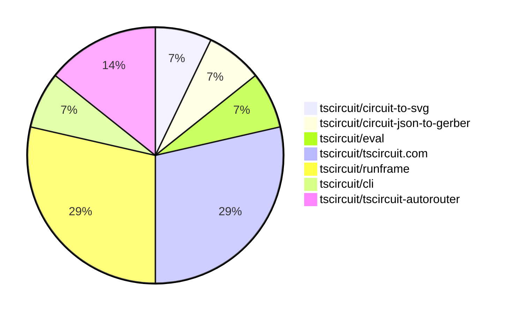

# Contribution Overview 2025-05-07

## PRs by Repository

## Contributor Overview

| Contributor | 🐳 Major | 🐙 Minor | 🐌 Tiny | ⭐ | Issues Created | Discussion Contributions |
|-------------|---------|---------|---------|-----|----------------|--------------------------|
| [seveibar](#seveibar) | 2 | 0 | 0 | ⭐⭐ | 4 | 0🔹 0🔶 0💎 |
| [imrishabh18](#imrishabh18) | 0 | 6 | 1 | ⭐⭐ | 1 | 0🔹 0🔶 0💎 |
| [ArnavK-09](#ArnavK-09) | 1 | 1 | 1 | ⭐ | 0 | 0🔹 0🔶 0💎 |
| [ShiboSoftwareDev](#ShiboSoftwareDev) | 0 | 1 | 0 | ⭐ | 7 | 0🔹 0🔶 0💎 |
| [Anshgrover23](#Anshgrover23) | 0 | 1 | 0 |  | 0 | 0🔹 0🔶 0💎 |

### Discussion Contribution Legend

- 🔹 Participating: Basic participation with minimal effort
- 🔶 Very Active: Thoughtful participation that adds value
- 💎 Extremely Active: Exceptional participation with high-quality content

## Review Table

[reviews-received-hover]: ## "Number of reviews received for PRs for this contributor"
[approvals-received-hover]: ## "Number of approvals received for PRs this contributor authored"
[rejections-received-hover]: ## "Number of rejections received for PRs this contributor authored"
[prs-opened-hover]: ## "Number of PRs opened by this contributor"
[issues-created-hover]: ## "Number of issues created by this contributor"
[bountied-issues-hover]: ## "Number of issues this contributor created with a bounty"
[bountied-issue-$-hover]: ## "Total bounty amount placed on issues authored by this contributor"

| Contributor | Reviews Received | Approvals Received | Rejections Received | Approvals | Rejections | PRs Opened | PRs Merged | Issues Created | Bountied Issues | Bountied Issue $ |
|---|---|---|---|---|---|---|---|---|---|---|
| [ArnavK-09](#ArnavK-09) | 7 | 5 | 0 | 1 | 0 | 7 | 3 | 0 | 0 | 0 |
| [seveibar](#seveibar) | 0 | 0 | 0 | 6 | 0 | 2 | 2 | 4 | 1 | 20 |
| [ShiboSoftwareDev](#ShiboSoftwareDev) | 3 | 1 | 0 | 0 | 0 | 2 | 1 | 7 | 2 | 33 |
| [graphite-app[bot]](#graphite-app[bot]) | 0 | 0 | 0 | 0 | 0 | 0 | 0 | 0 | 0 | 0 |
| [imrishabh18](#imrishabh18) | 3 | 2 | 0 | 2 | 0 | 7 | 7 | 1 | 1 | 2 |
| [Anshgrover23](#Anshgrover23) | 2 | 1 | 0 | 0 | 0 | 1 | 1 | 0 | 0 | 0 |

## Changes by Repository

### [tscircuit/circuit-to-svg](https://github.com/tscircuit/circuit-to-svg)

| PR # | Impact | Contributor | Description | Milestone Aligned |
|------|--------|-------------|-------------|-------------------|
| [#211](https://github.com/tscircuit/circuit-to-svg/pull/211) | 🐙 Minor | ShiboSoftwareDev | Change the pin1 indicator to be a filled up triangle instead of a notch. | ✅ |

### [tscircuit/circuit-json-to-gerber](https://github.com/tscircuit/circuit-json-to-gerber)

| PR # | Impact | Contributor | Description | Milestone Aligned |
|------|--------|-------------|-------------|-------------------|
| [#31](https://github.com/tscircuit/circuit-json-to-gerber/pull/31) | 🐳 Major | ArnavK-09 | Add support for pill-shaped elements in the Gerber aperture generation process. | ✅ |

### [tscircuit/eval](https://github.com/tscircuit/eval)

| PR # | Impact | Contributor | Description | Milestone Aligned |
|------|--------|-------------|-------------|-------------------|
| [#274](https://github.com/tscircuit/eval/pull/274) | 🐙 Minor | ArnavK-09 | Update GitHub Actions workflows to use latest versions of `actions/checkout` and `oven-sh/setup-bun`. | ✅ |

### [tscircuit/tscircuit.com](https://github.com/tscircuit/tscircuit.com)

| PR # | Impact | Contributor | Description | Milestone Aligned |
|------|--------|-------------|-------------|-------------------|
| [#1047](https://github.com/tscircuit/tscircuit.com/pull/1047) | 🐙 Minor | imrishabh18 | Update the @tscircuit/runframe dependency to version 0.0.415 | ✅ |
| [#1039](https://github.com/tscircuit/tscircuit.com/pull/1039) | 🐙 Minor | imrishabh18 | Add a fake implementation for the `/packages/list_trending` endpoint in the testing environment. | ❌ |
| [#1037](https://github.com/tscircuit/tscircuit.com/pull/1037) | 🐌 Tiny | ArnavK-09 | Updates the `circuit-json-to-gerber` dependency to version 0.0.18. | ✅ |
| [#1035](https://github.com/tscircuit/tscircuit.com/pull/1035) | 🐌 Tiny | imrishabh18 | Update the version of the "@tscircuit/runframe" dependency from 0.0.403 to 0.0.412. | ✅ |

### [tscircuit/runframe](https://github.com/tscircuit/runframe)

| PR # | Impact | Contributor | Description | Milestone Aligned |
|------|--------|-------------|-------------|-------------------|
| [#562](https://github.com/tscircuit/runframe/pull/562) | 🐙 Minor | imrishabh18 | Send the shipping carrier information to stripe | ✅ |
| [#560](https://github.com/tscircuit/runframe/pull/560) | 🐙 Minor | imrishabh18 | Add edge case cover to show the loading state when fetching quotes | ✅ |
| [#558](https://github.com/tscircuit/runframe/pull/558) | 🐙 Minor | imrishabh18 | Simplify the logic for handling errors and loading states in the `InitialOrder` component. | ✅ |
| [#556](https://github.com/tscircuit/runframe/pull/556) | 🐙 Minor | imrishabh18 | Update the UI and formatting of the order-quote dialog. | ✅ |

### [tscircuit/cli](https://github.com/tscircuit/cli)

| PR # | Impact | Contributor | Description | Milestone Aligned |
|------|--------|-------------|-------------|-------------------|
| [#187](https://github.com/tscircuit/cli/pull/187) | 🐙 Minor | Anshgrover23 | Add a search command to the CLI for querying snippets | ❌ |

### [tscircuit/tscircuit-autorouter](https://github.com/tscircuit/tscircuit-autorouter)

| PR # | Impact | Contributor | Description | Milestone Aligned |
|------|--------|-------------|-------------|-------------------|
| [#114](https://github.com/tscircuit/tscircuit-autorouter/pull/114) | 🐳 Major | seveibar | Introduces a JSON file with detailed information about a capacity mesh node (cn27815) and its port points, including their coordinates and connection names. | ❌ |
| [#113](https://github.com/tscircuit/tscircuit-autorouter/pull/113) | 🐳 Major | seveibar | Adds a new Autorouting Pipeline Debugger header to allow configuring the cache provider, including options for In Memory, Local Storage, and None. | ✅ |

## Changes by Contributor

### [ShiboSoftwareDev](https://github.com/ShiboSoftwareDev)

| PR # | Impact | Description | Milestone Aligned |
|------|--------|-------------|-------------------|
| [#211](https://github.com/tscircuit/circuit-to-svg/pull/211) | 🐙 Minor | Change the pin1 indicator to be a filled up triangle instead of a notch. | ✅ |

### [ArnavK-09](https://github.com/ArnavK-09)

| PR # | Impact | Description | Milestone Aligned |
|------|--------|-------------|-------------------|
| [#31](https://github.com/tscircuit/circuit-json-to-gerber/pull/31) | 🐳 Major | Add support for pill-shaped elements in the Gerber aperture generation process. | ✅ |
| [#274](https://github.com/tscircuit/eval/pull/274) | 🐙 Minor | Update GitHub Actions workflows to use latest versions of `actions/checkout` and `oven-sh/setup-bun`. | ✅ |
| [#1037](https://github.com/tscircuit/tscircuit.com/pull/1037) | 🐌 Tiny | Updates the `circuit-json-to-gerber` dependency to version 0.0.18. | ✅ |

### [imrishabh18](https://github.com/imrishabh18)

| PR # | Impact | Description | Milestone Aligned |
|------|--------|-------------|-------------------|
| [#1047](https://github.com/tscircuit/tscircuit.com/pull/1047) | 🐙 Minor | Update the @tscircuit/runframe dependency to version 0.0.415 | ✅ |
| [#1039](https://github.com/tscircuit/tscircuit.com/pull/1039) | 🐙 Minor | Add a fake implementation for the `/packages/list_trending` endpoint in the testing environment. | ❌ |
| [#562](https://github.com/tscircuit/runframe/pull/562) | 🐙 Minor | Send the shipping carrier information to stripe | ✅ |
| [#560](https://github.com/tscircuit/runframe/pull/560) | 🐙 Minor | Add edge case cover to show the loading state when fetching quotes | ✅ |
| [#558](https://github.com/tscircuit/runframe/pull/558) | 🐙 Minor | Simplify the logic for handling errors and loading states in the `InitialOrder` component. | ✅ |
| [#556](https://github.com/tscircuit/runframe/pull/556) | 🐙 Minor | Update the UI and formatting of the order-quote dialog. | ✅ |
| [#1035](https://github.com/tscircuit/tscircuit.com/pull/1035) | 🐌 Tiny | Update the version of the "@tscircuit/runframe" dependency from 0.0.403 to 0.0.412. | ✅ |

### [Anshgrover23](https://github.com/Anshgrover23)

| PR # | Impact | Description | Milestone Aligned |
|------|--------|-------------|-------------------|
| [#187](https://github.com/tscircuit/cli/pull/187) | 🐙 Minor | Add a search command to the CLI for querying snippets | ❌ |

### [seveibar](https://github.com/seveibar)

| PR # | Impact | Description | Milestone Aligned |
|------|--------|-------------|-------------------|
| [#114](https://github.com/tscircuit/tscircuit-autorouter/pull/114) | 🐳 Major | Introduces a JSON file with detailed information about a capacity mesh node (cn27815) and its port points, including their coordinates and connection names. | ❌ |
| [#113](https://github.com/tscircuit/tscircuit-autorouter/pull/113) | 🐳 Major | Adds a new Autorouting Pipeline Debugger header to allow configuring the cache provider, including options for In Memory, Local Storage, and None. | ✅ |

